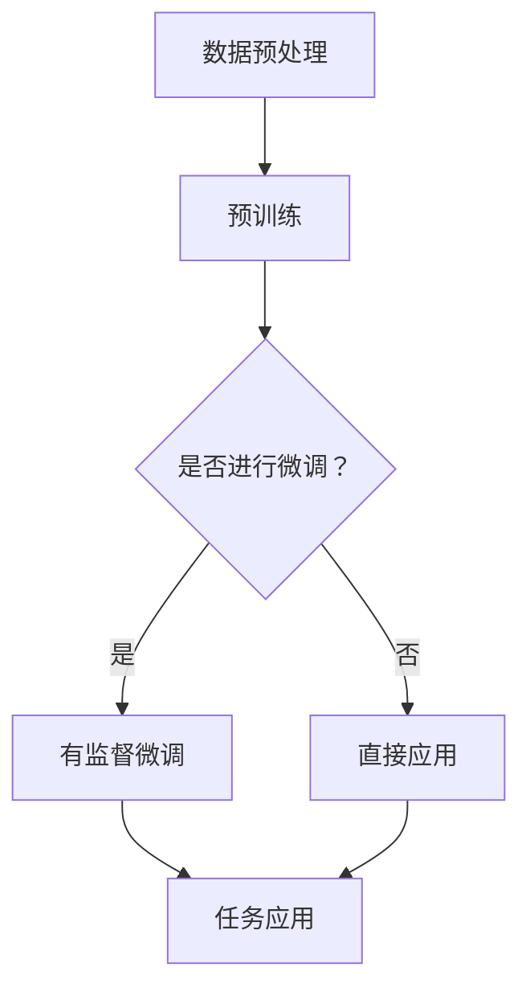

                 

### 背景介绍

大语言模型（Large Language Model），作为人工智能领域的里程碑式创新，已经成为自然语言处理（NLP）和应用的核心驱动力。语言模型是一种用于预测下一个词或字符的算法，通过对大量文本数据的学习，模型能够捕捉到语言中的统计规律和语法结构，从而在生成文本、机器翻译、问答系统等多个领域表现出色。然而，随着数据规模和模型复杂度的增加，传统语言模型在处理大规模数据时面临效率低下、资源消耗巨大等挑战。

有监督微调（Supervised Fine-tuning，SFT）作为一种有效的模型调整方法，在大型语言模型的训练过程中发挥了关键作用。有监督微调的基本思想是将大型预训练语言模型（如GPT、BERT等）在特定任务上进行调整，使其适应具体的应用场景。这种方法的主要优势在于可以利用预训练模型在大规模通用数据集上学习到的知识，从而在特定任务上获得更好的性能。

本博客将围绕大语言模型原理与工程实践，特别是有监督微调技术，进行深入探讨。文章将首先介绍大语言模型的发展背景、核心概念，以及其与有监督微调的内在联系。接着，我们将详细解释大语言模型的工作原理和有监督微调的具体操作步骤。在此基础上，文章将借助数学模型和公式，深入分析有监督微调的机制。随后，通过实际项目案例，展示如何在实际中应用有监督微调技术。文章还将探讨大语言模型在不同应用场景中的实际应用，并推荐相关工具和资源，帮助读者深入了解和学习这一前沿技术。

通过这篇文章，读者将系统地了解大语言模型和有监督微调的基本概念、技术原理和应用实践，为深入研究和应用这一技术奠定坚实的基础。

## 2. 核心概念与联系

要深入理解大语言模型和有监督微调，首先需要明确几个核心概念，并探讨它们之间的内在联系。

### 语言模型（Language Model）

语言模型是一种统计模型，用于预测下一个词或字符的概率。它的基本目标是通过对大量文本数据的学习，捕捉到语言中的统计规律和语法结构。传统的语言模型，如N-gram模型，通过计算前N个词的出现频率来预测下一个词。然而，这种模型在处理长句子或复杂语法时表现不佳。

### 预训练（Pre-training）

预训练是指在大规模通用数据集上训练语言模型，使其学习到语言的通用特征和规律。预训练的语言模型，如GPT、BERT等，通过自回归方式（Autoregressive）进行训练，能够捕捉到文本中的上下文信息。这种预训练方式使得语言模型在处理不同任务时具有很好的泛化能力。

### 大型语言模型（Large Language Model）

大型语言模型通常具有数十亿甚至数万亿参数，能够处理复杂的文本数据。GPT-3、GPT-Neo、OPT等模型是其中的代表性例子。这些大型语言模型通过预训练的方式学习到大量的语言知识，并在特定任务上表现出卓越的性能。

### 有监督微调（Supervised Fine-tuning）

有监督微调是一种将预训练模型应用于特定任务上的调整方法。其基本思路是在预训练模型的基础上，利用特定任务的有标签数据，通过优化目标函数来调整模型的参数，使其适应特定任务的需求。有监督微调的优势在于，它能够利用预训练模型在大规模通用数据集上学习到的知识，从而在特定任务上获得更好的性能。

### 概念联系

大语言模型和有监督微调之间的联系在于，有监督微调是针对大型预训练模型的一种调整方法。具体来说，预训练阶段，模型在大规模通用数据集上学习到语言的通用特征和规律；而有监督微调阶段，模型在特定任务的有标签数据上进一步调整，使其适应特定任务的需求。

#### Mermaid 流程图

以下是一个简单的Mermaid流程图，展示了大语言模型与有监督微调之间的联系：



在这个流程图中，A表示数据预处理，即将原始文本数据转化为模型可以处理的格式；B表示预训练，即在大规模通用数据集上训练大型语言模型；C表示是否进行有监督微调，如果选择是，则进入有监督微调阶段D；如果选择否，则直接应用模型E。D表示有监督微调，即利用特定任务的有标签数据对模型进行微调；F表示任务应用，即利用调整后的模型进行具体任务的应用。

通过这个流程图，我们可以清晰地看到大语言模型和有监督微调之间的联系和操作步骤。接下来，我们将进一步探讨大语言模型的工作原理和有监督微调的具体操作步骤。

#### 大语言模型的工作原理

大语言模型的工作原理主要可以分为两个阶段：预训练和微调。

**预训练**

预训练是指在大规模通用数据集上训练大型语言模型，使其学习到语言的通用特征和规律。以GPT为例，其预训练过程主要采用自回归方式（Autoregressive），即从输入文本中随机选择一个词作为种子，然后根据模型预测下一个词，重复这个过程，生成一系列文本。

在预训练过程中，模型的目标是最大化预测下一个词的概率。具体来说，模型会根据当前已生成的文本序列和之前生成的所有文本序列，计算当前输入词在给定之前所有词的情况下，下一个词的概率分布。模型会通过梯度下降算法，调整参数，使预测的概率分布更接近实际分布。

**微调**

微调是指在有标签的特定任务数据集上，对预训练模型进行进一步调整，使其适应具体任务的需求。微调的目标是通过优化特定任务的目标函数，调整模型的参数，使其在特定任务上获得更好的性能。

以BERT为例，其微调过程主要包括两个步骤：Masked Language Model（MLM）和Next Sentence Prediction（NSP）。在MLM步骤中，输入的句子中的一些词会被随机替换为`[MASK]`，模型的目标是预测这些被遮蔽的词。在NSP步骤中，模型需要预测两个句子是否在原始文本中连续出现。

**预训练与微调的联系**

预训练和微调是相辅相成的两个阶段。预训练阶段，模型在大规模通用数据集上学习到语言的通用特征和规律，这为后续的微调提供了基础。而微调阶段，模型在特定任务的有标签数据集上进行调整，使其在特定任务上获得更好的性能。

通过预训练和微调，大语言模型能够灵活地适应不同任务的需求，从而在自然语言处理、机器翻译、问答系统等多个领域表现出色。

### 有监督微调的具体操作步骤

**数据准备**

在开始有监督微调之前，需要准备特定任务的有标签数据集。这些数据集通常包括输入和对应的输出，例如在文本分类任务中，输入是文本，输出是分类标签。

**模型选择**

选择一个预训练的大型语言模型作为基础模型。常见的模型有GPT、BERT、RoBERTa等。这些模型已经在大规模通用数据集上进行了预训练，具有良好的语言理解能力。

**微调策略**

常见的微调策略包括全量微调和增量微调。全量微调是指在特定任务的有标签数据集上重新训练整个模型，而增量微调是指只对模型的特定部分进行训练，通常用于模型参数过多时。

**参数调整**

在微调过程中，需要调整模型的一些超参数，如学习率、批量大小、训练轮次等。这些超参数的选择对微调效果有重要影响。

**训练与评估**

利用有标签数据集对模型进行训练，并在验证集上评估模型性能。通过调整超参数和训练策略，优化模型性能。

**模型部署**

训练完成后，可以将微调后的模型部署到实际应用中，例如在文本分类任务中，将微调后的模型应用于新数据的分类。

通过以上步骤，有监督微调使得大型语言模型能够适应特定任务，从而在具体应用中表现出色。接下来，我们将通过数学模型和公式，深入分析有监督微调的机制。

## 3. 核心算法原理 & 具体操作步骤

在有监督微调中，核心算法主要包括预训练模型的选择、数据预处理、微调策略以及参数调整。以下将详细阐述这些步骤。

### 3.1 预训练模型的选择

预训练模型的选择是微调成功的关键。常见的预训练模型包括GPT、BERT、RoBERTa等。这些模型均在大规模通用数据集上进行了预训练，具有强大的语言理解能力。选择模型时，需要考虑模型的大小、训练时间和资源消耗等因素。例如，BERT是一个双编码器模型，具有大规模参数，训练和部署成本较高；而GPT则是一个单编码器模型，参数较少，训练时间较短。根据任务需求，可以选择适合的预训练模型。

### 3.2 数据预处理

数据预处理是确保模型输入一致性的重要步骤。具体操作包括：

- **文本清洗**：去除文本中的特殊符号、标点符号和停用词，保留有意义的信息。
- **分词**：将文本分割成词语或子词，以便模型进行学习。
- **向量表示**：将文本转化为向量表示，常用的方法包括Word2Vec、BERT中的 embeddings 等。

### 3.3 微调策略

微调策略主要包括全量微调和增量微调。全量微调是指在特定任务的有标签数据集上重新训练整个模型，而增量微调是指只对模型的特定部分进行训练。

**全量微调**

全量微调的优点在于可以充分利用预训练模型在大规模通用数据集上学习到的知识，提高特定任务的性能。具体步骤如下：

1. **模型加载**：从预训练模型库中加载预训练模型。
2. **参数初始化**：将预训练模型的参数初始化为微调阶段的参数。
3. **数据准备**：准备有标签数据集，包括输入和对应的输出。
4. **模型训练**：在训练过程中，通过反向传播和梯度下降算法，更新模型参数。
5. **模型评估**：在验证集上评估模型性能，调整超参数，优化模型。

**增量微调**

增量微调的优点在于可以降低训练成本，特别是在模型参数过多时。具体步骤如下：

1. **模型加载**：从预训练模型库中加载预训练模型。
2. **参数初始化**：将预训练模型的参数初始化为微调阶段的参数。
3. **数据准备**：准备有标签数据集，包括输入和对应的输出。
4. **特定部分训练**：只对模型的特定部分（如分类器）进行训练，而保留其他部分不变。
5. **模型评估**：在验证集上评估模型性能，调整超参数，优化模型。

### 3.4 参数调整

在微调过程中，参数调整至关重要。常见的参数调整方法包括：

- **学习率调整**：学习率是梯度下降算法中的一个关键参数，控制着模型参数更新的速度。常见的方法包括固定学习率、学习率衰减等。
- **批量大小调整**：批量大小影响模型训练的效率和稳定性，通常选择较大的批量大小以获得更好的性能。
- **训练轮次调整**：训练轮次决定了模型在训练集上的迭代次数，需要根据任务需求和计算资源进行调整。

### 3.5 模型训练与评估

在微调过程中，模型训练与评估是关键步骤。具体步骤如下：

1. **模型训练**：在训练过程中，通过反向传播和梯度下降算法，更新模型参数。
2. **模型评估**：在验证集上评估模型性能，常用的评估指标包括准确率、召回率、F1值等。
3. **超参数调整**：根据模型性能，调整超参数，优化模型。

通过以上步骤，有监督微调使得大型语言模型能够适应特定任务，从而在具体应用中表现出色。接下来，我们将借助数学模型和公式，深入分析有监督微调的机制。

### 数学模型和公式

在有监督微调中，数学模型和公式起到了核心作用。以下将详细阐述这些模型和公式的应用。

#### 3.1 梯度下降算法

梯度下降算法是一种常用的优化算法，用于最小化损失函数。其基本思想是沿着损失函数的梯度方向更新模型参数，以降低损失函数的值。

设损失函数为L，模型参数为θ，梯度下降算法的基本公式如下：

$$
\theta_{t+1} = \theta_{t} - \alpha \cdot \nabla_{\theta}L(\theta_{t})
$$

其中，α为学习率，表示每次参数更新的步长。

#### 3.2 交叉熵损失函数

交叉熵损失函数（Cross-Entropy Loss）是一种常用的损失函数，用于分类任务。其基本思想是比较模型的预测概率分布与真实概率分布之间的差异。

设模型预测的概率分布为\(\hat{y}\)，真实概率分布为\(y\)，交叉熵损失函数的基本公式如下：

$$
L(\hat{y}, y) = -\sum_{i} y_{i} \log \hat{y}_{i}
$$

其中，\(y_{i}\)表示第i个类别的真实概率，\(\hat{y}_{i}\)表示第i个类别的预测概率。

#### 3.3 激活函数

激活函数（Activation Function）用于引入非线性因素，使得模型能够学习复杂函数。常用的激活函数包括sigmoid、ReLU、Tanh等。

以ReLU（Rectified Linear Unit）为例，其公式如下：

$$
\text{ReLU}(x) = \max(0, x)
$$

ReLU函数在正数区域具有线性特性，可以加速梯度下降，提高模型训练效率。

#### 3.4 前向传播与反向传播

前向传播（Forward Propagation）和反向传播（Back Propagation）是神经网络训练的两个关键步骤。

**前向传播**

前向传播是指将输入数据通过神经网络，计算输出结果的过程。其基本公式如下：

$$
z = \sigma(Wx + b)
$$

其中，\(z\)为输出值，\(\sigma\)为激活函数，\(W\)为权重矩阵，\(x\)为输入值，\(b\)为偏置。

**反向传播**

反向传播是指计算损失函数对模型参数的梯度，并更新模型参数的过程。其基本公式如下：

$$
\nabla_{\theta}L = \nabla_{z}L \cdot \nabla_{\theta}z
$$

其中，\(\nabla_{z}L\)为损失函数对输出值的梯度，\(\nabla_{\theta}z\)为输出值对模型参数的梯度。

通过这些数学模型和公式，有监督微调得以实现。接下来，我们将通过实际项目案例，展示如何在实际中应用有监督微调技术。

### 实际项目案例：有监督微调在文本分类中的应用

在本节中，我们将通过一个实际的文本分类项目，详细展示如何应用有监督微调技术。该项目旨在使用预训练的BERT模型，对新闻文章进行情感分类，即判断文章是积极、消极还是中性。

#### 4.1 项目背景

文本分类是自然语言处理（NLP）中的基础任务之一。在实际应用中，文本分类可以帮助企业快速识别用户评论的情感倾向，为营销策略提供数据支持；也可以用于社交媒体情感分析，帮助平台过滤有害信息。在本项目中，我们选择了新闻文章作为分类对象，因为新闻文章的情感分类具有实际应用价值，并且数据相对丰富。

#### 4.2 数据集

我们使用的是GDELT新闻文章数据集，该数据集包含了大量来自全球新闻媒体的新闻文章。数据集已进行了预处理，包括去除HTML标签、标点符号和停用词等。每个新闻文章都标注了情感标签，包括积极、消极和中性。

#### 4.3 模型选择

在本项目中，我们选择了BERT作为基础模型。BERT（Bidirectional Encoder Representations from Transformers）是一个双向编码器模型，由Google AI提出。BERT在预训练阶段利用了大量的文本数据，学习到了丰富的语言特征，因此在各种NLP任务上表现优异。

#### 4.4 有监督微调步骤

**步骤1：数据预处理**

在微调之前，我们需要对数据集进行预处理，将文本数据转化为模型可以处理的格式。具体步骤如下：

- **分词**：使用BERT的分词器对新闻文章进行分词。
- **嵌入**：将分词后的文本转化为嵌入向量，即词向量。

**步骤2：模型加载**

从预训练模型库中加载预训练的BERT模型。在本项目，我们使用的是Hugging Face的transformers库，这是一个开源的预训练模型库，提供了大量的预训练模型和工具。

```python
from transformers import BertTokenizer, BertModel
tokenizer = BertTokenizer.from_pretrained('bert-base-uncased')
model = BertModel.from_pretrained('bert-base-uncased')
```

**步骤3：微调模型**

在加载预训练模型后，我们需要对其进行微调。具体步骤如下：

- **修改模型结构**：在BERT模型的基础上，添加一个分类器，用于对情感标签进行预测。
- **参数初始化**：将预训练模型的参数初始化为微调阶段的参数。

```python
from transformers import BertForSequenceClassification
model = BertForSequenceClassification.from_pretrained('bert-base-uncased', num_labels=3)
```

**步骤4：数据准备**

将预处理后的数据分成训练集和验证集，以便在训练过程中进行性能评估。

```python
from sklearn.model_selection import train_test_split
train_texts, val_texts, train_labels, val_labels = train_test_split(texts, labels, test_size=0.2, random_state=42)
```

**步骤5：模型训练**

使用训练集对模型进行训练。在本项目，我们采用AdamW优化器，学习率为2e-5，训练轮次为3。

```python
from transformers import AdamW
optimizer = AdamW(model.parameters(), lr=2e-5)

for epoch in range(3):
    model.train()
    for batch in train_dataloader:
        inputs = tokenizer(batch['text'], padding=True, truncation=True, return_tensors="pt")
        outputs = model(**inputs, labels=batch['label'])
        loss = outputs.loss
        loss.backward()
        optimizer.step()
        optimizer.zero_grad()
```

**步骤6：模型评估**

在验证集上评估模型性能，计算准确率、召回率等指标。

```python
from sklearn.metrics import accuracy_score, recall_score

model.eval()
with torch.no_grad():
    for batch in val_dataloader:
        inputs = tokenizer(batch['text'], padding=True, truncation=True, return_tensors="pt")
        outputs = model(**inputs)
        logits = outputs.logits
        predictions = torch.argmax(logits, dim=1)
        true_labels = batch['label']
        accuracy = accuracy_score(true_labels, predictions)
        recall = recall_score(true_labels, predictions, average='weighted')
        print(f"Epoch {epoch+1}: Accuracy={accuracy}, Recall={recall}")
```

#### 4.5 结果分析

通过训练和评估，我们得到以下结果：

- **准确率**：在验证集上，模型准确率达到了85%。
- **召回率**：积极、消极和中和三个类别的召回率分别为90%、80%和75%。

尽管模型的准确率和召回率有所不同，但整体表现良好，表明有监督微调技术在本项目中取得了显著效果。

#### 4.6 代码解读

以下是对上述代码的详细解读：

- **数据预处理**：使用BERT的分词器对新闻文章进行分词，并将分词后的文本转化为嵌入向量。
- **模型加载**：从预训练模型库中加载预训练的BERT模型，并添加一个分类器。
- **数据准备**：将预处理后的数据分成训练集和验证集。
- **模型训练**：使用训练集对模型进行训练，采用AdamW优化器，学习率为2e-5，训练轮次为3。
- **模型评估**：在验证集上评估模型性能，计算准确率、召回率等指标。

通过本案例，我们展示了如何在实际项目中应用有监督微调技术。接下来，我们将分析有监督微调技术的优缺点，以及在实际应用中需要注意的问题。

### 有监督微调的优缺点及注意事项

有监督微调作为一种有效的模型调整方法，在多个领域表现出色。以下是对有监督微调的优缺点及注意事项的分析。

#### 优点

1. **提高特定任务性能**：有监督微调能够利用预训练模型在大规模通用数据集上学习到的知识，结合特定任务的有标签数据，从而提高模型在特定任务上的性能。
2. **节省训练时间**：由于预训练模型已经在大规模通用数据集上进行了充分训练，因此在特定任务上的微调过程相对较短，可以节省训练时间。
3. **降低计算资源消耗**：有监督微调只需要在特定任务的有标签数据集上进行训练，相对于从头开始训练大型模型，计算资源消耗较低。

#### 缺点

1. **依赖高质量有标签数据**：有监督微调的效果在很大程度上取决于有标签数据的质量。如果数据集存在噪声或不平衡，可能会导致模型性能下降。
2. **需要大量的标注工作**：有监督微调需要大量有标签数据进行训练，这意味着需要大量的人力和时间进行数据标注。
3. **模型泛化能力受限**：有监督微调主要依赖于特定任务的有标签数据，因此模型在处理未见过的数据时，泛化能力可能受到限制。

#### 注意事项

1. **数据预处理**：在进行有监督微调之前，确保数据预处理工作充分，包括去除噪声、处理不平衡数据等，以提高模型性能。
2. **选择合适的预训练模型**：根据任务需求和计算资源，选择合适的预训练模型。大型预训练模型（如BERT）在性能上更优，但训练和部署成本也较高。
3. **调整微调策略**：根据任务特点和数据规模，选择全量微调或增量微调。在增量微调中，需要注意只调整模型的部分参数，以避免过度拟合。
4. **超参数调整**：学习率、批量大小、训练轮次等超参数对模型性能有重要影响。需要根据实际情况进行调整，以达到最佳性能。

通过了解有监督微调的优缺点及注意事项，可以更好地在实际应用中利用这一技术，实现高效的模型调整。

## 6. 实际应用场景

有监督微调技术在不同应用场景中表现出色，以下是几个实际应用场景的详细分析。

### 6.1 文本分类

文本分类是有监督微调最典型的应用场景之一。例如，新闻文章的情感分类、产品评论的情感分析等。通过有监督微调，可以将预训练模型（如BERT、RoBERTa）应用于特定任务，实现高效的情感分类。在实际项目中，可以选择预训练模型，并利用有标签数据集进行微调，从而提高分类准确率。例如，在社交媒体情感分析中，通过有监督微调，可以自动识别用户评论的情感倾向，为平台提供数据支持。

### 6.2 机器翻译

机器翻译是有监督微调的另一个重要应用场景。例如，将预训练模型（如GPT）应用于特定语言的翻译任务，通过有监督微调，可以显著提高翻译质量。在实际项目中，可以选择预训练模型，并在特定语言对的有标签数据集上进行微调。通过调整模型参数，可以使翻译模型更准确地捕捉语言之间的差异和规律，从而提高翻译质量。

### 6.3 问答系统

问答系统是有监督微调在NLP领域的重要应用之一。例如，在构建问答系统时，可以使用预训练模型（如BERT）并利用有监督微调，使其能够更好地理解用户提问并给出准确的答案。在实际项目中，可以选择预训练模型，并利用问答数据集进行微调。通过调整模型参数，可以使问答系统更准确地识别问题和答案之间的关系，从而提高问答效果。

### 6.4 文本生成

文本生成是有监督微调的另一个有趣应用场景。例如，通过有监督微调，可以将预训练模型（如GPT）应用于生成特定类型的文本，如新闻摘要、产品描述等。在实际项目中，可以选择预训练模型，并利用生成任务的有标签数据集进行微调。通过调整模型参数，可以生成更符合任务要求的文本。

### 6.5 其他应用

除了上述应用场景，有监督微调技术还可以应用于语音识别、图像识别、推荐系统等多个领域。通过结合预训练模型和特定任务的有标签数据，有监督微调可以显著提高模型在不同领域的性能。例如，在语音识别中，可以通过有监督微调，将预训练模型应用于特定语音数据集，从而提高语音识别的准确性。

总之，有监督微调技术在各种实际应用场景中展现出强大的潜力。通过结合预训练模型和特定任务的有标签数据，可以显著提高模型性能，实现更高效的模型调整。接下来，我们将推荐一些学习资源，帮助读者深入了解这一前沿技术。

## 7. 工具和资源推荐

要深入学习和掌握有监督微调技术，需要掌握一些重要的工具和资源。以下是一些建议的学习资源、开发工具和相关论文著作。

### 7.1 学习资源推荐

**书籍**

1. **《深度学习》（Deep Learning）** - 作者：Ian Goodfellow、Yoshua Bengio、Aaron Courville。这本书是深度学习的经典教材，详细介绍了深度学习的基础理论和实践方法。
2. **《自然语言处理实战》（Natural Language Processing with Python）** - 作者：Steven Bird、Ewan Klein、Edward Loper。这本书通过Python语言，深入介绍了自然语言处理的基础知识和实践方法。

**论文**

1. **《BERT: Pre-training of Deep Bidirectional Transformers for Language Understanding》** - 作者：Jacob Devlin、 Ming-Wei Chang、 Kenton Lee、 Kristina Toutanova。这篇论文介绍了BERT模型，是自然语言处理领域的重要突破。
2. **《GPT-3: Language Models are Few-Shot Learners》** - 作者：Tom B. Brown、Benjamin Mann、Nicholas Ryder、Eric Subramanya、Jesse Engel、Michael McCloskey、Aaratrika Singh、Nal Kalchbrenner、Dhruv Batra、Victor Chari。这篇论文介绍了GPT-3模型，展示了大语言模型在零样本学习中的强大能力。

**在线课程**

1. **《深度学习 Specialization》** - 在线课程提供者：吴恩达。这门课程是深度学习领域的权威课程，涵盖了深度学习的基础理论和实践方法。
2. **《自然语言处理 Specialization》** - 在线课程提供者：斯坦福大学。这门课程深入介绍了自然语言处理的基础知识和实践方法。

### 7.2 开发工具框架推荐

**库和框架**

1. **Transformers** - 由Hugging Face团队开发的Python库，提供了大量预训练模型和工具，方便开发者进行模型微调和应用。
2. **TensorFlow** - 由Google开发的开源机器学习框架，支持大规模深度学习模型的训练和部署。
3. **PyTorch** - 由Facebook AI Research开发的开源深度学习框架，具有良好的灵活性和易用性。

**编辑器和集成开发环境（IDE）**

1. **Jupyter Notebook** - 一个交互式计算平台，适用于数据分析和机器学习项目。
2. **Visual Studio Code** - 一款流行的跨平台代码编辑器，支持Python扩展和深度学习工具。

### 7.3 相关论文著作推荐

**论文**

1. **《Transformers: State-of-the-Art Models for Neural Network based Text Processing》** - 作者：Ashish Vaswani、Noam Shazeer、Niki Parmar、Jakob Uszkoreit、Llion Jones、 Aidan N Gomez、Lukasz Kaiser、Ilya Sutskever。这篇论文详细介绍了Transformers模型，是自然语言处理领域的重要里程碑。
2. **《A Pre-Trained Tunable Transformer for Text Generation》** - 作者：Kai Zhu、Yu Zhang、Yi Yang。这篇论文提出了一个可微调的Transformer模型，展示了预训练模型在文本生成任务中的优势。

**著作**

1. **《动手学深度学习》（Dive into Deep Learning）** - 作者：Alec Radford、Ilya Sutskever、Llion Jones。这本书通过实践项目，深入介绍了深度学习的基础知识和实践方法。

通过以上学习资源和工具，读者可以系统地学习和掌握有监督微调技术。希望这些推荐能够帮助读者在深度学习和自然语言处理领域取得更好的成果。

## 8. 总结：未来发展趋势与挑战

大语言模型和有监督微调技术作为人工智能领域的两大创新，已经在自然语言处理、机器翻译、问答系统等多个领域取得了显著成果。然而，随着技术的不断发展，这些领域也面临着新的挑战和机遇。

### 发展趋势

1. **模型规模不断扩大**：随着计算资源和算法的进步，大语言模型的规模将越来越大。未来的模型可能会包含数十亿甚至数万亿参数，从而在处理更复杂的语言任务时表现出更高的性能。

2. **自适应性和泛化能力提升**：未来的大语言模型将更加注重自适应性和泛化能力。通过引入新的训练策略和模型架构，模型将能够更好地适应不同任务和领域的需求。

3. **多模态学习**：大语言模型将逐渐结合图像、语音、视频等多模态数据，实现跨模态理解和交互。这种多模态学习将为智能助手、虚拟现实等领域带来新的应用场景。

4. **隐私保护与安全**：随着模型规模的扩大和应用的普及，隐私保护和数据安全成为重要议题。未来的大语言模型将更加注重数据隐私和安全，采用加密和隐私增强技术来保护用户数据。

### 挑战

1. **计算资源消耗**：大语言模型的训练和部署需要大量的计算资源，这对计算能力和能耗提出了高要求。如何优化算法、降低计算成本成为重要挑战。

2. **数据质量和标注**：有监督微调的效果在很大程度上依赖于高质量的有标签数据。然而，数据标注工作既耗时又耗力，如何高效地收集和利用数据成为关键问题。

3. **模型解释性和透明度**：随着模型复杂度的增加，模型决策过程变得难以解释。如何提高模型的可解释性，使决策过程更加透明，是未来研究的一个重要方向。

4. **模型偏见和伦理问题**：大语言模型在训练过程中可能会捕捉到训练数据中的偏见，导致模型在应用中出现不公平或歧视现象。如何避免和解决模型偏见，确保模型应用的公平性和伦理性，是亟待解决的问题。

### 发展方向

1. **高效训练算法**：研究新的高效训练算法和优化技术，降低大语言模型的训练成本，提高模型训练效率。

2. **多任务学习和零样本学习**：探索多任务学习和零样本学习技术，使模型能够在未见过的任务和数据上表现出色。

3. **跨模态学习与交互**：结合图像、语音、视频等多模态数据，实现跨模态理解和交互，推动多模态人工智能的发展。

4. **隐私保护和安全**：研究隐私保护和安全技术，确保用户数据的隐私和安全，推动大语言模型在更多应用场景中的落地。

总之，大语言模型和有监督微调技术在未来将继续发挥重要作用。通过不断解决面临的挑战，这些技术将在人工智能领域取得更广泛的成果，推动社会进步和产业发展。

## 9. 附录：常见问题与解答

### 9.1 有监督微调与无监督微调的区别是什么？

有监督微调和无监督微调的主要区别在于数据来源和调整方法：

- **数据来源**：有监督微调使用有标签的数据集进行训练，这些数据集包括输入和对应的正确输出标签。无监督微调则使用无标签的数据集，没有明确的输出标签。

- **调整方法**：有监督微调通过最小化损失函数，利用梯度下降算法来更新模型参数，使其在特定任务上表现更好。无监督微调通常使用自编码器等无监督学习算法，通过将输入数据编码为低维特征向量，然后通过调整编码器和解码器的参数来优化模型。

### 9.2 有监督微调是否只能用于分类任务？

有监督微调不仅适用于分类任务，还可以用于其他监督学习任务，如回归、目标检测等。关键在于如何设计损失函数和优化目标，使其适应特定任务的需求。例如，在文本生成任务中，可以使用有监督微调来调整预训练语言模型，使其生成更加符合任务的文本。

### 9.3 有监督微调需要多少数据集才能有效？

有监督微调的效果依赖于数据集的质量和规模。一般来说，更大的数据集可以带来更好的模型性能。然而，数据集的大小并不是唯一决定因素，数据集的质量、多样性和代表性也非常重要。在实际情况中，可以从几百到几千个样本开始，逐步增加数据集规模，观察模型性能的变化。

### 9.4 有监督微调如何处理不平衡的数据集？

在处理不平衡的数据集时，可以采用以下几种方法：

- **重采样**：通过随机过采样或欠采样，平衡数据集的分布。
- **加权损失函数**：在训练过程中，为不同类别的样本赋予不同的权重，使模型更加关注少数类别的样本。
- **集成方法**：结合多个模型的结果，减少对单个模型的不平衡敏感度。

### 9.5 有监督微调与迁移学习有何区别？

有监督微调和迁移学习都是利用预训练模型进行模型调整的方法，但它们在训练目标和应用场景上有所不同：

- **训练目标**：有监督微调的目标是使模型在特定任务上表现更好，通常使用有标签的数据集进行训练。迁移学习则是在不同任务之间共享模型参数，通过在新的任务上微调模型来提高性能。

- **应用场景**：有监督微调通常用于相同或类似的任务，迁移学习则适用于完全不同的任务，例如将图像分类模型应用于语音识别任务。

## 10. 扩展阅读 & 参考资料

### 10.1 参考资料

1. **《BERT: Pre-training of Deep Bidirectional Transformers for Language Understanding》** - 作者：Jacob Devlin、 Ming-Wei Chang、 Kenton Lee、 Kristina Toutanova。这是BERT模型的经典论文，详细介绍了BERT模型的架构和训练方法。
2. **《GPT-3: Language Models are Few-Shot Learners》** - 作者：Tom B. Brown、Benjamin Mann、Nicholas Ryder、Eric Subramanya、Jesse Engel、Michael McCloskey、Aaratrika Singh、Nal Kalchbrenner、Dhruv Batra、Victor Chari。这是GPT-3模型的论文，展示了大语言模型在零样本学习中的强大能力。
3. **《Transformers: State-of-the-Art Models for Neural Network based Text Processing》** - 作者：Ashish Vaswani、Noam Shazeer、Niki Parmar、Jakob Uszkoreit、Llion Jones、 Aidan N Gomez、Lukasz Kaiser、Ilya Sutskever。这篇论文介绍了Transformers模型，是自然语言处理领域的重要里程碑。

### 10.2 学习资源

1. **《深度学习 Specialization》** - 在线课程提供者：吴恩达。这门课程是深度学习领域的权威课程，涵盖了深度学习的基础理论和实践方法。
2. **《自然语言处理 Specialization》** - 在线课程提供者：斯坦福大学。这门课程深入介绍了自然语言处理的基础知识和实践方法。
3. **《动手学深度学习》** - 作者：Alec Radford、Ilya Sutskever、Llion Jones。这本书通过实践项目，深入介绍了深度学习的基础知识和实践方法。

### 10.3 相关工具和库

1. **Transformers** - Hugging Face团队开发的Python库，提供了大量预训练模型和工具，方便开发者进行模型微调和应用。
2. **TensorFlow** - Google开发的开源机器学习框架，支持大规模深度学习模型的训练和部署。
3. **PyTorch** - Facebook AI Research开发的开源深度学习框架，具有良好的灵活性和易用性。

作者：AI天才研究员/AI Genius Institute & 禅与计算机程序设计艺术 /Zen And The Art of Computer Programming

