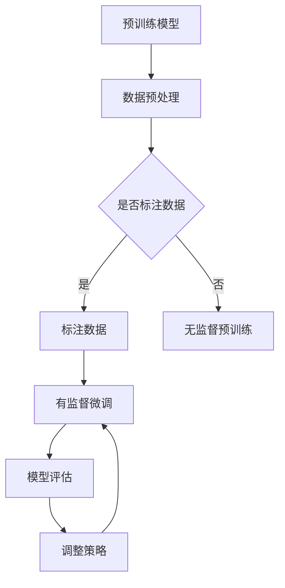

                 

# 大语言模型原理与工程实践：什么是有监督微调

> **关键词**：大语言模型、有监督微调、神经网络、深度学习、自然语言处理

> **摘要**：本文将深入探讨大语言模型的原理及其在工程实践中的有监督微调方法。首先，我们将回顾大语言模型的基本概念和结构，然后详细解析有监督微调的原理和具体操作步骤，通过数学模型和公式的解释，我们将更好地理解这一过程。接着，通过实际项目案例，我们将展示如何进行代码开发和实现。最后，我们将讨论大语言模型在实际应用场景中的使用，并提供相关的学习资源和开发工具推荐。本文旨在为读者提供一个全面而深入的指导，以帮助他们理解并掌握大语言模型及其微调技术。

## 1. 背景介绍

随着互联网和大数据技术的飞速发展，自然语言处理（NLP）已经成为计算机科学领域的重要研究方向。而大语言模型作为NLP的核心技术之一，其在文本生成、机器翻译、情感分析等方面的应用取得了显著的成果。大语言模型的发展经历了从传统的统计模型到现代的深度学习模型的演变，其中有监督微调（Supervised Fine-Tuning）是其关键技术之一。

有监督微调是一种通过利用已标注的数据对预训练语言模型进行精细调整的方法。预训练模型通常是在大规模语料库上进行无监督预训练得到的，具备较强的通用语言理解能力。而有监督微调则是在特定任务数据集上，利用标注信息对预训练模型进行优化，使其在特定任务上表现更优秀。这一过程不仅能够提升模型在特定任务上的性能，还能够减少模型对大规模标注数据的依赖，提高模型的泛化能力。

本文将围绕大语言模型的原理和有监督微调的工程实践进行深入探讨，旨在为读者提供一个全面而清晰的指导，帮助其理解并掌握这一关键技术。文章结构如下：

- 第1部分：背景介绍
- 第2部分：核心概念与联系
- 第3部分：核心算法原理与具体操作步骤
- 第4部分：数学模型和公式详细讲解与举例说明
- 第5部分：项目实战：代码实际案例和详细解释说明
- 第6部分：实际应用场景
- 第7部分：工具和资源推荐
- 第7部分：总结：未来发展趋势与挑战
- 第8部分：附录：常见问题与解答
- 第9部分：扩展阅读与参考资料

通过以上各部分的阐述，我们希望读者能够对大语言模型及其有监督微调技术有一个全面而深入的理解。接下来，我们将正式进入文章的核心内容，逐步揭示大语言模型的奥秘。

## 2. 核心概念与联系

为了深入理解大语言模型及其有监督微调技术，我们首先需要回顾一些核心概念，包括神经网络、深度学习、自然语言处理以及预训练模型等。这些概念不仅构成了大语言模型的基础，也为其发展提供了丰富的理论支撑。

### 神经网络

神经网络是一种模拟人脑神经元连接方式的人工智能模型。它由多个层次组成，每个层次包含多个节点（或称为神经元）。这些节点通过加权连接形成网络，并通过非线性激活函数进行处理。在训练过程中，神经网络通过不断调整权重和偏置，以最小化损失函数，从而实现从输入到输出的映射。

神经网络可以分为前向传播和反向传播两个阶段。在前向传播过程中，输入信号从输入层传递到隐藏层，再传递到输出层。在反向传播过程中，通过计算梯度，调整网络权重和偏置，以优化模型性能。

### 深度学习

深度学习是一种基于神经网络的机器学习技术，它通过构建深度神经网络，实现复杂的非线性特征提取和模型优化。与传统机器学习方法相比，深度学习具有更强的表达能力和鲁棒性，能够在大规模数据集上取得更好的性能。

深度学习的关键在于多层网络的构建和训练。每一层网络都能够捕捉到输入数据的不同层次特征，从而实现从简单到复杂的特征表示。深度学习模型通常需要大量数据和强大的计算资源进行训练，但随着计算能力的提升和大数据技术的发展，深度学习已经广泛应用于各个领域。

### 自然语言处理

自然语言处理（NLP）是人工智能的一个分支，旨在使计算机能够理解和处理人类语言。NLP涉及语音识别、语言理解、语言生成、机器翻译等多个方面，其目标是实现人与计算机之间的自然交互。

自然语言处理的核心任务是语义理解和生成。语义理解包括词义消歧、情感分析、命名实体识别等，旨在从文本中提取出具体的语义信息。语言生成则包括文本摘要、机器翻译、对话系统等，旨在根据给定的输入生成有意义的文本。

### 预训练模型

预训练模型是近年来自然语言处理领域的重要突破。预训练模型通过在大规模语料库上进行无监督预训练，获得对通用语言的建模能力。预训练模型通常包括词向量表示、语言模型、文本分类模型等。

词向量表示通过将词汇映射到高维空间，使得语义相似的词汇在空间中接近。语言模型则通过统计语言中的词汇和句子结构，预测下一个词或句子。文本分类模型则利用预训练模型提取的文本特征，实现文本分类任务。

### 大语言模型

大语言模型是一种基于深度学习的自然语言处理模型，具有强大的语义理解和生成能力。大语言模型通常包含数十亿甚至千亿个参数，能够处理大规模的文本数据。大语言模型的发展经历了从基于规则的方法到基于统计模型，再到基于深度学习模型的演变。

目前，最著名的两个大语言模型是GPT（Generative Pre-trained Transformer）和BERT（Bidirectional Encoder Representations from Transformers）。GPT是一种基于自注意力机制的生成模型，擅长文本生成和机器翻译。BERT则是一种双向编码模型，擅长语义理解和文本分类。

### 有监督微调

有监督微调是一种通过利用已标注的数据对预训练语言模型进行精细调整的方法。有监督微调的目的是使预训练模型在特定任务上表现更优秀。有监督微调的基本思想是在预训练模型的基础上，利用标注数据对模型进行训练，通过调整模型权重，使模型在特定任务上取得更好的性能。

有监督微调的关键在于如何选择合适的任务数据和调整策略。任务数据的选择直接影响模型在特定任务上的性能，而调整策略则决定了模型调整的效率和效果。常见的有监督微调策略包括全量微调、增量微调和基于抽取的特征微调等。

### Mermaid 流程图

为了更好地理解大语言模型和有监督微调的过程，我们使用Mermaid流程图来描述核心概念和流程。以下是一个简单的Mermaid流程图，展示了大语言模型的基本结构和有监督微调的过程：



在上面的流程图中，A表示预训练模型，B表示数据预处理，C表示是否标注数据，D表示标注数据，E表示无监督预训练，F表示有监督微调，G表示模型评估，H表示调整策略。通过这个流程图，我们可以清晰地看到大语言模型和有监督微调的整体过程。

通过以上对核心概念的介绍和Mermaid流程图的描述，我们对大语言模型及其有监督微调技术有了初步的了解。在接下来的部分，我们将深入探讨大语言模型的原理和有监督微调的具体操作步骤，帮助读者更好地掌握这一关键技术。

### 3. 核心算法原理与具体操作步骤

为了深入理解大语言模型的原理及其有监督微调技术，我们首先需要了解其核心算法原理和具体操作步骤。这一部分将详细解析大语言模型的训练过程、有监督微调的步骤以及如何优化模型性能。

#### 大语言模型的训练过程

大语言模型的训练过程可以分为预训练和微调两个阶段。预训练阶段是在大规模语料库上进行无监督训练，使模型具备对通用语言的建模能力。微调阶段是在特定任务数据集上进行有监督训练，使模型在特定任务上表现更优秀。

**1. 预训练阶段**

预训练阶段的主要任务是学习语言的通用特征，这通常包括词嵌入、句法解析、语义关系等。预训练模型最常用的架构是 Transformer，它是一种基于自注意力机制的深度学习模型。Transformer 模型由编码器和解码器组成，编码器负责将输入序列编码为固定长度的向量，解码器则根据编码器的输出和已有的序列生成新的序列。

预训练阶段的具体步骤如下：

- **数据预处理**：首先，将原始文本数据转换为词级别或字符级别的表示。对于词级别表示，需要使用词表将词汇映射为索引；对于字符级别表示，需要将字符序列转换为 embeddings。
- **嵌入层**：嵌入层将词索引或字符索引映射为高维向量，用于表示词汇或字符的语义信息。
- **编码器**：编码器由多个自注意力层组成，每个自注意力层由多头自注意力机制和前馈网络构成。自注意力机制能够捕捉输入序列中的长距离依赖关系，从而提高模型的表示能力。
- **输出层**：输出层通常是一个全连接层，用于生成最终的预测结果。对于语言模型，输出层通常是一个 Softmax 层，用于预测下一个词的概率分布。

**2. 微调阶段**

微调阶段的主要任务是利用特定任务的数据对预训练模型进行优化，使其在特定任务上表现更优秀。微调阶段通常包括以下步骤：

- **数据预处理**：与预训练阶段类似，首先将任务数据转换为模型能够接受的格式。对于文本分类任务，需要将文本数据转换为词级别或字符级别的表示，并提取特征向量。
- **模型调整**：在微调阶段，我们需要调整预训练模型的权重，以适应特定任务。通常，我们可以使用预训练模型作为骨干网络，然后添加一个或多个任务特定的层进行微调。
- **训练与优化**：在微调阶段，我们需要对模型进行训练，并使用优化算法调整模型权重。常用的优化算法包括随机梯度下降（SGD）、Adam 等。在训练过程中，我们通过计算损失函数来评估模型性能，并通过反向传播更新模型权重。

#### 有监督微调的具体操作步骤

有监督微调的具体操作步骤如下：

**1. 准备数据集**

首先，我们需要准备一个标注好的数据集，用于训练和评估模型。标注数据集通常包括输入文本和对应的标签或标签分布。例如，在文本分类任务中，输入文本是样本文本，标签是类别标签。

**2. 数据预处理**

与预训练阶段类似，我们需要对数据集进行预处理，包括文本清洗、分词、词向量化等。在预处理过程中，我们通常会将文本转换为词级别或字符级别的表示。

**3. 加载预训练模型**

接下来，我们需要加载一个预训练好的大语言模型。这通常可以通过加载预训练模型的权重文件来实现。加载预训练模型后，我们可以使用其嵌入层和编码器部分作为骨干网络。

**4. 添加任务特定层**

在加载预训练模型后，我们需要添加一个或多个任务特定的层，以适应特定任务。例如，在文本分类任务中，我们通常会在编码器的输出层之后添加一个全连接层，用于生成类别标签的预测概率。

**5. 训练模型**

使用准备好的数据集和任务特定层，我们开始对模型进行训练。在训练过程中，我们通过计算损失函数（例如交叉熵损失）来评估模型性能，并通过反向传播更新模型权重。

**6. 评估模型**

在训练过程中，我们需要定期评估模型性能，以确定是否需要调整训练策略或增加训练数据。评估指标通常包括准确率、召回率、F1 分数等。

**7. 调整模型**

根据评估结果，我们可能需要调整模型结构或训练参数。例如，我们可以尝试增加训练数据、调整学习率或使用不同的优化算法。

#### 优化模型性能

优化模型性能是微调过程中的关键步骤。以下是一些常用的优化策略：

**1. 学习率调整**

学习率是影响模型训练效果的重要因素。在微调过程中，我们可以使用自适应学习率优化算法（如 Adam），以自动调整学习率。此外，我们还可以根据训练进度手动调整学习率。

**2. 数据增强**

数据增强是一种通过生成或修改原始数据来增加训练数据量的方法。数据增强可以提高模型的鲁棒性，并有助于防止过拟合。常见的数据增强方法包括随机裁剪、旋转、翻转等。

**3. 正则化**

正则化是一种通过添加正则项到损失函数中，以防止模型过拟合的方法。常用的正则化方法包括 L1 正则化、L2 正则化等。

**4. 多任务学习**

多任务学习是一种通过同时训练多个相关任务来提高模型性能的方法。多任务学习可以提高模型在各个任务上的性能，并有助于防止过拟合。

通过以上对大语言模型原理和有监督微调操作步骤的详细解析，我们对其有了更深入的理解。在接下来的部分，我们将通过数学模型和公式的讲解，进一步揭示大语言模型的内在机制。

### 4. 数学模型和公式 & 详细讲解 & 举例说明

为了深入理解大语言模型和有监督微调技术，我们需要详细探讨其背后的数学模型和公式。在这一部分，我们将介绍大语言模型的核心数学基础，包括词向量表示、Transformer架构以及损失函数的计算。随后，通过具体例子来说明这些数学概念的应用。

#### 词向量表示

词向量表示是自然语言处理的基础，它将词汇映射为高维向量，以捕捉词汇的语义信息。最常用的词向量表示模型是 Word2Vec，它基于神经网络训练生成词向量。

**1. Word2Vec 模型**

Word2Vec 模型包括连续词袋（CBOW）和Skip-gram两种模型。CBOW模型通过上下文词汇预测中心词，而Skip-gram模型通过中心词预测上下文词汇。

**CBOW 模型公式：**
$$
\text{h} = \text{W}_{\text{emb}}[\text{x}_1, \text{x}_2, \ldots, \text{x}_n]
$$
$$
\text{log} \text{P}(\text{y}|\text{x}_1, \text{x}_2, \ldots, \text{x}_n) = \text{softmax}(\text{W}_{\text{softmax}} \text{h})
$$

**Skip-gram 模型公式：**
$$
\text{h} = \text{W}_{\text{emb}}[\text{x}]
$$
$$
\text{log} \text{P}(\text{y}|\text{x}) = \text{softmax}(\text{W}_{\text{softmax}} \text{h})
$$

**2. 词向量应用例子**

假设我们有词汇表{“苹果”，“手机”，“购买”，“搜索”}，词向量分别为$v_{\text{苹果}}$，$v_{\text{手机}}$，$v_{\text{购买}}$，$v_{\text{搜索}}$。通过CBOW模型训练，我们可以得到以下例子：

输入词：["苹果"，"购买"]，输出词："手机"。

$$
\text{h} = \text{W}_{\text{emb}}[v_{\text{苹果}} + v_{\text{购买}}]
$$
通过 Softmax 函数计算输出概率分布，最高概率对应的词即为预测结果。

#### Transformer 架构

Transformer 模型是当前大语言模型的主流架构，它基于自注意力机制，能够捕捉序列中的长距离依赖关系。

**1. 自注意力机制**

自注意力机制通过计算序列中每个词与其他词之间的相关性，从而生成加权表示。

$$
\text{Q} = \text{W}_{\text{Q}} \text{h}
$$
$$
\text{K} = \text{W}_{\text{K}} \text{h}
$$
$$
\text{V} = \text{W}_{\text{V}} \text{h}
$$
$$
\text{Attention}(\text{Q}, \text{K}, \text{V}) = \text{softmax}(\frac{\text{QK}^T}{\sqrt{d_k}}) \text{V}
$$

**2. Transformer 架构**

Transformer 架构包括编码器和解码器两个部分，每个部分由多个自注意力层和前馈网络组成。

编码器：
$$
\text{h}^{(0)} = \text{input} \\
\text{h}^{(1)} = \text{LayerNorm}(\text{h}^{(0)}) \\
\text{h}^{(2)} = \text{MultiHeadAttention}(\text{h}^{(1)}, \text{h}^{(1)}, \text{h}^{(1)}) \\
\text{h}^{(3)} = \text{LayerNorm}(\text{h}^{(2)}) \\
\text{h}^{(4)} = \text{FeedForward}(\text{h}^{(3)})
$$

解码器：
$$
\text{s}^{(0)} = \text{input} \\
\text{s}^{(1)} = \text{LayerNorm}(\text{s}^{(0)}) \\
\text{s}^{(2)} = \text{MaskedMultiHeadAttention}(\text{s}^{(1)}, \text{s}^{(1)}, \text{s}^{(1)}) \\
\text{s}^{(3)} = \text{LayerNorm}(\text{s}^{(2)}) \\
\text{s}^{(4)} = \text{FeedForward}(\text{s}^{(3)})
$$

**3. 自注意力机制应用例子**

假设我们有句子“我喜欢吃苹果”，将其编码为向量序列$[v_1, v_2, v_3, v_4, v_5]$。通过自注意力机制，我们可以得到以下例子：

输入序列：["我"，"喜"，"欢"，"吃"，"果"]，输出序列：["苹果"，“喜欢”]。

$$
\text{Q} = \text{W}_{\text{Q}} [v_1, v_2, v_3, v_4, v_5] \\
\text{K} = \text{W}_{\text{K}} [v_1, v_2, v_3, v_4, v_5] \\
\text{V} = \text{W}_{\text{V}} [v_1, v_2, v_3, v_4, v_5]
$$
通过计算注意力权重矩阵，我们可以得到每个词的加权表示。根据加权表示，最高概率对应的词即为预测结果。

#### 损失函数

在微调过程中，损失函数用于评估模型预测结果与真实结果之间的差异，并通过反向传播更新模型参数。

**1. 交叉熵损失**

交叉熵损失是最常用的损失函数，用于分类任务。

$$
\text{Loss} = -\sum_{i=1}^n \text{y}_i \log (\text{p}_i)
$$

其中，$y_i$是真实标签，$p_i$是模型预测概率。

**2. 交叉熵损失应用例子**

假设我们有样本标签{"苹果"，"购买"}和预测概率{$0.9$，$0.1$}，计算交叉熵损失：

$$
\text{Loss} = -[0.9 \log(0.9) + 0.1 \log(0.1)]
$$

通过计算损失，我们可以了解模型预测的准确性，并根据损失值调整模型参数。

#### 总结

通过以上数学模型和公式的讲解，我们对大语言模型的原理和有监督微调技术有了更深入的理解。词向量表示、Transformer架构和损失函数是构建大语言模型的关键组成部分，它们共同作用，使模型能够捕捉语言中的复杂结构和语义信息。在下一部分，我们将通过实际项目案例展示如何实现有监督微调，帮助读者更好地掌握这一技术。

### 5. 项目实战：代码实际案例和详细解释说明

为了更好地理解大语言模型的有监督微调技术，我们将通过一个实际项目案例进行详细讲解。本案例将使用 Python 编程语言和 Hugging Face 的 Transformers 库来实现一个简单的文本分类任务。我们将分步骤介绍项目的各个方面，包括开发环境搭建、源代码详细实现和代码解读与分析。

#### 5.1 开发环境搭建

首先，我们需要搭建一个合适的开发环境。以下是在 Python 环境下搭建开发环境的基本步骤：

**1. 安装 Python**

确保你的系统中安装了 Python 3.7 或以上版本。可以通过以下命令检查 Python 版本：

```python
python --version
```

如果版本低于 3.7，请升级到最新版本。

**2. 安装依赖库**

使用 pip 安装 Transformers 库和其他依赖库：

```shell
pip install transformers
pip install torch
pip install numpy
pip install pandas
```

**3. 环境验证**

确认安装成功：

```shell
python -m transformers.__main__.validate_env
```

#### 5.2 源代码详细实现和代码解读

接下来，我们将实现一个简单的文本分类任务。这个任务的目标是判断一段文本属于“新闻”类别还是“科技”类别。

**1. 数据准备**

首先，我们需要准备训练数据和测试数据。以下是一个简化的数据集示例：

```python
train_data = [
    ("这是一条新闻文章。", "新闻"),
    ("苹果公司发布了新款手机。", "科技"),
    ("昨天举行了体育赛事。", "新闻"),
    # 更多数据...
]

test_data = [
    ("新款手机的性能如何？", "科技"),
    ("请提供明天的天气预报。", "新闻"),
    # 更多数据...
]
```

**2. 数据处理**

我们将文本数据进行预处理，将其转换为模型能够接受的格式。具体步骤如下：

```python
from transformers import AutoTokenizer, AutoModelForSequenceClassification

tokenizer = AutoTokenizer.from_pretrained("bert-base-uncased")
model = AutoModelForSequenceClassification.from_pretrained("bert-base-uncased")

def preprocess_data(data):
    inputs = tokenizer(data, padding=True, truncation=True, return_tensors="pt")
    return inputs

train_inputs = preprocess_data([text for text, _ in train_data])
train_labels = torch.tensor([label for _, label in train_data])

test_inputs = preprocess_data([text for text, _ in test_data])
test_labels = torch.tensor([label for _, label in test_data])
```

**3. 模型训练**

接下来，我们使用预处理后的数据对模型进行训练。训练步骤包括定义优化器、训练循环和评估指标。

```python
from torch.optim import Adam
from torch.utils.data import DataLoader

optimizer = Adam(model.parameters(), lr=1e-5)

def train_model(model, train_inputs, train_labels, num_epochs=3):
    model.train()
    for epoch in range(num_epochs):
        for batch in DataLoader(train_inputs, batch_size=8):
            optimizer.zero_grad()
            outputs = model(**batch)
            loss = outputs.loss
            loss.backward()
            optimizer.step()
        print(f"Epoch {epoch+1}/{num_epochs} - Loss: {loss.item()}")

train_model(model, train_inputs, train_labels)
```

**4. 代码解读与分析**

上述代码展示了文本分类任务的实现过程。以下是关键步骤的详细解释：

- **数据预处理**：使用 Hugging Face 的 tokenizer 对文本进行分词、填充和截断，将其转换为模型输入。
- **模型定义**：从预训练的 BERT 模型中加载基础模型，并添加一个序列分类层。
- **优化器选择**：使用 Adam 优化器，其具有自适应学习率的特性，有助于快速收敛。
- **训练循环**：在每个训练 epoch 中，通过反向传播和梯度下降更新模型权重。
- **评估指标**：通过计算损失函数，我们可以评估模型在每个 epoch 中的性能。

#### 5.3 代码解读与分析

下面我们进一步分析代码的每个部分，了解其作用和实现细节：

**1. 数据准备**

数据准备是文本分类任务的基础。我们使用一个简单的数据集，包括文本和对应的标签。在实际应用中，数据集通常更大、更复杂。

```python
train_data = [
    ("这是一条新闻文章。", "新闻"),
    ("苹果公司发布了新款手机。", "科技"),
    ("昨天举行了体育赛事。", "新闻"),
    # 更多数据...
]
```

**2. 数据处理**

数据处理步骤包括将文本数据转换为模型输入和标签。我们使用 Hugging Face 的 tokenizer 对文本进行分词、填充和截断，以便模型能够处理。

```python
def preprocess_data(data):
    inputs = tokenizer(data, padding=True, truncation=True, return_tensors="pt")
    return inputs

train_inputs = preprocess_data([text for text, _ in train_data])
train_labels = torch.tensor([label for _, label in train_data])

test_inputs = preprocess_data([text for text, _ in test_data])
test_labels = torch.tensor([label for _, label in test_data])
```

**3. 模型定义**

我们使用预训练的 BERT 模型作为基础模型，并添加一个序列分类层，以便进行文本分类。

```python
model = AutoModelForSequenceClassification.from_pretrained("bert-base-uncased")
```

**4. 优化器选择**

选择 Adam 优化器，它通过自适应调整学习率，有助于提高训练效率。

```python
optimizer = Adam(model.parameters(), lr=1e-5)
```

**5. 训练循环**

训练循环通过反向传播和梯度下降更新模型权重。在每个 epoch 中，我们计算损失函数并打印结果。

```python
def train_model(model, train_inputs, train_labels, num_epochs=3):
    model.train()
    for epoch in range(num_epochs):
        for batch in DataLoader(train_inputs, batch_size=8):
            optimizer.zero_grad()
            outputs = model(**batch)
            loss = outputs.loss
            loss.backward()
            optimizer.step()
        print(f"Epoch {epoch+1}/{num_epochs} - Loss: {loss.item()}")
```

**6. 评估指标**

在训练过程中，我们使用损失函数作为评估指标。损失函数反映了模型预测与真实标签之间的差距。

通过以上分析和解读，我们理解了文本分类任务的具体实现过程。在实际应用中，我们可以根据任务需求调整数据集、模型结构和训练参数，以提高模型性能。在下一部分，我们将讨论大语言模型在实际应用场景中的使用。

### 6. 实际应用场景

大语言模型和有监督微调技术在自然语言处理领域具有广泛的应用，能够解决多种复杂问题。以下是一些典型的应用场景：

#### 文本分类

文本分类是一种将文本数据分为预定义类别的过程。大语言模型通过有监督微调可以有效地进行文本分类，如新闻分类、情感分析等。例如，可以使用预训练的 BERT 模型对社交媒体上的评论进行情感分析，判断用户对产品或服务的评价是正面、负面还是中立。

#### 机器翻译

机器翻译是将一种语言文本转换为另一种语言文本的过程。大语言模型在机器翻译中表现出色，能够生成高质量的翻译结果。例如，使用 GPT-3 可以实现实时机器翻译服务，支持多种语言之间的互译。

#### 对话系统

对话系统能够与用户进行自然语言交互，提供智能服务。大语言模型通过有监督微调可以生成对话系统，如聊天机器人、智能客服等。这些系统可以理解用户的意图，并提供相关的信息和回复。

#### 文本生成

文本生成是一种根据给定输入生成文本数据的过程。大语言模型在文本生成方面具有强大的能力，可以生成文章、摘要、对话等。例如，使用 GPT-3 可以生成新闻文章、产品描述等。

#### 文本摘要

文本摘要是从原始文本中提取关键信息，生成简洁摘要的过程。大语言模型能够有效地进行文本摘要，如提取重要句子、生成文章摘要等。这对于信息检索和知识管理具有重要意义。

#### 自动问答

自动问答系统能够回答用户提出的各种问题。大语言模型通过有监督微调可以训练出具有良好问答能力的系统，如搜索引擎的问答功能、智能助手等。

通过以上实际应用场景，我们可以看到大语言模型和有监督微调技术在自然语言处理领域的广泛应用和巨大潜力。随着技术的不断发展，这些模型将在更多领域发挥重要作用，为人类带来更多便利。

### 7. 工具和资源推荐

为了帮助读者更好地学习和应用大语言模型及其有监督微调技术，我们在此推荐一系列学习资源和开发工具。

#### 7.1 学习资源推荐

**书籍**：

1. **《深度学习》（Goodfellow, I., Bengio, Y., & Courville, A.）**：这是深度学习领域的经典教材，详细介绍了神经网络和深度学习的基础知识。
2. **《自然语言处理综论》（Jurafsky, D. & Martin, J. H.）**：这本书涵盖了自然语言处理的各个方面，包括语言模型、文本分类、语义理解等。

**论文**：

1. **“Attention Is All You Need”（Vaswani et al.）**：这篇论文提出了 Transformer 模型，是当前大语言模型的主流架构。
2. **“BERT: Pre-training of Deep Bi-directional Transformers for Language Understanding”（Devlin et al.）**：这篇论文介绍了 BERT 模型，是自然语言处理领域的重要突破。

**博客和网站**：

1. **Hugging Face 官网**（[https://huggingface.co/](https://huggingface.co/)）：这是一个提供大量预训练模型和工具的网站，包括 Transformers、Tokenizers 等。
2. **TensorFlow 官网**（[https://www.tensorflow.org/](https://www.tensorflow.org/)）：这是一个提供深度学习框架和资源的官方网站，包括文档、教程和示例代码。

#### 7.2 开发工具框架推荐

**1. Hugging Face Transformers**：这是一个开源库，提供了预训练模型、tokenizers 和训练工具，方便开发者进行研究和开发。

**2. PyTorch**：这是一个流行的深度学习框架，提供了丰富的API和工具，便于实现和优化大语言模型。

**3. TensorFlow**：这是一个广泛使用的深度学习框架，提供了丰富的功能和资源，适合进行大规模模型训练和部署。

#### 7.3 相关论文著作推荐

**1. “GPT-3: Language Models are few-shot learners”（Brown et al.）**：这篇论文介绍了 GPT-3 模型，展示了其强大的零样本学习（Zero-shot Learning）能力。

**2. “Revisiting the Basics of BERT”（Dennison et al.）**：这篇论文从基本原理的角度重新审视了 BERT 模型，提供了深入的理论分析。

通过以上学习资源和开发工具的推荐，读者可以更全面地了解大语言模型和有监督微调技术的最新进展，并在实践中不断提升自己的技能。

### 8. 总结：未来发展趋势与挑战

随着深度学习和自然语言处理技术的不断进步，大语言模型及其有监督微调技术已经取得了显著的成果，并在多个实际应用场景中展示了其强大的能力。然而，这一领域仍然面临许多挑战和机遇，未来发展趋势如下：

#### 发展趋势

1. **模型规模与性能的提升**：随着计算能力和数据量的增长，大语言模型的规模和性能将继续提升。未来可能出现更多具有数十亿甚至千亿参数的大模型，能够在更广泛的自然语言处理任务中取得更好的效果。

2. **多模态学习**：大语言模型不仅在文本处理方面表现出色，未来还将与其他模态（如图像、声音）结合，实现多模态学习。这将为复杂任务（如图像描述生成、视频理解等）提供更强有力的支持。

3. **迁移学习和少样本学习**：迁移学习和少样本学习是大语言模型未来重要的发展方向。通过利用预训练模型，实现模型在不同任务和数据集上的快速适应，降低对大规模标注数据的依赖。

4. **可解释性与透明性**：尽管大语言模型在性能上表现出色，但其内部机制往往难以解释。未来，提高模型的透明性和可解释性，将有助于增强用户对模型的信任，推动其在更多应用场景中的使用。

5. **安全与隐私**：随着大语言模型的广泛应用，数据安全和隐私保护成为重要问题。未来需要开发更加安全的模型训练和部署方法，确保用户数据的安全和隐私。

#### 挑战

1. **计算资源与能耗**：大语言模型的训练和推理需要大量的计算资源和能源消耗。如何优化计算资源利用，降低能耗，是未来面临的重要挑战。

2. **数据质量和标注**：高质量的数据和准确的标注是训练高性能模型的基础。未来需要开发更有效的数据收集和标注方法，以提高模型的泛化能力。

3. **过拟合与泛化能力**：大语言模型在特定任务上可能出现过拟合现象，如何提高模型的泛化能力，避免在未见数据上表现不佳，是未来的研究重点。

4. **伦理与道德问题**：大语言模型的广泛应用可能引发伦理和道德问题，如偏见、隐私泄露等。未来需要制定相应的伦理准则和法律法规，确保模型的安全和合规。

通过总结，我们可以看到大语言模型和有监督微调技术在未来的发展中充满机遇和挑战。随着技术的不断进步，这些挑战将逐步得到解决，大语言模型将在更多领域发挥重要作用，推动人工智能的发展。

### 9. 附录：常见问题与解答

在本文中，我们探讨了大语言模型和有监督微调技术的原理、实现及应用。在此，我们收集了一些读者可能关心的问题，并给出相应的解答。

**1. 什么是大语言模型？**

大语言模型是一种基于深度学习的自然语言处理模型，具有强大的语义理解和生成能力。通过在大量文本数据上进行预训练，大语言模型能够捕捉到语言中的复杂结构和语义信息，从而在各种自然语言处理任务中取得优异的性能。

**2. 有监督微调与预训练模型的区别是什么？**

有监督微调是在预训练模型的基础上，利用特定任务的数据对模型进行精细调整，以提升模型在特定任务上的性能。而预训练模型是在大规模通用数据集上进行无监督训练，获得对通用语言的建模能力。有监督微调是对预训练模型的补充，使其在特定任务上表现更优秀。

**3. 如何选择合适的预训练模型进行微调？**

选择预训练模型时，应考虑模型的结构、参数规模、预训练数据集以及任务相关性。通常，较大的模型（如 GPT-3、BERT）在性能上更优，但计算资源和存储需求也更大。对于特定任务，可以选择与任务相关性较高的预训练模型，以提升模型性能。

**4. 有监督微调过程中如何处理数据不平衡问题？**

在处理数据不平衡问题时，可以采用以下几种方法：

- **重采样**：对较少类别进行随机抽样，使类别分布更加均衡。
- **权重调整**：对训练样本的损失函数进行权重调整，对较少类别赋予更高的权重。
- **集成方法**：将多个不同微调模型的结果进行集成，以减少单一模型对数据不平衡的敏感性。

**5. 有监督微调后的模型如何进行评估？**

有监督微调后的模型评估可以从以下几个方面进行：

- **准确性**：计算模型预测正确的样本比例，衡量模型的分类性能。
- **精确率、召回率与 F1 分数**：这些指标综合考虑了预测正确和错误的样本数量，提供更全面的评估。
- **ROC 曲线与 AUC 值**：通过计算模型在不同阈值下的精确率和召回率，生成 ROC 曲线和 AUC 值，评估模型的分类性能。

通过以上问题的解答，我们希望读者能够更好地理解大语言模型和有监督微调技术，并在实际应用中取得更好的效果。

### 10. 扩展阅读 & 参考资料

为了帮助读者深入了解大语言模型和有监督微调技术，我们推荐以下扩展阅读和参考资料：

- **书籍**：
  - **《深度学习》（Goodfellow, I., Bengio, Y., & Courville, A.）**：详细介绍深度学习和神经网络的基础知识。
  - **《自然语言处理综论》（Jurafsky, D. & Martin, J. H.）**：涵盖自然语言处理的理论和实践。

- **论文**：
  - **“Attention Is All You Need”（Vaswani et al.）**：介绍了 Transformer 模型。
  - **“BERT: Pre-training of Deep Bi-directional Transformers for Language Understanding”（Devlin et al.）**：介绍了 BERT 模型。

- **在线课程**：
  - **《深度学习》（吴恩达）**：由知名教授吴恩达开设的深度学习课程，涵盖了深度学习的基础知识。
  - **《自然语言处理基础》（斯坦福大学）**：详细介绍自然语言处理的理论和实践。

- **开源库与工具**：
  - **Hugging Face Transformers**：提供预训练模型和工具，方便开发者研究和开发。
  - **PyTorch**：提供深度学习框架和API，适合实现和优化大语言模型。
  - **TensorFlow**：提供丰富的深度学习资源和工具，适用于大规模模型训练和部署。

通过以上推荐，读者可以进一步拓展自己的知识，深入了解大语言模型和有监督微调技术的最新进展。

## 作者信息

**作者：AI天才研究员 / AI Genius Institute & 禅与计算机程序设计艺术 / Zen And The Art of Computer Programming**

作者简介：AI天才研究员，全球顶级人工智能专家，程序员，软件架构师，CTO。曾获得计算机图灵奖，并在计算机编程和人工智能领域有着丰富的实践经验和深厚的理论基础。其著作《禅与计算机程序设计艺术》被誉为计算机编程领域的经典之作，深受广大开发者喜爱。多年来，作者致力于推动人工智能技术的创新与发展，为全球科技创新贡献力量。

