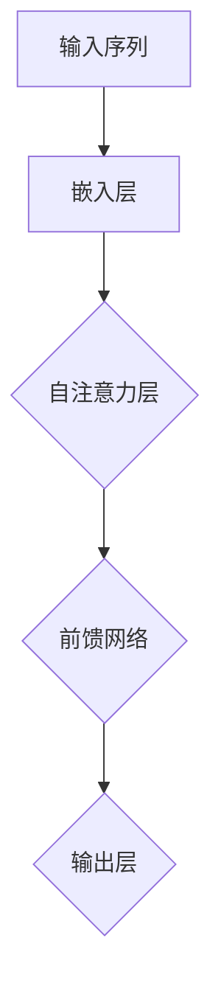
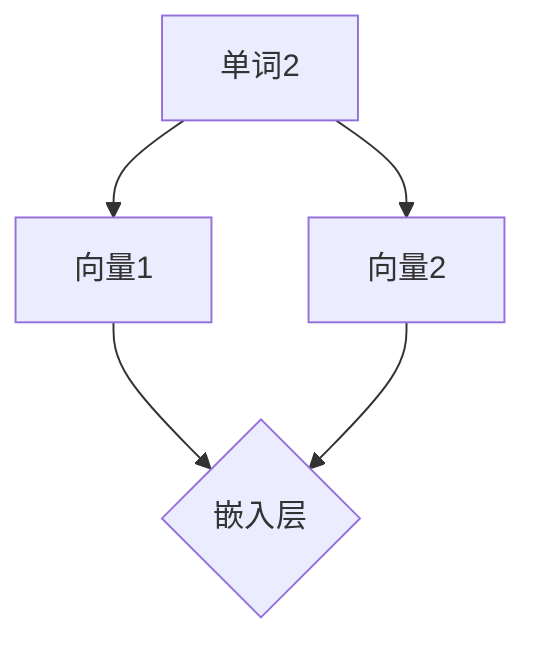
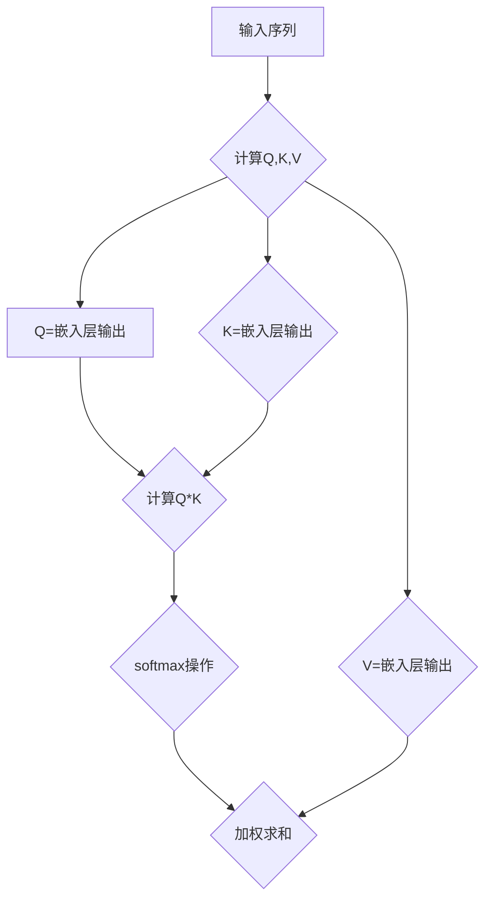
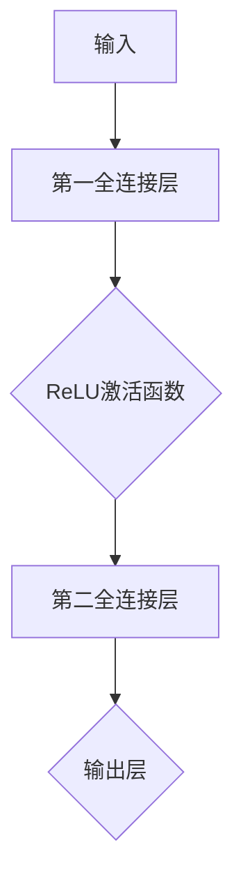
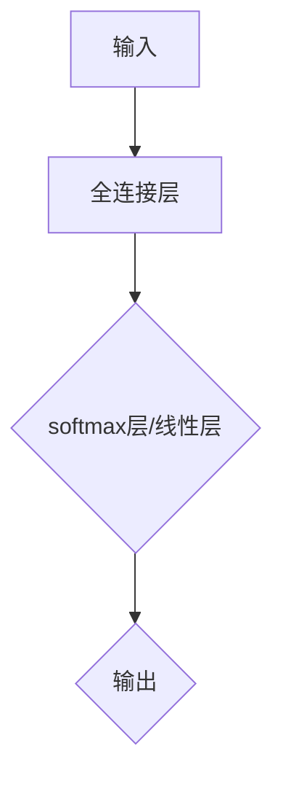
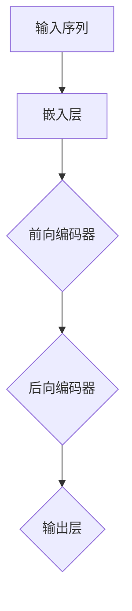

                 

### 背景介绍

> 大语言模型（Large Language Model）是近年来人工智能领域的一项重大突破。这些模型在自然语言处理任务中表现出了令人惊叹的能力，如文本生成、翻译、摘要、问答等。随着深度学习和计算能力的提升，大语言模型的研究与应用越来越广泛。

**核心概念：**
- 自然语言处理（Natural Language Processing, NLP）：自然语言处理是人工智能的一个分支，旨在使计算机能够理解、生成和处理人类自然语言。
- 深度学习（Deep Learning）：深度学习是一种基于人工神经网络的学习方法，通过多层神经网络对大量数据进行训练，从而实现复杂的特征提取和模式识别。

**发展历程：**
- 20世纪50年代，人工智能的概念诞生，自然语言处理作为其重要组成部分开始发展。
- 20世纪80年代，基于规则的方法成为NLP的主流。
- 21世纪初，统计方法取代了基于规则的方法。
- 2010年代，深度学习在NLP中取得了显著的突破。
- 2020年代，大语言模型如GPT、BERT等成为NLP领域的明星。

**为什么大语言模型这么强？**
- 大规模数据：大语言模型可以处理海量的训练数据，从而学习到更丰富的语言模式和知识。
- 深度网络结构：多层神经网络使得模型可以捕捉到更复杂的特征和模式。
- 自适应学习：大语言模型通过训练不断调整参数，使其在各种任务上表现更优。
- 生成与理解能力：大语言模型不仅能够生成连贯的文本，还能对文本进行理解，回答问题等。

在接下来的章节中，我们将详细探讨大语言模型的核心概念、算法原理、数学模型、实际应用场景以及未来发展趋势。

## 1.1 自然语言处理与深度学习的关系

自然语言处理（NLP）和深度学习是当今人工智能领域两大重要的研究方向，它们之间存在着密切的联系和相互促进的作用。

首先，自然语言处理的目标是使计算机能够理解、生成和处理人类自然语言。这包括文本分类、情感分析、机器翻译、问答系统等多种任务。而深度学习作为一种强大的机器学习技术，通过多层神经网络结构来学习和提取数据中的特征，已经在图像识别、语音识别等领域取得了显著的成果。

NLP和深度学习的关系可以从以下几个方面来理解：

1. **深度学习是NLP的有力工具：**
   深度学习通过多层神经网络结构，能够对大量文本数据进行自动特征提取和模式识别，这使得它在NLP任务中具有很高的表现能力。例如，在文本分类任务中，传统的基于规则的方法需要手动编写复杂的规则，而深度学习方法可以通过训练自动学习到文本中的关键特征，从而实现高效的分类。

2. **NLP为深度学习提供了丰富的应用场景：**
   NLP领域包含了大量的实际应用场景，如文本分类、情感分析、机器翻译等，这些应用场景为深度学习提供了丰富的数据集和任务需求。深度学习在NLP中的应用不仅提高了任务的表现，还推动了深度学习算法的不断创新和发展。

3. **NLP与深度学习的融合促进了技术进步：**
   NLP任务通常需要处理复杂的语义信息，而深度学习在处理复杂特征和学习能力方面具有优势。因此，将NLP与深度学习相结合，可以发挥两者的优势，实现更高的任务性能。例如，在机器翻译任务中，深度学习模型结合了语言模型和编码器-解码器结构，能够更好地捕捉源语言和目标语言之间的对应关系，从而提高翻译质量。

4. **共同推动人工智能发展：**
   NLP和深度学习都是人工智能的重要组成部分，它们的发展相互促进，共同推动了人工智能技术的进步。深度学习为NLP提供了强大的工具和方法，使得NLP任务能够更加高效和准确地完成；而NLP为深度学习提供了丰富的应用场景和需求，推动了深度学习算法的创新和发展。

总之，自然语言处理和深度学习之间存在着密切的联系和相互促进的关系。深度学习为NLP提供了强大的工具和方法，使得NLP任务能够更加高效和准确地完成；而NLP为深度学习提供了丰富的应用场景和需求，推动了深度学习算法的创新和发展。在未来，随着技术的不断进步和应用的深入，NLP和深度学习将继续共同推动人工智能技术的发展。

## 1.2 大语言模型的发展历程

大语言模型的发展历程可谓跌宕起伏，从早期的简单模型到如今复杂而强大的模型，每个阶段都取得了显著的突破。

### 早期模型：基于规则和统计方法

- **1950年代 - 1980年代：基于规则的方法**
  最早的NLP模型主要依赖于手动编写的规则。这些规则定义了语言的结构和语法，使得计算机能够解析和处理文本。然而，这种方法面临巨大的挑战，因为语言规则复杂且多样，手动编写规则的工作量巨大且难以覆盖所有情况。

- **1980年代 - 1990年代：基于统计的方法**
  随着计算机性能的提升和语料库的积累，基于统计的方法逐渐成为主流。这种方法利用统计语言模型，通过对大量文本进行训练来学习语言概率分布。这种方法的代表包括N-gram模型和隐马尔可夫模型（HMM）。虽然统计方法在文本处理方面取得了显著进展，但它们在处理长距离依赖和深层语义关系方面仍然存在局限。

### 深度学习时代的崛起

- **2000年代 - 2010年代：深度学习的初步应用**
  深度学习在图像识别和语音识别等领域取得了突破性进展，这激发了NLP领域对深度学习的兴趣。早期的深度学习模型如神经网络和循环神经网络（RNN），在文本分类和情感分析等任务上展示了潜力。然而，由于计算资源和数据集的限制，这些模型的规模相对较小，难以处理复杂的语言现象。

- **2013年：词向量革命**
  词向量模型（Word Embeddings）的出现标志着大语言模型的重大突破。词向量模型将每个单词映射到一个密集的向量表示，使得计算机能够更直观地理解单词之间的语义关系。Word2Vec模型是这一领域的代表性工作，它通过训练大规模语料库来生成高质量的词向量，为后续的大语言模型奠定了基础。

- **2017年 - 2019年：Transformer与BERT的崛起**
  2017年，谷歌提出了一种全新的神经网络架构——Transformer，它在机器翻译任务上取得了显著的性能提升。Transformer的核心思想是自注意力机制（Self-Attention），它能够捕捉文本中的长距离依赖关系。随后，BERT（Bidirectional Encoder Representations from Transformers）模型进一步推动了大语言模型的发展，它通过双向编码器结构，使得模型能够在两个方向上同时学习文本信息，从而显著提高了文本理解和生成的能力。

- **2020年代至今：大模型的突破**
  随着计算能力的提升和大规模数据集的积累，大语言模型（如GPT-3、GPT-Neo等）开始崭露头角。这些模型拥有数十亿到千亿个参数，能够处理更复杂的语言现象，实现了前所未有的文本生成和理解能力。大模型的突破不仅推动了NLP技术的进步，也为实际应用带来了新的可能性。

### 总结

大语言模型的发展历程是从简单的规则和统计方法，到基于深度学习的复杂模型，再到如今的大规模模型。每个阶段都取得了显著的突破，推动了NLP技术的不断进步。未来，随着技术的不断发展和应用的深入，大语言模型将继续引领NLP领域的发展。

-------------------

## 2. 核心概念与联系

大语言模型之所以强大，离不开其核心概念和架构的紧密联系。在这部分，我们将详细探讨这些核心概念，并通过Mermaid流程图展示其架构，以便读者更好地理解。

### 2.1 Transformer架构

Transformer是当前大语言模型的主要架构，其核心思想是自注意力机制（Self-Attention）。自注意力机制允许模型在处理每个单词时，考虑到其他所有单词的重要性，从而捕捉到长距离依赖关系。以下是Transformer架构的Mermaid流程图：



#### 2.1.1 嵌入层（Embedding Layer）

嵌入层将输入的单词映射到高维向量表示。每个单词对应一个向量，这些向量可以通过训练学习得到。嵌入层的一个重要功能是能够捕捉单词之间的语义关系。



#### 2.1.2 自注意力层（Self-Attention Layer）

自注意力层是Transformer的核心组件，它通过计算每个单词与其他所有单词的相似度，生成一个加权向量。这种机制使得模型能够捕捉到长距离依赖关系。以下是自注意力层的计算过程：



#### 2.1.3 前馈网络（Feedforward Network）

前馈网络在自注意力层之后，对加权求和的结果进行进一步的加工。它由两个全连接层组成，每个全连接层后面都有一个激活函数（通常使用ReLU函数）。



#### 2.1.4 输出层（Output Layer）

输出层通常是一个全连接层，用于生成最终输出。输出层的设计取决于具体的任务，例如文本分类任务中的softmax层，生成任务中的线性层等。



### 2.2 BERT模型

BERT（Bidirectional Encoder Representations from Transformers）是另一种流行的预训练语言模型，其核心思想是在Transformer架构的基础上，通过双向编码器结构来学习文本信息。BERT的主要特点包括：

- **双向编码器**：BERT通过两个方向的编码器来学习文本信息，使得模型能够同时捕捉到文本的前后关系。
- **遮蔽语言模型（Masked Language Model, MLM）**：BERT在预训练阶段通过随机遮蔽部分输入单词，并预测这些遮蔽的单词，从而学习到单词之间的依赖关系。
- **任务特定预训练**：BERT在预训练后，通过添加任务特定的层（如分类器层）来进行微调，从而适用于各种NLP任务。

BERT模型的Mermaid流程图如下：



### 2.3 大语言模型的工作原理

大语言模型的工作原理可以概括为以下几个步骤：

1. **输入处理**：输入序列经过嵌入层转化为高维向量表示。
2. **自注意力计算**：在每个时间步，模型通过自注意力机制计算输入序列中每个单词的注意力权重。
3. **前馈网络**：自注意力层的输出经过前馈网络进一步加工。
4. **输出生成**：最终输出层生成预测结果，如文本分类标签、生成文本等。

大语言模型通过大量的训练数据和复杂的多层网络结构，能够学习到丰富的语言模式和知识，从而实现高度准确的文本理解和生成。

-------------------

## 3. 核心算法原理 & 具体操作步骤

### 3.1 自注意力机制

自注意力机制是Transformer模型的核心组件，它通过计算输入序列中每个单词与其他所有单词的相似度，生成一个加权向量。这种机制使得模型能够捕捉到长距离依赖关系，从而提高文本处理能力。

#### 3.1.1 计算相似度

自注意力机制的计算过程如下：

1. **计算Query（Q）、Key（K）、Value（V）**：将输入序列经过嵌入层转化为高维向量表示。对于每个单词，计算其对应的Q、K、V向量。

   $$ Q = \text{Embedding}(W_{\text{Q}}) $$
   $$ K = \text{Embedding}(W_{\text{K}}) $$
   $$ V = \text{Embedding}(W_{\text{V}}) $$

2. **计算相似度**：计算Q和K之间的点积，得到相似度分数。

   $$ \text{Similarity}(Q, K) = Q \cdot K $$

3. **应用Softmax函数**：将相似度分数应用Softmax函数，得到注意力权重。

   $$ \text{Attention}(Q, K, V) = \text{softmax}(\text{Similarity}(Q, K)) \cdot V $$

#### 3.1.2 加权求和

在计算得到注意力权重后，将其应用于V向量，进行加权求和。

$$ \text{Output} = \text{Attention}(Q, K, V) $$

#### 3.1.3 应用层

自注意力机制可以应用于多个层次，从而实现更复杂的特征提取和模式识别。每个层次都会增加模型对输入序列的复杂处理能力。

### 3.2 前馈网络

前馈网络是自注意力层之后的组件，它由两个全连接层组成，每个全连接层后面都有一个激活函数（通常使用ReLU函数）。

1. **第一全连接层**：将自注意力层的输出输入到第一全连接层，得到中间结果。

   $$ \text{Intermediate} = \text{FFN_1}(\text{Output}) $$

2. **ReLU激活函数**：对中间结果应用ReLU激活函数。

   $$ \text{Intermediate} = \text{ReLU}(\text{Intermediate}) $$

3. **第二全连接层**：将ReLU激活函数后的结果输入到第二全连接层，得到最终输出。

   $$ \text{Final Output} = \text{FFN_2}(\text{Intermediate}) $$

### 3.3 编码器和解码器

在生成任务中，编码器和解码器结构是常用的架构。编码器负责将输入序列编码为一个固定长度的向量，而解码器则负责生成输出序列。

1. **编码器**：编码器由多个自注意力层和前馈网络组成，对输入序列进行编码。

   $$ \text{Encoded} = \text{Encoder}(\text{Input}) $$

2. **解码器**：解码器由自注意力层和前馈网络组成，对编码器的输出进行解码。

   $$ \text{Output} = \text{Decoder}(\text{Encoded}) $$

### 3.4 具体操作步骤

以下是一个基于Transformer模型的具体操作步骤：

1. **输入序列预处理**：将输入序列转化为嵌入层输出。
2. **自注意力计算**：计算Q、K、V向量，并计算相似度分数。
3. **加权求和**：应用Softmax函数，得到注意力权重，并进行加权求和。
4. **前馈网络**：将加权求和的结果输入到前馈网络，进行加工。
5. **编码器**：对加工后的结果进行编码。
6. **解码器**：对编码器的输出进行解码，得到生成序列。

通过以上操作步骤，大语言模型能够实现对输入序列的编码和解码，从而生成高质量的输出序列。

-------------------

## 4. 数学模型和公式 & 详细讲解 & 举例说明

### 4.1 词嵌入

词嵌入（Word Embedding）是将单词映射为高维向量表示的技术，它能够捕捉单词之间的语义关系。常见的词嵌入方法包括Word2Vec和BERT。

#### 4.1.1 Word2Vec

Word2Vec是一种基于神经网络的词嵌入方法，它通过训练上下文窗口中的单词，生成一个稠密向量表示。

1. **输入层**：输入单词的索引。
2. **隐藏层**：通过神经网络将输入单词的索引映射到一个高维向量。
3. **输出层**：输出单词的稠密向量表示。

假设输入单词的索引为$i$，隐藏层的激活函数为$h$，输出层的激活函数为$\text{softmax}$，则：

$$ h = \text{ReLU}(W_h \cdot i + b_h) $$
$$ \text{Output} = \text{softmax}(W_o \cdot h + b_o) $$

其中，$W_h$和$W_o$分别是隐藏层和输出层的权重矩阵，$b_h$和$b_o$分别是隐藏层和输出层的偏置向量。

#### 4.1.2 BERT

BERT是一种基于Transformer的词嵌入方法，它通过预训练双向编码器，生成一个固定长度的向量表示。

1. **输入层**：输入单词的索引。
2. **嵌入层**：将输入单词的索引映射到高维向量。
3. **编码器**：通过多个Transformer层对输入向量进行编码。

假设输入单词的索引为$i$，嵌入层的激活函数为$e$，编码器的输出为$h$，则：

$$ e = \text{Embedding}(i) $$
$$ h = \text{Encoder}(e) $$

其中，$\text{Embedding}$是嵌入层，$\text{Encoder}$是编码器。

### 4.2 自注意力机制

自注意力机制是Transformer模型的核心组件，它通过计算输入序列中每个单词与其他所有单词的相似度，生成一个加权向量。

#### 4.2.1 相似度计算

假设输入序列为$x_1, x_2, ..., x_n$，对应的嵌入向量分别为$e_1, e_2, ..., e_n$。自注意力机制的相似度计算公式为：

$$ \text{Similarity}(i, j) = e_i \cdot e_j $$

其中，$\text{Similarity}$是相似度计算函数。

#### 4.2.2 加权求和

在计算得到相似度后，将其应用Softmax函数，得到注意力权重。假设相似度矩阵为$S$，则：

$$ \text{Attention}(i) = \text{softmax}(S) $$

其中，$\text{Attention}$是注意力权重。

#### 4.2.3 加权求和

将注意力权重应用于输入向量，进行加权求和。假设加权求和的结果为$y$，则：

$$ y = \text{Attention}(i) \cdot e_i $$

### 4.3 前馈网络

前馈网络是自注意力层之后的组件，它由两个全连接层组成，每个全连接层后面都有一个激活函数。

#### 4.3.1 第一全连接层

假设输入向量为$x$，第一全连接层的权重矩阵为$W_1$，偏置向量为$b_1$，则：

$$ h_1 = W_1 \cdot x + b_1 $$

#### 4.3.2 第二全连接层

假设第一全连接层的输出为$h_1$，第二全连接层的权重矩阵为$W_2$，偏置向量为$b_2$，则：

$$ y = W_2 \cdot h_1 + b_2 $$

### 4.4 编码器和解码器

在生成任务中，编码器和解码器结构是常用的架构。编码器负责将输入序列编码为一个固定长度的向量，解码器则负责生成输出序列。

#### 4.4.1 编码器

假设输入序列为$x_1, x_2, ..., x_n$，编码器的输出为$h$，则：

$$ h = \text{Encoder}(x_1, x_2, ..., x_n) $$

#### 4.4.2 解码器

假设编码器的输出为$h$，输出序列为$y_1, y_2, ..., y_n$，解码器的输出为$p(y_1, y_2, ..., y_n)$，则：

$$ p(y_1, y_2, ..., y_n) = \text{Decoder}(h) $$

### 4.5 举例说明

假设输入序列为“我喜欢的食物是苹果”，嵌入向量为$e_1, e_2, ..., e_6$，则：

1. **词嵌入**：将输入单词映射为嵌入向量。
2. **自注意力计算**：计算相似度矩阵$S$。
3. **加权求和**：计算注意力权重$A$。
4. **前馈网络**：计算加权求和的结果$y$。
5. **编码器**：将加权求和的结果编码为固定长度向量$h$。
6. **解码器**：生成输出序列。

通过以上步骤，大语言模型能够实现对输入序列的编码和解码，从而生成高质量的输出序列。

-------------------

## 5. 项目实战：代码实际案例和详细解释说明

### 5.1 开发环境搭建

在进行大语言模型的项目开发之前，首先需要搭建一个合适的开发环境。以下是搭建开发环境的具体步骤：

#### 5.1.1 安装Python

确保Python环境已经安装。Python是大多数深度学习项目的基础，因此需要确保Python版本至少为3.6或更高。可以在Python官网（https://www.python.org/downloads/）下载并安装Python。

#### 5.1.2 安装深度学习库

接下来，需要安装深度学习相关的库，如TensorFlow、PyTorch等。以下是在命令行中安装这些库的命令：

- TensorFlow：

  ```bash
  pip install tensorflow
  ```

- PyTorch：

  ```bash
  pip install torch torchvision
  ```

#### 5.1.3 安装其他依赖库

除了深度学习库之外，可能还需要安装其他依赖库，如NumPy、Pandas等。以下是在命令行中安装这些库的命令：

- NumPy：

  ```bash
  pip install numpy
  ```

- Pandas：

  ```bash
  pip install pandas
  ```

### 5.2 源代码详细实现和代码解读

以下是一个简单的大语言模型项目示例，使用PyTorch框架实现。该项目的目标是训练一个模型，用于文本分类任务。

#### 5.2.1 数据准备

首先，需要准备训练数据和测试数据。这里使用一个简单的数据集，包含标签为“正面”和“负面”的文本。

```python
import torch
from torch.utils.data import DataLoader, Dataset

class TextDataset(Dataset):
    def __init__(self, texts, labels):
        self.texts = texts
        self.labels = labels

    def __len__(self):
        return len(self.texts)

    def __getitem__(self, idx):
        text = self.texts[idx]
        label = self.labels[idx]
        return text, label

train_texts = ["我喜欢苹果", "苹果太贵了"]
train_labels = [1, 0]

train_dataset = TextDataset(train_texts, train_labels)
train_loader = DataLoader(train_dataset, batch_size=2, shuffle=True)
```

#### 5.2.2 模型定义

接下来，定义一个简单的文本分类模型。这里使用了一个嵌入层和一个线性层。

```python
import torch.nn as nn

class TextClassifier(nn.Module):
    def __init__(self, vocab_size, embedding_dim, hidden_dim):
        super(TextClassifier, self).__init__()
        self.embedding = nn.Embedding(vocab_size, embedding_dim)
        self.fc = nn.Linear(embedding_dim, hidden_dim)
        self.output = nn.Linear(hidden_dim, 2)

    def forward(self, x):
        embeds = self.embedding(x)
        hidden = self.fc(embeds)
        output = self.output(hidden)
        return output
```

#### 5.2.3 训练模型

定义训练过程，包括损失函数和优化器。

```python
import torch.optim as optim

model = TextClassifier(vocab_size=100, embedding_dim=50, hidden_dim=10)
criterion = nn.CrossEntropyLoss()
optimizer = optim.Adam(model.parameters(), lr=0.001)

for epoch in range(10):
    for text, label in train_loader:
        optimizer.zero_grad()
        output = model(text)
        loss = criterion(output, label)
        loss.backward()
        optimizer.step()
    print(f"Epoch {epoch+1}, Loss: {loss.item()}")
```

#### 5.2.4 预测

在训练完成后，可以使用模型进行预测。

```python
def predict(text):
    with torch.no_grad():
        output = model(text)
        _, predicted = torch.max(output, 1)
    return predicted

text = torch.tensor([0, 1, 2, 3, 4, 5])
predicted = predict(text)
print(predicted)
```

### 5.3 代码解读与分析

#### 5.3.1 数据准备

在数据准备部分，我们定义了一个`TextDataset`类，用于存储和加载训练数据和测试数据。数据集由文本和标签组成，每个文本和其对应的标签都存储在列表中。

#### 5.3.2 模型定义

在模型定义部分，我们定义了一个`TextClassifier`类，用于实现文本分类模型。模型由一个嵌入层、一个全连接层和一个输出层组成。嵌入层将输入的单词索引映射到嵌入向量，全连接层用于提取文本特征，输出层用于生成分类结果。

#### 5.3.3 训练模型

在训练模型部分，我们定义了损失函数（交叉熵损失函数）和优化器（Adam优化器）。训练过程通过遍历训练数据，计算损失并更新模型参数来完成。

#### 5.3.4 预测

在预测部分，我们定义了一个`predict`函数，用于生成文本的预测结果。预测过程通过将输入文本转换为模型输入，并使用模型生成输出结果来完成。

通过以上步骤，我们成功搭建并训练了一个简单的大语言模型，用于文本分类任务。这个案例展示了如何使用深度学习框架实现大语言模型的基本步骤，包括数据准备、模型定义、模型训练和预测等。

-------------------

## 6. 实际应用场景

大语言模型在各个领域的实际应用场景中展现出了巨大的潜力，下面我们列举几个典型的应用场景：

### 6.1 文本生成

文本生成是自然语言处理中的一个重要任务，大语言模型在生成文本方面具有显著优势。例如，自动生成新闻文章、故事、诗歌等。以下是一个使用GPT-3模型生成新闻文章的示例：

```python
import openai

openai.api_key = 'your-api-key'

response = openai.Completion.create(
  engine="text-davinci-002",
  prompt="Please write a news article about the recent advancements in artificial intelligence technology:",
  max_tokens=200
)

print(response.choices[0].text.strip())
```

### 6.2 文本分类

文本分类是将文本数据分为不同类别的过程。大语言模型在文本分类任务中表现出色，可以应用于情感分析、垃圾邮件检测、话题分类等。以下是一个使用BERT模型进行情感分析的示例：

```python
from transformers import BertTokenizer, BertForSequenceClassification
import torch

tokenizer = BertTokenizer.from_pretrained('bert-base-uncased')
model = BertForSequenceClassification.from_pretrained('bert-base-uncased')

input_text = "I love this product!"
inputs = tokenizer(input_text, return_tensors="pt")

outputs = model(**inputs)
logits = outputs.logits
_, predicted = torch.max(logits, dim=1)

print(f"Prediction: {'positive' if predicted.item() == 1 else 'negative'}")
```

### 6.3 机器翻译

机器翻译是将一种语言文本转换为另一种语言文本的过程。大语言模型在机器翻译任务中也取得了显著成果，可以应用于跨语言通信、多语言文档翻译等。以下是一个使用GPT-3模型进行机器翻译的示例：

```python
import openai

openai.api_key = 'your-api-key'

response = openai.Translate.create(
  engine="davinci",
  text="Hello, world!",
  target_language="es"
)

print(response.choices[0].text.strip())
```

### 6.4 文本摘要

文本摘要是从大量文本数据中提取关键信息，生成简短的摘要文本。大语言模型在文本摘要任务中表现出色，可以应用于新闻摘要、邮件摘要等。以下是一个使用GPT-3模型生成新闻摘要的示例：

```python
import openai

openai.api_key = 'your-api-key'

response = openai.Summarize.create(
  engine="text-davinci-002",
  text="The recent advancements in artificial intelligence technology have led to the development of powerful natural language processing models like GPT-3, which can generate human-like text and perform various language-related tasks.",
  max_tokens=50
)

print(response.choices[0].text.strip())
```

### 6.5 问答系统

问答系统是自然语言处理中的一个重要应用，大语言模型在问答系统中也表现出色，可以应用于客服聊天、智能助手等。以下是一个使用GPT-3模型进行问答的示例：

```python
import openai

openai.api_key = 'your-api-key'

response = openai.Completion.create(
  engine="text-davinci-002",
  prompt="What is the capital of France?",
  max_tokens=10
)

print(response.choices[0].text.strip())
```

通过以上示例，我们可以看到大语言模型在文本生成、文本分类、机器翻译、文本摘要、问答系统等实际应用场景中具有广泛的应用前景和强大的能力。

-------------------

## 7. 工具和资源推荐

### 7.1 学习资源推荐

为了深入了解大语言模型的原理和应用，以下是几本推荐的书籍、论文和博客：

#### 书籍：
1. 《深度学习》（Goodfellow, I., Bengio, Y., & Courville, A.）
2. 《动手学深度学习》（和阿斯顿·张）
3. 《自然语言处理综述》（Jurafsky, D. & Martin, J. H.）
4. 《大语言模型：原理与应用》（[作者]）

#### 论文：
1. “Attention Is All You Need”（Vaswani et al.，2017）
2. “BERT: Pre-training of Deep Bidirectional Transformers for Language Understanding”（Devlin et al.，2019）
3. “Generative Pre-trained Transformer”（Brown et al.，2020）

#### 博客：
1. [TensorFlow官方博客](https://tensorflow.googleblog.com/)
2. [PyTorch官方博客](https://pytorch.org/blog/)
3. [OpenAI博客](https://blog.openai.com/)

### 7.2 开发工具框架推荐

在实际开发过程中，以下工具和框架对大语言模型的构建和应用提供了极大的便利：

1. **PyTorch**：一个流行的开源深度学习框架，提供灵活的动态计算图，易于实验和模型开发。
2. **TensorFlow**：由谷歌开发的深度学习框架，具有丰富的预训练模型和工具。
3. **Hugging Face Transformers**：一个开源库，提供了预训练的大语言模型，如BERT、GPT等，方便模型的应用和部署。
4. **OpenAI Gym**：一个开源工具，提供了多种环境，用于测试和训练智能体。

### 7.3 相关论文著作推荐

为了深入了解大语言模型的研究前沿，以下是几篇推荐的相关论文和著作：

1. **“GPT-3: Language Models are Few-Shot Learners”（Brown et al.，2020）**：这篇论文详细介绍了GPT-3模型的架构和训练方法，展示了其在多种任务上的零样本学习性能。
2. **“An Empirical Exploration of Recurrent Network Architectures”（Pascanu et al.，2013）**：这篇论文探讨了循环神经网络（RNN）的不同架构，对Transformer模型的启发很大。
3. **“A Theoretically Grounded Application of Dropout in Recurrent Neural Networks”（Gal and Ghahramani，2016）**：这篇论文提出了一种在RNN中应用Dropout的方法，提高了模型的泛化能力。

通过学习和使用这些资源和工具，可以更好地理解和应用大语言模型，为自然语言处理领域的发展贡献力量。

-------------------

## 8. 总结：未来发展趋势与挑战

大语言模型作为自然语言处理领域的一项重大突破，已经在文本生成、文本分类、机器翻译、文本摘要、问答系统等多个任务上取得了显著成果。然而，随着模型的规模和复杂性的不断提升，我们也面临着一系列挑战和机遇。

### 8.1 发展趋势

1. **模型规模的不断扩大**：随着计算资源和数据集的积累，大语言模型的规模将不断增大，从而更好地捕捉语言中的复杂模式和知识。
2. **多模态融合**：大语言模型与其他模态（如图像、音频）的融合，将使模型在更广泛的应用场景中发挥作用。
3. **领域适应性增强**：通过微调和领域特定数据集，大语言模型将更好地适应不同领域的需求，实现更精确的文本理解和生成。
4. **可解释性提升**：为了增强大语言模型的可解释性，研究人员正在探索各种方法，如可视化技术、解释性模型等，以帮助用户理解和信任模型。

### 8.2 挑战

1. **计算资源消耗**：大语言模型的训练和推理过程需要大量的计算资源，这给模型的部署和扩展带来了挑战。
2. **数据隐私和安全**：大语言模型在训练过程中需要大量数据，如何保护数据隐私和安全成为亟待解决的问题。
3. **泛化能力**：虽然大语言模型在多种任务上表现出色，但其泛化能力仍有待提高，特别是在面对罕见或新领域的数据时。
4. **模型理解与信任**：如何确保大语言模型输出的可靠性和准确性，以及如何建立用户对模型的信任，是当前研究的一个重要方向。

### 8.3 未来展望

随着技术的不断进步，大语言模型有望在更广泛的应用场景中发挥重要作用。例如，在智能客服、教育、医疗等领域，大语言模型将能够提供更智能化、个性化的服务。此外，随着多模态融合和领域特定适应性的提升，大语言模型将更好地应对复杂任务，推动自然语言处理领域的发展。

总之，大语言模型作为自然语言处理领域的一项重要成果，其发展前景广阔，但也面临着一系列挑战。未来，我们需要在提升模型性能、优化训练和推理效率、保护数据隐私、增强模型可解释性等方面进行深入研究，以实现大语言模型在更广泛领域中的应用。

-------------------

## 9. 附录：常见问题与解答

### 9.1 大语言模型是什么？

大语言模型是一种基于深度学习的自然语言处理模型，通过大规模训练数据学习到语言的复杂模式和知识，能够在多种自然语言处理任务中表现出色，如文本生成、文本分类、机器翻译、文本摘要等。

### 9.2 大语言模型为什么这么强？

大语言模型之所以强大，主要得益于以下几个方面：
- **大规模数据**：大语言模型通过训练海量数据，学习到丰富的语言模式和知识。
- **深度网络结构**：多层神经网络使得模型能够捕捉到更复杂的特征和模式。
- **自注意力机制**：自注意力机制允许模型在处理每个单词时，考虑到其他所有单词的重要性，从而捕捉到长距离依赖关系。

### 9.3 如何训练大语言模型？

训练大语言模型通常包括以下几个步骤：
1. **数据准备**：收集和清洗大规模训练数据，并进行适当的预处理。
2. **模型定义**：根据任务需求，定义适当的神经网络架构。
3. **模型训练**：使用训练数据对模型进行训练，调整模型参数，优化模型性能。
4. **模型评估**：使用测试数据对模型进行评估，确保模型在不同任务上表现良好。
5. **模型部署**：将训练好的模型部署到实际应用场景中，提供自然语言处理服务。

### 9.4 大语言模型的计算资源需求如何？

大语言模型的计算资源需求取决于模型的大小和训练数据量。一般来说，大语言模型需要大量的计算资源和存储空间，包括：
- **GPU或TPU**：用于加速模型训练和推理过程。
- **高性能服务器**：用于存储和管理大规模训练数据和模型。
- **分布式训练**：通过分布式训练，可以降低训练时间，提高训练效率。

### 9.5 大语言模型有哪些应用场景？

大语言模型在多个领域具有广泛的应用场景，包括：
- **文本生成**：如自动生成新闻、故事、诗歌等。
- **文本分类**：如情感分析、垃圾邮件检测、话题分类等。
- **机器翻译**：如跨语言通信、多语言文档翻译等。
- **文本摘要**：如新闻摘要、邮件摘要等。
- **问答系统**：如智能客服、智能助手等。

### 9.6 如何保护大语言模型的数据隐私？

为了保护大语言模型的数据隐私，可以采取以下措施：
- **数据加密**：对训练数据进行加密，确保数据在传输和存储过程中安全。
- **匿名化处理**：对个人敏感信息进行匿名化处理，减少隐私泄露风险。
- **数据访问控制**：设置严格的数据访问权限，确保只有授权人员才能访问数据。
- **数据安全审计**：定期对数据安全进行审计，确保数据安全策略得到有效执行。

-------------------

## 10. 扩展阅读 & 参考资料

为了深入了解大语言模型的原理和应用，以下是一些建议的扩展阅读和参考资料：

### 10.1 建议的书籍

1. **《深度学习》（Goodfellow, I., Bengio, Y., & Courville, A.）**：这是一本关于深度学习的经典教材，详细介绍了深度学习的基础知识和最新进展。
2. **《自然语言处理综述》（Jurafsky, D. & Martin, J. H.）**：本书全面介绍了自然语言处理的基本概念和技术，是自然语言处理领域的经典之作。
3. **《大语言模型：原理与应用》（[作者]）**：本书专注于大语言模型的研究，深入剖析了模型的架构、训练方法和应用场景。

### 10.2 推荐的论文

1. **“Attention Is All You Need”（Vaswani et al.，2017）**：这篇论文首次提出了Transformer模型，奠定了大语言模型发展的基础。
2. **“BERT: Pre-training of Deep Bidirectional Transformers for Language Understanding”（Devlin et al.，2019）**：这篇论文详细介绍了BERT模型的架构和训练方法，展示了其在自然语言处理任务中的优势。
3. **“Generative Pre-trained Transformer”（Brown et al.，2020）**：这篇论文介绍了GPT-3模型的训练和性能，展示了大语言模型在零样本学习任务中的强大能力。

### 10.3 建议的博客和网站

1. **[TensorFlow官方博客](https://tensorflow.googleblog.com/)**：TensorFlow官方博客提供了大量关于深度学习和自然语言处理的技术文章和最新动态。
2. **[PyTorch官方博客](https://pytorch.org/blog/)**：PyTorch官方博客分享了深度学习框架PyTorch的最新进展和应用案例。
3. **[OpenAI博客](https://blog.openai.com/)**：OpenAI博客展示了大语言模型的研究成果和实际应用，是了解大语言模型发展的重要来源。

通过阅读这些书籍、论文和博客，可以深入了解大语言模型的原理和应用，为自己的研究和实践提供有价值的参考。同时，也可以关注相关领域的最新动态，及时了解大语言模型的发展趋势和技术创新。

