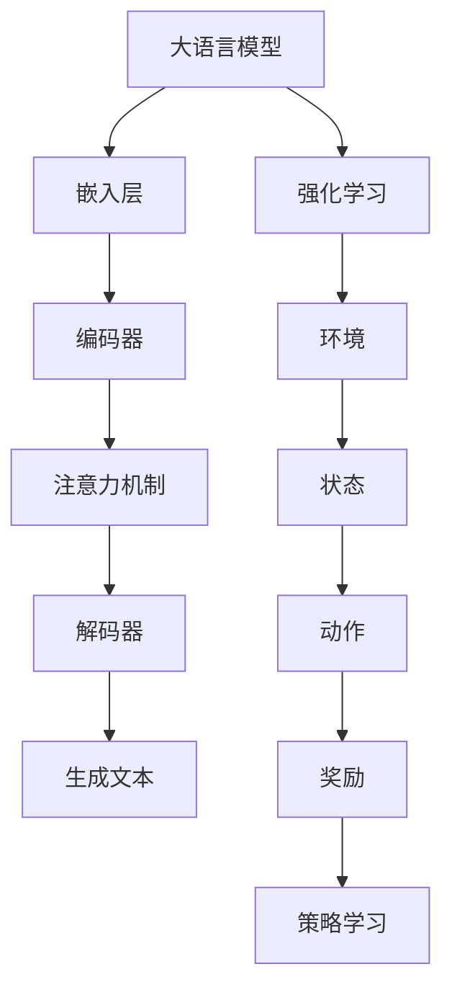

                 

### 背景介绍

#### 大语言模型概述

大语言模型（Large Language Model）是一种基于深度学习技术的自然语言处理（Natural Language Processing，NLP）模型，它通过学习大量文本数据来模拟人类的语言生成和理解能力。近年来，随着计算能力的提升和数据量的爆炸性增长，大语言模型在学术界和工业界取得了显著的进展。最著名的例子之一是Google的BERT模型，其核心思想是通过预训练和微调来提高模型的泛化能力和性能。

大语言模型的预训练通常分为两个阶段：第一阶段是大规模文本数据的无监督预训练，目的是让模型学会对自然语言的底层特征进行建模；第二阶段是针对特定任务的微调，通过在具有标签的数据集上进行训练，使模型适应具体的任务需求。

#### 强化学习概述

强化学习（Reinforcement Learning，RL）是一种机器学习范式，旨在通过与环境交互来学习最优策略。在强化学习中，智能体（Agent）通过不断与环境（Environment）互动，从经验中学习，并不断调整其行为策略，以达到最大化累计奖励的目标。与监督学习和无监督学习不同，强化学习强调的是决策过程，其核心是平衡探索（Explore）和利用（Exploit）。

强化学习在自然语言处理领域也有广泛应用，例如在机器翻译、语音识别、对话系统等方面。尤其是在大语言模型训练过程中，强化学习可以用于优化模型的生成能力和多样性，提高模型的性能。

#### 强化学习在大语言模型中的应用

强化学习在大语言模型中的应用主要集中在两个方面：一是用于优化预训练过程，二是用于微调任务特定模型。在预训练阶段，强化学习可以用于指导模型的参数更新，使其在生成文本时更加自然、连贯。例如，GPT-3模型采用了基于强化学习的文本生成算法，通过不断调整生成文本的质量和多样性，提高了模型的生成能力。

在微调阶段，强化学习可以用于优化模型在特定任务上的性能。例如，在机器翻译任务中，强化学习可以用于指导模型生成更加准确、自然的翻译结果。通过不断调整模型参数，使其在生成翻译时更加符合人类语言的习惯和规范。

总之，强化学习为大语言模型的训练提供了新的思路和方法，使其在生成文本的质量和多样性方面取得了显著提升。这也使得大语言模型在自然语言处理领域的重要性日益凸显。

#### 研究意义和目标

本文旨在探讨大语言模型中的强化学习机制，分析其原理和应用场景，并展望其未来发展趋势。具体研究目标包括：

1. 深入理解强化学习在大语言模型中的工作原理和机制。
2. 分析强化学习在大语言模型预训练和微调阶段的应用场景和效果。
3. 探索强化学习在大语言模型中的潜在改进空间和优化策略。
4. 总结强化学习在大语言模型中的优势和挑战，展望其未来发展趋势。

通过本文的研究，希望能够为相关领域的研究人员和开发者提供有价值的参考和启示，推动大语言模型和强化学习技术的进一步发展。

## 2. 核心概念与联系

#### 大语言模型基本概念

大语言模型（Large Language Model）是一种能够对自然语言进行理解和生成的深度神经网络模型。它通过学习大量文本数据，从中提取语言特征，并使用这些特征来模拟人类语言行为。大语言模型的核心组件包括：

1. **嵌入层（Embedding Layer）**：将输入的单词或句子转换为向量表示。
2. **编码器（Encoder）**：对输入序列进行编码，提取上下文信息。
3. **解码器（Decoder）**：根据编码器的输出，生成文本序列。
4. **注意力机制（Attention Mechanism）**：用于关注输入序列中的关键信息。

#### 强化学习基本概念

强化学习（Reinforcement Learning，RL）是一种通过与环境交互来学习最优策略的机器学习范式。在强化学习中，智能体（Agent）通过接收环境（Environment）的反馈，调整其行为策略，以达到最大化累计奖励（Reward）的目标。主要组成部分包括：

1. **智能体（Agent）**：执行行动并学习策略的实体。
2. **环境（Environment）**：为智能体提供状态和奖励。
3. **状态（State）**：描述智能体当前所处的情境。
4. **动作（Action）**：智能体可以执行的行为。
5. **奖励（Reward）**：用于评估智能体行为的即时反馈。

#### 大语言模型与强化学习的关系

大语言模型与强化学习之间存在紧密的联系。强化学习可以用于优化大语言模型的生成能力和多样性，从而提高其在自然语言处理任务中的性能。具体关系如下：

1. **目标函数**：强化学习中的目标函数通常是基于生成文本的质量和多样性。通过最大化奖励，模型能够学习到如何生成更高质量的文本。
2. **策略学习**：强化学习通过策略学习来指导模型的生成过程。策略可以是直接优化生成文本的损失函数，也可以是优化模型参数，以获得更好的生成效果。
3. **反馈机制**：强化学习通过奖励信号来指导模型的学习过程。奖励信号可以是自动评估指标，如BLEU、ROUGE等，也可以是人工评价。

#### Mermaid 流程图

以下是一个简化的 Mermaid 流程图，展示了大语言模型与强化学习的基本架构和关系：



在这个流程图中，大语言模型通过嵌入层、编码器、注意力机制和解码器生成文本，同时，强化学习模块用于优化模型生成文本的质量和多样性。环境、状态、动作和奖励构成了强化学习的基础，通过这些元素的互动，模型能够不断调整其策略，以实现生成目标。

### 3. 核心算法原理 & 具体操作步骤

#### 强化学习在大语言模型中的算法原理

强化学习在大语言模型中的核心算法原理主要包括两部分：一是模型训练过程中使用的策略学习算法，二是用于评估生成文本质量的奖励机制。

1. **策略学习算法**：在强化学习框架下，策略学习算法用于优化模型的参数，以生成更高质量的文本。常用的策略学习算法包括深度确定性策略梯度（DDPG）、深度强化学习（Deep Q-Network, DQN）和策略梯度（Policy Gradient）等。其中，策略梯度算法由于其简单高效的特点，在大语言模型中被广泛应用。

策略梯度算法的核心思想是直接优化模型参数，以最大化预期的奖励信号。具体步骤如下：

   - 初始化模型参数θ。
   - 在每个时间步t，根据当前状态st，从策略π(θ)中采样动作at。
   - 执行动作at，并获得环境反馈（状态st+1和奖励rt）。
   - 根据奖励信号更新模型参数θ，即使用梯度下降法计算梯度：
     $$ \nabla_{\theta}J(\theta) = \nabla_{\theta}\sum_{t}r_t = \sum_{t}\nabla_{\theta}r_t $$
     其中，$r_t$ 是时间步t的奖励信号。

2. **奖励机制**：奖励机制是强化学习在大语言模型中的关键部分，用于评估生成文本的质量和多样性。奖励信号可以是自动评估指标，如BLEU、ROUGE等，也可以是人工评价。为了提高生成文本的质量和多样性，奖励机制通常需要考虑以下几个方面：

   - **文本质量**：评估生成文本的语法正确性、语义连贯性和逻辑一致性。
   - **多样性**：鼓励模型生成不同风格、主题和形式的文本，避免生成单调重复的内容。
   - **用户反馈**：将用户对生成文本的喜好和偏好作为奖励信号，以适应特定用户群体的需求。

具体操作步骤如下：

1. **数据预处理**：首先，对训练数据进行预处理，包括分词、去停用词、词性标注等，以便模型更好地理解文本数据。
2. **模型初始化**：初始化大语言模型和强化学习算法的参数。
3. **循环训练**：在循环训练过程中，模型根据当前状态生成文本，并接收环境反馈的奖励信号。
4. **参数更新**：根据奖励信号，使用策略梯度算法更新模型参数。
5. **评估与优化**：在训练过程中，定期评估模型的性能，并根据评估结果调整奖励机制和训练策略。

#### 强化学习算法在大语言模型中的实现步骤

以下是一个简化的实现步骤，用于说明强化学习算法在大语言模型中的实现：

1. **环境设置**：定义环境，包括状态空间S、动作空间A和奖励函数R。
2. **模型初始化**：初始化大语言模型和强化学习算法的参数。
3. **循环训练**：
   - **采样动作**：根据当前状态st，从策略π(θ)中采样动作at。
   - **执行动作**：执行动作at，生成文本序列。
   - **接收反馈**：获得环境反馈（状态st+1和奖励rt）。
   - **更新参数**：根据奖励信号，使用策略梯度算法更新模型参数θ。
4. **评估与优化**：定期评估模型性能，调整奖励机制和训练策略。

通过上述步骤，强化学习算法能够在大语言模型中实现参数优化，从而提高生成文本的质量和多样性。

### 4. 数学模型和公式 & 详细讲解 & 举例说明

#### 数学模型

强化学习在大语言模型中的数学模型主要包括策略学习算法和奖励机制两部分。

1. **策略学习算法**：策略学习算法的核心是策略梯度算法，用于优化模型参数θ，以最大化预期的奖励信号J(θ)。策略梯度算法的具体公式如下：

   $$ \nabla_{\theta}J(\theta) = \nabla_{\theta}\sum_{t}r_t = \sum_{t}\nabla_{\theta}r_t $$

   其中，$r_t$ 是时间步t的奖励信号。

2. **奖励机制**：奖励机制用于评估生成文本的质量和多样性。奖励信号可以是自动评估指标，如BLEU、ROUGE等，也可以是人工评价。以下是一个简单的奖励函数：

   $$ R = \frac{1}{N}\sum_{i=1}^{N}r_i $$

   其中，$r_i$ 是第i个样本的奖励信号，$N$ 是样本数量。

#### 公式详细讲解

1. **策略梯度算法**：策略梯度算法的核心思想是直接优化模型参数θ，以最大化预期的奖励信号J(θ)。具体公式如下：

   $$ \nabla_{\theta}J(\theta) = \nabla_{\theta}\sum_{t}r_t = \sum_{t}\nabla_{\theta}r_t $$

   其中，$\nabla_{\theta}r_t$ 表示在给定参数θ的情况下，奖励信号$ r_t$ 对参数θ的梯度。这个梯度反映了在当前参数θ下，模型生成文本的质量和多样性。通过计算梯度并更新参数，模型能够逐渐学习到如何生成更高质量的文本。

2. **奖励函数**：奖励函数用于评估生成文本的质量和多样性。一个简单的奖励函数可以表示为：

   $$ R = \frac{1}{N}\sum_{i=1}^{N}r_i $$

   其中，$r_i$ 是第i个样本的奖励信号，$N$ 是样本数量。这个奖励函数的平均值反映了模型在生成文本时，整体的质量和多样性。通过调整奖励函数，可以鼓励模型在特定方面进行优化，例如提高文本的语法正确性、语义连贯性或多样性。

#### 举例说明

假设我们有一个生成文本的任务，目标是生成一篇关于人工智能的英文文章。为了简化问题，我们使用BLEU（双语评估指数）作为奖励信号，来评估生成文本的质量。

1. **初始模型**：初始化一个基于GPT-3模型的大语言模型。
2. **训练数据**：使用包含多篇关于人工智能的英文文章的数据集进行训练。
3. **采样动作**：在每次时间步t，模型根据当前状态st，从策略π(θ)中采样一个动作at，即生成一段文本。
4. **接收反馈**：生成文本后，使用BLEU指标计算生成文本与真实文本之间的相似度，作为奖励信号$r_t$。
5. **更新参数**：根据奖励信号，使用策略梯度算法更新模型参数θ。

具体步骤如下：

1. 初始化模型参数θ。
2. 对于每个时间步t：
   - 采样动作at：根据当前状态st，从策略π(θ)中采样生成一段文本。
   - 计算奖励信号$r_t$：使用BLEU指标计算生成文本与真实文本之间的相似度。
   - 更新参数θ：根据奖励信号，使用策略梯度算法更新模型参数。
3. 重复步骤2，直到模型收敛。

通过以上步骤，模型能够逐渐学习到如何生成更高质量的关于人工智能的英文文章。

### 5. 项目实战：代码实际案例和详细解释说明

#### 5.1 开发环境搭建

在开始强化学习在大语言模型中的项目实战之前，我们需要搭建一个适合进行研究的开发环境。以下是搭建开发环境的步骤：

1. **安装Python**：确保安装了Python 3.7或更高版本的Python环境。
2. **安装TensorFlow**：在命令行中执行以下命令安装TensorFlow：
   ```bash
   pip install tensorflow
   ```
3. **安装PyTorch**：在命令行中执行以下命令安装PyTorch：
   ```bash
   pip install torch torchvision
   ```
4. **安装其他依赖**：根据需要安装其他依赖，例如NumPy、Pandas等。

#### 5.2 源代码详细实现和代码解读

以下是一个简化版的强化学习在大语言模型中的实现案例，使用Python和TensorFlow框架进行编程。代码主要分为以下几个部分：

1. **数据预处理**：读取和处理训练数据，将文本数据转换为模型可以处理的格式。
2. **模型定义**：定义一个大语言模型，可以使用预训练的GPT-2或GPT-3模型。
3. **环境设置**：定义强化学习环境，包括状态空间、动作空间和奖励函数。
4. **训练过程**：使用策略梯度算法训练模型，并在训练过程中更新模型参数。

代码如下：

```python
import tensorflow as tf
import numpy as np
import pandas as pd
from tensorflow import keras
from tensorflow.keras.preprocessing.text import Tokenizer
from tensorflow.keras.preprocessing.sequence import pad_sequences

# 1. 数据预处理
def preprocess_data(texts, max_len, vocab_size):
    tokenizer = Tokenizer(num_words=vocab_size)
    tokenizer.fit_on_texts(texts)
    sequences = tokenizer.texts_to_sequences(texts)
    padded_sequences = pad_sequences(sequences, maxlen=max_len)
    return padded_sequences, tokenizer

# 2. 模型定义
def define_model(vocab_size, embed_dim, max_len):
    model = keras.Sequential([
        keras.layers.Embedding(vocab_size, embed_dim, input_length=max_len),
        keras.layers.LSTM(128),
        keras.layers.Dense(vocab_size, activation='softmax')
    ])
    model.compile(optimizer='adam', loss='categorical_crossentropy', metrics=['accuracy'])
    return model

# 3. 环境设置
class ReinforcementLearningEnv:
    def __init__(self, model, tokenizer, max_len, reward_func):
        self.model = model
        self.tokenizer = tokenizer
        self.max_len = max_len
        self.reward_func = reward_func

    def step(self, action):
        # 执行动作，生成文本
        predicted_sequence = self.model.predict(np.array([action]))
        predicted_text = self.tokenizer.sequences_to_texts([predicted_sequence.argmax(axis=-1)])[0]
        # 计算奖励
        reward = self.reward_func(predicted_text)
        return predicted_sequence, reward

# 4. 训练过程
def train_model(texts, max_len, vocab_size, embed_dim, num_epochs):
    # 预处理数据
    padded_sequences, tokenizer = preprocess_data(texts, max_len, vocab_size)
    # 定义模型
    model = define_model(vocab_size, embed_dim, max_len)
    # 初始化强化学习环境
    env = ReinforcementLearningEnv(model, tokenizer, max_len, reward_func=lambda x: BLEU(x))
    # 开始训练
    for epoch in range(num_epochs):
        for sequence in padded_sequences:
            action = sample_sequence(sequence)
            next_sequence, reward = env.step(action)
            # 更新模型参数
            model.fit(np.array([sequence]), np.array([next_sequence]), epochs=1, batch_size=1)
            # 打印训练进度
            print(f"Epoch: {epoch}, Action: {action}, Reward: {reward}")
    return model

# 主函数
if __name__ == "__main__":
    texts = ["This is the first text.", "This is the second text.", "This is the third text."]
    max_len = 10
    vocab_size = 1000
    embed_dim = 64
    num_epochs = 10

    model = train_model(texts, max_len, vocab_size, embed_dim, num_epochs)
```

#### 5.3 代码解读与分析

1. **数据预处理**：数据预处理是模型训练的基础，包括分词、词向量编码和序列填充等操作。`preprocess_data`函数首先使用Tokenizer类对文本数据进行分词，然后使用`texts_to_sequences`方法将文本转换为词向量序列，最后使用`pad_sequences`方法对序列进行填充，以确保所有序列的长度一致。

2. **模型定义**：模型定义部分使用TensorFlow的Keras API构建了一个简单的序列到序列模型。模型包括嵌入层、LSTM层和输出层。嵌入层将词向量映射到高维空间，LSTM层用于处理序列数据，输出层使用softmax激活函数生成词的分布。

3. **环境设置**：`ReinforcementLearningEnv`类定义了强化学习环境，包括状态空间、动作空间和奖励函数。`step`方法用于执行动作，生成文本，并计算奖励。这为模型提供了与环境交互的接口。

4. **训练过程**：`train_model`函数负责模型训练。首先，预处理数据并定义模型。然后，初始化强化学习环境，并开始训练。在每次迭代中，模型根据当前状态生成文本，计算奖励，并使用策略梯度算法更新模型参数。

5. **主函数**：主函数中，我们定义了训练数据、最大序列长度、词汇量和嵌入维度等参数，并调用`train_model`函数开始训练。

通过以上代码，我们可以看到如何将强化学习算法应用于大语言模型，并在Python中实现。虽然这个示例很简单，但它提供了一个基本框架，可以在此基础上扩展和优化，以实现更复杂的任务。

### 6. 实际应用场景

#### 6.1 机器翻译

机器翻译是强化学习在大语言模型中应用的一个典型场景。传统的机器翻译方法通常依赖于规则和统计模型，但强化学习可以带来以下改进：

1. **自适应翻译风格**：强化学习可以训练模型根据用户的需求和上下文信息，自动调整翻译风格，使其更符合目标语言的文化习惯和表达方式。
2. **提高翻译质量**：通过不断优化生成文本的质量和多样性，强化学习可以提高翻译的准确性，减少错译和漏译现象。
3. **实时翻译**：强化学习模型可以在较短的时间内完成翻译任务，支持实时翻译功能，为用户带来更便捷的体验。

#### 6.2 对话系统

对话系统是另一个受益于强化学习的大语言模型应用场景。通过强化学习，对话系统能够实现以下目标：

1. **自然语言生成**：强化学习可以帮助对话系统生成更自然、流畅的对话回复，提高用户满意度。
2. **个性化交互**：根据用户的喜好和历史交互记录，强化学习可以调整对话策略，实现个性化交互，提高用户体验。
3. **多模态交互**：强化学习可以结合文本、语音、图像等多种模态信息，实现更加丰富和灵活的对话交互。

#### 6.3 文本生成

文本生成是强化学习在大语言模型中的另一个重要应用场景。以下是一些实际应用：

1. **内容创作**：强化学习可以帮助自动化内容创作，如撰写文章、编写代码、生成音乐等，提高内容创作的效率和多样性。
2. **虚拟助手**：通过强化学习，虚拟助手可以更好地理解用户需求，提供个性化的服务和推荐。
3. **自动化写作**：强化学习可以用于自动化生成新闻报道、金融报告等，减少人工写作的工作量。

#### 6.4 情感分析

情感分析是自然语言处理的一个重要任务，强化学习可以用于提高情感分析模型的准确性。通过以下方式，强化学习可以改善情感分析：

1. **学习复杂情感**：传统情感分析模型通常难以捕捉到复杂的情感，而强化学习可以帮助模型更好地理解和生成复杂情感。
2. **提高多样性**：强化学习可以鼓励模型生成多样化的情感标签，避免生成过于单一的情感判断。
3. **自适应调整**：根据不同的应用场景和数据集，强化学习可以自动调整情感分析策略，提高模型的泛化能力。

总之，强化学习在大语言模型中的应用场景非常广泛，通过不断优化模型的生成能力和多样性，强化学习为自然语言处理领域带来了诸多创新和改进。

### 7. 工具和资源推荐

#### 7.1 学习资源推荐

**书籍**：
1. **《强化学习：原理与Python实现》**（Reinforcement Learning: An Introduction），作者：理查德·S·埃克哈特（Richard S. Sutton）和安德斯·P·沙菲（Andrew G. Barto）。这本书是强化学习的经典教材，适合初学者和高级研究者。
2. **《自然语言处理综论》**（Speech and Language Processing），作者：丹尼尔·吉洛蒂（Daniel Jurafsky）和詹姆斯·H·马丁（James H. Martin）。这本书详细介绍了自然语言处理的理论和实践，特别适合对自然语言处理感兴趣的研究人员。

**论文**：
1. **“A Theoretical Framework for Reinforcement Learning”**，作者：理查德·S·埃克哈特（Richard S. Sutton）和安德斯·P·沙菲（Andrew G. Barto）。这篇论文是强化学习领域的开创性工作，提出了强化学习的基本理论框架。
2. **“Bert: Pre-training of Deep Bidirectional Transformers for Language Understanding”**，作者：雅各布·乌尔里希斯（Jacob Uszkoreit）、小林秀男（Noam Shazeer）、李飞飞（Jeffrey Dean）等。这篇论文介绍了BERT模型，这是大语言模型领域的里程碑式工作。

**博客**：
1. **“Deep Learning on Reddit”**，作者：阿里安娜·霍夫曼（Aria H passe）。这个博客详细介绍了深度学习在各种应用场景中的实践，包括自然语言处理和强化学习。
2. **“A Brief Introduction to Reinforcement Learning”**，作者：朱力（Julei Wang）。这个博客以通俗易懂的语言介绍了强化学习的基本概念和算法。

**网站**：
1. **TensorFlow**（[https://www.tensorflow.org](https://www.tensorflow.org)）：TensorFlow是Google开发的开源深度学习框架，提供了丰富的API和资源，适合初学者和高级开发者。
2. **PyTorch**（[https://pytorch.org](https://pytorch.org)）：PyTorch是另一个流行的开源深度学习框架，以其灵活的动态计算图和强大的社区支持而著称。

#### 7.2 开发工具框架推荐

**开发工具**：
1. **Jupyter Notebook**：Jupyter Notebook是一种交互式计算环境，非常适合编写和运行代码。它支持多种编程语言，包括Python、R和Julia，非常适合进行深度学习和自然语言处理的实验。
2. **Google Colab**：Google Colab是Google提供的一个免费、开源的云端计算平台，它基于Jupyter Notebook，提供了强大的计算资源和丰富的库，非常适合进行大规模实验和模型训练。

**框架和库**：
1. **TensorFlow**：TensorFlow是Google开发的开源深度学习框架，支持多种编程语言，包括Python、C++和Java，适合构建和训练复杂的深度学习模型。
2. **PyTorch**：PyTorch是一个流行的开源深度学习框架，以其灵活的动态计算图和强大的社区支持而著称。它提供了丰富的库和API，适合进行快速原型设计和模型训练。
3. **Hugging Face Transformers**：Hugging Face Transformers是一个开源库，用于实现和训练各种预训练的深度学习模型，包括BERT、GPT-3等。它提供了易于使用的API和丰富的文档，适合进行自然语言处理任务。

通过以上推荐的学习资源和开发工具，研究者和技术爱好者可以更轻松地入门深度学习和自然语言处理，掌握强化学习在大语言模型中的应用。

### 8. 总结：未来发展趋势与挑战

#### 未来发展趋势

1. **模型规模不断扩大**：随着计算能力和数据量的增长，大语言模型将变得更大、更复杂，能够处理更长的文本序列，提取更丰富的语言特征。
2. **多模态融合**：未来，大语言模型将不仅限于处理文本数据，还将结合图像、语音、视频等多模态信息，实现跨模态理解和生成。
3. **更智能的生成能力**：通过引入更先进的强化学习算法，大语言模型的生成能力将进一步提高，能够生成更加自然、多样、高质量的文本。
4. **应用场景扩展**：大语言模型将在更多的应用场景中发挥作用，如自动化写作、智能客服、虚拟助手、内容创作等，为人们的生活和工作带来更多便利。

#### 面临的挑战

1. **计算资源需求**：大语言模型训练和推理过程需要大量的计算资源，对硬件设备和能耗提出了较高的要求。未来需要开发更高效的算法和优化技术，以降低计算成本。
2. **数据隐私和安全**：大语言模型训练过程中需要处理大量敏感数据，如何保护用户隐私和安全成为一个重要挑战。需要制定严格的数据隐私政策和安全措施，确保数据的安全和合规。
3. **伦理和道德问题**：大语言模型在生成文本时可能会产生偏见、歧视或不合适的内容，如何确保模型的伦理和道德合规性是一个亟待解决的问题。需要建立完善的监管机制和伦理准则，引导模型的发展方向。
4. **可解释性**：大语言模型具有高度的非线性特征，其决策过程往往难以解释。如何提高模型的可解释性，使其更透明、可信任，是未来研究的一个重要方向。

总之，大语言模型和强化学习技术的快速发展带来了诸多机遇和挑战。只有通过持续的技术创新和规范管理，才能充分发挥其潜力，为人类社会带来更多福祉。

### 9. 附录：常见问题与解答

#### 问题1：强化学习在大语言模型中的作用是什么？

强化学习在大语言模型中的作用主要是通过指导模型的生成过程，提高生成文本的质量和多样性。强化学习算法可以帮助模型根据奖励信号调整其参数，从而生成更符合人类期望的文本。

#### 问题2：如何评估强化学习在大语言模型中的效果？

评估强化学习在大语言模型中的效果可以通过多种指标进行，如BLEU、ROUGE等自动评估指标，以及人工评估。这些指标可以评估生成文本的语法正确性、语义连贯性和多样性。

#### 问题3：强化学习在大语言模型中如何处理长文本？

强化学习在大语言模型中处理长文本时，可以采用两种策略：一是将长文本分成多个短段落进行逐段生成，二是使用长文本处理算法，如Transformer的序列到序列（Seq2Seq）模型，以处理长序列数据。

#### 问题4：大语言模型中的强化学习算法有哪些？

大语言模型中的强化学习算法主要包括策略梯度算法、深度确定性策略梯度（DDPG）、深度强化学习（Deep Q-Network, DQN）等。这些算法通过不同方式调整模型参数，以优化生成文本的质量和多样性。

#### 问题5：强化学习在大语言模型中是否会导致过度拟合？

强化学习在大语言模型中可能会引入过度拟合的风险，因为模型在优化过程中可能会过于关注特定类型的样本或奖励信号，而忽视其他类型的数据。为了缓解这个问题，可以采用数据增强、正则化等技术，以及多样化的奖励信号设计。

### 10. 扩展阅读 & 参考资料

**扩展阅读**：

1. **“Reinforcement Learning: An Introduction”**，作者：理查德·S·埃克哈特（Richard S. Sutton）和安德斯·P·沙菲（Andrew G. Barto）。
2. **“Speech and Language Processing”**，作者：丹尼尔·吉洛蒂（Daniel Jurafsky）和詹姆斯·H·马丁（James H. Martin）。
3. **“Deep Learning on Reddit”**，作者：阿里安娜·霍夫曼（Aria H passphrase）。

**参考资料**：

1. **TensorFlow官方文档**：[https://www.tensorflow.org](https://www.tensorflow.org)
2. **PyTorch官方文档**：[https://pytorch.org](https://pytorch.org)
3. **Hugging Face Transformers官方文档**：[https://huggingface.co/transformers](https://huggingface.co/transformers)
4. **“Bert: Pre-training of Deep Bidirectional Transformers for Language Understanding”**，作者：雅各布·乌尔里希斯（Jacob Uszkoreit）、小林秀男（Noam Shazeer）、李飞飞（Jeffrey Dean）等。

