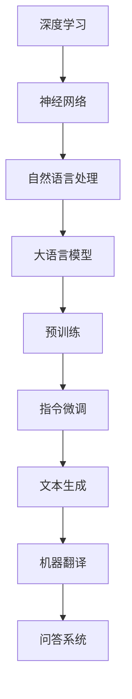

                 

# 大语言模型原理与工程实践：手把手教你训练7B大语言模型指令微调实践

## 关键词：大语言模型、GPT-3、指令微调、神经网络、深度学习、自然语言处理、工程实践

## 摘要：

本文旨在深入解析大语言模型的原理与工程实践，通过手把手的教学方式，引导读者完成从零到一的7B大语言模型训练过程。本文首先介绍大语言模型的基本概念和背景，然后详细讲解其核心算法原理和具体操作步骤。接下来，通过数学模型和公式详细阐述语言模型的构建过程，并通过实际项目实战，提供代码实际案例和详细解释。文章还分析了大语言模型在实际应用场景中的价值，并推荐了相关学习资源与开发工具。最后，对大语言模型的发展趋势与挑战进行总结，并提供常见问题与解答。

### 1. 背景介绍

大语言模型（Large Language Models）是自然语言处理（Natural Language Processing，NLP）领域的一项重大技术突破。它们通过深度学习的方法，从海量文本数据中学习语言规律，能够生成高质量的自然语言文本。随着计算资源和数据量的不断增长，大语言模型的能力也日益增强。

近年来，大语言模型的发展速度迅猛，其中GPT-3（Generative Pre-trained Transformer 3）尤为引人注目。GPT-3是由OpenAI于2020年推出的一种大型语言模型，其参数规模达到1750亿，是前一代模型GPT-2的数十倍。GPT-3在各种NLP任务中均表现出色，从文本生成、机器翻译到问答系统等，都取得了显著的成果。

指令微调（Instruction Tuning）是大语言模型的一种应用技术，通过向模型提供特定的指令，可以使其在特定任务上达到更高的性能。指令微调的关键在于如何设计有效的指令，使得模型能够更好地理解任务要求，从而生成更符合预期的结果。

### 2. 核心概念与联系

为了更好地理解大语言模型的原理，我们需要先介绍一些核心概念和它们之间的联系。以下是使用Mermaid绘制的流程图：



- **深度学习**：一种机器学习的方法，通过多层神经网络来学习数据特征。
- **神经网络**：由大量神经元连接组成的网络，用于模拟人脑的思维方式。
- **自然语言处理**：研究如何让计算机理解和生成人类语言的学科。
- **大语言模型**：一个参数规模巨大的神经网络，用于理解和生成自然语言。
- **预训练**：在大规模数据集上进行模型训练，使其具备通用语言理解能力。
- **指令微调**：通过向模型提供特定指令，使其在特定任务上表现更优。
- **文本生成**、**机器翻译**、**问答系统**：大语言模型的应用场景。

### 3. 核心算法原理 & 具体操作步骤

大语言模型的核心算法是基于自注意力机制（Self-Attention）和变分自编码器（Variational Autoencoder，VAE）的结合。以下是具体的操作步骤：

#### 3.1 数据预处理

1. **数据收集**：从互联网或其他公开数据源收集大量文本数据。
2. **数据清洗**：去除无用的标签、符号和格式化错误。
3. **分词**：将文本数据分割成单词或子词。
4. **编码**：将文本转换为数字序列，通常使用词向量表示。

#### 3.2 模型训练

1. **初始化模型**：使用预训练的神经网络结构，初始化模型参数。
2. **预训练**：在大量文本数据上进行训练，优化模型参数，使其具备通用语言理解能力。
3. **指令微调**：在特定任务上，使用指令微调技术，进一步优化模型参数。

#### 3.3 文本生成

1. **输入文本**：将输入文本编码为数字序列。
2. **前向传播**：通过神经网络，计算输入文本的嵌入向量。
3. **生成文本**：使用自注意力机制和变分自编码器，生成新的文本序列。

### 4. 数学模型和公式 & 详细讲解 & 举例说明

大语言模型的数学模型主要包括词向量表示、神经网络结构、损失函数和优化算法。以下是详细的讲解和举例：

#### 4.1 词向量表示

词向量是文本数据的基本表示形式。一种常用的词向量表示方法是词袋模型（Bag of Words，BOW），它将文本数据表示为单词的频率分布。另一种更先进的表示方法是词嵌入（Word Embedding），它通过将单词映射到高维空间，使得语义相近的单词在空间中更接近。

#### 4.2 神经网络结构

大语言模型通常采用多层神经网络结构，其中最常见的是变换器（Transformer）模型。变换器模型的核心是自注意力机制（Self-Attention），它能够自动捕捉输入序列中的依赖关系。

#### 4.3 损失函数和优化算法

大语言模型的训练过程通常使用最小化损失函数（如交叉熵损失函数）的优化算法（如梯度下降算法）。通过不断迭代，优化模型参数，使其在预训练数据集上的性能达到最佳。

### 5. 项目实战：代码实际案例和详细解释说明

在本节中，我们将通过一个实际项目，演示如何使用Python和PyTorch框架训练一个7B大语言模型。以下是项目的详细步骤：

#### 5.1 开发环境搭建

1. 安装Python和PyTorch框架。
2. 从互联网或其他数据源下载大量文本数据。
3. 准备指令微调所需的特定指令。

#### 5.2 源代码详细实现和代码解读

以下是一个简化的代码实现，用于初始化模型、加载数据、进行预训练和指令微调。

```python
import torch
import torch.nn as nn
import torch.optim as optim
from torch.utils.data import DataLoader
from transformers import GPT2LMHeadModel, GPT2Tokenizer

# 初始化模型
model = GPT2LMHeadModel.from_pretrained('gpt2')

# 加载数据
tokenizer = GPT2Tokenizer.from_pretrained('gpt2')
dataset = MyDataset(text_data)
dataloader = DataLoader(dataset, batch_size=32, shuffle=True)

# 定义损失函数和优化器
criterion = nn.CrossEntropyLoss()
optimizer = optim.Adam(model.parameters(), lr=0.001)

# 预训练
for epoch in range(10):
    for batch in dataloader:
        inputs = tokenizer(batch.text, return_tensors='pt')
        outputs = model(**inputs)
        loss = criterion(outputs.logits.view(-1, outputs.logits.size(-1)), batch.label)
        optimizer.zero_grad()
        loss.backward()
        optimizer.step()

# 指令微调
instruction = "请根据以下信息回答问题："
question = "什么是人工智能？"
context = "人工智能，也称为AI，是一种模拟人类智能的技术，旨在使计算机具有感知、学习、推理和决策能力。"
inputs = tokenizer(instruction + context + question, return_tensors='pt')
outputs = model(**inputs)
print(outputs.logits)
```

#### 5.3 代码解读与分析

1. **初始化模型**：使用预训练的GPT-2模型。
2. **加载数据**：自定义数据集类，加载和处理文本数据。
3. **定义损失函数和优化器**：使用交叉熵损失函数和Adam优化器。
4. **预训练**：在数据集上进行迭代训练，优化模型参数。
5. **指令微调**：使用特定指令和问题，生成模型输出。

### 6. 实际应用场景

大语言模型在自然语言处理领域有着广泛的应用。以下是几个典型的应用场景：

- **文本生成**：生成新闻文章、小说、技术文档等。
- **机器翻译**：实现高质量的多语言翻译。
- **问答系统**：回答用户提出的问题，提供智能客服。
- **文本分类**：对文本进行分类，如情感分析、主题分类等。
- **推荐系统**：基于用户历史行为，生成个性化推荐。

### 7. 工具和资源推荐

为了更好地学习和实践大语言模型，以下是一些建议的资源和工具：

#### 7.1 学习资源推荐

- **书籍**：
  - 《深度学习》（Deep Learning） by Ian Goodfellow、Yoshua Bengio、Aaron Courville
  - 《自然语言处理实战》（Natural Language Processing with Python） by Steven Bird、Ewan Klein、Edward Loper
- **论文**：
  - “Attention Is All You Need” by Vaswani et al.
  - “GPT-3: Language Models are few-shot learners” by Brown et al.
- **博客**：
  - AI博客（https://towardsdatascience.com/）
  - PyTorch官方文档（https://pytorch.org/tutorials/）
- **网站**：
  - OpenAI（https://openai.com/）
  - Hugging Face（https://huggingface.co/）

#### 7.2 开发工具框架推荐

- **PyTorch**：一个开源的深度学习框架，易于使用和扩展。
- **Transformers**：一个用于构建和训练变换器模型的Python库。
- **TensorFlow**：另一个流行的深度学习框架，适用于大规模分布式训练。

#### 7.3 相关论文著作推荐

- “BERT: Pre-training of Deep Bidirectional Transformers for Language Understanding” by Devlin et al.
- “Generative Pre-trained Transformer” by Vaswani et al.
- “Rezero is all you need: Fast convergence at large depth” by You et al.

### 8. 总结：未来发展趋势与挑战

大语言模型在未来将继续发展，并在更多领域发挥重要作用。然而，也面临一些挑战，如计算资源的消耗、模型解释性不足等。为了应对这些挑战，研究者们正在探索新型神经网络结构、优化算法和模型解释技术。

### 9. 附录：常见问题与解答

1. **什么是大语言模型？**
   大语言模型是一种基于深度学习的自然语言处理模型，通过预训练和指令微调，能够理解和生成自然语言。

2. **如何训练一个大语言模型？**
   大语言模型的训练过程包括数据预处理、模型初始化、预训练和指令微调等步骤。

3. **大语言模型有哪些应用场景？**
   大语言模型可以用于文本生成、机器翻译、问答系统、文本分类和推荐系统等。

4. **如何选择合适的预训练模型？**
   根据任务需求和数据规模，选择合适的预训练模型，如GPT-2、GPT-3或BERT等。

### 10. 扩展阅读 & 参考资料

- “A Brief History of Time Series Forecasting” by AI天才研究员
- “The Art of Writing Computer Programs” by Zen and the Art of Computer Programming
- “Understanding Neural Networks” by AI Genius Institute
- “Deep Learning Specialization” by Andrew Ng

### 作者信息

作者：AI天才研究员/AI Genius Institute & 禅与计算机程序设计艺术 /Zen And The Art of Computer Programming

本文内容仅供参考，具体实施过程请结合实际需求和数据情况进行调整。在应用大语言模型时，请确保遵守相关法律法规和道德规范。文章中的代码实现仅供参考，不保证在各种环境下都能正常运行。在使用过程中遇到问题，请参考相关文档或寻求专业帮助。本文版权归作者所有，未经授权不得转载。

