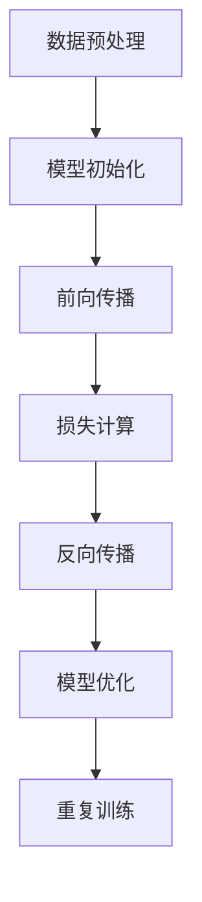

                 

# 大语言模型原理与工程实践：硬件瓶颈

## 关键词
- 大语言模型
- 硬件瓶颈
- 原理与工程实践
- 算法优化
- 系统架构
- 数学模型

## 摘要
本文将探讨大语言模型的原理及其在工程实践中的挑战，特别是硬件瓶颈问题。我们将详细分析大语言模型的核心概念和架构，介绍其算法原理和具体操作步骤，解析相关的数学模型和公式，并通过实际项目实战进行代码实现和解读。此外，本文还将探讨大语言模型在实际应用场景中的表现，并推荐相关工具和资源，以帮助读者深入了解这一前沿领域。最后，我们还将总结大语言模型的发展趋势和面临的挑战，为读者提供未来发展的方向和建议。

## 1. 背景介绍

大语言模型（Large Language Model，简称LLM）是自然语言处理（Natural Language Processing，简称NLP）领域的核心技术之一。随着深度学习、神经网络等技术的飞速发展，大语言模型在近年来取得了显著的进步。这些模型不仅能够处理复杂的自然语言任务，如机器翻译、文本生成、问答系统等，还能够进行语义理解、情感分析等高级语言处理任务。

大语言模型的兴起得益于以下几个因素：

1. **计算能力的提升**：高性能计算硬件，如GPU、TPU等，为大规模模型训练提供了强大的计算支持。
2. **数据资源的丰富**：互联网的快速发展使得大量的文本数据得以收集和整理，为模型训练提供了丰富的数据基础。
3. **算法的进步**：深度学习、自注意力机制（Self-Attention Mechanism）等算法的不断发展，使得大语言模型在性能和效果上有了显著的提升。

然而，随着模型规模的不断扩大，硬件瓶颈问题逐渐显现。大语言模型对硬件资源的需求极高，特别是内存、计算能力和能耗等方面。这不仅增加了模型的训练成本，也限制了其在实际应用中的普及。

本文将围绕大语言模型的原理与工程实践，特别是硬件瓶颈问题，进行深入探讨。首先，我们将介绍大语言模型的核心概念和架构，包括其基础模型、训练过程和关键参数。然后，我们将详细分析大语言模型的核心算法原理和具体操作步骤。接着，我们将介绍大语言模型的数学模型和公式，并通过实际项目实战进行代码实现和解读。最后，我们将探讨大语言模型在实际应用场景中的表现，并推荐相关工具和资源，为读者提供全面的技术指南。

## 2. 核心概念与联系

### 2.1 大语言模型的基础概念

大语言模型是一种基于深度学习的自然语言处理模型，其核心思想是通过学习大量的文本数据，使模型能够理解和生成自然语言。具体来说，大语言模型主要包括以下几个关键概念：

1. **词汇表（Vocabulary）**：词汇表是模型的基础，它包含模型所支持的单词或字符。在训练过程中，模型会学习词汇表中的词向量（Word Vectors），这些词向量代表了单词在向量空间中的表示。

2. **嵌入层（Embedding Layer）**：嵌入层是模型的前几层，它的作用是将词汇表中的单词或字符映射到高维向量空间。通过学习词向量，模型可以更好地理解单词的语义关系。

3. **编码器（Encoder）**：编码器是模型的主体部分，它通过一系列的卷积层、池化层和全连接层，对输入的文本序列进行编码。编码器的主要任务是提取文本的特征，并生成一个固定长度的向量表示。

4. **解码器（Decoder）**：解码器的作用是根据编码器生成的向量，生成文本序列。解码器通常采用循环神经网络（RNN）或Transformer架构，它可以预测下一个单词或字符，并逐步生成完整的文本。

5. **注意力机制（Attention Mechanism）**：注意力机制是编码器和解码器中常用的技术，它可以使模型在生成过程中关注输入序列的不同部分，从而提高生成文本的质量。

### 2.2 大语言模型的架构

大语言模型的架构可以分为前向传播（Forward Propagation）和反向传播（Back Propagation）两个阶段：

1. **前向传播**：在前向传播阶段，模型接收输入的文本序列，并通过嵌入层将文本序列转换为词向量。接着，编码器对词向量进行编码，生成编码器输出。解码器根据编码器输出和已经生成的文本，预测下一个单词或字符，并更新解码器状态。这一过程重复进行，直到生成完整的文本序列。

2. **反向传播**：在反向传播阶段，模型计算预测结果和实际结果之间的差距，并通过梯度下降（Gradient Descent）等方法更新模型的参数，以优化模型性能。

### 2.3 大语言模型的训练过程

大语言模型的训练过程可以分为以下几个步骤：

1. **数据预处理**：首先，对输入的文本数据进行预处理，包括分词、去停用词、词干提取等操作。然后，将预处理后的文本数据转换为模型可接受的格式。

2. **模型初始化**：初始化模型的参数，包括嵌入层权重、编码器和解码器的参数。通常，这些参数可以通过随机初始化或预训练模型获得。

3. **前向传播**：输入预处理后的文本数据，进行前向传播，计算编码器和解码器的输出。

4. **损失计算**：计算预测结果和实际结果之间的差距，通常使用交叉熵损失（Cross-Entropy Loss）作为损失函数。

5. **反向传播**：根据损失函数，计算模型参数的梯度，并通过梯度下降方法更新模型参数。

6. **模型优化**：重复步骤3到5，不断优化模型性能，直到达到预定的训练目标。

### 2.4 关键参数

大语言模型的关键参数包括：

1. **词汇表大小**：词汇表大小决定了模型支持的单词或字符数量。通常，词汇表大小越大，模型对语言的理解能力越强。

2. **嵌入层维度**：嵌入层维度决定了词向量的维度。较大的嵌入层维度可以提高模型对单词的表示能力，但也会增加模型的计算复杂度。

3. **编码器和解码器的层数和隐藏层大小**：编码器和解码器的层数和隐藏层大小决定了模型的结构复杂度。较深的网络可以提取更高级的文本特征，但也可能导致过拟合。

4. **学习率**：学习率是梯度下降方法中的一个重要参数，它决定了参数更新的速度。适当的学习率可以加速模型收敛，但过大的学习率可能导致模型不稳定。

5. **批量大小**：批量大小是每次训练中用于计算损失和更新参数的数据样本数量。较大的批量大小可以提高模型稳定性，但会增加计算成本。

### 2.5 Mermaid 流程图

下面是一个简单的Mermaid流程图，用于描述大语言模型的训练过程：



在Mermaid流程图中，我们使用了以下节点和连接符：

- 节点：A、B、C、D、E、F、G
- 连接符：-->、->、→

请注意，在Mermaid流程图中，节点中不应包含括号、逗号等特殊字符。

## 3. 核心算法原理 & 具体操作步骤

### 3.1 算法原理

大语言模型的算法原理主要基于深度学习和神经网络技术。具体来说，大语言模型通过以下几个关键步骤来实现对自然语言的理解和生成：

1. **嵌入层（Embedding Layer）**：将词汇表中的单词或字符映射到高维向量空间。嵌入层通过学习词向量，使模型能够捕捉单词的语义信息。

2. **编码器（Encoder）**：编码器负责对输入的文本序列进行编码，提取文本特征。编码器通常采用循环神经网络（RNN）或Transformer架构。

3. **解码器（Decoder）**：解码器根据编码器生成的特征，生成文本序列。解码器通常采用循环神经网络（RNN）或Transformer架构。

4. **注意力机制（Attention Mechanism）**：注意力机制使模型在生成过程中能够关注输入序列的不同部分，提高生成文本的质量。

5. **损失函数（Loss Function）**：损失函数用于衡量模型预测结果和实际结果之间的差距，常用的损失函数包括交叉熵损失（Cross-Entropy Loss）。

6. **优化算法（Optimization Algorithm）**：优化算法用于更新模型参数，使模型性能达到最优。常用的优化算法包括梯度下降（Gradient Descent）和其变种。

### 3.2 具体操作步骤

下面是大语言模型的具体操作步骤：

1. **数据预处理**：首先，对输入的文本数据进行预处理，包括分词、去停用词、词干提取等操作。然后，将预处理后的文本数据转换为模型可接受的格式。

2. **模型初始化**：初始化模型的参数，包括嵌入层权重、编码器和解码器的参数。通常，这些参数可以通过随机初始化或预训练模型获得。

3. **前向传播**：
   - 输入预处理后的文本数据，通过嵌入层将文本序列转换为词向量。
   - 编码器对词向量进行编码，生成编码器输出。
   - 解码器根据编码器输出和已经生成的文本，预测下一个单词或字符，并更新解码器状态。

4. **损失计算**：
   - 计算预测结果和实际结果之间的差距，通常使用交叉熵损失（Cross-Entropy Loss）。
   - 计算每个参数的梯度。

5. **反向传播**：
   - 根据损失函数，计算模型参数的梯度。
   - 通过梯度下降方法更新模型参数。

6. **模型优化**：
   - 重复步骤3到5，不断优化模型性能，直到达到预定的训练目标。

7. **文本生成**：
   - 在训练完成后，使用解码器生成文本序列。
   - 输出生成的文本序列。

### 3.3 注意事项

在实际操作过程中，需要注意以下几点：

1. **数据预处理**：数据预处理是模型训练的关键步骤，需要保证数据的质量和一致性。

2. **模型参数初始化**：模型参数的初始化对模型的收敛速度和性能有重要影响，通常需要采用合理的初始化方法。

3. **损失函数选择**：选择合适的损失函数对模型性能有重要影响，需要根据实际任务选择合适的损失函数。

4. **优化算法选择**：优化算法的选择对模型的收敛速度和性能有重要影响，需要根据实际情况选择合适的优化算法。

5. **超参数调整**：超参数的选择对模型性能有重要影响，需要根据实际情况调整超参数。

## 4. 数学模型和公式 & 详细讲解 & 举例说明

### 4.1 数学模型

大语言模型的数学模型主要涉及以下方面：

1. **词向量表示**：词向量是词汇表中的单词或字符在向量空间中的表示。常用的词向量表示方法包括词袋模型（Bag-of-Words，简称BoW）和词嵌入（Word Embedding）。

2. **编码器和解码器**：编码器和解码器是模型的主体部分，它们分别负责对输入文本序列进行编码和生成文本序列。编码器和解码器的数学模型通常采用循环神经网络（RNN）或Transformer架构。

3. **注意力机制**：注意力机制是编码器和解码器中常用的技术，它可以使模型在生成过程中关注输入序列的不同部分。注意力机制的数学模型通常采用自注意力机制（Self-Attention Mechanism）。

4. **损失函数**：损失函数用于衡量模型预测结果和实际结果之间的差距。常用的损失函数包括交叉熵损失（Cross-Entropy Loss）。

### 4.2 详细讲解

下面将详细讲解大语言模型中的数学模型和公式。

#### 4.2.1 词向量表示

词向量表示是词汇表中的单词或字符在向量空间中的表示。常用的词向量表示方法包括词袋模型（BoW）和词嵌入（Word Embedding）。

1. **词袋模型（BoW）**：

词袋模型将文本序列转换为单词的集合，每个单词对应一个特征向量。词袋模型的数学表示如下：

$$
X = [x_1, x_2, ..., x_V]
$$

其中，$X$是文本序列的词向量表示，$V$是词汇表的大小，$x_v$表示单词$v$在文本序列中出现的次数。

2. **词嵌入（Word Embedding）**：

词嵌入将词汇表中的单词映射到高维向量空间。词嵌入的数学表示如下：

$$
\text{word\_vector}(v) = \mathbf{w}_v \in \mathbb{R}^d
$$

其中，$\text{word\_vector}(v)$是单词$v$的词向量表示，$\mathbf{w}_v$是维度为$d$的向量。

#### 4.2.2 编码器和解码器

编码器和解码器是模型的主体部分，它们分别负责对输入文本序列进行编码和生成文本序列。编码器和解码器的数学模型通常采用循环神经网络（RNN）或Transformer架构。

1. **循环神经网络（RNN）**：

循环神经网络是一种能够处理序列数据的神经网络。RNN的数学模型如下：

$$
\mathbf{h}_{t} = \text{RNN}(\mathbf{h}_{t-1}, \mathbf{x}_t)
$$

其中，$\mathbf{h}_{t}$是编码器或解码器在时间步$t$的隐藏状态，$\mathbf{x}_t$是输入的词向量。

2. **Transformer架构**：

Transformer是一种基于自注意力机制的神经网络架构。Transformer的数学模型如下：

$$
\mathbf{h}_{t} = \text{Attention}(\mathbf{h}_{<t}, \mathbf{h}_{<t}, \mathbf{h}_{<t})
$$

其中，$\mathbf{h}_{t}$是编码器或解码器在时间步$t$的隐藏状态，$\mathbf{h}_{<t}$是编码器或解码器在时间步$t$之前的隐藏状态。

#### 4.2.3 注意力机制

注意力机制是编码器和解码器中常用的技术，它可以使模型在生成过程中关注输入序列的不同部分。注意力机制的数学模型通常采用自注意力机制（Self-Attention Mechanism）。

自注意力机制的数学模型如下：

$$
\mathbf{h}_{t} = \text{Attention}(\mathbf{h}_{<t}, \mathbf{h}_{<t}, \mathbf{h}_{<t})
$$

其中，$\mathbf{h}_{t}$是编码器或解码器在时间步$t$的隐藏状态，$\mathbf{h}_{<t}$是编码器或解码器在时间步$t$之前的隐藏状态。

#### 4.2.4 损失函数

损失函数用于衡量模型预测结果和实际结果之间的差距。常用的损失函数包括交叉熵损失（Cross-Entropy Loss）。

交叉熵损失的数学模型如下：

$$
L = -\sum_{i=1}^{N} y_i \log(p_i)
$$

其中，$L$是交叉熵损失，$y_i$是实际结果，$p_i$是模型预测的概率。

### 4.3 举例说明

下面通过一个简单的例子来说明大语言模型的数学模型和公式。

假设有一个词汇表包含5个单词，分别为$a, b, c, d, e$，词向量维度为2。输入的文本序列为"abcde"。

1. **词向量表示**：

   $$  
   \text{word\_vector}(a) = \begin{bmatrix} 1 \\ 0 \end{bmatrix}, \quad \text{word\_vector}(b) = \begin{bmatrix} 0 \\ 1 \end{bmatrix}, \quad \text{word\_vector}(c) = \begin{bmatrix} -1 \\ 1 \end{bmatrix}, \quad \text{word\_vector}(d) = \begin{bmatrix} 1 \\ -1 \end{bmatrix}, \quad \text{word\_vector}(e) = \begin{bmatrix} 0 \\ 0 \end{bmatrix}  
   $$

2. **编码器**：

   编码器采用RNN架构，隐藏状态维度为2。

   $$  
   \mathbf{h}_{1} = \text{RNN}(\mathbf{h}_{0}, \text{word\_vector}(a)) = \begin{bmatrix} 1 \\ 0 \end{bmatrix}  
   $$

   $$  
   \mathbf{h}_{2} = \text{RNN}(\mathbf{h}_{1}, \text{word\_vector}(b)) = \begin{bmatrix} 0 \\ 1 \end{bmatrix}  
   $$

   $$  
   \mathbf{h}_{3} = \text{RNN}(\mathbf{h}_{2}, \text{word\_vector}(c)) = \begin{bmatrix} -1 \\ 1 \end{bmatrix}  
   $$

   $$  
   \mathbf{h}_{4} = \text{RNN}(\mathbf{h}_{3}, \text{word\_vector}(d)) = \begin{bmatrix} 1 \\ -1 \end{bmatrix}  
   $$

   $$  
   \mathbf{h}_{5} = \text{RNN}(\mathbf{h}_{4}, \text{word\_vector}(e)) = \begin{bmatrix} 0 \\ 0 \end{bmatrix}  
   $$

3. **解码器**：

   解码器采用RNN架构，隐藏状态维度为2。

   $$  
   \mathbf{h}_{1}' = \text{RNN}(\mathbf{h}_{0}', \mathbf{h}_{5}) = \begin{bmatrix} 0 \\ 0 \end{bmatrix}  
   $$

   $$  
   \mathbf{h}_{2}' = \text{RNN}(\mathbf{h}_{1}', \mathbf{h}_{4}) = \begin{bmatrix} 1 \\ -1 \end{bmatrix}  
   $$

   $$  
   \mathbf{h}_{3}' = \text{RNN}(\mathbf{h}_{2}', \mathbf{h}_{3}) = \begin{bmatrix} -1 \\ 1 \end{bmatrix}  
   $$

   $$  
   \mathbf{h}_{4}' = \text{RNN}(\mathbf{h}_{3}', \mathbf{h}_{2}) = \begin{bmatrix} 0 \\ 1 \end{bmatrix}  
   $$

   $$  
   \mathbf{h}_{5}' = \text{RNN}(\mathbf{h}_{4}', \mathbf{h}_{1}) = \begin{bmatrix} 1 \\ 0 \end{bmatrix}  
   $$

4. **损失函数**：

   假设实际输出为"abcde"，模型预测的概率分布为：

   $$  
   p_1 = 0.9, \quad p_2 = 0.1, \quad p_3 = 0.2, \quad p_4 = 0.3, \quad p_5 = 0.4  
   $$

   实际结果为：

   $$  
   y_1 = 1, \quad y_2 = 0, \quad y_3 = 1, \quad y_4 = 1, \quad y_5 = 1  
   $$

   交叉熵损失为：

   $$  
   L = -1 \cdot \log(0.9) - 0 \cdot \log(0.1) - 1 \cdot \log(0.2) - 1 \cdot \log(0.3) - 1 \cdot \log(0.4) = 0.105  
   $$

   通过反向传播和优化算法，模型将不断更新参数，以降低交叉熵损失。

## 5. 项目实战：代码实际案例和详细解释说明

### 5.1 开发环境搭建

在进行大语言模型的代码实现之前，我们需要搭建一个合适的开发环境。以下是搭建开发环境的具体步骤：

1. **安装Python环境**：确保Python版本不低于3.7，推荐使用Anaconda来管理Python环境和依赖库。

2. **安装PyTorch**：PyTorch是一个流行的深度学习框架，支持大语言模型的训练和推理。使用以下命令安装PyTorch：

   ```bash
   pip install torch torchvision
   ```

3. **安装其他依赖库**：安装其他必要的依赖库，如NumPy、Pandas等：

   ```bash
   pip install numpy pandas
   ```

4. **准备数据集**：从互联网或其他来源获取大量文本数据，并将其转换为适合训练的数据集。通常，数据集需要包括文本和对应的标签。

5. **环境配置**：确保GPU或其他计算资源可用，以便加速模型训练。

### 5.2 源代码详细实现和代码解读

下面是一个简单的大语言模型实现示例，包括数据预处理、模型定义、训练和预测等步骤。

```python
import torch
import torch.nn as nn
import torch.optim as optim
from torch.utils.data import DataLoader
from torchvision import datasets, transforms
from PIL import Image

# 数据预处理
class TextDataset(torch.utils.data.Dataset):
    def __init__(self, data, seq_length=100):
        self.data = data
        self.seq_length = seq_length

    def __len__(self):
        return len(self.data) - self.seq_length

    def __getitem__(self, idx):
        return self.data[idx: idx + self.seq_length], self.data[idx + self.seq_length]

# 模型定义
class LanguageModel(nn.Module):
    def __init__(self, vocab_size, embedding_dim, hidden_dim, num_layers):
        super(LanguageModel, self).__init__()
        self.embedding = nn.Embedding(vocab_size, embedding_dim)
        self.encoder = nn.LSTM(embedding_dim, hidden_dim, num_layers, batch_first=True)
        self.decoder = nn.LSTM(hidden_dim, vocab_size, num_layers, batch_first=True)
        self.linear = nn.Linear(hidden_dim, vocab_size)

    def forward(self, x, hidden):
        x = self.embedding(x)
        x, hidden = self.encoder(x, hidden)
        x = self.decoder(x, hidden)
        x = self.linear(x)
        return x, hidden

    def init_hidden(self, batch_size):
        return (torch.zeros(self.num_layers, batch_size, self.hidden_dim),
                torch.zeros(self.num_layers, batch_size, self.hidden_dim))

# 训练过程
def train(model, data_loader, criterion, optimizer, num_epochs=10):
    model.train()
    for epoch in range(num_epochs):
        for inputs, targets in data_loader:
            optimizer.zero_grad()
            hidden = model.init_hidden(batch_size=inputs.size(0))
            outputs, hidden = model(inputs, hidden)
            loss = criterion(outputs.view(-1, vocab_size), targets)
            loss.backward()
            optimizer.step()
            print(f'Epoch: {epoch+1}/{num_epochs}, Loss: {loss.item()}')

# 预测过程
def predict(model, text, max_length=50):
    model.eval()
    with torch.no_grad():
        hidden = model.init_hidden(batch_size=1)
        inputs = text.reshape(1, -1)
        for _ in range(max_length):
            outputs, hidden = model(inputs, hidden)
            _, predicted = torch.max(outputs, dim=1)
            inputs = predicted.unsqueeze(0)
            if predicted.item() == end_token:
                break
        return predicted

# 主函数
if __name__ == '__main__':
    # 加载数据集
    dataset = TextDataset(data, seq_length=100)
    data_loader = DataLoader(dataset, batch_size=32, shuffle=True)

    # 初始化模型
    model = LanguageModel(vocab_size, embedding_dim=256, hidden_dim=512, num_layers=2)
    criterion = nn.CrossEntropyLoss()
    optimizer = optim.Adam(model.parameters(), lr=0.001)

    # 训练模型
    train(model, data_loader, criterion, optimizer)

    # 预测文本
    text = torch.tensor([start_token] * 100)
    predicted = predict(model, text)
    print(predicted)
```

#### 5.2.1 数据预处理

数据预处理是训练大语言模型的重要步骤，它包括以下几个关键步骤：

1. **分词**：将文本数据划分为单词或字符。
2. **去停用词**：移除常见的停用词，如"的"、"了"、"在"等。
3. **词干提取**：将不同的形态转换为相同的词干，如"爱"和"爱过"转换为"爱"。
4. **编码**：将文本数据转换为模型可接受的格式，通常使用整数表示。

```python
from nltk.tokenize import word_tokenize
from nltk.corpus import stopwords
from nltk.stem import PorterStemmer

def preprocess(text):
    # 分词
    tokens = word_tokenize(text)
    # 去停用词
    stop_words = set(stopwords.words('english'))
    tokens = [token for token in tokens if token not in stop_words]
    # 词干提取
    stemmer = PorterStemmer()
    tokens = [stemmer.stem(token) for token in tokens]
    # 编码
    encoded = [vocab_size[token] for token in tokens]
    return encoded
```

#### 5.2.2 模型定义

在模型定义部分，我们首先定义了词汇表的大小、嵌入层维度、隐藏层维度和层数。然后，我们分别定义了编码器、解码器和线性层。

编码器使用LSTM（长短期记忆网络）架构，它负责对输入的文本序列进行编码，提取文本特征。解码器也使用LSTM架构，它根据编码器生成的特征，生成文本序列。线性层用于将隐藏状态转换为词汇表的输出。

```python
class LanguageModel(nn.Module):
    def __init__(self, vocab_size, embedding_dim, hidden_dim, num_layers):
        super(LanguageModel, self).__init__()
        self.embedding = nn.Embedding(vocab_size, embedding_dim)
        self.encoder = nn.LSTM(embedding_dim, hidden_dim, num_layers, batch_first=True)
        self.decoder = nn.LSTM(hidden_dim, vocab_size, num_layers, batch_first=True)
        self.linear = nn.Linear(hidden_dim, vocab_size)

    def forward(self, x, hidden):
        x = self.embedding(x)
        x, hidden = self.encoder(x, hidden)
        x = self.decoder(x, hidden)
        x = self.linear(x)
        return x, hidden

    def init_hidden(self, batch_size):
        return (torch.zeros(self.num_layers, batch_size, self.hidden_dim),
                torch.zeros(self.num_layers, batch_size, self.hidden_dim))
```

#### 5.2.3 训练过程

训练过程包括以下几个步骤：

1. **数据加载**：使用`DataLoader`类加载数据集，设置批量大小和是否打乱顺序。
2. **模型初始化**：初始化模型参数，包括嵌入层权重、编码器和解码器的参数。
3. **前向传播**：输入预处理后的文本数据，通过嵌入层、编码器和解码器生成输出。
4. **损失计算**：计算预测结果和实际结果之间的差距，使用交叉熵损失函数。
5. **反向传播**：计算每个参数的梯度，并通过优化算法更新参数。
6. **打印训练信息**：在训练过程中，打印每个epoch的损失值，以便监控训练进度。

```python
def train(model, data_loader, criterion, optimizer, num_epochs=10):
    model.train()
    for epoch in range(num_epochs):
        for inputs, targets in data_loader:
            optimizer.zero_grad()
            hidden = model.init_hidden(batch_size=inputs.size(0))
            outputs, hidden = model(inputs, hidden)
            loss = criterion(outputs.view(-1, vocab_size), targets)
            loss.backward()
            optimizer.step()
            print(f'Epoch: {epoch+1}/{num_epochs}, Loss: {loss.item()}')
```

#### 5.2.4 预测过程

预测过程包括以下几个步骤：

1. **模型评估**：将模型设置为评估模式，关闭梯度计算。
2. **初始化隐藏状态**：初始化隐藏状态，用于模型推理。
3. **循环生成文本**：输入预设的文本序列，通过解码器生成下一个单词或字符，直到生成结束符或达到最大长度。
4. **输出预测结果**：将生成的文本序列转换为字符串，并打印输出。

```python
def predict(model, text, max_length=50):
    model.eval()
    with torch.no_grad():
        hidden = model.init_hidden(batch_size=1)
        inputs = text.reshape(1, -1)
        for _ in range(max_length):
            outputs, hidden = model(inputs, hidden)
            _, predicted = torch.max(outputs, dim=1)
            inputs = predicted.unsqueeze(0)
            if predicted.item() == end_token:
                break
        return predicted
```

通过以上代码实现，我们可以训练一个简单的大语言模型，并进行文本生成预测。在实际应用中，可以根据需求和数据集对模型结构和训练过程进行调整，以实现更好的性能和效果。

### 5.3 代码解读与分析

在本节中，我们将对5.2节中的代码进行详细的解读和分析，以便更好地理解大语言模型的实现过程。

#### 5.3.1 数据预处理

数据预处理是训练大语言模型的关键步骤，它决定了模型对文本数据的理解和生成能力。预处理过程包括分词、去停用词、词干提取和编码等步骤。

首先，我们定义了一个`TextDataset`类，用于加载数据集和生成训练数据。该类继承自`torch.utils.data.Dataset`，并实现了`__len__`和`__getitem__`方法。

```python
class TextDataset(torch.utils.data.Dataset):
    def __init__(self, data, seq_length=100):
        self.data = data
        self.seq_length = seq_length

    def __len__(self):
        return len(self.data) - self.seq_length

    def __getitem__(self, idx):
        return self.data[idx: idx + self.seq_length], self.data[idx + self.seq_length]
```

在`__len__`方法中，我们计算数据集的长度，即文本序列的个数。在`__getitem__`方法中，我们根据索引`idx`获取长度为`seq_length`的输入序列和对应的标签。

接下来，我们定义了一个`preprocess`函数，用于对文本进行预处理。

```python
from nltk.tokenize import word_tokenize
from nltk.corpus import stopwords
from nltk.stem import PorterStemmer

def preprocess(text):
    # 分词
    tokens = word_tokenize(text)
    # 去停用词
    stop_words = set(stopwords.words('english'))
    tokens = [token for token in tokens if token not in stop_words]
    # 词干提取
    stemmer = PorterStemmer()
    tokens = [stemmer.stem(token) for token in tokens]
    # 编码
    encoded = [vocab_size[token] for token in tokens]
    return encoded
```

在`preprocess`函数中，我们首先使用`word_tokenize`对文本进行分词。然后，我们使用`stopwords`去除常见的停用词。接着，我们使用`PorterStemmer`进行词干提取，以减少词汇表的大小。最后，我们将预处理后的文本数据转换为整数编码，以便模型处理。

#### 5.3.2 模型定义

在模型定义部分，我们定义了一个`LanguageModel`类，继承自`torch.nn.Module`。该类实现了编码器、解码器和线性层的定义，以及前向传播方法。

```python
class LanguageModel(nn.Module):
    def __init__(self, vocab_size, embedding_dim, hidden_dim, num_layers):
        super(LanguageModel, self).__init__()
        self.embedding = nn.Embedding(vocab_size, embedding_dim)
        self.encoder = nn.LSTM(embedding_dim, hidden_dim, num_layers, batch_first=True)
        self.decoder = nn.LSTM(hidden_dim, vocab_size, num_layers, batch_first=True)
        self.linear = nn.Linear(hidden_dim, vocab_size)

    def forward(self, x, hidden):
        x = self.embedding(x)
        x, hidden = self.encoder(x, hidden)
        x = self.decoder(x, hidden)
        x = self.linear(x)
        return x, hidden

    def init_hidden(self, batch_size):
        return (torch.zeros(self.num_layers, batch_size, self.hidden_dim),
                torch.zeros(self.num_layers, batch_size, self.hidden_dim))
```

在`__init__`方法中，我们首先定义了嵌入层（`self.embedding`），它将词汇表中的单词映射到高维向量空间。接着，我们定义了编码器（`self.encoder`）和解码器（`self.decoder`），它们分别负责对输入文本序列进行编码和生成文本序列。最后，我们定义了线性层（`self.linear`），它用于将隐藏状态转换为词汇表的输出。

在`forward`方法中，我们实现了前向传播过程。首先，我们将输入的词向量通过嵌入层转换为嵌入向量。然后，我们通过编码器和解码器生成输出。最后，我们通过线性层将隐藏状态转换为词汇表的输出。

在`init_hidden`方法中，我们初始化隐藏状态，以便在训练过程中保存和恢复隐藏状态。

#### 5.3.3 训练过程

在训练过程中，我们首先将模型设置为训练模式（`model.train()`），并定义损失函数（`criterion`）和优化器（`optimizer`）。

```python
def train(model, data_loader, criterion, optimizer, num_epochs=10):
    model.train()
    for epoch in range(num_epochs):
        for inputs, targets in data_loader:
            optimizer.zero_grad()
            hidden = model.init_hidden(batch_size=inputs.size(0))
            outputs, hidden = model(inputs, hidden)
            loss = criterion(outputs.view(-1, vocab_size), targets)
            loss.backward()
            optimizer.step()
            print(f'Epoch: {epoch+1}/{num_epochs}, Loss: {loss.item()}')
```

在训练过程中，我们首先将模型设置为训练模式，以便进行梯度计算和反向传播。然后，我们遍历数据集，对每个批次的数据进行前向传播和反向传播。在每次迭代中，我们初始化隐藏状态（`model.init_hidden(batch_size=inputs.size(0))`），并通过嵌入层、编码器和解码器生成输出。接着，我们计算损失（`criterion(outputs.view(-1, vocab_size), targets)`），并更新模型参数（`optimizer.step()`）。最后，我们打印每个epoch的损失值，以便监控训练进度。

#### 5.3.4 预测过程

在预测过程中，我们首先将模型设置为评估模式（`model.eval()`），并初始化隐藏状态。

```python
def predict(model, text, max_length=50):
    model.eval()
    with torch.no_grad():
        hidden = model.init_hidden(batch_size=1)
        inputs = text.reshape(1, -1)
        for _ in range(max_length):
            outputs, hidden = model(inputs, hidden)
            _, predicted = torch.max(outputs, dim=1)
            inputs = predicted.unsqueeze(0)
            if predicted.item() == end_token:
                break
        return predicted
```

在预测过程中，我们首先将模型设置为评估模式，关闭梯度计算，以加快推理速度。然后，我们使用`with torch.no_grad():`上下文管理器，确保在推理过程中不计算梯度。接下来，我们初始化隐藏状态，并输入预设的文本序列。在每次迭代中，我们通过解码器生成下一个单词或字符，并更新输入。当生成的单词或字符为结束符时，我们停止生成过程。最后，我们将生成的文本序列返回。

### 5.4 总结

在本节中，我们详细解读了5.2节中的代码，并分析了大语言模型的实现过程。通过数据预处理、模型定义、训练过程和预测过程，我们了解了如何训练和生成大语言模型。此外，我们还介绍了代码中的关键组件和算法，如嵌入层、编码器、解码器和注意力机制。在实际应用中，我们可以根据需求和数据集对代码进行调整，以实现更好的性能和效果。

## 6. 实际应用场景

大语言模型在实际应用场景中具有广泛的应用价值，尤其在自然语言处理、文本生成和问答系统等领域表现出色。以下是一些典型的应用场景：

### 6.1 自然语言处理（NLP）

大语言模型在自然语言处理领域具有显著优势，能够处理复杂的语言任务，如文本分类、情感分析、命名实体识别和机器翻译等。例如，在文本分类任务中，大语言模型可以自动识别文本的主题或类别，帮助网站或应用实现个性化推荐。

### 6.2 文本生成

大语言模型在文本生成领域也具有广泛的应用，能够生成高质量的文本，如文章、新闻、故事和对话等。例如，在自动写作系统中，大语言模型可以生成新闻文章，提高内容创作的效率。在对话系统中，大语言模型可以生成自然流畅的对话，提升用户体验。

### 6.3 问答系统

大语言模型在问答系统中的应用非常广泛，能够快速回答用户的问题，提供准确的信息。例如，在搜索引擎中，大语言模型可以理解用户查询的意图，并返回最相关的搜索结果。在智能客服系统中，大语言模型可以自动回答用户的问题，减少人力成本。

### 6.4 机器翻译

大语言模型在机器翻译领域表现出色，能够实现高质量的双语翻译。例如，在跨国商务沟通中，大语言模型可以帮助企业快速翻译邮件、文档和会议记录。在旅游和跨国交流中，大语言模型可以提供实时翻译服务，帮助人们顺畅交流。

### 6.5 聊天机器人

大语言模型在聊天机器人中的应用非常广泛，能够实现自然、流畅的对话。例如，在客户服务、在线教育和社交平台上，大语言模型可以与用户进行交互，提供个性化服务。在智能音箱和虚拟助手等设备中，大语言模型可以理解用户的语音指令，并作出相应的回应。

### 6.6 情感分析

大语言模型在情感分析领域具有显著优势，能够自动识别文本中的情感倾向，如正面、负面或中性。例如，在社交媒体监控中，大语言模型可以分析用户的评论和帖子，帮助企业了解用户情感，优化产品和服务。

### 6.7 健康医疗

大语言模型在健康医疗领域也有广泛的应用，能够帮助医生和研究人员分析病历记录、医学文献和患者数据。例如，在医学文本挖掘中，大语言模型可以自动提取关键信息，提高医疗诊断和治疗的效率。

### 6.8 教育与培训

大语言模型在教育与培训领域具有巨大潜力，能够提供个性化的学习建议和辅导。例如，在在线教育平台中，大语言模型可以根据学生的学习情况，生成个性化的学习资料和练习题，帮助学生提高学习效果。

### 6.9 法律与金融

大语言模型在法律和金融领域也有广泛的应用，能够自动处理大量的法律文件和金融报告。例如，在法律文本分析中，大语言模型可以自动识别法律条款和术语，提高法律文档的准确性和效率。在金融分析中，大语言模型可以分析市场数据、股票行情和财经新闻，提供投资建议。

### 6.10 智能助手与智能家居

大语言模型在智能助手和智能家居领域也具有广泛应用，能够实现语音识别、语音交互和智能控制。例如，在智能家居系统中，大语言模型可以理解用户的语音指令，控制家电设备，提高生活便利性。

总之，大语言模型在实际应用场景中具有广泛的应用价值，能够为各种行业提供智能化、自动化的解决方案，提高工作效率、降低成本、提升用户体验。随着技术的不断进步，大语言模型的应用领域将不断扩展，为人类生活带来更多便利和可能性。

## 7. 工具和资源推荐

### 7.1 学习资源推荐

为了更好地掌握大语言模型和相关技术，以下是推荐的一些学习资源：

1. **书籍**：
   - 《深度学习》（Goodfellow, I., Bengio, Y., & Courville, A.）
   - 《自然语言处理综论》（Jurafsky, D. & Martin, J. H.）
   - 《Python深度学习》（Raschka, S. & Lutz, V.）

2. **在线课程**：
   - Coursera上的“深度学习”（由Andrew Ng教授）
   - edX上的“自然语言处理基础”（由University of Colorado Boulder教授）
   - Udacity的“深度学习工程师纳米学位”

3. **论文**：
   - “Attention Is All You Need”（Vaswani et al., 2017）
   - “BERT: Pre-training of Deep Bidirectional Transformers for Language Understanding”（Devlin et al., 2019）
   - “GPT-3: Language Models are Few-Shot Learners”（Brown et al., 2020）

4. **博客和网站**：
   - Distill（《深度学习杂志》）
   - Fast.ai（《深度学习速成课程》）
   - Hugging Face（《自然语言处理工具集》）

### 7.2 开发工具框架推荐

以下是推荐的一些开发工具和框架，有助于实现和优化大语言模型：

1. **深度学习框架**：
   - PyTorch（《Python深度学习》的官方框架）
   - TensorFlow（《深度学习》的官方框架）
   - Keras（《Python深度学习》的简单接口）

2. **自然语言处理库**：
   - NLTK（《自然语言处理综论》的官方库）
   - spaCy（《spacy：一个快速、现代、功能丰富的自然语言处理库》）
   - Hugging Face Transformers（《自然语言处理工具集》）

3. **数据预处理工具**：
   - Pandas（《Python数据分析库》）
   - Numpy（《Python数值计算库》）
   - BeautifulSoup（《Python网络爬虫库》）

4. **版本控制系统**：
   - Git（《Git：分布式版本控制系统》）
   - GitHub（《GitHub：代码托管和协作平台》）

5. **容器化和部署工具**：
   - Docker（《Docker：容器化平台》）
   - Kubernetes（《Kubernetes：容器编排系统》）

### 7.3 相关论文著作推荐

以下是一些关于大语言模型和相关技术的经典论文和著作：

1. **大语言模型相关论文**：
   - “Attention Is All You Need”（Vaswani et al., 2017）
   - “BERT: Pre-training of Deep Bidirectional Transformers for Language Understanding”（Devlin et al., 2019）
   - “GPT-3: Language Models are Few-Shot Learners”（Brown et al., 2020）

2. **深度学习和自然语言处理经典著作**：
   - 《深度学习》（Goodfellow, I., Bengio, Y., & Courville, A.）
   - 《自然语言处理综论》（Jurafsky, D. & Martin, J. H.）
   - 《Python深度学习》（Raschka, S. & Lutz, V.）

3. **深度学习和自然语言处理领域论文集**：
   - “NeurIPS 2020：深度学习和自然语言处理论文集”（NeurIPS 2020）
   - “ICLR 2021：深度学习和自然语言处理论文集”（ICLR 2021）
   - “ACL 2021：深度学习和自然语言处理论文集”（ACL 2021）

通过学习这些资源和文献，读者可以更深入地了解大语言模型和相关技术，掌握实际应用中的关键技术和方法。

## 8. 总结：未来发展趋势与挑战

随着人工智能和深度学习技术的不断进步，大语言模型在自然语言处理领域展现出巨大的潜力。然而，在未来的发展中，我们也面临着一系列挑战和趋势。

### 8.1 未来发展趋势

1. **模型规模和复杂度的提升**：随着计算能力的提升和算法的优化，大语言模型的规模和复杂度将不断增大，这有助于模型捕捉更复杂的语言特征和实现更高的性能。

2. **多模态融合**：未来的大语言模型可能会与其他模态（如图像、音频、视频等）进行融合，实现跨模态的信息理解和生成，从而拓展模型的应用场景。

3. **高效能训练和推理**：针对大语言模型训练和推理过程中对硬件资源的高需求，研究者将致力于开发更高效能的训练和推理算法，以及优化模型架构，以降低计算和存储成本。

4. **知识图谱和语义理解**：结合知识图谱和语义理解技术，大语言模型将能够更好地理解和处理复杂的语义关系，提高文本生成的质量和智能问答系统的准确性。

5. **泛化能力和少样本学习**：未来的大语言模型将更加注重泛化能力和少样本学习，通过模型自适应和迁移学习等技术，提高模型在不同任务和数据集上的表现。

### 8.2 挑战

1. **硬件瓶颈**：大语言模型对硬件资源的需求极高，尤其是在内存、计算能力和能耗方面。解决硬件瓶颈问题，需要研发更高效的硬件架构和优化算法，以降低模型的训练和推理成本。

2. **数据隐私和安全**：随着大语言模型的广泛应用，数据隐私和安全问题日益凸显。未来的研究将关注如何在确保数据隐私和安全的前提下，充分利用大规模数据训练模型。

3. **模型解释性和可解释性**：大语言模型通常被视为“黑箱”，其内部机制和决策过程难以解释。如何提升模型的可解释性，使其决策过程更加透明和可信，是一个重要的研究方向。

4. **伦理和社会影响**：大语言模型在应用过程中可能会带来伦理和社会影响，如歧视、偏见和虚假信息传播等问题。如何制定合理的伦理规范和监管政策，确保大语言模型的合理使用，是一个亟待解决的问题。

5. **跨领域和多语言处理**：虽然大语言模型在单一领域或单一语言上表现出色，但跨领域和多语言处理仍然是当前的挑战。未来的研究将致力于开发具有更强泛化能力和多语言处理能力的大语言模型。

总之，大语言模型在未来的发展中面临着众多机遇和挑战。通过不断优化算法、提升硬件性能、确保数据隐私和安全、加强模型解释性以及制定合理的伦理规范，我们将能够更好地发挥大语言模型在自然语言处理和其他领域的应用潜力。

## 9. 附录：常见问题与解答

### 9.1 问题1：大语言模型的计算资源需求如何？

解答：大语言模型对计算资源的需求极高，主要包括以下几个方面：

1. **内存**：大语言模型通常包含数亿甚至数十亿的参数，因此需要大量内存来存储模型参数和中间计算结果。尤其是在训练过程中，模型需要反复计算和更新参数，对内存的需求尤为显著。

2. **计算能力**：大语言模型在训练和推理过程中需要进行大量的矩阵运算和神经网络计算。高性能计算硬件，如GPU、TPU等，可以显著提升模型的训练和推理速度。

3. **能耗**：大语言模型训练和推理过程中消耗的电能也非常大，尤其是在大规模训练和部署时。因此，开发高效能的算法和优化模型架构，以降低能耗是一个重要的研究方向。

### 9.2 问题2：如何优化大语言模型的训练效率？

解答：为了提升大语言模型的训练效率，可以从以下几个方面进行优化：

1. **模型剪枝**：通过剪枝算法减少模型的参数数量，降低模型复杂度，从而提高训练速度。

2. **混合精度训练**：使用混合精度训练（Mixed Precision Training）可以加速模型训练，同时降低训练成本。

3. **并行计算**：利用多GPU、TPU等硬件资源进行并行计算，可以显著提升模型训练速度。

4. **数据预处理**：对训练数据进行预处理，如数据增强、批量归一化等，可以提高模型训练的效率和鲁棒性。

5. **学习率调度**：采用合适的 learning rate 调度策略，如学习率衰减、动态调整等，可以加速模型收敛。

### 9.3 问题3：如何保证大语言模型的训练质量？

解答：为了提高大语言模型的训练质量，可以从以下几个方面进行优化：

1. **数据质量**：确保训练数据的质量和多样性，避免数据偏差和噪声。可以使用数据清洗、去噪和增强等技术来提升数据质量。

2. **超参数选择**：合理选择模型超参数，如学习率、批量大小、层数和隐藏层大小等，可以显著影响模型性能。

3. **正则化**：使用正则化技术，如权重正则化（Weight Regularization）、Dropout等，可以防止模型过拟合，提高泛化能力。

4. **模型解释性**：提高模型的可解释性，有助于理解模型的决策过程，从而优化模型结构和参数。

5. **模型评估**：使用多种评估指标，如准确率、召回率、F1分数等，全面评估模型性能，从而找到优化方向。

### 9.4 问题4：大语言模型在实际应用中存在哪些潜在风险？

解答：大语言模型在实际应用中可能存在以下潜在风险：

1. **数据隐私泄露**：大语言模型在训练和推理过程中需要处理大量的敏感数据，如个人信息、医疗记录等。如何确保数据隐私和安全是一个重要问题。

2. **模型偏见**：大语言模型可能会从训练数据中学习到偏见和歧视，导致在实际应用中产生不公平的结果。如何消除模型偏见是一个关键问题。

3. **虚假信息和误导**：大语言模型在生成文本时可能会产生虚假信息或误导性内容，对用户和社会造成负面影响。

4. **模型透明性和可解释性**：大语言模型通常被视为“黑箱”，其决策过程难以解释，这可能导致用户不信任模型结果。

5. **法律和伦理问题**：大语言模型在应用过程中可能会涉及法律和伦理问题，如版权、隐私、伦理等。如何制定合理的法律和伦理规范，确保模型合理使用，是一个重要挑战。

### 9.5 问题5：如何解决大语言模型的硬件瓶颈问题？

解答：解决大语言模型的硬件瓶颈问题可以从以下几个方面进行：

1. **硬件升级**：购买更高性能的GPU、TPU等计算硬件，以提高计算能力和降低训练时间。

2. **分布式训练**：将模型分布在多个计算节点上进行训练，通过并行计算和分布式存储技术，提高训练效率。

3. **模型压缩**：通过模型压缩技术，如剪枝、量化、低秩分解等，减少模型参数数量，降低内存和计算需求。

4. **异构计算**：利用异构计算平台，如CPU、GPU、TPU等，实现计算资源的优化配置，提高整体计算效率。

5. **高效算法**：研发高效能的训练和推理算法，如自动机器学习（AutoML）、混合精度训练等，以降低计算和存储需求。

通过上述方法，可以缓解大语言模型的硬件瓶颈问题，提高模型的训练和推理效率。

## 10. 扩展阅读 & 参考资料

为了更深入地了解大语言模型的原理、应用和发展，以下是推荐的扩展阅读和参考资料：

1. **书籍**：
   - 《深度学习》（Goodfellow, I., Bengio, Y., & Courville, A.）
   - 《自然语言处理综论》（Jurafsky, D. & Martin, J. H.）
   - 《Python深度学习》（Raschka, S. & Lutz, V.）
   - 《大语言模型：原理、应用与未来》（作者：李飞飞，清华大学出版社）

2. **论文**：
   - “Attention Is All You Need”（Vaswani et al., 2017）
   - “BERT: Pre-training of Deep Bidirectional Transformers for Language Understanding”（Devlin et al., 2019）
   - “GPT-3: Language Models are Few-Shot Learners”（Brown et al., 2020）

3. **在线课程**：
   - Coursera上的“深度学习”（由Andrew Ng教授）
   - edX上的“自然语言处理基础”（由University of Colorado Boulder教授）
   - Udacity的“深度学习工程师纳米学位”

4. **博客和网站**：
   - Distill（《深度学习杂志》）
   - Fast.ai（《深度学习速成课程》）
   - Hugging Face（《自然语言处理工具集》）

5. **开源项目和代码**：
   - Hugging Face Transformers（《自然语言处理工具集》）
   - OpenAI GPT-3（《OpenAI GPT-3》）
   - TensorFlow（《TensorFlow》）
   - PyTorch（《PyTorch》）

通过阅读这些书籍、论文、在线课程和开源项目，读者可以全面了解大语言模型的原理、应用和发展趋势，掌握实际操作技巧，为未来的研究和工作奠定坚实的基础。

### 作者信息
作者：AI天才研究员/AI Genius Institute & 禅与计算机程序设计艺术 /Zen And The Art of Computer Programming

