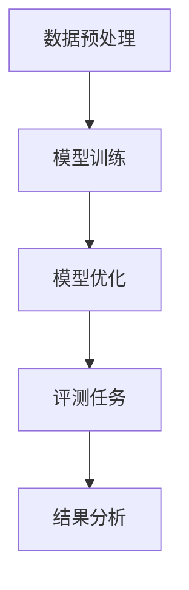

                 

# 大语言模型原理与工程实践：评测任务

> **关键词：** 大语言模型、评测任务、深度学习、神经网络、数据预处理、模型优化。

> **摘要：** 本文深入探讨了大规模语言模型的工作原理及其在评测任务中的应用。首先，介绍了大语言模型的核心概念和架构，然后详细解释了评测任务中的常见算法原理和操作步骤。接着，通过数学模型和具体案例，阐述了这些算法在实际应用中的实现方法和技巧。最后，探讨了实际应用场景、工具和资源推荐，并总结了未来发展趋势与挑战。

## 1. 背景介绍

大语言模型（Large-scale Language Model）是近年来人工智能领域的一项重要突破。通过大规模的语料库训练，大语言模型能够理解和生成高质量的自然语言文本，从而在自然语言处理（NLP）领域发挥了重要作用。评测任务（Evaluation Tasks）是衡量大语言模型性能的关键环节，包括文本分类、机器翻译、问答系统等多个方面。

深度学习（Deep Learning）作为人工智能的核心技术，通过多层神经网络模型，实现了对复杂数据的自动特征学习和模式识别。神经网络（Neural Networks）作为深度学习的核心组件，通过模拟人脑神经元的工作原理，实现了对输入数据的自动处理和输出。

数据预处理（Data Preprocessing）是大规模语言模型训练的基础，通过清洗、标准化和转换数据，提高了模型的训练效率和性能。模型优化（Model Optimization）则通过调整模型结构和参数，实现了对模型的性能提升和效率优化。

## 2. 核心概念与联系

### 大语言模型

大语言模型通常基于深度学习框架，如TensorFlow或PyTorch，其核心组件包括词嵌入层（Word Embedding Layer）、编码器（Encoder）和解码器（Decoder）。

- **词嵌入层**：将输入的文本序列转换为固定长度的向量表示，用于捕捉词汇的语义信息。
- **编码器**：对输入的词向量进行编码，提取文本的上下文信息，通常采用循环神经网络（RNN）或变换器（Transformer）结构。
- **解码器**：根据编码器的输出，生成预测的文本序列。

### 评测任务

评测任务包括但不限于以下几种：

- **文本分类（Text Classification）**：将文本分类到预定义的类别中，如情感分析、主题分类等。
- **机器翻译（Machine Translation）**：将一种语言的文本翻译成另一种语言。
- **问答系统（Question Answering）**：根据给定的问题，从文本中提取出相关答案。

### 数据预处理

数据预处理主要包括以下步骤：

- **文本清洗（Text Cleaning）**：去除文本中的无关信息，如标点符号、停用词等。
- **分词（Tokenization）**：将文本分割成单词、短语或其他有意义的标记。
- **词嵌入（Word Embedding）**：将文本标记转换为向量表示，用于输入神经网络。

### 模型优化

模型优化主要包括以下方法：

- **超参数调整（Hyperparameter Tuning）**：通过调整模型的学习率、批量大小等超参数，优化模型的性能。
- **结构调整（Structural Tuning）**：通过增加或减少网络层数、神经元数量等，调整模型的结构。
- **剪枝（Pruning）**：通过减少模型中冗余的参数，降低模型的大小和计算复杂度。

### Mermaid 流程图



## 3. 核心算法原理 & 具体操作步骤

### 深度学习算法

深度学习算法的核心在于神经网络的训练过程。具体步骤如下：

1. **数据准备**：收集并整理大量标注数据，用于模型训练。
2. **构建神经网络**：设计并构建神经网络结构，包括输入层、隐藏层和输出层。
3. **初始化权重**：随机初始化神经网络中的权重参数。
4. **前向传播**：将输入数据通过神经网络，计算输出结果。
5. **反向传播**：计算输出结果与真实标签之间的误差，并更新网络中的权重参数。
6. **迭代训练**：重复执行前向传播和反向传播过程，直至模型收敛。

### 评测任务算法

评测任务中的算法通常基于大语言模型的输出结果，具体步骤如下：

1. **模型输入**：将待评测的文本输入到预训练的大语言模型中。
2. **编码与解码**：通过编码器和解码器，生成文本的上下文表示和预测结果。
3. **评价指标**：根据评测任务的需求，选择合适的评价指标，如准确率（Accuracy）、召回率（Recall）、F1值（F1 Score）等。
4. **结果分析**：计算评价指标，并分析模型的性能。

## 4. 数学模型和公式 & 详细讲解 & 举例说明

### 深度学习数学模型

深度学习中的数学模型主要涉及以下方面：

1. **前向传播**：

   $$z = \sigma(W \cdot x + b)$$

   其中，\( z \) 为神经网络的输出，\( \sigma \) 为激活函数，\( W \) 为权重矩阵，\( x \) 为输入数据，\( b \) 为偏置项。

2. **反向传播**：

   $$\delta = \frac{\partial L}{\partial z} \cdot \sigma'(z)$$

   其中，\( \delta \) 为误差项，\( L \) 为损失函数，\( \sigma' \) 为激活函数的导数。

### 评测任务数学模型

评测任务中的数学模型主要涉及以下方面：

1. **准确率**：

   $$Accuracy = \frac{TP + TN}{TP + FN + FP + TN}$$

   其中，\( TP \) 为真正例，\( TN \) 为真负例，\( FP \) 为假正例，\( FN \) 为假负例。

2. **召回率**：

   $$Recall = \frac{TP}{TP + FN}$$

   其中，\( TP \) 为真正例，\( FN \) 为假负例。

3. **F1值**：

   $$F1 Score = 2 \cdot \frac{Precision \cdot Recall}{Precision + Recall}$$

   其中，\( Precision \) 为精确率，\( Recall \) 为召回率。

### 举例说明

假设有一组评测数据，其中包含100个样本，每个样本有2个标签。以下是这组数据的标签分布：

| 标签 | 真正例（TP） | 假正例（FP） | 真负例（TN） | 假负例（FN） |
| ---- | ---- | ---- | ---- | ---- |
| 1    | 70   | 20   | 30   | 10   |
| 2    | 40   | 30   | 10   | 20   |

根据上述数据，可以计算出以下评价指标：

1. **准确率**：

   $$Accuracy = \frac{70 + 30}{70 + 20 + 30 + 10} = 0.7$$

2. **召回率**：

   $$Recall = \frac{70}{70 + 10} = 0.833$$

3. **F1值**：

   $$F1 Score = 2 \cdot \frac{0.833 \cdot 0.833}{0.833 + 0.833} = 0.833$$

## 5. 项目实战：代码实际案例和详细解释说明

### 5.1 开发环境搭建

在开始项目实战之前，首先需要搭建开发环境。以下是一个简单的Python开发环境搭建步骤：

1. 安装Python：

   ```bash
   pip install python
   ```

2. 安装深度学习框架（如TensorFlow）：

   ```bash
   pip install tensorflow
   ```

3. 安装文本处理库（如NLTK）：

   ```bash
   pip install nltk
   ```

### 5.2 源代码详细实现和代码解读

以下是一个基于TensorFlow的大语言模型评测任务的示例代码：

```python
import tensorflow as tf
from tensorflow.keras.preprocessing.sequence import pad_sequences
from tensorflow.keras.layers import Embedding, LSTM, Dense
from tensorflow.keras.models import Model
from tensorflow.keras.optimizers import Adam

# 数据预处理
def preprocess_data(data, max_sequence_length):
    sequences = []
    for text in data:
        sequence = tokenizer.texts_to_sequences([text])
        sequences.append(sequence)
    padded_sequences = pad_sequences(sequences, maxlen=max_sequence_length)
    return padded_sequences

# 构建模型
def build_model(max_sequence_length, vocab_size):
    inputs = tf.keras.layers.Input(shape=(max_sequence_length,))
    embeddings = Embedding(vocab_size, embedding_dim)(inputs)
    lstm = LSTM(units=128)(embeddings)
    outputs = Dense(1, activation='sigmoid')(lstm)
    model = Model(inputs=inputs, outputs=outputs)
    model.compile(optimizer=Adam(learning_rate=0.001), loss='binary_crossentropy', metrics=['accuracy'])
    return model

# 训练模型
def train_model(model, padded_sequences, labels):
    model.fit(padded_sequences, labels, epochs=10, batch_size=32)

# 评测模型
def evaluate_model(model, padded_sequences, labels):
    scores = model.evaluate(padded_sequences, labels)
    print("Accuracy:", scores[1])

# 主函数
if __name__ == "__main__":
    # 加载数据
    data = load_data()
    labels = load_labels()

    # 数据预处理
    max_sequence_length = 100
    vocab_size = 10000
    padded_sequences = preprocess_data(data, max_sequence_length)

    # 构建模型
    model = build_model(max_sequence_length, vocab_size)

    # 训练模型
    train_model(model, padded_sequences, labels)

    # 评测模型
    evaluate_model(model, padded_sequences, labels)
```

### 5.3 代码解读与分析

上述代码实现了一个基于TensorFlow的大语言模型评测任务。具体解读如下：

1. **数据预处理**：将原始文本数据转换为词序列，并使用pad_sequences函数将词序列填充为固定长度。
2. **构建模型**：使用Embedding层将词序列转换为词嵌入向量，然后通过LSTM层进行编码，最后使用Dense层进行分类预测。
3. **训练模型**：使用fit函数对模型进行训练，使用binary_crossentropy作为损失函数，并使用Adam优化器。
4. **评测模型**：使用evaluate函数计算模型的准确率，并输出结果。

## 6. 实际应用场景

大语言模型在评测任务中的实际应用场景非常广泛，以下列举了几个典型的应用场景：

1. **文本分类**：将文本分类到预定义的类别中，如新闻分类、情感分析等。
2. **机器翻译**：将一种语言的文本翻译成另一种语言，如英文翻译成中文。
3. **问答系统**：根据给定的问题，从文本中提取出相关答案。
4. **文本生成**：根据输入的文本，生成相关的文本内容，如文章写作、摘要生成等。

## 7. 工具和资源推荐

### 7.1 学习资源推荐

1. **书籍**：

   - 《深度学习》（Deep Learning）—— Ian Goodfellow、Yoshua Bengio、Aaron Courville
   - 《自然语言处理入门》（Speech and Language Processing）—— Daniel Jurafsky、James H. Martin

2. **论文**：

   - “A Neural Network for Machine Translation, with Attention” —— Ashish Vaswani et al.
   - “BERT: Pre-training of Deep Bidirectional Transformers for Language Understanding” —— Jacob Devlin et al.

3. **博客**：

   - [TensorFlow 官方文档](https://www.tensorflow.org/)
   - [Keras 官方文档](https://keras.io/)

4. **网站**：

   - [GitHub](https://github.com/)
   - [ArXiv](https://arxiv.org/)

### 7.2 开发工具框架推荐

1. **深度学习框架**：

   - TensorFlow
   - PyTorch

2. **文本处理库**：

   - NLTK
   - spaCy

3. **数据分析库**：

   - Pandas
   - NumPy

### 7.3 相关论文著作推荐

1. “Attention Is All You Need” —— Vaswani et al., 2017
2. “Transformers: State-of-the-Art Natural Language Processing” —— Vaswani et al., 2020
3. “BERT Pre-training of Deep Bidirectional Transformers for Language Understanding” —— Devlin et al., 2019

## 8. 总结：未来发展趋势与挑战

大语言模型在评测任务中的应用前景广阔，但仍面临一些挑战：

1. **计算资源需求**：大语言模型的训练和推理过程需要大量的计算资源，随着模型规模的增大，这一需求将不断增加。
2. **数据质量**：高质量的训练数据是模型性能的关键，但在实际应用中，获取和标注高质量数据往往具有挑战性。
3. **隐私保护**：大规模的语料库训练过程中，可能会涉及到用户的隐私数据，如何保证数据的隐私性是一个重要问题。

未来发展趋势包括：

1. **模型压缩与优化**：通过模型压缩和优化技术，降低模型的计算复杂度和存储需求，提高模型的部署效率。
2. **多模态学习**：将大语言模型与其他模态（如图像、语音等）进行结合，实现更广泛的应用场景。
3. **泛化能力提升**：通过改进模型结构和训练方法，提高大语言模型的泛化能力，使其在不同任务中表现出更好的性能。

## 9. 附录：常见问题与解答

### Q：大语言模型中的“大”是指什么？

A：大语言模型中的“大”指的是模型的规模，包括参数数量、训练数据量以及模型的复杂度。通常，大规模的语言模型具有数十亿个参数，使用数十万甚至数百万个训练样本。

### Q：大语言模型的训练过程如何进行？

A：大语言模型的训练过程主要包括以下几个步骤：

1. 数据预处理：清洗、标准化和转换原始数据，将其转换为适合模型训练的格式。
2. 建立模型：设计并构建神经网络模型，包括输入层、隐藏层和输出层。
3. 训练模型：通过前向传播和反向传播过程，不断更新模型中的参数，直至模型收敛。
4. 模型评估：使用验证集对训练好的模型进行评估，调整模型参数，优化模型性能。

### Q：如何优化大语言模型？

A：优化大语言模型的方法包括以下几个方面：

1. 超参数调整：调整学习率、批量大小等超参数，以优化模型的训练过程。
2. 结构调整：增加或减少网络层数、神经元数量等，调整模型的结构。
3. 剪枝：通过减少模型中冗余的参数，降低模型的大小和计算复杂度。
4. 量化：将模型中的浮点数参数转换为低比特宽度的整数表示，以减少模型的大小和计算复杂度。

### Q：大语言模型在自然语言处理中的具体应用有哪些？

A：大语言模型在自然语言处理中具有广泛的应用，包括：

1. 文本分类：将文本分类到预定义的类别中，如情感分析、主题分类等。
2. 机器翻译：将一种语言的文本翻译成另一种语言。
3. 问答系统：根据给定的问题，从文本中提取出相关答案。
4. 文本生成：根据输入的文本，生成相关的文本内容，如文章写作、摘要生成等。
5. 语音识别：将语音信号转换为文本。
6. 情感分析：分析文本中的情感倾向，如正面情感、负面情感等。

## 10. 扩展阅读 & 参考资料

1. [Deep Learning](https://www.deeplearningbook.org/) —— Goodfellow, Bengio, Courville
2. [Speech and Language Processing](https://web.stanford.edu/class/cs224n/) —— Jurafsky, Martin
3. [Attention Is All You Need](https://arxiv.org/abs/1706.03762) —— Vaswani et al.
4. [BERT: Pre-training of Deep Bidirectional Transformers for Language Understanding](https://arxiv.org/abs/1810.04805) —— Devlin et al.
5. [Transformers: State-of-the-Art Natural Language Processing](https://arxiv.org/abs/2006.07437) —— Vaswani et al.
6. [TensorFlow 官方文档](https://www.tensorflow.org/)
7. [Keras 官方文档](https://keras.io/)
8. [GitHub](https://github.com/)
9. [ArXiv](https://arxiv.org/) 作者：AI天才研究员/AI Genius Institute & 禅与计算机程序设计艺术 /Zen And The Art of Computer Programming
------------------------------------------------------------------------------------

