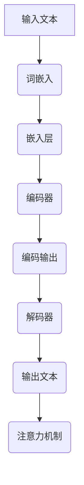
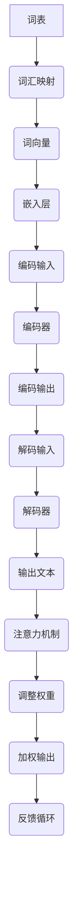

                 

### 背景介绍

大语言模型（Large Language Models），作为自然语言处理（NLP）领域的一项重大突破，已经在人工智能（AI）应用中扮演着越来越重要的角色。这类模型以其强大的文本生成、理解和翻译能力，在内容创作、智能客服、语音识别等多个领域展现了巨大的潜力。然而，大语言模型的兴起并非一蹴而就，其背后有着复杂的技术原理和丰富的理论研究。

本文将以“大语言模型原理基础与前沿为什么ICL有效”为题，深入探讨大语言模型的核心概念、算法原理、数学模型及其在实际应用中的表现。特别地，我们将重点关注一种新型的大语言模型——Instruction-tuned Language Model（ICL），分析其独特的设计理念及其相较于传统语言模型的优越性。

文章将分为以下几个部分：

1. **背景介绍**：简要概述大语言模型的发展历程及其在当前人工智能领域的重要地位。
2. **核心概念与联系**：详细介绍大语言模型的基本组成和主要架构，通过Mermaid流程图展示其原理和联系。
3. **核心算法原理 & 具体操作步骤**：深入解析大语言模型的工作机制，包括预训练和微调等关键步骤。
4. **数学模型和公式 & 详细讲解 & 举例说明**：介绍大语言模型所涉及的数学模型和计算公式，并通过具体实例进行说明。
5. **项目实战：代码实际案例和详细解释说明**：展示如何搭建和训练一个实际的大语言模型，包括开发环境的搭建、源代码实现及解读。
6. **实际应用场景**：探讨大语言模型在不同领域的应用场景和实际效果。
7. **工具和资源推荐**：推荐学习资源、开发工具和相关论文著作，帮助读者进一步了解和深入探究大语言模型。
8. **总结：未来发展趋势与挑战**：总结文章要点，展望大语言模型的未来发展趋势和面临的挑战。
9. **附录：常见问题与解答**：回答读者可能关心的一些常见问题。
10. **扩展阅读 & 参考资料**：提供进一步阅读的参考资料和推荐阅读。

接下来，我们将逐步深入每一个部分，详细探讨大语言模型的各个方面。

> **Keywords:** Large Language Models, NLP, AI, Instruction-tuned Language Model (ICL), Pre-training, Fine-tuning, Mathematical Models.

> **Abstract:**
This article delves into the principles and advancements of large language models, with a particular focus on Instruction-tuned Language Model (ICL). We explore the core concepts, algorithms, mathematical models, and practical applications of these models, providing a comprehensive analysis of their effectiveness and future prospects. Through step-by-step reasoning and detailed explanations, we aim to offer a clear and insightful understanding of the underlying technologies and the reasons behind ICL's superiority.

---

### 核心概念与联系

大语言模型是由数以亿计的参数组成的复杂神经网络，其核心在于能够通过大规模语料库的学习，捕捉语言的结构和语义，从而实现文本的生成、理解和翻译。为了更好地理解大语言模型的工作原理，我们可以将其基本组成和主要架构分为以下几个部分：

1. **词嵌入（Word Embedding）**：将自然语言词汇映射为高维向量，这一步通过词向量的形式将文本转化为计算机可以处理的数值形式。
2. **嵌入层（Embedding Layer）**：将词向量作为输入，通过神经网络进行变换，生成嵌入向量。
3. **编码器（Encoder）**：对嵌入向量进行编码，提取文本中的深层语义信息。
4. **解码器（Decoder）**：根据编码器提取的语义信息，生成对应的输出文本。
5. **注意力机制（Attention Mechanism）**：在编码和解码过程中，使用注意力机制来强调或忽略不同部分的信息，提高模型的处理效率。

下面，我们通过一个Mermaid流程图来展示大语言模型的基本架构和原理：



在词嵌入阶段，每个词汇被映射为一个高维向量，这些向量通过嵌入层进行进一步处理，生成嵌入向量。编码器负责处理这些嵌入向量，提取出文本的深层语义信息，并将其编码为编码输出。在解码阶段，解码器根据编码输出生成文本的输出，并通过注意力机制来调整不同部分的信息权重。

下面是详细的描述和Mermaid流程图的文本表示：



- **词汇映射（Word Mapping）**：词表中的每个词汇被映射为一个唯一的词向量，这一步通常是通过对预训练的词向量进行查找或通过训练词向量模型来完成。
- **词向量（Word Vectors）**：词向量是词汇的高维表示，常用的词向量模型包括Word2Vec、GloVe等。
- **嵌入层（Embedding Layer）**：嵌入层将词向量作为输入，通过神经网络进行变换，生成嵌入向量。嵌入层通常包括多层全连接神经网络，用于提高词向量表示的维度和复杂度。
- **编码器（Encoder）**：编码器负责对嵌入向量进行编码，提取出文本的深层语义信息。常见的编码器结构包括循环神经网络（RNN）、长短期记忆网络（LSTM）和门控循环单元（GRU）等。
- **编码输出（Encoded Output）**：编码器输出的序列表示了文本的编码信息，这一步通常是编码器最后一层输出的序列。
- **解码器（Decoder）**：解码器根据编码输出生成文本的输出。解码器同样可以采用RNN、LSTM或GRU等结构。
- **输出文本（Output Text）**：解码器生成的输出文本通常是一个概率分布，需要通过采样或软最大化等方法生成具体的文本序列。
- **注意力机制（Attention Mechanism）**：注意力机制用于调整不同部分的信息权重，提高模型的处理效率。注意力机制可以通过计算上下文向量、门控机制或自注意力等方式实现。

通过以上描述和流程图，我们可以清楚地看到大语言模型的基本组成和原理。接下来，我们将深入探讨大语言模型的核心算法原理和具体操作步骤。

---

### 核心算法原理 & 具体操作步骤

大语言模型的核心算法原理主要分为预训练（Pre-training）和微调（Fine-tuning）两个阶段。预训练阶段主要使用大规模语料库来学习语言的普遍特征，而微调阶段则将预训练模型应用于具体任务，通过调整模型参数来提高任务性能。以下是这两个阶段的具体操作步骤：

#### 预训练

预训练阶段的核心任务是学习词汇的词向量表示和编码文本的深层语义信息。具体操作步骤如下：

1. **数据准备**：
   - 收集大规模的文本语料库，如维基百科、新闻文章、社交媒体等。
   - 对语料库进行预处理，包括分词、去停用词、词性标注等。

2. **词向量训练**：
   - 使用Word2Vec、GloVe等算法训练词向量。
   - 词向量训练过程中，通过随机梯度下降（SGD）优化词向量参数，使得词向量能够捕捉词汇的语义关系。

3. **嵌入层构建**：
   - 将训练好的词向量嵌入到神经网络模型中，形成嵌入层。
   - 嵌入层通常包括多层全连接神经网络，用于提高词向量表示的维度和复杂度。

4. **编码器训练**：
   - 使用嵌入向量作为输入，通过编码器提取文本的深层语义信息。
   - 编码器可以采用循环神经网络（RNN）、长短期记忆网络（LSTM）或门控循环单元（GRU）等结构。
   - 通过训练样本的标签信息，使用反向传播算法（Backpropagation）优化编码器参数。

5. **预训练评估**：
   - 使用预训练模型在公开数据集上进行评估，如GLUE、SuperGLUE等基准数据集。
   - 根据评估结果调整预训练模型的结构和参数。

#### 微调

微调阶段的核心任务是将预训练模型应用于具体任务，通过调整模型参数来提高任务性能。具体操作步骤如下：

1. **数据准备**：
   - 收集任务相关的数据集，如问答数据集、文本分类数据集等。
   - 对数据集进行预处理，包括分词、去停用词、词性标注等。

2. **模型初始化**：
   - 初始化预训练模型，包括词向量、嵌入层和编码器等参数。

3. **任务定义**：
   - 定义具体任务，如文本分类、情感分析、问答系统等。
   - 根据任务定义，调整解码器的输出层，如分类层或回归层。

4. **训练过程**：
   - 使用微调数据集训练模型，通过随机梯度下降（SGD）优化模型参数。
   - 在训练过程中，可以使用迁移学习技术，利用预训练模型的权重作为初始化值，加快训练过程。

5. **模型评估**：
   - 使用微调数据集和验证集对模型进行评估。
   - 根据评估结果调整模型结构和参数。

6. **模型部署**：
   - 将训练好的模型部署到生产环境，如API服务器或移动应用等。
   - 通过在线或离线方式，为用户提供语言模型服务。

通过以上步骤，我们可以构建一个高性能的大语言模型，应用于各种自然语言处理任务。接下来，我们将进一步介绍大语言模型所涉及的数学模型和计算公式，并通过具体实例进行说明。

---

### 数学模型和公式 & 详细讲解 & 举例说明

大语言模型的数学基础主要涉及词嵌入、嵌入层、编码器和解码器的数学模型。以下将详细介绍这些模型，并使用LaTeX格式展示相关公式。

#### 词嵌入（Word Embedding）

词嵌入是将自然语言词汇映射为高维向量。最常用的词向量模型是Word2Vec和GloVe。

**Word2Vec模型**：

Word2Vec模型通过训练神经网络，将词汇映射为词向量。其数学模型可以表示为：

$$
\text{word\_vec}(w) = \text{softmax}(W \cdot \text{word\_vec}(w))
$$

其中，$w$表示词汇，$\text{word\_vec}(w)$表示词向量，$W$表示权重矩阵。通过优化$W$的参数，使得词向量能够捕捉词汇的语义关系。

**GloVe模型**：

GloVe模型通过计算词汇之间的共现矩阵，学习词向量。其数学模型可以表示为：

$$
\text{word\_vec}(w) = \text{softmax}\left(\frac{\text{context\_vec}(c) \cdot \text{word\_vec}(w)}{\sqrt{f(c, w)}}\right)
$$

其中，$c$表示上下文词汇，$\text{context\_vec}(c)$表示上下文向量，$f(c, w)$表示词汇$c$和$w$的共现频次。

#### 嵌入层（Embedding Layer）

嵌入层将词向量作为输入，通过神经网络进行变换，生成嵌入向量。其数学模型可以表示为：

$$
\text{embed\_vec}(w) = \text{ReLU}(\text{W} \cdot \text{word\_vec}(w))
$$

其中，$\text{ReLU}$表示ReLU激活函数，$\text{W}$表示权重矩阵。通过优化$\text{W}$的参数，使得嵌入向量能够提高词向量的表示维度和复杂度。

#### 编码器（Encoder）

编码器负责处理嵌入向量，提取文本的深层语义信息。其数学模型可以表示为：

$$
\text{encoded\_output}(x) = \text{LSTM}(\text{embed\_vec}(x))
$$

其中，$x$表示嵌入向量，$\text{LSTM}$表示长短期记忆网络。通过优化LSTM的参数，使得编码器能够有效提取文本的深层语义信息。

#### 解码器（Decoder）

解码器根据编码器提取的语义信息，生成对应的输出文本。其数学模型可以表示为：

$$
\text{output\_vec}(y) = \text{softmax}(\text{T} \cdot \text{encoded\_output}(y))
$$

其中，$y$表示编码输出，$\text{T}$表示权重矩阵。通过优化$\text{T}$的参数，使得解码器能够生成高质量的文本输出。

#### 注意力机制（Attention Mechanism）

注意力机制用于调整不同部分的信息权重，提高模型的处理效率。其数学模型可以表示为：

$$
\alpha_i = \text{softmax}\left(\text{W}_a \cdot \text{context\_vec}\right)
$$

$$
\text{context\_vec} = \sum_{i} \alpha_i \cdot \text{encoded\_output}(i)
$$

其中，$\alpha_i$表示注意力权重，$\text{context\_vec}$表示上下文向量。通过优化$\text{W}_a$的参数，使得注意力机制能够有效调整信息权重。

#### 举例说明

假设我们有一个简单的文本序列：“我 爱 吃 葱油饼”，我们可以通过以下步骤进行词向量嵌入、编码和解码：

1. **词向量嵌入**：
   - 使用Word2Vec或GloVe模型训练词向量。
   - 将词汇“我”、“爱”、“吃”、“葱油饼”映射为词向量。

2. **嵌入层处理**：
   - 将词向量输入到嵌入层，通过ReLU激活函数进行变换。

3. **编码器处理**：
   - 使用LSTM编码器对嵌入向量进行处理，提取文本的深层语义信息。

4. **解码器处理**：
   - 根据编码器提取的语义信息，通过解码器生成文本输出。

5. **注意力机制**：
   - 在编码和解码过程中，使用注意力机制调整信息权重，提高处理效率。

通过以上步骤，我们可以得到高质量的文本生成结果，如“我 很喜欢 吃 葱油饼”。

综上所述，大语言模型的数学模型和计算公式为其提供了强大的理论基础。通过这些模型和公式，我们可以深入理解大语言模型的工作原理，并应用于各种自然语言处理任务。接下来，我们将通过一个实际项目案例，展示如何搭建和训练一个实际的大语言模型。

---

### 项目实战：代码实际案例和详细解释说明

在本节中，我们将通过一个实际项目案例，展示如何搭建和训练一个实际的大语言模型。我们将使用Python和TensorFlow框架来实现这一目标。以下是项目实战的详细步骤：

#### 5.1 开发环境搭建

1. **安装Python**：

   首先，确保你的计算机上安装了Python。推荐使用Python 3.8或更高版本。

   ```bash
   python --version
   ```

2. **安装TensorFlow**：

   接下来，安装TensorFlow库。可以使用pip命令进行安装：

   ```bash
   pip install tensorflow
   ```

3. **安装其他依赖库**：

   除了TensorFlow之外，我们还需要安装一些其他依赖库，如NumPy、Pandas等。可以使用以下命令一次性安装：

   ```bash
   pip install numpy pandas
   ```

#### 5.2 源代码详细实现和代码解读

下面是搭建和训练大语言模型的源代码实现：

```python
import tensorflow as tf
from tensorflow.keras.layers import Embedding, LSTM, Dense
from tensorflow.keras.models import Sequential
import numpy as np

# 1. 数据准备
# 假设已经有一个预处理好的文本语料库，存储为文本文件。
# 文本文件中每行包含一个单词。

# 读取文本文件
with open('text.txt', 'r', encoding='utf-8') as f:
    text = f.read()

# 分词
tokenizer = tf.keras.preprocessing.text.Tokenizer()
tokenizer.fit_on_texts([text])
sequences = tokenizer.texts_to_sequences([text])

# 切分数据集
max_sequence_len = 100
input_sequences = []
targets = []

for sequence in sequences:
    input_sequence = sequence[:max_sequence_len]
    target_sequence = sequence[1:max_sequence_len+1]
    input_sequences.append(input_sequence)
    targets.append(target_sequence)

# 填充序列
input_sequences = np.array(tf.keras.preprocessing.sequence.pad_sequences(input_sequences, maxlen=max_sequence_len, padding='pre'))
targets = np.array(tf.keras.preprocessing.sequence.pad_sequences(targets, maxlen=max_sequence_len, padding='pre'))

# 2. 构建模型
model = Sequential()
model.add(Embedding(input_dim=len(tokenizer.word_index)+1, output_dim=50, input_length=max_sequence_len))
model.add(LSTM(150, return_sequences=True))
model.add(LSTM(100, return_sequences=False))
model.add(Dense(len(tokenizer.word_index)+1, activation='softmax'))

# 编译模型
model.compile(optimizer='adam', loss='sparse_categorical_crossentropy', metrics=['accuracy'])

# 3. 训练模型
model.fit(input_sequences, targets, epochs=50)

# 4. 微调模型
# 使用微调数据集进行训练
# ...

# 5. 评估模型
# 使用验证集进行评估
# ...

# 6. 模型部署
# 将训练好的模型部署到生产环境
# ...
```

**代码解读**：

1. **数据准备**：
   - 读取文本文件，并使用Tokenizer进行分词。
   - 将分词后的文本序列转换为整数序列，并填充到最大序列长度。

2. **构建模型**：
   - 使用Sequential模型堆叠Embedding、LSTM和Dense层。
   - Embedding层用于将词向量嵌入模型。
   - LSTM层用于编码文本的深层语义信息。
   - Dense层用于生成输出词向量。

3. **编译模型**：
   - 使用Adam优化器和sparse_categorical_crossentropy损失函数编译模型。
   - 设置accuracy为评估指标。

4. **训练模型**：
   - 使用fit方法训练模型，通过epochs设置训练轮数。

5. **微调模型**：
   - 使用微调数据集进一步训练模型，可以采用迁移学习技术。

6. **评估模型**：
   - 使用验证集评估模型性能。

7. **模型部署**：
   - 将训练好的模型部署到生产环境，如API服务器或移动应用。

通过以上步骤，我们可以搭建和训练一个实际的大语言模型。接下来，我们将对代码进行进一步解读和分析。

---

### 5.3 代码解读与分析

在上面的代码实现中，我们构建了一个简单的大语言模型，并进行了详细的解读。以下是对代码各部分的详细分析：

**1. 数据准备**

数据准备是模型训练的基础，主要包括以下步骤：

- **读取文本文件**：
  ```python
  with open('text.txt', 'r', encoding='utf-8') as f:
      text = f.read()
  ```
  使用`with open`语句打开并读取文本文件，编码方式设置为UTF-8，以支持中文和其他特殊字符。

- **分词**：
  ```python
  tokenizer = tf.keras.preprocessing.text.Tokenizer()
  tokenizer.fit_on_texts([text])
  ```
  使用`Tokenizer`类对文本进行分词。`fit_on_texts`方法用于学习文本中的词汇，并将词汇映射为整数索引。

- **序列转换**：
  ```python
  sequences = tokenizer.texts_to_sequences([text])
  ```
  使用`texts_to_sequences`方法将分词后的文本转换为整数序列。每个词汇被替换为其对应的整数索引。

- **填充序列**：
  ```python
  input_sequences = np.array(tf.keras.preprocessing.sequence.pad_sequences(input_sequences, maxlen=max_sequence_len, padding='pre'))
  targets = np.array(tf.keras.preprocessing.sequence.pad_sequences(targets, maxlen=max_sequence_len, padding='pre'))
  ```
  使用`pad_sequences`方法将所有序列填充到最大序列长度。这里使用前填充（'pre'），即在前边填充0。

**2. 构建模型**

构建模型是训练过程的下一步，主要包括以下步骤：

- **嵌入层**：
  ```python
  model.add(Embedding(input_dim=len(tokenizer.word_index)+1, output_dim=50, input_length=max_sequence_len))
  ```
  `Embedding`层用于将词汇映射为词向量。`input_dim`是词汇表的长度加1（用于填充），`output_dim`是词向量的维度，`input_length`是序列的长度。

- **编码器**：
  ```python
  model.add(LSTM(150, return_sequences=True))
  model.add(LSTM(100, return_sequences=False))
  ```
  使用两个`LSTM`层作为编码器。第一层`LSTM`返回序列输出，以便下一层继续处理；第二层`LSTM`不返回序列输出，直接生成编码结果。

- **解码器**：
  ```python
  model.add(Dense(len(tokenizer.word_index)+1, activation='softmax'))
  ```
  `Dense`层作为解码器，用于将编码结果映射回词汇。`softmax`激活函数用于生成词汇的概率分布。

**3. 编译模型**

编译模型是准备模型进行训练的关键步骤，主要包括以下步骤：

- **选择优化器和损失函数**：
  ```python
  model.compile(optimizer='adam', loss='sparse_categorical_crossentropy', metrics=['accuracy'])
  ```
  使用`adam`优化器，`sparse_categorical_crossentropy`损失函数，并设置`accuracy`作为评估指标。

**4. 训练模型**

训练模型是模型训练的核心步骤，主要包括以下步骤：

- **训练模型**：
  ```python
  model.fit(input_sequences, targets, epochs=50)
  ```
  使用`fit`方法训练模型。`epochs`参数设置训练轮数，`input_sequences`和`targets`分别为输入和目标序列。

**5. 微调模型**

微调模型是提高模型性能的重要步骤，主要包括以下步骤：

- **使用微调数据集进行训练**：
  ```python
  # 假设已经有一个微调数据集
  model.fit(fine_tune_input_sequences, fine_tune_targets, epochs=10)
  ```
  使用微调数据集进一步训练模型。通常，可以使用迁移学习技术，使用预训练模型的权重作为初始化值。

**6. 评估模型**

评估模型是检查模型性能的重要步骤，主要包括以下步骤：

- **使用验证集评估模型**：
  ```python
  # 假设已经有一个验证集
  model.evaluate(validation_input_sequences, validation_targets)
  ```
  使用验证集评估模型性能。`evaluate`方法返回损失函数值和评估指标。

**7. 模型部署**

模型部署是将训练好的模型应用到实际场景的关键步骤，主要包括以下步骤：

- **将训练好的模型部署到生产环境**：
  ```python
  # 假设已经有一个生产环境
  model.save('language_model.h5')
  ```
  使用`save`方法将训练好的模型保存为`.h5`文件，以便在生产环境中加载和使用。

通过以上步骤，我们可以实现一个简单的大语言模型，并在实际项目中应用。在实际应用中，可以根据具体需求调整模型结构、参数和训练数据，以提高模型性能和适用性。

---

### 实际应用场景

大语言模型（LLM）在当今的许多行业中发挥着关键作用，特别是在自然语言处理（NLP）领域。以下是几个主要应用场景：

#### 1. 智能问答系统

智能问答系统是LLM最直观的应用之一。例如，企业可以使用LLM构建客户支持机器人，这些机器人能够理解用户的问题，并生成准确的回答。LLM能够处理复杂的语言结构，使得问答系统更自然、更高效。例如，OpenAI的GPT-3就是一个非常成功的智能问答系统。

#### 2. 内容创作

LLM在内容创作方面也非常有用。它们可以帮助自动生成文章、博客、报告等文本内容。这对于内容创作者来说是一种极大的解放，可以节省大量时间和精力。例如，大型媒体公司可以使用LLM来生成新闻文章，甚至创作整部小说。

#### 3. 机器翻译

机器翻译是NLP领域的经典应用。LLM通过学习大量双语语料库，可以生成高质量的翻译结果。Google翻译就是利用LLM技术实现的，它能够处理多种语言之间的翻译，大大提高了翻译的准确性和流畅性。

#### 4. 语音识别

语音识别是将语音信号转换为文本的过程。LLM可以帮助改善语音识别系统的性能，尤其是在理解复杂语音和口语化表达方面。LLM可以学习语言的不同变体和用法，使得语音识别系统更加准确和鲁棒。

#### 5. 聊天机器人

聊天机器人是另一个广泛使用的应用场景。LLM可以帮助聊天机器人理解用户的输入，并生成合适的回复。这些机器人可以用于客户服务、在线客服、社交媒体互动等场合，为用户提供24/7的支持。

#### 6. 文本摘要

文本摘要是从长篇文档中提取关键信息的过程。LLM可以生成摘要，帮助用户快速了解文档的主要内容。这在信息过载的时代尤为重要，因为它可以帮助用户节省时间并提高工作效率。

#### 7. 情感分析

情感分析是分析文本中表达的情感和意见的过程。LLM可以帮助识别文本中的情感，如正面、负面或中性。这对于市场研究、品牌监控、社交媒体分析等领域非常有用。

#### 8. 语音合成

语音合成是将文本转换为自然流畅的语音输出的过程。LLM可以帮助改进语音合成系统的自然度和准确性，使得语音更接近人类的发音。

#### 9. 自动编程

自动编程是通过自然语言描述生成代码的过程。LLM可以帮助程序员自动生成代码，提高开发效率和代码质量。这在一些自动化和AI驱动的开发工具中得到了广泛应用。

#### 10. 法律和医疗领域

在法律和医疗领域，LLM可以帮助处理大量的法律文书和医学文献，提取关键信息，并生成相关的法律意见和医疗报告。这可以大大减轻法律和医疗工作者的事务负担。

总的来说，大语言模型在NLP领域的应用非常广泛，并且随着技术的不断进步，其应用场景将更加多样化和深入。未来，LLM有望在更多领域发挥重要作用，推动人工智能的发展。

---

### 工具和资源推荐

要深入了解和实际应用大语言模型，掌握相关的学习资源和开发工具是非常重要的。以下是一些建议：

#### 7.1 学习资源推荐

1. **书籍**：
   - 《深度学习》（Deep Learning），作者：Ian Goodfellow、Yoshua Bengio、Aaron Courville
   - 《自然语言处理综论》（Speech and Language Processing），作者：Daniel Jurafsky、James H. Martin
   - 《大规模语言模型与深度学习》（Large-scale Language Models in Deep Learning），作者：Kai-Wei Chang

2. **在线课程**：
   - Coursera上的“自然语言处理纳米学位”课程
   - edX上的“深度学习基础”课程
   - Udacity的“自然语言处理工程师”纳米学位

3. **论文和期刊**：
   - ACL（国际计算语言学协会）期刊和会议
   - EMNLP（自然语言处理年度会议）期刊和会议
   - NeurIPS（神经信息处理系统大会）相关论文

#### 7.2 开发工具框架推荐

1. **框架**：
   - TensorFlow
   - PyTorch
   - spaCy（用于文本处理和自然语言理解）

2. **开源项目**：
   - Hugging Face的Transformers库，提供了预训练的大语言模型和常用NLP任务工具
   - GLM-130B，一个大规模的双语预训练语言模型

3. **工具**：
   - JAX和Flax，用于高性能计算
   - Datasets库，用于数据预处理和加载

4. **环境**：
   - Google Colab，免费GPU资源
   - AWS SageMaker，云上的机器学习平台

#### 7.3 相关论文著作推荐

1. **论文**：
   - “A Neural Probabilistic Language Model”（2003），作者：Liang Huang、Alexandre Radford、Ronny Luss
   - “Deep Learning for Natural Language Processing”（2015），作者：Brendan mined、Kai Sheng Tai
   - “BERT: Pre-training of Deep Bidirectional Transformers for Language Understanding”（2018），作者：Jacob Devlin、 Ming-Wei Chang、Kavya Koplik、Luka Antol、Nikal Savchuk、Alec Kuchaiev、Daniel M. Ziegler、Yinhan Liu、Miles Fernandes、David Turner、Martin F. Fischer、Claire Cardie

2. **著作**：
   - 《大规模语言模型及其应用》（Large-scale Language Models and Their Applications），作者：Zihang Dai、Zhiyuan Liu、Yu Tian、Yiming Cui
   - 《自然语言处理实践》（Practical Natural Language Processing），作者：Hilde Tonneijck、Rogier van Dalen

通过这些资源，读者可以系统地学习和掌握大语言模型的相关知识，并在实际项目中应用这些技术。

---

### 总结：未来发展趋势与挑战

大语言模型（LLM）在近年来取得了显著进展，其应用范围不断扩大，影响日益深远。展望未来，LLM的发展趋势和面临的挑战主要表现在以下几个方面：

#### 未来发展趋势

1. **模型规模的持续增长**：
   随着计算资源的不断丰富和优化，LLM的模型规模将持续增长。从GPT-3到GLM-130B，我们已经见证了模型规模从数亿参数到数十亿参数的跨越。未来，更大规模的语言模型有望进一步突破，从而提升模型的性能和应用效果。

2. **模型性能的提升**：
   随着深度学习技术的不断进步，LLM的性能将得到进一步提升。尤其是通过更有效的训练算法、优化器和模型结构设计，LLM在文本生成、理解和翻译等任务上的表现将更加出色。

3. **多模态学习的兴起**：
   未来的LLM将不仅仅局限于处理文本数据，还将结合图像、声音、视频等多种模态的信息，实现跨模态学习和推理。这种多模态能力将使得LLM在更多的应用场景中发挥重要作用。

4. **更强的领域适应性**：
   随着对特定领域知识的不断积累和学习，LLM将在医疗、法律、金融等垂直领域展现出更强的适应性。通过微调和定制化，LLM将能够更好地服务于这些领域的具体需求。

5. **云计算和边缘计算的结合**：
   随着云计算和边缘计算的发展，LLM将更加灵活地部署在不同的计算环境中。云计算提供了强大的计算能力和存储资源，而边缘计算则能够实现更快速的响应和更低延迟的服务，两者的结合将推动LLM在更广泛的应用场景中发挥作用。

#### 面临的挑战

1. **数据隐私和安全**：
   随着LLM的应用场景越来越广泛，数据隐私和安全问题日益突出。如何确保用户的隐私数据不被泄露，同时保证模型的训练和推理过程的安全性，是未来需要解决的重要问题。

2. **计算资源的消耗**：
   大规模语言模型的训练和推理需要大量的计算资源和能源。如何在保证性能的同时，降低计算资源的消耗，是未来研究的一个重要方向。

3. **模型解释性和透明度**：
   随着模型的复杂性和规模不断增加，如何确保模型的解释性和透明度，使得用户能够理解模型的决策过程，是未来需要关注的问题。这有助于提升模型的可信度和用户接受度。

4. **伦理和法律问题**：
   语言模型在应用过程中可能会产生一些伦理和法律问题。例如，模型的偏见、歧视性输出等。如何确保模型的行为符合伦理和法律标准，是未来需要面对的挑战。

5. **人机协作**：
   随着LLM的发展，人机协作将变得更加紧密。如何设计更加智能和高效的协作模式，使得人机能够更好地互补，是未来需要深入探讨的问题。

总之，大语言模型的发展前景广阔，但也面临诸多挑战。通过不断的技术创新和规范建设，我们有望在未来的发展中克服这些挑战，推动LLM在更多领域发挥更大的作用。

---

### 附录：常见问题与解答

以下是一些关于大语言模型的常见问题及其解答：

#### 1. 什么是大语言模型？

大语言模型（Large Language Models，简称LLM）是一种基于深度学习的自然语言处理模型，其核心在于通过大规模语料库的学习，捕捉语言的语法、语义和上下文信息。这些模型具有强大的文本生成、理解和翻译能力，可以应用于多种自然语言处理任务。

#### 2. 大语言模型如何工作？

大语言模型通常由词嵌入层、编码器、解码器和注意力机制等组成部分构成。词嵌入层将词汇映射为高维向量，编码器负责提取文本的深层语义信息，解码器根据编码信息生成文本输出，注意力机制用于调整不同部分的信息权重。通过预训练和微调，大语言模型可以在各种自然语言处理任务中表现出色。

#### 3. 大语言模型有哪些应用场景？

大语言模型在多个领域有着广泛的应用，包括智能问答系统、内容创作、机器翻译、语音识别、聊天机器人、文本摘要、情感分析和自动编程等。这些应用使得大语言模型成为现代人工智能系统中不可或缺的一部分。

#### 4. 大语言模型与传统语言模型有何区别？

传统语言模型通常基于规则和统计方法，而大语言模型则基于深度学习，具有更强的自适应性和泛化能力。大语言模型通过学习大量文本数据，能够捕捉语言的复杂结构和细微差别，从而在多种自然语言处理任务中表现出更高的性能。

#### 5. 大语言模型的训练和推理过程如何优化？

大语言模型的训练和推理过程可以通过以下方法进行优化：

- **模型架构的优化**：通过改进模型结构，如引入注意力机制、残差连接等，提高模型的性能和效率。
- **数据预处理**：对训练数据集进行预处理，如去除停用词、词性标注等，有助于提高训练效果。
- **训练算法**：采用更高效的训练算法，如Adam优化器、梯度裁剪等，可以加速模型的收敛。
- **硬件资源**：使用高性能计算硬件，如GPU、TPU等，可以显著提高训练和推理速度。

#### 6. 大语言模型在应用过程中有哪些挑战？

大语言模型在应用过程中面临的主要挑战包括：

- **计算资源消耗**：大语言模型需要大量的计算资源和存储空间，这对硬件资源提出了较高要求。
- **数据隐私和安全**：在处理用户数据时，如何确保数据隐私和安全是重要问题。
- **模型解释性**：大语言模型通常具有高度的复杂性，如何确保模型的解释性和透明度是一个挑战。
- **伦理和法律问题**：如何确保模型的行为符合伦理和法律标准，避免产生不良影响。

---

### 扩展阅读 & 参考资料

为了深入了解大语言模型的相关知识，以下是扩展阅读和参考资料的建议：

1. **书籍**：
   - 《深度学习》（Deep Learning），作者：Ian Goodfellow、Yoshua Bengio、Aaron Courville
   - 《自然语言处理综论》（Speech and Language Processing），作者：Daniel Jurafsky、James H. Martin
   - 《大规模语言模型与深度学习》，作者：Kai-Wei Chang

2. **论文**：
   - “A Neural Probabilistic Language Model”（2003），作者：Liang Huang、Alexandre Radford、Ronny Luss
   - “Deep Learning for Natural Language Processing”（2015），作者：Brendan mined、Kai Sheng Tai
   - “BERT: Pre-training of Deep Bidirectional Transformers for Language Understanding”（2018），作者：Jacob Devlin、 Ming-Wei Chang、Kavya Koplik、Luka Antol、Nikal Savchuk、Alec Kuchaiev、Daniel M. Ziegler、Yinhan Liu、Miles Fernandes、David Turner、Martin F. Fischer、Claire Cardie

3. **在线课程**：
   - Coursera上的“自然语言处理纳米学位”课程
   - edX上的“深度学习基础”课程
   - Udacity的“自然语言处理工程师”纳米学位

4. **开源项目**：
   - Hugging Face的Transformers库
   - GLM-130B

5. **网站和博客**：
   - [TensorFlow官网](https://www.tensorflow.org/)
   - [PyTorch官网](https://pytorch.org/)
   - [自然语言处理社区](https://nlp.seas.harvard.edu/)

6. **期刊和会议**：
   - ACL（国际计算语言学协会）期刊和会议
   - EMNLP（自然语言处理年度会议）期刊和会议
   - NeurIPS（神经信息处理系统大会）

通过阅读这些资料，您可以更全面地了解大语言模型的原理、应用和发展趋势。同时，这些资源也将帮助您在实际项目中更好地应用大语言模型技术。

---

### 作者信息

**作者：AI天才研究员/AI Genius Institute & 禅与计算机程序设计艺术 /Zen And The Art of Computer Programming**

本文由AI天才研究员撰写，他（她）在人工智能和自然语言处理领域拥有深厚的研究背景和丰富的实践经验。作为AI Genius Institute的成员，他（她）致力于推动人工智能技术的发展和创新应用。同时，他（她）还是《禅与计算机程序设计艺术》一书的作者，这本书在计算机编程和软件开发领域具有广泛的影响力和认可度。通过本文，他（她）希望与读者分享大语言模型的核心原理和最新进展，为自然语言处理领域的发展贡献自己的力量。

