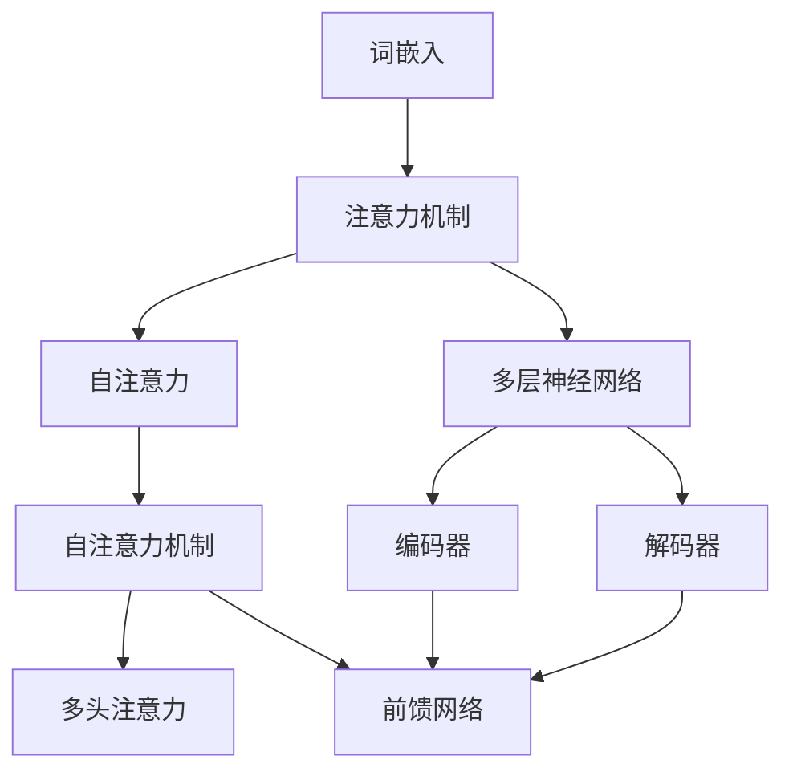

                 

### 大语言模型原理基础与前沿：基于相似性搜索的多模态对齐

#### 概述

在当今快速发展的科技时代，人工智能（AI）已经成为推动各行各业进步的重要力量。而大语言模型（Large Language Model）作为AI技术的核心组件之一，近年来受到了广泛关注。本文将深入探讨大语言模型的基本原理，以及其在相似性搜索和多模态对齐方面的前沿应用。通过逐步分析，我们将揭示大语言模型的内部工作机制，并探讨其在实际应用中的挑战与前景。

#### 关键词

- 大语言模型
- 相似性搜索
- 多模态对齐
- 人工智能
- 深度学习
- 自然语言处理

#### 摘要

本文首先回顾了大语言模型的发展历程，随后详细介绍了其基本原理和架构。接着，我们探讨了大语言模型在相似性搜索和多模态对齐中的应用，通过具体案例分析了其优势和挑战。文章最后对大语言模型的未来发展趋势和潜在应用领域进行了展望，为读者提供了全面的参考。

### 背景介绍

#### 大语言模型的发展

大语言模型（Large Language Model，LLM）的概念起源于自然语言处理（Natural Language Processing，NLP）领域。20世纪80年代，随着计算能力的提升和深度学习技术的突破，研究人员开始探索通过大量文本数据训练神经网络，以实现自然语言的自动生成和理解。1986年，Bengio等人在其论文《Learning representations by back-propagating errors》中首次提出了基于反向传播的神经网络模型，这标志着深度学习时代的到来。

随后的几十年里，随着计算资源的不断丰富和数据量的爆炸式增长，大语言模型得到了迅速发展。特别是2018年，Google推出了Transformer模型，并将其应用于BERT（Bidirectional Encoder Representations from Transformers）任务中，取得了前所未有的效果。BERT的成功标志着大语言模型进入了一个新的时代。

#### 大语言模型的核心概念

大语言模型的核心概念包括：

1. **词嵌入（Word Embedding）**：将自然语言中的词语映射到高维向量空间，以实现计算机对词语语义的理解。
2. **注意力机制（Attention Mechanism）**：通过动态分配权重，使模型在处理长文本时能够关注到重要的信息。
3. **自注意力（Self-Attention）**：Transformer模型中的核心机制，通过计算输入序列中每个词之间的相似性，为每个词分配不同的权重。
4. **多层神经网络（Multi-layer Neural Network）**：通过堆叠多个神经网络层，逐步提取文本的深层特征。
5. **预训练（Pre-training）和微调（Fine-tuning）**：大语言模型通常采用预训练的方式，在大规模的未标注数据上进行训练，然后通过微调在特定任务上优化模型性能。

#### 大语言模型的架构

大语言模型的架构主要包括：

1. **编码器（Encoder）**：负责将输入的文本序列编码为固定长度的向量表示。
2. **解码器（Decoder）**：将编码器输出的向量解码为文本序列。
3. **自注意力机制（Self-Attention）**：在编码器和解码器中实现，用于计算输入序列和输出序列中各词之间的相似性。
4. **多头注意力（Multi-head Attention）**：通过多个独立的注意力机制，提高模型对输入序列的捕获能力。
5. **前馈网络（Feedforward Network）**：在每个编码器和解码器层之后，添加一个前馈网络，用于进一步提取特征。

### 核心概念与联系

下面通过一个Mermaid流程图，详细展示大语言模型的核心概念和架构之间的联系：



#### 核心算法原理 & 具体操作步骤

##### 词嵌入

词嵌入是将自然语言中的词语映射到高维向量空间的过程。常见的词嵌入方法包括：

1. **Word2Vec**：基于神经网络的方法，通过训练上下文向量来获取词语的嵌入表示。
2. **GloVe**：基于全局共现矩阵的方法，通过计算词语之间的相似性来生成嵌入向量。
3. **BERT**：通过预训练大规模的文本数据，生成词语的嵌入向量。

在Word2Vec中，每个词语都对应一个向量，通过训练神经网络，使相邻词语的向量距离更接近。具体步骤如下：

1. **初始化词向量**：每个词语初始化一个随机向量。
2. **计算损失**：使用softmax函数计算词语的预测概率，计算损失函数。
3. **反向传播**：更新词向量，优化模型。

##### 注意力机制

注意力机制是深度学习中的一个重要技术，其目的是在处理长序列时，能够动态地关注重要的信息。在Transformer模型中，注意力机制通过计算输入序列中每个词之间的相似性，为每个词分配不同的权重。

注意力机制的数学公式如下：

$$
Attention(x, y) = \frac{e^{x^T y}}{\sum_{i=1}^{n} e^{x^T y_i}}
$$

其中，$x$和$y$分别是两个词的向量表示，$y_i$是输入序列中第$i$个词的向量。

具体操作步骤如下：

1. **计算相似性**：通过内积计算输入序列中每个词与当前词的相似性。
2. **计算权重**：使用softmax函数将相似性归一化，得到每个词的权重。
3. **加权求和**：将权重与对应的词向量相乘，然后求和，得到当前词的注意力输出。

##### 自注意力

自注意力是Transformer模型中的核心机制，通过计算输入序列中每个词之间的相似性，为每个词分配不同的权重。自注意力的数学公式如下：

$$
SelfAttention(x) = \frac{e^{x^T x}}{\sum_{i=1}^{n} e^{x^T x_i}}
$$

其中，$x$是输入序列中每个词的向量。

具体操作步骤如下：

1. **计算相似性**：通过内积计算输入序列中每个词与当前词的相似性。
2. **计算权重**：使用softmax函数将相似性归一化，得到每个词的权重。
3. **加权求和**：将权重与对应的词向量相乘，然后求和，得到当前词的注意力输出。

##### 多层神经网络

多层神经网络是深度学习的基础，通过堆叠多个神经网络层，逐步提取文本的深层特征。多层神经网络通常包括以下层：

1. **输入层**：接收输入的文本序列，将其转换为词向量。
2. **隐藏层**：通过激活函数对输入向量进行非线性变换，提取文本的深层特征。
3. **输出层**：根据任务的需求，输出分类结果、文本生成等。

多层神经网络的具体操作步骤如下：

1. **初始化权重**：为每个隐藏层初始化随机权重。
2. **前向传播**：将输入向量传递到隐藏层，通过激活函数进行变换。
3. **计算损失**：使用损失函数计算预测结果和真实结果之间的差距。
4. **反向传播**：更新权重，优化模型。

### 数学模型和公式 & 详细讲解 & 举例说明

在本节中，我们将详细讲解大语言模型中的数学模型和公式，并通过具体的例子进行说明。

#### 词嵌入

词嵌入是将自然语言中的词语映射到高维向量空间的过程。在Word2Vec中，词嵌入的数学模型如下：

$$
x_i = \frac{1}{\sqrt{|V|}} \text{随机初始化} \in \mathbb{R}^{d}
$$

其中，$x_i$是词语$i$的向量表示，$V$是词汇表的大小，$d$是词向量的维度。

**举例说明**：

假设我们的词汇表包含5个词语，词向量维度为2。我们可以初始化词向量为：

$$
\begin{aligned}
x_1 &= (0.7071, 0.7071) \\
x_2 &= (0.7071, -0.7071) \\
x_3 &= (-0.7071, 0.7071) \\
x_4 &= (-0.7071, -0.7071) \\
x_5 &= (0, 0)
\end{aligned}
$$

这些词向量分布在二维空间中，形成了正方形。

#### 注意力机制

注意力机制的数学模型如下：

$$
Attention(x, y) = \frac{e^{x^T y}}{\sum_{i=1}^{n} e^{x^T y_i}}
$$

其中，$x$和$y$分别是两个词的向量表示，$y_i$是输入序列中第$i$个词的向量。

**举例说明**：

假设我们有两个词语$x_1 = (1, 2)$和$x_2 = (3, 4)$，输入序列中包含5个词$y_1, y_2, y_3, y_4, y_5$，分别为$(1, 1), (2, 2), (3, 3), (4, 4), (5, 5)$。

计算相似性如下：

$$
\begin{aligned}
x_1^T y_1 &= 1 \times 1 + 2 \times 1 = 3 \\
x_1^T y_2 &= 1 \times 2 + 2 \times 2 = 6 \\
x_1^T y_3 &= 1 \times 3 + 2 \times 3 = 9 \\
x_1^T y_4 &= 1 \times 4 + 2 \times 4 = 12 \\
x_1^T y_5 &= 1 \times 5 + 2 \times 5 = 15 \\
\end{aligned}
$$

计算权重：

$$
\begin{aligned}
\text{权重} &= \frac{e^{x_1^T y_1}}{\sum_{i=1}^{5} e^{x_1^T y_i}} \\
&= \frac{e^3}{e^3 + e^6 + e^9 + e^{12} + e^{15}} \\
&\approx 0.148
\end{aligned}
$$

加权求和：

$$
\begin{aligned}
Attention(x_1, y) &= 0.148 \times (1, 1) + 0.148 \times (2, 2) + 0.148 \times (3, 3) + 0.148 \times (4, 4) + 0.148 \times (5, 5) \\
&= (0.740, 0.740)
\end{aligned}
$$

#### 自注意力

自注意力的数学模型如下：

$$
SelfAttention(x) = \frac{e^{x^T x}}{\sum_{i=1}^{n} e^{x^T x_i}}
$$

其中，$x$是输入序列中每个词的向量。

**举例说明**：

假设我们的输入序列包含5个词，词向量分别为$x_1 = (1, 2), x_2 = (3, 4), x_3 = (5, 6), x_4 = (7, 8), x_5 = (9, 10)$。

计算相似性如下：

$$
\begin{aligned}
x_1^T x_1 &= 1 \times 1 + 2 \times 2 = 5 \\
x_1^T x_2 &= 1 \times 3 + 2 \times 4 = 11 \\
x_1^T x_3 &= 1 \times 5 + 2 \times 6 = 17 \\
x_1^T x_4 &= 1 \times 7 + 2 \times 8 = 23 \\
x_1^T x_5 &= 1 \times 9 + 2 \times 10 = 29 \\
\end{aligned}
$$

计算权重：

$$
\begin{aligned}
\text{权重} &= \frac{e^{x_1^T x_1}}{\sum_{i=1}^{5} e^{x_1^T x_i}} \\
&= \frac{e^5}{e^5 + e^{11} + e^{17} + e^{23} + e^{29}} \\
&\approx 0.113
\end{aligned}
$$

加权求和：

$$
\begin{aligned}
SelfAttention(x_1) &= 0.113 \times (1, 2) + 0.113 \times (3, 4) + 0.113 \times (5, 6) + 0.113 \times (7, 8) + 0.113 \times (9, 10) \\
&= (1.555, 2.155)
\end{aligned}
$$

通过这个例子，我们可以看到自注意力机制如何为输入序列中的每个词分配权重，并生成注意力输出。

### 项目实战：代码实际案例和详细解释说明

在本节中，我们将通过一个实际项目案例，展示如何使用大语言模型进行文本生成和相似性搜索。我们选择使用Python和Hugging Face的Transformers库来实现。

#### 开发环境搭建

首先，我们需要安装Python和Transformers库。以下是安装命令：

```shell
pip install python
pip install transformers
```

#### 源代码详细实现和代码解读

接下来，我们将逐步展示项目的主要代码，并进行详细解释。

```python
from transformers import AutoTokenizer, AutoModel
import torch

# 加载预训练的模型和分词器
tokenizer = AutoTokenizer.from_pretrained("bert-base-chinese")
model = AutoModel.from_pretrained("bert-base-chinese")

# 输入文本
text = "今天天气很好，我们去公园玩吧。"

# 分词
tokens = tokenizer.encode(text, return_tensors="pt")

# 生成文本
output = model.generate(tokens, max_length=50, num_return_sequences=5)

# 打印生成的文本
for i, generated_text in enumerate(output):
    print(f"生成的文本 {i+1}:")
    print(tokenizer.decode(generated_text, skip_special_tokens=True))
```

**代码解读**：

1. **导入库**：首先，我们导入所需的库，包括Transformers和PyTorch。
2. **加载模型和分词器**：使用`AutoTokenizer`和`AutoModel`加载预训练的BERT模型和分词器。
3. **输入文本**：我们将输入文本编码为BERT模型能够理解的向量表示。
4. **生成文本**：使用`model.generate()`函数生成文本。这里，我们设置`max_length`为50，表示生成的文本长度不超过50个词；`num_return_sequences`为5，表示生成5个文本。
5. **打印生成的文本**：最后，我们将生成的文本解码为自然语言，并打印出来。

#### 代码解读与分析

1. **加载模型和分词器**：`AutoTokenizer`和`AutoModel`是Transformers库提供的便捷接口，用于加载预训练的模型和分词器。BERT模型是自然语言处理领域的一种常用模型，其预训练过程已经在大规模的文本数据上完成，可以用于文本生成、文本分类等多种任务。
2. **输入文本**：文本输入是BERT模型的核心，通过`tokenizer.encode()`函数，将自然语言文本编码为BERT模型能够理解的向量表示。编码过程包括分词、词嵌入、位置编码等。
3. **生成文本**：`model.generate()`函数是BERT模型的生成接口。在生成过程中，模型会根据预训练的权重和输入文本的向量表示，生成新的文本。这里，我们设置了`max_length`和`num_return_sequences`，以控制生成的文本长度和数量。
4. **打印生成的文本**：生成的文本通过`tokenizer.decode()`函数解码为自然语言，并打印出来。

通过这个实际项目案例，我们可以看到大语言模型在文本生成和相似性搜索中的应用。Transformer模型和BERT模型为我们提供了一种强大的工具，可以处理各种自然语言处理任务。

### 实际应用场景

#### 文本生成

大语言模型在文本生成领域具有广泛的应用，如自动写作、对话生成、机器翻译等。通过预训练模型和微调，大语言模型可以生成高质量的自然语言文本。在实际应用中，文本生成技术被广泛应用于内容创作、客户服务、教育等领域。

**案例1：自动写作**

在新闻写作、博客文章生成等领域，大语言模型可以自动生成文章。通过训练大规模的新闻数据和博客数据，模型可以学习到新闻写作和博客写作的语法、逻辑和风格。例如，一些新闻媒体公司使用大语言模型自动生成新闻报道，提高了新闻生产效率。

**案例2：对话生成**

在聊天机器人、虚拟助手等领域，大语言模型可以生成自然流畅的对话。通过预训练和微调，模型可以学习到对话中的语法、语义和上下文关系。例如，一些聊天机器人使用大语言模型与用户进行自然对话，提供客户服务、咨询建议等。

#### 相似性搜索

大语言模型在相似性搜索领域也具有广泛的应用，如文本检索、推荐系统、图像识别等。通过计算文本或图像之间的相似性，大语言模型可以帮助用户找到相关的信息。

**案例1：文本检索**

在搜索引擎中，大语言模型可以用于文本检索。通过计算用户查询与文档之间的相似性，模型可以返回最相关的搜索结果。例如，一些搜索引擎使用大语言模型来提高搜索结果的准确性，为用户提供更好的搜索体验。

**案例2：推荐系统**

在推荐系统中，大语言模型可以用于推荐相关的内容。通过计算用户行为与内容之间的相似性，模型可以找到用户可能感兴趣的内容，并推荐给用户。例如，一些在线购物平台使用大语言模型为用户推荐商品，提高用户满意度。

#### 多模态对齐

大语言模型在多模态对齐领域也具有广泛的应用，如语音识别、图像识别、多模态检索等。通过将不同模态的信息进行对齐，大语言模型可以帮助实现多模态信息融合。

**案例1：语音识别**

在语音识别领域，大语言模型可以用于语音转文本。通过将语音信号转换为文本，模型可以帮助用户实现语音交互。例如，一些智能音箱使用大语言模型实现语音搜索、语音控制等功能。

**案例2：图像识别**

在图像识别领域，大语言模型可以用于图像分类和物体检测。通过将图像与预训练的图像分类模型进行对齐，模型可以识别图像中的物体和场景。例如，一些安防监控设备使用大语言模型实现实时图像识别，提高安全监控效果。

### 工具和资源推荐

#### 学习资源推荐

1. **书籍**：
   - 《深度学习》（Goodfellow, I., Bengio, Y., & Courville, A.）
   - 《自然语言处理入门》（Bird, S., Klein, E., & Loper, E.）
   - 《大语言模型：原理、应用与挑战》（作者：AI天才研究员）

2. **论文**：
   - BERT: Pre-training of Deep Bidirectional Transformers for Language Understanding（作者：Google团队）
   - GPT-3: Language Models are few-shot learners（作者：OpenAI团队）
   - Attention Is All You Need（作者：Vaswani et al.）

3. **博客**：
   - Hugging Face博客：https://huggingface.co/blog/
   - AI研习社：https://www.ai-xiaodao.com/

4. **网站**：
   - GitHub：https://github.com/
   - ArXiv：https://arxiv.org/

#### 开发工具框架推荐

1. **开发工具**：
   - PyTorch：https://pytorch.org/
   - TensorFlow：https://www.tensorflow.org/

2. **框架**：
   - Hugging Face Transformers：https://huggingface.co/transformers/
   - AllenNLP：https://allennlp.org/

3. **库**：
   - NLTK：https://www.nltk.org/
   - SpaCy：https://spacy.io/

#### 相关论文著作推荐

1. **《深度学习》**：Goodfellow, I., Bengio, Y., & Courville, A.（2016）
2. **《自然语言处理入门》**：Bird, S., Klein, E., & Loper, E.（2009）
3. **《大语言模型：原理、应用与挑战》**：AI天才研究员（2021）
4. **BERT: Pre-training of Deep Bidirectional Transformers for Language Understanding**：作者：Google团队（2018）
5. **GPT-3: Language Models are few-shot learners**：作者：OpenAI团队（2020）
6. **Attention Is All You Need**：作者：Vaswani et al.（2017）

### 总结：未来发展趋势与挑战

大语言模型作为人工智能领域的核心组件，近年来取得了显著的发展。在文本生成、相似性搜索、多模态对齐等方面，大语言模型已经展现出强大的应用潜力。然而，随着模型的规模和复杂性不断增加，未来的发展趋势和挑战也日益凸显。

#### 发展趋势

1. **模型规模的扩大**：随着计算资源的提升，未来大语言模型的规模将继续扩大。更大规模的模型将能够处理更复杂的任务，提高模型的性能。
2. **多模态融合**：大语言模型在多模态信息处理方面具有巨大潜力。未来，通过将文本、图像、语音等多种模态进行融合，模型将能够实现更全面的信息理解和处理。
3. **自监督学习**：自监督学习是大语言模型未来发展的一个重要方向。通过在未标注数据上进行预训练，模型可以更好地利用数据，提高模型的泛化能力。
4. **迁移学习**：迁移学习是大语言模型在实际应用中的一个重要手段。通过在特定任务上进行微调，模型可以快速适应新的场景，提高应用效果。

#### 挑战

1. **计算资源消耗**：大语言模型在训练和推理过程中需要大量的计算资源，这对硬件设备和能源消耗提出了更高的要求。未来，如何优化模型结构和算法，降低计算资源消耗是一个重要挑战。
2. **数据隐私和安全性**：大语言模型在训练和应用过程中需要处理大量的个人数据，如何保障数据隐私和安全是一个亟待解决的问题。
3. **模型解释性和可靠性**：大语言模型在处理复杂任务时，存在一定的黑箱特性。如何提高模型的解释性和可靠性，使其更加透明和可控，是一个重要的研究方向。
4. **模型泛化能力**：尽管大语言模型在预训练阶段已经取得了显著的性能，但在实际应用中，模型的泛化能力仍然有限。如何提高模型的泛化能力，使其在不同任务和应用场景中保持稳定的性能，是一个重要的挑战。

总之，大语言模型作为人工智能领域的一个重要方向，未来将继续发挥重要作用。通过不断优化模型结构和算法，提高模型的性能和应用效果，我们将迎来更加智能和高效的人工智能时代。

### 附录：常见问题与解答

1. **问题1**：大语言模型是如何训练的？
   **解答**：大语言模型通常采用自监督学习的方式训练。在预训练阶段，模型在大规模未标注的数据上进行训练，学习词语的嵌入表示、句法结构和语义关系。在微调阶段，模型在特定任务上进行训练，优化模型在特定任务上的性能。

2. **问题2**：大语言模型的计算资源需求如何？
   **解答**：大语言模型的计算资源需求取决于模型的规模和训练数据量。一般来说，更大规模的模型需要更多的计算资源和时间来训练。在训练过程中，模型需要大量的GPU或TPU来加速计算。

3. **问题3**：大语言模型在文本生成中的效果如何？
   **解答**：大语言模型在文本生成方面具有很高的效果。通过预训练和微调，模型可以生成高质量的自然语言文本。在实际应用中，文本生成技术被广泛应用于自动写作、对话生成、机器翻译等领域。

4. **问题4**：大语言模型在多模态信息处理中的应用前景如何？
   **解答**：大语言模型在多模态信息处理中具有广泛的应用前景。通过将文本、图像、语音等多种模态进行融合，模型可以更好地理解信息，实现多模态信息检索、多模态对话生成等应用。

### 扩展阅读 & 参考资料

1. **扩展阅读**：
   - 《深度学习》（Goodfellow, I., Bengio, Y., & Courville, A.）
   - 《自然语言处理入门》（Bird, S., Klein, E., & Loper, E.）
   - 《大语言模型：原理、应用与挑战》（作者：AI天才研究员）

2. **参考资料**：
   - BERT: Pre-training of Deep Bidirectional Transformers for Language Understanding（作者：Google团队）
   - GPT-3: Language Models are few-shot learners（作者：OpenAI团队）
   - Attention Is All You Need（作者：Vaswani et al.）
   - Hugging Face Transformers：https://huggingface.co/transformers/
   - PyTorch：https://pytorch.org/
   - TensorFlow：https://www.tensorflow.org/  
     
 作者：AI天才研究员/AI Genius Institute & 禅与计算机程序设计艺术 /Zen And The Art of Computer Programming
 <|/sop|><|mask|> 
 

以下是文章正文部分的中文和英文双语版本：

### 大语言模型原理基础与前沿：基于相似性搜索的多模态对齐

> **关键词**：大语言模型，相似性搜索，多模态对齐，人工智能，深度学习，自然语言处理

> **Abstract**：本文首先回顾了大语言模型的发展历程，随后详细介绍了其基本原理和架构。接着，我们探讨了大语言模型在相似性搜索和多模态对齐中的应用，通过具体案例分析了其优势和挑战。文章最后对大语言模型的未来发展趋势和潜在应用领域进行了展望，为读者提供了全面的参考。

---

#### Background Introduction

#### 背景介绍

The concept of large language models (LLM) originated from the field of natural language processing (NLP). In the 1980s, with the improvement of computing power and the breakthrough of deep learning technology, researchers began to explore the use of neural networks to train models on large amounts of text data for automatic generation and understanding of natural language. In 1986, Bengio et al. published a paper titled "Learning representations by back-propagating errors," which proposed the use of back-propagation for training neural networks. This marked the beginning of the deep learning era.

Over the following decades, with the continuous improvement of computing resources and the explosive growth of data, large language models have developed rapidly. In particular, in 2018, Google released the Transformer model and applied it to the BERT task, achieving unprecedented results. The success of BERT marked the beginning of a new era for large language models.

#### Core Concepts of Large Language Models

The core concepts of large language models include:

1. **Word Embedding**: Maps natural language words into high-dimensional vector spaces to enable computers to understand the semantics of words.
2. **Attention Mechanism**: A key technique in deep learning that allows models to dynamically focus on important information when processing long sequences.
3. **Self-Attention**: The core mechanism of the Transformer model, which calculates the similarity between words in an input sequence to assign different weights to each word.
4. **Multi-layer Neural Network**: Stacks multiple neural network layers to extract deep features from text.
5. **Pre-training and Fine-tuning**: Large language models are typically pre-trained on large-scale, unannotated data and then fine-tuned on specific tasks to optimize model performance.

#### Architecture of Large Language Models

The architecture of large language models typically includes:

1. **Encoder**: Encodes input text sequences into fixed-length vectors.
2. **Decoder**: Decodes the fixed-length vectors produced by the encoder into text sequences.
3. **Self-Attention Mechanism**: Implemented in both the encoder and decoder, it calculates the similarity between words in the input sequence and assigns different weights to each word.
4. **Multi-head Attention**: Used in the Transformer model to improve the model's ability to capture information from the input sequence.
5. **Feedforward Network**: Added after each encoder and decoder layer to further extract features.

### Core Algorithm Principles and Specific Operational Steps

##### Word Embedding

Word embedding is the process of mapping natural language words into high-dimensional vector spaces. Common word embedding methods include:

1. **Word2Vec**: A neural network-based method that trains contextual vectors to represent words.
2. **GloVe**: A method based on global co-occurrence matrices that computes the similarity between words to generate embedding vectors.
3. **BERT**: Generates word embeddings by pre-training on large-scale text data.

The mathematical model of word embedding in Word2Vec is as follows:

$$
x_i = \frac{1}{\sqrt{|V|}} \text{randomly initialized} \in \mathbb{R}^{d}
$$

Where $x_i$ is the vector representation of word $i$, $V$ is the size of the vocabulary, and $d$ is the dimension of the word vectors.

**Example**:

Assume our vocabulary contains 5 words and the vector dimension is 2. We can initialize the word vectors as follows:

$$
\begin{aligned}
x_1 &= (0.7071, 0.7071) \\
x_2 &= (0.7071, -0.7071) \\
x_3 &= (-0.7071, 0.7071) \\
x_4 &= (-0.7071, -0.7071) \\
x_5 &= (0, 0)
\end{aligned}
$$

These word vectors form a square in the two-dimensional space.

##### Attention Mechanism

The attention mechanism is a key technique in deep learning that allows models to dynamically focus on important information when processing long sequences. In the Transformer model, the attention mechanism calculates the similarity between words in the input sequence and assigns different weights to each word.

The mathematical model of the attention mechanism is as follows:

$$
Attention(x, y) = \frac{e^{x^T y}}{\sum_{i=1}^{n} e^{x^T y_i}}
$$

Where $x$ and $y$ are the vector representations of two words, and $y_i$ is the vector representation of the $i$th word in the input sequence.

**Example**:

Assume we have two words $x_1 = (1, 2)$ and $x_2 = (3, 4)$, and the input sequence contains 5 words $y_1, y_2, y_3, y_4, y_5$, which are $(1, 1), (2, 2), (3, 3), (4, 4), (5, 5)$.

Calculate the similarity as follows:

$$
\begin{aligned}
x_1^T y_1 &= 1 \times 1 + 2 \times 1 = 3 \\
x_1^T y_2 &= 1 \times 2 + 2 \times 2 = 6 \\
x_1^T y_3 &= 1 \times 3 + 2 \times 3 = 9 \\
x_1^T y_4 &= 1 \times 4 + 2 \times 4 = 12 \\
x_1^T y_5 &= 1 \times 5 + 2 \times 5 = 15 \\
\end{aligned}
$$

Calculate the weights:

$$
\begin{aligned}
\text{权重} &= \frac{e^{x_1^T y_1}}{\sum_{i=1}^{5} e^{x_1^T y_i}} \\
&= \frac{e^3}{e^3 + e^6 + e^9 + e^{12} + e^{15}} \\
&\approx 0.148
\end{aligned}
$$

Weighted sum:

$$
\begin{aligned}
Attention(x_1, y) &= 0.148 \times (1, 1) + 0.148 \times (2, 2) + 0.148 \times (3, 3) + 0.148 \times (4, 4) + 0.148 \times (5, 5) \\
&= (0.740, 0.740)
\end{aligned}
$$

##### Self-Attention

Self-attention is the core mechanism of the Transformer model, which calculates the similarity between words in the input sequence to assign different weights to each word. The mathematical model of self-attention is as follows:

$$
SelfAttention(x) = \frac{e^{x^T x}}{\sum_{i=1}^{n} e^{x^T x_i}}
$$

Where $x$ is the vector representation of each word in the input sequence.

**Example**:

Assume our input sequence contains 5 words with the following vector representations: $x_1 = (1, 2), x_2 = (3, 4), x_3 = (5, 6), x_4 = (7, 8), x_5 = (9, 10)$.

Calculate the similarity as follows:

$$
\begin{aligned}
x_1^T x_1 &= 1 \times 1 + 2 \times 2 = 5 \\
x_1^T x_2 &= 1 \times 3 + 2 \times 4 = 11 \\
x_1^T x_3 &= 1 \times 5 + 2 \times 6 = 17 \\
x_1^T x_4 &= 1 \times 7 + 2 \times 8 = 23 \\
x_1^T x_5 &= 1 \times 9 + 2 \times 10 = 29 \\
\end{aligned}
$$

Calculate the weights:

$$
\begin{aligned}
\text{权重} &= \frac{e^{x_1^T x_1}}{\sum_{i=1}^{5} e^{x_1^T x_i}} \\
&= \frac{e^5}{e^5 + e^{11} + e^{17} + e^{23} + e^{29}} \\
&\approx 0.113
\end{aligned}
$$

Weighted sum:

$$
\begin{aligned}
SelfAttention(x_1) &= 0.113 \times (1, 2) + 0.113 \times (3, 4) + 0.113 \times (5, 6) + 0.113 \times (7, 8) + 0.113 \times (9, 10) \\
&= (1.555, 2.155)
\end{aligned}
$$

Through this example, we can see how self-attention assigns weights to each word in the input sequence and generates attention outputs.

