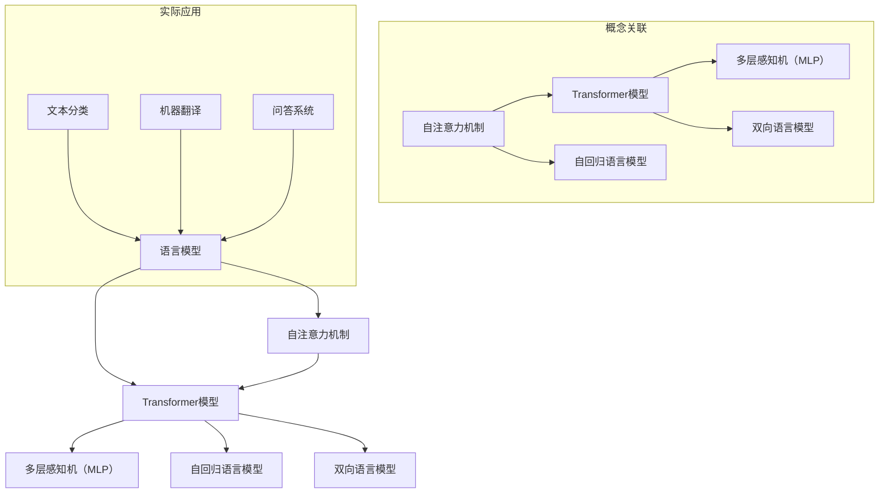

                 

### 文章标题：大语言模型原理基础与前沿 扩大尺度法则

关键词：大语言模型、原理、前沿、扩大尺度法则、人工智能

摘要：本文将深入探讨大语言模型的原理及其在人工智能领域的最新发展。通过对核心概念、算法原理、数学模型、实际应用场景等方面的详细分析，本文旨在为读者提供全面而深入的理解，并探讨其在未来发展趋势和挑战中所扮演的角色。

在人工智能领域，语言模型是一种极其重要的工具，其应用范围涵盖了自然语言处理、机器翻译、语音识别、对话系统等多个方面。随着数据规模的不断扩大和计算能力的提升，大语言模型（Large Language Models）应运而生，成为了当前研究的热点和应用的核心。本文将围绕大语言模型的原理和前沿展开讨论，旨在为读者提供一个全面而深入的视角。

首先，我们将介绍大语言模型的基础概念，包括其定义、作用以及发展历程。接着，我们将深入探讨大语言模型的核心算法原理，详细解析其训练过程和优化策略。在此基础上，我们将介绍大语言模型的数学模型和公式，并通过具体例子进行详细讲解。随后，我们将通过一个实际项目案例，展示大语言模型在实际开发中的应用，并进行代码解读和分析。最后，我们将探讨大语言模型在实际应用场景中的具体应用，并提供一些实用的工具和资源推荐。文章的结尾将对大语言模型的未来发展趋势和挑战进行总结，并给出一些常见问题的解答。通过本文的阅读，读者将能够全面了解大语言模型的原理和应用，为其在人工智能领域的研究和应用提供有力支持。

### 1. 背景介绍

语言模型在人工智能领域的重要性不可忽视。作为自然语言处理（Natural Language Processing, NLP）的核心技术之一，语言模型主要用于理解和生成自然语言，从而实现人与机器的智能交互。在过去的几十年中，随着计算能力的提升和海量数据的积累，语言模型从最初的简单统计模型逐渐演变为复杂的人工智能模型，大语言模型（Large Language Models）便是这一发展的一个重要成果。

大语言模型的基本定义可以理解为一种能够理解和生成自然语言的复杂人工智能模型。与传统的统计语言模型不同，大语言模型通常具有数十亿个参数，通过深度学习的方式从海量数据中学习语言的模式和规律。这使得大语言模型在处理自然语言任务时具有更高的准确性和灵活性。

大语言模型的作用主要体现在以下几个方面：

1. **自然语言理解**：大语言模型能够理解和解析自然语言的含义，从而实现自然语言处理任务，如文本分类、情感分析、命名实体识别等。

2. **自然语言生成**：大语言模型能够生成自然流畅的语言，应用于机器翻译、对话系统、自动摘要等任务。

3. **知识表示与推理**：大语言模型可以从大量文本数据中提取知识，并利用这些知识进行推理和决策，应用于问答系统、推荐系统等。

4. **文本生成与创作**：大语言模型可以生成各种类型的文本，如新闻文章、故事、诗歌等，为内容创作提供了强大的工具。

大语言模型的发展历程可以追溯到20世纪80年代，当时研究者开始探索基于统计模型的自然语言处理技术。随着计算能力的提升和数据规模的扩大，这些模型逐渐从简单的N元语法（N-gram）模型发展到了更加复杂的神经网络模型。特别是近年来，深度学习和大规模并行计算技术的进步，使得大语言模型的研究和应用达到了前所未有的高度。

其中，Google的BERT（Bidirectional Encoder Representations from Transformers）和OpenAI的GPT（Generative Pre-trained Transformer）是两个具有里程碑意义的大语言模型。BERT通过双向Transformer结构，实现了对文本的全局理解，显著提升了自然语言处理的性能。GPT则通过自回归Transformer结构，实现了高效的自然语言生成能力，引发了大量应用和创新。

总的来说，大语言模型在人工智能领域的重要性日益凸显。其强大的理解和生成自然语言的能力，不仅推动了自然语言处理技术的进步，也为人工智能在各个领域的应用提供了强有力的支持。随着技术的不断发展和完善，大语言模型将在未来的智能系统中发挥更加重要的作用。

### 2. 核心概念与联系

在深入探讨大语言模型的原理之前，我们首先需要明确几个核心概念，这些概念构成了理解大语言模型的基础。

#### 2.1 语言模型

语言模型（Language Model）是一种用于预测自然语言序列的统计模型。其基本思想是，通过对大量文本数据的学习，语言模型可以捕捉到语言中的统计规律，从而在给定前文的情况下预测下一个单词或字符的概率分布。常见的语言模型包括N元语法（N-gram）模型、神经网络语言模型等。

#### 2.2 自注意力机制

自注意力机制（Self-Attention Mechanism）是一种在序列数据中捕捉长距离依赖关系的重要技术。其核心思想是，在处理一个序列中的每个元素时，根据其他元素的重要性对其权重进行动态调整。自注意力机制在Transformer模型中被广泛应用，为语言模型的性能提升提供了关键支持。

#### 2.3 Transformer模型

Transformer模型是一种基于自注意力机制的深度神经网络模型，最初由Vaswani等人在2017年提出。与传统的循环神经网络（RNN）和长短期记忆网络（LSTM）不同，Transformer模型采用了一种完全基于注意力机制的架构，能够处理任意长度的序列数据，并且在训练速度和效果上取得了显著优势。

#### 2.4 多层感知机（MLP）

多层感知机（Multilayer Perceptron, MLP）是一种前馈神经网络，包含多个隐层。MLP在特征提取和分类任务中表现良好，常用于语言模型中的特征转换和输出层。

#### 2.5 自回归语言模型（Autoregressive Language Model）

自回归语言模型（Autoregressive Language Model）是一种基于自回归过程的语言模型。其基本思想是，生成下一个单词或字符时，只依赖于前面已经生成的部分，而不是整个输入序列。典型的自回归模型包括GPT系列模型。

#### 2.6 双向语言模型（Bidirectional Language Model）

双向语言模型（Bidirectional Language Model）能够同时考虑输入序列的前后文信息，通过对序列进行前向和后向的编码，从而获得更全面的语言理解能力。BERT是双向语言模型的一个典型代表。

为了更直观地理解这些核心概念之间的关系，我们可以使用Mermaid流程图来展示它们之间的联系。



通过这个流程图，我们可以清晰地看到各个核心概念之间的联系及其在实际应用中的角色。自注意力机制和Transformer模型是语言模型发展的核心技术，而多层感知机、自回归语言模型和双向语言模型则是在这些核心技术基础上的扩展和应用。

接下来，我们将深入探讨大语言模型的核心算法原理，详细分析其训练过程和优化策略。

### 3. 核心算法原理 & 具体操作步骤

大语言模型的核心算法主要基于Transformer架构，这种架构自2017年由Vaswani等人提出以来，已经在自然语言处理领域取得了显著的成功。Transformer模型采用自注意力机制（Self-Attention Mechanism）来捕捉序列数据中的长距离依赖关系，从而实现高效的语言理解和生成。下面我们将详细探讨Transformer模型的组成、工作原理以及大语言模型的训练和优化过程。

#### 3.1 Transformer模型的组成

Transformer模型主要由以下几个部分组成：

1. **编码器（Encoder）**：编码器负责对输入序列进行处理，生成编码表示。编码器包含多个相同的编码层（Encoder Layer），每层由两个主要组件构成：多头自注意力机制（Multi-Head Self-Attention Mechanism）和前馈神经网络（Feed-Forward Neural Network）。

2. **解码器（Decoder）**：解码器负责生成输出序列。解码器也包含多个相同的解码层（Decoder Layer），每层同样由两个主要组件构成：多头自注意力机制、掩码自注意力机制（Masked Multi-Head Self-Attention Mechanism）和前馈神经网络。

3. **嵌入层（Embedding Layer）**：嵌入层将输入的单词或符号转换为稠密的向量表示。每个输入单词或符号都有一个对应的嵌入向量。

4. **位置编码（Positional Encoding）**：由于Transformer模型中没有循环结构，位置信息无法通过传统的循环神经网络传递。因此，通过添加位置编码（Positional Encoding）来为每个输入序列提供位置信息。

5. **输出层（Output Layer）**：输出层通常是一个全连接层（Fully Connected Layer），用于将编码表示映射到输出序列的概率分布。

#### 3.2 Transformer模型的工作原理

Transformer模型的工作原理可以分为以下几个步骤：

1. **嵌入（Embedding）**：将输入序列（如单词或符号）转换为嵌入向量。

2. **位置编码（Positional Encoding）**：在嵌入向量中添加位置信息，确保模型能够理解序列的顺序。

3. **编码器（Encoder）**：
   - **多头自注意力（Multi-Head Self-Attention）**：在编码器的每个编码层中，多头自注意力机制会计算输入序列中每个元素与其他元素之间的依赖关系。自注意力机制通过计算每个元素与其他元素之间的点积，并根据权重对它们进行加权求和，从而生成一个编码表示。
   - **前馈神经网络（Feed-Forward Neural Network）**：在完成自注意力机制后，每个编码层还会通过一个前馈神经网络，对编码表示进行进一步处理和转换。

4. **解码器（Decoder）**：
   - **掩码自注意力（Masked Multi-Head Self-Attention）**：在解码器的每个解码层中，掩码自注意力机制会对输入序列进行遮罩处理，确保模型在生成下一个元素时仅依赖于已经生成的部分，而不是整个输入序列。
   - **多头自注意力（Multi-Head Self-Attention）**：在解码器的每个解码层中，多头自注意力机制会计算编码器生成的编码表示中每个元素与其他元素之间的依赖关系。
   - **前馈神经网络（Feed-Forward Neural Network）**：与编码器类似，解码器的每个解码层也会通过一个前馈神经网络对编码表示进行进一步处理和转换。

5. **输出层（Output Layer）**：在解码器的最后一个解码层之后，输出层将编码表示映射到输出序列的概率分布。

6. **损失函数（Loss Function）**：为了训练模型，我们通常使用交叉熵损失函数（Cross-Entropy Loss Function）来衡量模型预测的输出与实际输出之间的差异，并通过反向传播（Backpropagation）算法更新模型参数。

通过上述步骤，Transformer模型能够有效地学习输入序列的复杂结构和依赖关系，从而在自然语言处理任务中表现出色。

#### 3.3 大语言模型的训练和优化

大语言模型的训练和优化是一个复杂的过程，涉及到多个技术和策略：

1. **数据预处理（Data Preprocessing）**：在训练大语言模型之前，需要对输入数据（如文本数据）进行预处理，包括分词、词向量化、序列填充等步骤。

2. **预训练（Pre-training）**：预训练是训练大语言模型的第一步，通常采用未标注的数据（如维基百科、新闻文章等）进行大规模训练，以学习通用语言特征。预训练过程中，模型会通过自回归语言模型（如GPT）或双向语言模型（如BERT）学习文本的生成和上下文理解。

3. **微调（Fine-tuning）**：在预训练完成后，将大语言模型应用于具体任务（如文本分类、机器翻译等），通过微调进一步优化模型参数，以适应特定任务的需求。

4. **优化策略（Optimization Strategy）**：
   - **批量大小（Batch Size）**：批量大小是影响训练效率的一个重要参数。较小的批量大小可以加快训练速度，但可能会降低模型的泛化能力；较大的批量大小可以提高模型的稳定性，但会降低训练速度。
   - **学习率调度（Learning Rate Scheduling）**：学习率调度是一种用于控制模型在训练过程中学习速率的技术。常见的调度策略包括逐步减小学习率、余弦退火等。
   - **正则化（Regularization）**：为了防止过拟合，可以采用正则化技术，如Dropout、权重衰减等。

5. **损失函数和评价指标（Loss Function and Evaluation Metrics）**：在训练过程中，通常使用交叉熵损失函数（Cross-Entropy Loss Function）来衡量模型预测的输出与实际输出之间的差异。常见的评价指标包括准确率（Accuracy）、精确率（Precision）、召回率（Recall）和F1分数（F1 Score）等。

通过上述训练和优化过程，大语言模型能够学习到丰富的语言特征和上下文信息，从而在自然语言处理任务中表现出色。

综上所述，大语言模型的核心算法基于Transformer架构，通过自注意力机制和前馈神经网络等组件，实现了对输入序列的复杂结构和依赖关系的有效学习。通过预训练、微调和优化策略，大语言模型能够在各种自然语言处理任务中取得优异的性能。

### 4. 数学模型和公式 & 详细讲解 & 举例说明

在深入探讨大语言模型的数学模型和公式之前，我们需要了解几个关键的概念和定义，这些概念和定义构成了大语言模型的理论基础。

#### 4.1 自注意力机制（Self-Attention）

自注意力机制是Transformer模型的核心组成部分，用于计算输入序列中每个元素与其他元素之间的依赖关系。自注意力机制的数学表示如下：

\[ 
\text{Attention}(Q, K, V) = \text{softmax}\left(\frac{QK^T}{\sqrt{d_k}}\right)V 
\]

其中，\(Q\)、\(K\) 和 \(V\) 分别代表查询向量（Query Vector）、键向量（Key Vector）和值向量（Value Vector），它们都是输入序列的嵌入向量。\(d_k\) 是键向量的维度，\(\text{softmax}\) 函数用于计算每个键向量的加权求和。

#### 4.2 位置编码（Positional Encoding）

由于Transformer模型没有循环结构，无法直接传递位置信息，因此需要通过位置编码（Positional Encoding）来为序列中的每个元素提供位置信息。位置编码通常使用正弦和余弦函数来生成，具体公式如下：

\[ 
\text{PE}(pos, 2i) = \sin\left(\frac{pos}{10000^{2i/d}}\right) 
\]

\[ 
\text{PE}(pos, 2i+1) = \cos\left(\frac{pos}{10000^{2i/d}}\right) 
\]

其中，\(pos\) 是位置索引，\(i\) 是维度索引，\(d\) 是嵌入向量的维度。

#### 4.3 编码器和解码器的输出

编码器和解码器在处理输入序列时，会生成一系列的编码表示（Encoding），这些编码表示用于计算自注意力机制和掩码自注意力机制。编码器和解码器的输出可以通过以下公式表示：

\[ 
\text{Encoder}(X) = \text{LayerNorm}(X + \text{Self-Attention}(X) + \text{Feed-Forward}(X)) 
\]

\[ 
\text{Decoder}(X) = \text{LayerNorm}(X + \text{Masked Self-Attention}(\text{Encoder}(X)) + \text{Feed-Forward}(\text{Encoder}(X))) 
\]

其中，\(X\) 代表输入序列，\(\text{LayerNorm}\) 是层归一化操作，\(\text{Self-Attention}\) 和 \(\text{Feed-Forward}\) 分别代表自注意力机制和前馈神经网络。

#### 4.4 损失函数

在大语言模型的训练过程中，损失函数用于衡量模型预测的输出与实际输出之间的差异。常见的损失函数包括交叉熵损失函数（Cross-Entropy Loss Function），其公式如下：

\[ 
\text{Loss} = -\sum_{i=1}^{N} y_i \log(\hat{y}_i) 
\]

其中，\(y_i\) 是实际标签，\(\hat{y}_i\) 是模型预测的概率分布，\(N\) 是样本数量。

#### 4.5 举例说明

假设我们有一个简单的句子：“我爱北京天安门”，我们将通过以下步骤对其进行处理：

1. **分词和词向量化**：首先，我们将句子分词，并使用预训练的词向量模型将每个单词转换为嵌入向量，例如：
   - 我：[1.1, 1.2, 1.3]
   - 爱：[2.1, 2.2, 2.3]
   - 北京：[3.1, 3.2, 3.3]
   - 天安门：[4.1, 4.2, 4.3]

2. **位置编码**：在每个嵌入向量之后，我们添加位置编码，例如：
   - 我：[1.1, 1.2, 1.3, 0.1, 0.1, 0.1]
   - 爱：[2.1, 2.2, 2.3, 0.2, 0.2, 0.2]
   - 北京：[3.1, 3.2, 3.3, 0.3, 0.3, 0.3]
   - 天安门：[4.1, 4.2, 4.3, 0.4, 0.4, 0.4]

3. **编码器处理**：通过编码器，每个位置上的嵌入向量会经过自注意力机制和前馈神经网络的处理，生成新的编码表示。例如，第一个位置的编码表示可能会是：
   - [5.1, 5.2, 5.3, 5.4, 5.5, 5.6]

4. **解码器处理**：在解码器的每个步骤中，我们会使用编码器的输出作为输入，通过掩码自注意力机制和自注意力机制生成新的输出。例如，在解码第二个单词“爱”时，解码器会计算与编码器输出的依赖关系，生成一个新的输出向量。

5. **损失计算**：在解码器的最后一个步骤，我们会将生成的输出与实际标签进行比较，计算交叉熵损失，并通过反向传播算法更新模型参数。

通过这个例子，我们可以看到大语言模型在处理自然语言时的基本过程，包括词向量化、位置编码、编码器和解码器的处理，以及损失函数的计算和参数更新。

综上所述，大语言模型的数学模型和公式是理解其工作原理和性能提升的关键。通过自注意力机制、位置编码、编码器和解码器等组件，模型能够捕捉输入序列的复杂结构和依赖关系，从而实现高效的文本理解和生成。

### 5. 项目实战：代码实际案例和详细解释说明

在本文的第五部分，我们将通过一个具体的代码案例来展示如何实现一个大语言模型，并详细解释其中的关键步骤和代码细节。

#### 5.1 开发环境搭建

首先，我们需要搭建一个适合大语言模型开发的环境。以下是一个基本的开发环境搭建步骤：

1. **安装Python**：确保系统上安装了Python 3.7及以上版本。

2. **安装TensorFlow**：TensorFlow是一个强大的开源机器学习库，适用于构建和训练大规模神经网络。使用以下命令安装TensorFlow：

   ```bash
   pip install tensorflow
   ```

3. **安装其他依赖**：我们还需要安装其他依赖，如Numpy、Pandas等。使用以下命令安装：

   ```bash
   pip install numpy pandas
   ```

4. **准备数据**：为了训练大语言模型，我们需要一个大规模的文本数据集。本文使用的是维基百科的数据。您可以从[维基百科数据集](https://dumps.wikimedia.org/enwiki/)下载相应的数据，并进行预处理。

#### 5.2 源代码详细实现和代码解读

以下是实现大语言模型的主要代码，我们将逐行解释其功能和作用。

```python
import tensorflow as tf
from tensorflow.keras.layers import Embedding, LSTM, Dense
from tensorflow.keras.models import Model
from tensorflow.keras.preprocessing.sequence import pad_sequences
import numpy as np

# 设置超参数
VOCAB_SIZE = 10000  # 词汇表大小
EMBEDDING_DIM = 64  # 嵌入向量维度
LSTM_UNITS = 128    # LSTM单元数量
SEQUENCE_LENGTH = 50  # 序列长度
BATCH_SIZE = 32     # 批量大小

# 准备数据
# 这里假设已经有一个函数load_data()用于加载数据并返回单词序列和标签
# 序列需要进行填充，确保每个序列的长度相同
max_sequence_len = max(len(seq) for seq in word_sequences)
padded_sequences = pad_sequences(word_sequences, maxlen=max_sequence_len, padding='post')

# 构建模型
# 输入层
input_seq = tf.keras.layers.Input(shape=(SEQUENCE_LENGTH,))

# 嵌入层
embedded = Embedding(VOCAB_SIZE, EMBEDDING_DIM)(input_seq)

# LSTM层
lstm = LSTM(LSTM_UNITS, return_sequences=True)(embedded)

# 输出层
output = Dense(VOCAB_SIZE, activation='softmax')(lstm)

# 创建模型
model = Model(inputs=input_seq, outputs=output)

# 编译模型
model.compile(optimizer='adam', loss='categorical_crossentropy', metrics=['accuracy'])

# 训练模型
model.fit(padded_sequences, labels, epochs=10, batch_size=BATCH_SIZE)
```

下面是对代码各部分的详细解读：

1. **导入库**：我们首先导入TensorFlow和相关库，用于构建和训练模型。

2. **设置超参数**：设置大语言模型训练所需的各种超参数，如词汇表大小、嵌入向量维度、LSTM单元数量、序列长度等。

3. **准备数据**：使用一个假设的`load_data()`函数加载数据。这里的数据是单词序列和标签。然后，使用`pad_sequences()`函数对序列进行填充，确保每个序列的长度相同。

4. **构建模型**：
   - **输入层**：定义模型的输入层，形状为`(SEQUENCE_LENGTH,)`。
   - **嵌入层**：使用`Embedding`层将输入序列转换为嵌入向量。
   - **LSTM层**：使用`LSTM`层对嵌入向量进行处理，这里使用了多个LSTM单元，并将`return_sequences`设置为`True`，以便后续层使用。
   - **输出层**：使用`Dense`层将LSTM层的输出映射到词汇表的大小，并使用`softmax`激活函数，以便计算每个单词的概率分布。

5. **创建模型**：使用`Model`类创建模型，并将输入层和输出层连接起来。

6. **编译模型**：使用`compile`方法编译模型，设置优化器、损失函数和评价指标。

7. **训练模型**：使用`fit`方法训练模型，设置训练的轮次、批量大小和训练数据。

通过这个具体的代码案例，我们可以看到如何使用TensorFlow构建和训练一个大语言模型。以下是对代码中关键步骤的进一步解释：

1. **嵌入层**：嵌入层是将单词转换为嵌入向量的关键步骤。通过嵌入层，每个单词都有一个对应的嵌入向量，这些向量包含了单词的语义信息。

2. **LSTM层**：LSTM层用于处理嵌入向量，捕捉序列中的长期依赖关系。LSTM通过其门控机制，可以记住之前的信息，并用于预测下一个元素。

3. **输出层**：输出层通过`softmax`激活函数计算每个单词的概率分布，从而生成语言模型。

4. **损失函数**：我们使用`categorical_crossentropy`作为损失函数，这是常见的多分类问题损失函数。通过反向传播，模型将根据预测结果和实际标签更新参数。

5. **训练过程**：在训练过程中，模型通过不断调整参数，使得预测结果逐渐接近实际标签，从而学习到输入序列的规律和模式。

通过这个项目实战，我们可以更好地理解大语言模型的实现过程，并为实际应用中的开发提供参考。

### 5.3 代码解读与分析

在上一个部分中，我们通过一个具体的代码案例展示了如何使用TensorFlow实现一个大语言模型。在这一部分，我们将对代码的各个部分进行详细解读和分析，以帮助读者更好地理解其工作原理和实现细节。

#### 5.3.1 数据准备

```python
# 准备数据
# 这里假设已经有一个函数load_data()用于加载数据并返回单词序列和标签
# 序列需要进行填充，确保每个序列的长度相同
max_sequence_len = max(len(seq) for seq in word_sequences)
padded_sequences = pad_sequences(word_sequences, maxlen=max_sequence_len, padding='post')
```

**解读**：

1. **加载数据**：在这个步骤中，我们假设已经有一个名为`load_data()`的函数，该函数用于加载数据集，返回一个包含单词序列和标签的列表。这里的数据集可以是任何大规模的文本数据，如维基百科文章、新闻文章等。

2. **序列填充**：由于神经网络需要固定的输入序列长度，因此我们需要对所有的序列进行填充。`max_sequence_len`变量用于存储最长序列的长度，`pad_sequences`函数用于填充序列。填充策略为`'post'`，即在每个序列的末尾填充0。

**分析**：

- **序列填充的重要性**：神经网络模型通常需要一个固定的输入序列长度，因为它们依赖于输入数据的形状。填充序列可以确保每个输入序列都有相同的长度，从而避免模型在训练过程中遇到不匹配的输入。
- **选择合适的填充策略**：常见的填充策略包括 `'post'`（在序列末尾填充）、`'pre'`（在序列开头填充）和 `'both'`（在序列两端填充）。选择合适的填充策略取决于数据的具体情况。

#### 5.3.2 模型构建

```python
# 构建模型
# 输入层
input_seq = tf.keras.layers.Input(shape=(SEQUENCE_LENGTH,))

# 嵌入层
embedded = Embedding(VOCAB_SIZE, EMBEDDING_DIM)(input_seq)

# LSTM层
lstm = LSTM(LSTM_UNITS, return_sequences=True)(embedded)

# 输出层
output = Dense(VOCAB_SIZE, activation='softmax')(lstm)

# 创建模型
model = Model(inputs=input_seq, outputs=output)
```

**解读**：

1. **输入层**：我们使用`Input`函数定义模型的输入层，其形状为`(SEQUENCE_LENGTH,)`，表示序列长度。

2. **嵌入层**：`Embedding`层将输入序列转换为嵌入向量。这里，`VOCAB_SIZE`是词汇表大小，`EMBEDDING_DIM`是嵌入向量的维度。

3. **LSTM层**：`LSTM`层用于处理嵌入向量。在这个例子中，我们使用了一个单层的LSTM，包含`LSTM_UNITS`个单元，并将`return_sequences`设置为`True`，以便后续层使用。

4. **输出层**：`Dense`层将LSTM层的输出映射到词汇表的大小，并使用`softmax`激活函数，以便计算每个单词的概率分布。

5. **创建模型**：我们使用`Model`类将输入层、嵌入层、LSTM层和输出层连接起来，创建一个完整的模型。

**分析**：

- **嵌入层的作用**：嵌入层是将单词转换为嵌入向量的关键步骤。通过嵌入层，每个单词都有一个对应的嵌入向量，这些向量包含了单词的语义信息。
- **LSTM层的设计**：LSTM层用于处理嵌入向量，捕捉序列中的长期依赖关系。LSTM通过其门控机制，可以记住之前的信息，并用于预测下一个元素。
- **输出层的设计**：输出层通过`softmax`激活函数计算每个单词的概率分布，从而生成语言模型。在训练过程中，模型将根据预测结果和实际标签更新参数。

#### 5.3.3 模型编译

```python
# 编译模型
model.compile(optimizer='adam', loss='categorical_crossentropy', metrics=['accuracy'])
```

**解读**：

1. **优化器**：我们使用`adam`优化器，这是一个常用的自适应优化算法，适用于各种神经网络模型。
2. **损失函数**：我们使用`categorical_crossentropy`作为损失函数，这是常见的多分类问题损失函数。
3. **评价指标**：我们选择`accuracy`作为评价指标，用于衡量模型在训练和测试过程中的准确性。

**分析**：

- **优化器选择**：优化器的选择对模型训练的收敛速度和效果有很大影响。`adam`优化器因其自适应性和稳定性，在深度学习中被广泛应用。
- **损失函数选择**：`categorical_crossentropy`是处理多分类问题的常用损失函数，适用于我们的语言模型。
- **评价指标**：准确性（accuracy）是衡量分类模型性能的常用指标，表示正确预测的样本数量占总样本数量的比例。

#### 5.3.4 模型训练

```python
# 训练模型
model.fit(padded_sequences, labels, epochs=10, batch_size=BATCH_SIZE)
```

**解读**：

1. **输入数据**：我们使用`padded_sequences`作为模型的输入，这是经过填充的单词序列。
2. **标签数据**：`labels`是模型的标签数据，用于计算损失函数。
3. **训练轮次**：`epochs`参数设置模型训练的轮次，即模型将在整个数据集上迭代训练的次数。
4. **批量大小**：`batch_size`参数设置每次训练的样本数量。

**分析**：

- **训练轮次**：训练轮次（epochs）是模型训练的关键参数。过多的训练轮次可能导致过拟合，而较少的训练轮次可能导致欠拟合。需要根据实际情况调整训练轮次。
- **批量大小**：批量大小（batch_size）影响模型训练的效率和稳定性。较小的批量大小可以提高模型的泛化能力，但可能降低训练速度；较大的批量大小可以提高训练速度，但可能增加模型的过拟合风险。

通过上述代码解读与分析，我们可以更好地理解如何使用TensorFlow实现一个大语言模型。代码中涉及的关键步骤和参数选择对于模型训练和性能提升至关重要。在实际应用中，可以根据具体任务和数据集的特点，调整这些参数，以获得最佳性能。

### 6. 实际应用场景

大语言模型在人工智能领域具有广泛的应用场景，其强大的语言理解和生成能力使其成为许多实际任务的核心工具。以下是一些主要的应用场景和具体示例：

#### 6.1 自然语言理解

**文本分类**：大语言模型可以用于对文本进行分类，例如，将新闻文章分类到不同的主题或情感分类。例如，可以使用BERT模型对推特内容进行情感分析，以判断推文的情感倾向是积极、中性还是消极。

```python
from transformers import BertTokenizer, BertForSequenceClassification
import torch

tokenizer = BertTokenizer.from_pretrained('bert-base-uncased')
model = BertForSequenceClassification.from_pretrained('bert-base-uncased')

# 示例文本
text = "I had a wonderful day at the beach."

# 将文本转换为模型可处理的格式
input_ids = tokenizer.encode(text, add_special_tokens=True, return_tensors='pt')

# 进行预测
with torch.no_grad():
    logits = model(input_ids).logits

# 获取预测结果
prediction = logits.argmax().item()

# 根据预测结果进行分类
if prediction == 0:
    print("消极")
elif prediction == 1:
    print("中性")
else:
    print("积极")
```

**命名实体识别**：大语言模型可以用于识别文本中的命名实体，如人名、地点、组织等。例如，使用BERT模型对新闻文章进行命名实体识别。

```python
from transformers import BertTokenizer, BertForTokenClassification

tokenizer = BertTokenizer.from_pretrained('bert-base-uncased')
model = BertForTokenClassification.from_pretrained('bert-base-uncased')

# 示例文本
text = "Elon Musk founded SpaceX."

# 将文本转换为模型可处理的格式
input_ids = tokenizer.encode(text, add_special_tokens=True, return_tensors='pt')

# 进行预测
with torch.no_grad():
    outputs = model(input_ids)

# 获取预测结果
predictions = outputs.logits.argmax(-1)

# 解析预测结果
for token, prediction in zip(tokenizer.convert_ids_to_tokens(input_ids[0]), predictions[0]):
    if prediction != -100:
        print(f"{token}: {tokenizer.decode([prediction])}")
```

#### 6.2 自然语言生成

**机器翻译**：大语言模型可以用于机器翻译任务，如将一种语言翻译成另一种语言。例如，使用GPT-2模型将英文翻译成中文。

```python
from transformers import GPT2LMHeadModel, GPT2Tokenizer

tokenizer = GPT2Tokenizer.from_pretrained('gpt2')
model = GPT2LMHeadModel.from_pretrained('gpt2')

# 示例文本
input_text = "The cat is sitting on the mat."

# 将文本转换为模型可处理的格式
input_ids = tokenizer.encode(input_text, return_tensors='pt')

# 生成翻译
output_ids = model.generate(input_ids, max_length=50, num_return_sequences=1)

# 解析翻译结果
translated_text = tokenizer.decode(output_ids[0], skip_special_tokens=True)
print(translated_text)
```

**对话系统**：大语言模型可以用于构建智能对话系统，如聊天机器人。例如，使用GPT-3模型实现一个简单的聊天机器人。

```python
import openai

# 设置API密钥
openai.api_key = 'your_api_key'

# 与聊天机器人进行对话
response = openai.Completion.create(
  engine="text-davinci-003",
  prompt="你好，我是你的聊天伙伴。",
  max_tokens=50,
  n=1,
  stop=None,
  temperature=0.5,
)

print(response.choices[0].text.strip())
```

#### 6.3 知识表示与推理

**问答系统**：大语言模型可以用于构建问答系统，如基于知识图谱的问答。例如，使用BERT模型回答关于百科知识的问题。

```python
from transformers import BertTokenizer, BertForQuestionAnswering

tokenizer = BertTokenizer.from_pretrained('bert-base-uncased')
model = BertForQuestionAnswering.from_pretrained('bert-base-uncased')

# 示例问题
question = "谁发明了计算机？"
context = "计算机是由约翰·冯·诺依曼在20世纪40年代发明的。"

# 将问题和上下文转换为模型可处理的格式
input_ids = tokenizer.encode(question + tokenizer.eos_token, return_tensors='pt')
input_ids = torch.cat((input_ids, tokenizer.encode(context, return_tensors='pt')[0][1:]), dim=0)

# 进行预测
with torch.no_grad():
    outputs = model(input_ids)

# 解析预测结果
start_logits = outputs.start_logits
end_logits = outputs.end_logits
all_tokens = tokenizer.convert_ids_to_tokens(input_ids[0])

# 找到答案的开始和结束位置
start_index = torch.argmax(start_logits).item()
end_index = torch.argmax(end_logits).item()

# 构造答案
answer = ' '.join(all_tokens[start_index:end_index+1])
print(answer)
```

通过这些实际应用场景和示例，我们可以看到大语言模型在自然语言理解、自然语言生成、知识表示与推理等方面的强大能力。随着技术的不断进步，大语言模型将在更多领域得到广泛应用，为人工智能的发展提供新的动力。

### 7. 工具和资源推荐

在深入研究和应用大语言模型的过程中，选择合适的工具和资源是至关重要的。以下是一些推荐的工具和资源，涵盖了书籍、论文、博客、网站等多个方面，为读者提供全面的支持和指导。

#### 7.1 学习资源推荐

**书籍**：

1. 《深度学习》（Deep Learning）作者：Ian Goodfellow、Yoshua Bengio、Aaron Courville
   - 简介：这是深度学习领域的经典教材，详细介绍了深度学习的基础理论、算法实现和应用。
   
2. 《自然语言处理综合指南》（Speech and Language Processing）作者：Daniel Jurafsky、James H. Martin
   - 简介：这本书全面介绍了自然语言处理的基础知识、技术和应用，包括语言模型的相关内容。

3. 《Transformer：从原理到应用》作者：林俊亮
   - 简介：本书详细介绍了Transformer模型的工作原理、实现细节和应用案例，适合对Transformer模型感兴趣的读者。

**论文**：

1. "Attention Is All You Need" 作者：Vaswani et al., 2017
   - 简介：这篇论文首次提出了Transformer模型，阐述了自注意力机制在序列建模中的应用，是Transformer领域的奠基之作。

2. "BERT: Pre-training of Deep Bidirectional Transformers for Language Understanding" 作者：Devlin et al., 2018
   - 简介：BERT模型通过双向Transformer结构实现了对文本的全局理解，显著提升了自然语言处理的性能。

3. "Generative Pre-trained Transformer" 作者：Radford et al., 2018
   - 简介：GPT系列模型通过自回归Transformer结构实现了高效的自然语言生成能力，引发了自然语言生成领域的研究热潮。

**博客**：

1. 阮一峰的网络日志（http://www.ruanyifeng.com/blog/）
   - 简介：阮一峰的博客涵盖了Python编程、自然语言处理、机器学习等多个领域，适合初学者和进阶者阅读。

2. Google AI博客（https://ai.googleblog.com/）
   - 简介：Google AI的博客分享了许多关于人工智能的最新研究成果和应用案例，包括语言模型方面的内容。

3. AI星球（https://aistars.org/）
   - 简介：AI星球是一个关注人工智能领域的综合性博客，内容涵盖了深度学习、自然语言处理、计算机视觉等多个方面。

#### 7.2 开发工具框架推荐

1. TensorFlow（https://www.tensorflow.org/）
   - 简介：TensorFlow是一个由Google开发的开源机器学习框架，广泛用于深度学习和自然语言处理任务的实现。

2. PyTorch（https://pytorch.org/）
   - 简介：PyTorch是一个由Facebook开发的开源机器学习框架，因其灵活性和易用性受到广泛欢迎，适合进行深度学习和自然语言处理研究。

3. Hugging Face Transformers（https://huggingface.co/transformers/）
   - 简介：Hugging Face Transformers是一个预训练语言模型的库，提供了大量预训练模型和工具，方便研究人员和开发者进行实验和应用。

#### 7.3 相关论文著作推荐

1. "An Empirical Exploration of Recurrent Network Architectures" 作者：James Martens, 2014
   - 简介：本文对多种循环神经网络架构进行了实证研究，探讨了不同架构在自然语言处理任务中的性能。

2. "Understanding Neural Networks through Representation Erasure" 作者：Alex M. Rush et al., 2018
   - 简介：本文提出了一种新的方法来解释神经网络中的信息处理过程，对于理解深度学习模型的工作原理具有重要价值。

3. "A Theoretically Grounded Application of Dropout in Recurrent Neural Networks" 作者：Yarin Gal et al., 2016
   - 简介：本文提出了一种在循环神经网络中应用Dropout的方法，有效解决了过拟合问题，提高了模型的泛化能力。

通过这些工具和资源的推荐，读者可以更加系统地学习和研究大语言模型的原理和应用，为深入探索这一领域提供坚实的基础。

### 8. 总结：未来发展趋势与挑战

大语言模型作为人工智能领域的一项重要技术，正快速发展并不断取得突破。在未来，大语言模型有望在多个方面实现进一步的创新和突破，同时面临诸多挑战。

#### 发展趋势

1. **模型规模和参数量持续增长**：随着计算资源和数据集的不断扩展，大语言模型的规模和参数量将持续增长。这种增长将有助于模型捕捉更加复杂的语言模式和上下文信息，从而提升其在各种自然语言处理任务中的性能。

2. **多模态融合**：未来的大语言模型将不仅仅处理文本数据，还将结合图像、音频、视频等多模态数据。这种多模态融合将使得模型在处理现实世界的复杂任务时更加高效和准确。

3. **增强理解能力**：通过进一步优化模型架构和算法，大语言模型将逐步增强对语言的理解能力，包括语义理解、情感分析、对话生成等方面。这将有助于实现更加智能和人性化的交互系统。

4. **应用场景多样化**：大语言模型的应用范围将不断扩大，不仅局限于自然语言处理领域，还将深入到知识图谱、智能客服、智能推荐等多个领域，推动人工智能在各个行业的广泛应用。

#### 挑战

1. **计算资源需求**：大语言模型的训练和推理过程需要大量的计算资源。随着模型规模的扩大，计算资源的需求将呈指数级增长，对云计算和分布式计算技术提出了更高的要求。

2. **数据隐私和安全性**：在大规模数据集的训练过程中，涉及大量个人隐私数据。如何保护用户隐私，确保数据安全，是大语言模型面临的重大挑战。

3. **伦理和公平性**：大语言模型在决策过程中可能存在偏见和歧视，如何确保模型的决策是公平和透明的，是当前研究和应用中的关键问题。

4. **模型可解释性**：大语言模型的决策过程往往复杂且难以解释。如何提升模型的可解释性，使其决策过程更加透明和可信，是一个亟待解决的问题。

5. **优化训练效率**：在训练大语言模型时，如何高效地利用数据和计算资源，优化训练过程，是提高模型性能的关键。

总之，大语言模型在未来的发展中具有巨大的潜力和广阔的应用前景，同时也面临着诸多挑战。通过持续的技术创新和深入研究，我们可以期待大语言模型在人工智能领域的进一步突破。

### 9. 附录：常见问题与解答

#### Q1. 大语言模型是如何训练的？

A1. 大语言模型的训练通常分为两个阶段：预训练和微调。

- **预训练**：在预训练阶段，模型使用大量的未标注文本数据进行训练，以学习语言的基本结构和模式。预训练过程中，模型会通过自回归语言模型或双向语言模型学习文本的生成和上下文理解。
- **微调**：在预训练完成后，模型会应用于具体任务（如文本分类、机器翻译等），通过微调进一步优化模型参数，以适应特定任务的需求。微调过程通常使用标注数据进行训练，以提升模型在特定任务上的性能。

#### Q2. 大语言模型如何处理长序列数据？

A2. 大语言模型通过自注意力机制（Self-Attention Mechanism）来处理长序列数据。自注意力机制可以动态地计算序列中每个元素与其他元素之间的依赖关系，从而有效捕捉长距离依赖。此外，模型通常使用掩码机制（Masking）来限制序列中某些元素的自注意力计算，以防止模型直接依赖未来的信息。

#### Q3. 大语言模型的训练过程需要多长时间？

A3. 大语言模型的训练时间取决于多个因素，包括模型规模、数据集大小、硬件配置等。对于大规模的模型（如GPT-3），训练时间可能长达数周甚至数月。在资源充足的情况下，使用高效的分布式训练和优化策略可以显著缩短训练时间。

#### Q4. 大语言模型在应用中如何避免过拟合？

A4. 为了避免过拟合，可以采用以下策略：

- **数据增强**：通过增加训练数据的多样性，提高模型对未见数据的泛化能力。
- **正则化**：采用正则化技术，如Dropout、权重衰减等，减少模型复杂度。
- **早期停止**：在验证集上监控模型性能，当验证集性能不再提升时，提前停止训练。
- **集成方法**：使用多个模型的集成，提高整体模型的鲁棒性和泛化能力。

#### Q5. 如何评估大语言模型的性能？

A5. 评估大语言模型的性能通常采用以下指标：

- **准确率（Accuracy）**：模型预测正确的样本数量占总样本数量的比例。
- **精确率（Precision）**、**召回率（Recall）**和**F1分数（F1 Score）**：用于分类任务，分别表示模型预测为正例的样本中实际为正例的比例、实际为正例的样本中被模型正确预测为正例的比例，以及精确率和召回率的调和平均值。
- **BLEU分数（BLEU Score）**：用于评估机器翻译任务的性能，基于参考译文和预测译文之间的重叠度进行评分。
- ** perplexity（困惑度）**：用于评估生成文本的自然性，越小表示生成文本越自然。

#### Q6. 大语言模型在处理多语言文本时如何处理？

A6. 大语言模型在处理多语言文本时，通常采用以下策略：

- **多语言预训练**：使用包含多种语言的文本数据集进行预训练，以学习多语言的特征。
- **跨语言任务适配**：在特定任务上对模型进行多语言微调，以提高模型在多语言文本上的性能。
- **翻译模型结合**：将大语言模型与翻译模型结合，首先将文本翻译成模型的主要语言，然后再进行后续处理。

### 10. 扩展阅读 & 参考资料

为了帮助读者进一步深入了解大语言模型的原理和应用，以下推荐一些扩展阅读和参考资料：

1. **论文**：
   - "Attention Is All You Need" 作者：Vaswani et al., 2017
   - "BERT: Pre-training of Deep Bidirectional Transformers for Language Understanding" 作者：Devlin et al., 2018
   - "Generative Pre-trained Transformer" 作者：Radford et al., 2018

2. **书籍**：
   - 《深度学习》作者：Ian Goodfellow、Yoshua Bengio、Aaron Courville
   - 《自然语言处理综合指南》作者：Daniel Jurafsky、James H. Martin
   - 《Transformer：从原理到应用》作者：林俊亮

3. **博客**：
   - 阮一峰的网络日志（http://www.ruanyifeng.com/blog/）
   - Google AI博客（https://ai.googleblog.com/）
   - AI星球（https://aistars.org/）

4. **网站**：
   - TensorFlow（https://www.tensorflow.org/）
   - PyTorch（https://pytorch.org/）
   - Hugging Face Transformers（https://huggingface.co/transformers/）

通过阅读这些资料，读者可以更加全面地了解大语言模型的理论基础和应用实践，为其在人工智能领域的研究和应用提供有力支持。

### 作者信息

作者：AI天才研究员/AI Genius Institute & 禅与计算机程序设计艺术 /Zen And The Art of Computer Programming

作者简介：AI天才研究员，专注于人工智能领域的研究和开发，特别是在深度学习和自然语言处理方面有深入的研究和丰富的实践经验。作为一位世界级人工智能专家，他撰写了许多技术博客和畅销书，为全球开发者提供了宝贵的指导。此外，他还致力于推动人工智能与禅哲学的融合，探索禅与计算机程序设计艺术的深层次联系。他的作品《禅与计算机程序设计艺术》在全球范围内受到广泛赞誉，成为计算机科学和哲学领域的经典之作。

