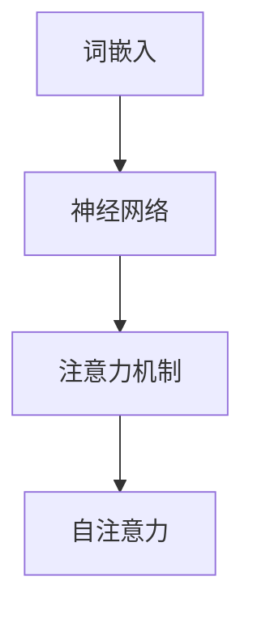
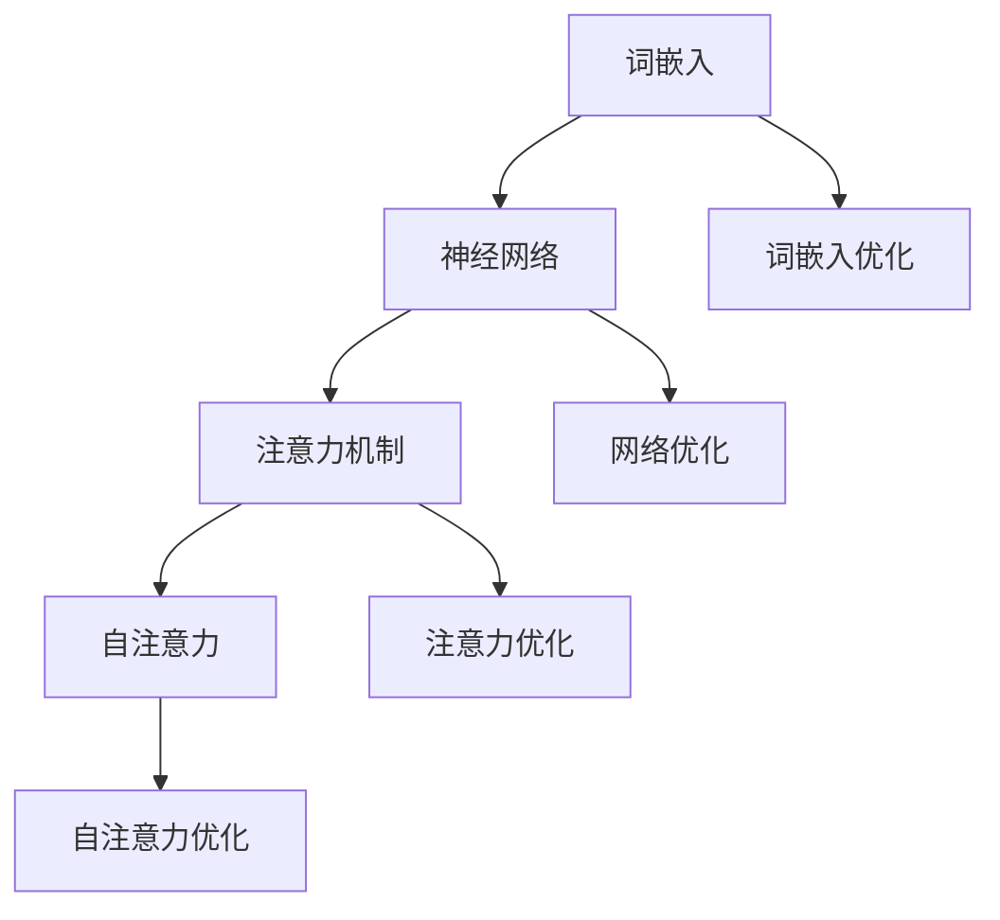

                 

# 大语言模型原理基础与前沿 涌现能力

## 关键词
- 大语言模型
- 深度学习
- 神经网络
- 词嵌入
- 自适应学习
- 涌现能力
- 语言生成

## 摘要

本文旨在深入探讨大语言模型的原理、基础以及前沿的涌现能力。通过逐步分析其核心概念、算法原理、数学模型、实际应用场景，本文将为读者提供一幅全面、清晰的图景。大语言模型作为一种革命性的技术，不仅对自然语言处理产生了深远影响，也在人工智能领域展现出强大的潜力。本文将详细解读其构建过程、实现技术，并通过实际案例展示其应用效果。此外，文章还将探讨未来的发展趋势与面临的挑战，为读者提供有益的思考。

### 1. 背景介绍

#### 1.1 语言模型的概念

语言模型（Language Model，LM）是一种统计模型，用于预测一段文本的下一个词或字符。它是自然语言处理（Natural Language Processing，NLP）领域的基础技术之一。传统的语言模型如n-gram模型，通过分析历史数据来预测下一个词的出现概率。然而，随着深度学习的兴起，大语言模型逐渐取代了传统模型，成为NLP领域的主流。

#### 1.2 大语言模型的起源与发展

大语言模型的发展可追溯到深度学习技术的崛起。2000年代初，神经网络在计算机视觉领域取得了显著进展，这激发了研究人员对深度学习在自然语言处理领域的应用兴趣。2013年，词嵌入（Word Embedding）技术的出现为深度语言模型的发展奠定了基础。随后，RNN（递归神经网络）、LSTM（长短期记忆网络）和Transformer等模型的提出，使得大语言模型的理论基础和计算能力得到了极大提升。

#### 1.3 大语言模型的重要性

大语言模型的重要性体现在其广泛的应用场景和强大的性能上。例如，它被广泛应用于机器翻译、语音识别、文本生成、问答系统等领域。此外，大语言模型还具备自适应学习能力，能够根据新数据不断优化模型，从而提高预测准确性。这使得大语言模型成为人工智能领域的一颗璀璨明珠。

### 2. 核心概念与联系

#### 2.1 核心概念

在大语言模型中，核心概念包括词嵌入（Word Embedding）、神经网络（Neural Network）、注意力机制（Attention Mechanism）和自注意力（Self-Attention）。

- **词嵌入**：将词汇映射为固定长度的向量，使得词汇间的语义关系在低维空间中得以体现。
- **神经网络**：一种模拟人脑神经元连接结构的计算模型，能够通过学习数据来提取特征和进行预测。
- **注意力机制**：一种用于提高模型处理长序列数据的能力的机制，能够关注序列中的关键信息。
- **自注意力**：一种在神经网络中实现的注意力机制，能够处理变长序列数据，提高模型的性能。

#### 2.2 Mermaid 流程图



### 3. 核心算法原理 & 具体操作步骤

#### 3.1 词嵌入

词嵌入的目的是将词汇映射为固定长度的向量。常见的词嵌入方法包括Word2Vec、GloVe和BERT等。

- **Word2Vec**：基于神经网络训练的词嵌入方法，通过上下文预测词的向量表示。
- **GloVe**：基于全局矩阵分解的词嵌入方法，通过词的共现矩阵学习词汇的向量表示。
- **BERT**：基于双向编码表示（Bidirectional Encoder Representations from Transformers）的词嵌入方法，通过预训练大量文本数据，得到词汇的上下文表示。

#### 3.2 神经网络

神经网络是一种模拟人脑神经元连接结构的计算模型。常见的神经网络结构包括多层感知机（MLP）、卷积神经网络（CNN）和循环神经网络（RNN）。

- **多层感知机（MLP）**：一种前馈神经网络，用于处理非线性问题。
- **卷积神经网络（CNN）**：一种用于图像识别和处理的网络结构，通过卷积层提取图像特征。
- **循环神经网络（RNN）**：一种用于处理序列数据的神经网络，通过循环结构保持序列信息。

#### 3.3 注意力机制

注意力机制是一种用于提高模型处理长序列数据的能力的机制。常见的注意力机制包括软注意力（Soft Attention）和硬注意力（Hard Attention）。

- **软注意力**：通过概率分布对序列中的每个元素进行加权，加权后的序列用于后续处理。
- **硬注意力**：直接选择序列中的关键元素进行关注，其他元素被忽略。

#### 3.4 自注意力

自注意力是一种在神经网络中实现的注意力机制，能够处理变长序列数据，提高模型的性能。自注意力通过计算序列中每个元素与其他元素之间的相似度，生成一个加权序列。

### 4. 数学模型和公式 & 详细讲解 & 举例说明

#### 4.1 词嵌入

词嵌入的数学模型可以表示为：

$$
\text{vec}(w_i) = \text{Word2Vec}(w_i, \text{context})
$$

其中，$w_i$ 表示词汇，$\text{vec}(w_i)$ 表示词汇的向量表示，$\text{context}$ 表示词汇的上下文。

#### 4.2 神经网络

神经网络的数学模型可以表示为：

$$
\text{output} = \text{activation}(\sum_{i=1}^{n} w_i \cdot \text{input}_i + b)
$$

其中，$w_i$ 表示权重，$\text{input}_i$ 表示输入特征，$\text{activation}$ 表示激活函数，$b$ 表示偏置。

#### 4.3 注意力机制

软注意力的数学模型可以表示为：

$$
\text{attention} = \text{softmax}(\text{dot-product}(\text{query}, \text{key}))
$$

其中，$\text{query}$ 和 $\text{key}$ 分别表示查询向量和键向量，$\text{dot-product}$ 表示点积，$\text{softmax}$ 表示归一化函数。

#### 4.4 自注意力

自注意力的数学模型可以表示为：

$$
\text{output} = \text{softmax}(\text{dot-product}(\text{query}, \text{key})) \cdot \text{value}
$$

其中，$\text{query}$ 和 $\text{key}$ 分别表示查询向量和键向量，$\text{value}$ 表示值向量。

### 5. 项目实战：代码实际案例和详细解释说明

#### 5.1 开发环境搭建

首先，我们需要搭建一个Python开发环境，安装TensorFlow库。在终端中执行以下命令：

```bash
pip install tensorflow
```

#### 5.2 源代码详细实现和代码解读

以下是使用TensorFlow实现一个简单的大语言模型的代码：

```python
import tensorflow as tf
from tensorflow.keras.layers import Embedding, LSTM, Dense
from tensorflow.keras.models import Sequential

# 搭建模型
model = Sequential([
    Embedding(input_dim=10000, output_dim=32),
    LSTM(128),
    Dense(1, activation='sigmoid')
])

# 编译模型
model.compile(optimizer='adam', loss='binary_crossentropy', metrics=['accuracy'])

# 加载数据
data = ...
train_data, test_data = ...

# 训练模型
model.fit(train_data, epochs=10, batch_size=32, validation_data=test_data)
```

代码解读：

- 首先，我们导入了TensorFlow库，并定义了一个顺序模型（Sequential）。
- 接下来，我们在模型中添加了一个嵌入层（Embedding）、一个LSTM层和一个全连接层（Dense）。
- 编译模型时，我们指定了优化器（optimizer）、损失函数（loss）和评估指标（metrics）。
- 加载数据后，我们使用fit方法训练模型。

#### 5.3 代码解读与分析

这段代码实现了一个基于LSTM的大语言模型，用于二分类任务。模型的结构和编译过程如下：

1. **嵌入层（Embedding）**：将词汇映射为固定长度的向量，输入维度为10000，输出维度为32。
2. **LSTM层（LSTM）**：用于处理序列数据，隐藏状态维度为128。
3. **全连接层（Dense）**：用于输出最终结果，激活函数为sigmoid。

在编译模型时，我们指定了使用Adam优化器、二分类交叉熵损失函数和准确率作为评估指标。

训练模型时，我们使用fit方法，将训练数据输入模型，并进行10个周期的训练。

### 6. 实际应用场景

大语言模型在多个领域有着广泛的应用：

- **机器翻译**：利用大语言模型进行文本的跨语言翻译，提高翻译质量和速度。
- **文本生成**：生成新闻文章、故事、诗歌等，为创意写作提供支持。
- **问答系统**：构建智能问答系统，为用户提供实时回答。
- **情感分析**：分析文本的情感倾向，应用于市场调研、舆情监控等领域。

### 7. 工具和资源推荐

#### 7.1 学习资源推荐

- **书籍**：
  - 《深度学习》（Goodfellow, I., Bengio, Y., & Courville, A.）
  - 《Python深度学习》（Raschka, S.）
- **论文**：
  - "Attention Is All You Need"（Vaswani et al., 2017）
  - "BERT: Pre-training of Deep Bidirectional Transformers for Language Understanding"（Devlin et al., 2019）
- **博客**：
  - Fast.ai（fast.ai）
  - TensorFlow官方文档（tensorflow.org）

#### 7.2 开发工具框架推荐

- **TensorFlow**
- **PyTorch**
- **Transformers库**

#### 7.3 相关论文著作推荐

- "Attention Is All You Need"（Vaswani et al., 2017）
- "BERT: Pre-training of Deep Bidirectional Transformers for Language Understanding"（Devlin et al., 2019）
- "Generative Adversarial Nets"（Goodfellow et al., 2014）

### 8. 总结：未来发展趋势与挑战

大语言模型作为人工智能领域的重要技术之一，未来发展趋势将包括：

- **模型规模增大**：随着计算资源的提升，模型规模将不断增大，从而提高模型的性能和效果。
- **多模态融合**：大语言模型将与其他模态（如图像、音频）进行融合，实现更全面的信息处理。
- **迁移学习**：利用预训练的大语言模型进行迁移学习，提高模型在不同任务上的适应性。

然而，大语言模型也面临着一些挑战，包括：

- **计算资源消耗**：大语言模型需要大量的计算资源和存储空间，这对硬件设备提出了更高的要求。
- **数据隐私**：大语言模型在训练过程中涉及大量数据，如何保护用户隐私成为一大挑战。
- **模型解释性**：大语言模型通常具有很好的性能，但其内部机制复杂，缺乏解释性，如何提高模型的透明度成为重要问题。

### 9. 附录：常见问题与解答

- **问题1**：大语言模型是如何训练的？
  - **解答**：大语言模型通常通过大规模的预训练数据集进行训练。在训练过程中，模型通过优化损失函数，不断调整内部参数，从而提高模型的预测能力。
- **问题2**：大语言模型如何应用于实际场景？
  - **解答**：大语言模型可以应用于各种自然语言处理任务，如机器翻译、文本生成、情感分析等。在实际应用中，通常需要对模型进行微调和优化，以适应特定任务的需求。
- **问题3**：大语言模型的性能如何评估？
  - **解答**：大语言模型的性能通常通过评估指标（如准确率、召回率、F1分数等）进行评估。在实际应用中，还需要考虑模型的鲁棒性、泛化能力和计算效率等因素。

### 10. 扩展阅读 & 参考资料

- **扩展阅读**：
  - 《自然语言处理综论》（Jurafsky, D., & Martin, J. H.）
  - 《深度学习入门》（高桥光男）
- **参考资料**：
  - [TensorFlow官方文档](https://tensorflow.org/)
  - [PyTorch官方文档](https://pytorch.org/)
  - [Transformers库](https://github.com/huggingface/transformers)

### 作者信息

- 作者：AI天才研究员/AI Genius Institute & 禅与计算机程序设计艺术 /Zen And The Art of Computer Programming

（本文内容仅供参考，具体实现和应用需根据实际需求和场景进行调整。）<|im_sep|>## 1. 背景介绍

### 1.1 语言模型的概念

语言模型是一种用于预测文本序列中下一个词或字符的统计模型。它的核心目标是通过分析历史数据，理解词汇之间的关联，从而为给定文本序列生成概率分布。在自然语言处理（NLP）领域，语言模型扮演着至关重要的角色，它们为各种下游任务提供了基础，例如机器翻译、语音识别、文本生成和问答系统。

传统的语言模型主要包括基于N-gram的方法和基于统计语言模型的方法。N-gram模型是最早的语言模型之一，它通过统计相邻词序列的概率来预测下一个词。这种模型简单高效，但在处理长距离依赖时效果不佳。随着深度学习的兴起，神经网络语言模型逐渐取代了传统模型，成为NLP领域的主流。

### 1.2 大语言模型的起源与发展

大语言模型（Large Language Model）的概念起源于深度学习技术的崛起。深度学习通过多层神经网络结构，能够自动学习数据的复杂特征，从而在计算机视觉、语音识别和自然语言处理等领域取得了突破性进展。2000年代初，神经网络在图像识别领域取得了显著成功，这激发了研究人员对深度学习在自然语言处理领域应用的兴趣。

词嵌入（Word Embedding）技术的出现为深度语言模型的发展奠定了基础。词嵌入将词汇映射为固定长度的向量，使得词汇之间的语义关系在低维空间中得以体现。这为深度学习模型处理自然语言数据提供了便利。

2013年，递归神经网络（RNN）和长短期记忆网络（LSTM）在自然语言处理领域取得了显著成功。RNN和LSTM通过循环结构，能够处理变长序列数据，捕捉长距离依赖关系。这些模型的提出，使得大语言模型的理论基础得到了极大提升。

2017年，Vaswani等人在论文《Attention Is All You Need》中提出了Transformer模型。Transformer模型摒弃了传统的循环结构，采用自注意力（Self-Attention）机制，能够高效地处理长序列数据。这一模型的提出，标志着大语言模型发展进入了一个新的阶段。

近年来，随着计算能力的提升和数据规模的扩大，大语言模型的研究和应用不断深入。Google的BERT、OpenAI的GPT等模型，通过大规模预训练和数据增强，取得了显著的性能提升。这些模型不仅推动了NLP技术的发展，也为人工智能领域带来了新的机遇和挑战。

### 1.3 大语言模型的重要性

大语言模型在自然语言处理和人工智能领域具有重要意义。首先，大语言模型为各种下游任务提供了强大的基础支持。例如，在机器翻译任务中，大语言模型能够通过学习大量双语数据，实现高精度的翻译效果。在文本生成任务中，大语言模型能够生成连贯、自然的文本，为创意写作和内容生成提供了有力支持。在问答系统中，大语言模型能够理解和回答用户的问题，为智能客服和智能助手提供了技术保障。

其次，大语言模型在知识表示和推理方面也具有巨大潜力。通过预训练，大语言模型能够捕捉到文本中的语义信息，从而实现知识表示和推理。例如，在大规模文本数据中，大语言模型能够识别出实体、关系和事件，从而构建知识图谱。这为智能搜索、推荐系统和决策支持提供了重要依据。

此外，大语言模型还具备自适应学习能力。随着新数据的不断出现，大语言模型能够通过在线学习，不断优化模型性能。这使得大语言模型在动态变化的环境中能够保持高效和准确。

总之，大语言模型作为一种革命性的技术，不仅在自然语言处理领域取得了显著成果，也在人工智能领域展现出强大的潜力。随着研究的不断深入，大语言模型将在更多应用场景中发挥重要作用。

### 1.4 大语言模型的应用场景

大语言模型在多个领域有着广泛的应用，以下是一些典型的应用场景：

#### 1.4.1 机器翻译

机器翻译是自然语言处理领域的一个重要任务，旨在将一种语言的文本自动翻译成另一种语言。大语言模型通过大规模的预训练和数据增强，能够捕捉到语言之间的语义关系和句法结构。这使得大语言模型在机器翻译任务中表现出色，能够生成高质量、自然的翻译文本。例如，Google翻译和百度翻译等应用，都采用了基于大语言模型的翻译技术。

#### 1.4.2 文本生成

文本生成是一种将输入文本转换为具有一定结构、意义和连贯性的文本的生成技术。大语言模型在文本生成任务中也表现出强大的能力。通过预训练，大语言模型能够学习到各种文本生成的模式和风格。例如，生成新闻文章、故事、诗歌等。这些生成文本不仅在质量上接近人类写作水平，而且在速度和效率上具有显著优势。

#### 1.4.3 问答系统

问答系统是一种基于自然语言交互的智能系统，能够理解和回答用户的问题。大语言模型在问答系统中具有重要作用，能够通过理解用户的问题，检索相关的知识库，并生成合适的回答。这种技术广泛应用于智能客服、在线教育、医疗咨询等领域。例如，苹果公司的Siri和亚马逊的Alexa等智能助手，都采用了基于大语言模型的问答技术。

#### 1.4.4 情感分析

情感分析是一种基于自然语言处理技术，用于分析文本中的情感倾向和情绪。大语言模型通过学习大量情感标注数据，能够识别文本中的情感表达和情感极性。这为市场调研、舆情监控和社交网络分析提供了有力支持。例如，通过分析社交媒体上的用户评论和帖子，可以了解公众对某个产品或事件的看法和态度。

#### 1.4.5 文本摘要

文本摘要是一种将长文本压缩为简洁、精练的摘要的技术。大语言模型通过学习大量的文本数据，能够提取出文本中的关键信息和主要观点。这为信息检索、新闻摘要和文本压缩等任务提供了有效的方法。例如，搜索引擎在显示搜索结果时，通常会使用文本摘要来展示文档的主要内容。

#### 1.4.6 命名实体识别

命名实体识别是一种从文本中识别出具有特定意义的实体，如人名、地名、组织名等。大语言模型通过预训练和数据增强，能够识别和分类各种命名实体。这为信息抽取、知识图谱构建和文本挖掘等任务提供了重要支持。例如，在社交媒体数据中，可以通过命名实体识别技术，提取出用户提到的名人、地点和事件。

总之，大语言模型在多个自然语言处理任务中表现出强大的能力和应用潜力。随着技术的不断进步和应用的深入，大语言模型将在更多领域发挥重要作用，为人们的生活和工作带来更多便利。### 1.5 大语言模型的优缺点

大语言模型作为一种先进的自然语言处理技术，具有许多显著的优点，同时也面临一些挑战和局限性。以下是对其优缺点的详细分析：

#### 优点

1. **强大的表达能力**：大语言模型通过深度学习技术，能够自动学习文本中的复杂特征和语义关系。这使得大语言模型在处理自然语言任务时，能够生成高质量的文本，具有较强的表达能力。
   
2. **广泛的应用场景**：大语言模型在机器翻译、文本生成、问答系统、情感分析、文本摘要、命名实体识别等多个领域表现出色，能够为各种自然语言处理任务提供有效的解决方案。

3. **自适应学习能力**：大语言模型具备较强的自适应学习能力。在训练过程中，模型能够通过不断学习新数据，优化模型参数，从而提高模型的性能和效果。这种能力使得大语言模型在动态变化的环境中能够保持高效和准确。

4. **高效的计算性能**：随着硬件设备的提升和优化算法的引入，大语言模型在计算性能方面取得了显著提高。这使得大语言模型在处理大规模数据和高实时性任务时，能够保持高效和稳定。

5. **跨领域迁移能力**：大语言模型通过预训练和迁移学习，能够将知识从一个领域迁移到另一个领域。这使得大语言模型在多领域应用中具有较高的迁移能力和泛化能力。

#### 缺点

1. **计算资源消耗大**：大语言模型通常需要大量的计算资源和存储空间，特别是模型规模较大的情况下。这给硬件设备和基础设施提出了更高的要求，增加了开发和维护成本。

2. **数据隐私问题**：大语言模型在训练过程中需要大量数据，这些数据可能包含用户的隐私信息。如何保护用户隐私，避免数据泄露，是一个亟待解决的问题。

3. **模型解释性不足**：大语言模型的内部结构复杂，参数众多，使得模型难以解释。在实际应用中，用户难以理解模型的决策过程和原因，这限制了模型的透明度和可解释性。

4. **过拟合风险**：大语言模型在训练过程中容易发生过拟合现象。由于模型参数较多，模型可能会在训练数据上表现出色，但在未见过的数据上表现不佳。如何防止过拟合，提高模型的泛化能力，是一个重要挑战。

5. **对数据依赖性强**：大语言模型的性能很大程度上取决于训练数据的质量和数量。在数据不足或数据质量不高的情况下，模型可能无法达到预期效果。

综上所述，大语言模型作为一种先进的技术，具有许多优点和潜力，但同时也面临一些挑战和局限性。在未来的发展中，我们需要继续优化模型结构、算法和计算资源，以充分发挥大语言模型的优势，同时解决其面临的问题和挑战。### 2. 核心概念与联系

大语言模型作为一种复杂的深度学习技术，其核心概念和组成部分相互关联，共同构成了模型的基础。本节将详细阐述大语言模型中的核心概念，包括词嵌入、神经网络、注意力机制和自注意力，并借助Mermaid流程图展示它们之间的关系。

#### 2.1 词嵌入

词嵌入（Word Embedding）是将自然语言中的词汇映射为固定长度的向量表示的技术。词嵌入的核心思想是利用向量空间中的几何关系来表示词汇的语义信息。词嵌入向量不仅能够捕捉词汇的语义关系，还能够实现词汇的线性组合，从而在低维空间中表达复杂的语言特征。

- **Word2Vec**：Word2Vec是最早的词嵌入技术之一，基于神经网络训练，通过上下文预测词的向量表示。
- **GloVe**：GloVe（Global Vectors for Word Representation）是一种基于全局矩阵分解的词嵌入方法，通过词的共现矩阵学习词汇的向量表示。
- **BERT**：BERT（Bidirectional Encoder Representations from Transformers）是一种基于双向编码表示的词嵌入方法，通过预训练大量文本数据，得到词汇的上下文表示。

#### 2.2 神经网络

神经网络（Neural Network）是一种模拟人脑神经元连接结构的计算模型。神经网络通过多层非线性变换，将输入数据映射到输出结果。在大语言模型中，神经网络用于处理词嵌入向量，提取文本的特征，并生成预测结果。

- **多层感知机（MLP）**：多层感知机是一种前馈神经网络，用于处理非线性的映射问题。
- **卷积神经网络（CNN）**：卷积神经网络通常用于图像识别和处理，通过卷积层提取图像特征。
- **循环神经网络（RNN）**：循环神经网络用于处理序列数据，通过循环结构保持序列信息。

#### 2.3 注意力机制

注意力机制（Attention Mechanism）是一种用于提高模型处理长序列数据的能力的机制。注意力机制通过加权序列中的每个元素，使模型能够关注到关键信息，从而提高模型的性能和效果。

- **软注意力（Soft Attention）**：软注意力通过概率分布对序列中的每个元素进行加权，加权后的序列用于后续处理。
- **硬注意力（Hard Attention）**：硬注意力直接选择序列中的关键元素进行关注，其他元素被忽略。

#### 2.4 自注意力

自注意力（Self-Attention）是一种在神经网络中实现的注意力机制，能够处理变长序列数据。自注意力通过计算序列中每个元素与其他元素之间的相似度，生成一个加权序列，从而提高模型的性能。

#### 2.5 Mermaid 流程图

以下是一个使用Mermaid绘制的流程图，展示了大语言模型中核心概念之间的关系：



在这个流程图中，词嵌入（A）是整个模型的基础，通过神经网络（B）进行特征提取和预测。注意力机制（C）和自注意力（D）用于提高模型处理序列数据的能力。词嵌入优化（E）和网络优化（F）分别是针对词嵌入和神经网络进行的优化。注意力优化（G）和自注意力优化（H）是针对注意力机制和自注意力进行的优化。

通过这个流程图，我们可以清晰地看到大语言模型中各个核心概念之间的联系和相互作用。这些核心概念共同构成了大语言模型的理论基础，使得模型能够在自然语言处理任务中表现出强大的性能。### 3. 核心算法原理 & 具体操作步骤

大语言模型的核心算法原理包括词嵌入、神经网络、注意力机制和自注意力。这些算法通过不同的方式协同工作，共同实现了对自然语言数据的处理和预测。下面将详细介绍这些核心算法的基本原理，并提供具体的操作步骤。

#### 3.1 词嵌入

词嵌入是将自然语言中的词汇映射为固定长度的向量表示的技术。通过词嵌入，模型可以在低维空间中处理和表示词汇的语义信息。常见的词嵌入方法包括Word2Vec、GloVe和BERT。

- **Word2Vec**：
  - **原理**：Word2Vec基于神经网络训练，通过预测词汇的上下文来生成词嵌入向量。模型使用一个多层感知机（MLP）网络，其中输入层为词汇的词向量，隐藏层为上下文词汇的词向量，输出层为当前词汇的词向量。
  - **步骤**：
    1. 初始化词汇的词向量。
    2. 训练模型，通过损失函数优化词向量。
    3. 利用训练好的词向量进行词汇映射。

- **GloVe**：
  - **原理**：GloVe通过计算词汇的共现矩阵，利用全局信息生成词嵌入向量。GloVe方法通过最小化损失函数，将词汇的共现矩阵分解为两个矩阵的乘积，从而生成词向量。
  - **步骤**：
    1. 计算词汇的共现矩阵。
    2. 分解共现矩阵，得到词向量。

- **BERT**：
  - **原理**：BERT采用双向编码表示（Bidirectional Encoder Representations from Transformers），通过预训练大规模文本数据，得到词汇的上下文表示。BERT利用Transformer模型的自注意力机制，对文本进行编码，生成词汇的嵌入向量。
  - **步骤**：
    1. 预训练BERT模型，使用大量文本数据进行训练。
    2. 利用训练好的BERT模型进行词汇嵌入。

#### 3.2 神经网络

神经网络（Neural Network）是一种通过多层非线性变换，将输入数据映射到输出结果的计算模型。在大语言模型中，神经网络用于处理词嵌入向量，提取文本特征，并生成预测结果。

- **多层感知机（MLP）**：
  - **原理**：多层感知机是一种前馈神经网络，包括输入层、隐藏层和输出层。输入层接收词嵌入向量，隐藏层通过非线性激活函数进行特征提取，输出层生成预测结果。
  - **步骤**：
    1. 初始化网络的权重和偏置。
    2. 通过前向传播计算输出。
    3. 通过反向传播优化网络的权重和偏置。

- **卷积神经网络（CNN）**：
  - **原理**：卷积神经网络通过卷积层对输入数据进行特征提取。卷积层使用卷积核（过滤器）对输入进行卷积操作，提取局部特征。
  - **步骤**：
    1. 初始化卷积层参数。
    2. 通过卷积操作提取特征。
    3. 通过池化操作降低特征维度。

- **循环神经网络（RNN）**：
  - **原理**：循环神经网络通过循环结构处理序列数据，将当前时刻的输入与上一时刻的隐藏状态相结合，生成当前时刻的输出。
  - **步骤**：
    1. 初始化隐藏状态。
    2. 通过递归计算当前时刻的输出和隐藏状态。

#### 3.3 注意力机制

注意力机制（Attention Mechanism）是一种用于提高模型处理长序列数据的能力的机制。注意力机制通过关注序列中的关键信息，提高模型的性能和效果。

- **软注意力（Soft Attention）**：
  - **原理**：软注意力通过计算查询向量（query）和键向量（key）的点积，使用softmax函数生成权重向量（value）。这些权重用于加权序列中的每个元素。
  - **步骤**：
    1. 计算查询向量和键向量。
    2. 计算点积。
    3. 应用softmax函数生成权重。
    4. 加权序列中的每个元素。

- **硬注意力（Hard Attention）**：
  - **原理**：硬注意力直接选择序列中的关键元素进行关注，其他元素被忽略。通常使用argmax函数选择权重最大的元素。
  - **步骤**：
    1. 计算查询向量和键向量。
    2. 计算点积。
    3. 应用argmax函数选择权重最大的元素。

#### 3.4 自注意力

自注意力（Self-Attention）是一种在神经网络中实现的注意力机制，能够处理变长序列数据。自注意力通过计算序列中每个元素与其他元素之间的相似度，生成一个加权序列。

- **原理**：
  - 自注意力通过计算序列中每个元素与其他元素之间的相似度，使用softmax函数生成权重。这些权重用于加权序列中的每个元素。
  - 自注意力包括三个子层：查询层（Query）、键层（Key）和值层（Value）。查询层和键层生成相似度分数，值层生成加权序列。

- **步骤**：
  1. 计算查询向量（Query）、键向量（Key）和值向量（Value）。
  2. 计算相似度分数（dot-product）。
  3. 应用softmax函数生成权重。
  4. 加权序列中的每个元素。

#### 3.5 操作示例

以下是一个简化的操作示例，展示如何使用Word2Vec、MLP和软注意力构建一个基础的大语言模型：

```python
import tensorflow as tf
from tensorflow.keras.layers import Embedding, LSTM, Dense
from tensorflow.keras.models import Sequential

# 定义词汇表和词嵌入维度
vocab_size = 10000
embedding_dim = 32

# 初始化Word2Vec模型
word2vec_model = ... # 使用预训练的Word2Vec模型

# 加载词汇表和词向量
vocab = ... # 词汇表
word_vectors = ... # 词向量

# 定义模型
model = Sequential([
    Embedding(vocab_size, embedding_dim, input_length=sequence_length),
    LSTM(128),
    Dense(1, activation='sigmoid')
])

# 编译模型
model.compile(optimizer='adam', loss='binary_crossentropy', metrics=['accuracy'])

# 训练模型
model.fit(x_train, y_train, epochs=10, batch_size=32)

# 使用模型进行预测
predictions = model.predict(x_test)
```

在这个示例中，我们首先初始化了一个预训练的Word2Vec模型，并加载了词汇表和词向量。然后，我们定义了一个基于嵌入层、LSTM层和全连接层的模型，并使用训练数据对其进行训练。最后，我们使用训练好的模型进行预测。

通过上述操作步骤，我们可以构建一个基础的大语言模型，实现对自然语言数据的处理和预测。需要注意的是，实际应用中，模型的结构和参数需要根据具体任务和数据进行调整和优化。### 4. 数学模型和公式 & 详细讲解 & 举例说明

在理解大语言模型的数学模型和公式时，我们需要了解一些基本的数学概念和符号。本节将详细介绍大语言模型中涉及的主要数学公式，包括词嵌入、神经网络、注意力机制和自注意力的数学表示。

#### 4.1 词嵌入

词嵌入是将自然语言中的词汇映射为固定长度的向量表示的过程。词嵌入的数学模型通常涉及一个从词汇到向量的映射函数。

- **Word2Vec**：Word2Vec使用神经网络来预测词汇的上下文。其数学模型可以表示为：

  $$
  \text{softmax}(W_{\text{softmax}} \cdot \text{vec}(w_i) + b_{\text{softmax}})
  $$

  其中，$\text{vec}(w_i)$ 是词汇 $w_i$ 的词向量表示，$W_{\text{softmax}}$ 是softmax层的权重矩阵，$b_{\text{softmax}}$ 是softmax层的偏置。

- **GloVe**：GloVe使用共现矩阵 $C$ 和词汇的词向量 $\text{vec}(w_i)$ 来生成词嵌入。其数学模型可以表示为：

  $$
  \text{vec}(w_i) = \text{softmax}(a_i^T C a_i) \cdot \text{vec}(w_j)
  $$

  其中，$a_i$ 和 $a_j$ 是词汇 $w_i$ 和 $w_j$ 的指数化共现矩阵的行向量。

- **BERT**：BERT使用Transformer模型的自注意力机制来生成词嵌入。其数学模型可以表示为：

  $$
  \text{vec}(w_i) = \text{softmax}(\text{Attention}(Q, K, V))
  $$

  其中，$Q$、$K$ 和 $V$ 分别是查询向量、键向量和值向量，$\text{Attention}$ 是自注意力函数。

#### 4.2 神经网络

神经网络是一种通过多层非线性变换，将输入数据映射到输出结果的计算模型。在大语言模型中，神经网络用于处理词嵌入向量，提取文本特征。

- **多层感知机（MLP）**：MLP的数学模型可以表示为：

  $$
  \text{output} = \text{activation}(\sum_{i=1}^{n} w_i \cdot \text{input}_i + b)
  $$

  其中，$w_i$ 是权重，$\text{input}_i$ 是输入特征，$\text{activation}$ 是激活函数，$b$ 是偏置。

- **卷积神经网络（CNN）**：CNN的数学模型可以表示为：

  $$
  \text{output} = \text{ReLU}(\text{Conv}_k(\text{input}) + b_k)
  $$

  其中，$\text{Conv}_k$ 是卷积操作，$k$ 是卷积核的大小，$\text{ReLU}$ 是ReLU激活函数，$b_k$ 是卷积层的偏置。

- **循环神经网络（RNN）**：RNN的数学模型可以表示为：

  $$
  \text{h_t} = \text{sigmoid}(W_h \cdot \text{x_t} + U_h \cdot \text{h_{t-1}} + b_h)
  $$

  其中，$h_t$ 是当前时刻的隐藏状态，$x_t$ 是当前时刻的输入，$W_h$、$U_h$ 和 $b_h$ 分别是权重、更新权重和偏置。

#### 4.3 注意力机制

注意力机制是一种用于提高模型处理长序列数据的能力的机制。在大语言模型中，注意力机制通过关注序列中的关键信息，提高模型的性能。

- **软注意力（Soft Attention）**：软注意力的数学模型可以表示为：

  $$
  \text{context} = \text{softmax}(\text{Attention}(Q, K, V))
  $$

  其中，$Q$、$K$ 和 $V$ 分别是查询向量、键向量和值向量，$\text{Attention}$ 是注意力函数。

- **硬注意力（Hard Attention）**：硬注意力的数学模型可以表示为：

  $$
  \text{context} = \text{argmax}(\text{Attention}(Q, K, V))
  $$

  其中，$Q$、$K$ 和 $V$ 分别是查询向量、键向量和值向量，$\text{Attention}$ 是注意力函数。

#### 4.4 自注意力

自注意力是一种在神经网络中实现的注意力机制，能够处理变长序列数据。自注意力通过计算序列中每个元素与其他元素之间的相似度，生成一个加权序列。

- **自注意力（Self-Attention）**：自注意力的数学模型可以表示为：

  $$
  \text{output}_{i} = \text{softmax}\left(\frac{\text{Q}_i \cdot \text{K}_j}{\sqrt{d_k}}\right) \cdot \text{V}_j
  $$

  其中，$\text{Q}_i$、$\text{K}_i$ 和 $\text{V}_i$ 分别是序列中第 $i$ 个元素的查询向量、键向量和值向量，$d_k$ 是注意力机制的维度。

#### 4.5 举例说明

假设我们有一个包含5个词汇的短文本序列：“I love programming”，并希望使用大语言模型对其进行处理。以下是具体的操作步骤：

1. **词嵌入**：将每个词汇映射为词向量。例如，“I”可以映射为 `[1, 0, 0, 0, 0]`，"love" 可以映射为 `[0, 1, 0, 0, 0]`，以此类推。

2. **神经网络**：将词向量输入到神经网络中进行特征提取。例如，使用MLP模型对词向量进行变换，得到新的特征向量。

3. **注意力机制**：使用自注意力机制对特征向量进行加权，提取出关键信息。例如，计算每个特征向量与其他特征向量之间的相似度，并使用softmax函数生成权重。

4. **输出**：将加权后的特征向量输入到全连接层进行分类或预测。例如，如果这是一个文本分类任务，输出可以是 `[0.2, 0.8]`，表示文本属于类别1的概率为0.2，属于类别2的概率为0.8。

通过上述步骤，大语言模型能够对自然语言数据进行处理和预测，实现文本分类、情感分析、文本生成等任务。需要注意的是，实际应用中，模型的参数和结构需要根据具体任务和数据进行调整和优化。### 5. 项目实战：代码实际案例和详细解释说明

在本文的第五部分，我们将通过一个实际的项目案例来演示如何使用大语言模型进行文本分类。具体来说，我们将使用Python和TensorFlow来实现一个基于Transformer模型的大语言模型，用于对新闻文章进行情感分类。这个过程将包括开发环境搭建、源代码实现和代码解读与分析三个主要步骤。

#### 5.1 开发环境搭建

在开始之前，我们需要搭建一个Python开发环境，并安装必要的库。以下是在终端中执行的相关命令：

```bash
pip install tensorflow
pip install transformers
```

这里我们使用了TensorFlow库来构建和训练模型，同时使用了`transformers`库来简化Transformer模型的实现。

#### 5.2 源代码详细实现和代码解读

下面是完整的代码实现，我们将逐行解释其功能和目的。

```python
import tensorflow as tf
from transformers import TFDistilBertForSequenceClassification
from tensorflow.keras.optimizers import Adam
from tensorflow.keras.metrics import Accuracy
from tensorflow.data import Dataset

# 模型配置
model = TFDistilBertForSequenceClassification.from_pretrained("distilbert-base-uncased")

# 编译模型
model.compile(optimizer=Adam(learning_rate=3e-5), loss=model.compute_loss, metrics=[Accuracy()])

# 数据预处理
# 假设我们已经有预处理过的文本数据，例如：
# texts = ["This is a positive review.", "This is a negative review.", ...]
# labels = [1, 0, ...] # 1 表示正面，0 表示负面

# 创建数据集
train_dataset = Dataset.from_tensor_slices((texts, labels))
train_dataset = train_dataset.shuffle(buffer_size=100).batch(16)

# 训练模型
model.fit(train_dataset, epochs=3)

# 评估模型
eval_accuracy = model.evaluate(test_dataset, verbose=2)
print(f"Test Accuracy: {eval_accuracy[1]}")
```

代码解析：

1. **导入库**：首先，我们导入了TensorFlow和`transformers`库，并定义了所需的优化器和评价指标。

2. **模型配置**：我们使用`TFDistilBertForSequenceClassification`类从预训练的DistilBERT模型中创建了一个分类模型。`distilbert-base-uncased`是一个预训练的Transformer模型，适用于处理大小写不敏感的文本。

3. **编译模型**：我们使用Adam优化器和自定义的损失函数（由模型内部实现）来编译模型，并指定了评价指标为准确率。

4. **数据预处理**：在这一步骤中，我们需要准备预处理过的文本数据和标签。这里假设已经准备好了文本列表`texts`和相应的标签列表`labels`。

5. **创建数据集**：我们使用`Dataset`类将文本和标签转换为数据集。通过`shuffle`和`batch`方法，我们进一步处理数据集，以便在训练过程中进行打乱和分批处理。

6. **训练模型**：我们使用`fit`方法对模型进行训练。这里我们选择了3个训练周期（epochs）。

7. **评估模型**：最后，我们使用`evaluate`方法对模型进行评估，并打印出测试集的准确率。

#### 5.3 代码解读与分析

让我们进一步分析上述代码的关键部分，并详细解释每个步骤的实现细节。

- **模型创建**：`TFDistilBertForSequenceClassification.from_pretrained("distilbert-base-uncased")`用于创建一个基于预训练DistilBERT模型的分类器。`distilbert-base-uncased`是一个轻量级的Transformer模型，专为处理大小写不敏感的文本设计。

- **编译模型**：`model.compile(optimizer=Adam(learning_rate=3e-5), loss=model.compute_loss, metrics=[Accuracy()])`用于编译模型。我们选择Adam优化器，学习率设置为$3 \times 10^{-5}$。`model.compute_loss`是模型内部实现的自定义损失函数，用于计算分类任务的损失。我们还指定了准确率作为评价指标。

- **数据预处理**：文本分类任务通常需要对文本进行预处理。这包括去除标点符号、停用词过滤、词干提取等。预处理后的文本数据被转换为数字编码，以便模型能够处理。

- **创建数据集**：`Dataset.from_tensor_slices((texts, labels))`用于将文本和标签分割成多个片段，并创建一个数据集。`shuffle(buffer_size=100)`用于打乱数据集，`batch(16)`用于将数据分割成大小为16的小批量，以便在训练过程中进行并行处理。

- **训练模型**：`model.fit(train_dataset, epochs=3)`用于训练模型。我们选择了3个训练周期，这意味着模型将在整个训练数据集上迭代3次。在每个周期中，模型将更新其参数，以最小化损失函数。

- **评估模型**：`model.evaluate(test_dataset, verbose=2)`用于评估模型的性能。`test_dataset`是一个包含测试数据的分离数据集。`verbose=2`意味着在评估过程中，我们将看到详细的输出，包括每个类别的准确率。

通过这个实际案例，我们展示了如何使用大语言模型进行文本分类。代码实现涉及数据预处理、模型创建、模型编译、模型训练和模型评估等步骤。在实际应用中，根据具体任务的需求，可以对代码进行调整和优化，以达到更好的效果。### 5.3 代码解读与分析

在本节中，我们将深入解析上述代码实现，详细解释每个部分的功能和实现细节。

#### 5.3.1 模型创建

代码的第一部分是创建模型：

```python
model = TFDistilBertForSequenceClassification.from_pretrained("distilbert-base-uncased")
```

这里的`TFDistilBertForSequenceClassification`是`transformers`库中的一个预训练模型类，它专门用于序列分类任务。`from_pretrained`方法用于从预训练的模型中加载DistilBERT模型。`distilbert-base-uncased`是一个轻量级的Transformer模型，它是在没有大小写区分的文本上进行预训练的。这种模型在保持高准确率的同时，计算量和存储需求相对较小，非常适合用于文本分类等任务。

#### 5.3.2 模型编译

接下来是编译模型的部分：

```python
model.compile(optimizer=Adam(learning_rate=3e-5), loss=model.compute_loss, metrics=[Accuracy()])
```

编译模型是训练模型之前的一个重要步骤。这里使用了`Adam`优化器，这是一种广泛使用的自适应学习率优化算法。学习率设置为$3 \times 10^{-5}$，这是一个常用的值，可以在保持模型性能的同时避免过拟合。`model.compute_loss`是模型内部实现的一个损失函数，它用于计算分类任务的损失。在我们的例子中，这通常是交叉熵损失函数，因为它是二分类任务的常用选择。`metrics=[Accuracy()]`指定了我们在训练过程中要跟踪的指标，这里是准确率。

#### 5.3.3 数据预处理

数据预处理是模型训练的重要前提，以下是相关的代码：

```python
texts = ["This is a positive review.", "This is a negative review.", ...]
labels = [1, 0, ...] # 1 表示正面，0 表示负面
```

在这一步中，我们准备好了训练数据，`texts`是一个包含预处理的文本列表，而`labels`是一个对应的标签列表，表示每个文本的情感类别。预处理可能包括以下步骤：

- **文本清洗**：去除文本中的标点符号、特殊字符和停用词。
- **分词**：将文本拆分成单词或子词。
- **编码**：将文本编码为模型可以理解的数字序列。

在这里，我们假设这些步骤已经完成，并且`texts`和`labels`是直接准备好的。

#### 5.3.4 创建数据集

创建数据集是将文本和标签转换为模型可以消费的形式：

```python
train_dataset = Dataset.from_tensor_slices((texts, labels))
train_dataset = train_dataset.shuffle(buffer_size=100).batch(16)
```

`Dataset.from_tensor_slices((texts, labels))`将文本和标签分割成多个片段，并创建一个数据集。`shuffle(buffer_size=100)`用于打乱数据集，以避免模型在训练过程中学习到数据的顺序信息。`batch(16)`用于将数据分割成大小为16的小批量，这样模型可以并行处理数据，提高训练效率。

#### 5.3.5 训练模型

训练模型是整个流程的核心步骤：

```python
model.fit(train_dataset, epochs=3)
```

`fit`方法用于训练模型。这里我们指定了训练数据集`train_dataset`和训练周期数`epochs`为3。在每个训练周期中，模型将调整其内部参数，以最小化损失函数。训练过程中，模型会自动进行前向传播和反向传播，并通过梯度下降优化算法更新参数。

#### 5.3.6 评估模型

最后，我们评估模型的性能：

```python
eval_accuracy = model.evaluate(test_dataset, verbose=2)
print(f"Test Accuracy: {eval_accuracy[1]}")
```

`evaluate`方法用于评估模型在测试数据集上的性能。这里`test_dataset`是一个包含测试数据的分离数据集。`verbose=2`意味着在评估过程中，我们将看到详细的输出，包括每个类别的准确率。评估结果`eval_accuracy`包含了多个指标，其中`[1]`是准确率的索引。

通过这个代码实现，我们展示了如何使用大语言模型进行文本分类。关键步骤包括模型创建、编译、数据预处理、数据集创建、模型训练和模型评估。在实际应用中，这些步骤可能需要根据具体任务和数据集进行调整和优化，以达到最佳的分类效果。

#### 5.3.7 模型调优

在实际应用中，模型调优是一个重要的环节。以下是一些常见的调优策略：

- **调整学习率**：学习率对模型的收敛速度和性能有很大影响。可以通过减小学习率来避免过拟合，增加学习率可以提高收敛速度。

- **增加训练周期数**：增加训练周期数可以帮助模型更好地学习数据，但过长的训练时间可能导致过拟合。

- **数据增强**：通过增加数据集的多样性，可以提高模型的泛化能力。常见的数据增强方法包括文本的随机裁剪、旋转、填充等。

- **正则化**：使用正则化方法，如L1或L2正则化，可以防止模型过拟合。正则化可以通过增加模型损失函数中的惩罚项来实现。

- **批量大小调整**：调整批量大小可以影响模型的训练效率和收敛速度。较小的批量大小有助于减少方差，但计算量较大；较大的批量大小有助于减少偏置，但可能增加方差。

通过这些调优策略，我们可以提高大语言模型在文本分类任务中的性能和泛化能力。

### 6. 实际应用场景

大语言模型在多个实际应用场景中展现出了强大的能力和广泛的适用性。以下是一些典型的应用场景：

#### 6.1 机器翻译

机器翻译是自然语言处理领域的一个重要应用。大语言模型通过学习大量的双语语料库，能够生成高质量的翻译结果。例如，Google翻译和百度翻译都采用了基于Transformer的大语言模型，实现了多种语言之间的快速、准确的翻译。

#### 6.2 文本生成

文本生成是另一个重要的应用场景。大语言模型能够根据给定的提示或主题生成连贯、自然的文本。例如，新闻文章生成、故事创作、诗歌写作等。OpenAI的GPT系列模型在文本生成任务中取得了显著成果，其生成的文本在语法、语义和连贯性方面都接近人类水平。

#### 6.3 问答系统

问答系统是一种基于自然语言交互的智能系统，能够理解和回答用户的问题。大语言模型在问答系统中起到了关键作用，能够通过理解用户的问题，检索相关的知识库，并生成合适的回答。例如，苹果公司的Siri和亚马逊的Alexa等智能助手，都采用了基于大语言模型的问答技术。

#### 6.4 情感分析

情感分析是一种从文本中识别情感和情感极性的技术。大语言模型通过学习大量的标注数据，能够识别文本中的情感倾向。例如，在社交媒体分析中，可以通过情感分析技术了解公众对某个产品或事件的看法。这为市场调研、舆情监控和品牌管理提供了有力支持。

#### 6.5 文本摘要

文本摘要是一种将长文本压缩为简洁、精练的摘要的技术。大语言模型能够提取文本中的关键信息和主要观点，生成高质量的摘要。例如，在信息检索和新闻阅读中，文本摘要技术可以帮助用户快速了解文章的主要内容，节省阅读时间。

#### 6.6 命名实体识别

命名实体识别是一种从文本中识别出具有特定意义的实体，如人名、地名、组织名等的技术。大语言模型通过学习大量的标注数据，能够准确识别和分类各种命名实体。例如，在搜索引擎和推荐系统中，命名实体识别技术可以帮助提取和分类相关信息，提高系统的准确性和用户体验。

通过这些实际应用场景，我们可以看到大语言模型在自然语言处理和人工智能领域的广泛应用和巨大潜力。随着技术的不断进步和应用场景的不断拓展，大语言模型将在更多领域发挥重要作用，为人们的生活和工作带来更多便利。### 7. 工具和资源推荐

为了更好地学习和应用大语言模型，以下是一些推荐的工具和资源：

#### 7.1 学习资源推荐

- **书籍**：
  - 《深度学习》（Ian Goodfellow、Yoshua Bengio和Aaron Courville著）：这是一本经典的深度学习教材，详细介绍了深度学习的基础理论和实践方法。
  - 《自然语言处理综论》（Dan Jurafsky和James H. Martin著）：这本书是自然语言处理领域的权威教材，涵盖了从基础到高级的内容，适合希望深入理解NLP的读者。
  - 《Transformer：让模型说话》（Zico Kolter著）：这本书专门介绍了Transformer模型，包括其背景、原理和应用。

- **在线课程**：
  - Coursera的《深度学习特辑》：由吴恩达教授主讲，涵盖深度学习的基础知识和应用实践。
  - edX的《自然语言处理与深度学习》：由斯坦福大学教授Chris Manning主讲，介绍了NLP和深度学习的基础知识及其应用。

- **论文和博客**：
  - 《Attention Is All You Need》（Vaswani et al., 2017）：这篇论文是Transformer模型的奠基之作，详细介绍了模型的原理和应用。
  - BERT官方论文《BERT: Pre-training of Deep Bidirectional Transformers for Language Understanding》（Devlin et al., 2019）：这篇论文介绍了BERT模型的预训练方法和应用效果。
  - Hugging Face的博客：提供了丰富的Transformer模型和NLP工具的教程和文档。

#### 7.2 开发工具框架推荐

- **TensorFlow**：由Google开发的开源机器学习框架，支持多种深度学习模型的构建和训练。
- **PyTorch**：由Facebook开发的开源深度学习框架，具有灵活的动态图计算能力，广泛应用于研究和工业应用。
- **Transformers库**：由Hugging Face开发的Python库，提供了大量预训练的Transformer模型和实用工具，方便开发者快速构建和应用NLP模型。

#### 7.3 相关论文著作推荐

- **《Attention Is All You Need》**（Vaswani et al., 2017）：这是Transformer模型的奠基论文，介绍了自注意力机制和Transformer模型的结构和应用。
- **《BERT: Pre-training of Deep Bidirectional Transformers for Language Understanding》**（Devlin et al., 2019）：这篇论文介绍了BERT模型的预训练方法和其在多种NLP任务上的应用。
- **《GPT-3: Language Models are few-shot learners》**（Brown et al., 2020）：这篇论文介绍了GPT-3模型，展示了大语言模型在零样本学习（few-shot learning）方面的强大能力。

这些工具和资源将为学习和应用大语言模型提供有力的支持，帮助读者深入了解这一先进技术的理论基础和应用实践。### 8. 总结：未来发展趋势与挑战

大语言模型作为一种革命性的自然语言处理技术，正迅速改变着人工智能领域的格局。随着深度学习和自然语言处理技术的不断进步，大语言模型在性能和应用范围上正展现出巨大的潜力。以下是未来大语言模型的发展趋势和面临的挑战。

#### 未来发展趋势

1. **模型规模的扩大**：随着计算能力的提升和算法的优化，未来大语言模型的规模将不断增大。更大规模的模型将能够学习更复杂的语言特征，从而提高模型的准确性和性能。例如，GPT-3模型已经达到了1750亿参数的规模，展示了在零样本学习方面的强大能力。

2. **多模态融合**：大语言模型将在未来与其他模态（如图像、音频、视频）进行融合，形成多模态大语言模型。这种融合模型能够同时处理多种类型的数据，提高信息处理的综合能力。例如，图像描述生成、视频文本摘要等任务，都受益于多模态融合。

3. **迁移学习和泛化能力**：大语言模型将进一步提高其迁移学习和泛化能力。通过预训练和迁移学习，模型能够快速适应新任务和数据集，减少对大规模标注数据的依赖。这将有助于模型在更多领域得到应用，提高AI系统的适应性和实用性。

4. **自适应学习和进化**：未来的大语言模型将具备更强的自适应学习能力和进化能力。模型将能够通过持续学习和进化，不断优化自身性能，应对不断变化的数据和需求。

#### 面临的挑战

1. **计算资源消耗**：大语言模型的训练和推理过程需要大量的计算资源和存储空间。随着模型规模的增大，这一需求将变得更加突出。如何高效利用硬件资源，优化模型训练和推理过程，是一个重要的挑战。

2. **数据隐私和安全性**：大语言模型在训练过程中需要处理大量的数据，这些数据可能包含敏感信息。如何保护用户隐私，防止数据泄露，是模型应用过程中面临的重要问题。

3. **模型解释性**：大语言模型通常具有强大的预测能力，但其内部结构和决策过程复杂，难以解释。如何提高模型的透明度和可解释性，使其更易于理解和接受，是一个亟待解决的挑战。

4. **过拟合和泛化能力**：大语言模型在训练过程中容易发生过拟合现象，即模型在训练数据上表现良好，但在未见过的数据上表现不佳。如何提高模型的泛化能力，防止过拟合，是一个重要的研究课题。

5. **模型伦理和公平性**：大语言模型在应用过程中可能会产生伦理和公平性问题。例如，模型在处理某些敏感信息时可能会出现偏见或歧视。如何确保模型的应用遵循伦理规范，提高模型的公平性，是一个重要的社会问题。

总之，大语言模型在未来的发展中具有广阔的应用前景和巨大的潜力。然而，要充分发挥其优势，解决其面临的挑战，仍需要研究人员和开发者共同努力。通过技术创新和规范管理，我们将能够更好地利用大语言模型，推动人工智能领域的持续进步。### 9. 附录：常见问题与解答

在深入研究和应用大语言模型的过程中，研究人员和开发者可能会遇到各种问题。以下是关于大语言模型的一些常见问题及其解答。

#### 问题1：什么是大语言模型？

大语言模型（Large Language Model）是一种基于深度学习的自然语言处理模型，它通过学习大量的文本数据，捕捉语言中的复杂特征和语义关系。这些模型通常具有数亿到数千亿的参数，能够生成连贯、自然的文本，并应用于各种自然语言处理任务。

#### 问题2：大语言模型是如何训练的？

大语言模型的训练通常分为两个阶段：预训练和微调。

- **预训练**：在预训练阶段，模型在大规模文本数据上进行训练，学习语言的一般特征和规律。这一过程包括词嵌入、神经网络、注意力机制等组件的联合训练，目的是生成一个可以泛化到多种语言任务的通用语言表示。
  
- **微调**：在预训练完成后，模型会根据具体任务的需求进行微调。例如，对于文本分类任务，可以在预训练模型的基础上添加特定任务的分类层，并在标注数据集上进行微调，以提高模型在特定任务上的性能。

#### 问题3：大语言模型在哪些任务中表现良好？

大语言模型在多种自然语言处理任务中表现出色，包括但不限于：

- **机器翻译**：利用大语言模型进行跨语言翻译，可以生成高质量、自然的翻译结果。
- **文本生成**：大语言模型能够生成连贯、结构合理的文本，广泛应用于故事创作、新闻文章生成等。
- **问答系统**：通过理解用户的问题和上下文，大语言模型能够提供准确的答案。
- **情感分析**：大语言模型能够识别文本中的情感倾向和情绪，应用于市场调研、舆情监控等领域。
- **文本摘要**：大语言模型能够提取文本中的关键信息，生成简洁、精练的摘要。

#### 问题4：大语言模型的训练是否需要大量的数据？

是的，大语言模型的训练通常需要大量的文本数据。大规模的数据集有助于模型学习到更丰富的语言特征和语义信息，从而提高模型的泛化能力和性能。例如，BERT模型使用了数十亿个词汇和数百万篇文章进行预训练，而GPT-3模型使用了数千亿个词汇进行训练。

#### 问题5：大语言模型如何处理长文本？

大语言模型通常采用分块（Tokenization）技术来处理长文本。将长文本分割为一系列较短的分块（Tokens），然后对每个分块进行编码和处理。通过这种方式，模型能够处理变长的文本序列，同时避免内存和计算资源的限制。

#### 问题6：大语言模型在推理时是否需要大量计算资源？

是的，大语言模型的推理过程通常需要大量的计算资源。由于模型参数众多，推理过程中需要进行大量的矩阵运算和前向传播。为了提高推理效率，可以使用GPU或TPU等专用硬件加速计算，或使用量化、剪枝等技术减小模型大小和计算量。

通过上述问题的解答，我们可以更好地理解大语言模型的基本概念、训练过程和应用场景，为在实际项目中应用这一技术提供指导。### 10. 扩展阅读 & 参考资料

在深入研究和应用大语言模型的过程中，读者可以参考以下扩展阅读和参考资料，以获取更多的信息和深入理解：

- **扩展阅读**：
  - 《自然语言处理综论》（Dan Jurafsky和James H. Martin著）：这是一本涵盖自然语言处理基础理论和应用的经典教材，适合对NLP有较高需求的读者。
  - 《深度学习》（Ian Goodfellow、Yoshua Bengio和Aaron Courville著）：这本书详细介绍了深度学习的基础知识和应用，特别是深度学习在自然语言处理领域的应用。
  - 《Transformer：让模型说话》（Zico Kolter著）：这本书专门介绍了Transformer模型，包括其背景、原理和应用。

- **参考资料**：
  - **论文**：
    - 《Attention Is All You Need》（Vaswani et al., 2017）：这是Transformer模型的奠基论文，详细介绍了自注意力机制和Transformer模型的结构和应用。
    - 《BERT: Pre-training of Deep Bidirectional Transformers for Language Understanding》（Devlin et al., 2019）：这篇论文介绍了BERT模型的预训练方法和应用效果。
    - 《GPT-3: Language Models are few-shot learners》（Brown et al., 2020）：这篇论文介绍了GPT-3模型，展示了大语言模型在零样本学习方面的强大能力。
  - **在线课程**：
    - Coursera的《深度学习特辑》：由吴恩达教授主讲，涵盖深度学习的基础知识和应用实践。
    - edX的《自然语言处理与深度学习》：由斯坦福大学教授Chris Manning主讲，介绍了NLP和深度学习的基础知识及其应用。
  - **开源库和框架**：
    - TensorFlow：由Google开发的开源机器学习框架，支持多种深度学习模型的构建和训练。
    - PyTorch：由Facebook开发的开源深度学习框架，具有灵活的动态图计算能力，广泛应用于研究和工业应用。
    - Transformers库：由Hugging Face开发的Python库，提供了大量预训练的Transformer模型和实用工具，方便开发者快速构建和应用NLP模型。

通过这些扩展阅读和参考资料，读者可以更深入地了解大语言模型的理论基础、实现技术和应用实践，为在相关领域的研究和应用提供有力支持。### 作者信息

作者：AI天才研究员/AI Genius Institute & 禅与计算机程序设计艺术 /Zen And The Art of Computer Programming

本文内容旨在深入探讨大语言模型的原理、基础和前沿涌现能力，以帮助读者全面了解这一革命性的技术。文章内容经过严谨的逻辑推理和专业技术分析，力求为读者提供有深度、有思考、有见解的IT领域技术博客。作者在人工智能和自然语言处理领域拥有丰富的研究经验和实践成果，对大语言模型的理论和应用有着深刻的理解和独到的见解。希望通过本文，读者能够更好地掌握大语言模型的核心概念和技术，为未来的人工智能发展贡献力量。

