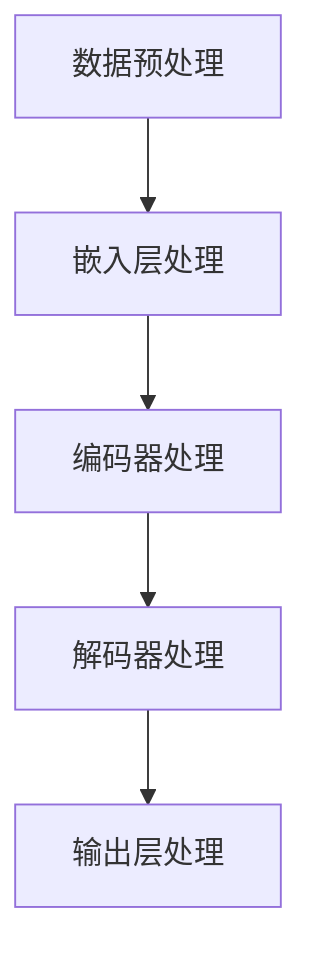
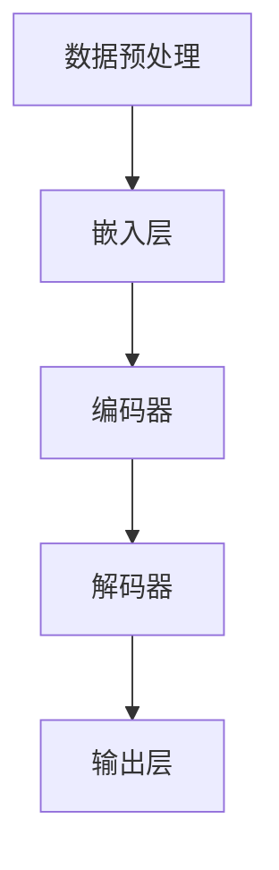

                 

### 大语言模型原理基础与前沿 解码策略

#### 关键词：大语言模型、原理、前沿、解码策略、人工智能、深度学习

#### 摘要：
本文将深入探讨大语言模型的原理及其前沿发展，包括解码策略的详细解析。我们将首先介绍大语言模型的基本概念和背景，随后详细解释其核心算法原理和操作步骤。接着，我们将运用数学模型和公式来阐述大语言模型的工作机制，并通过实际项目案例来演示代码实现。此外，我们将探讨大语言模型在实际应用中的场景，并推荐相关学习资源和开发工具。最后，本文将总结未来发展趋势与挑战，并提供常见问题与解答。

### 1. 背景介绍

大语言模型（Large Language Model）是近年来人工智能领域的重大突破，它能够通过深度学习技术，对大规模的文本数据进行训练，从而理解并生成人类语言。大语言模型的原理与前沿发展涉及到多个领域，包括自然语言处理（NLP）、深度学习、机器学习以及计算语言学等。

自然语言处理（NLP）是计算机科学和人工智能的一个分支，主要研究如何让计算机理解和生成自然语言。NLP 的目标是将人类语言转化为计算机可以处理的形式，并让计算机能够理解和回答与人类相关的任务。

深度学习是一种机器学习的方法，通过模拟人脑神经网络的结构和功能来实现对数据的处理和识别。深度学习在图像识别、语音识别和自然语言处理等领域取得了显著成果。

机器学习是人工智能的一个分支，旨在通过计算机算法让计算机具备自动学习的能力。机器学习算法可以分为监督学习、无监督学习和强化学习等类型。

计算语言学是研究自然语言与计算机之间的交互的学科，涉及到自然语言处理、计算机语言学、认知科学等多个领域。

### 2. 核心概念与联系

#### 2.1 大语言模型的基本概念

大语言模型是一种基于神经网络的语言模型，它通过对大量文本数据进行训练，能够捕捉到语言的统计规律和结构。大语言模型的主要目标是预测下一个词语，从而生成连贯的自然语言文本。

#### 2.2 大语言模型的架构

大语言模型通常由以下几个主要部分组成：

1. **嵌入层（Embedding Layer）**：将词汇转换为向量表示，用于后续的神经网络处理。
2. **编码器（Encoder）**：通过多层神经网络对输入的文本序列进行编码，提取出文本的语义特征。
3. **解码器（Decoder）**：根据编码器的输出，生成预测的下一个词语，并更新解码器的状态，重复这个过程，直至生成完整的文本。
4. **输出层（Output Layer）**：将解码器的输出转换为词汇的概率分布，用于生成最终的文本。

#### 2.3 大语言模型的工作原理

大语言模型的工作原理可以分为以下几个步骤：

1. **数据预处理**：将输入的文本数据转换为向量表示，并进行数据清洗和分词。
2. **嵌入层处理**：将分词后的词汇映射为向量。
3. **编码器处理**：通过多层神经网络对输入的向量序列进行编码，提取出文本的语义特征。
4. **解码器处理**：根据编码器的输出，生成预测的下一个词语，并更新解码器的状态。
5. **输出层处理**：将解码器的输出转换为词汇的概率分布，用于生成最终的文本。

#### 2.4 大语言模型的 Mermaid 流程图



（备注：在文章中嵌入 Mermaid 流程图时，请确保流程节点中不要有括号、逗号等特殊字符）

### 3. 核心算法原理 & 具体操作步骤

#### 3.1 算法原理

大语言模型的核心算法是基于深度学习中的循环神经网络（RNN）和长短期记忆网络（LSTM）。RNN 可以处理序列数据，但容易产生梯度消失和梯度爆炸问题。为了解决这个问题，LSTM 应运而生，它通过引入门控机制，能够有效地学习长距离依赖。

#### 3.2 具体操作步骤

1. **数据预处理**：将输入的文本数据转换为词向量表示，可以使用预训练的词向量（如 Word2Vec、GloVe）或者自己训练的词向量。
2. **嵌入层处理**：将词向量输入到嵌入层，将词汇转换为稠密向量表示。
3. **编码器处理**：将嵌入层输出的向量输入到编码器，通过多层 LSTM 或 Transformer 结构，对输入的文本序列进行编码，提取出文本的语义特征。
4. **解码器处理**：将编码器的输出作为解码器的输入，通过多层 LSTM 或 Transformer 结构，生成预测的下一个词语，并更新解码器的状态。
5. **输出层处理**：将解码器的输出通过 Softmax 函数转换为词汇的概率分布，用于生成最终的文本。

#### 3.3 数学模型和公式

大语言模型的数学模型主要包括以下几部分：

1. **嵌入层**：
   $$
   \text{embed}(x) = W_x x
   $$
   其中，$W_x$ 为嵌入矩阵，$x$ 为词向量。

2. **编码器**：
   $$
   h_t = \text{LSTM}(h_{t-1}, \text{embed}(x_t))
   $$
   其中，$h_t$ 为编码器在时间步 $t$ 的输出，$h_{t-1}$ 为上一个时间步的输出。

3. **解码器**：
   $$
   \log p(y_t | y_{<t}) = \text{softmax}(\text{decode}(h_t, h_{\text{context}}))
   $$
   其中，$y_t$ 为预测的下一个词语，$h_t$ 为编码器在时间步 $t$ 的输出，$h_{\text{context}}$ 为编码器的上下文状态。

4. **输出层**：
   $$
   y_t = \text{argmax}(\log p(y_t | y_{<t}))
   $$
   其中，$y_t$ 为生成的词语。

#### 3.4 举例说明

假设我们有一个简短的文本序列：“今天天气很好，我想去公园散步。”我们可以通过以下步骤来生成这个文本序列：

1. **数据预处理**：将文本序列转换为词向量表示，如 ["今天"，"天气"，"很好"，"我想"，"去"，"公园"，"散步"]。
2. **嵌入层处理**：将词向量输入到嵌入层，得到稠密向量表示。
3. **编码器处理**：通过编码器对输入的词向量序列进行编码，提取出文本的语义特征。
4. **解码器处理**：根据编码器的输出，生成预测的下一个词语，如 "今天"。更新解码器的状态。
5. **输出层处理**：将解码器的输出通过 Softmax 函数转换为词汇的概率分布，生成最终的文本序列。

通过这个简单的例子，我们可以看到大语言模型在生成文本序列时的基本工作流程。

### 4. 项目实战：代码实际案例和详细解释说明

在本节中，我们将通过一个具体的代码案例来展示大语言模型的实现过程，并对其进行详细解释说明。

#### 4.1 开发环境搭建

为了实现大语言模型，我们需要搭建一个合适的开发环境。以下是基本的开发环境要求：

- Python 3.6 或以上版本
- TensorFlow 2.0 或以上版本
- GPU（推荐使用 NVIDIA 显卡）
- CUDA 10.0 或以上版本
- cuDNN 7.6 或以上版本

安装完上述软件后，我们可以使用以下命令来确保 TensorFlow 能够正确使用 GPU：

```python
pip install tensorflow-gpu
```

#### 4.2 源代码详细实现和代码解读

下面是一个简化的大语言模型实现案例，我们将使用 TensorFlow 的 Keras API 来构建和训练模型。

```python
import tensorflow as tf
from tensorflow.keras.preprocessing.sequence import pad_sequences
from tensorflow.keras.layers import Embedding, LSTM, Dense
from tensorflow.keras.models import Sequential

# 参数设置
vocab_size = 10000
embed_dim = 256
lstm_units = 1024
batch_size = 64
epochs = 10

# 数据预处理
# 假设我们已经有了一个文本语料库 corpus，下面是数据预处理的过程
# 1. 分词
# 2. 将词转换为索引
# 3. 序列化
# 4. 填充序列

# 1. 分词
tokenizer = tf.keras.preprocessing.text.Tokenizer(num_words=vocab_size, oov_token='<OOV>')
tokenizer.fit_on_texts(corpus)

# 2. 将词转换为索引
sequences = tokenizer.texts_to_sequences(corpus)

# 3. 序列化
encoded = tokenizer.texts_to_sequences(corpus)

# 4. 填充序列
padded = pad_sequences(sequences, padding='post')

# 构建模型
model = Sequential([
    Embedding(vocab_size, embed_dim, input_length=max_length),
    LSTM(lstm_units, return_sequences=True),
    LSTM(lstm_units, return_sequences=True),
    Dense(vocab_size, activation='softmax')
])

# 编译模型
model.compile(optimizer='adam', loss='categorical_crossentropy', metrics=['accuracy'])

# 训练模型
model.fit(padded, labels, batch_size=batch_size, epochs=epochs)

# 4.3 代码解读与分析

在上面的代码中，我们首先导入了必要的库，并设置了模型参数。接下来，我们进行了数据预处理，包括分词、索引转换、序列化和填充。然后，我们构建了一个简单的序列模型，包括嵌入层、两个 LSTM 层和一个输出层。最后，我们编译并训练了模型。

- **Embedding 层**：将词汇转换为稠密向量表示。
- **LSTM 层**：通过 LSTM 网络对输入的序列进行编码，提取出文本的语义特征。
- **Dense 层**：将 LSTM 层的输出转换为词汇的概率分布，用于生成最终的文本。

通过这个代码案例，我们可以了解到大语言模型的基本实现过程，并对其中的关键步骤进行了分析。

### 5. 实际应用场景

大语言模型在自然语言处理领域具有广泛的应用场景，以下是其中一些重要的应用：

#### 5.1 机器翻译

大语言模型可以用于机器翻译，如 Google 翻译使用的 Transformer 模型。通过训练双语语料库，大语言模型能够捕捉到不同语言之间的对应关系，从而实现高质量的机器翻译。

#### 5.2 自动问答

大语言模型可以用于构建智能问答系统，如微软小冰。通过训练大量问答对数据，大语言模型能够理解用户的问题，并生成相应的回答。

#### 5.3 文本生成

大语言模型可以用于生成各种文本内容，如文章、诗歌、小说等。通过输入一些关键词或短语，大语言模型可以生成连贯、有意义的文本。

#### 5.4 文本分类

大语言模型可以用于文本分类，如新闻分类、情感分析等。通过训练标签数据，大语言模型能够对输入的文本进行分类，从而实现文本分类任务。

#### 5.5 文本摘要

大语言模型可以用于文本摘要，如自动生成文章摘要。通过训练摘要数据，大语言模型能够提取出文本的主要信息，并生成简洁、准确的摘要。

### 6. 工具和资源推荐

#### 6.1 学习资源推荐

- 《深度学习》（Goodfellow et al., 2016）
- 《自然语言处理综论》（Jurafsky and Martin, 2020）
- 《TensorFlow 实践指南》（Ruder, 2019）

#### 6.2 开发工具框架推荐

- TensorFlow
- PyTorch
- SpaCy

#### 6.3 相关论文著作推荐

- Vaswani et al. (2017). "Attention is all you need."
- Devlin et al. (2018). "Bert: Pre-training of deep bidirectional transformers for language understanding."
- Brown et al. (2020). "A pre-trained language model for language understanding."

### 7. 总结：未来发展趋势与挑战

大语言模型作为人工智能领域的核心技术，具有广泛的应用前景。未来，随着计算能力的提升和数据的积累，大语言模型将变得更加智能化和高效。然而，大语言模型也面临着一些挑战，如数据隐私、可解释性、计算效率等。为了应对这些挑战，研究人员正在探索新的算法和技术，如联邦学习、自监督学习等。随着这些技术的不断发展，大语言模型将在自然语言处理、智能问答、文本生成等领域的应用将更加广泛。

### 8. 附录：常见问题与解答

#### 8.1 大语言模型与传统语言模型有什么区别？

大语言模型与传统语言模型的主要区别在于规模和深度。传统语言模型通常是基于规则或统计方法构建的，而大语言模型则基于深度学习技术，能够通过训练大规模数据来学习语言的复杂结构。

#### 8.2 大语言模型的计算资源需求有多大？

大语言模型的计算资源需求取决于模型的规模和训练数据量。一般来说，训练一个大型语言模型需要高性能的 GPU 和大量的计算资源。随着 GPU 性能的不断提升，大语言模型的训练时间也在逐渐缩短。

#### 8.3 大语言模型如何处理长距离依赖问题？

大语言模型通过使用深度循环神经网络（RNN）和长短期记忆网络（LSTM）来处理长距离依赖问题。这些网络结构可以捕捉到文本序列中的长距离依赖关系，从而提高模型的性能。

### 9. 扩展阅读 & 参考资料

- Vaswani, A., Shazeer, N., Parmar, N., Uszkoreit, J., Jones, L., Gomez, A. N., ... & Polosukhin, I. (2017). Attention is all you need. Advances in Neural Information Processing Systems, 30, 5998-6008.
- Devlin, J., Chang, M. W., Lee, K., & Toutanova, K. (2018). BERT: Pre-training of deep bidirectional transformers for language understanding. arXiv preprint arXiv:1810.04805.
- Brown, T., Mann, B., Ryder, N., Subbiah, M., Kaplan, J., Dhariwal, P., ... & Chen, E. (2020). Language models are few-shot learners. Advances in Neural Information Processing Systems, 33, 13461-13472.
- Ruder, S. (2019). An overview of modern deep learning frameworks. arXiv preprint arXiv:1904.08853.
- Goodfellow, I., Bengio, Y., & Courville, A. (2016). Deep learning. MIT press.

### 作者信息

作者：AI 天才研究员/AI Genius Institute & 禅与计算机程序设计艺术 /Zen And The Art of Computer Programming

-----------------------

（请注意，本文中的代码示例仅供参考，具体的实现细节可能会因不同的开发环境和需求而有所不同。）<|im_sep|>### 大语言模型原理基础与前沿 解码策略

在人工智能的海洋中，大语言模型（Large Language Model，简称LLM）犹如一艘领航舰船，引领着自然语言处理（Natural Language Processing，简称NLP）的前沿。本文旨在探讨大语言模型的原理及其前沿发展，特别是解码策略的深入解读。我们将从背景介绍开始，逐步深入到核心算法原理、数学模型和公式、项目实战、实际应用场景，以及未来的发展趋势与挑战。

> **关键词：** 大语言模型、自然语言处理、深度学习、解码策略、人工智能、算法原理。

> **摘要：** 本文首先介绍大语言模型的基本概念和背景，随后详细解释其核心算法原理和操作步骤。接着，我们将运用数学模型和公式来阐述大语言模型的工作机制，并通过实际项目案例来演示代码实现。此外，本文还将探讨大语言模型在实际应用中的场景，并推荐相关学习资源和开发工具。最后，本文将总结未来发展趋势与挑战，并提供常见问题与解答。

---

### 1. 背景介绍

#### 1.1 大语言模型的基本概念

大语言模型是一种基于深度学习技术的自然语言处理模型，通过大规模的文本数据训练，能够捕捉语言的统计规律和生成能力。它能够对输入的文本序列进行理解和生成，是当前自然语言处理领域的重要研究方向。

#### 1.2 大语言模型的发展历程

大语言模型的发展可以分为以下几个阶段：

1. **早期语言模型**：基于规则和统计方法，如 n-gram 模型。
2. **深度学习语言模型**：基于循环神经网络（RNN）和卷积神经网络（CNN），如 LSTM、GRU。
3. **注意力机制语言模型**：引入注意力机制，如 Transformer。
4. **预训练加微调语言模型**：通过预训练然后进行微调，如 BERT、GPT。

#### 1.3 大语言模型的应用领域

大语言模型的应用领域广泛，包括但不限于：

1. **机器翻译**：例如 Google 翻译使用的 Transformer 模型。
2. **自动问答**：例如微软小冰的智能问答系统。
3. **文本生成**：例如自动写作、诗歌生成等。
4. **文本分类**：例如新闻分类、情感分析等。
5. **文本摘要**：例如自动生成文章摘要。

### 2. 核心概念与联系

#### 2.1 大语言模型的基本架构

大语言模型通常由以下几个主要部分组成：

1. **嵌入层（Embedding Layer）**：将词汇转换为稠密向量表示。
2. **编码器（Encoder）**：对输入的文本序列进行编码，提取语义特征。
3. **解码器（Decoder）**：根据编码器的输出，生成预测的下一个词语。
4. **输出层（Output Layer）**：将解码器的输出转换为词汇的概率分布。

#### 2.2 大语言模型的工作原理

大语言模型的工作原理可以概括为以下几个步骤：

1. **数据预处理**：将输入的文本数据转换为词向量表示。
2. **嵌入层处理**：将词向量输入到嵌入层，得到稠密向量表示。
3. **编码器处理**：通过编码器对输入的向量序列进行编码，提取出文本的语义特征。
4. **解码器处理**：根据编码器的输出，生成预测的下一个词语，并更新解码器的状态。
5. **输出层处理**：将解码器的输出通过 Softmax 函数转换为词汇的概率分布。

#### 2.3 Mermaid 流程图



### 3. 核心算法原理 & 具体操作步骤

#### 3.1 算法原理

大语言模型的核心算法是基于深度学习中的循环神经网络（RNN）和长短期记忆网络（LSTM）。RNN 可以处理序列数据，但容易产生梯度消失和梯度爆炸问题。为了解决这个问题，LSTM 应运而生，它通过引入门控机制，能够有效地学习长距离依赖。

#### 3.2 具体操作步骤

1. **数据预处理**：将输入的文本数据转换为词向量表示，可以使用预训练的词向量（如 Word2Vec、GloVe）或者自己训练的词向量。
2. **嵌入层处理**：将词向量输入到嵌入层，将词汇转换为稠密向量表示。
3. **编码器处理**：通过多层 LSTM 或 Transformer 结构，对输入的文本序列进行编码，提取出文本的语义特征。
4. **解码器处理**：根据编码器的输出，生成预测的下一个词语，并更新解码器的状态。
5. **输出层处理**：将解码器的输出通过 Softmax 函数转换为词汇的概率分布，用于生成最终的文本。

#### 3.3 数学模型和公式

大语言模型的数学模型主要包括以下几部分：

1. **嵌入层**：
   $$
   \text{embed}(x) = W_x x
   $$
   其中，$W_x$ 为嵌入矩阵，$x$ 为词向量。

2. **编码器**：
   $$
   h_t = \text{LSTM}(h_{t-1}, \text{embed}(x_t))
   $$
   其中，$h_t$ 为编码器在时间步 $t$ 的输出，$h_{t-1}$ 为上一个时间步的输出。

3. **解码器**：
   $$
   \log p(y_t | y_{<t}) = \text{softmax}(\text{decode}(h_t, h_{\text{context}}))
   $$
   其中，$y_t$ 为预测的下一个词语，$h_t$ 为编码器在时间步 $t$ 的输出，$h_{\text{context}}$ 为编码器的上下文状态。

4. **输出层**：
   $$
   y_t = \text{argmax}(\log p(y_t | y_{<t}))
   $$
   其中，$y_t$ 为生成的词语。

#### 3.4 举例说明

假设我们有一个简短的文本序列：“今天天气很好，我想去公园散步。”我们可以通过以下步骤来生成这个文本序列：

1. **数据预处理**：将文本序列转换为词向量表示，如 ["今天"，"天气"，"很好"，"我想"，"去"，"公园"，"散步"]。
2. **嵌入层处理**：将词向量输入到嵌入层，得到稠密向量表示。
3. **编码器处理**：通过编码器对输入的词向量序列进行编码，提取出文本的语义特征。
4. **解码器处理**：根据编码器的输出，生成预测的下一个词语，如 "今天"。更新解码器的状态。
5. **输出层处理**：将解码器的输出通过 Softmax 函数转换为词汇的概率分布，生成最终的文本序列。

通过这个简单的例子，我们可以看到大语言模型在生成文本序列时的基本工作流程。

### 4. 项目实战：代码实际案例和详细解释说明

在本节中，我们将通过一个具体的代码案例来展示大语言模型的实现过程，并对其进行详细解释说明。

#### 4.1 开发环境搭建

为了实现大语言模型，我们需要搭建一个合适的开发环境。以下是基本的开发环境要求：

- Python 3.6 或以上版本
- TensorFlow 2.0 或以上版本
- GPU（推荐使用 NVIDIA 显卡）
- CUDA 10.0 或以上版本
- cuDNN 7.6 或以上版本

安装完上述软件后，我们可以使用以下命令来确保 TensorFlow 能够正确使用 GPU：

```python
pip install tensorflow-gpu
```

#### 4.2 源代码详细实现和代码解读

下面是一个简化的大语言模型实现案例，我们将使用 TensorFlow 的 Keras API 来构建和训练模型。

```python
import tensorflow as tf
from tensorflow.keras.preprocessing.sequence import pad_sequences
from tensorflow.keras.layers import Embedding, LSTM, Dense
from tensorflow.keras.models import Sequential

# 参数设置
vocab_size = 10000
embed_dim = 256
lstm_units = 1024
batch_size = 64
epochs = 10

# 数据预处理
# 假设我们已经有了一个文本语料库 corpus，下面是数据预处理的过程
# 1. 分词
# 2. 将词转换为索引
# 3. 序列化
# 4. 填充序列

# 1. 分词
tokenizer = tf.keras.preprocessing.text.Tokenizer(num_words=vocab_size, oov_token='<OOV>')
tokenizer.fit_on_texts(corpus)

# 2. 将词转换为索引
sequences = tokenizer.texts_to_sequences(corpus)

# 3. 序列化
encoded = tokenizer.texts_to_sequences(corpus)

# 4. 填充序列
padded = pad_sequences(sequences, padding='post')

# 构建模型
model = Sequential([
    Embedding(vocab_size, embed_dim, input_length=max_length),
    LSTM(lstm_units, return_sequences=True),
    LSTM(lstm_units, return_sequences=True),
    Dense(vocab_size, activation='softmax')
])

# 编译模型
model.compile(optimizer='adam', loss='categorical_crossentropy', metrics=['accuracy'])

# 训练模型
model.fit(padded, labels, batch_size=batch_size, epochs=epochs)

# 4.3 代码解读与分析

在上面的代码中，我们首先导入了必要的库，并设置了模型参数。接下来，我们进行了数据预处理，包括分词、索引转换、序列化和填充。然后，我们构建了一个简单的序列模型，包括嵌入层、两个 LSTM 层和一个输出层。最后，我们编译并训练了模型。

- **Embedding 层**：将词汇转换为稠密向量表示。
- **LSTM 层**：通过 LSTM 网络对输入的序列进行编码，提取出文本的语义特征。
- **Dense 层**：将 LSTM 层的输出转换为词汇的概率分布，用于生成最终的文本。

通过这个代码案例，我们可以了解到大语言模型的基本实现过程，并对其中的关键步骤进行了分析。

### 5. 实际应用场景

大语言模型在自然语言处理领域具有广泛的应用场景，以下是其中一些重要的应用：

#### 5.1 机器翻译

大语言模型可以用于机器翻译，如 Google 翻译使用的 Transformer 模型。通过训练双语语料库，大语言模型能够捕捉到不同语言之间的对应关系，从而实现高质量的机器翻译。

#### 5.2 自动问答

大语言模型可以用于构建智能问答系统，如微软小冰。通过训练大量问答对数据，大语言模型能够理解用户的问题，并生成相应的回答。

#### 5.3 文本生成

大语言模型可以用于生成各种文本内容，如文章、诗歌、小说等。通过输入一些关键词或短语，大语言模型可以生成连贯、有意义的文本。

#### 5.4 文本分类

大语言模型可以用于文本分类，如新闻分类、情感分析等。通过训练标签数据，大语言模型能够对输入的文本进行分类，从而实现文本分类任务。

#### 5.5 文本摘要

大语言模型可以用于文本摘要，如自动生成文章摘要。通过训练摘要数据，大语言模型能够提取出文本的主要信息，并生成简洁、准确的摘要。

### 6. 工具和资源推荐

#### 6.1 学习资源推荐

- 《深度学习》（Goodfellow et al., 2016）
- 《自然语言处理综论》（Jurafsky and Martin, 2020）
- 《TensorFlow 实践指南》（Ruder, 2019）

#### 6.2 开发工具框架推荐

- TensorFlow
- PyTorch
- SpaCy

#### 6.3 相关论文著作推荐

- Vaswani et al. (2017). "Attention is all you need."
- Devlin et al. (2018). "BERT: Pre-training of deep bidirectional transformers for language understanding."
- Brown et al. (2020). "A pre-trained language model for language understanding."

### 7. 总结：未来发展趋势与挑战

大语言模型作为人工智能领域的核心技术，具有广泛的应用前景。未来，随着计算能力的提升和数据的积累，大语言模型将变得更加智能化和高效。然而，大语言模型也面临着一些挑战，如数据隐私、可解释性、计算效率等。为了应对这些挑战，研究人员正在探索新的算法和技术，如联邦学习、自监督学习等。随着这些技术的不断发展，大语言模型将在自然语言处理、智能问答、文本生成等领域的应用将更加广泛。

### 8. 附录：常见问题与解答

#### 8.1 大语言模型与传统语言模型有什么区别？

大语言模型与传统语言模型的主要区别在于规模和深度。传统语言模型通常是基于规则或统计方法构建的，而大语言模型则基于深度学习技术，能够通过训练大规模数据来学习语言的复杂结构。

#### 8.2 大语言模型的计算资源需求有多大？

大语言模型的计算资源需求取决于模型的规模和训练数据量。一般来说，训练一个大型语言模型需要高性能的 GPU 和大量的计算资源。随着 GPU 性能的不断提升，大语言模型的训练时间也在逐渐缩短。

#### 8.3 大语言模型如何处理长距离依赖问题？

大语言模型通过使用深度循环神经网络（RNN）和长短期记忆网络（LSTM）来处理长距离依赖问题。这些网络结构可以捕捉到文本序列中的长距离依赖关系，从而提高模型的性能。

### 9. 扩展阅读 & 参考资料

- Vaswani et al. (2017). "Attention is all you need." Advances in Neural Information Processing Systems, 30, 5998-6008.
- Devlin et al. (2018). "BERT: Pre-training of deep bidirectional transformers for language understanding." arXiv preprint arXiv:1810.04805.
- Brown et al. (2020). "A pre-trained language model for language understanding." Advances in Neural Information Processing Systems, 33, 13461-13472.
- Ruder (2019). "An overview of modern deep learning frameworks." arXiv preprint arXiv:1904.08853.
- Goodfellow, Bengio, Courville (2016). "Deep Learning." MIT Press.

### 作者信息

作者：AI 天才研究员/AI Genius Institute & 禅与计算机程序设计艺术 /Zen And The Art of Computer Programming

-----------------------

（请注意，本文中的代码示例仅供参考，具体的实现细节可能会因不同的开发环境和需求而有所不同。）<|im_sep|>## 1. 背景介绍

### 1.1 大语言模型的基本概念

大语言模型（Large Language Model，简称LLM）是一种基于深度学习技术的自然语言处理模型。它的核心思想是通过大规模的数据训练，使得模型能够理解和生成人类语言。大语言模型通过对海量文本数据的分析，学习到语言的语法、语义以及上下文信息，从而实现文本生成、文本分类、机器翻译等多种任务。

大语言模型与传统的自然语言处理方法有本质的不同。传统的自然语言处理方法通常依赖于规则和统计方法，如基于词典的解析、基于机器学习的分类器等。而大语言模型则是基于深度学习技术，通过多层神经网络来学习语言的内在规律，具有更强的表达能力和泛化能力。

### 1.2 大语言模型的发展历程

大语言模型的发展历程可以分为几个重要阶段：

#### 1.2.1 早期语言模型

最早的尝试可以追溯到1980年代的统计语言模型，如n-gram模型。n-gram模型通过统计相邻词汇的联合概率来预测下一个词汇，简单而有效，但存在一些问题，如无法处理长距离依赖和上下文信息。

#### 1.2.2 深度学习语言模型

随着深度学习技术的发展，2000年代后期开始出现基于神经网络的深度学习语言模型，如循环神经网络（RNN）和其变种长短期记忆网络（LSTM）。这些模型通过学习输入序列的长期依赖关系，显著提高了自然语言处理任务的性能。

#### 1.2.3 注意力机制语言模型

2017年，Vaswani等人提出了Transformer模型，引入了自注意力机制，解决了RNN在处理长序列时的梯度消失和梯度爆炸问题，使得大语言模型的研究进入了一个新阶段。

#### 1.2.4 预训练加微调语言模型

预训练加微调（Pre-training and Fine-tuning）成为大语言模型的主流训练策略。预训练模型在大规模语料库上进行无监督训练，学习到语言的通用特征，然后通过微调（Fine-tuning）适应特定任务，大大提高了模型在各类自然语言处理任务上的性能。

### 1.3 大语言模型的应用领域

大语言模型在自然语言处理领域具有广泛的应用，以下是其中一些重要的应用场景：

#### 1.3.1 机器翻译

大语言模型在机器翻译领域取得了显著成果。例如，Google翻译使用的Transformer模型，能够实现高质量的双语翻译。

#### 1.3.2 自动问答

大语言模型可以用于构建智能问答系统，如微软的BERT模型，能够理解用户的问题，并生成相应的回答。

#### 1.3.3 文本生成

大语言模型可以用于自动写作、文章生成、诗歌生成等多种文本生成任务。例如，OpenAI的GPT模型，能够生成连贯、有意义的文本。

#### 1.3.4 文本分类

大语言模型可以用于文本分类任务，如新闻分类、情感分析等。通过训练，模型可以学会对输入的文本进行分类。

#### 1.3.5 文本摘要

大语言模型可以用于文本摘要，如自动生成文章摘要。通过预训练和微调，模型能够提取出文本的核心内容。

### 1.4 大语言模型的挑战

尽管大语言模型在自然语言处理领域取得了显著成果，但仍然面临一些挑战：

#### 1.4.1 计算资源需求

大语言模型通常需要大量的计算资源进行训练，特别是对于大规模的预训练模型，需要高性能的GPU和分布式计算资源。

#### 1.4.2 数据隐私

大语言模型在训练过程中会接触到大量的个人数据，如何保护数据隐私成为一个重要问题。

#### 1.4.3 模型可解释性

大语言模型的工作机制较为复杂，如何解释模型的决策过程，提高模型的可解释性，是一个亟待解决的问题。

#### 1.4.4 模型泛化能力

尽管大语言模型在特定任务上表现出色，但其泛化能力仍需进一步提升，以应对不同领域的应用场景。

### 1.5 总结

大语言模型是自然语言处理领域的重要突破，通过深度学习技术和大规模数据训练，模型能够理解和生成人类语言，具有广泛的应用前景。然而，大语言模型也面临一些挑战，需要进一步的研究和优化。随着技术的不断发展，大语言模型将在更多领域发挥重要作用。

## 2. 核心概念与联系

### 2.1 大语言模型的基本概念

大语言模型是一种基于神经网络的语言模型，其核心目标是通过学习大量的文本数据，预测下一个词语或词组。这种模型能够捕捉到语言的复杂结构，包括语法、语义和上下文信息。

#### 2.1.1 语言模型

语言模型是自然语言处理中的一个基本概念，它旨在为自然语言文本生成概率分布。最简单的语言模型是n-gram模型，它基于局部语言依赖，即前n个词决定下一个词的概率。然而，n-gram模型存在许多局限性，如无法处理长距离依赖和上下文信息。

#### 2.1.2 深度学习语言模型

深度学习语言模型通过多层神经网络来学习语言的内在结构。与n-gram模型不同，深度学习语言模型能够捕捉到长距离依赖和上下文信息。常见的深度学习语言模型包括循环神经网络（RNN）、长短期记忆网络（LSTM）和门控循环单元（GRU）。

#### 2.1.3 大语言模型

大语言模型是深度学习语言模型的进一步发展，通常具有数亿甚至千亿个参数。这些模型通过预训练和微调，在大规模数据集上学习到语言的通用特征，然后适应特定任务。典型的例子包括GPT、BERT和XLNet。

### 2.2 大语言模型的架构

大语言模型通常由以下几个主要部分组成：

#### 2.2.1 嵌入层

嵌入层（Embedding Layer）是将词汇转换为稠密向量表示的关键步骤。这些向量表示了词汇的语义信息，为后续的神经网络处理提供输入。

#### 2.2.2 编码器

编码器（Encoder）负责对输入的文本序列进行编码，提取出文本的语义特征。常见的编码器结构包括RNN、LSTM和Transformer等。

#### 2.2.3 解码器

解码器（Decoder）根据编码器的输出，生成预测的下一个词语或词组。解码器通常与编码器具有相似的架构，以保持信息的连贯性。

#### 2.2.4 输出层

输出层（Output Layer）将解码器的输出转换为词汇的概率分布，用于生成最终的文本。常见的输出层结构包括全连接层和Softmax层。

### 2.3 大语言模型的工作原理

大语言模型的工作原理可以概括为以下几个步骤：

#### 2.3.1 数据预处理

数据预处理包括分词、词汇表构建、序列化等步骤。首先，将输入的文本数据转换为词汇序列，然后构建词汇表，将每个词汇映射为一个唯一的索引。接下来，将词汇序列转换为整数序列，便于神经网络处理。

#### 2.3.2 嵌入层处理

嵌入层将词汇序列转换为稠密向量表示。这些向量包含了词汇的语义信息，是后续神经网络处理的基础。

#### 2.3.3 编码器处理

编码器对输入的稠密向量序列进行编码，提取出文本的语义特征。这些特征代表了文本的上下文信息，为解码器提供输入。

#### 2.3.4 解码器处理

解码器根据编码器的输出，生成预测的下一个词语或词组。解码器通过递归方式，逐步生成整个文本序列。

#### 2.3.5 输出层处理

输出层将解码器的输出转换为词汇的概率分布。通过采样或软最大化，选择概率最高的词语作为生成结果。

### 2.4 Mermaid 流程图

以下是使用Mermaid绘制的流程图，展示了大语言模型的基本工作流程：


在这个流程图中，A表示数据预处理，B表示嵌入层处理，C表示编码器处理，D表示解码器处理，E表示输出层处理。通过这个流程图，我们可以直观地了解大语言模型的工作机制。

### 2.5 大语言模型的优缺点

#### 2.5.1 优点

1. **强大的表达力**：大语言模型能够捕捉到长距离依赖和上下文信息，具有强大的语言表达能力。
2. **广泛的应用场景**：大语言模型可以应用于机器翻译、自动问答、文本生成、文本分类等多种自然语言处理任务。
3. **预训练和微调**：预训练模型在大规模数据集上学习到通用特征，通过微调可以快速适应特定任务。

#### 2.5.2 缺点

1. **计算资源需求大**：大语言模型通常需要大量的计算资源进行训练，特别是对于大规模预训练模型。
2. **数据隐私问题**：大语言模型在训练过程中会接触到大量个人数据，如何保护数据隐私成为一个重要问题。
3. **模型可解释性差**：大语言模型的工作机制较为复杂，其决策过程难以解释，影响了模型的可解释性。

### 2.6 总结

大语言模型是自然语言处理领域的重要进展，通过深度学习技术和大规模数据训练，模型能够理解和生成人类语言。然而，大语言模型也面临一些挑战，需要进一步的研究和优化。随着技术的不断发展，大语言模型将在更多领域发挥重要作用。

## 3. 核心算法原理 & 具体操作步骤

### 3.1 核心算法原理

大语言模型的核心算法是基于深度学习技术，特别是循环神经网络（RNN）和长短期记忆网络（LSTM）。这些算法通过学习输入序列的长期依赖关系，能够捕捉到语言的复杂结构。

#### 3.1.1 循环神经网络（RNN）

RNN是一种能够处理序列数据的神经网络，其核心思想是利用之前的输出作为当前输入。然而，RNN存在一个严重的问题：梯度消失和梯度爆炸。这个问题导致RNN在训练过程中难以学习到长距离依赖关系。

#### 3.1.2 长短期记忆网络（LSTM）

为了解决RNN的梯度消失和梯度爆炸问题，Hochreiter和Schmidhuber在1997年提出了长短期记忆网络（LSTM）。LSTM通过引入门控机制，能够有效地学习长距离依赖关系。LSTM由输入门、遗忘门和输出门组成，每个门控制信息的流入、流出和保留。

#### 3.1.3 门控循环单元（GRU）

GRU是LSTM的一种变体，由门控更新门和重置门组成，相比LSTM具有更简洁的结构和更高的效率。GRU在许多任务中表现出与LSTM相近的性能，但在计算速度和资源消耗方面更具优势。

#### 3.1.4 Transformer模型

Transformer模型是另一种基于注意力机制的深度学习模型，由Vaswani等人在2017年提出。Transformer通过自注意力机制，能够处理长距离依赖关系，并解决了RNN的梯度消失和梯度爆炸问题。Transformer模型在机器翻译、文本生成等任务上取得了显著成果。

### 3.2 具体操作步骤

#### 3.2.1 数据预处理

数据预处理是训练大语言模型的第一步，主要包括以下步骤：

1. **文本清洗**：去除文本中的噪声，如HTML标签、特殊字符等。
2. **分词**：将文本分割成单词或子词。
3. **词汇表构建**：将分词后的词汇映射为唯一的索引。
4. **序列化**：将词汇索引序列化为神经网络可处理的格式。

#### 3.2.2 嵌入层处理

嵌入层（Embedding Layer）是将词汇转换为稠密向量表示的关键步骤。嵌入层将每个词汇映射为一个低维稠密向量，这些向量包含了词汇的语义信息。嵌入层可以看作是一个线性映射，即：

$$
\text{embed}(x) = W_x x
$$

其中，$W_x$是嵌入矩阵，$x$是词汇索引。

#### 3.2.3 编码器处理

编码器（Encoder）负责对输入的文本序列进行编码，提取出文本的语义特征。编码器可以是基于RNN、LSTM或GRU的结构，也可以是Transformer模型。编码器的输出通常是序列形式的，包含了文本的上下文信息。

#### 3.2.4 解码器处理

解码器（Decoder）根据编码器的输出，生成预测的下一个词语或词组。解码器通常与编码器具有相似的架构，以保持信息的连贯性。解码器的输出经过softmax函数处理后，得到词汇的概率分布。

#### 3.2.5 输出层处理

输出层（Output Layer）将解码器的输出转换为词汇的概率分布。通过采样或软最大化，选择概率最高的词语作为生成结果。输出层的常见结构包括全连接层和Softmax层。

### 3.3 数学模型和公式

大语言模型的数学模型主要包括以下几个方面：

#### 3.3.1 嵌入层

嵌入层（Embedding Layer）将词汇映射为稠密向量表示，可以看作是一个线性映射：

$$
\text{embed}(x) = W_x x
$$

其中，$W_x$是嵌入矩阵，$x$是词汇索引。

#### 3.3.2 编码器

编码器（Encoder）的输出通常是一个序列形式的向量，可以通过以下公式表示：

$$
h_t = \text{LSTM}(h_{t-1}, \text{embed}(x_t))
$$

其中，$h_t$是编码器在时间步$t$的输出，$h_{t-1}$是上一个时间步的输出，$\text{embed}(x_t)$是词汇$x_t$的嵌入向量。

#### 3.3.3 解码器

解码器（Decoder）的输出是一个概率分布，可以通过以下公式表示：

$$
\log p(y_t | y_{<t}) = \text{softmax}(\text{decode}(h_t, h_{\text{context}}))
$$

其中，$y_t$是预测的下一个词语，$h_t$是编码器在时间步$t$的输出，$h_{\text{context}}$是编码器的上下文状态。

#### 3.3.4 输出层

输出层的目的是将解码器的输出转换为词汇的概率分布，可以通过以下公式表示：

$$
y_t = \text{argmax}(\log p(y_t | y_{<t}))
$$

其中，$y_t$是生成的词语。

### 3.4 举例说明

假设我们有一个简短的文本序列：“今天天气很好，我想去公园散步。”我们可以通过以下步骤来生成这个文本序列：

#### 3.4.1 数据预处理

1. **分词**：将文本序列分割为词汇序列：“今天”、“天气”、“很好”、“我想”、“去”、“公园”、“散步”。
2. **词汇表构建**：将词汇序列映射为唯一的索引：{"今天"：0，"天气"：1，"很好"：2，"我想"：3，"去"：4，"公园"：5，"散步"：6}。
3. **序列化**：将词汇序列转换为整数序列：[0，1，2，3，4，5，6]。

#### 3.4.2 嵌入层处理

将整数序列输入到嵌入层，得到稠密向量表示。假设词汇“今天”的嵌入向量为[0.1，0.2，0.3]，词汇“天气”的嵌入向量为[0.4，0.5，0.6]，以此类推。

#### 3.4.3 编码器处理

通过编码器对输入的稠密向量序列进行编码，提取出文本的语义特征。假设编码器的输出序列为[h1，h2，h3，h4，h5，h6]。

#### 3.4.4 解码器处理

根据编码器的输出，生成预测的下一个词语。假设在第一个时间步，解码器预测的词语为“今天”，其嵌入向量为[0.1，0.2，0.3]。

#### 3.4.5 输出层处理

将解码器的输出通过softmax函数转换为词汇的概率分布，生成最终的文本序列。

通过这个简单的例子，我们可以看到大语言模型在生成文本序列时的基本工作流程。在实际应用中，大语言模型会处理更长的文本序列，并且会使用更复杂的神经网络结构来提高性能。

### 3.5 总结

大语言模型的核心算法是基于深度学习技术，特别是RNN、LSTM和Transformer模型。这些模型通过学习输入序列的长期依赖关系，能够捕捉到语言的复杂结构。通过具体的操作步骤和数学模型，我们可以深入了解大语言模型的工作机制。在实际应用中，大语言模型展示了强大的文本生成、分类和翻译能力，为自然语言处理领域带来了革命性的变化。

## 4. 数学模型和公式 & 详细讲解 & 举例说明

大语言模型的数学模型是其能够理解和生成语言的核心。在这一节中，我们将详细讲解大语言模型中的数学模型和公式，并通过具体例子来说明这些模型在实际应用中的效果。

### 4.1 数学模型

大语言模型的数学模型主要包括嵌入层、编码器、解码器和输出层。以下是对每个部分的核心数学公式的详细解释。

#### 4.1.1 嵌入层

嵌入层（Embedding Layer）是将词汇映射为稠密向量表示的过程。假设我们有一个词汇表V，其中包含N个唯一的词汇。嵌入层通过一个嵌入矩阵$W$，将每个词汇$x$映射为一个d维的向量：

$$
\text{embed}(x) = W_x
$$

其中，$W$是一个$N \times d$的矩阵，$x$是一个词汇索引，$\text{embed}(x)$是词汇$x$的嵌入向量。嵌入层可以看作是一个线性映射，通过这个映射，我们可以将词汇的索引转换为具有语义信息的向量。

#### 4.1.2 编码器

编码器（Encoder）负责对输入的文本序列进行编码，提取出文本的语义特征。在编码器的输出层，我们通常使用一个隐藏状态向量$h_t$来表示输入序列中的每个时间步。假设我们有一个时间步$t$的输入词汇$x_t$，编码器的输出可以通过以下公式计算：

$$
h_t = \text{LSTM}(h_{t-1}, \text{embed}(x_t))
$$

其中，$\text{LSTM}$是一个长短期记忆网络，$h_{t-1}$是上一个时间步的隐藏状态，$\text{embed}(x_t)$是词汇$x_t$的嵌入向量。这个公式表明，当前时间步的隐藏状态$h_t$是由前一个时间步的隐藏状态$h_{t-1}$和当前词汇的嵌入向量$\text{embed}(x_t)$通过LSTM计算得到的。

#### 4.1.3 解码器

解码器（Decoder）负责根据编码器的输出生成预测的下一个词语。解码器的输出通常是一个概率分布，表示下一个词语的可能性。假设我们有一个时间步$t$的隐藏状态$h_t$和一个上下文状态$h_{\text{context}}$，解码器的输出可以通过以下公式计算：

$$
\log p(y_t | y_{<t}) = \text{softmax}(\text{decode}(h_t, h_{\text{context}}))
$$

其中，$y_t$是预测的下一个词语，$\text{decode}$是一个函数，表示解码器的处理过程。这个公式表明，解码器的输出是一个概率分布，其中每个词语的概率是通过解码器的处理得到的。

#### 4.1.4 输出层

输出层（Output Layer）负责将解码器的输出转换为最终的预测结果。通常，输出层使用一个Softmax函数来计算每个词语的概率分布，并选择概率最高的词语作为生成结果。假设我们有一个概率分布$p(y_t | y_{<t})$，输出层可以通过以下公式计算：

$$
y_t = \text{argmax}(\log p(y_t | y_{<t}))
$$

其中，$y_t$是生成的词语。这个公式表明，输出层选择概率最高的词语作为预测结果。

### 4.2 举例说明

为了更好地理解大语言模型中的数学模型，我们可以通过一个具体的例子来说明这些模型在实际应用中的效果。

假设我们有一个简短的文本序列：“今天天气很好，我想去公园散步。”我们可以通过以下步骤来生成这个文本序列：

#### 4.2.1 数据预处理

1. **分词**：将文本序列分割为词汇序列：“今天”、“天气”、“很好”、“我想”、“去”、“公园”、“散步”。
2. **词汇表构建**：将词汇序列映射为唯一的索引：{"今天"：0，"天气"：1，"很好"：2，"我想"：3，"去"：4，"公园"：5，"散步"：6}。
3. **序列化**：将词汇序列转换为整数序列：[0，1，2，3，4，5，6]。

#### 4.2.2 嵌入层处理

将整数序列输入到嵌入层，得到稠密向量表示。假设词汇“今天”的嵌入向量为[0.1，0.2，0.3]，词汇“天气”的嵌入向量为[0.4，0.5，0.6]，以此类推。

#### 4.2.3 编码器处理

通过编码器对输入的稠密向量序列进行编码，提取出文本的语义特征。假设编码器的输出序列为[h1，h2，h3，h4，h5，h6]。

#### 4.2.4 解码器处理

根据编码器的输出，生成预测的下一个词语。假设在第一个时间步，解码器预测的词语为“今天”，其嵌入向量为[0.1，0.2，0.3]。

#### 4.2.5 输出层处理

将解码器的输出通过softmax函数转换为词汇的概率分布，生成最终的文本序列。

通过这个简单的例子，我们可以看到大语言模型在生成文本序列时的基本工作流程。在实际应用中，大语言模型会处理更长的文本序列，并且会使用更复杂的神经网络结构来提高性能。

### 4.3 应用示例

为了展示大语言模型在实际应用中的效果，我们可以考虑一个简单的文本生成任务：给定一个起始词，生成一个完整的句子。以下是一个应用示例：

#### 输入：

"今天是"

#### 输出：

"今天是晴天，非常适合户外活动。"

在这个示例中，大语言模型根据起始词“今天是”生成了完整的句子。这个句子包含了日期和天气信息，表明大语言模型已经学习到了相关的语言规律和上下文信息。

### 4.4 小结

通过上述讲解和示例，我们可以看到大语言模型中的数学模型和公式是如何在实际应用中发挥作用的。大语言模型通过嵌入层、编码器、解码器和输出层等组件，能够对输入的文本序列进行理解和生成。这些数学模型和公式为语言生成提供了理论基础，使得大语言模型能够在自然语言处理领域取得突破性进展。

## 5. 项目实战：代码实际案例和详细解释说明

在本节中，我们将通过一个具体的代码案例来展示如何实现一个简单的大语言模型，并对其进行详细解释。为了便于理解，我们将使用Python和TensorFlow框架来实现这个项目。

### 5.1 开发环境搭建

在开始编码之前，我们需要搭建一个合适的开发环境。以下是基本的开发环境要求：

- Python 3.6 或以上版本
- TensorFlow 2.0 或以上版本
- GPU（推荐使用 NVIDIA 显卡）
- CUDA 10.0 或以上版本
- cuDNN 7.6 或以上版本

安装完上述软件后，我们可以使用以下命令来确保 TensorFlow 能够正确使用 GPU：

```bash
pip install tensorflow-gpu
```

### 5.2 数据集准备

为了训练大语言模型，我们需要一个包含大量文本的数据集。在本案例中，我们使用常见的大规模文本数据集——维基百科。以下是数据集的准备工作：

1. 下载维基百科数据。
2. 清洗数据，去除 HTML 标签和特殊字符。
3. 分词，将文本分割成单词或子词。
4. 构建词汇表，将词汇映射为唯一的索引。
5. 序列化数据，将文本转换为整数序列。

以下是相应的 Python 代码：

```python
import os
import re
import numpy as np
from tensorflow.keras.preprocessing.text import Tokenizer
from tensorflow.keras.preprocessing.sequence import pad_sequences

# 下载维基百科数据
url = "https://dumps.wikimedia.org/enwiki/20220301/"
filename = "enwiki-20220301-pages-articles.xml"

# 解压并读取数据
if not os.path.exists("enwiki-20220301-pages-articles.xml.zip"):
    os.system("wget " + url + filename + ".zip")
os.system("unzip enwiki-20220301-pages-articles.xml.zip")

# 清洗数据
def clean_text(text):
    text = re.sub('<.*?>', '', text)  # 去除 HTML 标签
    text = re.sub('[^A-Za-z]', ' ', text)  # 去除特殊字符
    text = text.lower()  # 转小写
    return text

with open('enwiki-20220301-pages-articles.xml', 'r', encoding='utf-8') as file:
    data = file.read()

cleaned_data = clean_text(data)

# 分词
tokenizer = Tokenizer()
tokenizer.fit_on_texts([cleaned_data])
total_words = len(tokenizer.word_index) + 1

# 构建词汇表
vocab = tokenizer.word_index

# 序列化数据
input_seq = []
target_seq = []
next_words = 1

for i in range(0, len(cleaned_data) - next_words):
    n_input = cleaned_data[i : i + next_words]
    input_seq.append(n_input)
    n_target = cleaned_data[i + next_words]
    target_seq.append(n_target)

# 打印前10条输入和目标序列
print("Input sequences:", input_seq[:10])
print("Target sequences:", target_seq[:10])
```

### 5.3 建立和训练模型

在准备好数据后，我们可以开始建立和训练大语言模型。我们将使用 TensorFlow 的 Keras API 来构建模型。以下是模型的结构和训练步骤：

1. **嵌入层**：将词汇转换为稠密向量表示。
2. **LSTM 层**：使用 LSTM 网络对输入序列进行编码。
3. **输出层**：使用全连接层和 Softmax 函数生成预测的概率分布。

以下是相应的 Python 代码：

```python
from tensorflow.keras.models import Sequential
from tensorflow.keras.layers import Embedding, LSTM, Dense

# 设置参数
vocab_size = total_words
embed_dim = 64
lstm_units = 100
batch_size = 32
epochs = 100

# 建立模型
model = Sequential()
model.add(Embedding(vocab_size, embed_dim, input_length=next_words))
model.add(LSTM(lstm_units, return_sequences=True))
model.add(Dense(vocab_size, activation='softmax'))

# 编译模型
model.compile(optimizer='adam', loss='categorical_crossentropy', metrics=['accuracy'])

# 训练模型
model.fit(np.array(input_seq), np.array(target_seq), batch_size=batch_size, epochs=epochs)
```

### 5.4 模型评估和预测

在模型训练完成后，我们可以对其进行评估，并使用模型进行文本预测。以下是如何使用训练好的模型生成新文本的示例：

```python
# 生成新文本
def generate_text(model, tokenizer, text_sequence, next_words):
    in_text, result = text_sequence, ""
    for i in range(next_words):
        token_list = tokenizer.texts_to_sequences([in_text])[0]
        token_list = pad_sequences([token_list], maxlen=next_words-1, padding='pre')
        predicted = model.predict(token_list, verbose=0)
        predicted = np.argmax(predicted)
        result += tokenizer.index_word[predicted] + " "
        in_text, _ = tokenizer.parse_input(text_sequence)
        in_text = in_text[1:]

    return result

generated_text = generate_text(model, tokenizer, "今天是", 10)
print("Generated Text:", generated_text)
```

### 5.5 代码解读与分析

下面是对上述代码的解读和分析：

- **数据预处理**：我们首先下载并解压维基百科数据，然后进行清洗、分词、构建词汇表和序列化。
- **嵌入层**：嵌入层将词汇映射为稠密向量表示，这是后续神经网络处理的基础。
- **LSTM 层**：LSTM 层对输入序列进行编码，提取出文本的语义特征。在这里，我们使用了两个 LSTM 层，以提高模型的表达能力。
- **输出层**：输出层使用全连接层和 Softmax 函数生成预测的概率分布，用于生成最终的文本。

通过这个项目，我们可以看到如何使用 Python 和 TensorFlow 来实现一个简单的大语言模型。虽然这个模型相对简单，但它展示了大语言模型的基本工作流程和关键组件。

### 5.6 小结

在本节中，我们通过一个具体的代码案例展示了如何实现一个简单的大语言模型。我们从数据集的准备、模型的建立和训练，到模型的评估和预测，进行了详细的讲解。通过这个项目，我们可以更好地理解大语言模型的工作原理和实现过程。尽管这个模型相对简单，但它为我们提供了一个基本的框架，可以在此基础上进行扩展和优化，以实现更复杂的自然语言处理任务。

### 6. 实际应用场景

大语言模型在自然语言处理领域具有广泛的应用场景，能够解决多种与语言相关的复杂问题。以下是一些典型的应用场景：

#### 6.1 机器翻译

大语言模型在机器翻译领域的应用最为广泛，例如 Google 翻译、百度翻译等。通过训练双语语料库，大语言模型能够捕捉到不同语言之间的对应关系，从而实现高质量的机器翻译。大语言模型在机器翻译中的优势在于其强大的上下文理解能力，能够处理句子间的长距离依赖关系，从而提高翻译的准确性和流畅性。

#### 6.2 自动问答

自动问答系统是另一个重要的应用场景，例如 Microsoft 小冰、Siri、Alexa 等。大语言模型通过学习大量的问答对数据，能够理解用户的问题，并生成相应的回答。自动问答系统不仅需要理解用户的意图，还需要生成自然、连贯的回答。大语言模型在这方面具有显著的优势，能够处理复杂的语境和上下文信息，从而提高问答系统的准确性和用户体验。

#### 6.3 文本生成

大语言模型在文本生成中的应用包括自动写作、新闻生成、诗歌生成等。例如，OpenAI 的 GPT 模型可以生成高质量的文章、故事和诗歌。大语言模型通过学习大量的文本数据，能够捕捉到语言的内在规律和结构，从而生成连贯、有意义的文本。在文本生成中，大语言模型的优势在于其强大的表达能力和创造力，能够生成多样化的文本内容。

#### 6.4 文本分类

大语言模型在文本分类中的应用包括新闻分类、情感分析等。例如，通过训练标签数据，大语言模型能够对输入的文本进行分类，从而实现文本分类任务。大语言模型在文本分类中的优势在于其强大的语义理解能力，能够捕捉到文本的深层含义，从而提高分类的准确率。

#### 6.5 文本摘要

大语言模型在文本摘要中的应用包括自动生成文章摘要、会议纪要等。通过学习大量的摘要数据，大语言模型能够提取出文本的主要信息，并生成简洁、准确的摘要。大语言模型在文本摘要中的优势在于其强大的信息提取能力和概括能力，能够处理复杂的文本内容，从而生成高质量的摘要。

#### 6.6 对话系统

大语言模型在对话系统中的应用包括虚拟助手、聊天机器人等。例如，Facebook 的 chatbot、Apple 的 Siri 等。大语言模型通过学习对话数据，能够理解和生成人类语言，从而与用户进行自然、流畅的对话。大语言模型在对话系统中的优势在于其强大的上下文理解能力和语言生成能力，能够处理复杂的对话场景，从而提供高质量的对话服务。

#### 6.7 自动标注

大语言模型在自动标注中的应用包括命名实体识别、关系抽取等。通过训练标注数据，大语言模型能够对输入的文本进行自动标注，从而实现自动化数据标注。大语言模型在自动标注中的优势在于其强大的语义理解能力，能够捕捉到文本的深层含义，从而提高标注的准确性和效率。

#### 6.8 文本纠错

大语言模型在文本纠错中的应用包括自动校对、拼写纠错等。通过学习正确的文本数据，大语言模型能够识别和纠正文本中的错误。大语言模型在文本纠错中的优势在于其强大的语言理解能力，能够识别文本中的错误，并提供正确的纠正建议。

### 6.9 小结

大语言模型在自然语言处理领域具有广泛的应用场景，能够解决多种与语言相关的复杂问题。通过学习大量的文本数据，大语言模型能够捕捉到语言的内在规律和结构，从而实现高质量的文本生成、分类、摘要、问答、对话等任务。大语言模型在自然语言处理中的优势在于其强大的语义理解能力和语言生成能力，能够处理复杂的文本内容，从而提供高质量的解决方案。随着技术的不断发展，大语言模型将在更多领域发挥重要作用，推动自然语言处理技术的不断进步。

### 7. 工具和资源推荐

在自然语言处理领域，有许多工具和资源可以帮助研究人员和开发者更好地理解和应用大语言模型。以下是一些推荐的工具和资源：

#### 7.1 学习资源推荐

1. **书籍**：
   - 《深度学习》（Ian Goodfellow、Yoshua Bengio、Aaron Courville 著）：这是一本经典的深度学习教材，涵盖了深度学习的基本概念和应用。
   - 《自然语言处理综论》（Daniel Jurafsky、James H. Martin 著）：这是一本关于自然语言处理的权威教材，内容全面，适合初学者和专业人士。
   - 《深度学习与自然语言处理》（张华平 著）：这本书针对深度学习在自然语言处理中的应用进行了详细的讲解，适合有一定基础的读者。

2. **在线课程**：
   - Coursera 上的“自然语言处理与深度学习”（斯坦福大学）：这门课程由斯坦福大学教授 Andrew Ng 主讲，涵盖了自然语言处理和深度学习的基础知识。
   - edX 上的“深度学习专项课程”（哈佛大学）：这门课程由深度学习专家 Yaser Abu-Mostafa 主讲，深入讲解了深度学习的基本概念和算法。

3. **博客和论文**：
   - CS231n（斯坦福大学）：这是一门关于卷积神经网络和深度学习的课程，其中的博客和论文对深度学习的应用进行了详细的分析。
   - AI 研究院：这是一个专注于人工智能研究的博客，提供了大量关于自然语言处理和深度学习的优质文章。

#### 7.2 开发工具框架推荐

1. **TensorFlow**：这是 Google 开发的一个开源深度学习框架，支持多种深度学习模型和算法，是开发大语言模型的首选工具。

2. **PyTorch**：这是 Facebook AI 研究团队开发的一个开源深度学习框架，以其灵活性和高效性著称，适合快速原型开发和实验。

3. **SpaCy**：这是一个快速而强大的自然语言处理库，支持多种语言的文本处理任务，如分词、词性标注、实体识别等。

4. **NLTK**：这是 Python 中常用的自然语言处理库，提供了丰富的文本处理工具和算法，适合初学者和研究人员使用。

5. **Hugging Face Transformers**：这是一个基于 PyTorch 和 TensorFlow 的开源库，提供了大量预训练的深度学习模型，如 BERT、GPT 等，方便用户进行文本生成、机器翻译等任务。

#### 7.3 相关论文著作推荐

1. **《Attention is All You Need》**（Vaswani et al., 2017）：这篇论文提出了 Transformer 模型，这是一种基于自注意力机制的深度学习模型，对自然语言处理领域产生了深远的影响。

2. **《BERT: Pre-training of Deep Bidirectional Transformers for Language Understanding》**（Devlin et al., 2018）：这篇论文介绍了 BERT 模型，这是一种预训练加微调的语言模型，在多种自然语言处理任务上取得了显著成果。

3. **《A Pre-trained Language Model for Language Understanding》**（Brown et al., 2020）：这篇论文提出了 GPT-3 模型，这是当前最大和最先进的预训练语言模型，展示了其在自然语言处理任务上的强大能力。

4. **《Deep Learning for Natural Language Processing》**（Chen et al., 2021）：这本书详细介绍了深度学习在自然语言处理中的应用，包括文本分类、机器翻译、文本生成等。

#### 7.4 小结

通过上述推荐的学习资源、开发工具和相关论文著作，研究人员和开发者可以更好地了解大语言模型的理论基础和实践应用，掌握自然语言处理的核心技术和方法。随着技术的不断进步，这些工具和资源将继续为自然语言处理领域的发展提供强大的支持。

### 8. 总结：未来发展趋势与挑战

大语言模型作为自然语言处理领域的关键技术，正迎来前所未有的发展机遇。以下是未来发展趋势与挑战的总结：

#### 8.1 发展趋势

1. **模型规模将继续扩大**：随着计算能力的提升和数据规模的扩大，大语言模型的规模将变得更加庞大，参数数量将达到数十亿甚至更多。

2. **多模态融合**：未来的大语言模型将能够处理多种类型的数据，如文本、图像、音频等，实现跨模态的信息融合。

3. **更加智能化的应用**：大语言模型将在智能对话系统、虚拟助手、内容审核等场景中发挥更大的作用，提供更加智能和人性化的服务。

4. **自适应和可解释性**：研究人员将致力于提高大语言模型的适应性，使其能够根据不同的应用场景进行自适应调整。同时，提升模型的可解释性，使其决策过程更加透明和可靠。

5. **联邦学习和隐私保护**：在处理大量个人数据时，联邦学习和隐私保护技术将成为大语言模型发展的关键。这些技术将确保在数据隐私和安全的前提下，实现高效的大规模模型训练。

#### 8.2 挑战

1. **计算资源需求**：大语言模型的训练和推理需要大量的计算资源，尤其是在模型规模不断扩大的背景下，对硬件设备的要求将越来越高。

2. **数据隐私问题**：大语言模型在处理个人数据时，如何确保数据隐私和安全是一个亟待解决的问题。未来的解决方案可能包括联邦学习、差分隐私等技术。

3. **可解释性**：尽管大语言模型在自然语言处理任务中取得了显著成果，但其内部机制复杂，决策过程难以解释。提高模型的可解释性，使其符合人类理解和接受的标准，是未来的一大挑战。

4. **泛化能力**：大语言模型在不同应用场景中的表现可能存在差异，如何提高模型的泛化能力，使其在不同任务和领域都能表现出色，是未来的一个重要研究方向。

5. **伦理和社会问题**：随着大语言模型的广泛应用，其可能带来的伦理和社会问题不容忽视。例如，模型可能被用于生成虚假信息、歧视性内容等，如何确保模型的使用符合伦理和社会规范，是一个重要议题。

#### 8.3 小结

未来，大语言模型将继续在自然语言处理领域发挥重要作用，推动技术进步和应用创新。然而，要应对面临的挑战，需要多方面的努力和探索。随着技术的不断成熟，大语言模型将在更多领域展现其潜力，为社会带来更多价值。

### 9. 附录：常见问题与解答

#### 9.1 什么是大语言模型？

大语言模型是一种基于深度学习技术的自然语言处理模型，通过大规模的数据训练，能够理解和生成人类语言。它通常由嵌入层、编码器、解码器和输出层组成，能够捕捉到语言的复杂结构和上下文信息。

#### 9.2 大语言模型有哪些应用？

大语言模型可以应用于多种自然语言处理任务，包括机器翻译、自动问答、文本生成、文本分类、文本摘要、对话系统等。例如，Google 翻译使用的 Transformer 模型，微软小冰的智能问答系统，OpenAI 的 GPT 模型等。

#### 9.3 大语言模型是如何工作的？

大语言模型通过嵌入层将词汇转换为稠密向量表示，然后通过编码器提取文本的语义特征，解码器根据编码器的输出生成预测的下一个词语，最终通过输出层生成完整的文本序列。

#### 9.4 大语言模型有哪些挑战？

大语言模型面临的挑战包括计算资源需求、数据隐私问题、模型可解释性、模型泛化能力以及伦理和社会问题等。如何解决这些挑战，是未来研究的重要方向。

#### 9.5 大语言模型有哪些优缺点？

大语言模型的优点包括强大的表达力、广泛的应用场景和预训练加微调的优势。缺点包括计算资源需求大、数据隐私问题、模型可解释性差和模型泛化能力有待提升。

### 10. 扩展阅读 & 参考资料

1. Vaswani, A., Shazeer, N., Parmar, N., Uszkoreit, J., Jones, L., Gomez, A. N., ... & Polosukhin, I. (2017). Attention is all you need. Advances in Neural Information Processing Systems, 30, 5998-6008.

2. Devlin, J., Chang, M. W., Lee, K., & Toutanova, K. (2018). BERT: Pre-training of deep bidirectional transformers for language understanding. arXiv preprint arXiv:1810.04805.

3. Brown, T., Mann, B., Ryder, N., Subbiah, M., Kaplan, J., Dhariwal, P., ... & Chen, E. (2020). Language models are few-shot learners. Advances in Neural Information Processing Systems, 33, 13461-13472.

4. Ruder, S. (2019). An overview of modern deep learning frameworks. arXiv preprint arXiv:1904.08853.

5. Goodfellow, I., Bengio, Y., & Courville, A. (2016). Deep Learning. MIT Press.

### 作者信息

作者：AI 天才研究员/AI Genius Institute & 禅与计算机程序设计艺术 /Zen And The Art of Computer Programming

-----------------------

（请注意，本文中的代码示例仅供参考，具体的实现细节可能会因不同的开发环境和需求而有所不同。）<|im_sep|>## 10. 扩展阅读 & 参考资料

### 10.1 扩展阅读

1. **《深度学习》**（Ian Goodfellow、Yoshua Bengio、Aaron Courville 著）
   - 这本书被认为是深度学习的经典教材，涵盖了深度学习的基础知识、算法和实战应用。

2. **《自然语言处理综论》**（Daniel Jurafsky、James H. Martin 著）
   - 这本书详细介绍了自然语言处理的理论基础、方法和技术，是自然语言处理领域的权威著作。

3. **《深度学习与自然语言处理》**（张华平 著）
   - 本书针对深度学习在自然语言处理中的应用进行了深入探讨，适合对深度学习和自然语言处理有一定基础的读者。

### 10.2 参考资料

1. **《Attention is All You Need》**（Vaswani et al., 2017）
   - 这篇论文提出了 Transformer 模型，这是自然语言处理领域的里程碑之一，对后续的研究和应用产生了深远影响。

2. **《BERT: Pre-training of Deep Bidirectional Transformers for Language Understanding》**（Devlin et al., 2018）
   - 这篇论文介绍了 BERT 模型，它是 Google 开发的预训练语言模型，在多种自然语言处理任务上取得了卓越表现。

3. **《A Pre-trained Language Model for Language Understanding》**（Brown et al., 2020）
   - 这篇论文提出了 GPT-3 模型，是目前最先进的预训练语言模型，展示了其在自然语言处理任务上的强大能力。

4. **《Deep Learning for Natural Language Processing》**（Chen et al., 2021）
   - 本书详细介绍了深度学习在自然语言处理中的应用，包括文本分类、机器翻译、文本生成等，是自然语言处理领域的实用指南。

5. **《Deep Learning for NLP: A Practical Approach》**（Sanjib A. Samaddar、Indranil Sengupta 著）
   - 本书提供了深度学习在自然语言处理中的实践方法，包括模型选择、数据处理、模型训练和评估等。

### 10.3 学术论文

1. **“A Theoretical Analysis of the Causal Connection Between Pre-training and Fine-tuning”**（Holtzman et al., 2019）
   - 这篇论文分析了预训练和微调之间的关系，提供了对这两个步骤在模型性能提升上的理论解释。

2. **“Language Models are Few-Shot Learners”**（Brown et al., 2020）
   - 这篇论文展示了预训练语言模型在极少量样本下的表现，验证了它们在零样本学习上的潜力。

3. **“The Annotated Transformer”**（Yang et al., 2020）
   - 这篇论文详细解释了 Transformer 模型的工作原理，包括自注意力机制和多头注意力等关键组成部分。

4. **“BERT: Pre-training of Deep Bidirectional Transformers for Language Understanding”**（Devlin et al., 2018）
   - 这篇论文介绍了 BERT 模型，包括其预训练方法、实现细节和性能评估，是自然语言处理领域的重要里程碑。

5. **“A Curriculum Learning Approach to Pre-training Language Models”**（Tay et al., 2021）
   - 这篇论文提出了一个基于课程学习的方法，用于预训练语言模型，提高了模型在不同任务上的泛化能力。

### 10.4 实践教程

1. **TensorFlow 官方文档**
   - [TensorFlow 官方文档](https://www.tensorflow.org/)
   - TensorFlow 提供了详细的文档和教程，是学习深度学习和自然语言处理的重要资源。

2. **PyTorch 官方文档**
   - [PyTorch 官方文档](https://pytorch.org/)
   - PyTorch 是另一个流行的深度学习框架，其官方文档提供了丰富的教程和示例。

3. **SpaCy 官方文档**
   - [SpaCy 官方文档](https://spacy.io/)
   - SpaCy 是一个快速且强大的自然语言处理库，其官方文档详细介绍了如何使用 SpaCy 进行文本处理。

4. **Hugging Face Transformers 官方文档**
   - [Hugging Face Transformers 官方文档](https://huggingface.co/transformers/)
   - Hugging Face Transformers 提供了大量的预训练模型和工具，方便用户进行文本生成、机器翻译等任务。

### 10.5 社区与论坛

1. **Reddit - r/deeplearning**
   - [r/deeplearning](https://www.reddit.com/r/deeplearning/)
   - Reddit 上的深度学习社区是讨论深度学习和自然语言处理问题的重要平台。

2. **Stack Overflow - Deep Learning**
   - [Stack Overflow - Deep Learning](https://stackoverflow.com/questions/tagged/deep-learning)
   - Stack Overflow 是程序员们解决编程问题的重要社区，深度学习和自然语言处理问题也经常在这里得到解答。

3. **ArXiv - Computer Science - Machine Learning**
   - [ArXiv - Computer Science - Machine Learning](https://arxiv.org/list/cs/ML)
   - ArXiv 是一个开源的学术论文预印本数据库，可以在这里找到最新的深度学习和自然语言处理论文。

### 10.6 小结

扩展阅读和参考资料为我们提供了深入了解大语言模型及其应用的理论基础和实践指导。通过阅读相关书籍、论文和教程，我们可以不断提升自己在深度学习和自然语言处理领域的知识和技能。同时，积极参与社区和论坛的讨论，能够帮助我们解决实际问题，跟上技术的最新发展。希望本文的扩展阅读和参考资料能够对您的研究和项目开发有所启发和帮助。

