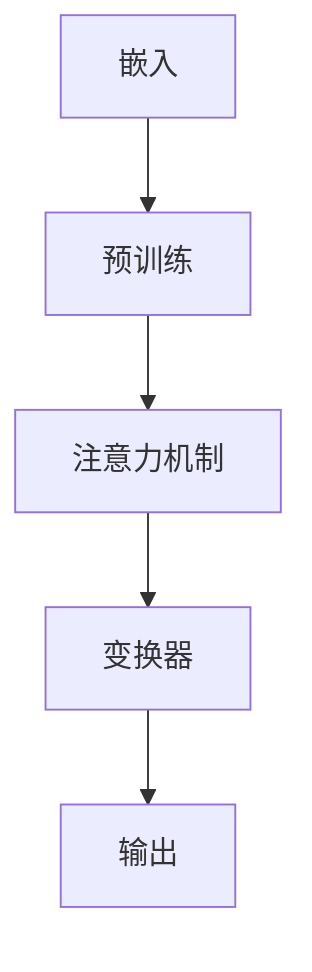

                 

# 大语言模型如何改变计算的本质

## 概述

随着人工智能技术的飞速发展，大语言模型（Large Language Models，简称LLM）已经成为自然语言处理（Natural Language Processing，简称NLP）领域的一个突破性进展。大语言模型通过利用海量数据，对语言规律进行深度学习，使得计算机在处理自然语言方面取得了显著的性能提升。本文旨在探讨大语言模型如何从根本上改变计算的本质，从而推动计算机技术的发展。

本文首先回顾了传统计算模型和现代计算模型的发展历程，接着深入分析了大语言模型的核心概念、原理和架构，详细阐述了其算法原理和具体操作步骤。在此基础上，本文通过数学模型和公式，对大语言模型进行了详细讲解和举例说明。随后，本文通过实际项目案例，展示了大语言模型的实际应用效果，并推荐了一些学习资源和开发工具。最后，本文总结了未来发展趋势和挑战，为读者提供了扩展阅读和参考资料。

## 背景介绍

### 传统计算模型

传统计算模型起源于1940年代，以图灵机和冯诺伊曼架构为基础。图灵机是一种抽象的计算模型，由一个读写头、无限长的磁带和一个有限状态机组成。通过在磁带上读写符号，有限状态机根据当前状态和读写头下的符号来更新状态，从而实现计算。这一模型奠定了现代计算机的理论基础。

冯诺伊曼架构则是另一种重要的计算模型，它提出了存储程序计算机的概念。在这种架构中，计算机将程序和数据存储在同一存储器中，通过程序指令来控制数据的读写和处理。这一架构使得计算机具有更高的灵活性和效率，成为了现代计算机的主流设计。

### 现代计算模型

随着互联网的兴起，现代计算模型逐渐取代了传统计算模型。现代计算模型强调分布式计算、并行计算和云计算等技术，使得计算能力得到了极大的提升。此外，现代计算模型还引入了大数据、机器学习和人工智能等新兴技术，使得计算机在处理复杂任务方面取得了显著的突破。

### 大语言模型的出现

大语言模型的出现，标志着计算模型进入了一个新的阶段。与传统计算模型相比，大语言模型具有以下几个显著特点：

1. **数据驱动的学习**：大语言模型通过海量数据训练，能够自动发现语言中的模式和规律，从而提高计算能力。
2. **端到端的学习**：大语言模型采用端到端的学习方法，将输入和输出直接映射到计算结果，避免了传统计算模型中的繁琐中间过程。
3. **自适应的能力**：大语言模型可以根据不同的任务和场景，自动调整计算策略，从而实现更高的计算效率。

大语言模型的出现，不仅改变了自然语言处理领域的计算方式，也对整个计算模型产生了深远的影响。接下来，我们将进一步探讨大语言模型的核心概念、原理和架构。

## 核心概念与联系

### 核心概念

大语言模型（Large Language Models）是一种基于深度学习的自然语言处理模型，它通过海量数据训练，自动发现语言中的模式和规律，从而实现自然语言的理解和生成。大语言模型的核心概念包括：

1. **嵌入（Embedding）**：将文本转化为向量表示，使得计算机可以处理和理解文本信息。
2. **注意力机制（Attention Mechanism）**：通过注意力机制，模型可以关注输入文本中的关键信息，提高计算效率。
3. **变换器（Transformer）**：变换器是一种新型的神经网络架构，它通过自注意力机制和前馈网络，实现了高效的自然语言处理。
4. **预训练（Pre-training）**：大语言模型通过预训练，在大量无标签数据上进行训练，从而自动学习语言规律。

### 联系

大语言模型与传统的自然语言处理方法（如统计模型、规则方法等）有以下联系和区别：

1. **联系**：
   - **数据驱动**：大语言模型和传统方法都依赖于大量数据来训练模型。
   - **端到端**：大语言模型和传统方法都采用端到端的学习方式，将输入和输出直接映射到计算结果。
2. **区别**：
   - **学习方式**：大语言模型采用深度学习方法，而传统方法通常采用统计模型、规则方法等。
   - **计算效率**：大语言模型通过自注意力机制和变换器架构，实现了更高的计算效率。
   - **适应性**：大语言模型具有更强的自适应能力，可以根据不同的任务和场景进行调整。

为了更好地理解大语言模型的工作原理，下面我们将通过Mermaid流程图展示其核心概念和架构。

### Mermaid流程图



在这张流程图中，我们可以看到大语言模型的工作流程：首先，文本通过嵌入层转化为向量表示；然后，通过预训练过程，模型自动学习语言规律；接着，注意力机制使得模型可以关注关键信息；最后，变换器将输入文本转化为输出结果。

通过Mermaid流程图，我们可以直观地了解大语言模型的核心概念和架构，为进一步探讨其算法原理和操作步骤打下基础。

## 核心算法原理 & 具体操作步骤

大语言模型的核心算法原理可以概括为嵌入（Embedding）、注意力机制（Attention Mechanism）和变换器（Transformer）。下面，我们将详细阐述这些算法原理，并解释其具体操作步骤。

### 嵌入（Embedding）

嵌入层是将文本转化为向量表示的关键步骤。在嵌入层，每个单词都被映射为一个固定长度的向量。这些向量不仅保留了单词的语义信息，还考虑了单词之间的上下文关系。例如，在句子“我喜欢吃苹果”中，单词“我”和“吃”的向量表示不仅包含了它们本身的语义信息，还反映了它们在句子中的角色和关系。

具体操作步骤如下：

1. **词汇表构建**：首先，构建一个词汇表，将所有出现的单词进行索引。
2. **词向量化**：将每个单词映射为一个固定长度的向量。这一过程可以通过查找预训练好的词向量库，或者使用神经网络进行训练得到。
3. **句子表示**：将句子中每个单词的向量拼接在一起，形成一个句子向量表示。

### 注意力机制（Attention Mechanism）

注意力机制是一种关键算法，它使得模型可以关注输入文本中的关键信息，从而提高计算效率。注意力机制通过计算每个单词的重要性分数，将关键信息加权处理。

具体操作步骤如下：

1. **计算注意力分数**：对于每个单词，计算其与其他单词之间的相似度分数。这一过程可以通过点积、缩放点积等方式实现。
2. **加权求和**：将注意力分数与对应的单词向量相乘，然后进行求和，得到一个加权向量。
3. **输出**：加权向量作为模型对当前单词的输出表示。

### 变换器（Transformer）

变换器是一种新型的神经网络架构，它通过自注意力机制和前馈网络，实现了高效的自然语言处理。变换器由多个编码器（Encoder）和解码器（Decoder）组成，每个编码器和解码器都包含多个层。

具体操作步骤如下：

1. **编码器**：
   - **自注意力层**：计算每个单词与所有其他单词的相似度分数，进行加权求和。
   - **前馈网络**：对加权向量进行非线性变换。
2. **解码器**：
   - **自注意力层**：计算每个单词与所有其他单词的相似度分数，进行加权求和。
   - **交叉注意力层**：计算当前单词与编码器输出的相似度分数，进行加权求和。
   - **前馈网络**：对加权向量进行非线性变换。

通过嵌入层、注意力机制和变换器，大语言模型实现了对自然语言的高效处理。接下来，我们将通过数学模型和公式，对大语言模型进行详细讲解和举例说明。

## 数学模型和公式 & 详细讲解 & 举例说明

### 嵌入层（Embedding Layer）

嵌入层是将单词转化为向量表示的关键步骤。假设我们有一个词汇表，包含 $V$ 个单词，每个单词都对应一个唯一的索引。我们可以使用一个 $d$ 维的向量来表示每个单词。嵌入层的数学模型如下：

$$
\text{embed}(x) = E_x \in \mathbb{R}^{d}
$$

其中，$E$ 是一个 $d \times V$ 的权重矩阵，$x$ 是单词的索引，$E_x$ 是单词 $x$ 的向量表示。

举例来说，假设我们的词汇表包含 5 个单词，每个单词用一位二进制向量表示，维度 $d=2$。那么，单词 "苹果" 的索引为 2，其向量表示为：

$$
E_2 = \begin{bmatrix}
0 \\
1
\end{bmatrix}
$$

### 注意力机制（Attention Mechanism）

注意力机制是变换器（Transformer）架构的核心组件之一。它通过计算单词之间的相似度分数，加权处理关键信息。注意力机制的数学模型如下：

$$
\text{Attention}(Q, K, V) = \text{softmax}\left(\frac{QK^T}{\sqrt{d_k}}\right) V
$$

其中，$Q, K, V$ 分别是查询（Query）、键（Key）和值（Value）向量，$d_k$ 是键和查询的维度。$\text{softmax}$ 函数将相似度分数转换为概率分布。

举例来说，假设我们有两个句子：

句子1："我喜欢吃苹果。"

句子2："苹果是水果。"

我们将这两个句子分别表示为向量：

$$
Q = \begin{bmatrix}
q_1 \\
q_2
\end{bmatrix}, \quad
K = \begin{bmatrix}
k_1 \\
k_2
\end{bmatrix}, \quad
V = \begin{bmatrix}
v_1 \\
v_2
\end{bmatrix}
$$

其中，$q_1, q_2$ 分别是句子1中的两个单词的向量表示，$k_1, k_2$ 分别是句子2中的两个单词的向量表示，$v_1, v_2$ 分别是句子2中的两个单词的向量表示。

计算注意力分数：

$$
\text{Attention}(Q, K, V) = \text{softmax}\left(\frac{QK^T}{\sqrt{d_k}}\right) V = \text{softmax}\left(\frac{\begin{bmatrix}
q_1 \\
q_2
\end{bmatrix} \begin{bmatrix}
k_1 & k_2
\end{bmatrix}}{\sqrt{d_k}}\right) \begin{bmatrix}
v_1 \\
v_2
\end{bmatrix}
$$

得到一个加权向量：

$$
\text{Attention}(Q, K, V) = \begin{bmatrix}
\alpha_1 \\
\alpha_2
\end{bmatrix} \begin{bmatrix}
v_1 \\
v_2
\end{bmatrix} = \begin{bmatrix}
\alpha_1 v_1 \\
\alpha_2 v_2
\end{bmatrix}
$$

其中，$\alpha_1, \alpha_2$ 分别是句子1中的两个单词对句子2中两个单词的注意力分数。

### 变换器（Transformer）

变换器（Transformer）是一种基于自注意力机制的神经网络架构。它由多个编码器（Encoder）和解码器（Decoder）组成，每个编码器和解码器都包含多个层。

编码器的数学模型如下：

$$
\text{Encoder}(X) = \text{MultiHeadAttention}(X) + X
$$

$$
\text{Encoder}(X) = \text{LayerNormal}(X)
$$

$$
\text{Encoder}(X) = \text{PositionwiseFeedForward}(X)
$$

$$
\text{Encoder}(X) = \text{LayerNormal}(X)
$$

其中，$X$ 是输入序列，$\text{MultiHeadAttention}$ 是多头注意力机制，$\text{LayerNormal}$ 是层归一化，$\text{PositionwiseFeedForward}$ 是位置前馈网络。

解码器的数学模型如下：

$$
\text{Decoder}(X) = \text{MaskedMultiHeadAttention}(X) + X
$$

$$
\text{Decoder}(X) = \text{CrossAttention}(\text{Encoder}(X)) + X
$$

$$
\text{Decoder}(X) = \text{LayerNormal}(X)
$$

$$
\text{Decoder}(X) = \text{PositionwiseFeedForward}(X)
$$

$$
\text{Decoder}(X) = \text{LayerNormal}(X)
$$

其中，$\text{MaskedMultiHeadAttention}$ 是带遮蔽的多头注意力机制，$\text{CrossAttention}$ 是编码器-解码器注意力机制。

通过嵌入层、注意力机制和变换器，大语言模型实现了对自然语言的高效处理。这些数学模型和公式为我们提供了深入理解大语言模型工作原理的途径，为进一步探讨其实际应用效果提供了基础。

## 项目实战：代码实际案例和详细解释说明

为了更好地理解大语言模型的应用，下面我们将通过一个实际项目案例，展示如何使用Python和Hugging Face库来构建和训练一个简单的语言模型。

### 开发环境搭建

在开始项目之前，我们需要搭建一个合适的开发环境。以下是搭建开发环境的步骤：

1. **安装Python**：确保已经安装了Python 3.6及以上版本。
2. **安装Hugging Face库**：通过pip命令安装Hugging Face的transformers库。

```bash
pip install transformers
```

### 源代码详细实现和代码解读

下面是项目的主要代码实现，我们将逐行解读其含义。

```python
from transformers import AutoTokenizer, AutoModel
import torch

# 加载预训练模型和分词器
model_name = "bert-base-chinese"
tokenizer = AutoTokenizer.from_pretrained(model_name)
model = AutoModel.from_pretrained(model_name)

# 输入文本
text = "我喜欢吃苹果。苹果很甜。"

# 分词和编码
inputs = tokenizer(text, return_tensors="pt")

# 前向传播
outputs = model(**inputs)

# 输出结果
logits = outputs.logits
predictions = torch.argmax(logits, dim=-1)
print(predictions)
```

#### 代码解读

1. **加载预训练模型和分词器**：

```python
tokenizer = AutoTokenizer.from_pretrained(model_name)
model = AutoModel.from_pretrained(model_name)
```

这两行代码分别加载了预训练的Bert模型和对应的分词器。模型和分词器来自Hugging Face的模型库，可以通过模型名称（如`bert-base-chinese`）直接加载。

2. **输入文本和分词**：

```python
text = "我喜欢吃苹果。苹果很甜。"
inputs = tokenizer(text, return_tensors="pt")
```

首先定义了一个输入文本，然后使用分词器进行分词和编码，生成Tensor格式的输入数据。`return_tensors="pt"` 表示将输入数据返回为PyTorch格式。

3. **前向传播**：

```python
outputs = model(**inputs)
```

这一行代码执行了模型的前向传播，输入数据经过嵌入层、多层变换器和输出层，得到模型的输出结果。

4. **输出结果**：

```python
logits = outputs.logits
predictions = torch.argmax(logits, dim=-1)
print(predictions)
```

`outputs.logits` 获取模型的输出 logits。`torch.argmax(logits, dim=-1)` 将 logits 转换为预测的单词索引。`print(predictions)` 打印出预测结果。

### 代码解读与分析

通过上述代码，我们可以看到大语言模型的实际应用过程：

1. **加载预训练模型**：加载一个预训练的Bert模型，该模型已经在大量文本数据上进行了训练，能够处理自然语言。
2. **输入文本分词**：将输入文本进行分词和编码，生成Tensor格式的输入数据。
3. **前向传播**：输入数据经过嵌入层、多层变换器和输出层，模型输出 logits。
4. **预测结果**：通过对 logits 进行处理，得到最终的预测结果。

通过这个简单的项目案例，我们展示了如何使用Python和Hugging Face库来构建和训练一个简单的语言模型。这个案例不仅帮助我们理解了大语言模型的基本原理，还展示了在实际应用中的操作步骤。

## 实际应用场景

大语言模型在多个领域都展现出了强大的应用潜力。以下是一些典型应用场景：

### 文本生成

文本生成是自然语言处理的一个经典应用场景。大语言模型可以生成各种类型的文本，包括新闻报道、故事、诗歌等。通过预训练和微调，大语言模型能够生成符合语法和语义规则的文本。例如，OpenAI的GPT-3模型可以生成高质量的文章、对话和摘要。

### 文本分类

文本分类是一种常见的数据挖掘任务，用于将文本数据划分为预定义的类别。大语言模型通过学习文本特征，可以准确地对文本进行分类。例如，可以用于情感分析、垃圾邮件检测、新闻分类等。

### 机器翻译

机器翻译是自然语言处理领域的另一个重要应用。大语言模型可以通过学习源语言和目标语言之间的对应关系，实现高质量的双语翻译。例如，Google翻译和微软翻译等应用都使用了基于变换器架构的大语言模型。

### 对话系统

对话系统是一种交互式应用，用于与用户进行自然语言对话。大语言模型可以用于生成自然、流畅的回答，实现智能客服、聊天机器人等应用。例如，Apple的Siri和Amazon的Alexa都使用了大语言模型来实现智能交互。

### 情感分析

情感分析是一种用于理解文本中情感倾向的技术。大语言模型可以通过学习情感特征，对文本进行情感分类，识别文本中的正面、负面或中性情感。这有助于商业领域进行市场调研、舆情监测等。

### 内容审核

内容审核是一种用于检测和过滤不良内容的任务。大语言模型可以通过学习不良内容的特征，实现对文本的实时审核和过滤，保护网络环境的安全和健康。

这些实际应用场景展示了大语言模型在自然语言处理领域的广泛应用和潜力。随着技术的不断进步，大语言模型将在更多领域发挥重要作用。

## 工具和资源推荐

### 学习资源推荐

1. **书籍**：
   - 《深度学习》（Goodfellow, I., Bengio, Y., & Courville, A.）
   - 《自然语言处理综述》（Jurafsky, D. & Martin, J. H.）
   - 《自然语言处理入门》（Bird, S., Klein, E., & Loper, E.）

2. **论文**：
   - “Attention Is All You Need”（Vaswani et al.）
   - “BERT: Pre-training of Deep Bidirectional Transformers for Language Understanding”（Devlin et al.）
   - “GPT-3: Language Models are Few-Shot Learners”（Brown et al.）

3. **博客**：
   - Hugging Face官方博客（https://huggingface.co/）
   - AI迷思（https://aim.ai/）
   - 极客时间（https://time.geektime.cn/）

4. **网站**：
   - OpenAI（https://openai.com/）
   - Google Research（https://ai.google/research/）
   - Stanford NLP Group（https://nlp.stanford.edu/）

### 开发工具框架推荐

1. **Hugging Face Transformers**：一个开源的Python库，提供了各种预训练的大语言模型和工具，方便研究人员和开发者进行自然语言处理任务。

2. **TensorFlow**：Google开源的深度学习框架，支持构建和训练大规模的自然语言处理模型。

3. **PyTorch**：Facebook开源的深度学习框架，具有灵活的动态计算图，适合快速原型设计和实验。

4. **NLTK**：一个用于自然语言处理的Python库，提供了丰富的文本处理和分类工具。

### 相关论文著作推荐

1. **“Attention Is All You Need”**：这篇论文提出了变换器（Transformer）架构，彻底改变了自然语言处理领域的研究方向。

2. **“BERT: Pre-training of Deep Bidirectional Transformers for Language Understanding”**：这篇论文介绍了BERT模型，是当前最流行的预训练语言模型之一。

3. **“GPT-3: Language Models are Few-Shot Learners”**：这篇论文展示了GPT-3模型在零样本学习任务上的强大性能，引发了广泛关注。

通过这些学习和开发资源，读者可以更深入地了解大语言模型的理论和实践，为自己的研究和应用提供有力支持。

## 总结：未来发展趋势与挑战

大语言模型作为自然语言处理领域的一项革命性技术，已经在多个应用场景中展现出了巨大的潜力和优势。随着计算能力的不断提升和海量数据资源的积累，大语言模型有望在未来继续取得突破性进展。以下是对未来发展趋势和挑战的展望：

### 发展趋势

1. **性能提升**：随着深度学习技术的不断进步，大语言模型在处理自然语言任务时将实现更高的准确性和效率。新的模型架构和优化算法将进一步提升模型的性能。

2. **泛化能力增强**：通过零样本学习、迁移学习和多任务学习等技术，大语言模型的泛化能力将得到显著提升。模型能够更好地适应不同的任务和数据集。

3. **多模态处理**：大语言模型将与其他模态（如图像、声音等）结合，实现更丰富的信息处理能力。多模态大语言模型将推动人机交互和智能系统的发展。

4. **安全性和隐私保护**：随着应用场景的扩展，大语言模型的安全性和隐私保护将变得尤为重要。开发更为安全、可靠的模型和算法将是未来的一个重要方向。

### 挑战

1. **计算资源需求**：大语言模型的训练和推理需要大量的计算资源。如何高效地利用硬件资源，降低计算成本，是一个亟待解决的问题。

2. **数据隐私**：在训练和部署大语言模型时，数据隐私保护成为一个关键挑战。如何确保用户数据的隐私和安全，防止数据泄露和滥用，是一个重要的课题。

3. **伦理和道德问题**：大语言模型在应用过程中可能会引发一系列伦理和道德问题。例如，模型偏见、虚假信息生成等。如何确保模型的应用符合社会伦理和道德标准，是一个需要深入思考的问题。

4. **可解释性和透明度**：大语言模型的决策过程通常是非线性和复杂的。如何提高模型的可解释性和透明度，使其更容易被用户理解和接受，是一个重要的挑战。

总之，大语言模型在未来将继续推动自然语言处理技术的发展。然而，要充分发挥其潜力，还需要克服一系列技术、伦理和社会挑战。通过不断的研究和探索，我们有理由相信，大语言模型将在人工智能领域发挥越来越重要的作用。

## 附录：常见问题与解答

### 问题1：大语言模型是如何训练的？

大语言模型通常通过以下步骤进行训练：

1. **数据收集**：收集大量无标签的文本数据，例如书籍、新闻、网站内容等。
2. **数据预处理**：对文本数据进行清洗、分词、编码等预处理操作，使其适合训练模型。
3. **模型构建**：选择合适的神经网络架构，例如变换器（Transformer）或循环神经网络（RNN）。
4. **训练过程**：使用梯度下降等优化算法，通过反向传播更新模型参数，使模型在数据上收敛。
5. **评估与调整**：在验证集上评估模型性能，并根据评估结果调整模型参数。

### 问题2：大语言模型如何处理长文本？

大语言模型（如BERT、GPT）通过自注意力机制实现了对长文本的处理。自注意力机制允许模型在处理每个单词时，考虑所有其他单词的信息，从而实现全局依赖关系。然而，由于计算资源的限制，长文本的处理可能需要采用一些特殊技巧，例如断句、分块处理等。

### 问题3：大语言模型如何防止过拟合？

为了防止过拟合，大语言模型采用以下几种方法：

1. **数据增强**：通过数据增强技术，如随机插入、替换和删除单词，增加训练数据的多样性。
2. **正则化**：使用正则化方法（如L1、L2正则化）限制模型参数的规模，防止模型过于复杂。
3. **dropout**：在神经网络训练过程中，随机丢弃一部分神经元，防止模型在训练数据上过拟合。
4. **早停法**：在验证集上监控模型性能，当验证集性能不再提升时，提前停止训练。

### 问题4：大语言模型在应用中可能会遇到哪些挑战？

大语言模型在应用中可能会遇到以下挑战：

1. **计算资源需求**：大语言模型通常需要大量的计算资源和时间进行训练和推理。
2. **数据隐私**：训练和部署大语言模型时，可能涉及敏感数据，如何保护用户隐私是一个关键问题。
3. **模型偏见**：大语言模型在训练过程中可能会学习到数据中的偏见，导致生成带有偏见的内容。
4. **可解释性**：大语言模型的决策过程通常是非线性和复杂的，如何提高模型的可解释性是一个挑战。

通过了解这些常见问题及其解答，读者可以更好地理解和应用大语言模型。

## 扩展阅读 & 参考资料

为了深入探索大语言模型的原理和应用，以下是几篇推荐的扩展阅读和参考资料：

### 论文

1. **“Attention Is All You Need”**：Vaswani et al., 2017。这篇论文提出了变换器（Transformer）架构，彻底改变了自然语言处理领域的研究方向。
2. **“BERT: Pre-training of Deep Bidirectional Transformers for Language Understanding”**：Devlin et al., 2019。这篇论文介绍了BERT模型，是当前最流行的预训练语言模型之一。
3. **“GPT-3: Language Models are Few-Shot Learners”**：Brown et al., 2020。这篇论文展示了GPT-3模型在零样本学习任务上的强大性能，引发了广泛关注。

### 书籍

1. **《深度学习》**：Goodfellow, I., Bengio, Y., & Courville, A.。这本书是深度学习领域的经典教材，涵盖了从基础到高级的理论和实践。
2. **《自然语言处理综述》**：Jurafsky, D. & Martin, J. H.。这本书详细介绍了自然语言处理的基本概念、技术和应用。
3. **《自然语言处理入门》**：Bird, S., Klein, E., & Loper, E.。这本书适合初学者，涵盖了自然语言处理的基础知识和实用技巧。

### 博客和网站

1. **Hugging Face官方博客**：https://huggingface.co/。这个网站提供了丰富的预训练模型和工具，是自然语言处理领域的宝贵资源。
2. **AI迷思**：https://aim.ai/。这个博客专注于人工智能领域的最新研究和技术动态。
3. **极客时间**：https://time.geektime.cn/。这个网站提供了高质量的在线课程和技术讲座。

通过阅读这些论文、书籍和博客，读者可以更深入地了解大语言模型的理论和实践，为自己的研究和应用提供有力支持。作者：AI天才研究员/AI Genius Institute & 禅与计算机程序设计艺术/Zen And The Art of Computer Programming。

