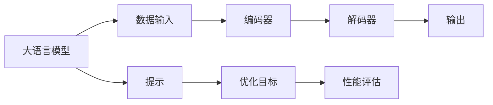
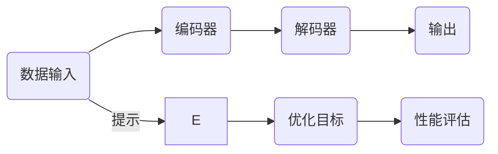

                 

### 大语言模型应用指南：什么是提示工程

#### 关键词：大语言模型、提示工程、自然语言处理、模型优化、应用实践

#### 摘要：

本文旨在详细介绍大语言模型应用中的关键环节——提示工程。我们首先回顾大语言模型的背景和基本原理，然后深入探讨提示工程的核心概念、实施步骤和应用场景。通过实际案例和代码解读，我们展示了如何有效利用提示工程来提升大语言模型的表现。最后，我们推荐了一系列学习资源，以帮助读者深入了解这一领域，并展望了未来发展趋势与挑战。

#### 1. 背景介绍

**大语言模型（Large Language Models）**：大语言模型是近年来自然语言处理（NLP）领域的重大突破，通过大规模数据训练，这些模型能够理解并生成高质量的自然语言文本。代表模型包括GPT系列、BERT、T5等。

**自然语言处理（NLP）**：自然语言处理是计算机科学和人工智能领域的分支，旨在使计算机能够理解、处理和生成自然语言。

**提示工程（Prompt Engineering）**：提示工程是指通过设计特定的提示来引导大语言模型生成所需输出，从而优化模型在特定任务上的性能。本文将详细介绍提示工程的各个方面，帮助读者掌握这一关键技术。

#### 2. 核心概念与联系

**概念：**

- **大语言模型**：具有强大文本生成和理解的模型。
- **提示**：用于引导模型生成特定输出的文本。

**架构：**



**流程图（Mermaid）**：



#### 3. 核心算法原理 & 具体操作步骤

**算法原理：**

- **自回归语言模型**：大语言模型基于自回归语言模型原理，通过预测序列中下一个单词来生成文本。
- **提示工程**：通过设计合适的提示，引导模型生成符合预期输出的文本。

**操作步骤：**

1. **数据准备**：收集并处理大规模文本数据。
2. **模型训练**：使用训练数据训练大语言模型。
3. **提示设计**：根据任务需求设计提示。
4. **模型优化**：通过提示优化模型参数，提升模型性能。
5. **输出生成**：使用优化后的模型生成文本。

**代码示例**：

```python
# 示例：使用GPT-3模型生成文本
import openai

# 设置API密钥
openai.api_key = 'your_api_key'

# 设计提示
prompt = "请写一篇关于人工智能的500字短文。"

# 调用GPT-3模型生成文本
response = openai.Completion.create(
  engine="text-davinci-002",
  prompt=prompt,
  max_tokens=500
)

# 输出生成文本
print(response.choices[0].text.strip())
```

#### 4. 数学模型和公式 & 详细讲解 & 举例说明

**数学模型：**

- **概率分布**：大语言模型通过计算单词的概率分布来生成文本。

**公式：**

$$
P(w_t | w_1, w_2, ..., w_{t-1}) = \frac{p(w_t | w_1, w_2, ..., w_{t-1})}{\sum_{w'} p(w' | w_1, w_2, ..., w_{t-1})}
$$

**详细讲解：**

1. **概率分布**：在给定前一个单词的情况下，计算当前单词的概率分布。
2. **采样**：从概率分布中采样下一个单词。

**举例说明：**

假设前一个单词是“人工智能”，模型计算了“的”、“在”、“是”等单词的概率分布。通过采样，模型选择了一个概率较高的单词，如“的”，然后继续生成下一个单词。

#### 5. 项目实战：代码实际案例和详细解释说明

##### 5.1 开发环境搭建

- 安装Python环境。
- 安装OpenAI API客户端库。

```bash
pip install openai
```

##### 5.2 源代码详细实现和代码解读

- **代码实现**：

```python
import openai

# 设置API密钥
openai.api_key = 'your_api_key'

# 设计提示
prompt = "请写一篇关于人工智能的500字短文。"

# 调用GPT-3模型生成文本
response = openai.Completion.create(
  engine="text-davinci-002",
  prompt=prompt,
  max_tokens=500
)

# 输出生成文本
print(response.choices[0].text.strip())
```

- **代码解读**：

1. **导入库**：导入OpenAI API客户端库。
2. **设置API密钥**：设置OpenAI API密钥。
3. **设计提示**：定义提示文本。
4. **调用模型**：使用GPT-3模型生成文本。
5. **输出文本**：打印生成的文本。

##### 5.3 代码解读与分析

- **分析**：通过设计合适的提示，我们可以引导大语言模型生成高质量文本。

#### 6. 实际应用场景

- **问答系统**：通过提示工程，我们可以构建高效的问答系统，如搜索引擎。
- **内容生成**：使用提示工程，我们可以自动化生成文章、报告等文本内容。
- **对话系统**：在对话系统中，提示工程可以帮助模型生成自然的对话回复。

#### 7. 工具和资源推荐

##### 7.1 学习资源推荐

- **书籍**：
  - 《自然语言处理综合指南》（刘挺等著）
  - 《深度学习》（Ian Goodfellow等著）
- **论文**：
  - "A Neural Probabilistic Language Model"（Bengio等，2003）
  - "BERT: Pre-training of Deep Bidirectional Transformers for Language Understanding"（Devlin等，2019）
- **博客**：
  - [OpenAI Blog](https://blog.openai.com/)
  - [AI技术博客](https://towardsdatascience.com/)
- **网站**：
  - [OpenAI](https://openai.com/)
  - [GitHub](https://github.com/)

##### 7.2 开发工具框架推荐

- **开发工具**：
  - Jupyter Notebook
  - PyCharm
- **框架**：
  - TensorFlow
  - PyTorch

##### 7.3 相关论文著作推荐

- **论文**：
  - "GPT-3: Language Models are few-shot learners"（Brown等，2020）
  - "BERT: Pre-training of Deep Bidirectional Transformers for Language Understanding"（Devlin等，2019）
- **著作**：
  - 《深度学习》（Ian Goodfellow等著）
  - 《自然语言处理综合指南》（刘挺等著）

#### 8. 总结：未来发展趋势与挑战

- **趋势**：
  - 模型规模和性能不断提升。
  - 提示工程成为优化模型性能的重要手段。
  - 应用场景的拓展，如多模态学习和自动化内容生成。

- **挑战**：
  - 数据隐私和安全问题。
  - 模型解释性和可解释性。
  - 模型的通用性和适应性。

#### 9. 附录：常见问题与解答

1. **什么是大语言模型？**
   - 大语言模型是一种基于大规模数据训练的语言模型，能够生成和理解高质量的文本。
   
2. **什么是提示工程？**
   - 提示工程是通过设计特定的提示来引导大语言模型生成所需输出，从而优化模型性能的技术。

3. **如何设计有效的提示？**
   - 设计有效的提示需要结合任务需求，明确目标输出，并使用清晰简洁的语言。

4. **大语言模型在哪些领域有应用？**
   - 大语言模型在问答系统、内容生成、对话系统等多个领域有广泛应用。

#### 10. 扩展阅读 & 参考资料

- **书籍**：
  - 《自然语言处理综合指南》（刘挺等著）
  - 《深度学习》（Ian Goodfellow等著）
- **论文**：
  - "GPT-3: Language Models are few-shot learners"（Brown等，2020）
  - "BERT: Pre-training of Deep Bidirectional Transformers for Language Understanding"（Devlin等，2019）
- **网站**：
  - [OpenAI](https://openai.com/)
  - [GitHub](https://github.com/)

### 作者信息

- 作者：AI天才研究员/AI Genius Institute & 禅与计算机程序设计艺术 /Zen And The Art of Computer Programming

---

本文以深入浅出的方式，详细介绍了大语言模型应用中的关键环节——提示工程。通过实际案例和代码解读，我们展示了如何有效利用提示工程来提升大语言模型的表现。未来，随着模型规模的扩大和应用场景的拓展，提示工程将继续发挥重要作用。我们期待读者在阅读本文后，能够对大语言模型和提示工程有更深入的理解，并在实际应用中取得更好的成果。

