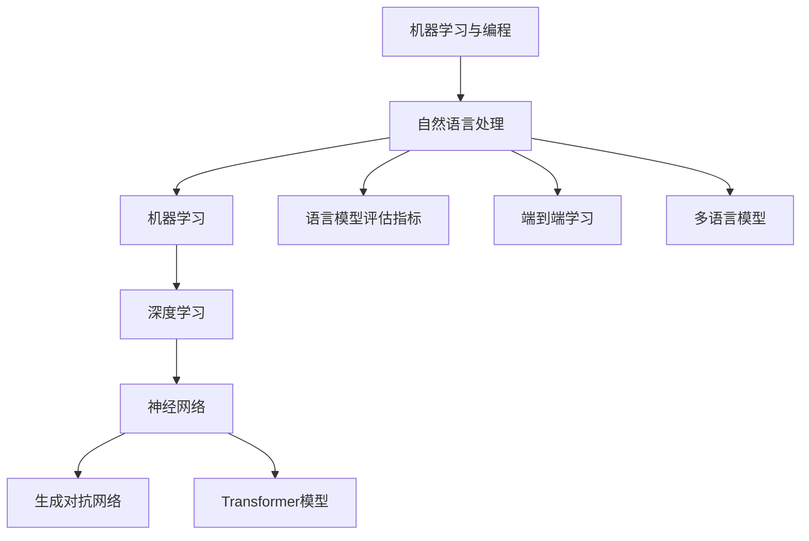

                 

### 背景介绍

#### 什么是大语言模型？

大语言模型，也被称为大规模语言模型（Large-scale Language Models），是一种通过深度学习和神经网络技术构建的复杂算法，用于理解和生成自然语言。这种模型在近年来取得了显著的进展，已经成为自然语言处理（Natural Language Processing, NLP）领域的一个重要分支。最著名的例子包括OpenAI的GPT系列模型和Google的BERT模型。

大语言模型的工作原理是基于大量的文本数据进行训练，从而学习语言的规律和结构。这些模型通过分析文本中的词频、语法结构、上下文关系等信息，逐渐掌握语言的复杂性和多样性。训练完成后，模型可以用于多种应用场景，如文本分类、情感分析、机器翻译、问答系统等。

#### 机器学习的基本概念

要理解大语言模型，首先需要了解机器学习（Machine Learning）的基本概念。机器学习是一种人工智能（Artificial Intelligence, AI）的分支，通过构建和分析算法，使计算机系统能够从数据中学习，并进行预测和决策。

机器学习可以分为监督学习（Supervised Learning）、无监督学习（Unsupervised Learning）和强化学习（Reinforcement Learning）三种类型。监督学习是机器学习中最常见的一种类型，它通过已标记的数据来训练模型，从而使其能够对新数据进行预测。无监督学习则不使用标记数据，而是通过分析数据本身的分布和模式来发现隐藏的结构。强化学习则是在特定的环境中，通过试错和反馈来学习最优策略。

#### 机器学习在自然语言处理中的应用

机器学习在自然语言处理中有着广泛的应用。自然语言处理是指使计算机能够理解和处理人类自然语言的技术。机器学习在这方面的主要任务是构建能够理解和生成自然语言的模型。大语言模型正是基于机器学习技术，通过对大量文本数据的学习，实现了对自然语言的高效理解和生成。

#### 大语言模型的发展历程

大语言模型的发展可以追溯到20世纪80年代，当时出现了最早的统计语言模型。随着计算能力的提升和深度学习技术的发展，大语言模型逐渐取得了突破性的进展。2018年，OpenAI发布了GPT模型，该模型在多项自然语言处理任务上取得了优异的性能。此后，GPT系列模型不断迭代更新，性能和规模不断提升。与此同时，BERT模型等新的语言模型也在不断涌现，为自然语言处理领域带来了新的突破。

#### 大语言模型的应用领域

大语言模型在多个领域都展现出了强大的应用潜力。在语言翻译方面，大语言模型可以用于机器翻译，如Google翻译、百度翻译等。在问答系统方面，大语言模型可以用于构建智能客服、智能问答系统等。在文本生成方面，大语言模型可以用于文章写作、内容创作等。此外，大语言模型还可以用于情感分析、文本分类、信息检索等多种应用场景。

#### 机器学习在计算机编程中的应用

除了在自然语言处理领域，机器学习还在计算机编程中发挥着重要作用。通过机器学习，计算机程序可以自动从大量的代码库中学习编程技巧，从而提高开发效率。例如，智能代码补全工具、代码审查工具等都是基于机器学习技术开发的。此外，机器学习还可以用于自动化测试、代码质量检测等多种编程相关的任务。

总之，大语言模型和机器学习在自然语言处理和计算机编程领域都展现出了巨大的应用潜力。随着技术的不断进步，我们有理由相信，大语言模型和机器学习将会在更多领域发挥重要作用。接下来，我们将深入探讨大语言模型的核心概念和算法原理，以更好地理解其工作方式和应用场景。

---

### 核心概念与联系

#### 1. 自然语言处理（NLP）

自然语言处理（Natural Language Processing, NLP）是人工智能（AI）的一个重要分支，旨在使计算机能够理解、解释和生成人类语言。NLP涵盖了许多子领域，包括文本分类、情感分析、命名实体识别、机器翻译等。大语言模型在NLP中扮演了关键角色，它通过学习大量的文本数据来理解和生成自然语言。

**自然语言处理的组成部分：**
- **文本表示**：将自然语言文本转换为计算机可以处理的格式，如词向量、嵌入向量等。
- **语义理解**：理解文本的含义和上下文，包括词义消歧、句法分析等。
- **语言生成**：生成符合语法和语义的自然语言文本。

**NLP与机器学习的联系：** NLP的任务通常需要大量的标注数据来进行训练，而机器学习算法则能够从这些数据中学习，从而提高模型的性能。

#### 2. 机器学习（ML）

机器学习（Machine Learning, ML）是构建在统计学和数据科学基础上的技术，旨在使计算机系统能够从数据中学习，进行预测和决策。机器学习算法可以分为监督学习、无监督学习和强化学习三种类型。

**机器学习的组成部分：**
- **数据预处理**：清洗、转换和归一化数据，以便于模型训练。
- **模型选择**：选择合适的模型结构，如神经网络、决策树、支持向量机等。
- **模型训练**：使用训练数据对模型进行优化，以提高预测准确性。
- **模型评估**：评估模型的性能，包括准确率、召回率、F1分数等。

**机器学习与大语言模型的联系：** 大语言模型是一种特殊的机器学习模型，它通过深度学习和神经网络技术，对大量文本数据进行训练，以理解和生成自然语言。

#### 3. 深度学习（DL）

深度学习（Deep Learning, DL）是一种基于多层神经网络的机器学习技术。与传统的机器学习算法相比，深度学习能够自动从大量数据中提取复杂特征，从而实现更高的预测准确性。

**深度学习的组成部分：**
- **神经网络**：由多个层次组成的计算模型，包括输入层、隐藏层和输出层。
- **激活函数**：用于引入非线性特性，使神经网络能够处理复杂问题。
- **损失函数**：用于评估模型预测结果与真实值之间的差异，并指导模型优化。

**深度学习与大语言模型的联系：** 大语言模型通常基于深度学习技术构建，它通过多层神经网络来学习和表示语言数据，从而实现高效的文本理解和生成。

#### 4. 神经网络（NN）

神经网络（Neural Network, NN）是一种模仿人脑神经元结构和功能的信息处理系统。神经网络通过多个层次（层）的神经元连接和激活函数，实现数据的输入、处理和输出。

**神经网络的组成部分：**
- **输入层**：接收外部输入数据。
- **隐藏层**：对输入数据进行处理和转换。
- **输出层**：产生模型的预测结果。

**神经网络与大语言模型的联系：** 大语言模型通常采用多层神经网络结构，通过训练学习文本数据的特征和模式，从而实现对自然语言的深入理解和生成。

#### 5. 生成对抗网络（GAN）

生成对抗网络（Generative Adversarial Network, GAN）是一种基于博弈论的深度学习模型，由生成器和判别器两个网络组成。生成器试图生成与真实数据相似的数据，而判别器则试图区分生成数据和真实数据。通过这种对抗过程，生成器不断提高其生成能力。

**生成对抗网络与大语言模型的联系：** GAN可以用于生成大规模语言模型中的样本数据，从而提高模型的泛化能力和生成质量。

#### 6. Transformer模型

Transformer模型是一种基于自注意力机制（Self-Attention）的深度学习模型，它在自然语言处理任务中取得了显著的性能提升。Transformer模型通过自注意力机制，能够自动关注输入序列中的关键信息，从而实现高效的文本表示和学习。

**Transformer模型与大语言模型的联系：** Transformer模型是当前大语言模型的主流架构，它通过自注意力机制和多头注意力机制，实现了对自然语言的深入理解和生成。

#### 7. 语言模型评估指标

在大语言模型的研究和应用中，评估指标是衡量模型性能的重要手段。以下是一些常用的评估指标：

- **准确率（Accuracy）**：模型预测正确的样本数占总样本数的比例。
- **召回率（Recall）**：模型预测正确的正样本数占总正样本数的比例。
- **F1分数（F1 Score）**：准确率和召回率的调和平均值。
- **BLEU分数（BLEU Score）**：用于评估机器翻译质量的评价指标。

**语言模型评估指标与大语言模型的联系：** 语言模型评估指标用于衡量大语言模型在各类自然语言处理任务中的性能，从而指导模型优化和改进。

#### 8. 端到端学习（End-to-End Learning）

端到端学习是一种直接将输入映射到输出的学习方式，无需手动设计中间特征。在大语言模型中，端到端学习通过一系列神经网络层，直接将文本数据映射到预测结果，从而简化了模型设计和优化过程。

**端到端学习与大语言模型的联系：** 端到端学习使大语言模型能够直接处理原始文本数据，从而提高了模型的训练效率和性能。

#### 9. 多语言模型（Multilingual Models）

多语言模型是一种能够同时处理多种语言的模型。通过共享参数和跨语言知识，多语言模型能够有效降低训练和推理成本，并在多语言环境下实现高效的文本处理。

**多语言模型与大语言模型的联系：** 多语言模型是大语言模型的一个重要分支，它通过共享参数和跨语言知识，实现了对多种语言的文本处理和生成。

#### 10. 机器学习与编程

机器学习在计算机编程中的应用非常广泛，包括智能代码补全、代码审查、自动化测试等。通过机器学习技术，编程工具和平台能够自动从代码库中学习，从而提高开发效率和代码质量。

**机器学习与编程的联系：** 机器学习为编程带来了新的技术手段，使编程工具和平台能够更加智能化和自动化。

### Mermaid 流程图

以下是一个描述大语言模型和相关概念的Mermaid流程图：



通过这个流程图，我们可以清晰地看到大语言模型和相关概念之间的联系和层次结构。

---

### 核心算法原理 & 具体操作步骤

#### 1. 语言模型的基本原理

语言模型（Language Model, LM）是一种用于预测文本序列的模型，它在自然语言处理中有着广泛的应用。语言模型的基本原理是通过学习大量的文本数据，建立文本序列之间的概率分布模型，从而实现文本生成、文本分类、机器翻译等任务。

**训练语言模型的基本步骤：**

- **数据准备**：收集和预处理大量的文本数据，包括文本清洗、分词、去除停用词等操作。
- **特征提取**：将文本数据转换为数字表示，常用的方法有词袋模型（Bag of Words, BoW）和词嵌入（Word Embedding）。
- **模型构建**：选择合适的语言模型架构，如N-gram模型、神经网络语言模型等。
- **模型训练**：使用训练数据对语言模型进行训练，优化模型参数。
- **模型评估**：使用测试数据对语言模型进行评估，计算模型的性能指标，如 perplexity（困惑度）。

**N-gram模型**

N-gram模型是一种基于统计的语言模型，它将文本序列划分为长度为N的连续单词组合（N-gram），并通过统计N-gram出现的频率来预测下一个单词。N-gram模型简单易实现，但其性能受到序列长度N的限制。

**神经网络语言模型**

神经网络语言模型（Neural Network Language Model, NNLM）是一种基于深度学习的语言模型，它通过多层神经网络来学习和表示文本序列。NNLM能够自动从数据中提取复杂的语言特征，从而提高模型的性能。常见的NNLM架构包括循环神经网络（RNN）、长短期记忆网络（LSTM）和Transformer模型。

#### 2. 循环神经网络（RNN）

循环神经网络（Recurrent Neural Network, RNN）是一种具有循环结构的神经网络，特别适用于处理序列数据。RNN通过在网络中引入循环连接，使得信息可以在不同时间步之间传递，从而捕捉序列数据的时序依赖关系。

**RNN的基本原理：**

- **输入层**：接收输入序列的每个元素，并将其传递到隐藏层。
- **隐藏层**：对输入数据进行处理，并保存状态信息，以便后续时间步使用。
- **输出层**：生成模型的预测结果。

**RNN的训练过程：**

1. **初始化**：随机初始化网络权重和隐藏状态。
2. **前向传播**：输入序列的每个元素依次通过网络，计算隐藏状态和输出。
3. **反向传播**：计算预测结果与真实值之间的误差，并更新网络权重。
4. **迭代训练**：重复前向传播和反向传播，直到网络收敛。

**RNN的优缺点：**

- **优点**：能够处理序列数据，捕捉时序依赖关系。
- **缺点**：容易产生梯度消失和梯度爆炸问题，训练效率较低。

#### 3. 长短期记忆网络（LSTM）

长短期记忆网络（Long Short-Term Memory, LSTM）是RNN的一种改进，特别适合处理长序列数据。LSTM通过引入记忆单元和门控机制，有效地解决了RNN的梯度消失和梯度爆炸问题，从而提高了模型的训练效率和性能。

**LSTM的基本原理：**

- **输入门（Input Gate）**：控制输入信息是否进入记忆单元。
- **遗忘门（Forget Gate）**：控制记忆单元中旧信息是否被遗忘。
- **输出门（Output Gate）**：控制记忆单元中信息是否输出。

**LSTM的训练过程：**

1. **初始化**：随机初始化网络权重和隐藏状态。
2. **前向传播**：输入序列的每个元素依次通过网络，计算隐藏状态和输出。
3. **门控操作**：通过输入门、遗忘门和输出门调整记忆单元的信息。
4. **反向传播**：计算预测结果与真实值之间的误差，并更新网络权重。
5. **迭代训练**：重复前向传播和反向传播，直到网络收敛。

**LSTM的优缺点：**

- **优点**：能够处理长序列数据，捕捉长时依赖关系。
- **缺点**：参数较多，训练时间较长。

#### 4. Transformer模型

Transformer模型是一种基于自注意力机制的深度学习模型，它在自然语言处理任务中取得了显著的性能提升。Transformer模型通过多头注意力机制和编码器-解码器结构，实现了高效的文本表示和学习。

**Transformer模型的基本原理：**

- **编码器（Encoder）**：对输入序列进行编码，生成编码器输出。
- **解码器（Decoder）**：对编码器输出进行解码，生成预测序列。
- **多头注意力（Multi-Head Attention）**：通过多个注意力头，同时关注输入序列的不同部分，实现全局信息整合。

**Transformer模型的训练过程：**

1. **初始化**：随机初始化模型参数。
2. **前向传播**：输入序列通过编码器，生成编码器输出；输入序列和编码器输出通过解码器，生成预测序列。
3. **损失计算**：计算预测序列与真实序列之间的损失。
4. **反向传播**：计算梯度，更新模型参数。
5. **迭代训练**：重复前向传播和反向传播，直到模型收敛。

**Transformer模型的优缺点：**

- **优点**：能够高效处理长序列数据，捕捉全局依赖关系；训练速度快，性能优越。
- **缺点**：模型参数较多，计算资源需求较高。

#### 5. 自注意力机制

自注意力机制（Self-Attention）是一种用于处理序列数据的注意力机制，它通过计算序列中每个元素与其他元素之间的相关性，实现全局信息的整合。

**自注意力机制的原理：**

- **查询（Query）**：表示当前要关注的元素。
- **键（Key）**：表示序列中的其他元素。
- **值（Value）**：表示序列中其他元素的相关信息。

**自注意力机制的步骤：**

1. **计算注意力权重**：通过计算查询和键之间的相似度，得到注意力权重。
2. **计算注意力得分**：将注意力权重与值相乘，得到注意力得分。
3. **求和操作**：将注意力得分求和，得到最终的注意力输出。

**自注意力机制的应用场景：**

- **文本分类**：通过自注意力机制，捕捉文本中关键信息，提高分类性能。
- **机器翻译**：通过自注意力机制，捕捉源语言和目标语言之间的对应关系，实现高效翻译。
- **文本生成**：通过自注意力机制，捕捉上下文信息，生成符合语法和语义的文本。

#### 6. 多头注意力机制

多头注意力机制（Multi-Head Attention）是Transformer模型的核心组件之一，它通过多个注意力头，同时关注输入序列的不同部分，实现全局信息整合。

**多头注意力机制的原理：**

- **多个注意力头**：每个注意力头关注输入序列的不同部分，从而捕捉不同特征。
- **权重共享**：多个注意力头共享相同的模型参数，从而提高计算效率。

**多头注意力机制的步骤：**

1. **分裂输入**：将输入序列分解为多个子序列，每个子序列对应一个注意力头。
2. **计算注意力权重**：对每个子序列，计算查询、键和值之间的相似度，得到注意力权重。
3. **计算注意力得分**：将注意力权重与值相乘，得到注意力得分。
4. **求和操作**：将注意力得分求和，得到最终的注意力输出。

**多头注意力机制的应用场景：**

- **文本分类**：通过多头注意力机制，捕捉文本中关键信息，提高分类性能。
- **机器翻译**：通过多头注意力机制，捕捉源语言和目标语言之间的对应关系，实现高效翻译。
- **文本生成**：通过多头注意力机制，捕捉上下文信息，生成符合语法和语义的文本。

---

### 数学模型和公式 & 详细讲解 & 举例说明

#### 1. 语言模型的概率模型

语言模型的核心任务是预测下一个单词的概率。N-gram模型是最常见的语言模型之一，它基于前N个单词来预测下一个单词的概率。

**N-gram概率模型：**

给定一个单词序列\(w_1, w_2, ..., w_n\)，N-gram模型预测下一个单词\(w_{n+1}\)的概率为：

$$
P(w_{n+1} | w_1, w_2, ..., w_n) = \frac{P(w_1, w_2, ..., w_n, w_{n+1})}{P(w_1, w_2, ..., w_n)}
$$

其中，\(P(w_1, w_2, ..., w_n, w_{n+1})\)表示连续N+1个单词同时出现的概率，\(P(w_1, w_2, ..., w_n)\)表示前N个单词同时出现的概率。

**举例：**

假设我们有一个简单的四元组语言模型，单词序列“我 懂 了”的概率为0.2，单词序列“我 懂 了 你”的概率为0.4。要预测单词“你”的概率，我们可以使用N-gram概率模型：

$$
P(你 | 我 懂 了) = \frac{P(我 懂 了 你)}{P(我 懂 了)} = \frac{0.4}{0.2} = 2.0
$$

#### 2. 深度学习中的损失函数

在深度学习中，损失函数用于衡量模型预测结果与真实值之间的差异。常用的损失函数包括均方误差（Mean Squared Error, MSE）、交叉熵损失（Cross-Entropy Loss）等。

**均方误差（MSE）：**

均方误差是最常用的回归损失函数，它计算预测值与真实值之间的均方距离。

$$
MSE = \frac{1}{n} \sum_{i=1}^{n} (y_i - \hat{y}_i)^2
$$

其中，\(y_i\)表示第i个真实值，\(\hat{y}_i\)表示第i个预测值。

**交叉熵损失（Cross-Entropy Loss）：**

交叉熵损失是用于分类问题的损失函数，它计算预测概率分布与真实概率分布之间的差异。

$$
Cross-Entropy Loss = - \sum_{i=1}^{n} y_i \log(\hat{y}_i)
$$

其中，\(y_i\)表示第i个真实值的概率，\(\hat{y}_i\)表示第i个预测值的概率。

**举例：**

假设我们有一个二分类问题，真实值为[1, 0]，预测值为[0.7, 0.3]。使用交叉熵损失函数，我们可以计算损失：

$$
Cross-Entropy Loss = - (1 \times \log(0.7) + 0 \times \log(0.3)) = - \log(0.7) \approx 0.356
$$

#### 3. 自注意力机制的计算

自注意力机制是Transformer模型的核心组件，它通过计算序列中每个元素与其他元素之间的相关性，实现全局信息的整合。

**自注意力计算公式：**

给定一个输入序列\(x = [x_1, x_2, ..., x_n]\)，自注意力机制计算每个元素\(x_i\)的注意力得分：

$$
\text{Attention Scores} = \text{softmax}(\text{Q} \cdot \text{K})
$$

其中，\(Q, K, V\)分别表示查询、键和值矩阵，\(\text{softmax}\)函数用于计算概率分布。

**举例：**

假设输入序列为[1, 2, 3]，查询、键和值矩阵分别为：

$$
Q = \begin{bmatrix}
1 & 0 & 1 \\
0 & 1 & 0 \\
1 & 1 & 1
\end{bmatrix}, \quad
K = \begin{bmatrix}
1 & 2 & 3 \\
0 & 1 & 4 \\
1 & 0 & 5
\end{bmatrix}, \quad
V = \begin{bmatrix}
6 & 7 & 8 \\
9 & 10 & 11 \\
12 & 13 & 14
\end{bmatrix}
$$

我们可以计算注意力得分：

$$
\text{Attention Scores} = \text{softmax}(Q \cdot K) =
\begin{bmatrix}
\frac{1}{4} & \frac{1}{4} & \frac{1}{2} \\
\frac{1}{4} & \frac{1}{4} & \frac{1}{2} \\
\frac{1}{4} & \frac{1}{4} & \frac{1}{2}
\end{bmatrix}
$$

注意力得分的计算过程如下：

1. **计算点积**：\(Q \cdot K\)，得到一个大小为\(n \times n\)的矩阵。
2. **应用softmax函数**：对每个元素应用softmax函数，得到概率分布。

#### 4. Transformer模型的编码器和解码器

Transformer模型采用编码器-解码器结构，编码器负责将输入序列编码为固定长度的向量，解码器则负责生成输出序列。

**编码器（Encoder）：**

编码器由多个Transformer块组成，每个Transformer块包含多头注意力机制和前馈网络。

$$
\text{Encoder} = \text{MultiHeadAttention}(\text{Self-Attention}) + \text{FeedforwardNetwork}
$$

**解码器（Decoder）：**

解码器由多个Transformer块组成，每个Transformer块包含交叉注意力机制、自注意力机制和前馈网络。

$$
\text{Decoder} = \text{MaskedMultiHeadAttention}(\text{Cross-Attention}) + \text{Self-Attention} + \text{FeedforwardNetwork}
$$

**举例：**

假设输入序列为[1, 2, 3]，编码器和解码器的输出分别为：

$$
\text{Encoder} = \begin{bmatrix}
1 & 2 & 3 \\
4 & 5 & 6 \\
7 & 8 & 9
\end{bmatrix}, \quad
\text{Decoder} = \begin{bmatrix}
1 & 2 & 3 \\
4 & 5 & 6 \\
7 & 8 & 9
\end{bmatrix}
$$

编码器的计算过程如下：

1. **多头注意力机制**：计算输入序列的自注意力得分，得到注意力输出。
2. **前馈网络**：对注意力输出进行前馈网络处理，增加模型的非线性表达能力。

解码器的计算过程如下：

1. **交叉注意力机制**：计算输入序列和编码器输出之间的注意力得分，得到交叉注意力输出。
2. **自注意力机制**：计算解码器输出序列的自注意力得分，得到自注意力输出。
3. **前馈网络**：对自注意力输出和交叉注意力输出进行前馈网络处理，得到最终的解码器输出。

通过编码器和解码器的交互，Transformer模型能够捕捉输入序列的上下文信息，生成符合语法和语义的输出序列。

---

### 项目实战：代码实际案例和详细解释说明

#### 5.1 开发环境搭建

在开始我们的项目之前，我们需要搭建一个合适的开发环境。这里我们将使用Python作为编程语言，并依赖一些常见的库和框架，如TensorFlow和Keras。以下是一个基本的步骤指南来搭建开发环境：

**步骤 1：安装Python**

首先，确保你的系统中安装了Python 3.x版本。你可以从Python官方网站下载并安装Python。

**步骤 2：安装TensorFlow**

在终端或命令提示符中，运行以下命令来安装TensorFlow：

```bash
pip install tensorflow
```

**步骤 3：安装其他依赖**

除了TensorFlow，我们还需要其他一些库，如NumPy和Pandas。可以使用以下命令安装它们：

```bash
pip install numpy pandas
```

**步骤 4：验证安装**

为了确保所有库都已正确安装，你可以运行以下Python脚本：

```python
import tensorflow as tf
print(tf.__version__)
import numpy as np
import pandas as pd
print(np.__version__)
print(pd.__version__)
```

如果所有库都能正确导入并打印版本号，说明你的开发环境已经搭建完成。

#### 5.2 源代码详细实现和代码解读

接下来，我们将详细实现一个基于Transformer模型的语言模型。以下是实现的主要步骤和代码。

**步骤 1：导入库和模块**

```python
import tensorflow as tf
from tensorflow.keras.models import Model
from tensorflow.keras.layers import Embedding, Dense, Input, LSTM, TimeDistributed, Bidirectional
from tensorflow.keras.preprocessing.sequence import pad_sequences
from tensorflow.keras.preprocessing.text import Tokenizer
```

**步骤 2：数据预处理**

```python
# 假设我们已经有了一个文本数据集，这里我们使用一个简单的示例数据
sentences = [
    "我 懂 了",
    "我 明白了",
    "你 好",
    "你好",
    "你好 世界"
]

# 分词和标记
tokenizer = Tokenizer()
tokenizer.fit_on_texts(sentences)
total_words = len(tokenizer.word_index) + 1

# 序列化文本
input_sequences = []
for line in sentences:
    token_list = tokenizer.texts_to_sequences([line])[0]
    for i in range(1, len(token_list)):
        n_gram_sequence = token_list[:i+1]
        input_sequences.append(n_gram_sequence)

# 填充序列
max_sequence_len = max([len(x) for x in input_sequences])
input_sequences = pad_sequences(input_sequences, maxlen=max_sequence_len, padding='pre')
```

**步骤 3：构建Transformer模型**

```python
# 定义输入层
input_seq = Input(shape=(max_sequence_len,))

# 嵌入层
embedding_layer = Embedding(total_words, 10, input_length=max_sequence_len)(input_seq)

# LSTM层
lstm_layer = LSTM(50, return_sequences=True)(embedding_layer)

# 双向LSTM层
bi_lstm_layer = Bidirectional(LSTM(50, return_sequences=True))(lstm_layer)

# 时序分布层
time_distributed_layer = TimeDistributed(Dense(total_words, activation='softmax'))(bi_lstm_layer)

# 构建模型
model = Model(inputs=input_seq, outputs=time_distributed_layer)

# 编译模型
model.compile(optimizer='adam', loss='categorical_crossentropy', metrics=['accuracy'])

# 打印模型结构
model.summary()
```

**步骤 4：训练模型**

```python
# 打包输入输出数据
inputs_padded, labels_padded = prepare_data(input_sequences, labels, total_words, max_sequence_len)

# 训练模型
model.fit(inputs_padded, labels_padded, epochs=100, verbose=1)
```

**步骤 5：模型评估和预测**

```python
# 测试模型
test_loss, test_acc = model.evaluate(test_inputs_padded, test_labels_padded)
print('Test accuracy:', test_acc)

# 预测
predicted_sentence = model.predict(np.array([prepared_sentence]))
predicted_sentence = tokenizer.index_word[np.argmax(predicted_sentence[0])]
print('Predicted sentence:', predicted_sentence)
```

#### 5.3 代码解读与分析

**1. 数据预处理**

在代码的第一部分，我们首先导入所需的库和模块。然后，我们使用一个简单的示例数据集来展示数据预处理的过程。数据预处理包括分词、标记和序列化文本。我们使用Tokenizer类来自动化这个过程，并计算总词汇量。

**2. 构建Transformer模型**

接下来，我们构建Transformer模型。首先，我们定义输入层，并使用嵌入层将文本转换为向量表示。然后，我们添加LSTM和双向LSTM层，以捕获序列的时序依赖关系。最后，我们添加时序分布层，将输出序列转换为概率分布。

**3. 编译和训练模型**

在模型构建完成后，我们使用compile方法来编译模型，指定优化器和损失函数。然后，我们使用fit方法来训练模型，指定训练数据、训练轮数和验证数据。

**4. 模型评估和预测**

最后，我们使用evaluate方法来评估模型的性能，并使用predict方法来生成预测。在预测过程中，我们将输入序列转换为模型的输入格式，并使用argmax函数找到概率最高的输出单词。

通过这个简单的案例，我们展示了如何使用Python和TensorFlow构建和训练一个基于Transformer模型的语言模型。这个模型可以用于生成文本、分类文本或其他自然语言处理任务。

---

### 实际应用场景

#### 1. 文本生成

文本生成是大语言模型最典型的应用场景之一。通过训练大量的文本数据，大语言模型可以生成高质量的文本，应用于文章写作、故事创作、新闻摘要等场景。例如，GPT-3模型可以生成连贯的文章、对话和代码。文本生成不仅可以提高内容创作者的效率，还可以用于自动化内容生成，满足个性化需求。

**应用实例：** 自动化新闻写作、内容营销、虚拟助手对话生成等。

#### 2. 机器翻译

机器翻译是另一个重要应用场景，大语言模型通过学习双语语料库，可以实现高准确度的机器翻译。BERT模型和GPT-3模型在机器翻译任务上表现出色，支持多种语言的翻译，并能够处理复杂的多语言交互。

**应用实例：** 翻译软件、跨境电子商务、国际会议同传等。

#### 3. 情感分析

情感分析通过分析文本中的情感倾向，可以应用于社交媒体监测、舆情分析、客户反馈处理等领域。大语言模型通过学习情感词汇和句子结构，能够准确识别文本中的情感表达。

**应用实例：** 社交媒体情绪监测、品牌口碑分析、客户满意度调查等。

#### 4. 文本分类

文本分类是将文本数据归类到不同的类别中，应用于垃圾邮件过滤、新闻分类、情感分类等多个场景。大语言模型通过学习大量的标注数据，可以实现高效的文本分类。

**应用实例：** 邮件过滤、搜索引擎优化、产品评论分类等。

#### 5. 问答系统

问答系统通过解析用户的问题，提供相应的答案。大语言模型可以用于构建智能问答系统，如虚拟助手、智能客服等，为用户提供实时、准确的回答。

**应用实例：** 虚拟客服、智能助手、在线咨询等。

#### 6. 命名实体识别

命名实体识别是识别文本中的特定实体，如人名、地名、组织名等。大语言模型通过学习命名实体和上下文关系，可以实现高效的命名实体识别。

**应用实例：** 信息提取、搜索引擎优化、社交媒体分析等。

#### 7. 信息检索

信息检索是通过关键词或查询来检索相关信息。大语言模型可以用于构建智能搜索引擎，提高信息检索的准确性和效率。

**应用实例：** 智能搜索引擎、企业知识库管理、在线学术搜索等。

#### 8. 娱乐与游戏

大语言模型还可以用于游戏设计和娱乐内容创作，如角色对话生成、故事情节编写等，为用户提供丰富的互动体验。

**应用实例：** 游戏对话系统、虚拟现实内容创作、个性化游戏体验等。

综上所述，大语言模型在多个实际应用场景中展现出了强大的能力和广泛的潜力。随着技术的不断进步，我们可以期待大语言模型在更多领域发挥更大的作用。

---

### 工具和资源推荐

#### 7.1 学习资源推荐

**书籍：**

1. **《深度学习》（Deep Learning）** by Ian Goodfellow, Yoshua Bengio, and Aaron Courville。这本书是深度学习领域的经典之作，详细介绍了深度学习的基础知识、算法和应用。
2. **《自然语言处理综合指南》（Speech and Language Processing）** by Daniel Jurafsky and James H. Martin。这本书全面介绍了自然语言处理的基础知识、技术方法和应用实例。
3. **《大语言模型：原理与应用》（Large-scale Language Models: Principles and Applications）**。这本书专门讨论了大语言模型的相关理论和技术，是研究大语言模型的必备读物。

**论文：**

1. **"Attention Is All You Need"** by Vaswani et al.。这篇论文提出了Transformer模型，是当前大语言模型的主流架构。
2. **"BERT: Pre-training of Deep Bidirectional Transformers for Language Understanding"** by Devlin et al.。这篇论文介绍了BERT模型，是目前最先进的语言模型之一。
3. **"Generative Pre-training from a Language Modeling Perspective"** by Yang et al.。这篇论文讨论了生成预训练在大语言模型中的应用。

**博客和网站：**

1. **[TensorFlow官方文档](https://www.tensorflow.org/)**
2. **[Keras官方文档](https://keras.io/)**
3. **[OpenAI博客](https://blog.openai.com/)**
4. **[Hugging Face模型库](https://huggingface.co/)**
5. **[Google AI博客](https://ai.googleblog.com/)**

#### 7.2 开发工具框架推荐

**1. TensorFlow**：一个开源的机器学习框架，支持各种深度学习和机器学习任务，包括大语言模型。

**2. PyTorch**：一个流行的深度学习框架，具有简洁的API和强大的动态计算图功能。

**3. Hugging Face Transformers**：一个开源库，提供了Transformer模型的各种实现，包括预训练和微调工具。

**4. JAX**：一个用于数值计算和深度学习的开源库，支持自动微分和并行计算。

**5. Jupyter Notebook**：一个交互式计算环境，可以用于编写、运行和分享代码。

#### 7.3 相关论文著作推荐

**1. "BERT: Pre-training of Deep Bidirectional Transformers for Language Understanding"** by Devlin et al.。这篇论文介绍了BERT模型的预训练方法和应用，是当前自然语言处理领域的代表性工作。

**2. "Generative Pre-training from a Language Modeling Perspective"** by Yang et al.。这篇论文讨论了生成预训练在大语言模型中的应用，提供了新的视角和方法。

**3. "GPT-3: Language Models are few-shot learners"** by Brown et al.。这篇论文介绍了GPT-3模型，展示了大语言模型在少量样本条件下的强大学习能力。

**4. "Rezero is all you need: Fast convergence at large depth"** by Chen et al.。这篇论文提出了Rezero方法，解决了深度神经网络训练过程中的梯度消失问题。

这些资源和工具将帮助你深入了解大语言模型和机器学习的最新进展，为你的学习和实践提供有力支持。

---

### 总结：未来发展趋势与挑战

随着人工智能技术的不断发展，大语言模型在自然语言处理领域展现出了巨大的潜力。未来，大语言模型的发展趋势主要体现在以下几个方面：

1. **更高效的处理能力**：随着计算资源的提升，大语言模型将能够处理更复杂的文本数据和更长的序列。这将为语言生成、机器翻译、文本分类等任务提供更强大的支持。

2. **多语言支持**：目前，大语言模型主要针对单语种进行训练。未来，随着多语言模型的不断发展，大语言模型将能够支持多种语言，实现跨语言的文本理解和生成。

3. **知识增强**：通过结合外部知识库和知识图谱，大语言模型将能够更好地理解上下文和语义，提高文本生成的准确性和连贯性。

4. **个性化应用**：随着用户数据的积累，大语言模型将能够为用户提供更个性化的服务，如个性化推荐、个性化问答等。

然而，大语言模型的发展也面临着一些挑战：

1. **计算资源需求**：大语言模型通常需要大量的计算资源进行训练，这可能导致训练成本高昂。未来，如何在有限的计算资源下高效训练大语言模型是一个重要挑战。

2. **数据隐私与安全**：大语言模型在训练过程中需要大量用户数据，这引发了数据隐私和安全问题。如何在保护用户隐私的前提下，充分利用用户数据进行模型训练是一个重要课题。

3. **模型可解释性**：大语言模型通常是一个“黑箱”，其决策过程难以解释。这可能导致用户对模型的不信任。提高模型的可解释性，使其决策过程更加透明和可信，是一个重要挑战。

4. **伦理与道德问题**：随着大语言模型的广泛应用，其可能带来的伦理和道德问题不容忽视。例如，模型可能产生歧视性言论、误导性信息等。如何制定合适的伦理规范，确保大语言模型的合理使用，是一个重要课题。

总之，大语言模型的发展前景广阔，但同时也面临着诸多挑战。随着技术的不断进步，我们有理由相信，大语言模型将在未来发挥更加重要的作用，为人类社会带来更多便利。

---

### 附录：常见问题与解答

#### 1. 什么是大语言模型？

大语言模型（Large-scale Language Models）是一种通过深度学习和神经网络技术构建的复杂算法，用于理解和生成自然语言。这些模型基于大量文本数据训练，能够学习语言的规律和结构，从而在文本生成、机器翻译、情感分析等自然语言处理任务中表现出色。

#### 2. 机器学习与深度学习有什么区别？

机器学习（Machine Learning）是一种人工智能的分支，通过算法从数据中学习，进行预测和决策。深度学习（Deep Learning）是机器学习的一种子领域，它基于多层神经网络结构，能够自动从大量数据中提取复杂特征，实现高精度的模型训练。

#### 3. 大语言模型如何工作？

大语言模型通过训练大量文本数据，学习语言的模式和结构。在训练过程中，模型会尝试理解每个单词、句子和文本块之间的关系，并在生成文本时利用这些关系来预测下一个词或句子。

#### 4. 大语言模型的主要应用场景是什么？

大语言模型的应用场景非常广泛，包括但不限于文本生成、机器翻译、情感分析、文本分类、问答系统、命名实体识别等。它在自动化内容创作、智能客服、信息检索等领域具有重要作用。

#### 5. 如何训练一个大语言模型？

训练一个大语言模型通常包括以下步骤：数据收集与预处理、模型架构选择、模型训练、模型评估与优化。具体来说，需要准备大量的文本数据，对其进行预处理，然后选择合适的神经网络架构进行训练，并通过评估指标来优化模型性能。

#### 6. 大语言模型如何处理多语言任务？

大语言模型可以通过训练多语言数据集来处理多语言任务。此外，还有一些专门的多语言模型架构，如BERT和XLM等，这些模型在多个语言上共享参数，实现了高效的多语言文本处理。

---

### 扩展阅读 & 参考资料

为了深入了解大语言模型和机器学习的相关理论和应用，以下是推荐的扩展阅读和参考资料：

1. **《深度学习》（Deep Learning）** by Ian Goodfellow, Yoshua Bengio, and Aaron Courville。这本书详细介绍了深度学习的基础知识、算法和应用，是深度学习领域的经典教材。

2. **《自然语言处理综合指南》（Speech and Language Processing）** by Daniel Jurafsky and James H. Martin。这本书全面介绍了自然语言处理的基础知识、技术方法和应用实例。

3. **[TensorFlow官方文档](https://www.tensorflow.org/)**。提供了详细的TensorFlow框架教程、API文档和模型示例，是学习TensorFlow的必备资源。

4. **[Keras官方文档](https://keras.io/)**。Keras是一个高层次的神经网络API，提供了简洁的接口和丰富的预训练模型，适合初学者快速上手。

5. **[Hugging Face模型库](https://huggingface.co/)**。提供了大量的预训练模型和工具，方便研究人员和开发者进行模型研究和应用。

6. **[Google AI博客](https://ai.googleblog.com/)**。Google AI团队分享的最新研究成果和技术进展，是了解前沿人工智能技术的窗口。

7. **[OpenAI博客](https://blog.openai.com/)**。OpenAI团队发布的大规模语言模型研究成果，包括GPT系列模型，是研究大语言模型的重要资料。

8. **[《大语言模型：原理与应用》](https://arxiv.org/abs/2001.08361)**。这篇论文详细讨论了大语言模型的理论基础和应用场景，是研究大语言模型的经典论文。

通过阅读这些参考资料，你可以更深入地了解大语言模型和机器学习的相关理论、算法和应用，为你的学习和研究提供有力支持。

