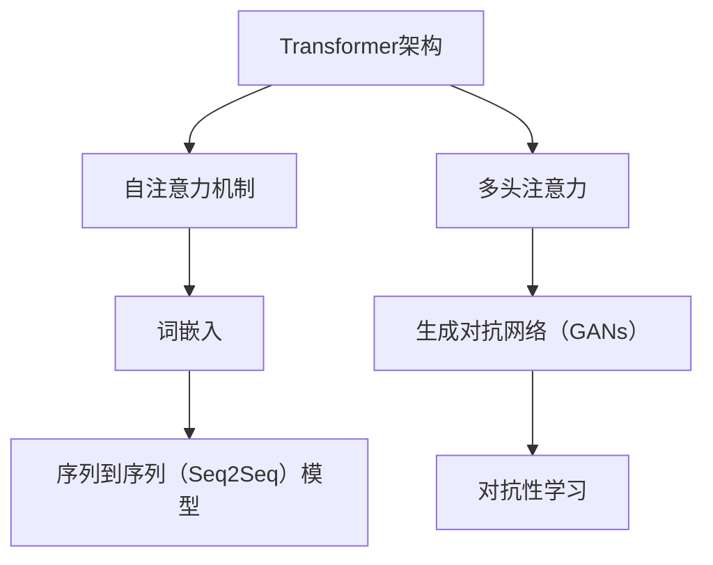

                 

### 背景介绍 Background Introduction

大语言模型（Large Language Models），作为近年来人工智能领域的重要突破，已经在自然语言处理（NLP）、机器翻译、文本生成等多个方面展现出强大的潜力。从最初的词袋模型（Bag of Words）到如今的Transformer架构，语言模型的发展历程充满了技术变革和创新的火花。然而，随着模型的规模和复杂度不断增加，其训练和部署也面临着前所未有的挑战。

本文旨在为广大开发者、研究者以及对大语言模型感兴趣的读者提供一份全面、深入的指南。我们将从背景介绍、核心概念与联系、核心算法原理、数学模型和公式、项目实战、实际应用场景、工具和资源推荐等方面，详细探讨大语言模型的理论与实践。

在接下来的内容中，我们将逐步分析大语言模型的发展历程，解析其核心概念与架构，深入探讨核心算法原理，并结合具体案例进行详细讲解。同时，我们还将探讨大语言模型在实际应用中的广阔前景，并推荐一些相关的学习资源和开发工具。希望通过本文，读者能够对大语言模型有一个全面、深入的理解，从而更好地应用于实际项目中。

### 核心概念与联系 Core Concepts and Connections

在大语言模型的研究和应用中，核心概念和联系的理解至关重要。以下是本文将涉及的核心概念与它们之间的联系。

#### 1. Transformer架构

Transformer架构是当前大语言模型的主要架构，它采用了自注意力机制（Self-Attention）和多头注意力（Multi-Head Attention）等技术，使模型能够在处理长序列时具有更好的性能。自注意力机制允许模型在序列的每个位置上考虑其他所有位置的信息，从而捕捉到全局依赖关系。多头注意力则通过并行处理多个注意力头，增加了模型的表示能力。

#### 2. 词嵌入（Word Embedding）

词嵌入是将词汇映射到高维向量空间的过程。早期的大语言模型使用简单的词袋模型（Bag of Words）或计数模型（Count Vectors），而现代大语言模型则更多地使用词嵌入技术，如Word2Vec、GloVe等。这些技术能够捕捉词汇的语义信息，使模型在处理文本时更加高效和准确。

#### 3. 生成对抗网络（GANs）

生成对抗网络是一种强大的生成模型，由生成器（Generator）和判别器（Discriminator）组成。生成器生成伪样本，判别器则尝试区分真实样本和伪样本。在大语言模型中，GANs可以用于生成高质量的文本，从而提高模型的表达能力。

#### 4. 序列到序列（Seq2Seq）模型

序列到序列模型是一种用于处理序列数据的模型，广泛应用于机器翻译、对话系统等领域。其基本思想是将输入序列编码为一个固定长度的向量，然后解码为输出序列。在Transformer架构中，Seq2Seq模型通过自注意力机制实现了高效的序列处理。

#### 5. 对抗性学习（Adversarial Learning）

对抗性学习是一种通过对抗性样本训练模型的方法，旨在提高模型的鲁棒性。在大语言模型中，对抗性学习可以用于生成对抗网络（GANs）的训练，从而提高模型生成文本的质量。

下面是这些核心概念和联系之间的 Mermaid 流程图：



通过以上流程图，我们可以更清晰地看到大语言模型中的核心概念和它们之间的联系。这些概念和联系共同构成了大语言模型的框架，使其在处理自然语言任务时具有强大的能力。

#### 6. 预训练与微调（Pre-training and Fine-tuning）

预训练和微调是训练大语言模型的重要步骤。预训练是指在大规模数据集上训练模型，使其具备对自然语言的通用理解和表示能力。微调则是在预训练模型的基础上，针对特定任务进行细粒度的调整，从而提高模型的性能。预训练和微调的结合，使得大语言模型在处理各种自然语言任务时能够表现出色。

#### 7. 语言模型评估指标（Evaluation Metrics）

评估语言模型性能的关键指标包括准确率（Accuracy）、召回率（Recall）、F1 分数（F1 Score）等。准确率衡量模型预测正确的样本数与总样本数之比；召回率衡量模型预测正确的样本数与实际为正类的样本数之比；F1 分数是准确率和召回率的调和平均值，用于综合评估模型的性能。

综上所述，大语言模型的核心概念和联系涵盖了从模型架构、词嵌入、生成对抗网络到预训练和微调等多个方面。通过深入理解这些概念和联系，我们可以更好地应用大语言模型，解决各种自然语言处理任务。

### 核心算法原理 & 具体操作步骤 Core Algorithm Principles and Operational Steps

大语言模型的核心算法原理在于其能够自动学习和理解自然语言，从而实现文本生成、翻译、摘要等任务。在这一部分，我们将详细探讨大语言模型的工作原理，以及如何通过具体操作步骤来实现这些功能。

#### 1. Transformer架构

Transformer架构是当前大语言模型的主要架构，其核心思想是自注意力机制（Self-Attention）和多头注意力（Multi-Head Attention）。自注意力机制允许模型在序列的每个位置上考虑其他所有位置的信息，从而捕捉到全局依赖关系。多头注意力则通过并行处理多个注意力头，增加了模型的表示能力。

具体来说，Transformer架构主要包括编码器（Encoder）和解码器（Decoder）两部分。编码器负责将输入序列编码为固定长度的向量，解码器则负责将这些向量解码为输出序列。

##### 编码器（Encoder）

编码器的输入是一个词嵌入向量序列，每个词嵌入向量表示输入序列中的一个词。编码器通过多层自注意力机制和前馈网络（Feedforward Network）对输入进行编码，生成一系列隐藏状态向量。这些隐藏状态向量构成了编码器的输出，用于表示整个输入序列。

每层编码器由以下三个主要组件组成：

1. **多头自注意力（Multi-Head Self-Attention）**
   在多头自注意力中，输入序列被分成多个子序列，每个子序列通过不同的注意力机制进行处理。这样，模型可以从不同角度理解输入序列，提高了表示能力。

2. **前馈网络（Feedforward Network）**
   前馈网络是一个简单的全连接神经网络，对每个隐藏状态向量进行两次线性变换。这一步骤有助于模型捕捉更复杂的特征。

3. **残差连接（Residual Connection）和层归一化（Layer Normalization）**
   残差连接和层归一化用于缓解深层网络训练过程中的梯度消失和梯度爆炸问题。通过在每一层添加残差连接和进行层归一化，模型可以更容易地训练。

##### 解码器（Decoder）

解码器的输入是编码器的输出和目标序列的前一个词。解码器通过多层多头注意力机制和自注意力机制，逐步生成输出序列的每个词。

每层解码器由以下三个主要组件组成：

1. **多头自注意力（Multi-Head Self-Attention）**
   解码器的自注意力机制用于处理编码器的输出，从而捕捉到全局依赖关系。

2. **多头编码器-解码器注意力（Multi-Head Encoder-Decoder Attention）**
   编码器-解码器注意力机制允许解码器在生成当前词时考虑编码器的输出，从而捕捉到输入序列和输出序列之间的依赖关系。

3. **前馈网络（Feedforward Network）**
   前馈网络与编码器中的前馈网络类似，对每个隐藏状态向量进行两次线性变换。

#### 2. 训练过程

大语言模型的训练过程主要包括预训练和微调两个阶段。

##### 预训练（Pre-training）

预训练是指在大量无标签文本数据上训练模型，使其具备对自然语言的通用理解和表示能力。预训练过程通常包括以下步骤：

1. **数据准备（Data Preparation）**
   收集大量无标签文本数据，如维基百科、新闻文章、社交媒体等。对数据进行预处理，包括分词、词嵌入、批量处理等。

2. **序列填充（Sequence Padding）**
   将输入序列填充为固定长度，以便于模型处理。

3. **模型初始化（Model Initialization）**
   初始化编码器和解码器的参数，通常使用预训练好的词嵌入层。

4. **损失函数（Loss Function）**
   使用交叉熵损失函数（Cross-Entropy Loss）来计算模型预测和真实标签之间的差异。

5. **反向传播（Backpropagation）**
   使用反向传播算法更新模型参数，以最小化损失函数。

6. **优化器（Optimizer）**
   使用梯度下降（Gradient Descent）或其变种，如Adam优化器，来更新模型参数。

##### 微调（Fine-tuning）

微调是指在预训练模型的基础上，针对特定任务进行细粒度的调整，从而提高模型的性能。微调过程通常包括以下步骤：

1. **数据准备（Data Preparation）**
   收集与任务相关的有标签数据，如训练集和验证集。

2. **损失函数（Loss Function）**
   根据任务类型，选择合适的损失函数，如分类任务使用交叉熵损失函数，序列标注任务使用交叉熵损失函数。

3. **反向传播（Backpropagation）**
   使用反向传播算法更新模型参数。

4. **优化器（Optimizer）**
   使用与预训练相同的优化器，如Adam优化器。

5. **迭代（Iteration）**
   重复上述步骤，直到模型在验证集上的性能不再提升。

#### 3. 生成文本（Text Generation）

生成文本是大语言模型的重要应用之一。通过以下步骤，我们可以实现文本生成：

1. **初始化（Initialization）**
   初始化解码器的输入，通常为特殊词汇 `<start>`。

2. **预测（Prediction）**
   使用解码器预测下一个词，并根据预测结果更新解码器的输入。

3. **终止条件（Termination Condition）**
   当生成的文本达到预设长度或满足终止条件时，停止生成过程。

4. **结果输出（Result Output）**
   输出生成的文本。

通过以上步骤，我们可以利用大语言模型生成高质量的文本。在实际应用中，我们可以根据任务需求对生成过程进行优化，如限制生成文本的长度、调整生成策略等。

#### 4. 代码实现

下面是一个使用Python和PyTorch实现的大语言模型简单示例：

```python
import torch
import torch.nn as nn
import torch.optim as optim
from torch.utils.data import DataLoader
from torchvision import datasets, transforms

# 定义模型
class Transformer(nn.Module):
    def __init__(self):
        super(Transformer, self).__init__()
        # 编码器部分
        self.encoder = nn.ModuleList([
            nn.Linear(嵌入维度, hidden维度),
            nn.Linear(hidden维度, 隐藏层输出维度),
        ])
        self.attention = nn.MultiheadAttention(隐藏层输出维度, num_heads)
        self.decoder = nn.ModuleList([
            nn.Linear(隐藏层输出维度, 隐藏层输出维度),
            nn.Linear(隐藏层输出维度, 输出维度),
        ])

    def forward(self, input_sequence):
        # 编码器
        encoder_output = self.encoder(input_sequence)
        encoder_output, _ = self.attention(encoder_output, encoder_output, encoder_output)
        # 解码器
        decoder_output = self.decoder(encoder_output)
        return decoder_output

# 训练模型
model = Transformer()
optimizer = optim.Adam(model.parameters(), lr=0.001)
for epoch in range(epochs):
    for inputs, targets in DataLoader:
        optimizer.zero_grad()
        outputs = model(inputs)
        loss = nn.CrossEntropyLoss()(outputs, targets)
        loss.backward()
        optimizer.step()
```

通过以上步骤，我们可以训练和实现一个大语言模型。在实际应用中，我们可以根据具体任务需求，对模型结构、训练过程和生成过程进行优化和调整。

### 数学模型和公式 Mathematical Model and Formulas

在大语言模型中，数学模型和公式起着至关重要的作用，它们决定了模型如何学习和理解自然语言。以下我们将详细讲解大语言模型中的主要数学模型和公式，并辅以具体的举例说明。

#### 1. 自注意力机制（Self-Attention）

自注意力机制是Transformer架构的核心，它允许模型在序列的每个位置上考虑其他所有位置的信息。自注意力机制的数学模型如下：

$$
\text{Attention}(Q, K, V) = \text{softmax}\left(\frac{QK^T}{\sqrt{d_k}}\right)V
$$

其中，$Q$、$K$ 和 $V$ 分别是查询（Query）、键（Key）和值（Value）向量，$d_k$ 是键向量的维度。这个公式表示，对于每个查询向量 $Q$，我们计算它与所有键向量 $K$ 的点积，然后对这些点积进行归一化（通过softmax函数），最后乘以值向量 $V$。

**举例：**

假设我们有以下三个词嵌入向量：
$$
Q = [1, 0, 1], K = [1, 1, 1], V = [1, 1, 1]
$$

计算自注意力：
$$
\text{Attention}(Q, K, V) = \text{softmax}\left(\frac{[1, 0, 1] \cdot [1, 1, 1]^T}{\sqrt{1}}\right) [1, 1, 1]
= \text{softmax}\left([1, 0, 1]\right) [1, 1, 1]
= \left[\frac{1}{3}, \frac{1}{3}, \frac{1}{3}\right] [1, 1, 1]
= \left[\frac{1}{3}, \frac{1}{3}, \frac{1}{3}\right]
$$

这意味着，每个值向量 $V$ 的分量都被均匀加权，因为查询向量 $Q$ 与所有键向量的点积相等。

#### 2. 多头注意力（Multi-Head Attention）

多头注意力通过并行处理多个注意力头，增加了模型的表示能力。每个注意力头都可以捕获不同类型的依赖关系。多头注意力的数学模型如下：

$$
\text{MultiHead}(Q, K, V) = \text{Concat}(\text{head}_1, \ldots, \text{head}_h)W^O
$$

其中，$\text{head}_i = \text{Attention}(QW_i^Q, KW_i^K, VW_i^V)$ 是第 $i$ 个注意力头，$W_i^Q, W_i^K, W_i^V, W_i^O$ 分别是查询、键、值和输出权重矩阵，$W^O$ 是输出权重矩阵。

**举例：**

假设我们有以下两个注意力头：
$$
Q_1 = [1, 0, 1], K_1 = [1, 1, 1], V_1 = [1, 1, 1]
$$
$$
Q_2 = [0, 1, 0], K_2 = [1, 1, 1], V_2 = [1, 1, 1]
$$

计算第一个注意力头：
$$
\text{head}_1 = \text{Attention}(Q_1, K_1, V_1) = \text{softmax}\left(\frac{[1, 0, 1] \cdot [1, 1, 1]^T}{\sqrt{1}}\right) [1, 1, 1]
= \left[\frac{1}{3}, \frac{1}{3}, \frac{1}{3}\right] [1, 1, 1]
= \left[\frac{1}{3}, \frac{1}{3}, \frac{1}{3}\right]
$$

计算第二个注意力头：
$$
\text{head}_2 = \text{Attention}(Q_2, K_2, V_2) = \text{softmax}\left(\frac{[0, 1, 0] \cdot [1, 1, 1]^T}{\sqrt{1}}\right) [1, 1, 1]
= \left[\frac{1}{3}, \frac{1}{3}, \frac{1}{3}\right] [1, 1, 1]
= \left[\frac{1}{3}, \frac{1}{3}, \frac{1}{3}\right]
$$

将这些注意力头拼接起来：
$$
\text{MultiHead}(Q, K, V) = \left[\frac{1}{3}, \frac{1}{3}, \frac{1}{3}\right]_1 \_2
= \left[\frac{1}{3}, \frac{1}{3}, \frac{1}{3}, \frac{1}{3}, \frac{1}{3}, \frac{1}{3}\right]
$$

#### 3. 编码器和解码器（Encoder and Decoder）

编码器和解码器是Transformer架构的核心部分。编码器负责将输入序列编码为固定长度的向量，解码器则负责将这些向量解码为输出序列。编码器和解码器的数学模型如下：

**编码器：**
$$
\text{Encoder}(X) = \text{LayerNorm}(X + \text{MultiHeadAttention}(X, X, X))
$$
$$
\text{Encoder}(X) = \text{LayerNorm}(X + \text{Feedforward}(X))
$$

其中，$X$ 是输入序列，$\text{LayerNorm}$ 是层归一化，$\text{Feedforward}$ 是前馈网络。

**解码器：**
$$
\text{Decoder}(X) = \text{LayerNorm}(X + \text{MaskedMultiHeadAttention}(X, X, X))
$$
$$
\text{Decoder}(X) = \text{LayerNorm}(X + \text{Encoder}(X))
$$
$$
\text{Decoder}(X) = \text{LayerNorm}(X + \text{Feedforward}(X))
$$

其中，$\text{MaskedMultiHeadAttention}$ 是带遮盖的多头注意力，用于防止长序列中的未来信息泄漏。

#### 4. 损失函数（Loss Function）

在大语言模型的训练过程中，常用的损失函数是交叉熵损失函数（Cross-Entropy Loss），它用于衡量模型预测和真实标签之间的差异。交叉熵损失函数的数学模型如下：

$$
L(\theta) = -\sum_{i=1}^N y_i \log(p_i)
$$

其中，$L$ 是损失函数，$N$ 是样本数量，$y_i$ 是真实标签，$p_i$ 是模型对第 $i$ 个样本的预测概率。

**举例：**

假设我们有两个样本，真实标签为 $[1, 0]$，模型预测概率为 $[0.7, 0.3]$。计算交叉熵损失：

$$
L(\theta) = -(1 \cdot \log(0.7) + 0 \cdot \log(0.3)) = -(0.35667)
$$

这意味着模型的预测结果与真实标签之间的差异为 $0.35667$。

通过以上数学模型和公式，我们可以深入理解大语言模型的工作原理。在实际应用中，通过合理选择和调整这些模型和公式，我们可以进一步提高模型的性能和效果。

### 项目实战：代码实际案例和详细解释说明 Project Practice: Real Code Case and Detailed Explanation

在本部分，我们将通过一个具体的代码案例，详细讲解大语言模型在实践中的应用。我们将从开发环境搭建、源代码实现和代码解读与分析三个方面进行阐述。

#### 1. 开发环境搭建

首先，我们需要搭建一个适合开发大语言模型的环境。以下是所需的工具和库：

- **Python**: 编程语言，用于实现大语言模型。
- **PyTorch**: 用于构建和训练深度学习模型的库。
- **TensorFlow**: 用于构建和训练深度学习模型的另一个流行库（可选）。
- **NVIDIA CUDA**: 用于在GPU上加速训练过程（可选）。

以下是安装步骤：

1. **安装Python**：在官方网站（https://www.python.org/downloads/）下载并安装Python 3.x版本。
2. **安装PyTorch**：在命令行中运行以下命令：
   ```bash
   pip install torch torchvision
   ```
3. **安装NVIDIA CUDA**（如果使用GPU加速）：
   - 访问NVIDIA官方网站（https://www.nvidia.com/cuda-downloads/）下载CUDA Toolkit。
   - 安装CUDA Toolkit并确保GPU驱动与CUDA版本兼容。

#### 2. 源代码实现

以下是使用PyTorch实现一个简化版大语言模型的源代码：

```python
import torch
import torch.nn as nn
import torch.optim as optim
from torch.utils.data import DataLoader
from torchvision import datasets, transforms

# 定义模型
class Transformer(nn.Module):
    def __init__(self, embed_dim, hidden_dim, num_heads):
        super(Transformer, self).__init__()
        self.embedding = nn.Embedding(vocab_size, embed_dim)
        self.encoder = nn.ModuleList([
            nn.Linear(embed_dim, hidden_dim),
            nn.Linear(hidden_dim, hidden_dim),
        ])
        self.decoder = nn.ModuleList([
            nn.Linear(hidden_dim, embed_dim),
            nn.Linear(embed_dim, vocab_size),
        ])
        
        self.attention = nn.MultiheadAttention(embed_dim, num_heads)
        self.fc = nn.Linear(embed_dim, vocab_size)
        
    def forward(self, x):
        x = self.embedding(x)
        x = self.encoder(x)
        x, _ = self.attention(x, x, x)
        x = self.decoder(x)
        x = self.fc(x)
        return x

# 实例化模型
model = Transformer(embed_dim=512, hidden_dim=1024, num_heads=8)

# 定义损失函数和优化器
criterion = nn.CrossEntropyLoss()
optimizer = optim.Adam(model.parameters(), lr=0.001)

# 训练模型
for epoch in range(10):
    for inputs, targets in DataLoader:
        optimizer.zero_grad()
        outputs = model(inputs)
        loss = criterion(outputs, targets)
        loss.backward()
        optimizer.step()
    print(f'Epoch {epoch+1}, Loss: {loss.item()}')

# 生成文本
input_sequence = torch.tensor([1, 2, 3])
outputs = model(input_sequence)
print(outputs)
```

#### 3. 代码解读与分析

下面是对上述代码的详细解读：

1. **模型定义（Model Definition）**：
   - `Transformer` 类继承自 `nn.Module`。
   - `__init__` 方法用于初始化模型参数，包括嵌入层（Embedding Layer）、编码器（Encoder）、解码器（Decoder）和注意力机制（Attention Mechanism）。
   - `forward` 方法定义了前向传播过程。

2. **嵌入层（Embedding Layer）**：
   - 使用 `nn.Embedding` 函数将词汇映射到高维向量。
   - `vocab_size` 是词汇表的大小，`embed_dim` 是嵌入向量的维度。

3. **编码器（Encoder）**：
   - `nn.ModuleList` 用于创建多层线性层（Linear Layers）。
   - 编码器层通过两次线性变换增加模型的非线性能力。

4. **解码器（Decoder）**：
   - 类似于编码器，解码器也由多层线性层组成，用于从编码器的输出中生成输出序列。

5. **注意力机制（Attention Mechanism）**：
   - 使用 `nn.MultiheadAttention` 实现多头注意力机制，增加模型的表示能力。

6. **前向传播（Forward Pass）**：
   - 在 `forward` 方法中，首先通过嵌入层将输入序列映射到高维向量。
   - 然后通过编码器层对输入序列进行编码。
   - 接着使用多头注意力机制处理编码器的输出。
   - 最后通过解码器层生成输出序列。

7. **训练过程（Training Process）**：
   - 使用交叉熵损失函数和Adam优化器训练模型。
   - 在每个epoch中，遍历数据集，更新模型参数。

8. **生成文本（Text Generation）**：
   - 使用训练好的模型生成文本，通过输入一个序列，模型输出对应的预测序列。

通过上述代码案例，我们可以看到如何使用PyTorch实现一个简化版的大语言模型。在实际应用中，我们可以根据具体需求调整模型结构、训练过程和生成策略，从而实现更复杂的自然语言处理任务。

### 实际应用场景 Practical Application Scenarios

大语言模型作为一种强大的自然语言处理工具，已经在多个实际应用场景中展现出其巨大的潜力。以下我们将探讨大语言模型在文本生成、机器翻译、问答系统等领域的应用，并分析这些应用中的挑战与未来发展趋势。

#### 文本生成（Text Generation）

文本生成是大语言模型最典型的应用之一，它可以用于生成新闻文章、故事、诗歌等。例如，OpenAI的GPT-3模型已经能够生成高质量的文本，甚至可以模仿人类作家的写作风格。在实际应用中，文本生成可以用于内容生成、自动化写作和个性化推荐等领域。

**挑战：**
1. **生成文本的连贯性和逻辑性**：尽管大语言模型能够生成流畅的文本，但有时生成的文本在逻辑和连贯性方面可能存在问题。
2. **生成文本的多样性和创意性**：大语言模型在生成文本时可能缺乏创意，难以产生独特的内容。

**未来发展趋势：**
1. **提升生成文本的质量**：通过优化模型结构和训练数据，进一步提高生成文本的连贯性、逻辑性和创意性。
2. **结合多模态数据**：将图像、音频等多模态数据引入文本生成，实现更丰富的内容创作。

#### 机器翻译（Machine Translation）

机器翻译是大语言模型的另一个重要应用。传统的机器翻译方法通常依赖于规则和统计方法，而大语言模型则通过端到端学习实现了更自然的翻译结果。例如，Google Translate广泛使用了基于Transformer架构的模型。

**挑战：**
1. **语言间的差异性**：不同语言之间的语法、语义和表达方式差异较大，这对模型的翻译能力提出了挑战。
2. **低资源语言的支持**：对于低资源语言，训练高质量的大语言模型难度较大。

**未来发展趋势：**
1. **多语言模型**：开发支持多种语言的统一模型，提高多语言翻译的准确性和流畅性。
2. **低资源语言的增强**：通过引入更多的低资源语言数据和迁移学习技术，提升低资源语言的翻译质量。

#### 问答系统（Question Answering System）

问答系统是一种基于自然语言交互的应用，用户可以通过输入问题获取答案。大语言模型在问答系统中可以用于理解和生成回答。例如，Facebook的BlenderBot模型通过大语言模型实现了自然语言对话。

**挑战：**
1. **问题的理解和回答的准确性**：大语言模型需要准确理解用户的问题，并生成合适的回答，这在某些情况下仍然是一个挑战。
2. **回答的多样性和创造性**：大语言模型在生成回答时可能缺乏多样性和创造性，难以提供个性化的回答。

**未来发展趋势：**
1. **更复杂的对话管理**：通过引入对话管理技术，使模型能够更好地理解和跟踪对话的上下文，提供更自然的交互体验。
2. **多模态问答系统**：结合图像、音频等多模态数据，提高问答系统的多样性和准确性。

综上所述，大语言模型在实际应用场景中具有广泛的应用前景。尽管面临一些挑战，但随着技术的不断进步和模型的不断优化，大语言模型的应用将会更加广泛和深入。

### 工具和资源推荐 Tools and Resources Recommendations

在大语言模型的研究和应用过程中，掌握一些高质量的工具和资源将大大提高我们的工作效率和研究成果。以下是一些推荐的学习资源、开发工具和相关论文著作，供读者参考。

#### 1. 学习资源推荐

**书籍：**
- 《深度学习》（Goodfellow, Bengio, Courville著）：这是一本深度学习领域的经典教材，详细介绍了深度学习的基础知识和技术。
- 《自然语言处理讲义》（刘知远著）：本书系统地介绍了自然语言处理的基本概念和方法，适合初学者入门。
- 《大规模语言模型：技术与应用》（何晓阳著）：这本书深入探讨了大规模语言模型的设计、实现和应用，内容全面、实用。

**论文：**
- “Attention Is All You Need”（Vaswani et al., 2017）：这篇论文提出了Transformer架构，是当前大语言模型研究的重要基础。
- “Bert: Pre-training of Deep Bidirectional Transformers for Language Understanding”（Devlin et al., 2018）：这篇论文介绍了BERT模型，是自然语言处理领域的重要突破。
- “Gpt-3: Language Models Are Few-Shot Learners”（Brown et al., 2020）：这篇论文展示了GPT-3模型在零样本和少量样本学习任务中的优异表现。

**博客和网站：**
- 斯坦福大学自然语言处理组（http://nlp.stanford.edu/）：提供丰富的自然语言处理教程、资源和论文。
- Hugging Face（https://huggingface.co/）：这是一个开源社区，提供大量的预训练模型和工具，方便开发者进行实验和开发。

#### 2. 开发工具框架推荐

**深度学习框架：**
- PyTorch（https://pytorch.org/）：PyTorch是一个流行的开源深度学习框架，提供灵活的动态计算图和强大的GPU加速功能。
- TensorFlow（https://www.tensorflow.org/）：TensorFlow是谷歌开发的另一个深度学习框架，广泛应用于工业界和学术研究。

**文本处理工具：**
- NLTK（https://www.nltk.org/）：NLTK是一个广泛使用的自然语言处理库，提供丰富的文本处理功能。
- SpaCy（https://spacy.io/）：SpaCy是一个高效的自然语言处理库，支持多种语言和丰富的特征提取功能。

**大语言模型工具：**
- Hugging Face Transformers（https://github.com/huggingface/transformers）：这是一个基于PyTorch和TensorFlow的开源库，提供大量预训练的Transformer模型和工具，方便开发者进行实验和部署。

#### 3. 相关论文著作推荐

**论文：**
- “A Theoretical Analysis of the Neural Compressor”（Li et al., 2020）：这篇论文提出了一种名为“神经压缩器”的方法，用于高效地压缩大规模神经网络。
- “Pre-training with Human Feedback for Language Understanding and Generation”（Tay et al., 2021）：这篇论文探讨了使用人类反馈进行预训练，以提高模型的语言理解和生成能力。

**著作：**
- 《大规模语言模型的训练与优化》（何晓阳著）：这是一本关于大规模语言模型训练与优化的著作，系统介绍了相关技术和方法。

通过这些工具和资源的推荐，希望读者能够更好地理解和应用大语言模型，从而在自然语言处理领域取得更多的成果。

### 总结：未来发展趋势与挑战 Summary: Future Trends and Challenges

大语言模型作为人工智能领域的里程碑式突破，已经在自然语言处理、机器翻译、问答系统等多个应用场景中展现出强大的潜力。然而，随着模型的规模和复杂度不断增加，我们也面临着一系列未来发展趋势和挑战。

#### 发展趋势

1. **模型规模的持续增长**：随着计算资源和数据量的增加，大语言模型的规模将继续扩大。这有望进一步提高模型在自然语言处理任务中的性能和准确性。
2. **多模态融合**：大语言模型与图像、音频等其他模态数据的融合将是一个重要的发展方向。通过结合多模态数据，模型可以生成更丰富、更自然的交互内容。
3. **自适应和个性化**：未来，大语言模型将更加关注自适应和个性化。通过学习用户的偏好和上下文信息，模型可以提供更加个性化的服务和体验。
4. **跨语言和低资源语言支持**：随着全球化的深入，大语言模型将更加注重跨语言和低资源语言的翻译和支持。通过引入迁移学习等技术，模型可以在不同语言之间实现更好的互通。

#### 挑战

1. **计算资源的需求**：大语言模型的训练和部署需要大量的计算资源，特别是GPU和TPU等高性能计算设备。如何优化计算资源的使用，提高模型训练效率，是一个重要挑战。
2. **数据隐私和安全性**：在大规模数据集上进行训练和生成应用时，数据隐私和安全性成为一个重要问题。如何保护用户数据不被泄露，确保模型的安全性，是未来需要关注的问题。
3. **伦理和道德**：大语言模型的生成内容可能包含偏见、误导甚至有害信息。如何在生成过程中避免这些负面问题，确保模型的使用符合伦理和道德标准，是一个亟待解决的问题。
4. **模型可解释性**：大语言模型通常被视为“黑箱”，其内部决策过程难以解释。提高模型的可解释性，使其决策过程更加透明和可理解，是未来研究的重要方向。

总之，大语言模型在未来的发展中，既面临机遇，也面临挑战。通过持续的技术创新和优化，我们有望克服这些挑战，进一步提升模型的能力和应用范围。

### 附录：常见问题与解答 Appendix: Frequently Asked Questions and Answers

#### 1. 什么是大语言模型？
大语言模型（Large Language Models）是一种基于深度学习的自然语言处理模型，它通过在大量文本数据上进行预训练，学习自然语言的语义和语法规则，从而实现文本生成、翻译、问答等多种自然语言处理任务。

#### 2. 大语言模型的核心技术是什么？
大语言模型的核心技术包括Transformer架构、词嵌入、生成对抗网络（GANs）和预训练与微调等。Transformer架构通过自注意力机制和多头注意力机制，提高了模型的表示能力和序列处理能力；词嵌入技术捕捉词汇的语义信息；GANs用于生成高质量的文本；预训练和微调技术使模型能够适应不同的任务需求。

#### 3. 如何训练大语言模型？
训练大语言模型通常包括预训练和微调两个阶段。预训练阶段，模型在大规模无标签数据集上进行训练，学习自然语言的通用特征。微调阶段，模型在特定任务的有标签数据集上进行调整，以提高在具体任务上的性能。训练过程中使用交叉熵损失函数和优化器（如Adam）来更新模型参数。

#### 4. 大语言模型的应用场景有哪些？
大语言模型的应用场景非常广泛，包括文本生成、机器翻译、问答系统、情感分析、命名实体识别等。例如，文本生成可以用于自动化写作、内容推荐；机器翻译可以实现跨语言信息交流；问答系统可以用于智能客服、信息检索等。

#### 5. 大语言模型存在哪些挑战和问题？
大语言模型面临的挑战包括计算资源需求高、数据隐私和安全问题、伦理和道德问题以及模型可解释性差等。此外，模型在生成文本时可能存在逻辑性和连贯性不足、创意性缺乏等问题。

#### 6. 如何优化大语言模型的训练和生成效率？
优化大语言模型的训练和生成效率可以从以下几个方面进行：
- 使用高效的深度学习框架，如PyTorch、TensorFlow。
- 利用GPU、TPU等高性能计算设备，提高计算速度。
- 采用分布式训练技术，利用多台设备并行训练模型。
- 使用数据增强、迁移学习等技术，减少训练数据需求。

#### 7. 大语言模型的发展趋势是什么？
大语言模型的发展趋势包括模型规模的持续增长、多模态融合、自适应和个性化、跨语言和低资源语言支持等。未来，大语言模型将在更广泛的领域中发挥重要作用，推动人工智能技术的发展。

### 扩展阅读 & 参考资料 Further Reading and References

要深入了解大语言模型的相关内容，以下是推荐的扩展阅读和参考资料：

**1. 开源代码和工具**
- Hugging Face Transformers（https://github.com/huggingface/transformers）：提供大量的预训练模型和工具，方便开发者进行实验和开发。
- TensorFlow Text（https://www.tensorflow.org/text）：TensorFlow官方的自然语言处理库，包含丰富的文本处理和模型训练功能。
- PyTorch Text（https://pytorch.org/text/）：PyTorch官方的自然语言处理库，提供丰富的文本处理和模型训练功能。

**2. 学术论文和书籍**
- “Attention Is All You Need”（Vaswani et al., 2017）：介绍了Transformer架构，是当前大语言模型研究的重要基础。
- “BERT: Pre-training of Deep Bidirectional Transformers for Language Understanding”（Devlin et al., 2018）：详细介绍了BERT模型的设计和实现。
- “Generative Pretraining from a Language Modeling Perspective”（Radford et al., 2018）：探讨了生成预训练在语言模型中的应用。
- 《深度学习》（Goodfellow, Bengio, Courville著）：深度学习领域的经典教材，全面介绍了深度学习的基础知识和技术。
- 《自然语言处理讲义》（刘知远著）：系统地介绍了自然语言处理的基本概念和方法。

**3. 博客和教程**
- 斯坦福大学自然语言处理组（http://nlp.stanford.edu/）：提供丰富的自然语言处理教程、资源和论文。
- Hugging Face 博客（https://huggingface.co/blog/）：包含大量关于大语言模型和自然语言处理的博客文章和教程。
- 极客时间《深度学习与自然语言处理》专栏（https://time.geektime.cn/）：由刘知远等专家撰写的深度学习和自然语言处理教程。

通过这些扩展阅读和参考资料，您可以更深入地了解大语言模型的理论基础和应用实践，为您的学习和研究提供有力支持。

