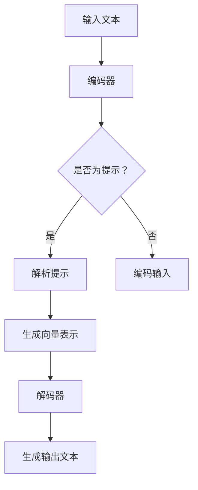

                 

# 大语言模型应用指南：提示的构成

> **关键词：** 大语言模型，提示设计，自然语言处理，AI 应用

> **摘要：** 本指南将深入探讨大语言模型的应用场景和提示设计原理，通过详细的步骤分析和实例讲解，帮助读者理解如何构建和优化语言模型的提示，提高其性能和应用效果。

在当前的人工智能领域，大语言模型已经成为自然语言处理（NLP）的重要工具。这些模型通过学习海量文本数据，具备了生成连贯文本、理解复杂语言结构的能力。然而，要让这些模型在实际应用中发挥最佳效果，如何设计和优化提示（Prompts）至关重要。本文将围绕这一核心问题，从多个角度展开讨论。

## 1. 背景介绍

自然语言处理是人工智能的一个重要分支，旨在使计算机能够理解和处理人类语言。随着深度学习技术的发展，尤其是神经网络模型的突破，自然语言处理取得了显著的进展。大语言模型（如GPT、BERT等）作为这一领域的重要成果，已经成为许多应用程序的核心组件。

大语言模型的特点在于其强大的表示能力和学习能力。它们通过学习大量的文本数据，可以捕捉到语言中的复杂模式和结构，从而实现文本生成、问答系统、机器翻译等多种任务。然而，这些模型的性能不仅取决于其内部结构和参数设置，还受到提示设计的影响。

提示在大语言模型中的应用，可以理解为是用户与模型之间的交互界面。一个良好的提示设计，可以引导模型更好地理解任务要求，从而提高其输出质量。因此，深入理解大语言模型的提示构成和设计策略，对于实际应用具有重要意义。

## 2. 核心概念与联系

### 2.1 大语言模型的工作原理

大语言模型通常基于变换器模型（Transformer）构建，其核心组件包括编码器（Encoder）和解码器（Decoder）。编码器负责将输入文本转换为一个固定长度的向量表示，解码器则根据这个向量表示生成输出文本。


编码器和解码器之间通过多头自注意力机制（Multi-Head Self-Attention）和前馈神经网络（Feedforward Neural Network）进行交互。这种结构使得模型能够捕捉到输入文本中的长距离依赖关系，从而生成连贯的输出。

### 2.2 提示设计的核心概念

提示（Prompt）是用户输入给模型的文本或指令，它用于指导模型理解任务目标。一个有效的提示设计，应该包含以下核心要素：

- **明确的目标：** 提示需要明确地指出模型需要完成的任务，例如文本生成、摘要生成等。
- **输入上下文：** 提示应提供与任务相关的上下文信息，帮助模型更好地理解任务背景。
- **格式化要求：** 提示应遵循一定的格式规范，以便模型能够正确地解析和处理输入信息。

### 2.3 Mermaid 流程图

下面是一个关于大语言模型提示设计的 Mermaid 流程图：



在这个流程图中，输入文本首先经过编码器处理，如果输入文本是提示，则需要进一步解析提示信息；否则，直接进行编码。解析后的提示和编码后的输入文本共同生成向量表示，然后传递给解码器生成输出文本。

## 3. 核心算法原理 & 具体操作步骤

### 3.1 编码器与解码器

编码器和解码器是变换器模型的核心组件。编码器将输入文本映射为一个固定长度的向量表示，解码器则根据这个向量表示生成输出文本。

#### 3.1.1 编码器

编码器的工作流程如下：

1. **嵌入（Embedding）**：将输入文本中的每个词映射为一个向量表示。
2. **位置编码（Positional Encoding）**：为每个词添加位置信息，以捕捉输入文本中的序列关系。
3. **自注意力（Self-Attention）**：通过多头自注意力机制，捕捉输入文本中的长距离依赖关系。
4. **前馈神经网络（Feedforward Neural Network）**：对自注意力层的结果进行进一步处理。

#### 3.1.2 解码器

解码器的工作流程如下：

1. **嵌入（Embedding）**：将输出文本中的每个词映射为一个向量表示。
2. **位置编码（Positional Encoding）**：为每个词添加位置信息，以捕捉输出文本中的序列关系。
3. **自注意力（Self-Attention）**：通过多头自注意力机制，捕捉上下文信息。
4. **交叉注意力（Cross-Attention）**：将编码器的输出与解码器的输出进行交互。
5. **前馈神经网络（Feedforward Neural Network）**：对交叉注意力层的结果进行进一步处理。

### 3.2 提示设计步骤

#### 3.2.1 确定任务目标

首先，明确模型需要完成的任务，例如文本生成、摘要生成等。这有助于设计针对性的提示。

#### 3.2.2 提供上下文信息

根据任务要求，提供与任务相关的上下文信息。这些信息可以帮助模型更好地理解任务背景，从而提高输出质量。

#### 3.2.3 格式化要求

遵循一定的格式规范，以便模型能够正确地解析和处理输入信息。例如，可以使用特殊的分隔符或标记来分隔输入文本中的不同部分。

### 3.3 代码实现示例

以下是一个简单的提示设计示例：

```python
# 输入文本
input_text = "请写一篇关于人工智能的短文。"

# 编码器输入
encoder_input = model.encode(input_text)

# 解码器输入
decoder_input = torch.tensor([[2]])  # 2 表示开始标记

# 提示设计
prompt = "人工智能是一种计算机科学分支，它旨在创建智能体，这些智能体能够执行通常需要人类智能的任务。"

# 解码器输出
decoder_output = model.decode(encoder_input, decoder_input, prompt)

# 输出结果
print(decoder_output)
```

在这个示例中，我们首先输入一篇关于人工智能的短文，然后定义编码器和解码器的输入。接着，设计一个提示，用于指导模型生成相关内容。最后，调用模型进行解码，生成输出文本。

## 4. 数学模型和公式 & 详细讲解 & 举例说明

### 4.1 数学模型

大语言模型的数学模型主要包括以下部分：

- **嵌入层（Embedding Layer）**：将词汇映射为向量表示，通常使用词嵌入（Word Embedding）技术。
- **位置编码（Positional Encoding）**：为每个词添加位置信息，常用的方法有绝对位置编码和相对位置编码。
- **自注意力（Self-Attention）**：通过计算词与词之间的相似度，将词表示映射为一个加权向量。
- **前馈神经网络（Feedforward Neural Network）**：对自注意力结果进行进一步处理。

### 4.2 公式

以下是变换器模型中的关键数学公式：

- **嵌入层**：
  $$ E = W_e \cdot X $$
  其中，$E$ 表示嵌入向量，$W_e$ 表示嵌入权重，$X$ 表示输入文本。

- **位置编码**：
  $$ P = P_{abs} + P_{rel} $$
  其中，$P$ 表示位置编码向量，$P_{abs}$ 表示绝对位置编码，$P_{rel}$ 表示相对位置编码。

- **自注意力**：
  $$ A = softmax(\frac{QK^T}{\sqrt{d_k}}) $$
  其中，$A$ 表示注意力权重矩阵，$Q$ 和 $K$ 分别表示查询向量和关键向量，$d_k$ 表示关键向量的维度。

- **前馈神经网络**：
  $$ F = \sigma(W_f \cdot (A \cdot V) + b_f) $$
  其中，$F$ 表示前馈神经网络输出，$W_f$ 和 $b_f$ 分别表示权重和偏置，$\sigma$ 表示激活函数，$A$ 表示注意力权重矩阵，$V$ 表示值向量。

### 4.3 举例说明

假设我们有一个简单的输入文本：“我爱北京天安门”。

1. **嵌入层**：
   将每个词映射为一个向量表示：
   $$ E = \begin{bmatrix} e_{我} & e_{爱} & e_{北京} & e_{天安门} \end{bmatrix} $$

2. **位置编码**：
   为每个词添加位置信息：
   $$ P = \begin{bmatrix} p_{1} & p_{2} & p_{3} & p_{4} \end{bmatrix} $$

3. **自注意力**：
   计算词与词之间的相似度，得到注意力权重矩阵：
   $$ A = \begin{bmatrix} a_{11} & a_{12} & a_{13} & a_{14} \\ a_{21} & a_{22} & a_{23} & a_{24} \\ a_{31} & a_{32} & a_{33} & a_{34} \\ a_{41} & a_{42} & a_{43} & a_{44} \end{bmatrix} $$
   其中，$a_{ij}$ 表示第 $i$ 个词与第 $j$ 个词的相似度。

4. **前馈神经网络**：
   对自注意力结果进行进一步处理，得到输出向量：
   $$ F = \begin{bmatrix} f_{1} & f_{2} & f_{3} & f_{4} \end{bmatrix} $$
   其中，$f_{i}$ 表示第 $i$ 个词的输出向量。

通过这些步骤，我们得到了输入文本的向量表示，然后可以将其传递给解码器生成输出文本。

## 5. 项目实战：代码实际案例和详细解释说明

### 5.1 开发环境搭建

在进行大语言模型项目实战之前，我们需要搭建一个合适的开发环境。以下是搭建过程：

1. **安装 Python 环境**：确保 Python 版本在 3.6 以上。

2. **安装 PyTorch 库**：使用以下命令安装 PyTorch：
   ```bash
   pip install torch torchvision
   ```

3. **安装其他依赖库**：根据需要安装其他依赖库，如 NumPy、Pandas 等。

4. **准备数据集**：下载一个合适的数据集，例如中文新闻数据集。

### 5.2 源代码详细实现和代码解读

以下是一个简单的示例，演示如何使用 PyTorch 实现一个基本的大语言模型。

```python
import torch
import torch.nn as nn
import torch.optim as optim

# 设置随机种子
torch.manual_seed(0)

# 定义模型结构
class TransformerModel(nn.Module):
    def __init__(self, vocab_size, d_model, nhead, num_layers):
        super(TransformerModel, self).__init__()
        self.embedding = nn.Embedding(vocab_size, d_model)
        self.transformer = nn.Transformer(d_model, nhead, num_layers)
        self.fc = nn.Linear(d_model, vocab_size)
    
    def forward(self, src, tgt):
        src = self.embedding(src)
        tgt = self.embedding(tgt)
        output = self.transformer(src, tgt)
        return self.fc(output)

# 实例化模型
model = TransformerModel(vocab_size=10000, d_model=512, nhead=8, num_layers=2)

# 定义损失函数和优化器
criterion = nn.CrossEntropyLoss()
optimizer = optim.Adam(model.parameters(), lr=0.001)

# 模拟数据集
batch_size = 32
src = torch.randint(0, 10000, (batch_size, 10))
tgt = torch.randint(0, 10000, (batch_size, 10))

# 前向传播
optimizer.zero_grad()
output = model(src, tgt)
loss = criterion(output, tgt)
loss.backward()
optimizer.step()

# 输出模型参数
print(model.state_dict())
```

在这个示例中，我们定义了一个简单的变换器模型，包括嵌入层、变换器层和前馈层。我们使用 PyTorch 的 Transformer 模块实现了变换器层，并使用交叉熵损失函数进行训练。

### 5.3 代码解读与分析

1. **模型结构**：我们定义了一个 `TransformerModel` 类，继承自 `nn.Module`。模型包括嵌入层、变换器层和前馈层。

2. **嵌入层**：使用 `nn.Embedding` 实现嵌入层，将词汇映射为向量表示。

3. **变换器层**：使用 `nn.Transformer` 实现变换器层，包括多头自注意力机制和前馈神经网络。

4. **前馈层**：使用 `nn.Linear` 实现前馈层，对变换器层的结果进行进一步处理。

5. **前向传播**：在 `forward` 方法中实现前向传播过程，包括嵌入层、变换器层和前馈层。

6. **损失函数和优化器**：使用交叉熵损失函数和 Adam 优化器进行模型训练。

7. **训练过程**：模拟数据集，进行前向传播和反向传播，更新模型参数。

通过这个简单的示例，我们可以了解到大语言模型的基本结构和实现过程。在实际应用中，我们需要根据具体任务需求进行调整和优化。

## 6. 实际应用场景

大语言模型在自然语言处理领域具有广泛的应用场景，以下列举几个典型的应用实例：

1. **文本生成**：大语言模型可以用于生成文章、故事、诗歌等文本内容。通过提供适当的提示，模型可以生成符合逻辑和语法规则的文本。

2. **问答系统**：大语言模型可以构建智能问答系统，回答用户提出的问题。通过预训练和微调，模型可以更好地理解用户意图，提供准确的答案。

3. **机器翻译**：大语言模型可以用于实现高质量的机器翻译。通过将源语言和目标语言的文本输入模型，可以生成流畅且准确的翻译结果。

4. **对话系统**：大语言模型可以构建智能对话系统，与用户进行自然对话。通过学习大量的对话数据，模型可以模拟人类的对话方式，提供有用的信息和帮助。

5. **文本摘要**：大语言模型可以用于提取长文本的关键信息，生成简洁的摘要。这有助于提高信息获取的效率，特别是在处理大量文本数据时。

6. **文本分类**：大语言模型可以用于对文本进行分类，例如情感分析、主题分类等。通过学习大量标注数据，模型可以准确地识别文本的特征和标签。

这些应用实例展示了大语言模型在自然语言处理领域的潜力和优势。随着技术的不断进步，大语言模型的应用范围将继续扩大，为人们的生活和工作带来更多便利。

## 7. 工具和资源推荐

### 7.1 学习资源推荐

1. **书籍**：
   - 《深度学习》（Goodfellow, Bengio, Courville 著）：介绍深度学习的基础理论和应用案例，适合初学者和进阶者。
   - 《自然语言处理实战》（张俊林 著）：结合实际案例，讲解自然语言处理的方法和应用。

2. **论文**：
   - 《Attention is All You Need》（Vaswani et al.）：介绍了变换器模型的工作原理和应用场景。
   - 《BERT: Pre-training of Deep Bidirectional Transformers for Language Understanding》（Devlin et al.）：探讨了基于变换器模型的语言预训练技术。

3. **博客**：
   - TensorFlow 官方博客：介绍 TensorFlow 的最新进展和应用案例。
   - Hugging Face 官方博客：提供关于自然语言处理和变换器模型的实用教程和案例。

4. **网站**：
   - GitHub：提供大量开源代码和项目，有助于学习和实践大语言模型。
   - ArXiv：发布最新的学术论文，涵盖自然语言处理和深度学习领域的最新研究成果。

### 7.2 开发工具框架推荐

1. **PyTorch**：强大的深度学习框架，支持 GPU 加速，适合研究和开发大语言模型。

2. **TensorFlow**：广泛使用的深度学习框架，提供丰富的预训练模型和工具库。

3. **Hugging Face**：提供丰富的自然语言处理工具和预训练模型，简化大语言模型的应用开发。

4. **transformers**：基于 PyTorch 的变换器模型实现库，包含大量预训练模型和实用工具。

5. **Tensor2Tensor**：Google 的人工智能研究项目，提供多个 NLP 任务的数据集和模型。

### 7.3 相关论文著作推荐

1. **《Attention is All You Need》**：介绍了变换器模型的工作原理和应用场景，是自然语言处理领域的重要论文。

2. **《BERT: Pre-training of Deep Bidirectional Transformers for Language Understanding》**：探讨了基于变换器模型的语言预训练技术，推动了自然语言处理的发展。

3. **《GPT-3: Language Models are Few-Shot Learners》**：展示了大语言模型在零样本学习任务中的优异表现，是自然语言处理领域的最新突破。

4. **《Recurrent Neural Networks for Language Modeling》**：介绍了循环神经网络在语言建模中的应用，是早期深度学习在 NLP 领域的重要成果。

5. **《A Theoretically Grounded Application of Dropout in Recurrent Neural Networks》**：探讨了 dropout 在循环神经网络中的优化方法，提高了模型训练效果。

这些资源涵盖了从基础知识到最新研究的热点话题，为读者提供了丰富的学习资料和应用案例。通过学习和实践这些资源，读者可以更好地理解和应用大语言模型。

## 8. 总结：未来发展趋势与挑战

大语言模型在自然语言处理领域取得了显著的进展，但仍然面临许多挑战和机遇。以下是未来发展趋势与挑战的几个关键点：

### 8.1 发展趋势

1. **预训练技术的进一步发展**：预训练技术为语言模型提供了强大的先验知识，但如何优化预训练过程、提高预训练效果，仍是一个重要研究方向。

2. **多模态融合**：未来的大语言模型将能够处理和融合不同类型的数据，如文本、图像、声音等，实现更加智能化和多样化的应用场景。

3. **跨语言和低资源语言的模型**：随着全球化和互联网的普及，跨语言和低资源语言的模型研究变得越来越重要。如何构建高效、可扩展的跨语言模型，是一个亟待解决的问题。

4. **强化学习与语言模型的结合**：强化学习与语言模型的结合，可以为语言模型提供更加灵活和智能的交互方式，从而提升其在复杂任务中的表现。

5. **隐私保护和安全性的研究**：大语言模型在处理海量数据时，可能涉及用户隐私和安全问题。如何保障数据安全和用户隐私，是一个关键的研究方向。

### 8.2 挑战

1. **计算资源和存储需求**：大语言模型通常需要大量的计算资源和存储空间。如何优化模型结构和训练过程，降低计算和存储需求，是一个重要挑战。

2. **模型解释性和透明性**：大语言模型在处理复杂任务时，其决策过程往往不透明。如何提高模型的解释性和透明性，使人们能够理解和信任模型，是一个重要的挑战。

3. **可扩展性和适应性**：大语言模型在应对不同任务和数据集时，需要具备良好的可扩展性和适应性。如何设计通用性强、适应性好的模型架构，是一个关键问题。

4. **数据质量和标注问题**：大语言模型的效果很大程度上依赖于训练数据的质量和标注的准确性。如何获取高质量、多样化的训练数据，是一个关键挑战。

5. **社会伦理和道德问题**：大语言模型的应用可能引发一系列社会伦理和道德问题，如信息传播、偏见、滥用等。如何制定合理的伦理规范和监管政策，是一个亟待解决的问题。

总之，大语言模型在未来的发展中，将面临许多挑战和机遇。通过持续的研究和技术创新，我们有理由相信，大语言模型将为人类带来更加智能、便捷的未来。

## 9. 附录：常见问题与解答

### 9.1 问题1：如何选择合适的大语言模型？

解答：选择合适的大语言模型需要考虑以下因素：

1. **任务需求**：根据具体任务需求选择适合的模型，例如文本生成、问答系统、机器翻译等。
2. **计算资源**：考虑模型的计算和存储需求，确保有足够的计算资源和存储空间。
3. **预训练数据集**：查看模型所使用的预训练数据集和领域，确保模型在相关领域有良好的表现。
4. **开源代码和工具**：考虑是否提供开源代码和工具，便于二次开发和调试。

### 9.2 问题2：如何优化大语言模型的提示设计？

解答：优化大语言模型的提示设计可以从以下几个方面入手：

1. **明确任务目标**：确保提示清晰明确地指出模型需要完成的任务。
2. **提供上下文信息**：根据任务需求，提供与任务相关的上下文信息。
3. **格式化要求**：遵循一定的格式规范，例如使用特殊的分隔符或标记来分隔输入文本的不同部分。
4. **调试和优化**：通过多次实验和调试，优化提示内容和格式，以提高模型的输出质量。

### 9.3 问题3：大语言模型在处理长文本时有哪些挑战？

解答：大语言模型在处理长文本时可能面临以下挑战：

1. **计算资源消耗**：长文本处理需要更多的计算资源和存储空间。
2. **序列依赖问题**：长文本中的序列依赖关系可能导致模型难以捕捉关键信息。
3. **上下文丢失**：长文本处理可能导致部分上下文信息丢失，影响模型的输出质量。
4. **可扩展性问题**：如何设计高效、可扩展的模型架构，以处理更长的文本，是一个关键问题。

通过关注这些挑战，并采用适当的技术和策略，可以有效提高大语言模型在处理长文本时的性能。

## 10. 扩展阅读 & 参考资料

为了深入了解大语言模型的应用和设计，以下是几篇推荐的文章和书籍：

1. **文章**：
   - 《大模型时代，我们如何做NLP》（李航）：介绍大语言模型在自然语言处理领域的发展和应用。
   - 《大语言模型GPT-3：革命性突破与未来发展》（张俊林）：分析 GPT-3 的原理和影响，探讨未来发展趋势。
   - 《Transformers：自然语言处理的新里程碑》（刘知远）：介绍变换器模型的工作原理和应用场景。

2. **书籍**：
   - 《深度学习》（Goodfellow, Bengio, Courville 著）：全面介绍深度学习的基础理论和应用案例。
   - 《自然语言处理实战》（张俊林 著）：结合实际案例，讲解自然语言处理的方法和应用。
   - 《对话系统设计与开发实战》（赵宇春 著）：介绍对话系统的设计与开发方法。

3. **论文**：
   - 《Attention is All You Need》（Vaswani et al.）：介绍变换器模型的工作原理和应用场景。
   - 《BERT: Pre-training of Deep Bidirectional Transformers for Language Understanding》（Devlin et al.）：探讨基于变换器模型的语言预训练技术。
   - 《GPT-3: Language Models are Few-Shot Learners》（Brown et al.）：展示大语言模型在零样本学习任务中的优异表现。

通过阅读这些文章和书籍，读者可以深入了解大语言模型的原理、应用和发展趋势，为实际项目提供有力支持。同时，也可以关注相关领域的最新研究动态，把握未来技术发展方向。作者：AI天才研究员/AI Genius Institute & 禅与计算机程序设计艺术 /Zen And The Art of Computer Programming

