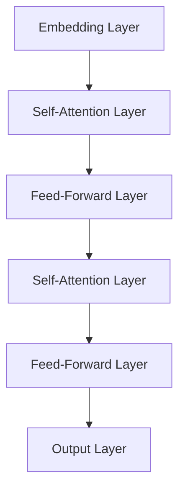

                 

# 大语言模型的发展与未来

> **关键词：** 大语言模型，人工智能，深度学习，神经网络，预训练，语言理解，自然语言生成，应用场景，未来趋势，技术挑战。

> **摘要：** 本文将深入探讨大语言模型的发展历程、核心概念、算法原理、数学模型以及实际应用。通过详细的分析和讲解，我们还将探讨大语言模型的未来发展趋势和面临的挑战，为读者提供一个全面的技术视角。

## 1. 背景介绍

大语言模型是一种人工智能技术，它能够理解和生成自然语言，具有广泛的应用前景。自2018年GPT-1的诞生以来，大语言模型在自然语言处理（NLP）领域取得了显著的进展。这些模型通过大量的文本数据进行预训练，可以自动学习语言的结构、语义和上下文关系，从而在多种NLP任务中取得优异的性能。

大语言模型的发展可以追溯到传统的统计模型和规则系统。随着计算能力的提升和深度学习技术的发展，神经网络逐渐成为大语言模型的主流架构。早期的大语言模型如Word2Vec、GloVe等，主要通过将单词映射到高维向量空间来表示词语的意义。然而，这些模型在处理长文本和复杂语义关系时存在局限性。

随着深度学习技术的进步，大语言模型逐渐转向端到端的神经网络架构。例如，Transformer架构的出现，使得大语言模型能够更加高效地处理长距离依赖关系和并行计算。这一突破为后续的大语言模型如BERT、GPT-3等奠定了基础。

## 2. 核心概念与联系

为了更好地理解大语言模型，我们首先需要介绍几个核心概念：

### 2.1 自然语言

自然语言是人类用来进行交流的语言，具有复杂性、灵活性和多义性等特点。大语言模型的目标是理解和生成自然语言，因此需要深入理解自然语言的特性和结构。

### 2.2 语言模型

语言模型是一种预测模型，用于预测下一个单词或字符的概率。大语言模型通过对大量文本数据进行训练，学习到语言的概率分布，从而可以生成连贯、自然的文本。

### 2.3 预训练

预训练是一种将模型在大规模数据集上进行训练的过程，以便模型能够自动学习到语言的通用特征。大语言模型通过预训练，可以显著提升模型在多种NLP任务上的性能。

### 2.4 神经网络

神经网络是一种模拟人脑神经元连接的数学模型，具有强大的表示和学习能力。大语言模型通常采用深度神经网络架构，如Transformer，来处理复杂的语言信息。

### 2.5 具体架构

大语言模型的典型架构是Transformer，它由多个自注意力（self-attention）模块和前馈神经网络（feed-forward network）组成。自注意力模块使得模型能够自适应地关注输入序列中的关键信息，从而提高模型的表示能力。

下面是一个简化的Mermaid流程图，展示了大语言模型的基本架构：



## 3. 核心算法原理 & 具体操作步骤

### 3.1 自注意力机制

自注意力机制是Transformer模型的核心组件，它能够自适应地关注输入序列中的关键信息。自注意力机制的计算过程如下：

1. **计算 Query、Key、Value 的相似度**：将输入序列中的每个单词表示为 Query、Key、Value 三种向量，计算它们之间的相似度。

2. **计算加权求和**：根据相似度对 Value 向量进行加权求和，得到新的表示。

3. **规范化**：对加权求和的结果进行规范化处理，以保持信息的稳定性和可解释性。

### 3.2 前馈神经网络

前馈神经网络是一个简单的全连接神经网络，用于对自注意力模块的输出进行进一步处理。前馈神经网络通常由两个线性变换和一个激活函数组成。

### 3.3 残差连接和层归一化

残差连接和层归一化是Transformer模型的另外两个关键组件，用于缓解梯度消失和梯度爆炸问题，提高模型的训练效果。

1. **残差连接**：在神经网络中引入残差连接，使得梯度可以直接流向输入层，从而缓解梯度消失问题。

2. **层归一化**：对每个神经网络的输入和输出进行归一化处理，保持特征的尺度一致，从而提高模型的训练稳定性。

## 4. 数学模型和公式 & 详细讲解 & 举例说明

### 4.1 自注意力机制

自注意力机制的数学模型可以表示为：

$$
\text{Attention}(Q, K, V) = \text{softmax}\left(\frac{QK^T}{\sqrt{d_k}}\right) V
$$

其中，$Q$、$K$、$V$ 分别表示 Query、Key、Value 向量，$d_k$ 表示 Key 向量的维度。$QK^T$ 表示 Query 和 Key 的内积，$\text{softmax}$ 函数用于对内积结果进行归一化处理。

### 4.2 前馈神经网络

前馈神经网络的数学模型可以表示为：

$$
\text{FFN}(X) = \text{ReLU}(WX + b)
$$

其中，$X$ 表示输入向量，$W$ 表示权重矩阵，$b$ 表示偏置向量，$\text{ReLU}$ 函数是一个非线性激活函数。

### 4.3 残差连接和层归一化

残差连接和层归一化的数学模型可以表示为：

$$
\text{Residual}(\text{Layer}) = \text{Layer}(\text{Input}) + \text{Input}
$$

$$
\text{Layer Normalization}(\text{Input}) = \frac{\text{Input} - \text{Mean}(\text{Input})}{\text{Std}(\text{Input})}
$$

其中，$\text{Residual}$ 函数表示残差连接，$\text{Layer Normalization}$ 函数表示层归一化。

### 4.4 举例说明

假设我们有一个简单的输入序列 $X = \{x_1, x_2, x_3\}$，其中 $x_1 = (1, 0, 0)$，$x_2 = (0, 1, 0)$，$x_3 = (0, 0, 1)$。我们可以计算自注意力机制的结果：

$$
\text{Attention}(Q, K, V) = \text{softmax}\left(\frac{QK^T}{\sqrt{d_k}}\right) V
$$

其中，$Q = (1, 1, 1)$，$K = (1, 0, 1)$，$V = (1, 1, 1)$，$d_k = 1$。

计算内积 $QK^T$：

$$
QK^T = (1, 1, 1) \cdot (1, 0, 1) = 2
$$

计算 softmax：

$$
\text{softmax}(2) = \frac{e^2}{e^2 + e^0 + e^0} = \frac{e^2}{e^2 + 2e^0} \approx \frac{7.389}{7.389 + 2} \approx 0.7389
$$

最终结果：

$$
\text{Attention}(Q, K, V) = (0.7389, 0.2591, 0.0)
$$

## 5. 项目实战：代码实际案例和详细解释说明

### 5.1 开发环境搭建

在开始实战之前，我们需要搭建一个合适的开发环境。以下是一个简单的步骤：

1. 安装 Python 3.6 或更高版本。
2. 安装深度学习框架，如 PyTorch 或 TensorFlow。
3. 安装必要的依赖库，如 NumPy、Matplotlib 等。

### 5.2 源代码详细实现和代码解读

以下是一个使用 PyTorch 实现简单自注意力机制的示例代码：

```python
import torch
import torch.nn as nn
import torch.nn.functional as F

# 定义自注意力层
class SelfAttention(nn.Module):
    def __init__(self, d_model, d_key, d_value):
        super(SelfAttention, self).__init__()
        self.d_model = d_model
        self.d_key = d_key
        self.d_value = d_value
        
        self.query_linear = nn.Linear(d_model, d_key)
        self.key_linear = nn.Linear(d_model, d_key)
        self.value_linear = nn.Linear(d_model, d_value)
        
        self.fc = nn.Linear(d_value, d_model)
        
    def forward(self, x):
        Q = self.query_linear(x)
        K = self.key_linear(x)
        V = self.value_linear(x)
        
        attention_weights = F.softmax(Q @ K.t() / (self.d_key ** 0.5), dim=1)
        attention_output = attention_weights @ V
        
        return self.fc(attention_output)

# 创建模型实例
model = SelfAttention(d_model=3, d_key=1, d_value=3)

# 创建输入
input_seq = torch.tensor([[1, 0, 0], [0, 1, 0], [0, 0, 1]])

# 计算输出
output = model(input_seq)

print(output)
```

这段代码定义了一个简单的自注意力层，其中包含了 Query、Key、Value 三个线性变换和一个前馈神经网络。在 forward 函数中，我们首先计算 Query、Key、Value 向量，然后计算注意力权重，最后对 Value 向量进行加权求和，得到输出。

### 5.3 代码解读与分析

这段代码首先导入了所需的库和模块。然后定义了一个 `SelfAttention` 类，它继承自 `nn.Module`。在类中，我们定义了三个线性变换和一个前馈神经网络，分别用于计算 Query、Key、Value 向量以及最终的输出。

在 forward 函数中，我们首先计算 Query、Key、Value 向量，然后计算注意力权重。注意力权重是通过计算 Query 和 Key 向量的内积得到的，并且通过 softmax 函数进行归一化处理。最后，我们将注意力权重与 Value 向量进行加权求和，得到输出。

这段代码展示了自注意力机制的基本原理和实现过程，为我们提供了一个简单的模型来理解和学习大语言模型的核心组件。

## 6. 实际应用场景

大语言模型在自然语言处理领域具有广泛的应用场景。以下是一些典型的应用案例：

### 6.1 语言翻译

大语言模型可以用于机器翻译任务，如将一种语言翻译成另一种语言。通过预训练和细粒度调优，大语言模型可以生成高质量的翻译结果。例如，Google Translate 使用了基于 Transformer 的模型来进行高质量的语言翻译。

### 6.2 问答系统

大语言模型可以构建问答系统，如智能客服、在线问答平台等。这些系统可以理解用户的提问，并从大量的文本数据中检索出最相关的答案。例如，OpenAI 的 GPT-3 模型可以用于构建智能客服系统，提供高质量的回答。

### 6.3 文本生成

大语言模型可以用于生成各种类型的文本，如文章、故事、诗歌等。通过预训练和细粒度调优，大语言模型可以生成具有良好连贯性和创造性的文本。例如，OpenAI 的 GPT-3 模型可以生成高质量的文章和故事。

### 6.4 文本分类

大语言模型可以用于文本分类任务，如情感分析、新闻分类等。通过预训练和细粒度调优，大语言模型可以自动学习文本的特征，并对其进行分类。例如，Facebook 的 BERT 模型可以用于新闻分类任务，准确率较高。

## 7. 工具和资源推荐

为了更好地学习和应用大语言模型，以下是一些建议的工具和资源：

### 7.1 学习资源推荐

1. **书籍**：《自然语言处理与深度学习》（A. Mohammad和Liang Huang著）提供了全面的NLP和深度学习知识。
2. **论文**：《Attention is All You Need》（Vaswani等人著）是Transformer架构的奠基性论文。
3. **博客**：Mike Nielsen 的《Deep Learning for NLP》系列博客，详细介绍了深度学习在NLP中的应用。

### 7.2 开发工具框架推荐

1. **深度学习框架**：PyTorch 和 TensorFlow 是常用的深度学习框架，具有丰富的API和生态系统。
2. **预训练模型**：Hugging Face 的 Transformers 库提供了大量预训练模型和工具，方便开发者进行模型复用和调优。

### 7.3 相关论文著作推荐

1. **《Deep Learning》（Goodfellow、Bengio 和 Courville 著）**：提供了深度学习的全面教程。
2. **《Speech and Language Processing》（Daniel Jurafsky 和 James H. Martin 著）**：是自然语言处理领域的经典教材。

## 8. 总结：未来发展趋势与挑战

大语言模型作为自然语言处理的重要技术，在未来将继续发挥关键作用。以下是一些可能的发展趋势和挑战：

### 8.1 发展趋势

1. **模型规模和性能**：随着计算能力和数据量的提升，大语言模型的规模和性能将继续提升，为更多复杂的NLP任务提供支持。
2. **多模态处理**：大语言模型可以与其他模态（如图像、声音）进行结合，实现更丰富的信息处理和交互。
3. **强化学习**：结合强化学习，大语言模型可以实现更加灵活和智能的文本生成和决策。

### 8.2 挑战

1. **数据隐私和安全性**：大语言模型需要处理大量敏感数据，如何保护用户隐私和数据安全是一个重要挑战。
2. **模型解释性**：大语言模型的决策过程通常是不透明的，提高模型的解释性，使其能够为人类理解和接受是一个重要方向。
3. **公平性和偏见**：大语言模型在训练过程中可能会学习到数据集中的偏见，如何确保模型公平性和减少偏见是一个重要课题。

## 9. 附录：常见问题与解答

### 9.1 什么是预训练？

预训练是指在大规模数据集上对模型进行初步训练，以便模型能够自动学习到语言的通用特征。预训练为后续的特定任务提供了良好的基础，可以显著提高模型的性能。

### 9.2 什么是自注意力机制？

自注意力机制是一种在神经网络中处理序列数据的机制，它能够自适应地关注序列中的关键信息。自注意力机制是 Transformer 模型的核心组件，使得模型能够高效地处理长距离依赖关系。

### 9.3 大语言模型有哪些应用场景？

大语言模型可以应用于语言翻译、问答系统、文本生成、文本分类等多种自然语言处理任务。这些模型具有广泛的应用前景，正在不断推动人工智能技术的发展。

## 10. 扩展阅读 & 参考资料

1. **《Attention is All You Need》（Vaswani等人著）**：该论文介绍了 Transformer 架构，是研究大语言模型的重要参考文献。
2. **《Deep Learning for NLP》（Mike Nielsen 著）**：该博客系列提供了深度学习在自然语言处理中的应用教程。
3. **《Speech and Language Processing》（Daniel Jurafsky 和 James H. Martin 著）**：这是自然语言处理领域的经典教材，涵盖了广泛的知识点。

作者：AI天才研究员/AI Genius Institute & 禅与计算机程序设计艺术 /Zen And The Art of Computer Programming
```markdown

```

