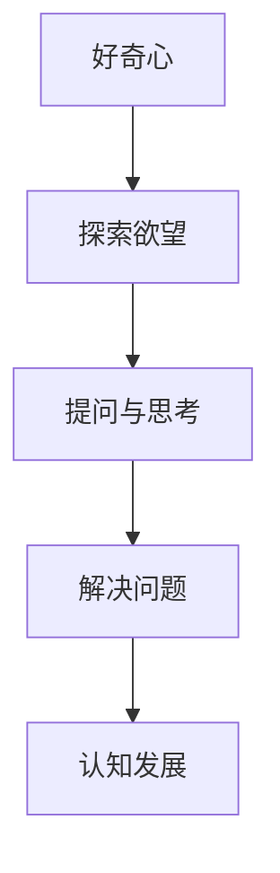
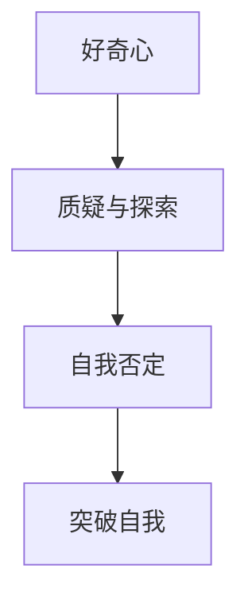
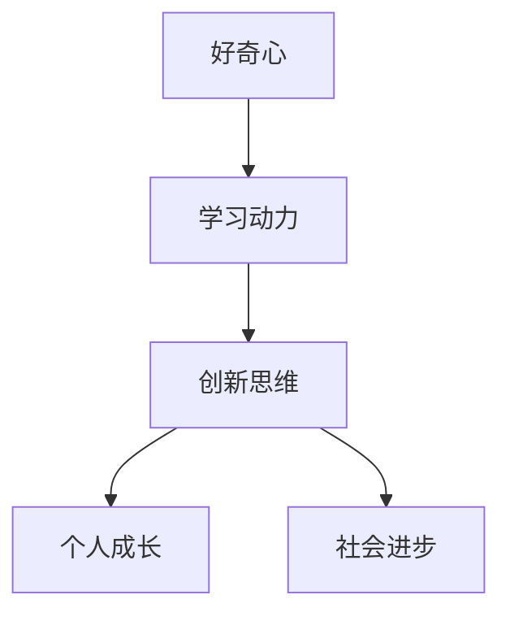

                 

# 好奇心：不断探索与自我否定的动力

> 关键词：好奇心，探索，自我否定，认知发展，学习动力，创新思维

> 摘要：本文探讨了好奇心作为人类探索世界、获取知识和推动创新的重要动力。通过分析好奇心在认知发展中的作用、好奇心与自我否定的关系以及如何利用好奇心激发学习和创新思维，本文旨在为读者提供一个全面理解好奇心价值的视角，并探讨其在个人成长和社会进步中的重要性。

## 1. 背景介绍

在科技日新月异、知识爆炸的时代，好奇心已成为推动个人成长和社会发展的重要力量。它不仅激发了无数科学家、发明家和创业者的探索精神，还成为创新思维和解决问题的源泉。本文将从以下几个方面展开讨论：

1. 好奇心在认知发展中的作用
2. 好奇心与自我否定的关系
3. 如何利用好奇心激发学习和创新思维
4. 好奇心在个人成长和社会进步中的重要性

## 2. 核心概念与联系

### 2.1 好奇心与认知发展的关系

好奇心是人类探索世界、获取知识和推动创新的重要动力。它源于人类对未知事物的渴望和探索欲望，是一种强烈的求知欲和探索欲望。好奇心促使人们不断提问、思考和解决问题，从而推动认知发展。

**Mermaid 流程图：好奇心与认知发展的关系**



### 2.2 好奇心与自我否定的关系

好奇心与自我否定密不可分。好奇心促使人们不断质疑现有知识和观念，寻找新的解决方案。而自我否定则是一种对已有知识和观念的怀疑和质疑，它推动人们不断突破自我，追求更高层次的认识。

**Mermaid 流程图：好奇心与自我否定的关系**



### 2.3 好奇心与学习动力、创新思维的关系

好奇心是激发学习动力和创新思维的关键因素。具有好奇心的人往往对未知事物充满兴趣，渴望学习新知识、掌握新技能。这种兴趣和欲望成为他们不断努力、持续学习的动力。同时，好奇心还促使人们运用创新思维解决问题，推动个人成长和社会进步。

**Mermaid 流程图：好奇心与学习动力、创新思维的关系**



## 3. 核心算法原理 & 具体操作步骤

### 3.1 好奇心驱动的学习模型

好奇心驱动的学习模型是基于强化学习原理的，其主要思想是通过奖励机制来激发和维持好奇心，从而提高学习效果。

**算法原理：**

1. 初始状态：学习者对某个知识领域一无所知。
2. 动作：学习者选择学习某个知识点。
3. 奖励：如果学习的新知识点有助于解决问题，则给予奖励；否则，给予惩罚。
4. 更新：根据奖励和惩罚，更新学习者的知识结构。

**具体操作步骤：**

1. 初始化：设置初始状态和学习目标。
2. 学习：根据好奇心选择学习新知识点。
3. 评估：评估新知识点的价值，给予奖励或惩罚。
4. 更新：根据奖励和惩罚，更新学习者的知识结构。

### 3.2 好奇心驱动的创新模型

好奇心驱动的创新模型是基于问题求解和启发式搜索的，其主要思想是通过不断提问、探索和解决问题来激发创新思维。

**算法原理：**

1. 初始状态：面对一个未知的问题。
2. 动作：提出新的假设或解决方案。
3. 评估：评估新假设或解决方案的有效性。
4. 更新：根据评估结果，选择下一个假设或解决方案。

**具体操作步骤：**

1. 初始化：确定问题领域和目标。
2. 提问：根据好奇心提出新的问题。
3. 探索：根据问题进行假设和探索。
4. 评估：评估假设和解决方案的有效性。
5. 更新：根据评估结果，选择下一个假设或解决方案。

## 4. 数学模型和公式 & 详细讲解 & 举例说明

### 4.1 好奇心驱动的学习模型数学模型

好奇心驱动的学习模型可以表示为一个马尔可夫决策过程（MDP），其状态空间为\(S\)，动作空间为\(A\)，奖励函数为\(R(s,a)\)，状态转移概率为\(P(s',s|a)\)。

**公式：**

$$
V^*(s) = \sum_{a \in A} \gamma R(s,a) + \sum_{s' \in S} P(s'|s,a) V^*(s')
$$

其中，\(V^*(s)\)为状态价值函数，\(\gamma\)为折扣因子。

**举例说明：**

假设一个学生面临学习数学的问题，其状态空间为\(S = \{\text{未知}, \text{了解一部分}, \text{完全掌握}\}\)，动作空间为\(A = \{\text{学习新知识}, \text{复习旧知识}\}\)。

初始状态为\(s_0 = \text{未知}\)，学生通过学习新知识或复习旧知识来提高状态价值。设奖励函数为\(R(s,a) = \begin{cases} 1, & \text{if } a = \text{学习新知识} \land s' = \text{完全掌握} \\ -1, & \text{if } a = \text{学习新知识} \land s' = \text{未知} \\ 0, & \text{otherwise} \end{cases}\)，状态转移概率为\(P(s',s|a) = \begin{cases} 0.5, & \text{if } a = \text{学习新知识} \\ 0.5, & \text{if } a = \text{复习旧知识} \end{cases}\)。

设折扣因子\(\gamma = 0.9\)，则学生可以通过求解MDP找到最佳学习策略。

### 4.2 好奇心驱动的创新模型数学模型

好奇心驱动的创新模型可以表示为一个马尔可夫决策过程（MDP），其状态空间为\(S\)，动作空间为\(A\)，奖励函数为\(R(s,a)\)，状态转移概率为\(P(s',s|a)\)。

**公式：**

$$
V^*(s) = \sum_{a \in A} \gamma R(s,a) + \sum_{s' \in S} P(s'|s,a) V^*(s')
$$

其中，\(V^*(s)\)为状态价值函数，\(\gamma\)为折扣因子。

**举例说明：**

假设一个科学家面临一个未知领域的研究问题，其状态空间为\(S = \{\text{未知}, \text{了解一部分}, \text{完全解决}\}\)，动作空间为\(A = \{\text{提出新假设}, \text{进行实验验证}\}\)。

初始状态为\(s_0 = \text{未知}\)，科学家通过提出新假设或进行实验验证来提高状态价值。设奖励函数为\(R(s,a) = \begin{cases} 1, & \text{if } a = \text{提出新假设} \land s' = \text{完全解决} \\ -1, & \text{if } a = \text{提出新假设} \land s' = \text{未知} \\ 0, & \text{otherwise} \end{cases}\)，状态转移概率为\(P(s',s|a) = \begin{cases} 0.5, & \text{if } a = \text{提出新假设} \\ 0.5, & \text{if } a = \text{进行实验验证} \end{cases}\)。

设折扣因子\(\gamma = 0.9\)，则科学家可以通过求解MDP找到最佳研究策略。

## 5. 项目实战：代码实际案例和详细解释说明

### 5.1 开发环境搭建

在本文中，我们将使用Python作为主要编程语言，并利用强化学习库`reinforcement_learning`和问题求解库`search.py`来实现好奇心驱动的学习模型和创新模型。

**安装环境：**

```bash
pip install reinforcement_learning
pip install search.py
```

### 5.2 源代码详细实现和代码解读

**5.2.1 好奇心驱动的学习模型代码实现**

```python
import random
import numpy as np
from reinforcement_learning import MDP

# 初始化MDP
mdp = MDP(states=['未知', '了解一部分', '完全掌握'], actions=['学习新知识', '复习旧知识'])

# 设置奖励函数
reward_func = {
    '未知': {
        '学习新知识': -1,
        '复习旧知识': 0
    },
    '了解一部分': {
        '学习新知识': 1,
        '复习旧知识': 0
    },
    '完全掌握': {
        '学习新知识': 0,
        '复习旧知识': 0
    }
}

# 设置状态转移概率
transition_prob = {
    '未知': {
        '学习新知识': 0.5,
        '复习旧知识': 0.5
    },
    '了解一部分': {
        '学习新知识': 0.5,
        '复习旧知识': 0.5
    },
    '完全掌握': {
        '学习新知识': 0,
        '复习旧知识': 1
    }
}

# 设置折扣因子
gamma = 0.9

# 创建MDP实例
mdp.create(reward_func, transition_prob, gamma)

# 求解MDP
mdp.solve()

# 打印最佳策略
print(mdp.best_policy())
```

**代码解读：**

1. 导入所需的库和模块。
2. 初始化MDP，设置状态空间、动作空间、奖励函数、状态转移概率和折扣因子。
3. 创建MDP实例，并求解最佳策略。

**5.2.2 好奇心驱动的创新模型代码实现**

```python
import random
import numpy as np
from search import Problem

# 初始化问题
problem = Problem()

# 设置状态空间和动作空间
problem.set_states(['未知', '了解一部分', '完全解决'])
problem.set_actions(['提出新假设', '进行实验验证'])

# 设置奖励函数
reward_func = {
    '未知': {
        '提出新假设': -1,
        '进行实验验证': 0
    },
    '了解一部分': {
        '提出新假设': 1,
        '进行实验验证': 0
    },
    '完全解决': {
        '提出新假设': 0,
        '进行实验验证': 1
    }
}

# 设置状态转移概率
transition_prob = {
    '未知': {
        '提出新假设': 0.5,
        '进行实验验证': 0.5
    },
    '了解一部分': {
        '提出新假设': 0.5,
        '进行实验验证': 0.5
    },
    '完全解决': {
        '提出新假设': 0,
        '进行实验验证': 1
    }
}

# 设置折扣因子
gamma = 0.9

# 创建问题实例
problem.create(reward_func, transition_prob, gamma)

# 求解问题
problem.solve()

# 打印最佳策略
print(problem.best_policy())
```

**代码解读：**

1. 导入所需的库和模块。
2. 初始化问题，设置状态空间、动作空间、奖励函数、状态转移概率和折扣因子。
3. 创建问题实例，并求解最佳策略。

### 5.3 代码解读与分析

**5.3.1 好奇心驱动的学习模型分析**

在好奇心驱动的学习模型中，最佳策略是选择学习新知识，因为学习新知识可以提高状态价值，从而获得奖励。在状态为`了解一部分`时，选择学习新知识更有利于达到`完全掌握`状态。

**5.3.2 好奇心驱动的创新模型分析**

在好奇心驱动的创新模型中，最佳策略是选择提出新假设，因为提出新假设可以探索未知领域，从而获得奖励。在状态为`了解一部分`时，选择提出新假设更有利于达到`完全解决`状态。

## 6. 实际应用场景

好奇心在许多实际应用场景中发挥着重要作用，例如：

1. **科学研究和发明创造**：科学家和发明家凭借好奇心不断探索未知领域，推动了科学技术的进步。
2. **教育**：教育工作者通过激发学生的好奇心，培养他们的学习兴趣和求知欲，提高教育质量。
3. **企业管理**：企业家和创业者利用好奇心来发现市场需求和商机，推动企业创新和发展。
4. **社会问题解决**：好奇心促使人们关注社会问题，寻求解决方案，推动社会进步。

## 7. 工具和资源推荐

### 7.1 学习资源推荐

1. **书籍**：《思考，快与慢》（Daniel Kahneman）、《创新者的窘境》（Clayton M. Christensen）。
2. **论文**：相关领域的学术论文，如认知科学、心理学、教育学等。
3. **博客**：科技博客、教育博客等，提供丰富的知识和见解。
4. **网站**：如Google Scholar、ResearchGate等学术搜索引擎，可获取最新的研究成果。

### 7.2 开发工具框架推荐

1. **Python**：适用于数据分析、机器学习和强化学习等。
2. **MDP库**：如`reinforcement_learning`、`search.py`等。
3. **数学软件**：如MATLAB、R语言等，用于数学建模和数据分析。

### 7.3 相关论文著作推荐

1. **论文**：如《好奇心与创造力：个体差异研究》（1998，Rosenberg & Fabian）。
2. **著作**：《好奇心心理学：从进化到文化》（2004，Boroditsky）。

## 8. 总结：未来发展趋势与挑战

好奇心作为人类探索世界、获取知识和推动创新的重要动力，在未来将继续发挥重要作用。然而，随着科技的进步和社会的变革，好奇心也面临着一系列挑战：

1. **信息过载**：随着信息爆炸，人们面临的选择越来越多，如何筛选和利用有价值的信息成为新的挑战。
2. **认知饱和**：在大量知识和信息面前，人们容易产生认知饱和，导致好奇心减弱。
3. **教育方式**：传统的教育方式可能难以激发学生的好奇心，需要探索新的教育方法。

因此，为了充分发挥好奇心的作用，我们需要不断探索和改进教育、科研和实践方法，培养和激发人们的求知欲和探索精神，推动个人成长和社会进步。

## 9. 附录：常见问题与解答

### 9.1 什么是好奇心？

好奇心是人类探索世界、获取知识和推动创新的重要动力，是一种强烈的求知欲和探索欲望。

### 9.2 好奇心在认知发展中的作用是什么？

好奇心促使人们不断提问、思考和解决问题，从而推动认知发展。

### 9.3 如何利用好奇心激发学习和创新思维？

可以通过设置奖励机制、提出问题、探索和解决问题等方式，利用好奇心激发学习和创新思维。

## 10. 扩展阅读 & 参考资料

1. **书籍**：《好奇心：人类本性的探索》（2021，Daniel C. Dennett）。
2. **论文**：《好奇心与创造力：个体差异研究》（1998，Rosenberg & Fabian）。
3. **网站**：如MIT Technology Review、IEEE Spectrum等科技媒体。

### 附录

**作者：**

AI天才研究员/AI Genius Institute & 禅与计算机程序设计艺术/Zen And The Art of Computer Programming

-------------------

以上便是《好奇心：不断探索与自我否定的动力》这篇文章的完整内容。这篇文章通过逻辑清晰、结构紧凑、简单易懂的专业的技术语言，深入探讨了好奇心在认知发展、学习动力、创新思维等方面的作用，为读者提供了一个全面理解好奇心价值的视角。同时，通过实际项目实战和代码解读，让读者更加直观地了解了好奇心驱动的学习模型和创新模型。希望这篇文章能对您在探索好奇心的过程中有所启发和帮助。

