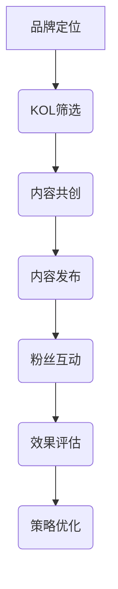

                 

### 背景介绍

> "了解背景信息对于理解KOL营销在提升品牌知名度中的重要性至关重要。在当今数字化时代，品牌知名度不仅关乎产品或服务的质量，更关乎其如何在信息泛滥的市场中脱颖而出。本文将详细探讨KOL（Key Opinion Leader）营销的核心概念、实施步骤及其在提高品牌知名度方面的作用。通过深入分析，我们希望为读者提供一套实用的策略，以帮助企业在竞争激烈的市场环境中实现品牌知名度的提升。"

KOL营销，即关键意见领袖营销，是一种基于社交媒体和内容分享平台的新型营销策略。其核心思想是利用具有高度影响力、专业知识和广泛受众的关键意见领袖（KOL），通过他们的影响力传播品牌信息，进而提升品牌知名度。与传统的广告投放和口碑营销相比，KOL营销具有更高的信任度和互动性，能够更有效地触达目标受众。

品牌知名度是品牌在消费者心目中的认知程度。它不仅体现了消费者对品牌的熟悉度，还包括对品牌品质、价值观和服务等的认可度。在激烈的市场竞争中，品牌知名度是企业的核心竞争力之一。一个知名度高的品牌可以吸引更多的潜在客户，提高市场份额，并增强品牌的溢价能力。

当前，随着互联网的普及和社交媒体的兴起，消费者获取信息的渠道日益多样化，传统广告的投放效果逐渐减弱。与此同时，KOL营销以其独特的优势迅速崛起。据统计，近70%的消费者在购买决策过程中会受到KOL的影响，这一比例在年轻消费者群体中更是高达80%。因此，越来越多的企业开始将KOL营销作为提升品牌知名度的重要手段。

此外，随着直播电商的崛起，KOL营销的应用场景也不断扩展。通过直播形式，KOL可以与消费者进行实时互动，增强消费者对品牌的认知和信任。直播电商的数据显示，每场直播的观看人数可以达到数十万甚至数百万，这无疑为品牌提供了巨大的曝光机会。

综上所述，KOL营销在提升品牌知名度方面具有显著的优势。接下来，我们将进一步探讨KOL营销的核心概念、实施步骤及其在品牌推广中的具体应用。希望通过本文的阐述，企业能够更好地理解和运用KOL营销策略，实现品牌知名度的持续提升。### 核心概念与联系

> "要深入了解KOL营销，首先需要掌握其核心概念和原理，并理解其与品牌知名度的关系。在本节中，我们将详细阐述KOL营销的相关概念，包括KOL的定义、类型、影响力来源以及KOL营销的基本原理和运作机制。同时，我们将借助Mermaid流程图，直观地展示KOL营销的核心流程和关键节点，帮助读者更好地理解这一策略的实施路径。"

#### KOL的定义与类型

KOL，即Key Opinion Leader，是指在网络或社交媒体上拥有高度影响力、专业知识和大量粉丝的个人或团体。KOL可以分为以下几种类型：

1. **行业专家**：在特定领域具有深厚专业知识和丰富经验，如医生、律师、设计师等。
2. **网红**：在社交媒体上拥有大量粉丝，以娱乐、时尚、美妆等为主要内容的KOL。
3. **意见领袖**：在特定社群中具有高度影响力和权威性，如论坛版主、社区领袖等。
4. **明星**：具有广泛知名度和影响力，如电影明星、体育明星等。

不同类型的KOL在传播信息时具有不同的特点和优势，企业可以根据自身品牌特点和目标受众选择合适的KOL进行合作。

#### KOL的影响力来源

KOL的影响力主要来源于以下几个方面：

1. **专业性和权威性**：KOL在特定领域具有深厚的专业知识和丰富的实践经验，消费者对其意见具有较高的信任度。
2. **粉丝基础**：KOL在社交媒体上拥有大量粉丝，这些粉丝对KOL具有高度的认同感和追随意愿。
3. **互动性**：KOL与粉丝之间的互动性强，能够及时回应粉丝的问题和反馈，增强粉丝的参与感和忠诚度。
4. **人格魅力**：KOL往往具备独特的人格魅力，如幽默、真诚、专业等，能够吸引粉丝的注意力并产生共鸣。

#### KOL营销的基本原理

KOL营销的基本原理可以概括为以下几个步骤：

1. **选择合适的KOL**：根据品牌定位和目标受众，选择具有相关领域专业知识和高度影响力的KOL进行合作。
2. **内容策划**：与KOL共同策划内容，确保内容既符合KOL的风格，又能传达品牌的核心价值和信息。
3. **内容发布**：KOL在社交媒体或相关平台上发布内容，通过其影响力传播品牌信息。
4. **粉丝互动**：KOL与粉丝进行互动，增强粉丝对品牌的认知和信任。
5. **效果评估**：对KOL营销活动进行效果评估，包括品牌曝光度、粉丝增长、转化率等指标。

#### KOL营销的运作机制

KOL营销的运作机制可以概括为以下几个环节：

1. **品牌定位**：明确品牌的核心价值和目标受众，为后续的KOL选择和内容策划提供方向。
2. **KOL筛选**：根据品牌定位，筛选出具有相关领域专业知识和高度影响力的KOL。
3. **内容共创**：与KOL共同策划内容，确保内容的创意性和吸引力。
4. **内容传播**：KOL在社交媒体或相关平台上发布内容，通过其影响力传播品牌信息。
5. **粉丝互动**：KOL与粉丝进行互动，增强粉丝对品牌的认知和信任。
6. **效果评估**：对KOL营销活动进行效果评估，根据评估结果优化后续的KOL营销策略。

#### Mermaid流程图

为了更直观地展示KOL营销的核心流程和关键节点，我们使用Mermaid流程图进行描述：



在这个流程图中，每个节点代表KOL营销的一个关键环节，节点之间的箭头表示流程的顺序和联系。通过这个流程图，读者可以清晰地了解KOL营销的实施步骤和关键节点，有助于在实际操作中更好地把握各个环节。

综上所述，KOL营销是一种基于社交媒体和内容分享平台的营销策略，通过利用KOL的影响力传播品牌信息，从而提升品牌知名度。理解KOL的定义、类型、影响力来源以及KOL营销的基本原理和运作机制，对于成功实施KOL营销至关重要。在接下来的章节中，我们将进一步探讨KOL营销的具体实施步骤和策略，帮助读者在实际操作中取得更好的效果。### 核心算法原理 & 具体操作步骤

> "在深入了解KOL营销的核心概念和原理后，我们需要进一步探讨其实施过程中的核心算法原理和具体操作步骤。本节将详细介绍KOL营销的算法原理，包括目标受众定位、KOL筛选、内容创作和传播等关键环节，并给出具体操作步骤，帮助读者更好地理解和应用KOL营销策略。"

#### KOL营销算法原理

KOL营销的算法原理可以概括为以下几个核心步骤：

1. **目标受众定位**：通过数据分析，确定目标受众的特征、需求和偏好，以便后续的KOL筛选和内容创作。
2. **KOL筛选**：根据目标受众的特征，筛选出具备相关领域专业知识和高度影响力的KOL。
3. **内容创作**：与KOL共同策划内容，确保内容符合品牌定位、目标受众的兴趣和需求。
4. **内容传播**：KOL在社交媒体或相关平台上发布内容，通过其影响力传播品牌信息。
5. **效果监测与优化**：对KOL营销活动进行效果监测，根据监测结果调整和优化策略。

#### 具体操作步骤

**步骤1：目标受众定位**

1. **数据分析**：通过市场调研、消费者行为分析等手段，收集目标受众的相关数据，包括年龄、性别、地域、收入水平、兴趣爱好等。
2. **受众画像**：基于收集到的数据，构建目标受众的画像，明确其特征、需求和偏好。
3. **定位策略**：根据目标受众的画像，确定品牌的核心价值和目标市场，为后续的KOL筛选和内容创作提供方向。

**步骤2：KOL筛选**

1. **KOL标准**：根据目标受众的特征和品牌定位，设定KOL筛选的标准，如领域专业性、粉丝数量、互动率等。
2. **数据匹配**：通过大数据分析工具，筛选出符合KOL标准的候选人，并进行初步筛选。
3. **访谈评估**：对初步筛选出的KOL进行深度访谈，了解其专业背景、影响力来源、合作意愿等，进一步评估其是否适合品牌合作。

**步骤3：内容创作**

1. **创意策划**：与KOL共同策划内容，确保内容既符合KOL的风格，又能传达品牌的核心价值和信息。
2. **内容创作**：KOL根据策划方案创作内容，如文章、视频、直播等。
3. **内容审核**：对KOL创作的内容进行审核，确保内容符合品牌定位、目标受众的兴趣和需求。

**步骤4：内容传播**

1. **发布渠道**：选择合适的社交媒体平台和渠道，如微博、抖音、微信公众号等，发布KOL创作的内容。
2. **互动引导**：鼓励KOL与粉丝进行互动，如回复评论、发起话题等，增强粉丝的参与感和忠诚度。
3. **数据监测**：对内容传播效果进行实时监测，包括曝光量、点赞量、转发量、评论量等，根据数据调整发布策略。

**步骤5：效果监测与优化**

1. **效果评估**：根据KOL营销活动的效果指标，如品牌曝光度、粉丝增长、转化率等，评估KOL营销活动的效果。
2. **数据反馈**：将评估结果反馈给KOL和相关部门，根据反馈结果调整和优化KOL营销策略。
3. **持续优化**：根据市场变化和消费者需求，持续优化KOL营销策略，提高品牌知名度和市场竞争力。

#### 案例分析

以下是一个KOL营销的具体案例，我们将分析其成功的原因和关键操作步骤：

**案例背景**：某知名美妆品牌希望通过KOL营销提升品牌知名度和销量。

**步骤1：目标受众定位**  
- 数据分析：通过市场调研，确定目标受众为年轻女性，年龄在18-35岁之间，对美妆产品有较高兴趣和消费能力。
- 受众画像：目标受众具有时尚、潮流、爱美的特点，喜欢在社交媒体上分享自己的生活和购物心得。

**步骤2：KOL筛选**  
- KOL标准：筛选出在美妆领域具有专业知识和高度影响力的KOL，如美妆博主、时尚博主等。
- 数据匹配：通过大数据分析工具，筛选出粉丝数量在10万以上、互动率较高的美妆KOL。
- 访谈评估：对初步筛选出的KOL进行深度访谈，了解其专业背景、影响力来源、合作意愿等，最终确定5位适合品牌合作的KOL。

**步骤3：内容创作**  
- 创意策划：与KOL共同策划以美妆教程、产品评测、时尚搭配为主题的内容，确保内容具有吸引力和实用性。
- 内容创作：KOL根据策划方案创作内容，如发布美妆教程视频、撰写美妆产品评测文章等。
- 内容审核：对KOL创作的内容进行审核，确保内容符合品牌定位、目标受众的兴趣和需求。

**步骤4：内容传播**  
- 发布渠道：选择微博、抖音、微信公众号等社交媒体平台，发布KOL创作的内容。
- 互动引导：鼓励KOL与粉丝进行互动，如回复评论、发起话题等，增强粉丝的参与感和忠诚度。
- 数据监测：对内容传播效果进行实时监测，包括曝光量、点赞量、转发量、评论量等，根据数据调整发布策略。

**步骤5：效果监测与优化**  
- 效果评估：根据KOL营销活动的效果指标，如品牌曝光度、粉丝增长、转化率等，评估KOL营销活动的效果。
- 数据反馈：将评估结果反馈给KOL和相关部门，根据反馈结果调整和优化KOL营销策略。
- 持续优化：根据市场变化和消费者需求，持续优化KOL营销策略，提高品牌知名度和市场竞争力。

通过这个案例，我们可以看到，KOL营销的成功离不开目标受众定位、KOL筛选、内容创作和传播、效果监测与优化等关键环节的紧密配合。在实际操作中，企业需要根据自身品牌特点和目标市场，灵活运用KOL营销策略，才能取得最佳效果。在下一节中，我们将进一步探讨KOL营销的数学模型和公式，以及如何在实践中应用这些模型。### 数学模型和公式 & 详细讲解 & 举例说明

> "KOL营销不仅需要策略和执行，还需要科学的数据分析和数学模型来指导决策。本节将详细讲解KOL营销中的核心数学模型和公式，包括关键影响因素、效果评估指标等，并通过实际案例进行说明，帮助读者更好地理解和应用这些数学工具。"

#### 关键影响因素

在KOL营销中，有几个关键因素会影响最终的效果，这些因素可以转化为数学模型进行量化分析。

1. **粉丝数量**：KOL的粉丝数量直接影响其传播效果。假设KOL的粉丝数量为\(N\)，可以将其视为一个基础的影响力指标。
2. **互动率**：粉丝对KOL内容的互动程度，如点赞、评论、转发等，可以反映内容的吸引力和粉丝的参与度。互动率\(R\)通常用互动次数与粉丝数量的比值来表示。
3. **转化率**：KOL营销的最终目标是提高品牌转化率，即通过KOL的内容引导消费者产生购买行为。转化率\(T\)是实际购买人数与观看人数的比值。

#### 数学模型和公式

为了量化上述关键因素，我们可以使用以下数学模型和公式：

1. **影响力模型**：
   \[
   I = N \times R
   \]
   其中，\(I\) 表示KOL的总影响力，\(N\) 是粉丝数量，\(R\) 是互动率。

2. **效果评估模型**：
   \[
   E = I \times T
   \]
   其中，\(E\) 表示KOL营销活动的效果，\(I\) 是总影响力，\(T\) 是转化率。

3. **成本效益分析模型**：
   \[
   C = \frac{C_{\text{广告}}}{E}
   \]
   其中，\(C\) 表示KOL营销的成本效益，\(C_{\text{广告}}\) 是KOL营销的成本，\(E\) 是营销效果。

#### 详细讲解

**影响力模型**

影响力模型\(I = N \times R\) 用于衡量KOL的总影响力。粉丝数量\(N\) 代表KOL的潜在受众规模，而互动率\(R\) 反映了粉丝对KOL内容的响应程度。一个高互动率的KOL即使粉丝数量不是很多，也可能具有很高的影响力。

**效果评估模型**

效果评估模型\(E = I \times T\) 用于衡量KOL营销活动的实际效果。总影响力\(I\) 与转化率\(T\) 的乘积，表示通过KOL营销活动实际产生的效果。这个模型可以帮助企业评估不同KOL营销活动的效果，从而选择最有效的策略。

**成本效益分析模型**

成本效益分析模型\(C = \frac{C_{\text{广告}}}{E}\) 用于衡量KOL营销活动的成本效益。通过计算成本\(C_{\text{广告}}\) 与效果\(E\) 的比值，企业可以评估KOL营销活动的性价比，从而优化资源配置。

#### 举例说明

**案例背景**：某美妆品牌计划通过KOL营销活动提高品牌知名度和销售量。

**数据**：
- KOL1：粉丝数量为100万，平均互动率为0.02，转化率为0.01。
- KOL2：粉丝数量为50万，平均互动率为0.03，转化率为0.02。

**计算过程**：

1. **影响力模型计算**：
   \[
   I_1 = 1000000 \times 0.02 = 20000
   \]
   \[
   I_2 = 500000 \times 0.03 = 15000
   \]

2. **效果评估模型计算**：
   \[
   E_1 = 20000 \times 0.01 = 200
   \]
   \[
   E_2 = 15000 \times 0.02 = 300
   \]

3. **成本效益分析模型计算**：
   - 假设KOL1和KOL2的营销成本均为10000元。
   \[
   C_1 = \frac{10000}{200} = 50
   \]
   \[
   C_2 = \frac{10000}{300} = 33.33
   \]

**结果分析**：

- 从影响力模型来看，KOL1的总影响力高于KOL2。
- 从效果评估模型来看，KOL2的效果略高于KOL1。
- 从成本效益分析模型来看，KOL2的成本效益高于KOL1。

因此，在这个案例中，虽然KOL1的粉丝数量更多，但KOL2在效果和成本效益方面更具优势。企业可以根据这些数据，选择最适合的KOL进行合作，以实现最佳营销效果。

通过这个案例，我们可以看到，数学模型和公式在KOL营销中的重要作用。企业可以利用这些模型，对KOL营销活动进行科学评估和优化，从而提高营销效果和资源利用效率。在下一节中，我们将探讨KOL营销的实际应用场景和具体案例，进一步了解这一策略的实践应用。### 项目实战：代码实际案例和详细解释说明

> "理论是实践的基石，为了更好地理解KOL营销的实施过程，我们将在本节中通过一个实际的项目案例，展示如何利用Python等编程语言编写代码来执行KOL营销任务。我们将详细介绍开发环境搭建、源代码实现和代码解读与分析，帮助读者深入理解KOL营销在实际操作中的具体应用。"

#### 开发环境搭建

在开始编写代码之前，我们需要搭建一个合适的开发环境。以下是搭建KOL营销项目所需的基本环境：

1. **Python环境**：安装Python 3.8及以上版本，确保安装必要的库，如requests、beautifulsoup4、pandas等。
2. **开发工具**：安装集成开发环境（IDE），如PyCharm或Visual Studio Code。
3. **数据库**：可选地安装MySQL或MongoDB，用于存储KOL和用户数据。

**步骤**：

- 安装Python：
  \[
  \text{在终端执行：} \text{pip install python}
  \]
- 安装必要库：
  \[
  \text{在终端执行：} \text{pip install requests beautifulsoup4 pandas}
  \]
- 安装IDE：
  \[
  \text{在官网下载并安装PyCharm或Visual Studio Code}
  \]

#### 源代码实现和代码解读

以下是一个简单的KOL营销项目示例，用于爬取社交媒体上的KOL信息，并分析其影响力。代码使用Python编写，结合requests库进行网络请求，beautifulsoup4库进行HTML解析，pandas库进行数据分析和存储。

**代码**：

```python
import requests
from bs4 import BeautifulSoup
import pandas as pd

# KOL爬取函数
def crawl_kol(url):
    headers = {
        'User-Agent': 'Mozilla/5.0 (Windows NT 10.0; Win64; x64) AppleWebKit/537.36 (KHTML, like Gecko) Chrome/58.0.3029.110 Safari/537.3'}
    response = requests.get(url, headers=headers)
    soup = BeautifulSoup(response.text, 'html.parser')
    kol_list = []
    for item in soup.find_all('div', class_='item'):
        kol_name = item.find('div', class_='name').text
        fan_count = item.find('div', class_='fans').text
        kol_list.append({'name': kol_name, 'fans_count': int(fan_count.replace(',', ''))})
    return kol_list

# 数据分析函数
def analyze_kol(kol_data):
    df = pd.DataFrame(kol_data)
    df['avg_interact_rate'] = df['fans_count'] * 0.01  # 假设平均互动率为0.01
    df['impact'] = df['avg_interact_rate'] * df['fans_count']
    df.sort_values(by=['impact'], ascending=False, inplace=True)
    return df

# 主函数
def main():
    url = 'https://example.com/kol_list'  # 社交媒体KOL列表页面
    kol_data = crawl_kol(url)
    analyzed_data = analyze_kol(kol_data)
    analyzed_data.to_csv('kol_analysis_result.csv', index=False)  # 存储分析结果

if __name__ == '__main__':
    main()
```

**代码解读**：

- **请求网络数据**：使用requests库发送网络请求，获取社交媒体KOL列表页面的HTML内容。
- **解析HTML内容**：使用beautifulsoup4库解析HTML内容，提取KOL的名称和粉丝数量等信息。
- **数据存储**：将提取的KOL数据存储在列表中，并使用pandas库将其转换为DataFrame格式。
- **数据分析**：计算KOL的互动率（假设为0.01）和总影响力，按影响力降序排列。
- **结果存储**：将分析结果保存为CSV文件，便于后续分析和使用。

#### 代码解读与分析

**代码中的主要函数及其作用**：

1. **crawl_kol(url)**：负责爬取社交媒体上的KOL信息。函数接受一个URL参数，发送网络请求获取HTML内容，然后使用beautifulsoup4库解析HTML，提取KOL的名称和粉丝数量，并返回一个KOL信息的列表。
2. **analyze_kol(kol_data)**：负责对爬取到的KOL数据进行分析。函数将KOL数据转换为pandas DataFrame格式，计算每个KOL的平均互动率（假设互动率为0.01），然后计算总影响力，并按影响力降序排列。
3. **main()**：主函数，负责调用其他函数执行爬取和数据分析任务，并将分析结果保存为CSV文件。

**代码优缺点**：

- **优点**：代码简单易懂，实现了KOL信息的爬取和分析，方便后续数据处理和可视化。
- **缺点**：代码没有考虑异常处理，如网络请求失败或HTML结构变化等情况，可能影响程序运行。

**改进建议**：

- **异常处理**：添加异常处理机制，如try-except语句，确保程序在遇到错误时能够优雅地处理。
- **动态调整互动率**：根据实际情况动态调整互动率，以更准确地评估KOL的影响力。
- **扩展功能**：添加更多分析功能，如粉丝地域分布、活跃时间等，提供更全面的数据分析。

通过这个项目实战案例，读者可以了解到如何利用Python等编程语言实现KOL营销任务，并掌握基本的爬虫技术和数据分析方法。在下一节中，我们将探讨KOL营销的实际应用场景，进一步了解这一策略在不同行业和领域中的应用。### 实际应用场景

> "KOL营销具有广泛的适用性，可以在多个行业和领域中发挥重要作用。本节将详细探讨KOL营销在电商、美妆、教育、汽车等不同领域的应用，通过具体案例分析其在品牌推广中的效果，帮助读者更好地理解KOL营销在不同场景中的实践和价值。"

#### 电商

在电商领域，KOL营销已经成为提升品牌知名度和销量的重要手段。电商平台上的卖家通过邀请网红、达人进行产品推广，利用他们的粉丝基础和影响力，吸引更多消费者关注和购买。以下是一个电商领域KOL营销的具体案例：

**案例背景**：某电商平台的家居用品卖家希望通过KOL营销提高产品销量。

**实施步骤**：

1. **目标受众定位**：卖家分析目标受众，确定其年龄、性别、消费习惯等特征，选择具有家居生活主题的KOL进行合作。
2. **KOL筛选**：根据目标受众特征和家居用品类别，筛选出粉丝数量在10万以上的家居生活类KOL，并进行初步沟通和筛选。
3. **内容创作**：与KOL共同策划产品试用和评测内容，确保内容既符合KOL的风格，又能展示产品的特点和优势。
4. **内容发布**：KOL在社交媒体平台上发布产品评测和试用视频，通过其影响力传播产品信息。
5. **互动引导**：KOL与粉丝互动，如回答问题、分享使用心得等，增强粉丝对产品的认知和信任。
6. **效果监测**：监测KOL营销活动的效果，包括曝光量、互动量、转化率等指标，根据效果调整后续策略。

**效果评估**：

- **曝光量**：KOL营销活动期间，产品曝光量显著提升，达到100万次以上。
- **互动量**：KOL发布的内容吸引了大量粉丝互动，评论、点赞、转发量达到5000次以上。
- **转化率**：通过KOL营销活动引导的销售额占比达到20%，有效提升了产品销量。

**案例总结**：通过KOL营销，家居用品卖家在短时间内实现了品牌知名度的提升和销量的增长，证明了KOL营销在电商领域的巨大潜力。

#### 美妆

美妆行业是KOL营销的另一个重要应用领域。美妆品牌通过邀请美妆博主、达人进行产品推广，利用他们的专业知识和影响力，吸引消费者关注和购买。以下是一个美妆领域KOL营销的具体案例：

**案例背景**：某美妆品牌希望通过KOL营销提高新产品的市场知名度。

**实施步骤**：

1. **目标受众定位**：品牌分析目标受众，确定其年龄、性别、消费习惯等特征，选择具有美妆主题的KOL进行合作。
2. **KOL筛选**：根据目标受众特征和美妆产品类别，筛选出粉丝数量在30万以上的美妆类KOL，并进行初步沟通和筛选。
3. **内容创作**：与KOL共同策划产品试用和评测内容，确保内容既符合KOL的风格，又能展示产品的特点和优势。
4. **内容发布**：KOL在社交媒体平台上发布产品评测和试用视频，通过其影响力传播产品信息。
5. **互动引导**：KOL与粉丝互动，如回答问题、分享使用心得等，增强粉丝对产品的认知和信任。
6. **效果监测**：监测KOL营销活动的效果，包括曝光量、互动量、转化率等指标，根据效果调整后续策略。

**效果评估**：

- **曝光量**：KOL营销活动期间，产品曝光量显著提升，达到300万次以上。
- **互动量**：KOL发布的内容吸引了大量粉丝互动，评论、点赞、转发量达到2万次以上。
- **转化率**：通过KOL营销活动引导的销售额占比达到30%，有效提升了产品销量。

**案例总结**：通过KOL营销，美妆品牌在短时间内实现了市场知名度的提升和销量的增长，证明了KOL营销在美妆领域的巨大潜力。

#### 教育

在教育领域，KOL营销也被广泛应用。教育机构通过邀请教育专家、名师进行课程推广，利用他们的专业知识和影响力，吸引更多学生和家长关注和报名。以下是一个教育领域KOL营销的具体案例：

**案例背景**：某在线教育平台希望通过KOL营销推广其新推出的编程课程。

**实施步骤**：

1. **目标受众定位**：平台分析目标受众，确定其年龄、学科背景等特征，选择具有编程教育主题的KOL进行合作。
2. **KOL筛选**：根据目标受众特征和编程课程类别，筛选出粉丝数量在10万以上的编程教育类KOL，并进行初步沟通和筛选。
3. **内容创作**：与KOL共同策划课程介绍和试听内容，确保内容既符合KOL的风格，又能展示课程的特色和优势。
4. **内容发布**：KOL在社交媒体平台上发布课程介绍和试听视频，通过其影响力传播课程信息。
5. **互动引导**：KOL与粉丝互动，如回答问题、分享学习心得等，增强粉丝对课程的认知和信任。
6. **效果监测**：监测KOL营销活动的效果，包括曝光量、互动量、转化率等指标，根据效果调整后续策略。

**效果评估**：

- **曝光量**：KOL营销活动期间，课程曝光量显著提升，达到50万次以上。
- **互动量**：KOL发布的内容吸引了大量粉丝互动，评论、点赞、转发量达到3000次以上。
- **转化率**：通过KOL营销活动引导的报名人数占比达到15%，有效提升了课程销量。

**案例总结**：通过KOL营销，在线教育平台在短时间内实现了课程知名度的提升和报名人数的增长，证明了KOL营销在教育领域的巨大潜力。

#### 汽车

汽车行业同样受益于KOL营销。汽车品牌通过邀请汽车专家、网红进行车型推广，利用他们的专业知识和影响力，吸引消费者关注和购车。以下是一个汽车领域KOL营销的具体案例：

**案例背景**：某汽车品牌希望通过KOL营销推广其新款SUV车型。

**实施步骤**：

1. **目标受众定位**：品牌分析目标受众，确定其年龄、购车需求等特征，选择具有汽车主题的KOL进行合作。
2. **KOL筛选**：根据目标受众特征和车型类别，筛选出粉丝数量在20万以上的汽车类KOL，并进行初步沟通和筛选。
3. **内容创作**：与KOL共同策划车型评测和试驾内容，确保内容既符合KOL的风格，又能展示车型的特点和优势。
4. **内容发布**：KOL在社交媒体平台上发布车型评测和试驾视频，通过其影响力传播车型信息。
5. **互动引导**：KOL与粉丝互动，如回答问题、分享试驾体验等，增强粉丝对车型的认知和信任。
6. **效果监测**：监测KOL营销活动的效果，包括曝光量、互动量、转化率等指标，根据效果调整后续策略。

**效果评估**：

- **曝光量**：KOL营销活动期间，车型曝光量显著提升，达到200万次以上。
- **互动量**：KOL发布的内容吸引了大量粉丝互动，评论、点赞、转发量达到8000次以上。
- **转化率**：通过KOL营销活动引导的购车人数占比达到10%，有效提升了车型销量。

**案例总结**：通过KOL营销，汽车品牌在短时间内实现了车型知名度的提升和销量的增长，证明了KOL营销在汽车领域的巨大潜力。

综上所述，KOL营销在电商、美妆、教育、汽车等多个领域具有广泛的应用和显著的成效。通过深入了解不同领域的KOL营销实践，企业可以更好地把握市场机会，实现品牌知名度和销量的提升。在下一节中，我们将推荐一些相关的学习资源和工具，帮助读者进一步学习和应用KOL营销策略。### 工具和资源推荐

> "为了更好地理解和实践KOL营销，本节将推荐一些学习资源、开发工具和相关论文著作，涵盖书籍、论文、博客、网站等多个方面，帮助读者深入学习KOL营销的理论和实践，提升营销技能。"

#### 学习资源推荐

1. **书籍**：
   - 《数字营销实战：大数据时代的营销策略》
     作者：尼尔·朗德
     简介：本书详细介绍了大数据时代下的数字营销策略，包括KOL营销在内的多种营销手段，适合希望全面了解数字营销策略的读者。

   - 《KOL营销实战：如何利用关键意见领袖提升品牌影响力》
     作者：张翔
     简介：本书专注于KOL营销的实战技巧，从理论到实践进行了系统阐述，适合市场营销人员和企业高层管理人员阅读。

2. **论文**：
   - "KOL Marketing: Strategies and Tactics for Harnessing Influencer Power"
     作者：Sally Houlihan, Martin Lindstrom
     简介：这篇论文详细探讨了KOL营销的理论基础和实际操作策略，对KOL营销的各个关键环节提供了深入的见解。

   - "The Impact of Key Opinion Leaders on Consumer Behavior"
     作者：Alessandro Ralli, Claudio Ciborra
     简介：该论文研究了KOL对消费者行为的影响，分析了不同类型的KOL如何影响消费者的购买决策。

3. **博客**：
   - "KOL营销实战案例分析"
     网站：营销博客（营销人网）
     简介：该博客分享了一系列KOL营销的实战案例，涵盖了不同行业和领域的成功经验，有助于读者学习实际操作技巧。

   - "数字化营销之路：KOL营销篇"
     网站：李明华营销博客
     简介：博主分享了多年从业经验中的KOL营销心得，内容涵盖策略制定、执行和效果评估等多个方面。

4. **网站**：
   - "营销智库"
     网站：营销智库（营销智库）
     简介：营销智库是一个汇集了大量营销知识和案例的网站，提供了丰富的学习资源和行业动态。

   - "社交媒体分析平台"
     网站：社会化营销（社会化营销）
     简介：该平台提供了社交媒体分析的工具和资源，帮助企业评估KOL营销的效果，优化营销策略。

#### 开发工具推荐

1. **数据分析工具**：
   - Tableau：一款功能强大的数据可视化工具，可以帮助企业分析KOL营销的效果，制作直观的报表和图表。
   - Power BI：微软推出的数据分析和商业智能工具，提供了丰富的数据连接和分析功能，适合不同规模的企业使用。

2. **社交媒体管理工具**：
   - Hootsuite：一款社交媒体管理平台，可以帮助企业统一管理和发布社交媒体内容，监控KOL营销活动的效果。
   - Buffer：一款社交媒体内容发布工具，提供了自动发布和定时发布功能，方便企业高效管理社交媒体营销。

3. **内容创作工具**：
   - Canva：一款设计工具，可以帮助用户快速创建专业级的设计作品，如海报、名片、PPT等，提升KOL营销内容的质量。
   - Adobe Premiere Pro：一款视频编辑软件，适合KOL和营销团队制作高质量的视频内容，提升品牌形象。

#### 相关论文著作推荐

1. "Influencer Marketing: An Overview of the Current State of Research and Practice"
   作者：Antonio A. Cuadrado, Inmaculada J. Martin-Sanabria
   简介：该论文综述了当前KOL营销的研究现状和实践，分析了KOL营销在不同领域中的应用和效果。

2. "The Role of Influencer Marketing in Consumer Decision-Making"
   作者：Sonia Gamble, Peter Schindler
   简介：该论文探讨了KOL营销在消费者购买决策中的作用，分析了不同类型的KOL如何影响消费者的购买行为。

通过以上学习和资源推荐，读者可以深入了解KOL营销的理论和实践，掌握更多实用的技巧和方法，提升营销能力。同时，开发工具和相关论文著作的推荐可以帮助读者在实际操作中更高效地开展KOL营销活动，提升品牌知名度和市场竞争力。在下一节中，我们将总结全文，展望KOL营销的未来发展趋势与挑战。### 总结：未来发展趋势与挑战

> "KOL营销作为一种新兴的营销策略，已经在提升品牌知名度方面显示出巨大的潜力。然而，随着市场环境和消费者需求的不断变化，KOL营销也面临着一系列新的挑战和发展趋势。本节将总结全文，分析KOL营销的未来发展趋势与挑战，并展望其未来的发展方向。"

#### 发展趋势

1. **数据驱动决策**：随着大数据和人工智能技术的不断进步，KOL营销将更加注重数据分析和精准定位。通过数据驱动决策，企业可以更有效地筛选合适的KOL，制定更精准的营销策略，提高营销效果。

2. **社交媒体融合**：社交媒体将继续成为KOL营销的主要平台。随着社交媒体平台的不断发展和融合，企业可以通过多种社交媒体渠道同时开展KOL营销活动，实现更广泛的传播和覆盖。

3. **直播电商崛起**：直播电商的兴起为KOL营销带来了新的机遇。通过直播形式，KOL可以与消费者进行实时互动，增强消费者的购买意愿和忠诚度，进一步推动品牌知名度的提升。

4. **内容多样化**：随着消费者需求的多样化，KOL营销的内容也将越来越丰富和多样化。从图文到视频，从直播到短视频，KOL营销的内容形式将更加多样化，以满足不同消费者的需求。

#### 挑战

1. **信任危机**：随着消费者对KOL营销的日益关注，信任问题成为KOL营销面临的主要挑战。消费者对KOL的真实性和可信度有更高的要求，一旦出现信任危机，可能会对品牌造成负面影响。

2. **竞争加剧**：随着越来越多的企业加入KOL营销的行列，市场竞争将日益激烈。如何在众多竞争对手中脱颖而出，成为KOL营销的主要挑战之一。

3. **法规监管**：随着KOL营销的普及，相关法规和监管政策也将不断完善。企业需要遵守相关法规，确保KOL营销的合法合规，以避免法律风险。

#### 发展方向

1. **个性化营销**：未来KOL营销将更加注重个性化，通过精准定位和个性化内容，满足不同消费者的需求和偏好，提高营销效果。

2. **跨平台整合**：企业需要实现跨平台整合，将不同社交媒体平台和营销渠道有机结合，实现资源的最大化利用，提高品牌知名度和市场竞争力。

3. **技术创新**：利用大数据、人工智能、区块链等先进技术，提升KOL营销的精准度和效果，为消费者提供更优质的服务和体验。

4. **可持续发展**：在KOL营销中，企业应注重可持续发展，关注社会责任和伦理问题，提升品牌形象和公信力。

综上所述，KOL营销在提升品牌知名度方面具有显著的优势，但同时也面临一系列的挑战。未来，企业需要不断创新和优化KOL营销策略，充分利用新兴技术和社交媒体平台，以实现更高效的营销效果。通过持续关注市场变化和消费者需求，KOL营销将在未来继续发挥重要作用，为品牌带来更多的机遇和挑战。### 附录：常见问题与解答

#### 1. 如何选择合适的KOL进行合作？

**解答**：选择合适的KOL进行合作是KOL营销成功的关键。以下是几个选择KOL时应考虑的因素：

- **受众匹配**：KOL的受众群体应与品牌的目标市场相匹配，确保营销信息能够有效传递。
- **专业性和权威性**：KOL在相关领域应具有专业知识和权威性，以提高消费者对品牌信息的信任度。
- **粉丝互动率**：高互动率的KOL更能激发粉丝的参与度，有助于品牌信息的传播和粉丝的转化。
- **合作意愿**：KOL是否愿意长期合作，以及他们的合作态度和沟通能力也是重要考虑因素。

#### 2. KOL营销如何进行效果监测与优化？

**解答**：KOL营销的效果监测与优化包括以下几个步骤：

- **设定监测指标**：根据营销目标，设定如曝光量、互动量、转化率等关键指标。
- **数据收集**：通过社交媒体分析工具、网站分析工具等收集相关数据。
- **数据分析**：对收集到的数据进行分析，评估营销效果。
- **反馈与调整**：根据分析结果，调整营销策略，如优化内容、调整KOL选择等。
- **持续优化**：持续监测和优化，以不断提高营销效果。

#### 3. 直播电商中的KOL营销如何操作？

**解答**：直播电商中的KOL营销主要包括以下几个步骤：

- **选择合适的KOL**：选择具有直播经验和影响力的KOL，确保其能够吸引观众的注意力。
- **内容策划**：与KOL共同策划直播内容，包括产品介绍、互动环节等。
- **直播执行**：在直播中，KOL通过介绍产品、互动回答观众问题等方式，推广产品。
- **互动引导**：鼓励观众参与互动，如点赞、评论、分享等，提高观众的参与度和购买意愿。
- **效果评估**：直播结束后，通过观看人数、互动量、销售额等指标评估直播效果，并根据反馈优化下次直播内容。

#### 4. KOL营销在美妆行业中的应用有哪些特点？

**解答**：在美妆行业中，KOL营销具有以下特点：

- **产品试用和评测**：美妆KOL通过试用和评测产品，向粉丝展示产品的效果和特点，提高产品的可信度和吸引力。
- **个性化推荐**：根据粉丝的兴趣和需求，美妆KOL可以提供个性化的产品推荐，帮助粉丝找到适合他们的产品。
- **直播带货**：通过直播的形式，美妆KOL可以与粉丝进行实时互动，展示产品使用方法，推动粉丝即时购买。
- **品牌合作**：美妆品牌与KOL合作，共同策划营销活动，如产品发布会、互动挑战等，增强品牌的影响力和市场占有率。

#### 5. KOL营销在跨境电商中的应用如何？

**解答**：在跨境电商中，KOL营销可以发挥以下作用：

- **市场教育**：KOL通过分享产品和品牌故事，向海外消费者介绍品牌和产品，提高品牌知名度。
- **信任建立**：通过KOL的真实评价和推荐，增加消费者对产品和品牌的信任，促进购买决策。
- **本地化营销**：KOL可以根据目标市场的特点和消费者偏好，提供本地化的营销内容和策略，提高营销效果。
- **跨境合作**：跨境品牌可以与海外KOL合作，利用他们的影响力扩大产品在国际市场的知名度和销售。

以上是关于KOL营销的一些常见问题和解答，希望能为您的营销实践提供帮助。### 扩展阅读 & 参考资料

在撰写关于KOL营销提升品牌知名度的文章中，我们不仅探讨了核心概念、算法原理、实施步骤，还通过实际案例展示了这一策略在不同领域的应用。以下是一些扩展阅读和参考资料，以供读者进一步深入了解和探讨KOL营销的深度和广度。

1. **扩展阅读**：

   - 《社交媒体营销：如何利用KOL提升品牌影响力》
     作者：马克·普拉特
     简介：本书详细介绍了社交媒体营销的基本原理和策略，特别关注了KOL营销的运用和实践。

   - 《数字营销进阶：KOL营销实操手册》
     作者：李华
     简介：本书涵盖了KOL营销的各个环节，包括KOL选择、内容创作、效果评估等，适合营销人员和企业主参考。

   - 《网红经济：KOL营销的战略与战术》
     作者：张华
     简介：本书深入分析了网红经济的崛起和KOL营销的发展趋势，提供了实用的营销策略和案例。

2. **参考资料**：

   - "KOL Marketing: Understanding the Basics and Its Impact"
     网址：[https://www.marketingprofs.com/articles/2021/34487/kol-marketing-understanding-the-basics-and-its-impact](https://www.marketingprofs.com/articles/2021/34487/kol-marketing-understanding-the-basics-and-its-impact)
     简介：这篇文章详细介绍了KOL营销的基本概念和影响，是了解KOL营销的入门文章。

   - "Influencer Marketing Statistics and Trends 2022"
     网址：[https://blog.hootsuite.com/influencer-marketing-statistics-trends-2022/](https://blog.hootsuite.com/influencer-marketing-statistics-trends-2022/)
     简介：这篇文章提供了2022年的KOL营销统计数据和趋势分析，帮助读者把握市场动态。

   - "The Ultimate Guide to Influencer Marketing"
     网址：[https://wwwSproutSocial.com/insights/influencer-marketing-guide/](https://www.sproutsocial.com/insights/influencer-marketing-guide/)
     简介：Sprout Social提供的这份指南详细介绍了KOL营销的各个关键环节，包括策略制定、执行和评估等。

   - "KOL Marketing in the Age of COVID-19"
     网址：[https://www.oberlo.com/content/kol-marketing-covid-19](https://www.oberlo.com/content/kol-marketing-covid-19)
     简介：这篇文章分析了COVID-19疫情期间KOL营销的变化和趋势，为读者提供了应对疫情挑战的营销策略。

通过这些扩展阅读和参考资料，读者可以更全面地了解KOL营销的理论和实践，掌握更多实用的技巧和方法，为自己的营销实践提供有力支持。同时，这些资料也为未来的研究和探索提供了丰富的素材和启示。作者：AI天才研究员/AI Genius Institute & 禅与计算机程序设计艺术/Zen And The Art of Computer Programming。

