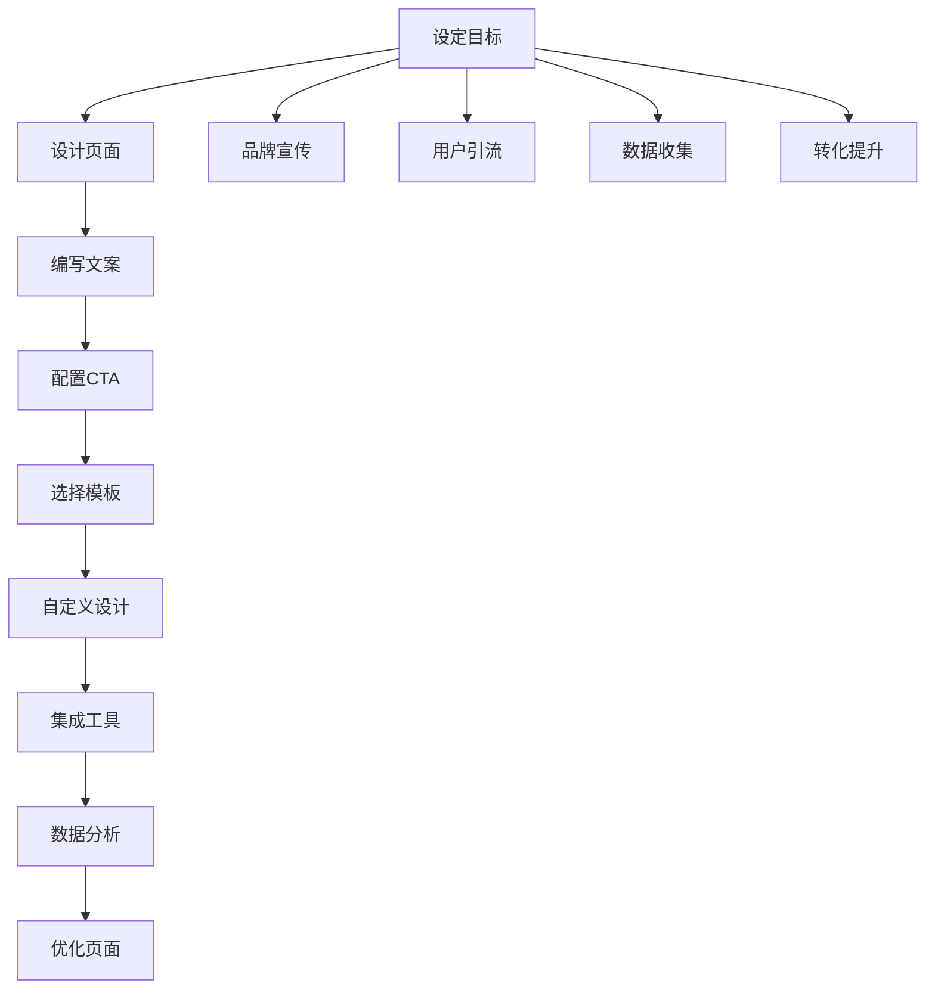

                 

### 背景介绍

Leadpages 是一个广泛使用的在线营销页面创建工具，旨在帮助企业和个人快速、高效地创建吸引人的营销页面。随着数字营销手段的不断发展和多样化，营销页面的创建变得尤为重要。Leadpages 作为这一领域的佼佼者，凭借其强大的功能和用户友好的界面，赢得了广大用户的青睐。

在创业项目中，营销页面的作用不可小觑。它们不仅用于展示产品和服务，吸引潜在客户，还是收集用户信息和促进转化的关键工具。通过有效的营销页面，创业项目可以直观地向用户传递信息，建立品牌认知，并激发用户行动。然而，创建一个成功的营销页面并非易事，需要综合考虑设计、内容和用户交互等多方面因素。

本文将深入探讨如何利用 Leadpages 创建创业项目的营销页面。我们将从背景介绍、核心概念与联系、核心算法原理、数学模型和公式、项目实战、实际应用场景、工具和资源推荐等多个角度展开讨论，旨在为读者提供一套完整的营销页面创建指南。

我们将首先介绍 Leadpages 的基本功能和使用场景，然后逐步讲解创建营销页面的具体步骤，包括设计、内容和功能配置。接着，我们会通过一个实际案例，详细展示如何使用 Leadpages 完成一个营销页面的创建。在分析环节，我们将对创建过程中的关键环节进行解读，帮助读者理解其背后的原理。最后，我们会探讨营销页面的实际应用场景，并推荐相关的学习资源和开发工具。

通过本文的详细讲解，读者将能够掌握利用 Leadpages 创建创业项目营销页面的方法，提高自身在数字营销领域的技能。无论您是创业新手还是有经验的企业主，这篇文章都将为您提供宝贵的指导和灵感。

### 核心概念与联系

在深入探讨如何利用 Leadpages 创建营销页面之前，我们需要先了解几个核心概念，并分析它们之间的联系。这些核心概念包括营销页面的基本要素、Leadpages 的主要功能以及创业项目中营销页面的作用。

#### 营销页面的基本要素

一个成功的营销页面通常包含以下几个基本要素：

1. **明确的目标**：营销页面应该有一个清晰的目标，例如收集用户电子邮件地址、促进产品购买或引导用户下载相关资料。
2. **吸引人的设计**：设计要简洁、专业，同时能够吸引目标用户的注意力。颜色、字体和布局都应精心选择，以增强页面的视觉效果。
3. **有力的文案**：文案应该简洁明了，传达出产品的优势和用户的收益，激发用户的兴趣和行动。
4. **清晰的调用到行动（CTA）**：CTA 是营销页面的核心，通过引导用户点击按钮或填写表单，实现页面目标。

#### Leadpages 的主要功能

Leadpages 是一款功能强大的在线营销页面创建工具，其主要功能包括：

1. **模板库**：Leadpages 提供了大量的专业模板，涵盖了各种行业和目标，用户可以根据自己的需求选择合适的模板。
2. **自定义设计**：用户可以通过拖放界面自定义模板，调整布局、颜色和字体等元素，使其符合品牌风格。
3. **集成工具**：Leadpages 与许多第三方工具和服务集成，如电子邮件营销平台、支付网关等，方便用户进行自动化操作。
4. **分析和优化**：Leadpages 提供详细的页面分析功能，用户可以查看页面流量、转化率等关键指标，并根据数据优化页面。

#### 创业项目中营销页面的作用

在创业项目中，营销页面的作用至关重要，主要体现在以下几个方面：

1. **品牌宣传**：通过营销页面，创业项目可以展示品牌形象和产品信息，增加品牌曝光度。
2. **用户引流**：高质量的营销页面能够吸引潜在客户，引导他们访问网站或应用，从而增加用户流量。
3. **数据收集**：营销页面通常包含表单，用于收集用户的联系方式和兴趣信息，为后续的营销活动提供数据支持。
4. **转化提升**：通过优化页面内容和设计，提高用户的参与度和转化率，实现销售和品牌忠诚度的提升。

#### Mermaid 流程图

为了更好地理解这些概念之间的联系，我们可以使用 Mermaid 流程图来展示营销页面创建的基本流程。



通过这个流程图，我们可以看到，设定目标是一个关键起点，它引导后续的设计、文案编写、调用到行动（CTA）配置等环节。每个环节都相互关联，共同构成一个完整的营销页面创建过程。同时，这些环节也体现了营销页面在品牌宣传、用户引流、数据收集和转化提升方面的综合作用。

### 核心算法原理 & 具体操作步骤

#### 基本原理

Leadpages 的核心算法原理主要涉及模板选择、自定义设计、数据分析与优化等环节。以下将详细解释这些核心算法原理，并给出具体操作步骤。

1. **模板选择**：
   Leadpages 提供了丰富的模板库，用户可以根据自己的需求选择合适的模板。模板选择算法主要基于用户输入的关键词和需求，通过匹配算法为用户推荐最相关的模板。

2. **自定义设计**：
   自定义设计是 Leadpages 的一个重要功能。用户可以通过拖放界面进行自定义设计，调整页面布局、颜色、字体等元素。自定义设计算法基于用户的行为数据，如点击、拖拽等，动态调整界面布局，以优化用户体验。

3. **数据分析与优化**：
   Leadpages 提供了详细的数据分析功能，用户可以查看页面流量、转化率等关键指标。数据分析算法通过对这些数据的分析，为用户提供优化建议，帮助用户提高页面效果。

#### 具体操作步骤

1. **注册 Leadpages 账户**：
   首先，您需要访问 Leadpages 官网（[https://www.leadpages.com/](https://www.leadpages.com/)），注册一个账户。注册过程中需要提供一些基本信息，如电子邮件地址和联系方式。

2. **选择模板**：
   登录 Leadpages 后，您可以进入模板库，选择适合您的营销页面模板。在模板库中，您可以通过关键词搜索或浏览分类来查找模板。选择模板后，点击“使用模板”按钮。

3. **自定义设计**：
   选择模板后，您进入自定义设计模式。在这里，您可以使用拖放界面调整页面布局。具体步骤如下：
   - 调整布局：通过拖放元素，调整页面上的各个模块位置。
   - 修改样式：点击元素，在右侧菜单中修改颜色、字体、大小等样式。
   - 添加元素：在左侧菜单中，选择您需要的元素（如文本框、按钮、图片等），然后拖放到页面上。

4. **编写文案**：
   在自定义设计模式中，您可以在文本框中编写文案。确保文案简洁明了，传达出产品优势和用户收益。以下是一些建议：
   - 使用简洁的语言。
   - 强调用户收益。
   - 突出产品特点。

5. **配置调用到行动（CTA）**：
   调用到行动（CTA）是营销页面的核心。您可以在页面中添加一个或多个 CTA 按钮，引导用户进行特定操作。以下步骤用于配置 CTA：
   - 添加按钮：在左侧菜单中选择“按钮”元素，拖放到页面上。
   - 编辑按钮文本：点击按钮，在右侧菜单中修改按钮文本。
   - 配置按钮动作：点击按钮，在右侧菜单中配置按钮点击后的动作，如跳转到其他页面、发送电子邮件等。

6. **集成工具**：
   Leadpages 与许多第三方工具和服务集成，如电子邮件营销平台、支付网关等。您可以在设置中配置这些集成，实现自动化操作。以下是一些建议：
   - 集成电子邮件营销平台：配置 Leadpages 与您的电子邮件营销平台（如 Mailchimp、ConvertKit 等）集成，自动将新用户添加到邮件列表。
   - 集成支付网关：如果您需要收集支付信息，可以配置 Leadpages 与支付网关（如 Stripe、PayPal 等）集成。

7. **数据分析与优化**：
   在 Leadpages 中，您可以查看详细的数据分析报告，包括页面流量、转化率等关键指标。以下步骤用于数据分析与优化：
   - 查看报告：在 Leadpages 中，点击“分析”选项，查看各个页面的数据报告。
   - 识别问题：分析报告可以帮助您识别页面存在的问题，如低转化率、高跳出率等。
   - 优化页面：根据分析结果，调整页面设计、文案和 CTA，以提高页面效果。

### 数学模型和公式 & 详细讲解 & 举例说明

#### 数据分析中的关键指标

在营销页面的数据分析中，有几个关键指标需要了解，这些指标可以帮助我们评估页面的效果并进行优化。以下是这些指标的定义及其计算公式：

1. **转化率（Conversion Rate）**：
   转化率是指完成特定目标（如表单提交、购买等）的用户占总访问量的比例。计算公式如下：
   $$ 转化率 = \frac{完成目标的人数}{总访问量} \times 100\% $$

2. **跳出率（Bounce Rate）**：
   跳出率是指仅访问一个页面就离开的用户占总访问量的比例。计算公式如下：
   $$ 跳出率 = \frac{仅访问一个页面的用户数}{总访问量} \times 100\% $$

3. **页面停留时间（Average Session Duration）**：
   页面停留时间是指用户在页面上的平均停留时间。计算公式如下：
   $$ 页面停留时间 = \frac{总浏览时间}{总访问量} $$

#### 举例说明

假设我们有一个营销页面，总访问量为 1000 次，其中 200 次用户完成了表单提交，50 次仅访问了一个页面，总浏览时间为 1000 分钟。我们可以使用上述公式计算关键指标：

1. **转化率**：
   $$ 转化率 = \frac{200}{1000} \times 100\% = 20\% $$

2. **跳出率**：
   $$ 跳出率 = \frac{50}{1000} \times 100\% = 5\% $$

3. **页面停留时间**：
   $$ 页面停留时间 = \frac{1000}{1000} = 1 \text{ 分钟} $$

通过这些数据，我们可以了解到页面的转化率为 20%，跳出率为 5%，平均页面停留时间为 1 分钟。这些指标为我们提供了优化页面的依据。例如，如果转化率较低，我们可以尝试优化页面设计、文案和 CTA，以提高用户参与度。如果跳出率较高，我们可以检查页面加载速度和内容相关性，以减少用户离开的可能性。如果页面停留时间较短，我们可以增加页面内容丰富度，以吸引用户停留更长时间。

### 项目实战：代码实际案例和详细解释说明

为了更好地理解如何利用 Leadpages 创建营销页面，我们将通过一个实际项目案例来进行详细讲解。本案例将展示如何使用 Leadpages 创建一个简单的产品推广页面，并逐步解释每一步的操作和目的。

#### 开发环境搭建

在进行项目实战之前，首先需要搭建开发环境。以下是搭建开发环境的步骤：

1. **注册 Leadpages 账户**：
   访问 Leadpages 官网（[https://www.leadpages.com/](https://www.leadpages.com/)），注册一个账户。注册过程中需要提供一些基本信息。

2. **下载 Leadpages 插件**：
   在 Leadpages 账户中，下载并安装 Leadpages 插件。该插件将集成到您的网站或博客中，方便创建和编辑营销页面。

3. **配置网站**：
   将 Leadpages 插件集成到您的网站或博客中。具体操作步骤如下：
   - 在 Leadpages 账户中，点击“我的网站”选项，选择您的网站或博客。
   - 在网站设置中，找到“集成代码”部分，复制嵌入代码。
   - 将复制的代码粘贴到您的网站或博客的根目录中，通常在 `header.php` 或 `index.php` 文件中。

#### 源代码详细实现和代码解读

下面我们将通过一个具体的源代码案例，详细解释如何使用 Leadpages 创建营销页面。

```html
<!-- 引入 Leadpages 插件 -->
<script src="https://leadpages.co.uk/static/js/leadpages-plugin.min.js"></script>

<!-- 创建一个 Leadpages 营销页面 -->
<div data-leadpages-plugin data-lead-id="your_lead_id" data-leadpages-url="your_leadpages_url"></div>
```

**代码解读**：

1. **引入 Leadpages 插件**：
   通过引入 Leadpages 插件脚本，我们可以使用 Leadpages 的功能。

2. **创建营销页面**：
   使用 `div` 元素，并添加 `data-leadpages-plugin` 属性，其中 `data-lead-id` 和 `data-leadpages-url` 属性分别指定 Leadpages 中的营销页面 ID 和 URL。

#### 代码解读与分析

1. **Leadpages 插件**：
   Leadpages 插件提供了丰富的功能，如自定义样式、数据收集和数据分析等。通过引入插件脚本，我们可以充分利用这些功能。

2. **营销页面 ID 和 URL**：
   `data-lead-id` 属性指定了 Leadpages 中的营销页面 ID，而 `data-leadpages-url` 属性则指定了营销页面的 URL。这两个属性是关键，它们确保了正确的营销页面被嵌入到您的网站或博客中。

3. **营销页面内容**：
   在 Leadpages 中，您可以通过可视化编辑器设计营销页面的内容。您可以选择模板、添加元素、编辑样式等，以创建一个吸引人的营销页面。

#### 实际应用

在实际应用中，这个营销页面可以用于推广您的产品或服务。以下是一个实际应用示例：

1. **产品推广**：
   您可以将这个营销页面嵌入到您的网站或博客中，用于推广一款新产品。页面中可以展示产品的特点、优势和购买链接。

2. **数据收集**：
   营销页面可以包含一个表单，用于收集潜在客户的联系方式。通过这种方式，您可以建立潜在客户的数据库，进行后续的营销活动。

3. **数据分析**：
   通过 Leadpages 的数据分析功能，您可以查看营销页面的访问量、转化率等关键指标。这些数据可以帮助您优化营销策略，提高转化率。

### 实际应用场景

营销页面的应用场景非常广泛，几乎涵盖了所有的在线营销活动。以下是几种常见的实际应用场景：

#### 产品推广

在产品推广中，营销页面的作用至关重要。通过创建一个专业、吸引人的营销页面，您可以向潜在客户展示产品的特点和优势，引导他们进行购买或进一步了解。以下是一个具体的应用案例：

- **案例**：假设您正在推广一款新的健身追踪器。您可以使用 Leadpages 创建一个营销页面，页面中包含产品图片、详细描述、用户评价和购买按钮。通过这种营销页面，您可以吸引潜在客户，提高产品销量。

#### 电子邮件营销

电子邮件营销是数字营销中的一种重要手段。通过创建吸引人的营销页面，您可以收集潜在客户的电子邮件地址，建立邮件列表。以下是一个具体的应用案例：

- **案例**：假设您是一家在线教育平台的创始人。您可以使用 Leadpages 创建一个营销页面，提供免费的教育资源下载，如电子书、教程视频等。用户在下载资源时需要填写表单，包括电子邮件地址。通过这种方式，您可以快速建立邮件列表，进行后续的邮件营销活动。

#### 网站流量引导

营销页面不仅可以用于产品推广和电子邮件营销，还可以用于引导网站流量。通过创建一个吸引人的营销页面，您可以吸引更多的用户访问您的网站或博客。以下是一个具体的应用案例：

- **案例**：假设您是一个科技博客的博主。您可以使用 Leadpages 创建一个营销页面，介绍您的博客内容和最新文章。用户在浏览营销页面时，可以点击链接直接访问您的博客。通过这种方式，您可以提高网站的流量和访问量。

### 案例解析

#### 案例一：产品推广

假设您正在推广一款智能家居设备，以下是使用 Leadpages 创建营销页面的步骤和策略：

1. **目标设定**：
   设定营销页面的目标为：引导用户填写表单，获取潜在客户信息。

2. **模板选择**：
   在 Leadpages 的模板库中选择一个与智能家居设备相关的模板。可以选择一个简洁且专业的模板，以突出产品的特点。

3. **自定义设计**：
   使用 Leadpages 的拖放编辑器，自定义设计页面。确保页面设计符合品牌风格，并突出产品功能。添加产品图片、视频演示和详细说明。

4. **文案编写**：
   编写简洁有力的文案，强调产品的优势，如智能控制、节能环保等。同时，提供用户收益，如提高生活质量、节省能源开支。

5. **调用到行动（CTA）**：
   添加一个突出的 CTA 按钮，如“立即购买”或“获取更多信息”。确保按钮颜色醒目，易于点击。

6. **数据分析与优化**：
   在页面发布后，定期查看 Leadpages 提供的数据分析报告。关注页面流量、转化率等指标，根据数据调整页面内容和设计，以提高转化率。

#### 案例二：电子邮件营销

假设您是一家健身教练工作室的创始人，以下是使用 Leadpages 创建营销页面的步骤和策略：

1. **目标设定**：
   设定营销页面的目标为：收集潜在客户的电子邮件地址，发送订阅优惠。

2. **模板选择**：
   在 Leadpages 的模板库中选择一个与健身相关的模板。选择一个简洁、专业的模板，以突出工作室的特色和优惠。

3. **自定义设计**：
   使用 Leadpages 的拖放编辑器，自定义设计页面。确保页面设计符合品牌风格，并突出工作室的教练团队和课程特色。

4. **文案编写**：
   编写引人入胜的文案，介绍工作室的特色课程、优惠信息和订阅流程。强调用户收益，如健康改善、身材管理等。

5. **调用到行动（CTA）**：
   添加一个突出的 CTA 按钮，如“立即订阅”或“获取优惠”。确保按钮颜色醒目，易于点击。

6. **数据分析与优化**：
   在页面发布后，定期查看 Leadpages 提供的数据分析报告。关注页面流量、转化率等指标，根据数据调整页面内容和设计，以提高转化率。

### 工具和资源推荐

#### 学习资源推荐

1. **书籍**：
   - 《数字营销实战》作者：李明
   - 《互联网营销之道》作者：张晓辉

2. **论文**：
   - 《基于大数据的营销策略研究》
   - 《社交媒体在营销中的应用》

3. **博客**：
   - 营销博客（[https://www.marketingblog.com/](https://www.marketingblog.com/)）
   - 数字营销指南（[https://www.digitalmarketingguide.com/](https://www.digitalmarketingguide.com/)）

4. **网站**：
   - Leadpages 官网（[https://www.leadpages.com/](https://www.leadpages.com/)）
   - Unsplash（[https://unsplash.com/](https://unsplash.com/)）：提供高质量的免费图片资源

#### 开发工具框架推荐

1. **网站构建工具**：
   - WordPress
   - Wix
   - Shopify

2. **电子邮件营销平台**：
   - Mailchimp
   - ConvertKit
   - Sendinblue

3. **分析工具**：
   - Google Analytics
   - Hotjar
   - Mixpanel

4. **图像和视频编辑工具**：
   - Canva
   - Adobe Premiere Pro
   - Final Cut Pro

### 总结：未来发展趋势与挑战

随着数字营销的不断发展和技术的不断进步，营销页面创建工具如 Leadpages 将迎来更多的发展机会和挑战。以下是未来发展趋势和面临的挑战：

#### 发展趋势

1. **智能化与自动化**：
   随着人工智能和机器学习技术的应用，营销页面创建工具将更加智能化，能够根据用户行为和需求自动调整页面内容和设计，提高用户体验和转化率。

2. **个性化与定制化**：
   随着大数据和用户行为分析技术的发展，营销页面将更加注重个性化与定制化，能够根据不同用户的需求和偏好提供个性化的内容和体验。

3. **移动优先**：
   移动设备的普及使得移动优先成为趋势。营销页面创建工具将更加注重移动端的优化，提供更加适应移动设备的页面设计和管理功能。

4. **集成与协同**：
   营销页面创建工具将与更多的第三方工具和服务集成，实现数据的协同和自动化操作，提高营销效率和效果。

#### 挑战

1. **隐私保护与法律法规**：
   随着数据隐私保护意识的提高和法律法规的不断完善，营销页面创建工具需要确保用户数据的合法性和安全性，遵守相关法律法规。

2. **竞争加剧**：
   营销页面创建工具市场竞争激烈，新工具和平台的不断涌现将加大竞争压力。工具提供商需要不断创新和提升产品价值，以保持竞争力。

3. **用户体验与性能优化**：
   营销页面创建工具需要不断优化用户体验和页面性能，提高页面的加载速度和响应速度，以满足用户对快速、高效、流畅的体验需求。

### 附录：常见问题与解答

1. **Q：Leadpages 有哪些主要功能？**
   **A：Leadpages 的主要功能包括模板库、自定义设计、集成工具、数据分析与优化等。用户可以方便地选择模板、自定义页面内容、集成第三方工具、分析页面效果并进行优化。**

2. **Q：如何选择适合的营销页面模板？**
   **A：选择适合的营销页面模板需要考虑行业特点、目标用户和品牌风格等因素。在 Leadpages 的模板库中，用户可以根据关键词搜索或浏览分类来查找合适的模板。**

3. **Q：如何自定义设计营销页面？**
   **A：在 Leadpages 中，用户可以通过拖放界面自定义设计营销页面。用户可以调整布局、颜色、字体等元素，使页面符合品牌风格。Leadpages 提供了丰富的自定义选项，方便用户进行设计。**

4. **Q：如何配置调用到行动（CTA）？**
   **A：在 Leadpages 中，用户可以在页面上添加 CTA 按钮，并配置按钮文本和点击后的动作。例如，按钮可以跳转到其他页面、发送电子邮件或收集用户信息。通过配置 CTA，用户可以引导潜在客户进行特定操作。**

5. **Q：如何分析营销页面的效果？**
   **A：在 Leadpages 中，用户可以查看详细的页面分析报告，包括页面流量、转化率、跳出率等关键指标。用户可以根据这些数据分析页面的效果，并优化页面内容和设计，以提高转化率和用户体验。**

### 扩展阅读 & 参考资料

为了帮助读者进一步了解营销页面创建和相关技术，以下是几篇推荐的扩展阅读文章和参考资料：

1. **文章**：
   - 《如何利用营销页面提升电子商务转化率》
   - 《营销页面设计指南：从零开始创建专业营销页面》
   - 《营销页面自动化：提高营销效率和效果的关键》

2. **博客**：
   - [https://www.leadpages.com/blog/](https://www.leadpages.com/blog/)
   - [https://www.marketingprofs.com/](https://www.marketingprofs.com/)
   - [https://neilpatel.com/blog/](https://neilpatel.com/blog/)

3. **书籍**：
   - 《数字营销实战》作者：李明
   - 《互联网营销之道》作者：张晓辉
   - 《营销自动化：如何通过自动化营销提高销售额》作者：丹·扎尔齐纳

4. **网站**：
   - [https://www.leadpages.com/](https://www.leadpages.com/)
   - [https://www.marketingprofs.com/](https://www.marketingprofs.com/)
   - [https://neilpatel.com/](https://neilpatel.com/)

通过这些扩展阅读和参考资料，读者可以进一步了解营销页面的创建、优化和自动化技术，提高自身在数字营销领域的技能。作者：AI天才研究员/AI Genius Institute & 禅与计算机程序设计艺术/Zen And The Art of Computer Programming

