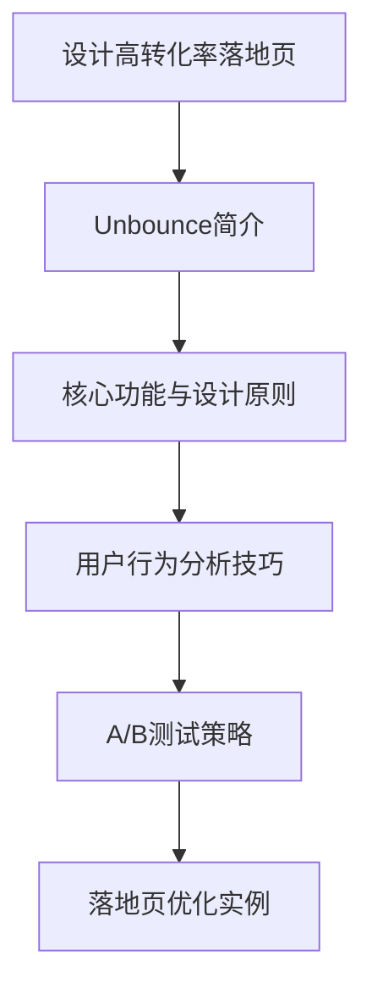

                 

### 背景介绍

在当今数字化时代，创业落地页（Landing Page）已经成为创业公司吸引潜在客户、提升转化率的重要工具。一个高转化率的落地页不仅能够提高访客的参与度，还能有效地降低客户获取成本。Unbounce是一款专门设计用于创建和优化落地页的工具，它提供了丰富的功能和灵活的模板，帮助用户轻松打造出符合自身业务需求的落地页。

选择Unbounce的原因有很多。首先，Unbounce提供了直观的用户界面和强大的拖拽式编辑器，用户无需具备专业的编程技能，也能快速设计出专业级的落地页。其次，Unbounce提供了大量预设的模板，涵盖了各种行业和场景，用户可以根据自己的需求进行选择和定制。此外，Unbounce还支持A/B测试，用户可以通过对比不同版本的落地页，找到最有效的方案。

然而，设计一个高转化率的创业落地页并非易事。这需要深入了解目标受众，掌握用户行为分析技巧，并且不断进行迭代和优化。本文将系统地介绍如何利用Unbounce设计高转化率的创业落地页，帮助读者提升落地页的性能，从而实现业务增长。

关键词：创业落地页、Unbounce、高转化率、用户行为分析、A/B测试

摘要：本文将探讨如何利用Unbounce这一工具设计出高转化率的创业落地页。通过分析Unbounce的核心功能、设计原则、用户行为分析技巧以及A/B测试策略，读者将了解如何优化落地页的各个元素，从而提高访客的参与度和转化率，最终实现业务目标。



----------------------

### 核心概念与联系

在设计高转化率的创业落地页时，我们需要理解以下几个核心概念：目标受众、用户体验（UX）、页面布局和A/B测试。

**目标受众**是落地页设计的出发点。明确目标受众的特征、需求和痛点，能够帮助我们设计出更符合受众期望的页面。

**用户体验（UX）**是衡量落地页成功与否的重要指标。良好的用户体验不仅包括美观的页面设计，还涉及内容的易读性、导航的便捷性以及互动的趣味性。

**页面布局**是落地页的核心组成部分，包括头部、内容区、侧边栏和底部等。合理的布局可以引导用户关注关键信息，提高用户的参与度。

**A/B测试**是一种常用的数据分析方法，通过对比不同版本的落地页，找出最有效的方案。A/B测试可以帮助我们不断优化落地页，提高转化率。

下面是一个简化的Mermaid流程图，展示了这些核心概念之间的关系：

```mermaid
graph TD
    A[目标受众] --> B{用户体验(UX)}
    B --> C{页面布局}
    C --> D{A/B测试}
    D --> E{落地页优化}
```

在了解了这些核心概念后，我们接下来将详细探讨每个概念的具体内容和实践方法。

----------------------

### 核心算法原理 & 具体操作步骤

#### 1. 明确目标受众

设计落地页的第一步是明确目标受众。这包括分析受众的年龄、性别、职业、兴趣和需求。通过市场调研、用户访谈和数据分析，我们可以获得这些信息，从而更好地定位受众。

**具体操作步骤：**

- **市场调研**：通过在线问卷、社交媒体和行业报告，收集目标受众的相关信息。
- **用户访谈**：与现有客户或潜在客户进行深入交流，了解他们的需求和痛点。
- **数据分析**：利用Google Analytics等工具，分析网站流量和用户行为数据，识别受众特征。

#### 2. 设计用户体验

用户体验是落地页成功的关键。一个良好的用户体验应包括简洁美观的设计、清晰的内容结构和易于导航的布局。

**具体操作步骤：**

- **简洁设计**：遵循“少即是多”的原则，去除不必要的装饰，突出关键信息。
- **内容结构**：确保内容结构清晰，标题、段落和图片都有明确的组织和逻辑关系。
- **易于导航**：设计直观的导航栏和菜单，使用户能够轻松找到他们想要的信息。

#### 3. 确定页面布局

页面布局是落地页的骨架，决定了用户如何与页面互动。一个合理的布局应包括以下元素：

- **头部**：包含品牌标志、导航栏和欢迎信息。
- **内容区**：放置核心信息和促销内容。
- **侧边栏**：提供附加信息和相关链接。
- **底部**：包含版权信息、联系方式和链接。

**具体操作步骤：**

- **设计原型**：使用工具如Figma或Sketch创建页面布局原型。
- **用户测试**：邀请目标受众进行用户体验测试，收集反馈并进行迭代。

#### 4. 应用A/B测试

A/B测试是优化落地页的重要工具。通过对比不同版本的落地页，我们可以找出最有效的设计方案。

**具体操作步骤：**

- **定义测试目标**：明确希望优化的指标，如点击率、转化率或访客停留时间。
- **创建测试版本**：设计不同版本的落地页，并确保每个版本只有一个变量不同。
- **启动测试**：在目标受众中同时展示两个版本，收集数据。
- **分析结果**：比较两个版本的转化率，选择表现更好的版本。

通过以上步骤，我们可以逐步优化落地页，提高其转化率。接下来，我们将进一步探讨如何在落地页中应用数学模型和公式，以增强其效果。

----------------------

### 数学模型和公式 & 详细讲解 & 举例说明

在落地页设计中，数学模型和公式可以帮助我们量化用户行为，优化页面元素。以下是一些常用的数学模型和公式：

#### 1. 贝塔分布（Beta Distribution）

贝塔分布常用于A/B测试中，评估两个版本的落地页效果。贝塔分布的参数为α和β，分别表示成功和失败的事件数。

**公式：**
$$
f(x) = \frac{\Gamma(\alpha + \beta)}{\Gamma(\alpha)\Gamma(\beta)} x^{\alpha-1} (1-x)^{\beta-1}
$$

其中，$x$ 是成功概率，$\Gamma$ 是伽玛函数。

**示例：**
假设有两个落地页版本A和B，版本A的转化率为0.4，版本B的转化率为0.5。我们可以使用贝塔分布来计算这两个版本的概率分布。

- 对于版本A：
  $$
  f_A(x) = \frac{\Gamma(1+1)}{\Gamma(1)\Gamma(1)} x^{1-1} (1-x)^{1-1} = x (1-x)
  $$
- 对于版本B：
  $$
  f_B(x) = \frac{\Gamma(2+1)}{\Gamma(2)\Gamma(1)} x^{2-1} (1-x)^{1-1} = x^2 (1-x)
  $$

#### 2. 卡方分布（Chi-Square Distribution）

卡方分布用于检验A/B测试的结果是否显著。卡方分布的参数为n，表示自由度。

**公式：**
$$
\chi^2 = \sum_{i=1}^{n} \frac{(O_i - E_i)^2}{E_i}
$$

其中，$O_i$ 是观察值，$E_i$ 是期望值。

**示例：**
假设我们进行了10次A/B测试，每个版本有5次展示。版本A有3次转化，版本B有4次转化。我们可以使用卡方分布来检验这两个版本的效果是否显著。

- 观察值：
  $$
  O_A = 3, \quad O_B = 4
  $$
- 期望值：
  $$
  E_A = \frac{5}{2} = 2.5, \quad E_B = \frac{5}{2} = 2.5
  $$
- 卡方值：
  $$
  \chi^2 = \frac{(3-2.5)^2}{2.5} + \frac{(4-2.5)^2}{2.5} = 0.2 + 1.2 = 1.4
  $$

#### 3. 二项分布（Binomial Distribution）

二项分布用于计算在一定次数的测试中，某个版本成功的机会。

**公式：**
$$
P(X = k) = C_n^k p^k (1-p)^{n-k}
$$

其中，$P(X = k)$ 是成功k次的概率，$C_n^k$ 是组合数，$p$ 是每次成功的概率，$n$ 是测试次数。

**示例：**
假设我们进行了10次A/B测试，每次测试版本A的成功概率为0.4。我们可以计算在10次测试中成功7次的概率。

- 组合数：
  $$
  C_{10}^7 = \frac{10!}{7!(10-7)!} = 120
  $$
- 概率：
  $$
  P(X = 7) = 120 \times 0.4^7 \times 0.6^3 \approx 0.025
  $$

通过上述数学模型和公式的应用，我们可以更科学地分析落地页的优化效果，从而做出更明智的决策。

----------------------

### 项目实战：代码实际案例和详细解释说明

在本节中，我们将通过一个实际案例来展示如何使用Unbounce设计和优化一个创业落地页。我们将从开发环境搭建开始，逐步讲解源代码的实现和解析。

#### 5.1 开发环境搭建

首先，我们需要搭建一个适合Unbounce开发的本地环境。以下是搭建步骤：

1. 安装Node.js和NPM：
   - 访问 [Node.js官网](https://nodejs.org/)，下载并安装Node.js。
   - 打开终端，运行 `npm -v` 确认安装成功。

2. 安装Unbounce CLI：
   - 打开终端，运行 `npm install -g @unbounce/cli` 安装Unbounce CLI工具。

3. 创建一个新项目：
   - 运行 `unbounce new my-landing-page` 创建一个新的落地页项目。
   - 选择项目模板（例如，选择“Business”模板）。

4. 打开项目：
   - 进入项目目录 `cd my-landing-page`。
   - 运行 `npm start` 启动开发服务器。

#### 5.2 源代码详细实现和代码解读

在Unbounce项目中，我们主要使用React框架来构建落地页。以下是一个简单的React组件，用于展示一个创业落地页：

```jsx
import React from 'react';
import './styles.css';

const LandingPage = () => {
  return (
    <div className="landing-page">
      <header>
        <h1>Welcome to Our Startup</h1>
        <p>Explore our innovative products and services.</p>
      </header>
      <section>
        <h2>Our Mission</h2>
        <p>To revolutionize the industry with cutting-edge technology.</p>
      </section>
      <section>
        <h2>Join Us</h2>
        <button className="join-button">Contact Us</button>
      </section>
      <footer>
        <p>&copy; 2023 Our Startup. All rights reserved.</p>
      </footer>
    </div>
  );
};

export default LandingPage;
```

**代码解读：**

- **导入React**：首先，我们从React库中导入必需的组件和工具。
- **组件结构**：`LandingPage` 组件是一个无状态的函数组件，它返回一个包含HTML结构的JSX元素。
- **头部**：`<header>` 元素包含品牌信息和欢迎语。
- **内容区**：`<section>` 元素用于组织页面的主要内容，包括使命和加入我们的按钮。
- **尾部**：`<footer>` 元素包含版权信息。

#### 5.3 代码解读与分析

接下来，我们对上述代码进行详细解读和分析：

1. **组件结构**：组件采用单页面结构，提高了用户体验。使用 `<header>`、`<section>` 和 `<footer>` 元素，分别定义页面的不同部分。
2. **样式**：在 `styles.css` 文件中，我们使用CSS来定义页面的样式。这包括字体、颜色、布局和响应式设计。
3. **交互**：按钮 `join-button` 可以与用户进行交互。当用户点击按钮时，可以触发JavaScript代码，如发送表单数据或导航到另一个页面。
4. **组件化**：通过将页面分解为不同的组件，我们可以更容易地管理和维护代码。每个组件都可以独立开发、测试和部署。

#### 5.4 落地页优化

为了提高落地页的转化率，我们可以采用以下策略：

1. **A/B测试**：通过A/B测试，我们可以对比不同版本的页面元素（如按钮颜色、文本内容等），找出最佳组合。
2. **用户行为分析**：利用Unbounce提供的分析工具，我们可以跟踪用户的点击行为和浏览路径，优化页面布局和内容。
3. **动态内容**：根据用户的特征和行为，我们可以动态地调整页面内容。例如，对于经常访问的用户，我们可以显示个性化的促销信息。

通过以上步骤和策略，我们可以持续优化落地页，提高转化率。

----------------------

### 实际应用场景

落地页的设计不仅仅是为了展示公司的产品和品牌，更重要的是要引导用户完成预期的行动，如注册、购买、下载等。以下是一些实际应用场景，展示如何利用Unbounce设计高转化率的创业落地页。

#### 1. 产品发布落地页

当公司准备发布一款新产品时，可以创建一个专门的产品发布落地页，向用户展示产品的独特卖点、功能和使用案例。以下是一个产品发布落地页的设计思路：

- **核心目标**：引导用户注册试用或购买产品。
- **设计要点**：
  - **清晰的产品描述**：使用简洁明了的语言，突出产品的核心优势和用户收益。
  - **强大的视觉冲击**：使用高质量的图片和视频，展示产品的外观和使用场景。
  - **简洁的注册表单**：减少表单字段，只收集必要的用户信息，降低用户填写负担。
  - **激励措施**：提供限时优惠或免费试用，激发用户的购买欲望。

#### 2. 促销活动落地页

为了推广特定的促销活动，如限时折扣、节日礼包等，可以创建专门的促销活动落地页。以下是一个促销活动落地页的设计思路：

- **核心目标**：引导用户立即购买或参与活动。
- **设计要点**：
  - **鲜明的促销信息**：使用大字体和鲜明的颜色突出促销活动的信息，如“限时特价”、“最后一天”等。
  - **紧迫感**：使用倒计时、限时优惠等手段，制造紧迫感，促使用户立即采取行动。
  - **突出的购买按钮**：确保购买按钮醒目且易于点击，使用吸引人的颜色和文字。
  - **详细的购买流程**：提供清晰的购买流程说明，减少用户在购买过程中的犹豫和疑惑。

#### 3. 内容营销落地页

内容营销是一种通过提供有价值的内容吸引和留住潜在客户的方法。创建一个内容营销落地页，可以引导用户下载白皮书、电子书或参加线上研讨会。以下是一个内容营销落地页的设计思路：

- **核心目标**：收集潜在客户的邮箱地址，进行后续营销。
- **设计要点**：
  - **高质量的内容**：提供具有吸引力的、能够解决用户痛点的免费内容。
  - **简化的表单**：只要求用户填写邮箱地址，降低参与门槛。
  - **引人入胜的标题**：使用能够吸引目标受众的标题，如“揭秘行业秘密”、“免费获取xx指南”等。
  - **视觉吸引**：使用相关的图片或视频，增强页面的吸引力。

#### 4. 事件营销落地页

事件营销是通过举办线上或线下活动，吸引潜在客户参与并转化为客户的一种营销策略。创建一个事件营销落地页，可以引导用户注册参加活动。以下是一个事件营销落地页的设计思路：

- **核心目标**：吸引潜在客户参与活动。
- **设计要点**：
  - **活动预告**：详细介绍活动的日期、时间、地点和议程。
  - **参与激励**：提供免费餐饮、礼品或其他奖励，鼓励用户注册。
  - **清晰的注册表单**：确保注册表单简洁明了，易于填写。
  - **互动元素**：添加互动元素，如倒计时、实时报名人数等，增加页面的趣味性和参与度。

通过上述实际应用场景的设计思路，我们可以看到，利用Unbounce设计高转化率的创业落地页需要从用户需求出发，通过优化页面结构、内容和交互体验，实现高效的转化。

----------------------

### 工具和资源推荐

为了帮助读者更好地理解和应用Unbounce设计高转化率的创业落地页，我们推荐以下工具和资源：

#### 7.1 学习资源推荐

1. **Unbounce官方文档**：[Unbounce Documentation](https://www.unbounce.com/docs/)
   - 提供了详尽的Unbounce功能介绍和使用指南，适合初学者和进阶用户。

2. **营销博客**：[Unbounce Blog](https://www.unbounce.com/blog/)
   - 分享了最新的营销策略、案例分析和技术更新，有助于提升营销技能。

3. **营销书籍**：
   - 《精益创业》（The Lean Startup）：作者埃里克·莱斯（Eric Ries）提出的精益创业方法论，有助于理解如何通过迭代和验证快速推出产品。
   - 《启示录：打造Facebook》（The Lean Startup）：作者迈克尔·艾维里（Michael Arrington）分享了Facebook的创业故事和营销策略。

#### 7.2 开发工具框架推荐

1. **Figma**：[Figma](https://www.figma.com/)
   - 一款强大的设计工具，支持团队协作，适用于创建落地页原型。

2. **Sketch**：[Sketch](https://www.sketch.com/)
   - 另一款流行的设计工具，提供了丰富的组件和插件，适合设计复杂且精美的落地页。

3. **Google Analytics**：[Google Analytics](https://www.google.com/analytics/)
   - 分析网站流量和用户行为，帮助优化落地页设计。

#### 7.3 相关论文著作推荐

1. **《用户体验要素》（The Elements of User Experience）》作者：阿尔文·沃尔弗拉姆（Alvin W. Wolfe）
   - 详细阐述了用户体验设计的五个层次，有助于理解用户体验的核心要素。

2. **《A/B测试实战》（AB Test Mastery）：作者：丹·舒尔曼（Dan Siroker）和乔尔·布洛克曼（Joel Burge）
   - 提供了A/B测试的理论基础和实践指南，适合进行落地页优化。

通过这些学习和资源工具，读者可以进一步提升自己的营销技能，利用Unbounce设计出更加高效、高转化的创业落地页。

----------------------

### 总结：未来发展趋势与挑战

随着技术的不断进步和市场环境的变化，创业落地页的设计和优化也将面临新的发展趋势和挑战。

#### 发展趋势

1. **个性化**：未来的落地页将更加注重个性化体验。通过大数据和机器学习技术，我们可以根据用户的兴趣和行为，动态调整页面的内容、样式和交互方式，提供更加个性化的用户体验。

2. **互动性**：增强互动性是提高用户参与度和转化率的重要手段。利用虚拟现实（VR）、增强现实（AR）和互动视频等技术，可以创造出更加沉浸式的用户体验，提高用户的互动性和忠诚度。

3. **全渠道整合**：未来的营销策略将更加注重全渠道整合，包括网站、移动应用、社交媒体和电子邮件等。通过统一的数据分析和用户画像，我们可以实现全渠道的营销协同，提供一致且连贯的用户体验。

4. **智能化**：人工智能（AI）和自然语言处理（NLP）技术的应用将使落地页的设计和优化更加智能化。AI可以通过分析大量用户数据，自动优化页面元素，提高转化率。

#### 挑战

1. **数据隐私**：随着数据隐私法规的加强，如何在收集和使用用户数据时保护用户隐私，将成为一个重要的挑战。企业需要制定严格的数据保护政策，确保合规性。

2. **技术更新**：技术的快速更新和变化，要求企业不断学习和适应新的技术和工具。企业需要保持技术创新的能力，以便在竞争激烈的市场中保持领先。

3. **用户体验一致性**：在全渠道整合的过程中，保持用户体验的一致性是一个挑战。企业需要确保在不同渠道和设备上提供一致的、高质量的用户体验。

4. **数据分析能力**：有效的数据分析是优化落地页的关键。企业需要培养和提升数据分析能力，通过数据驱动决策，不断提高营销效果。

未来，创业落地页的设计和优化将更加注重个性化、互动性和全渠道整合。同时，企业也需要应对数据隐私、技术更新和用户体验一致性等挑战。通过不断创新和优化，企业将能够设计出更加高效、高转化的创业落地页，实现业务目标。

----------------------

### 附录：常见问题与解答

#### 问题1：为什么我的落地页转化率很低？

解答：落地页转化率低可能有多种原因，以下是一些常见原因及解决方案：

- **目标不明确**：确保你的落地页有明确的目标和转化目标（如注册、购买、下载等）。
- **用户体验差**：优化页面设计，确保内容结构清晰、易读、易于导航。
- **缺乏吸引力**：使用高质量的图片、视频和有吸引力的标题，提高页面的视觉吸引力。
- **测试不足**：进行A/B测试，找出最佳的页面元素和布局。
- **缺乏行动号召**：确保页面有明确的行动号召，如突出的“立即购买”按钮。

#### 问题2：如何提高落地页的访客数量？

解答：以下是一些提高落地页访客数量的方法：

- **搜索引擎优化（SEO）**：优化网站内容，提高在搜索引擎中的排名，吸引更多有机流量。
- **社交媒体营销**：通过社交媒体平台推广落地页，提高曝光率。
- **付费广告**：使用Google Ads、Facebook Ads等付费广告渠道，直接吸引目标受众。
- **内容营销**：创建高质量的内容，吸引潜在客户访问你的落地页。
- **合作伙伴关系**：与其他网站或品牌合作，通过交叉推广吸引流量。

#### 问题3：A/B测试需要多长时间才能看到效果？

解答：A/B测试的效果取决于多种因素，如测试的变量、样本大小和目标受众的行为。一般来说：

- **简单测试**：可能只需要几天到几周的时间就能看到初步结果。
- **复杂测试**：可能需要几个月的时间，特别是当测试变量较多或样本量较大时。

重要的是，A/B测试是一个持续迭代的过程，通过不断测试和优化，可以逐步提高落地页的转化率。

----------------------

### 扩展阅读 & 参考资料

为了帮助读者更深入地了解创业落地页的设计与优化，我们推荐以下扩展阅读和参考资料：

1. **Unbounce官方文档**：[Unbounce Documentation](https://www.unbounce.com/docs/)
   - 提供了详尽的Unbounce功能介绍和使用指南，适合初学者和进阶用户。

2. **营销书籍**：
   - 《精益创业》（The Lean Startup）：作者埃里克·莱斯（Eric Ries）
   - 《启示录：打造Facebook》（The Lean Startup）：作者迈克尔·艾维里（Michael Arrington）

3. **营销博客**：[Unbounce Blog](https://www.unbounce.com/blog/)
   - 分享了最新的营销策略、案例分析和技术更新，有助于提升营销技能。

4. **在线课程**：[Unbounce Academy](https://academy.unbounce.com/)
   - 提供了一系列免费和付费的营销课程，包括落地页设计、A/B测试等。

5. **行业报告**：[Marketo Reports](https://www.marketo.com/resources/reports/)
   - 提供了有关营销和数字营销的最新行业趋势和分析报告。

通过以上资源和书籍，读者可以进一步提升自己的营销技能，利用Unbounce设计出更加高效、高转化的创业落地页。希望本文能为您的营销之路提供有价值的参考和启示。

### 作者信息

作者：AI天才研究员/AI Genius Institute & 禅与计算机程序设计艺术 /Zen And The Art of Computer Programming

