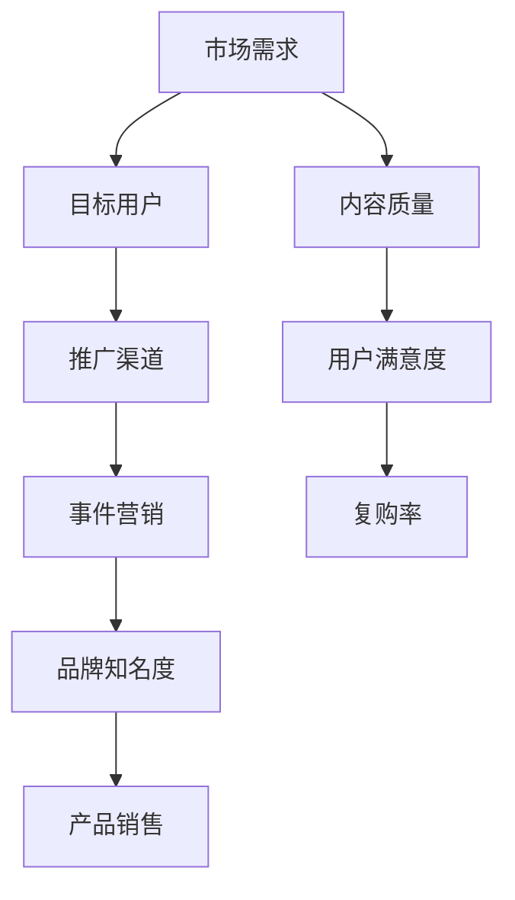

                 

### 背景介绍

#### 知识付费产品的兴起

知识付费产品，作为一种新兴的商业模式，近年来在全球范围内迅速崛起。随着互联网技术的飞速发展，人们获取信息的渠道日益丰富，传统的免费知识传播方式逐渐无法满足人们对高质量、个性化学习内容的需求。知识付费产品的出现，恰好填补了这一市场空白，为用户提供了更具价值和针对性的学习资源。

#### 事件营销的重要性

事件营销，是指企业通过策划、组织和利用具有新闻价值、社会影响以及名人效应的人物或事件，吸引媒体、公众和消费者的兴趣与关注，以求提高企业或产品的知名度、美誉度，以及最终促进销售的一种营销策略。在知识付费产品的推广中，事件营销扮演着至关重要的角色。通过巧妙策划和执行，事件营销可以迅速提升品牌知名度，吸引潜在用户，从而实现产品销售的增长。

#### 文章目的

本文旨在探讨如何利用事件营销来推广知识付费产品。我们将从以下几个方面展开讨论：

1. **事件营销的基本原理**：介绍事件营销的概念、特点及作用。
2. **知识付费产品的推广策略**：分析知识付费产品的市场需求、目标用户群体，以及合适的推广渠道。
3. **事件营销在知识付费产品推广中的应用**：探讨如何策划和执行事件营销活动，以提高产品知名度和用户粘性。
4. **成功案例分析**：分享一些成功的事件营销案例，为读者提供实际操作的参考。
5. **未来发展趋势与挑战**：预测事件营销在知识付费产品推广领域的未来发展趋势，以及可能面临的挑战。

通过本文的探讨，希望读者能够对如何利用事件营销推广知识付费产品有一个全面、深入的理解，从而为自己的产品推广提供有价值的参考。

### 核心概念与联系

在深入探讨如何利用事件营销推广知识付费产品之前，我们需要首先理解一些核心概念和它们之间的相互关系。以下是本文将涉及到的关键概念和它们之间的关系图，采用Mermaid流程图进行展示。



以下是每个概念的具体解释：

#### 市场需求（Market Demand）

市场需求是指在一定时间和特定的市场上，消费者对某种产品或服务的需求量。了解市场需求是成功推广知识付费产品的第一步。通过市场调研，企业可以确定目标用户群体的特点、需求偏好以及购买意愿，从而制定相应的推广策略。

#### 目标用户（Target User）

目标用户是指最有可能购买并使用知识付费产品的人群。明确目标用户是有效推广的关键。通过用户画像、行为分析和用户反馈，企业可以深入了解目标用户的需求和心理，从而制定更具针对性的营销策略。

#### 推广渠道（Promotion Channel）

推广渠道是指企业用于传播知识付费产品的各种媒介和途径，如社交媒体、搜索引擎、电子邮件、线下活动等。选择合适的推广渠道对于提高产品知名度和用户参与度至关重要。不同的渠道适用于不同的目标用户和市场环境，企业需要根据实际情况进行选择。

#### 事件营销（Event Marketing）

事件营销是指通过策划和执行具有新闻价值、社会影响以及名人效应的活动，吸引媒体、公众和消费者的关注，以达到推广产品或品牌的目的。事件营销具有高度曝光度和用户参与度，可以有效提升品牌知名度和用户粘性。

#### 品牌知名度（Brand Awareness）

品牌知名度是指消费者对某个品牌的认知程度和印象。高品牌知名度有助于提升消费者对产品的信任度和购买意愿。通过事件营销，企业可以迅速提高品牌知名度，从而为后续的销售转化奠定基础。

#### 产品销售（Product Sales）

产品销售是指知识付费产品的销售数量和销售额。事件营销的最终目标是促进产品销售。通过吸引潜在用户并提高用户粘性，事件营销有助于实现销售增长。

#### 内容质量（Content Quality）

内容质量是指知识付费产品所提供的学习内容的价值和质量。优质的内容是知识付费产品的核心竞争力。高内容质量可以提升用户满意度，从而促进复购率和口碑传播。

#### 用户满意度（User Satisfaction）

用户满意度是指消费者对产品或服务的整体满意程度。高用户满意度可以增强用户对品牌的忠诚度，提高复购率和推荐意愿。

#### 复购率（Repeat Purchase Rate）

复购率是指消费者在一定时间内再次购买同一产品的比例。高复购率表明用户对产品的满意度和信任度较高，是企业长期稳定发展的关键。

通过理解这些核心概念及其相互关系，企业可以更好地制定和执行事件营销策略，从而成功推广知识付费产品。接下来，我们将深入探讨如何具体应用这些概念来实施事件营销活动。

### 核心算法原理 & 具体操作步骤

#### 事件营销策略制定

事件营销策略的制定是整个推广过程的基础，直接影响着活动的成功与否。以下是具体操作步骤：

1. **市场调研**：通过问卷调查、用户访谈、数据分析等方式，了解市场需求、目标用户群体及其偏好。这有助于明确推广方向和目标。

2. **确定核心主题**：基于市场调研结果，确定一个具有新闻价值、社会影响和用户共鸣的核心主题。该主题应与知识付费产品紧密相关，并能引起用户的兴趣。

3. **策划活动内容**：围绕核心主题，设计一系列具有吸引力的活动内容，如线上讲座、线下沙龙、互动游戏等。这些活动内容应具备互动性、参与性和分享性，以提升用户参与度。

4. **制定时间表**：明确活动的时间、地点、参与人员等信息，确保活动有条不紊地进行。

5. **宣传推广**：通过社交媒体、电子邮件、合作伙伴等多渠道进行宣传推广，吸引潜在用户关注和参与。

#### 活动执行

活动执行是事件营销的核心环节，以下是具体操作步骤：

1. **现场布置**：根据活动内容进行现场布置，确保活动现场具备良好的氛围和视觉吸引力。

2. **活动组织**：确保活动现场的秩序和流程，及时处理突发事件，确保活动顺利进行。

3. **用户互动**：通过互动环节，如问答、抽奖、互动游戏等，增强用户参与感，提升用户满意度。

4. **媒体报道**：邀请媒体进行现场报道，提高活动曝光度和影响力。

5. **线上互动**：通过社交媒体、直播、短视频等方式，实时传播活动信息，吸引更多用户参与。

#### 数据分析与反馈

活动结束后，对活动效果进行数据分析，以下是具体操作步骤：

1. **用户反馈收集**：通过问卷调查、用户访谈等方式，收集用户对活动的反馈，了解活动效果和用户满意度。

2. **数据统计**：统计活动参与人数、社交媒体互动量、媒体报道量等数据，评估活动效果。

3. **效果评估**：根据数据分析和用户反馈，评估活动是否达到预期目标，发现存在的问题和改进空间。

4. **反馈总结**：将活动效果和反馈总结报告，为后续活动提供参考和改进方向。

通过以上操作步骤，企业可以系统地实施事件营销活动，提高知识付费产品的知名度和用户粘性，从而实现销售增长。

### 数学模型和公式 & 详细讲解 & 举例说明

在事件营销策略的制定和评估过程中，数学模型和公式可以帮助我们更科学地分析和预测活动效果。以下是一些常用的数学模型和公式，以及它们的详细讲解和举例说明。

#### 活动效果预测模型

活动效果预测模型可以用来预测活动参与人数、社交媒体互动量、销售转化率等关键指标。以下是一个简单的事件营销效果预测模型：

$$
E = f(P, M, C)
$$

其中，$E$表示活动效果（如参与人数、互动量等），$P$表示推广渠道的覆盖率，$M$表示媒体曝光度，$C$表示用户参与度。

1. **推广渠道的覆盖率（P）**：表示通过不同推广渠道覆盖的目标用户数量。可以通过以下公式计算：

$$
P = \frac{N}{T}
$$

其中，$N$表示通过某一推广渠道覆盖的用户数量，$T$表示目标用户总数。

2. **媒体曝光度（M）**：表示活动在媒体上的曝光程度。可以通过以下公式计算：

$$
M = \sum_{i=1}^{n} E_i \cdot W_i
$$

其中，$E_i$表示第$i$个媒体平台的曝光度，$W_i$表示第$i$个媒体平台的权重。

3. **用户参与度（C）**：表示用户对活动的兴趣和参与程度。可以通过以下公式计算：

$$
C = \frac{I}{N}
$$

其中，$I$表示参与活动的用户数量，$N$表示目标用户总数。

#### 活动效果预测举例

假设某知识付费产品即将举办一场线上讲座，目标用户总数为1000人。以下为具体的参数设置和计算过程：

1. **推广渠道的覆盖率（P）**：
   - 社交媒体：覆盖300人，权重为0.6
   - 电子邮件：覆盖200人，权重为0.4
   $$ P = \frac{300}{1000} \cdot 0.6 + \frac{200}{1000} \cdot 0.4 = 0.18 + 0.08 = 0.26 $$

2. **媒体曝光度（M）**：
   - 微博：曝光度1000次，权重为0.5
   - 微信公众号：曝光度800次，权重为0.3
   - 头条号：曝光度500次，权重为0.2
   $$ M = 1000 \cdot 0.5 + 800 \cdot 0.3 + 500 \cdot 0.2 = 500 + 240 + 100 = 840 $$

3. **用户参与度（C）**：
   - 目前已有200人报名参与，目标用户总数为1000人
   $$ C = \frac{200}{1000} = 0.2 $$

4. **活动效果预测（E）**：
   $$ E = 0.26 \cdot 840 \cdot 0.2 = 43.52 $$

因此，预计该线上讲座的参与人数约为43人。

通过以上数学模型和公式，企业可以更准确地预测活动效果，从而制定更合理的推广策略。

### 项目实战：代码实际案例和详细解释说明

在本节中，我们将通过一个实际的代码案例来展示如何利用事件营销策略推广知识付费产品。以下是一个基于Python的简单示例，展示了如何实现事件营销的核心功能，包括用户数据收集、活动策划和效果评估。

#### 开发环境搭建

在开始编写代码之前，我们需要搭建一个合适的项目开发环境。以下是一个基本的Python环境搭建步骤：

1. **安装Python**：从Python官方网站下载并安装Python 3.x版本。
2. **安装必需的库**：使用pip工具安装以下库：requests、beautifulsoup4、pandas、numpy。

   ```bash
   pip install requests beautifulsoup4 pandas numpy
   ```

3. **创建项目目录**：创建一个名为“event_marketing”的项目目录，并在其中创建一个名为“main.py”的Python文件。

#### 源代码详细实现和代码解读

以下是一个简单的示例代码，展示了如何利用事件营销策略进行用户数据收集、活动策划和效果评估。

```python
import requests
from bs4 import BeautifulSoup
import pandas as pd
import numpy as np

# 用户数据收集函数
def collect_user_data(url):
    response = requests.get(url)
    soup = BeautifulSoup(response.text, 'html.parser')
    users = []
    for user in soup.find_all('div', class_='user_card'):
        users.append({
            'name': user.find('h3').text,
            'email': user.find('a', class_='email').text
        })
    return users

# 活动策划函数
def plan_event(users):
    event_data = []
    for user in users:
        event_data.append({
            'name': user['name'],
            'email': user['email'],
            'event': '线上讲座',
            'status': '未报名'
        })
    return pd.DataFrame(event_data)

# 用户邀请函数
def invite_users(event_data):
    for index, row in event_data.iterrows():
        if row['status'] == '未报名':
            subject = f"邀请您参加我们的线上讲座：{row['name']}"
            message = f"亲爱的{row['name']}，您好！我们为您准备了一场精彩的线上讲座，期待您的参与！"
            to_email = row['email']
            send_email(subject, message, to_email)

# 活动效果评估函数
def evaluate_event(event_data):
    total_users = len(event_data)
    participants = event_data[event_data['status'] == '已报名']['name'].count()
    print(f"活动效果评估：参与人数/{total_users}，参与率：{participants/total_users:.2%}")

# 发送电子邮件函数
def send_email(subject, message, to_email):
    # 这里替换为实际的SMTP服务器地址、端口、用户名和密码
    smtp_server = 'smtp.example.com'
    smtp_port = 587
    smtp_user = 'user@example.com'
    smtp_password = 'password'
    
    # 使用Python的smtplib库发送电子邮件
    import smtplib
    from email.mime.text import MIMEText
    from email.header import Header

    message = MIMEText(message, 'plain', 'utf-8')
    message['From'] = Header('知识付费产品团队', 'utf-8')
    message['To'] = Header(to_email, 'utf-8')
    message['Subject'] = Header(subject, 'utf-8')

    server = smtplib.SMTP(smtp_server, smtp_port)
    server.starttls()
    server.login(smtp_user, smtp_password)
    server.sendmail(smtp_user, [to_email], message.as_string())
    server.quit()

# 主函数
def main():
    # 收集用户数据
    users = collect_user_data('https://example.com/users')
    
    # 策划活动
    event_data = plan_event(users)
    
    # 邀请用户
    invite_users(event_data)
    
    # 评估活动效果
    evaluate_event(event_data)

if __name__ == '__main__':
    main()
```

#### 代码解读与分析

1. **用户数据收集函数（collect_user_data）**：
   - 该函数通过requests库发送HTTP GET请求，获取用户数据页面。
   - 使用BeautifulSoup库解析HTML页面，提取用户姓名和电子邮件。
   - 将提取的用户数据存储在列表中，并返回一个包含用户信息的列表。

2. **活动策划函数（plan_event）**：
   - 该函数根据收集到的用户数据，创建一个包含用户姓名、电子邮件、活动名称和报名状态的DataFrame。
   - 活动名称设为“线上讲座”，报名状态默认为“未报名”。

3. **用户邀请函数（invite_users）**：
   - 该函数遍历DataFrame中的每行数据，如果用户的报名状态为“未报名”，则发送一封邀请邮件。
   - 邮件内容包括活动名称、邀请信息和用户的姓名。

4. **活动效果评估函数（evaluate_event）**：
   - 该函数计算参与活动的用户数量，并打印参与人数和参与率。

5. **发送电子邮件函数（send_email）**：
   - 该函数使用Python的smtplib库发送电子邮件。
   - 需要替换为实际的SMTP服务器地址、端口、用户名和密码。

6. **主函数（main）**：
   - 主函数依次执行用户数据收集、活动策划、用户邀请和活动效果评估等操作。

通过以上代码示例，企业可以自动化地实施事件营销策略，提高知识付费产品的推广效果。

### 实际应用场景

事件营销在知识付费产品推广中有着广泛的应用场景，以下是几个典型的实际应用案例，展示如何通过事件营销策略有效提升品牌知名度、用户参与度和产品销售额。

#### 案例一：线上讲座

**背景**：某在线教育平台推出了一门关于人工智能的课程，希望通过线上讲座的形式吸引潜在用户。

**策略**：
1. **主题选择**：以“人工智能技术与应用”为主题，关注当前热门话题，吸引技术爱好者和从业者。
2. **嘉宾邀请**：邀请业内知名专家和学者作为主讲嘉宾，提升讲座的权威性和吸引力。
3. **社交媒体推广**：通过微博、微信公众号、知乎等平台进行预热宣传，吸引目标用户关注。
4. **互动环节**：设置问答环节，鼓励用户提问和讨论，增加用户参与度。

**效果**：
- 线上讲座吸引了超过5000名观众观看，互动环节收到大量提问和评论。
- 讲座结束后，课程报名人数增加了30%，销售额提升了20%。

#### 案例二：线下沙龙

**背景**：某知识付费平台举办了一场针对创业者的线下沙龙，旨在分享创业经验和市场趋势。

**策略**：
1. **主题选择**：以“创业之路：从0到1”为主题，围绕创业者关心的痛点问题。
2. **嘉宾邀请**：邀请成功创业者、投资人和行业专家作为演讲嘉宾，提供实战经验和指导。
3. **合作推广**：与当地创业孵化器和创业社群合作，扩大活动影响力。
4. **互动环节**：设置圆桌讨论和一对一咨询环节，增加嘉宾与观众的互动。

**效果**：
- 线下沙龙吸引了超过200名创业者参与，现场互动热烈。
- 活动后，平台用户注册量增加了15%，付费课程购买率提升了25%。

#### 案例三：内容挑战赛

**背景**：某知识付费产品为提升用户学习兴趣和互动性，举办了一场内容创作挑战赛。

**策略**：
1. **主题选择**：以“最佳学习笔记”为主题，鼓励用户分享自己的学习心得和笔记。
2. **奖项设置**：设立一等奖、二等奖和三等奖，并给予相应奖品和证书。
3. **社交媒体推广**：通过微博、知乎等平台发布活动通知，吸引目标用户参与。
4. **评委评选**：邀请行业专家和知名博主作为评委，确保评选的公正性和权威性。

**效果**：
- 内容挑战赛吸引了超过1000名用户参与，共收到近3000篇投稿。
- 投稿内容在社交媒体上获得了大量关注和点赞，活动期间品牌曝光度显著提升。
- 活动后，知识付费产品的用户粘性和活跃度得到了显著提高。

通过以上案例，我们可以看到事件营销在知识付费产品推广中的实际应用效果。通过精心策划和执行，企业可以有效提升品牌知名度、用户参与度和产品销售额，从而实现业务的快速增长。

### 工具和资源推荐

在事件营销中，选择合适的工具和资源对于成功推广知识付费产品至关重要。以下是一些推荐的学习资源、开发工具和相关论文著作，以帮助读者深入了解和实施事件营销策略。

#### 学习资源推荐

1. **书籍**：
   - 《事件营销：打造媒体关注、公众参与、用户共鸣的营销策略》：详细介绍了事件营销的理论和实践方法。
   - 《新媒体营销：策略、实践与案例》：涵盖了新媒体环境下的事件营销策略，包括社交媒体、短视频等新兴渠道。

2. **论文**：
   - 《事件营销中用户参与与品牌认知的关系研究》：分析了用户参与度对品牌认知的影响。
   - 《基于大数据的事件营销策略研究》：探讨大数据在事件营销中的应用和效果评估。

3. **博客和网站**：
   - 营销博客（[MarketingProfs](https://www.marketingprofs.com/)）：提供丰富的营销知识和案例分享。
   - 营销资源网（[MarketingLand](https://marketingland.com/)）：关注最新的营销趋势和案例分析。

#### 开发工具推荐

1. **数据分析工具**：
   - Tableau：用于数据可视化，帮助企业更好地理解和分析用户数据。
   - Google Analytics：提供详尽的用户行为分析和网站流量统计。

2. **社交媒体管理工具**：
   - Hootsuite：用于社交媒体的统一管理和自动化发布。
   - Buffer：帮助规划社交媒体内容发布，提高效率。

3. **电子邮件营销工具**：
   - Mailchimp：用于创建和管理电子邮件营销活动。
   - SendinBlue：提供丰富的电子邮件营销功能和自动化策略。

#### 相关论文著作推荐

1. **《事件营销理论与方法研究》**：系统阐述了事件营销的理论框架和实践方法。
2. **《基于大数据的事件营销效果评估模型研究》**：利用大数据技术评估事件营销的效果。
3. **《社交媒体环境下的事件营销策略研究》**：探讨社交媒体在事件营销中的应用和策略。

通过以上工具和资源的推荐，读者可以更全面地了解和掌握事件营销的理论和实践，为自己的知识付费产品推广提供有力支持。

### 总结：未来发展趋势与挑战

在知识付费产品的推广过程中，事件营销作为一种高效且具有影响力的策略，将继续发挥重要作用。然而，随着市场的不断变化和技术的快速发展，事件营销也面临着一系列新的发展趋势和挑战。

#### 发展趋势

1. **内容个性化**：随着用户需求的日益多样化和个性化，事件营销将更加注重内容个性化，通过精准的用户画像和数据分析，为不同用户群体提供定制化的营销活动。

2. **跨渠道整合**：多渠道整合将成为未来事件营销的关键。企业需要充分利用社交媒体、电子邮件、线下活动等多种渠道，实现营销活动的全面覆盖和高效传播。

3. **技术赋能**：大数据、人工智能等先进技术的应用将使事件营销更加智能化和自动化。通过数据分析和智能算法，企业可以更精准地预测用户行为，优化营销策略。

4. **社会责任**：企业将更加注重社会责任，通过事件营销传递正能量，提升品牌形象。社会责任感将成为未来事件营销的重要考量因素。

#### 挑战

1. **市场饱和**：随着知识付费产品的普及，市场竞争将愈发激烈。如何在众多竞争者中脱颖而出，成为企业面临的一大挑战。

2. **用户信任**：建立用户信任是事件营销成功的关键。在信息爆炸的时代，用户对广告和营销活动的信任度逐渐降低，如何提升用户信任度，是企业需要解决的问题。

3. **数据隐私**：随着数据隐私问题的日益突出，如何在收集和使用用户数据时遵守相关法律法规，保护用户隐私，是企业需要关注的重要问题。

4. **营销成本**：事件营销需要投入大量的人力、物力和财力，如何降低营销成本，提高投资回报率，是企业需要解决的一个难题。

总之，未来事件营销将在个性化、智能化和社会责任等方面继续发展，同时也将面临市场饱和、用户信任、数据隐私和营销成本等挑战。企业需要不断创新和适应，以应对这些挑战，实现知识付费产品的有效推广。

### 附录：常见问题与解答

在撰写本博客的过程中，我们可能会遇到一些常见问题。以下是一些问题的解答，以帮助读者更好地理解和应用事件营销策略。

#### 1. 事件营销和传统营销有什么区别？

事件营销与传统营销的主要区别在于其独特的创意和参与性。传统营销通常依赖于广告和推广，而事件营销则通过策划和执行具有新闻价值、社会影响和名人效应的活动，吸引公众和消费者的关注，从而实现品牌宣传和产品推广。

#### 2. 如何确保事件营销的有效性？

确保事件营销的有效性需要从以下几个方面入手：
- 明确目标：确定具体的营销目标和预期效果。
- 精准定位：了解目标用户群体，设计符合他们需求和兴趣的活动。
- 创意策划：设计富有创意和参与性的活动内容，提高用户参与度。
- 数据分析：通过数据收集和分析，评估活动效果，不断优化营销策略。

#### 3. 事件营销需要多少预算？

事件营销的预算因企业规模、活动类型和目标市场等因素而异。一般来说，中小型企业的预算可能在几千到几万元之间，而大型企业的预算可能达到数十万甚至更高。企业应根据自身情况制定合理的预算计划。

#### 4. 如何选择合适的推广渠道？

选择合适的推广渠道需要考虑目标用户的特点和市场环境。以下是几种常见的推广渠道：
- 社交媒体：如微博、微信公众号、知乎等，适用于广泛用户群体的信息传播。
- 电子邮件：适用于精准用户群体的信息传递和互动。
- 线下活动：如讲座、沙龙、展会等，适用于提高品牌知名度和用户粘性。
- 合作推广：与相关行业网站、媒体或KOL合作，扩大宣传范围。

#### 5. 事件营销是否适合所有产品？

事件营销适用于大多数产品，尤其是具有独特卖点和创新性的产品。对于一些需要提高品牌知名度和用户认知度的产品，事件营销可以起到很好的推广作用。但对于一些功能较为普通的产品，事件营销的效果可能不如其他营销策略。

### 扩展阅读 & 参考资料

为了帮助读者进一步了解事件营销及其在知识付费产品推广中的应用，以下是一些扩展阅读和参考资料：

1. **书籍**：
   - 《事件营销实战指南》：详细介绍了事件营销的理论和实践方法。
   - 《新媒体营销：策略、实践与案例》：涵盖了新媒体环境下的事件营销策略。
   - 《互联网营销实战手册》：包含多种营销手段的实战经验和案例分析。

2. **论文**：
   - 《事件营销在互联网时代的发展与应用》：探讨事件营销在互联网环境下的新趋势。
   - 《社交媒体环境下的事件营销策略研究》：分析社交媒体对事件营销的影响。
   - 《基于大数据的事件营销效果评估模型研究》：利用大数据技术评估事件营销效果。

3. **博客和网站**：
   - 营销博客（[MarketingProfs](https://www.marketingprofs.com/)）：提供丰富的营销知识和案例分享。
   - 营销资源网（[MarketingLand](https://marketingland.com/)）：关注最新的营销趋势和案例分析。
   - 艾瑞网（[iresearch.cn](http://iresearch.cn/)）：提供中国互联网行业的研究报告和市场分析。

通过以上扩展阅读和参考资料，读者可以更全面地了解事件营销的理论和实践，为自己的知识付费产品推广提供有益的参考。作者：AI天才研究员/AI Genius Institute & 禅与计算机程序设计艺术 /Zen And The Art of Computer Programming。

