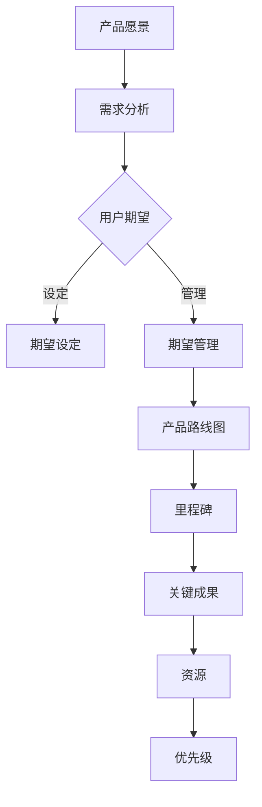

                 

# 如何利用产品路线图管理用户期望

## 1. 背景介绍

在当今快速变化的市场环境中，产品的成功与否不仅取决于其技术实现的优秀性，还取决于用户对其期望的管理。产品路线图作为一种战略工具，可以帮助团队明确产品的愿景、目标和发展方向。然而，如何利用产品路线图来管理用户的期望，确保产品发展与用户需求的平衡，成为了每个产品经理和团队面临的挑战。

本文将探讨如何通过产品路线图来管理用户期望。我们将首先介绍产品路线图的基本概念和组成部分，然后深入分析用户期望的形成和管理，接着探讨如何将两者结合起来。文章还将提供具体的策略和实践方法，并通过实际案例说明这些方法的运用。

通过本文的学习，您将能够：

1. 理解产品路线图的基本概念和作用。
2. 掌握用户期望的形成和管理机制。
3. 学会如何利用产品路线图来管理用户期望。
4. 获得实际操作方法和策略。

## 2. 核心概念与联系

### 产品路线图的定义与组成部分

产品路线图是一种战略工具，用于规划和展示产品的长期发展愿景和阶段性目标。它通常包括以下组成部分：

1. **愿景（Vision）**：描述产品的长远目标和发展方向。
2. **目标（Goals）**：列出实现愿景所需的关键成果。
3. **里程碑（Milestones）**：确定关键时间点，标志着产品的重要进展。
4. **关键成果（Key Results）**：量化目标实现的指标。
5. **资源（Resources）**：列出实现目标所需的资源，包括人力、时间和预算等。
6. **优先级（Priorities）**：明确各项任务的优先级，确保资源高效利用。

### 用户期望的形成与管理

用户期望的形成是一个复杂的过程，涉及到用户对产品的需求、期望和认知。管理用户期望需要了解以下关键点：

1. **需求分析（Need Analysis）**：通过市场调研、用户访谈等方式收集用户需求，理解他们的期望。
2. **期望设定（Expectation Setting）**：在产品规划和宣传过程中，明确用户期望，并通过有效沟通传达给用户。
3. **期望管理（Expectation Management）**：通过持续沟通和透明度，确保用户期望与产品实际情况保持一致。

### 产品路线图与用户期望的联系

产品路线图与用户期望之间存在紧密的联系。产品路线图可以帮助团队明确产品的长期目标和阶段性目标，从而为用户期望的管理提供明确的参考。同时，用户期望也为产品路线图提供了重要的反馈，帮助团队调整和优化产品发展策略。

### Mermaid 流程图

以下是一个简化的产品路线图与用户期望管理的 Mermaid 流程图，用于展示它们之间的联系：



## 3. 核心算法原理 & 具体操作步骤

### 需求分析

需求分析是产品路线图管理用户期望的第一步。具体操作步骤如下：

1. **市场调研**：通过调查问卷、在线调查等方式收集用户对产品的看法和期望。
2. **用户访谈**：与目标用户进行面对面访谈，深入了解他们的需求和期望。
3. **数据分析**：对收集到的数据进行分析，识别用户需求的关键点和期望。
4. **需求文档**：编写详细的需求文档，明确产品的功能、性能和用户体验要求。

### 期望设定

在明确用户需求后，需要通过有效的沟通来设定用户期望。具体操作步骤如下：

1. **产品宣传**：在产品宣传过程中，明确产品的优势和特色，确保用户对产品有正确的期望。
2. **用户反馈**：收集用户对产品的反馈，及时调整宣传内容，确保用户期望与现实相符。
3. **沟通渠道**：建立多样化的沟通渠道，如社交媒体、论坛、邮件等，方便用户表达意见和建议。

### 期望管理

用户期望的管理是一个持续的过程，需要团队与用户保持密切沟通。具体操作步骤如下：

1. **定期沟通**：定期召开产品更新会议，向用户展示产品进展，确保用户了解产品的实际情况。
2. **透明度**：提高产品开发的透明度，让用户了解产品的关键决策和优先级。
3. **反馈机制**：建立有效的反馈机制，鼓励用户提出意见和建议，及时调整产品发展方向。

### 产品路线图更新

产品路线图的更新是管理用户期望的重要手段。具体操作步骤如下：

1. **需求重审**：根据用户反馈和市场需求，定期重审需求文档，确保产品目标与用户期望保持一致。
2. **优先级调整**：根据用户期望和市场变化，调整产品路线图中的优先级，确保资源高效利用。
3. **里程碑更新**：更新产品路线图中的里程碑，确保产品开发进度与用户期望保持一致。

### 核心算法原理

产品路线图管理用户期望的核心算法原理可以概括为以下三点：

1. **用户导向**：始终以用户需求为中心，确保产品目标与用户期望保持一致。
2. **持续沟通**：通过定期沟通和透明度，确保用户了解产品的实际情况，降低期望差异。
3. **灵活调整**：根据用户反馈和市场变化，灵活调整产品路线图，确保产品发展符合用户期望。

## 4. 数学模型和公式 & 详细讲解 & 举例说明

### 数学模型

在产品路线图管理用户期望的过程中，我们可以使用一些数学模型和公式来量化和管理用户期望。以下是一个简化的数学模型：

$$
\text{用户期望} = \text{实际表现} \times \text{感知重要性}
$$

其中，实际表现和感知重要性分别表示用户对产品的实际使用体验和对其重要性的认知。

### 详细讲解

1. **实际表现**：实际表现反映了用户在使用产品过程中的实际体验。它可以通过以下指标来量化：
   - 功能实现程度：产品实现了多少用户期望的功能？
   - 性能表现：产品的性能是否符合用户期望？
   - 用户体验：用户对产品的整体满意度如何？

2. **感知重要性**：感知重要性反映了用户对产品的期望和需求的重视程度。它可以通过以下因素来影响：
   - 用户需求强度：用户对某一功能的期望强度如何？
   - 用户体验预期：用户对产品的用户体验预期如何？
   - 市场竞争：产品的市场竞争力如何？

### 举例说明

假设一个在线教育平台，用户期望在平台上找到高质量的课程。我们可以使用上述数学模型来分析用户期望：

1. **实际表现**：
   - 功能实现程度：平台提供了100门课程，用户期望找到50门高质量的课程，实际实现了80门。
   - 性能表现：平台的搜索功能快速且准确，用户满意度较高。
   - 用户体验：用户对平台的界面设计和使用便捷性给予了较高的评价。

2. **感知重要性**：
   - 用户需求强度：用户对高质量课程的期望很高，因为他们希望在有限的时间内获得最大收益。
   - 用户体验预期：用户期望平台能够提供高质量的内容和良好的用户体验。
   - 市场竞争：市场上存在多家竞争平台，用户期望平台能够提供更具竞争力的课程和体验。

根据上述数据，我们可以计算出用户期望：

$$
\text{用户期望} = 0.8 \times 0.9 = 0.72
$$

其中，0.8表示实际表现，0.9表示感知重要性。计算结果0.72表示用户对平台的期望为72%，这意味着用户对平台的整体满意度较高。

通过上述数学模型和公式，我们可以量化用户期望，并进一步分析用户期望与产品实际情况之间的关系，从而为产品优化提供有力支持。

## 5. 项目实战：代码实际案例和详细解释说明

在本节中，我们将通过一个实际的项目案例，展示如何利用产品路线图管理用户期望。以下是一个在线教育平台的代码实现案例。

### 5.1 开发环境搭建

首先，我们需要搭建一个基本的开发环境。以下是搭建步骤：

1. **安装Node.js**：访问 [Node.js官网](https://nodejs.org/) 下载并安装Node.js。
2. **安装npm**：Node.js安装完成后，npm（Node Package Manager）会自动安装。
3. **创建项目文件夹**：在命令行中创建一个项目文件夹，例如 `online_education_platform`。
4. **初始化项目**：在项目文件夹中运行 `npm init` 命令，初始化项目。
5. **安装依赖**：在项目中安装必要的依赖，如 `express`（一个Node.js Web框架）、`mysql`（一个MySQL数据库客户端）等。

以下是部分依赖的安装命令：

```bash
npm install express mysql
```

### 5.2 源代码详细实现和代码解读

以下是项目的核心代码，用于实现用户管理、课程搜索和用户反馈等功能。

```javascript
// 引入必要的依赖
const express = require('express');
const mysql = require('mysql');

// 创建数据库连接
const db = mysql.createConnection({
  host: 'localhost',
  user: 'root',
  password: 'password',
  database: 'online_education_platform'
});

// 创建Express应用实例
const app = express();

// 设置中间件
app.use(express.json());

// 用户登录接口
app.post('/login', (req, res) => {
  const { username, password } = req.body;
  // 查询用户信息
  db.query('SELECT * FROM users WHERE username = ? AND password = ?', [username, password], (err, result) => {
    if (err) throw err;
    if (result.length > 0) {
      res.json({ status: 'success', message: '登录成功' });
    } else {
      res.json({ status: 'error', message: '用户名或密码错误' });
    }
  });
});

// 课程搜索接口
app.post('/search_courses', (req, res) => {
  const { keyword } = req.body;
  // 查询课程信息
  db.query('SELECT * FROM courses WHERE title LIKE ?', ['%' + keyword + '%'], (err, result) => {
    if (err) throw err;
    res.json({ status: 'success', courses: result });
  });
});

// 用户反馈接口
app.post('/feedback', (req, res) => {
  const { username, course_id, feedback } = req.body;
  // 插入反馈信息
  db.query('INSERT INTO feedback (username, course_id, feedback) VALUES (?, ?, ?)', [username, course_id, feedback], (err, result) => {
    if (err) throw err;
    res.json({ status: 'success', message: '反馈提交成功' });
  });
});

// 启动服务器
app.listen(3000, () => {
  console.log('服务器启动成功，监听端口：3000');
});
```

### 5.3 代码解读与分析

以下是对上述代码的解读和分析：

1. **数据库连接**：使用 `mysql` 库创建数据库连接，配置数据库连接参数，如主机、用户名、密码和数据库名称。

2. **创建Express应用实例**：使用 `express` 库创建Web应用实例，这是整个项目的核心。

3. **设置中间件**：使用 `express.json()` 中间件解析JSON请求体。

4. **用户登录接口**：定义 `/login` 接口，用于处理用户登录请求。请求体包含用户名和密码，查询数据库以验证用户信息。如果验证成功，返回登录成功消息；否则，返回错误消息。

5. **课程搜索接口**：定义 `/search_courses` 接口，用于处理课程搜索请求。请求体包含搜索关键词，查询数据库以查找符合关键词的课程。返回搜索结果。

6. **用户反馈接口**：定义 `/feedback` 接口，用于处理用户反馈请求。请求体包含用户名、课程ID和反馈内容，将反馈信息插入数据库。

7. **启动服务器**：使用 `app.listen()` 方法启动服务器，监听指定端口（本例为3000）。

### 5.4 代码优化的建议

1. **错误处理**：增加对数据库查询错误的处理，例如使用 `try-catch` 语句捕获异常。
2. **安全性**：对用户输入进行验证，防止SQL注入攻击。
3. **性能优化**：使用缓存和索引提高数据库查询性能。

通过以上代码实现，我们可以看到如何利用产品路线图管理用户期望。在实际项目中，我们需要根据用户需求不断优化和调整代码，确保产品与用户期望保持一致。

## 6. 实际应用场景

产品路线图在管理用户期望方面的应用场景非常广泛。以下是一些典型的应用场景：

### 1. 互联网产品

在互联网产品中，产品路线图可以帮助团队明确产品的功能规划和发展方向，确保产品满足用户需求。例如，一个在线教育平台可以使用产品路线图来规划课程的更新、新功能的添加以及用户体验的改进。

### 2. 企业级应用

对于企业级应用，产品路线图可以帮助企业明确产品的发展目标和关键里程碑，确保产品能够满足企业业务需求。例如，一个企业资源规划（ERP）系统可以使用产品路线图来规划新模块的引入、现有功能的优化以及与业务流程的集成。

### 3. 智能家居产品

在智能家居产品中，产品路线图可以帮助团队规划产品的功能扩展、硬件升级以及用户体验的提升。例如，一个智能门锁可以使用产品路线图来规划指纹识别、远程监控等新功能的引入。

### 4. 健康医疗产品

健康医疗产品通常具有复杂的功能和严格的性能要求。产品路线图可以帮助团队明确产品的开发进度和里程碑，确保产品能够满足用户的健康需求。例如，一个远程医疗平台可以使用产品路线图来规划新功能的引入、数据安全和隐私保护的加强。

### 5. 金融科技产品

金融科技产品通常涉及大量的用户数据和安全问题。产品路线图可以帮助团队明确产品的安全策略、功能规划和用户体验，确保产品能够满足用户的需求和期望。例如，一个移动支付平台可以使用产品路线图来规划新支付方式的引入、用户界面优化以及交易安全的加强。

### 6. 社交媒体平台

社交媒体平台需要不断更新和改进功能，以满足用户的多样化需求。产品路线图可以帮助团队明确产品的功能规划和发展方向，确保产品能够吸引和留住用户。例如，一个社交媒体平台可以使用产品路线图来规划新功能的引入、用户体验的优化以及社区管理的加强。

通过上述应用场景，我们可以看到产品路线图在管理用户期望方面的关键作用。它不仅帮助团队明确产品的长期目标和阶段性目标，还通过透明度和持续沟通，确保用户期望与产品实际情况保持一致。

## 7. 工具和资源推荐

### 7.1 学习资源推荐

1. **书籍**：
   - 《产品经理手册》：详细介绍了产品管理的方法和实践，适合初学者和进阶者。
   - 《用户体验要素》：探讨了用户体验设计的关键要素，对产品经理和设计师都有很大启发。

2. **论文**：
   - “User Experience Design for Product Managers”：一篇关于用户体验设计在产品管理中的角色和重要性的论文。
   - “Managing User Expectations in Software Development”：一篇关于如何通过管理用户期望来提高软件项目成功的论文。

3. **博客**：
   - “Product School”：提供丰富的产品管理课程和博客文章，适合产品经理学习和交流。
   - “Intercom on Product Management”：Intercom公司官方博客，分享产品管理的最佳实践和案例分析。

4. **网站**：
   - “ProductPlan”：一个专业的产品路线图工具网站，提供详细的路线图模板和教程。
   - “Aha!”：一个产品路线图和管理平台，提供丰富的资源和工具，帮助团队更好地规划产品发展。

### 7.2 开发工具框架推荐

1. **产品路线图工具**：
   - **ProductPlan**：一个强大的在线产品路线图工具，提供可视化界面和丰富的模板。
   - **Aha!**：一个集产品路线图、需求管理和团队协作于一体的平台，适合大型团队使用。

2. **项目管理工具**：
   - **Trello**：一个简单易用的项目管理工具，适合小团队和项目协作。
   - **JIRA**：一个功能丰富的项目管理工具，适合大型团队和复杂项目。

3. **代码管理工具**：
   - **Git**：一个分布式版本控制系统，是软件开发中必不可少的工具。
   - **GitHub**：Git的在线版本控制平台，提供代码托管、协作和项目管理功能。

4. **数据库管理工具**：
   - **MySQL**：一个流行的关系型数据库管理系统，适合中小型应用。
   - **PostgreSQL**：一个功能强大的开源关系型数据库，适合复杂应用。

通过这些工具和资源的支持，产品经理和团队能够更好地规划和管理产品路线图，确保产品发展与用户期望保持一致。

## 8. 总结：未来发展趋势与挑战

在未来的发展趋势中，产品路线图将更加智能化和自动化。随着人工智能技术的进步，产品路线图将能够根据市场变化和用户反馈自动调整，提高产品规划的准确性和灵活性。此外，用户期望管理也将变得更加精细化，通过大数据分析和用户行为研究，团队能够更准确地预测和满足用户需求。

然而，未来也面临着一系列挑战。首先，如何在不断变化的市场环境中保持产品与用户期望的一致性是一个难题。其次，随着产品功能的不断增加，如何确保产品架构的稳定性和可维护性也是一大挑战。此外，团队协作和信息透明度也是影响产品成功的关键因素。

为了应对这些挑战，产品经理和团队需要不断提升自身的技能和能力，利用先进的技术和工具来优化产品规划和用户期望管理。通过持续学习和实践，团队能够更好地应对未来的挑战，实现产品的长期成功。

## 9. 附录：常见问题与解答

### 1. 产品路线图是什么？

产品路线图是一种战略工具，用于规划和展示产品的长期发展愿景和阶段性目标。它通常包括愿景、目标、里程碑、关键成果、资源和优先级等组成部分。

### 2. 用户期望如何形成？

用户期望的形成是一个复杂的过程，涉及到用户对产品的需求、认知和体验。用户期望可以通过市场调研、用户访谈、数据分析等方式进行收集和分析。

### 3. 如何利用产品路线图管理用户期望？

利用产品路线图管理用户期望的方法包括：进行需求分析，设定合理的用户期望，通过持续沟通和透明度来确保用户期望与产品实际情况保持一致，以及根据用户反馈和市场变化灵活调整产品路线图。

### 4. 产品路线图与用户期望的关系是什么？

产品路线图与用户期望之间存在紧密的联系。产品路线图可以帮助团队明确产品的长期目标和阶段性目标，从而为用户期望的管理提供明确的参考。同时，用户期望也为产品路线图提供了重要的反馈，帮助团队调整和优化产品发展策略。

### 5. 如何确保产品与用户期望保持一致？

确保产品与用户期望保持一致的方法包括：定期进行需求分析，了解用户需求的变化；通过透明的沟通渠道，及时向用户传达产品的实际进展；根据用户反馈和市场变化，灵活调整产品路线图和开发计划。

### 6. 产品路线图的更新频率是多少？

产品路线图的更新频率取决于产品的复杂性和市场变化。一般来说，大型项目可能需要每季度或每半年进行一次全面的更新，而小型项目可能每季度或每季度进行一次更新。

### 7. 用户反馈在产品路线图中扮演什么角色？

用户反馈在产品路线图中扮演关键角色。它不仅帮助团队了解用户的实际体验和需求，还为产品优化和改进提供了重要依据。通过收集和分析用户反馈，团队能够更准确地把握用户期望，确保产品发展与用户需求保持一致。

## 10. 扩展阅读 & 参考资料

- 《产品经理手册》：作者：史蒂夫·布兰克，提供了详细的产品管理方法和实践。
- 《用户体验要素》：作者：阿尔文·格拉瑟，探讨了用户体验设计的关键要素。
- “User Experience Design for Product Managers”：论文，讨论了用户体验设计在产品管理中的角色和重要性。
- “Managing User Expectations in Software Development”：论文，介绍了如何通过管理用户期望来提高软件项目成功。
- “Product School”：博客，提供丰富的产品管理课程和文章。
- “Intercom on Product Management”：博客，分享产品管理的最佳实践和案例分析。
- “ProductPlan”：产品路线图工具网站，提供详细的路线图模板和教程。
- “Aha!”：产品路线图和管理平台，提供丰富的资源和工具。
- “Trello”：项目管理工具，适合小团队和项目协作。
- “JIRA”：项目管理工具，适合大型团队和复杂项目。
- “Git”：版本控制系统，是软件开发中必不可少的工具。
- “GitHub”：Git的在线版本控制平台，提供代码托管、协作和项目管理功能。
- “MySQL”：关系型数据库管理系统，适合中小型应用。
- “PostgreSQL”：关系型数据库，适合复杂应用。

