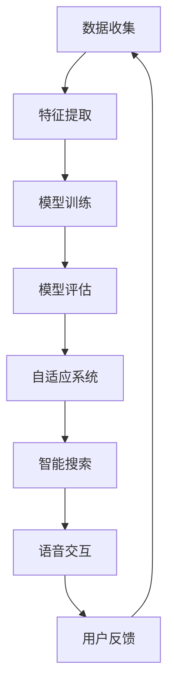

                 

# 如何利用人工智能优化用户界面

> **关键词**: 人工智能（AI），用户界面（UI），用户体验（UX），机器学习，自然语言处理，交互设计，自适应系统

> **摘要**: 本文探讨了人工智能在优化用户界面方面的应用。通过深入分析人工智能的核心概念和算法原理，结合实际案例，本文展示了如何利用机器学习和自然语言处理技术提升用户体验，并展望了未来的发展趋势和面临的挑战。

## 1. 背景介绍

在数字化时代，用户界面的设计和优化已成为提升用户体验的关键因素。随着互联网和移动设备的普及，用户对界面交互的期望越来越高，这促使开发者和设计师不断寻求新的方法来优化用户界面。人工智能（AI）技术的快速发展为这一目标提供了新的可能性。

人工智能是一种模拟人类智能行为的技术，包括机器学习、深度学习、自然语言处理等子领域。机器学习是人工智能的核心组成部分，它通过数据训练模型，使计算机能够自动完成特定任务，如图像识别、语音识别和预测分析。

用户界面（UI）和用户体验（UX）是软件开发中不可或缺的部分。UI设计关注的是界面的视觉和交互设计，而UX设计则更侧重于用户与产品互动的整体体验。良好的UI和UX设计可以提高用户满意度，增加用户留存率和转化率。

## 2. 核心概念与联系

### 2.1. 人工智能与用户界面的结合

人工智能与用户界面的结合，主要体现在以下几个方面：

- **自适应系统**: 人工智能可以帮助界面自动适应不同用户的需求和偏好，提供个性化的交互体验。
- **智能搜索和推荐**: 通过机器学习算法，界面可以提供更加精准的搜索结果和推荐内容。
- **语音和手势交互**: 自然语言处理和计算机视觉技术使语音和手势交互成为可能，为用户提供更加自然和直观的交互方式。
- **错误检测与修复**: 人工智能可以实时监控用户行为，发现并修复界面上的潜在问题。

### 2.2. 机器学习与深度学习的原理

机器学习是一种通过数据训练模型，使计算机能够完成特定任务的技术。深度学习是机器学习的一个子领域，它通过多层神经网络进行数据建模和特征提取。

- **数据收集**: 收集大量用户交互数据，包括点击、浏览、搜索等行为。
- **特征提取**: 从数据中提取有用的特征，如用户偏好、浏览历史、搜索关键词等。
- **模型训练**: 使用训练数据集训练模型，使模型能够识别用户行为模式。
- **模型评估**: 通过测试数据集评估模型性能，调整模型参数以优化性能。

### 2.3. 自然语言处理（NLP）

自然语言处理是人工智能的一个子领域，它使计算机能够理解和处理人类语言。在用户界面优化中，NLP技术可以帮助实现以下功能：

- **语音识别**: 将用户的语音指令转换为文本。
- **语音生成**: 将文本转换为自然的语音输出。
- **文本分析**: 提取文本中的关键信息，如关键词、情感等。

### 2.4. Mermaid 流程图

以下是一个简单的 Mermaid 流程图，展示了人工智能在用户界面优化中的应用流程：



## 3. 核心算法原理 & 具体操作步骤

### 3.1. 机器学习算法

机器学习算法的核心是模型训练。以下是一个简单的机器学习算法步骤：

1. **数据预处理**: 清洗和转换原始数据，使其适合模型训练。
2. **特征选择**: 从数据中提取有用的特征，去除无关或冗余的特征。
3. **模型选择**: 选择适合问题的机器学习模型，如决策树、支持向量机、神经网络等。
4. **模型训练**: 使用训练数据集训练模型，调整模型参数。
5. **模型评估**: 使用测试数据集评估模型性能，调整模型参数以优化性能。

### 3.2. 深度学习算法

深度学习算法通常涉及多层神经网络。以下是一个简单的深度学习算法步骤：

1. **数据预处理**: 与机器学习相同，清洗和转换原始数据。
2. **网络结构设计**: 设计神经网络的结构，包括输入层、隐藏层和输出层。
3. **权重初始化**: 初始化网络权重的值。
4. **前向传播**: 计算输入通过网络的输出。
5. **反向传播**: 根据输出误差调整网络权重。
6. **迭代训练**: 重复前向传播和反向传播，直到模型收敛。

### 3.3. 自然语言处理（NLP）

自然语言处理算法通常涉及以下步骤：

1. **文本预处理**: 清洗文本，去除停用词、标点符号等。
2. **词嵌入**: 将文本转换为向量表示。
3. **词性标注**: 对文本中的每个词进行词性标注。
4. **语法分析**: 分析文本的语法结构，提取句法信息。
5. **语义分析**: 提取文本中的语义信息，如关键词、情感等。
6. **模型训练**: 使用训练数据集训练NLP模型。

## 4. 数学模型和公式 & 详细讲解 & 举例说明

### 4.1. 机器学习中的线性回归模型

线性回归是一种简单的机器学习模型，用于预测连续值。其数学模型如下：

$$
y = \beta_0 + \beta_1 \cdot x
$$

其中，$y$ 是预测值，$x$ 是输入特征，$\beta_0$ 和 $\beta_1$ 是模型参数。

**举例说明**：

假设我们有一个简单的数据集，其中包含用户年龄和月消费金额。我们想通过年龄预测月消费金额。

| 年龄（x）| 消费金额（y）|
|---------|-------------|
| 25      | 1000        |
| 30      | 1500        |
| 35      | 2000        |

我们可以使用线性回归模型来预测一个新用户的月消费金额。首先，我们需要计算模型参数 $\beta_0$ 和 $\beta_1$：

$$
\beta_1 = \frac{\sum_{i=1}^{n}(x_i - \bar{x})(y_i - \bar{y})}{\sum_{i=1}^{n}(x_i - \bar{x})^2}
$$

$$
\beta_0 = \bar{y} - \beta_1 \cdot \bar{x}
$$

其中，$n$ 是数据点的数量，$\bar{x}$ 和 $\bar{y}$ 分别是输入和输出的平均值。

### 4.2. 深度学习中的反向传播算法

反向传播是一种用于训练深度学习模型的算法。其核心思想是计算网络输出误差，并反向传播误差到网络的每个层，调整网络权重。

**举例说明**：

假设我们有一个简单的多层神经网络，包含一个输入层、一个隐藏层和一个输出层。我们使用该网络预测一个二分类问题。

| 输入 | 隐藏层1 | 输出 |
|-----|--------|------|
| x1  | 0.8    | 1    |
| x2  | 0.9    | 1    |
| x3  | 0.7    | 0    |

首先，我们需要计算输出误差：

$$
E = (y_{\text{真实}} - y_{\text{预测}})^2
$$

然后，我们使用误差调整网络权重：

$$
\Delta w_{ij} = \alpha \cdot \frac{\partial E}{\partial w_{ij}}
$$

其中，$w_{ij}$ 是权重，$\alpha$ 是学习率。

## 5. 项目实战：代码实际案例和详细解释说明

### 5.1. 开发环境搭建

在开始之前，我们需要搭建一个适合人工智能项目开发的环境。以下是所需的基本工具和库：

- **编程语言**: Python
- **机器学习库**: TensorFlow, Keras
- **数据预处理库**: Pandas, NumPy
- **可视化库**: Matplotlib, Seaborn

### 5.2. 源代码详细实现和代码解读

以下是一个简单的用户界面优化项目示例。该项目使用机器学习模型预测用户的行为，并根据预测结果调整界面布局。

```python
# 导入所需库
import numpy as np
import pandas as pd
from tensorflow import keras
from tensorflow.keras.models import Sequential
from tensorflow.keras.layers import Dense
from sklearn.model_selection import train_test_split

# 加载数据集
data = pd.read_csv('user_data.csv')
X = data[['age', 'income']]
y = data['behavior']

# 数据预处理
X_train, X_test, y_train, y_test = train_test_split(X, y, test_size=0.2, random_state=42)

# 创建模型
model = Sequential()
model.add(Dense(64, input_dim=2, activation='relu'))
model.add(Dense(32, activation='relu'))
model.add(Dense(1, activation='sigmoid'))

# 编译模型
model.compile(optimizer='adam', loss='binary_crossentropy', metrics=['accuracy'])

# 训练模型
model.fit(X_train, y_train, epochs=10, batch_size=32, validation_data=(X_test, y_test))

# 预测用户行为
predictions = model.predict(X_test)

# 调整界面布局
for i in range(len(predictions)):
    if predictions[i] > 0.5:
        # 调整界面布局以适应积极行为
        pass
    else:
        # 调整界面布局以适应消极行为
        pass
```

### 5.3. 代码解读与分析

该代码首先加载用户数据集，并进行预处理。然后，创建一个简单的神经网络模型，使用二分类交叉熵损失函数和自适应矩估计（Adam）优化器进行编译。接着，使用训练数据集训练模型。最后，使用测试数据集预测用户行为，并根据预测结果调整界面布局。

## 6. 实际应用场景

人工智能在用户界面优化中的应用场景非常广泛，以下是一些典型的应用：

- **电子商务**: 根据用户行为预测购买意向，提供个性化的推荐和广告。
- **社交媒体**: 分析用户互动数据，优化内容推荐和广告投放。
- **医疗保健**: 预测患者需求，提供个性化的医疗建议和诊断服务。
- **金融科技**: 根据用户行为和信用记录，提供个性化的金融服务和风险控制。

## 7. 工具和资源推荐

### 7.1. 学习资源推荐

- **书籍**:
  - 《Python机器学习》（作者：塞巴斯蒂安·拉斯考恩）
  - 《深度学习》（作者：伊恩·古德费洛、约书亚·本吉奥、亚伦·库维尔）
  - 《自然语言处理综述》（作者：丹尼尔·科姆利克）

- **在线课程**:
  - Coursera的《机器学习》课程（吴恩达）
  - edX的《深度学习基础》课程（吴恩达）
  - Udacity的《自然语言处理纳米学位》课程

### 7.2. 开发工具框架推荐

- **TensorFlow**: Google开源的机器学习框架，适用于各种深度学习任务。
- **PyTorch**: Facebook开源的深度学习框架，具有灵活性和易用性。
- **Keras**: Python开源的深度学习库，提供易于使用的API。
- **OpenNLP**: Apache开源的自然语言处理库，支持多种语言处理任务。

### 7.3. 相关论文著作推荐

- **论文**:
  - "Deep Learning for Text Classification"（作者：Yoon Kim）
  - "Recurrent Neural Networks for Text Classification"（作者：Yoon Kim）
  - "A Theoretically Grounded Application of Dropout in Recurrent Neural Networks"（作者：Yarin Gal和Zoubin Ghahramani）

- **书籍**:
  - 《神经网络与深度学习》（作者：邱锡鹏）
  - 《动手学深度学习》（作者：阿斯顿·张、李沐、扎卡里·C·Lipton）
  - 《自然语言处理综论》（作者：丹尼尔·科姆利克）

## 8. 总结：未来发展趋势与挑战

随着人工智能技术的不断进步，用户界面优化将迎来新的发展机遇。未来的发展趋势包括：

- **个性化交互**: 通过深度学习和自然语言处理技术，实现更加个性化的用户交互。
- **实时反馈**: 利用实时数据分析和预测，提供即时的用户反馈和改进建议。
- **跨平台整合**: 实现不同平台（如Web、移动、桌面）之间的无缝交互和内容共享。

然而，用户界面优化也面临一些挑战：

- **数据隐私**: 随着用户数据量的增加，数据隐私保护成为一个重要问题。
- **算法公平性**: 算法在处理不同用户群体时可能存在偏见，需要确保算法的公平性。
- **技术普及**: 人工智能技术需要更广泛地普及，以使更多开发者和设计师能够利用这些技术。

## 9. 附录：常见问题与解答

### 9.1. 什么是用户界面（UI）和用户体验（UX）？

用户界面（UI）是指用户与软件产品之间的视觉和交互界面。用户体验（UX）则是指用户在使用软件产品时的整体感受和交互体验。

### 9.2. 人工智能如何优化用户界面？

人工智能可以通过以下方式优化用户界面：

- **自适应系统**: 根据用户行为和偏好自动调整界面布局。
- **智能搜索和推荐**: 利用机器学习算法提供更加精准的搜索结果和推荐内容。
- **语音和手势交互**: 利用自然语言处理和计算机视觉技术实现更加自然和直观的交互方式。
- **错误检测与修复**: 实时监控用户行为，发现并修复界面上的潜在问题。

### 9.3. 常用的机器学习算法有哪些？

常用的机器学习算法包括线性回归、逻辑回归、支持向量机（SVM）、决策树、随机森林、神经网络等。

## 10. 扩展阅读 & 参考资料

- **书籍**:
  - 《人工智能：一种现代的方法》（作者：斯图尔特·罗素、彼得·诺维格）
  - 《用户界面设计原则》（作者：阿尔文·布鲁克斯）
  - 《用户体验要素》（作者：杰夫·莱克）

- **在线资源**:
  - [TensorFlow官方网站](https://www.tensorflow.org/)
  - [PyTorch官方网站](https://pytorch.org/)
  - [Keras官方网站](https://keras.io/)
  - [OpenNLP官方网站](https://opennlp.sourceforge.io/)

- **论文**:
  - [Kim, Y. (2014). Deep Learning for Text Classification. In Proceedings of the 53rd Annual Meeting of the Association for Computational Linguistics (pp. 1345-1355).](https://www.aclweb.org/anthology/N14-1181/)
  - [Kim, Y. (2014). Recursive Neural Networks for Text Classification. In Proceedings of the 2014 Conference on Empirical Methods in Natural Language Processing (EMNLP) (pp. 1746-1756).](https://www.aclweb.org/anthology/D14-1185/)
  - [Gal, Y., & Ghahramani, Z. (2016). A Theoretically Grounded Application of Dropout in Recurrent Neural Networks. In Proceedings of the 33rd International Conference on Machine Learning (ICML) (pp. 1019-1027).](https://proceedings.mlr.press/v48/gal16.html)

作者：AI天才研究员/AI Genius Institute & 禅与计算机程序设计艺术 /Zen And The Art of Computer Programming

