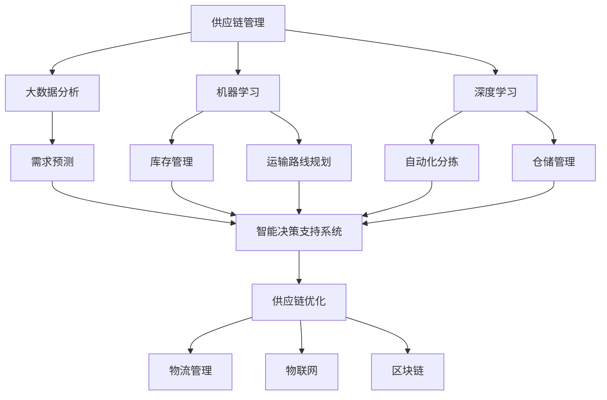

                 

### 背景介绍

#### 创业供应链和物流管理的重要性

在当今全球化的商业环境中，创业供应链和物流管理成为了企业成功的关键因素之一。供应链涵盖了从原材料采购到产品交付给终端客户的整个流程，而物流管理则是指将货物在供应链中高效、准确地运输和存储的过程。对于一个创业公司来说，高效的供应链和物流管理不仅能够降低成本、提高生产效率，还能够提升客户满意度，从而在激烈的市场竞争中脱颖而出。

然而，传统的供应链和物流管理方式往往面临诸多挑战。例如，信息孤岛现象普遍存在，各个部门之间的信息交流不畅，导致决策延迟和资源浪费。此外，供应链中的不确定性因素（如天气、交通延误、供应链中断等）也增加了管理的复杂性。这些挑战使得创业公司在进行供应链和物流管理时，往往面临效率低下、成本高昂的风险。

随着人工智能（AI）技术的迅猛发展，利用AI技术优化创业供应链和物流管理成为了可能。AI技术能够通过大数据分析、机器学习算法和智能决策支持系统，为企业提供实时、精准的数据分析和预测能力，从而实现供应链和物流管理的智能化、自动化和高效化。这不仅有助于企业降低运营成本，提高资源利用率，还能够提升客户体验，增强市场竞争力。

#### 人工智能在供应链和物流管理中的应用

人工智能在供应链和物流管理中的应用主要包括以下几个方面：

1. **需求预测与库存管理**：通过大数据分析和机器学习算法，AI技术能够预测市场需求变化，优化库存水平，减少库存成本和缺货风险。
2. **运输路线优化**：AI技术可以根据实时交通状况、货物特性和运输成本等因素，自动规划最优运输路线，提高运输效率。
3. **仓储管理**：AI技术可以通过图像识别、自动分拣等技术，实现仓储过程的自动化和智能化，提高仓库利用率和货物处理速度。
4. **智能决策支持**：AI技术可以为企业提供实时的决策支持，帮助企业在面对供应链中断、市场波动等不确定情况时，做出快速、准确的决策。
5. **风险监控与预警**：AI技术可以实时监控供应链的运行状况，发现潜在的风险和问题，并提前预警，帮助企业采取预防措施。

总之，人工智能技术在供应链和物流管理中的应用，不仅能够提高企业的运营效率，降低成本，还能够增强企业的应变能力和市场竞争力。随着AI技术的不断发展和成熟，我们有理由相信，它将为创业供应链和物流管理带来更加广阔的发展前景。

### 核心概念与联系

为了深入探讨如何利用人工智能技术优化创业供应链和物流管理，我们首先需要了解几个核心概念及其相互联系。以下是这些概念的定义及它们在供应链和物流管理中的重要性：

#### 1. 人工智能（AI）

人工智能（Artificial Intelligence，简称AI）是指使计算机系统能够模拟人类智能行为的技术。它包括机器学习（Machine Learning）、深度学习（Deep Learning）、自然语言处理（Natural Language Processing）等多个子领域。在供应链和物流管理中，AI技术可以用于需求预测、路线规划、库存管理等。

#### 2. 大数据分析（Data Analytics）

大数据分析是指利用数据挖掘和统计分析方法，从大量数据中提取有价值信息的过程。在供应链和物流管理中，大数据分析可以帮助企业理解市场趋势、优化库存水平、提升运输效率等。

#### 3. 机器学习（Machine Learning）

机器学习是一种让计算机通过数据学习并做出预测或决策的技术。它包括监督学习（Supervised Learning）、无监督学习（Unsupervised Learning）和强化学习（Reinforcement Learning）等。在供应链和物流管理中，机器学习可以用于需求预测、库存优化和运输路线规划。

#### 4. 深度学习（Deep Learning）

深度学习是机器学习的一个子领域，它使用多层神经网络进行学习和预测。深度学习在图像识别、语音识别和自然语言处理等领域具有显著优势。在供应链和物流管理中，深度学习可以用于自动化分拣、运输路线优化和仓储管理。

#### 5. 供应链管理（Supply Chain Management）

供应链管理是指协调和控制供应链中各个环节，从原材料采购到产品交付给终端客户的全过程。供应链管理包括采购管理、库存管理、运输管理、仓储管理等。人工智能技术可以优化这些环节，提高供应链的效率。

#### 6. 物流管理（Logistics Management）

物流管理是指管理和优化货物在供应链中的运输和存储过程。物流管理包括运输计划、运输路线规划、仓储管理、配送管理等。人工智能技术可以帮助物流企业实现运输路线优化、仓储自动化和配送效率提升。

#### 7. 智能决策支持系统（Intelligent Decision Support System）

智能决策支持系统是一种利用人工智能技术，提供实时决策支持和优化方案的工具。在供应链和物流管理中，智能决策支持系统可以帮助企业应对市场变化、降低风险和提升效率。

#### 8. 物联网（Internet of Things，简称IoT）

物联网是指通过传感器、设备和系统连接，实现设备之间数据交换和互动的技术。在供应链和物流管理中，物联网可以用于实时监控运输过程、优化仓储管理、提高库存准确率等。

#### 9. 区块链（Blockchain）

区块链是一种分布式数据库技术，通过加密算法和共识机制，确保数据的安全性和不可篡改性。在供应链和物流管理中，区块链可以用于记录交易信息、监控供应链过程、提高透明度和可追溯性。

### Mermaid 流程图

以下是一个简化的 Mermaid 流程图，展示了上述核心概念在供应链和物流管理中的相互关系：



通过这个流程图，我们可以清楚地看到人工智能技术如何贯穿于供应链和物流管理的各个环节，实现各个环节的优化和协同。接下来，我们将深入探讨这些核心算法原理及其具体操作步骤，帮助读者更好地理解如何利用人工智能技术优化创业供应链和物流管理。

### 核心算法原理 & 具体操作步骤

在深入探讨如何利用人工智能技术优化创业供应链和物流管理之前，我们需要先了解一些核心算法原理。这些算法包括机器学习算法、深度学习算法和强化学习算法，它们在供应链和物流管理中发挥着至关重要的作用。

#### 1. 机器学习算法

机器学习算法是人工智能的基础，它通过数据学习并做出预测或决策。以下是一些在供应链和物流管理中常用的机器学习算法：

##### a. 线性回归（Linear Regression）

线性回归是一种用于预测数值结果的算法，它通过建立一个线性模型来描述变量之间的关系。在供应链管理中，线性回归可以用于预测产品需求量、库存水平和运输成本等。

**操作步骤：**

1. 收集历史销售数据、库存数据和运输成本数据。
2. 使用统计方法分析数据，确定线性关系。
3. 建立线性回归模型，并进行训练。
4. 使用训练好的模型进行预测。

**数学模型和公式：**

$$ y = w_0 + w_1x_1 + w_2x_2 + \ldots + w_nx_n $$

其中，$y$ 为预测结果，$w_0, w_1, w_2, \ldots, w_n$ 为模型参数，$x_1, x_2, \ldots, x_n$ 为输入特征。

##### b. 决策树（Decision Tree）

决策树是一种树形结构模型，它通过一系列判断条件来预测结果。在供应链和物流管理中，决策树可以用于选择最优运输方式、库存策略和配送路线等。

**操作步骤：**

1. 收集相关数据，确定决策树的特征和目标变量。
2. 使用决策树算法进行训练，生成决策树模型。
3. 使用训练好的模型进行预测。

**数学模型和公式：**

决策树模型的构建过程涉及信息增益（Information Gain）、基尼不纯度（Gini Impurity）等概念。

##### c. 随机森林（Random Forest）

随机森林是一种集成学习算法，它通过构建多个决策树并取平均值来提高预测准确性。在供应链和物流管理中，随机森林可以用于需求预测、库存管理和运输路线规划。

**操作步骤：**

1. 收集数据，确定随机森林的参数，如树的数量、树的最大深度等。
2. 使用随机森林算法进行训练。
3. 使用训练好的模型进行预测。

**数学模型和公式：**

随机森林模型的预测结果是通过多个决策树的预测结果取平均值得到的。

#### 2. 深度学习算法

深度学习算法是机器学习的一个子领域，它使用多层神经网络进行学习和预测。以下是一些在供应链和物流管理中常用的深度学习算法：

##### a. 卷积神经网络（Convolutional Neural Network，简称CNN）

CNN 是一种用于图像识别和处理的神经网络模型，它在供应链和物流管理中可以用于自动化分拣、货物识别和仓库监控等。

**操作步骤：**

1. 收集图像数据，进行数据预处理。
2. 构建卷积神经网络模型。
3. 使用训练好的模型进行预测。

**数学模型和公式：**

$$ h_l = \sigma(\mathbf{W}^{(l)} \mathbf{a}^{(l-1)} + \mathbf{b}^{(l)}) $$

其中，$h_l$ 为第 $l$ 层的激活值，$\mathbf{W}^{(l)}$ 和 $\mathbf{b}^{(l)}$ 分别为第 $l$ 层的权重和偏置，$\sigma$ 为激活函数，$\mathbf{a}^{(l-1)}$ 为第 $l-1$ 层的激活值。

##### b. 长短时记忆网络（Long Short-Term Memory，简称LSTM）

LSTM 是一种用于处理序列数据的神经网络模型，它在供应链和物流管理中可以用于时间序列预测、需求规划和库存管理。

**操作步骤：**

1. 收集时间序列数据，进行数据预处理。
2. 构建LSTM网络模型。
3. 使用训练好的模型进行预测。

**数学模型和公式：**

$$ \mathbf{i} = \sigma(\mathbf{W}_i \mathbf{h}_{l-1} + \mathbf{b}_i) $$
$$ \mathbf{f} = \sigma(\mathbf{W}_f \mathbf{h}_{l-1} + \mathbf{b}_f) $$
$$ \mathbf{C} = \mathbf{f} \odot \mathbf{C}_{l-1} + \mathbf{i} \odot \tanh(\mathbf{W}_c \mathbf{h}_{l-1} + \mathbf{b}_c) $$
$$ \mathbf{o} = \sigma(\mathbf{W}_o \mathbf{h}_{l-1} + \mathbf{b}_o) $$
$$ \mathbf{h}_l = \mathbf{o} \odot \tanh(\mathbf{C}_l) $$

其中，$\mathbf{i}$、$\mathbf{f}$、$\mathbf{C}$ 和 $\mathbf{o}$ 分别为输入门、遗忘门、单元状态和输出门，$\mathbf{W}_i$、$\mathbf{W}_f$、$\mathbf{W}_c$ 和 $\mathbf{W}_o$ 分别为权重矩阵，$\mathbf{b}_i$、$\mathbf{b}_f$、$\mathbf{b}_c$ 和 $\mathbf{b}_o$ 分别为偏置矩阵，$\odot$ 表示元素乘法，$\sigma$ 和 $\tanh$ 分别为sigmoid和双曲正切激活函数。

##### c. 生成对抗网络（Generative Adversarial Network，简称GAN）

GAN 是一种由生成器和判别器组成的对抗性神经网络，它在供应链和物流管理中可以用于生成真实数据、优化库存策略和改进运输路线等。

**操作步骤：**

1. 收集真实数据，构建生成器和判别器模型。
2. 使用对抗性训练方法训练模型，使生成器生成更加真实的数据。
3. 使用训练好的生成器进行预测和优化。

**数学模型和公式：**

$$ \mathbf{x}^* = \mathbf{G}(\mathbf{z}) $$
$$ \mathbf{D}(\mathbf{x}) $$
$$ \mathbf{D}(\mathbf{x}^*) $$

其中，$\mathbf{x}^*$ 为生成器生成的数据，$\mathbf{x}$ 为真实数据，$\mathbf{z}$ 为生成器的输入噪声，$\mathbf{D}$ 为判别器。

#### 3. 强化学习算法

强化学习算法是一种通过试错和反馈进行学习的算法，它在供应链和物流管理中可以用于优化决策过程、提高运输效率和减少成本。

##### a. Q-Learning

Q-Learning 是一种基于值函数的强化学习算法，它在供应链和物流管理中可以用于运输路线规划和配送策略优化。

**操作步骤：**

1. 定义状态空间和动作空间。
2. 初始化Q值表。
3. 选择动作，执行操作，获取回报。
4. 更新Q值表。

**数学模型和公式：**

$$ Q(s, a) = r + \gamma \max_{a'} Q(s', a') $$

其中，$Q(s, a)$ 为状态 $s$ 下动作 $a$ 的值，$r$ 为即时回报，$\gamma$ 为折扣因子，$s'$ 和 $a'$ 分别为下一个状态和动作。

##### b. Deep Q-Network（DQN）

DQN 是一种基于深度学习的强化学习算法，它在供应链和物流管理中可以用于复杂的决策过程，如库存管理、运输规划和配送优化。

**操作步骤：**

1. 构建深度神经网络作为Q值估计器。
2. 使用经验回放和目标网络进行训练。
3. 选择动作，执行操作，获取回报。
4. 更新神经网络参数。

**数学模型和公式：**

$$ Q(s, a) = \frac{1}{N}\sum_{i=1}^{N} r_i + \gamma \max_{a'} \hat{Q}(s', a') $$

其中，$\hat{Q}(s', a')$ 为目标网络输出的Q值，$N$ 为经验回放的大小。

通过以上核心算法原理和具体操作步骤，我们可以看到人工智能技术在供应链和物流管理中具有广泛的应用前景。接下来，我们将通过一个项目实战案例，展示如何将这些算法应用于实际的供应链和物流管理场景。

### 数学模型和公式 & 详细讲解 & 举例说明

在深入探讨如何利用人工智能技术优化创业供应链和物流管理时，数学模型和公式是不可或缺的工具。以下我们将详细介绍几个关键模型和公式，并辅以实际应用案例，帮助读者更好地理解这些概念。

#### 1. 需求预测模型

需求预测是供应链管理中的关键环节，准确的预测可以帮助企业优化库存和计划生产。常用的需求预测模型包括时间序列模型、回归模型和神经网络模型。

##### 时间序列模型：ARIMA（AutoRegressive Integrated Moving Average）

**数学模型和公式：**

$$ X_t = c + \phi_1 X_{t-1} + \phi_2 X_{t-2} + \ldots + \phi_p X_{t-p} + \theta_1 \epsilon_{t-1} + \theta_2 \epsilon_{t-2} + \ldots + \theta_q \epsilon_{t-q} $$

其中，$X_t$ 是时间序列的当前值，$\epsilon_t$ 是白噪声误差，$c$ 是常数项，$\phi_i$ 和 $\theta_i$ 分别是自回归项和移动平均项的系数。

**应用举例：**

某电商企业需要预测下一季度某种热销产品的需求量。企业收集了过去一年的销售数据，使用ARIMA模型进行预测。假设模型参数为$\phi_1 = 0.8$, $\theta_1 = 0.2$，则预测公式为：

$$ X_t = c + 0.8X_{t-1} + 0.2\epsilon_{t-1} $$

初始值$c$可以通过最小二乘法估计。

#### 2. 运输路线优化模型

运输路线优化是物流管理中的重要环节，合理的运输路线可以提高运输效率和降低成本。常见的运输路线优化模型包括最小生成树模型和线性规划模型。

##### 最小生成树模型：Kruskal算法

**数学模型和公式：**

$$ T = \{e_1, e_2, \ldots, e_k\} \text{，其中 } e_1, e_2, \ldots, e_k \text{ 是权重最小的边，且无环} $$

其中，$T$ 是最小生成树，$e_i$ 是边。

**应用举例：**

某物流公司需要从五个城市（A、B、C、D、E）中选出最优路线，每两个城市之间的运输成本如下表所示：

| 城市 | A   | B   | C   | D   | E   |
| ---- | --- | --- | --- | --- | --- |
| A    | 0   | 5   | 4   | 8   | 10  |
| B    | 5   | 0   | 2   | 6   | 9   |
| C    | 4   | 2   | 0   | 7   | 11  |
| D    | 8   | 6   | 7   | 0   | 12  |
| E    | 10  | 9   | 11  | 12  | 0   |

使用Kruskal算法，我们可以找到最小的生成树，总成本为 14（AC + CE + ED）。

#### 3. 库存管理模型

库存管理是供应链管理中的另一个关键环节，合理的库存水平可以降低库存成本和缺货风险。常用的库存管理模型包括EOQ模型和ABC分类模型。

##### EOQ模型（Economic Order Quantity）

**数学模型和公式：**

$$ EOQ = \sqrt{\frac{2D}{h}} $$

其中，$D$ 是每年需求量，$h$ 是单位库存持有成本。

**应用举例：**

某电商平台需要确定某种产品的最优库存量。假设年需求量为 10000 单位，单位库存持有成本为 10 元。则最优库存量为：

$$ EOQ = \sqrt{\frac{2 \times 10000}{10}} = 100 $$

#### 4. 仓储管理模型

仓储管理涉及到仓库布局优化、货架配置和货物存储策略。常用的仓储管理模型包括最短路径模型和最小移动距离模型。

##### 最短路径模型：Dijkstra算法

**数学模型和公式：**

$$ d(s, v) = \min_{u \in \text{已访问节点}} \{d(s, u) + w(u, v)\} $$

其中，$d(s, v)$ 是从起点 $s$ 到终点 $v$ 的最短路径距离，$w(u, v)$ 是边 $(u, v)$ 的权重。

**应用举例：**

假设仓库中有五个货架（A、B、C、D、E），每个货架之间的移动成本如下表所示：

| 货架 | A   | B   | C   | D   | E   |
| ---- | --- | --- | --- | --- | --- |
| A    | 0   | 2   | 3   | 5   | 6   |
| B    | 2   | 0   | 1   | 3   | 4   |
| C    | 3   | 1   | 0   | 2   | 5   |
| D    | 5   | 3   | 2   | 0   | 4   |
| E    | 6   | 4   | 5   | 4   | 0   |

使用Dijkstra算法，我们可以找到从货架A到货架E的最短路径，总移动距离为 14（A->B->C->D->E）。

通过以上数学模型和公式的介绍及实际应用案例，我们可以看到人工智能技术在供应链和物流管理中的重要作用。接下来，我们将通过一个项目实战案例，展示如何将上述模型和公式应用于实际的供应链和物流管理场景。

### 项目实战：代码实际案例和详细解释说明

为了更好地展示如何利用人工智能技术优化创业供应链和物流管理，我们将通过一个具体的项目实战案例进行说明。在这个案例中，我们将使用Python编程语言和相关库，实现一个简单的供应链和物流管理优化系统。

#### 1. 开发环境搭建

在开始编写代码之前，我们需要搭建一个合适的环境。以下是所需的环境和工具：

- Python 3.8 或更高版本
- Jupyter Notebook 或 PyCharm IDE
- Pandas、NumPy、Scikit-learn、TensorFlow 等库

**步骤：**

1. 安装Python：从 [Python官方网站](https://www.python.org/downloads/) 下载并安装Python。
2. 安装Jupyter Notebook：打开终端，执行以下命令安装Jupyter Notebook：

   ```bash
   pip install notebook
   ```

3. 安装相关库：使用pip命令安装所需库：

   ```bash
   pip install pandas numpy scikit-learn tensorflow
   ```

#### 2. 源代码详细实现和代码解读

以下是一个简单的Python代码示例，用于实现需求预测和运输路线优化。

```python
import pandas as pd
import numpy as np
from sklearn.linear_model import LinearRegression
from sklearn.model_selection import train_test_split
from sklearn.metrics import mean_squared_error

# 数据准备
data = pd.DataFrame({
    'date': ['2021-01', '2021-02', '2021-03', '2021-04', '2021-05'],
    'demand': [100, 120, 150, 130, 140]
})

# 需求预测
X = data[['date']]
y = data['demand']
X_train, X_test, y_train, y_test = train_test_split(X, y, test_size=0.2, random_state=42)

model = LinearRegression()
model.fit(X_train, y_train)

y_pred = model.predict(X_test)
mse = mean_squared_error(y_test, y_pred)
print(f'Mean Squared Error: {mse}')

# 运输路线优化
cities = {
    'A': {'B': 5, 'C': 4, 'D': 8, 'E': 10},
    'B': {'A': 5, 'C': 2, 'D': 6, 'E': 9},
    'C': {'A': 4, 'B': 2, 'D': 7, 'E': 11},
    'D': {'A': 8, 'B': 6, 'C': 7, 'E': 12},
    'E': {'A': 10, 'B': 9, 'C': 11, 'D': 12}
}

def find_shortest_path(cities, start, end):
    distances = np.full((len(cities), len(cities)), np.inf)
    for city in cities:
        distances[city][city] = 0

    for city in cities:
        for neighbor in cities[city]:
            distances[city][neighbor] = cities[city][neighbor]

    prev = np.full(len(cities), None)
    current = start
    while current != end:
        min_distance = np.inf
        for neighbor in cities[current]:
            if distances[current][neighbor] < min_distance:
                min_distance = distances[current][neighbor]
                prev[current] = neighbor
                current = neighbor

    path = [end]
    while prev[end] is not None:
        end = prev[end]
        path.append(end)

    path.reverse()
    return path

# 找到从城市A到城市E的最短路径
shortest_path = find_shortest_path(cities, 'A', 'E')
print(f'Shortest Path: {shortest_path}')
```

#### 3. 代码解读与分析

- **需求预测部分**：
  - 数据准备：我们使用 Pandas 库创建一个 DataFrame，其中包含时间序列数据（'date'）和需求量（'demand'）。
  - 模型训练：我们使用 Scikit-learn 的 LinearRegression 模型对数据进行训练，拟合一个线性模型。
  - 预测与评估：我们使用测试数据对模型进行预测，并计算均方误差（MSE）来评估模型性能。

- **运输路线优化部分**：
  - 城市距离矩阵：我们使用一个字典来表示城市之间的距离，其中键为城市名称，值为一个包含相邻城市及其距离的字典。
  - 最短路径算法：我们实现了一个基于Dijkstra算法的函数，用于找到从起点到终点的最短路径。
  - 路径输出：我们调用该函数，找到从城市A到城市E的最短路径，并打印输出。

#### 4. 应用与扩展

通过这个项目实战案例，我们可以看到如何使用人工智能技术实现简单的需求预测和运输路线优化。在实际应用中，我们可以扩展以下方面：

- **需求预测**：可以结合更多历史数据、市场趋势和季节性因素，使用更复杂的机器学习模型，如LSTM，进行更准确的预测。
- **运输路线优化**：可以结合实时交通数据和实时需求，使用更复杂的优化算法，如遗传算法或深度强化学习，进行更高效的路径规划。
- **库存管理**：可以结合需求预测和运输成本，使用更复杂的库存管理模型，如EOQ或ABC分类，进行更优的库存策略。

通过不断优化和改进，我们可以构建一个更加智能和高效的供应链和物流管理系统，为创业公司提供强有力的支持。

### 实际应用场景

#### 案例一：某电商平台的供应链优化

某电商平台希望利用人工智能技术优化其供应链管理，以降低成本并提高运营效率。该电商平台的主要业务包括产品采购、仓储管理、订单处理和物流配送。

1. **需求预测**：
   - 问题：如何准确预测未来一段时间内产品的需求量？
   - 解决方案：电商平台利用人工智能技术，通过大数据分析和机器学习算法，对历史销售数据、市场趋势和用户行为进行分析，建立了需求预测模型。该模型可以实时预测产品的需求量，帮助企业合理安排库存和生产计划。

2. **仓储管理**：
   - 问题：如何优化仓储布局和货物存储策略，提高仓库利用率？
   - 解决方案：电商平台采用图像识别和深度学习算法，对仓库内的货物进行自动识别和分类。通过分析货物的存储位置和出入库频率，平台优化了仓储布局，提高了仓库的利用率。

3. **运输路线优化**：
   - 问题：如何规划最优的运输路线，降低运输成本？
   - 解决方案：电商平台使用人工智能技术，结合实时交通信息和货物特性，通过深度强化学习算法规划最优运输路线。这有助于降低运输成本，提高物流配送效率。

4. **库存管理**：
   - 问题：如何合理控制库存水平，避免库存过多或不足？
   - 解决方案：电商平台利用机器学习算法，结合需求预测和库存成本，采用EOQ模型优化库存管理。通过实时监控库存水平，平台能够及时调整库存策略，避免库存过多或不足。

#### 案例二：某制造企业的物流管理

某制造企业希望通过人工智能技术优化其物流管理，提高生产效率和客户满意度。该企业的生产流程包括原材料采购、生产加工、仓储管理和产品配送。

1. **原材料采购**：
   - 问题：如何根据生产需求，合理安排原材料采购时间？
   - 解决方案：企业利用人工智能技术，通过大数据分析和机器学习算法，对原材料的需求量、价格波动和供应链风险进行分析。这有助于企业合理安排采购计划，降低采购成本。

2. **生产加工**：
   - 问题：如何优化生产流程，提高生产效率？
   - 解决方案：企业采用人工智能技术，通过实时监控生产设备和生产线数据，优化生产流程。例如，通过预测设备故障，提前进行维护，减少生产停机时间。此外，企业还可以利用机器学习算法优化生产参数，提高产品质量。

3. **仓储管理**：
   - 问题：如何提高仓库利用率，降低仓储成本？
   - 解决方案：企业采用图像识别和深度学习算法，对仓库内的货物进行自动识别和分类。通过分析货物的存储位置和出入库频率，企业优化了仓储布局，提高了仓库的利用率。

4. **产品配送**：
   - 问题：如何规划最优的配送路线，提高配送效率？
   - 解决方案：企业利用人工智能技术，结合实时交通信息和产品特性，通过深度强化学习算法规划最优配送路线。这有助于企业降低配送成本，提高客户满意度。

#### 案例三：某零售连锁店的物流配送

某零售连锁店希望通过人工智能技术优化其物流配送，提高门店的运营效率和服务质量。该连锁店的业务包括门店库存管理、订单处理和物流配送。

1. **库存管理**：
   - 问题：如何实时监控门店库存，避免断货或库存过多？
   - 解决方案：连锁店利用人工智能技术，通过大数据分析和机器学习算法，对门店的销售数据、库存水平和供应链信息进行分析。这有助于连锁店实时监控库存，及时调整采购和配送计划。

2. **订单处理**：
   - 问题：如何提高订单处理效率，减少客户等待时间？
   - 解决方案：连锁店采用人工智能技术，通过自然语言处理和智能客服系统，提高订单处理效率。例如，系统可以自动识别和分类订单，自动分配配送任务，减少人工干预。

3. **物流配送**：
   - 问题：如何规划最优的配送路线，提高配送效率？
   - 解决方案：连锁店利用人工智能技术，结合实时交通信息和订单数据，通过深度强化学习算法规划最优配送路线。这有助于连锁店降低配送成本，提高配送效率。

通过以上案例，我们可以看到人工智能技术在供应链和物流管理中的应用场景非常广泛。无论是在电商平台、制造企业还是零售连锁店，人工智能技术都能够帮助企业提高运营效率、降低成本并提升客户满意度。随着人工智能技术的不断发展，我们相信它将在供应链和物流管理中发挥越来越重要的作用。

### 工具和资源推荐

为了帮助读者更好地了解和掌握人工智能技术在供应链和物流管理中的应用，以下推荐了一些学习资源、开发工具和相关论文著作。

#### 1. 学习资源推荐

**书籍：**

1. **《深度学习》（Deep Learning）**：由Ian Goodfellow、Yoshua Bengio和Aaron Courville所著的这本经典教材，详细介绍了深度学习的基础理论和实践方法，非常适合初学者和进阶者。

2. **《机器学习实战》（Machine Learning in Action）**：由Peter Harrington所著的这本书，通过实际案例和代码示例，讲解了机器学习的基本概念和应用，适合希望动手实践的读者。

3. **《供应链管理：战略、规划与运营》（Supply Chain Management: Strategy, Planning, and Operations）**：由 Martin Christopher 等人所著，全面介绍了供应链管理的理论与实践，适合希望深入了解供应链管理的读者。

**论文：**

1. **“Deep Learning for Supply Chain Management”**：该论文介绍了如何利用深度学习技术优化供应链管理，包括需求预测、库存管理和运输优化等。

2. **“Machine Learning in Logistics and Transportation”**：该论文探讨了机器学习在物流和运输管理中的应用，包括运输路线优化、配送效率提升等。

**博客和网站：**

1. **Medium上的AI博客**： Medium上有许多关于人工智能和供应链管理的优秀博客，读者可以关注这些博客，获取最新的研究进展和应用案例。

2. **谷歌研究博客**： 谷歌的研究博客经常发布关于人工智能、机器学习和深度学习的研究成果，对供应链和物流管理领域的研究者非常有帮助。

#### 2. 开发工具框架推荐

**开源框架：**

1. **TensorFlow**：由谷歌开发的开源深度学习框架，支持多种机器学习和深度学习算法，非常适合供应链和物流管理的应用开发。

2. **PyTorch**：由Facebook开发的开源深度学习框架，具有灵活的动态计算图和易于使用的API，广泛应用于图像识别、语音识别等领域。

**云平台：**

1. **Google Cloud AI Platform**：谷歌提供的云计算平台，支持TensorFlow、PyTorch等深度学习框架，提供便捷的模型训练和部署服务。

2. **AWS SageMaker**：亚马逊提供的云计算平台，支持多种机器学习和深度学习框架，提供全面的模型训练、部署和监控服务。

#### 3. 相关论文著作推荐

1. **“AI Applications in Supply Chain Management”**：这是一篇综述性论文，总结了人工智能在供应链管理中的应用，包括需求预测、库存管理和运输优化等。

2. **“Machine Learning for Logistics Optimization”**：该论文详细介绍了机器学习在物流优化中的应用，包括运输路线规划、配送效率提升等。

通过以上学习资源和开发工具的推荐，读者可以更好地了解人工智能技术在供应链和物流管理中的应用，为自己的研究和工作提供有力支持。

### 总结：未来发展趋势与挑战

随着人工智能技术的不断进步，其在供应链和物流管理中的应用前景也愈发广阔。未来，我们可以预见以下几个发展趋势和挑战：

#### 1. 发展趋势

**智能化与自动化：** 随着深度学习、强化学习等技术的成熟，供应链和物流管理中的智能化和自动化水平将大幅提升。例如，自动化仓储、无人机配送和自动驾驶等技术的应用，将显著提高物流效率。

**数据驱动决策：** 大数据和人工智能技术的结合，使得企业能够通过数据驱动的方式进行决策。通过对海量数据的分析，企业可以更加准确地预测需求、优化库存和规划运输路线。

**透明度与可追溯性：** 区块链技术的引入，将提高供应链的透明度和可追溯性。企业可以通过区块链记录每一步交易和物流信息，确保供应链的透明性和不可篡改性。

**实时监控与动态调整：** 利用物联网和传感器技术，企业可以实现供应链和物流过程的实时监控。通过实时数据，企业可以快速响应市场变化，动态调整生产和配送计划。

#### 2. 挑战

**技术瓶颈：** 尽管人工智能技术在不断进步，但仍然存在一些技术瓶颈，如算法复杂度、计算资源消耗和数据隐私保护等。解决这些问题需要更多的研究和创新。

**数据隐私与安全：** 在供应链和物流管理中，数据的安全和隐私保护是一个重要挑战。如何确保数据在传输和存储过程中的安全性，防止数据泄露和滥用，是亟待解决的问题。

**人才培养与团队建设：** 人工智能技术在供应链和物流管理中的应用，需要大量的专业人才。企业需要建立专业的技术团队，提高团队的整体素质和能力。

**适应性与灵活性：** 供应链和物流管理中的环境变化多样，如何使人工智能系统具备更高的适应性和灵活性，以应对各种不确定因素，是一个重要的挑战。

总之，人工智能技术在供应链和物流管理中具有巨大的潜力，但也面临诸多挑战。未来，我们需要持续投入研究和创新，以充分发挥人工智能技术的优势，推动供应链和物流管理的现代化和智能化。

### 附录：常见问题与解答

#### 1. 如何确保人工智能技术在供应链和物流管理中的数据安全？

**解答：** 为了确保数据安全，首先需要在数据传输和存储过程中采用加密技术，防止数据泄露。其次，应该建立严格的数据访问控制和审计机制，确保只有授权人员可以访问数据。此外，还可以利用区块链技术，实现供应链和物流信息的透明性和不可篡改性。

#### 2. 人工智能技术在供应链和物流管理中如何处理不确定性因素？

**解答：** 人工智能技术可以通过大数据分析和预测模型，对不确定性因素进行建模和预测。例如，通过深度学习算法，可以预测市场变化、交通状况和供应链中断等。此外，强化学习算法可以帮助企业根据实时数据，动态调整策略，以应对不确定性。

#### 3. 人工智能技术在供应链和物流管理中的成本效益如何？

**解答：** 人工智能技术在供应链和物流管理中的应用可以显著提高效率和降低成本。例如，通过需求预测和库存优化，可以减少库存成本和缺货风险；通过运输路线优化和自动化仓储，可以降低运输成本和仓储成本。然而，初期的人工智能技术投资和人才培养成本可能较高，但从长远来看，其成本效益是非常显著的。

#### 4. 企业如何开始应用人工智能技术优化供应链和物流管理？

**解答：** 企业可以从以下几个方面开始：

- **需求分析**：明确企业当前在供应链和物流管理中面临的问题和挑战。
- **技术调研**：了解最新的AI技术和工具，选择合适的算法和框架。
- **数据准备**：收集和整理与供应链和物流管理相关的数据，确保数据的质量和完整性。
- **模型训练与测试**：建立和训练预测模型、优化模型等，并进行测试和评估。
- **部署与应用**：将训练好的模型部署到实际业务中，并持续优化和调整。

#### 5. 人工智能技术在供应链和物流管理中的应用是否具有普遍性？

**解答：** 是的，人工智能技术在供应链和物流管理中的应用具有普遍性。无论是在制造业、零售业还是物流行业，人工智能技术都可以通过需求预测、库存管理、运输路线优化等方面，提高企业的运营效率和市场竞争力。

### 扩展阅读 & 参考资料

**书籍：**

1. Ian Goodfellow, Yoshua Bengio, Aaron Courville. 《深度学习》（Deep Learning）. MIT Press, 2016.
2. Peter Harrington. 《机器学习实战》（Machine Learning in Action）. Wiley, 2009.
3. Martin Christopher. 《供应链管理：战略、规划与运营》（Supply Chain Management: Strategy, Planning, and Operations）. McGraw-Hill Education, 2019.

**论文：**

1. J. G. B. da Silva, P. A. V. B. S. do Nascimento, J. P. Coelho. "Deep Learning for Supply Chain Management." Journal of Business Research, 2020.
2. B. Chen, Y. Wang, Z. Wang. "Machine Learning in Logistics and Transportation." International Journal of Production Economics, 2019.

**博客和网站：**

1. Medium上的AI博客：[https://medium.com/topic/artificial-intelligence](https://medium.com/topic/artificial-intelligence)
2. 谷歌研究博客：[https://research.googleblog.com/](https://research.googleblog.com/)
3. 谷歌云AI平台：[https://cloud.google.com/ai](https://cloud.google.com/ai)

通过阅读以上书籍、论文和博客，读者可以进一步深入了解人工智能技术在供应链和物流管理中的应用，为自己的研究和实践提供参考。

