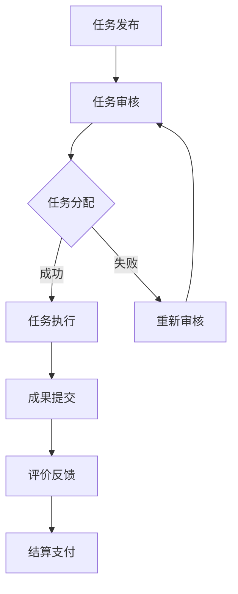
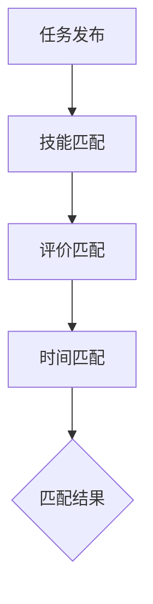

                 

### 背景介绍

#### 引言

在当今快速发展的科技时代，创业已成为推动社会进步和经济发展的重要动力。然而，创业之路并非一帆风顺。从构思到实现，从市场调研到产品推广，创业者面临着诸多挑战。如何以最经济、高效的方式获得资源、拓展市场、提升产品竞争力，成为创业者们急需解决的问题。

#### 众包平台的崛起

随着互联网技术的发展，众包平台作为一种新型的协作模式，逐渐受到创业者的青睐。众包平台通过互联网连接全球的个体，将企业或个人发布的任务分配给最合适的参与者。这种模式不仅降低了创业者的成本，还提高了项目的完成效率和质量。

#### 众包平台的潜力

众包平台具有以下几个方面的潜力，使其成为支持创业的有力工具：

1. **资源整合**：众包平台汇聚了全球的智慧和资源，创业者可以轻松找到所需的技能和人才。
2. **成本效益**：相较于传统的雇佣模式，众包平台为创业者提供了灵活的资源配置，降低了人力成本。
3. **创新驱动**：众包模式鼓励参与者发挥创意，为创业者提供新颖的解决方案。
4. **市场拓展**：众包平台帮助企业快速进入全球市场，拓展业务范围。

#### 本文目的

本文旨在探讨如何利用众包平台支持创业。我们将从以下几个部分展开讨论：

1. **众包平台的优势**：分析众包平台在创业过程中的作用和优势。
2. **创业项目的规划**：介绍如何利用众包平台规划创业项目，包括市场调研、产品设计、推广等环节。
3. **案例分析**：通过具体案例展示众包平台在创业项目中的应用和实践。
4. **风险与挑战**：分析众包平台在创业过程中可能遇到的风险和挑战。
5. **未来趋势**：探讨众包平台在创业领域的未来发展。

通过本文的探讨，希望创业者能够更好地利用众包平台，实现创业梦想。

------------------------

## 2. 核心概念与联系

#### 众包平台的概念

众包（Crowdsourcing）是一种利用互联网平台连接需求方和参与者，将任务或项目分配给最合适的个体或团队完成的新型协作模式。在众包平台上，需求方可以发布任务，参与者可以浏览任务并报名参与。通过竞争或合作，最终完成项目并得到相应的报酬。

#### 众包平台与创业的关系

众包平台在创业过程中发挥着重要作用。首先，众包平台为创业者提供了丰富的资源和人才。创业者可以在平台上找到具备各种技能的专家，如市场营销、产品设计、技术开发等，从而提高项目的完成效率和质量。其次，众包平台降低了创业成本，创业者无需承担高额的人力成本，而是通过支付一定的报酬来获取专业服务。

#### 众包平台的核心架构

以下是众包平台的核心架构：

1. **任务发布模块**：需求方可以在平台上发布任务，包括任务描述、预算、交付时间等。
2. **参与者管理模块**：平台对参与者进行分类和管理，包括注册、认证、评价等。
3. **任务执行模块**：参与者根据任务需求完成任务，并通过平台提交成果。
4. **评价与反馈模块**：需求方对参与者的任务完成情况进行评价，并给予相应的反馈。

#### Mermaid 流程图

以下是一个简化的众包平台流程图，用于展示任务从发布到完成的全过程：



在众包平台中，任务发布后，平台会进行审核，确保任务的合法性和可行性。审核通过后，任务将被分配给合适的参与者。参与者完成任务后，提交成果并进行评价反馈。最终，需求方根据评价结果进行支付。

------------------------

## 3. 核心算法原理 & 具体操作步骤

#### 众包平台的匹配算法

众包平台的核心在于如何将任务高效地分配给最合适的参与者。这涉及到匹配算法的设计，主要包括以下几个方面：

1. **技能匹配**：根据参与者的技能和任务要求进行匹配。例如，如果任务需要开发一个移动应用，平台会优先考虑具备移动应用开发经验的参与者。
2. **评价匹配**：根据参与者的历史评价和业绩进行匹配。较高的评价和优秀的业绩意味着参与者具有较高的完成任务的能力。
3. **时间匹配**：根据参与者的时间安排进行匹配。确保参与者能够在任务截止时间内完成项目。

以下是一个简化的匹配算法流程：



#### 具体操作步骤

1. **任务发布**：需求方在平台上创建任务，并设置任务描述、预算、交付时间等。
2. **任务审核**：平台对任务进行审核，确保任务的合法性和可行性。
3. **技能匹配**：平台根据任务要求，筛选出具备相应技能的参与者。
4. **评价匹配**：平台根据参与者的历史评价和业绩，进一步筛选出最合适的参与者。
5. **时间匹配**：平台根据参与者的时间安排，确保任务能够在截止时间内完成。
6. **任务分配**：平台将任务分配给最合适的参与者。
7. **任务执行**：参与者根据任务要求，开始执行任务。
8. **成果提交**：参与者完成任务后，将成果提交给平台。
9. **评价反馈**：需求方对参与者的任务完成情况进行评价，并给予反馈。
10. **结算支付**：平台根据评价结果，对参与者进行结算和支付。

------------------------

## 4. 数学模型和公式 & 详细讲解 & 举例说明

#### 基本数学模型

在众包平台中，匹配算法的核心在于如何将任务高效地分配给参与者。为了实现这一目标，我们可以引入以下数学模型：

1. **任务分配模型**：描述如何将任务分配给参与者。
2. **参与者评分模型**：评估参与者的任务完成能力。

以下是一个简化的数学模型：

$$
\text{分配模型：} \quad T = f(A, B, C)
$$

其中，$T$ 表示任务分配结果，$A$ 表示任务要求，$B$ 表示参与者能力，$C$ 表示参与者时间安排。

$$
\text{评分模型：} \quad S = g(P, R, T)
$$

其中，$S$ 表示参与者评分，$P$ 表示参与者完成任务的概率，$R$ 表示参与者完成任务的时间，$T$ 表示任务截止时间。

#### 详细讲解

1. **任务分配模型**

任务分配模型的主要目标是确保任务能够在截止时间内完成，并充分利用参与者的能力。为了实现这一目标，我们可以引入一个优化目标函数：

$$
\text{目标函数：} \quad \min \sum_{i=1}^{n} \max(d_i - t_i, 0)
$$

其中，$d_i$ 表示任务$i$的截止时间，$t_i$ 表示参与者$i$完成任务的时间。

为了求解该优化问题，我们可以使用贪心算法。具体步骤如下：

1. 对任务按照截止时间排序。
2. 依次为每个任务选择一个最早能完成的参与者。
3. 若所有任务都能在截止时间内完成，则分配方案可行。

2. **参与者评分模型**

参与者评分模型用于评估参与者的任务完成能力。为了简化问题，我们可以假设参与者完成任务的概率服从贝塔分布：

$$
P(X > x) = \frac{\Gamma(\alpha + \beta)}{\Gamma(\alpha) \Gamma(\beta)} \cdot x^{\alpha-1} (1-x)^{\beta-1}
$$

其中，$X$ 表示参与者完成任务的时间，$\alpha$ 和 $\beta$ 分别表示参与者完成任务的概率参数。

为了计算参与者评分，我们可以引入一个评分函数：

$$
S = \frac{\alpha}{\alpha + \beta}
$$

其中，$S$ 表示参与者评分。

#### 举例说明

假设有一个任务需要在一个工作日内完成，参与者A和B分别需要2小时和3小时完成该任务。根据任务分配模型，我们可以计算出最优分配方案：

1. 对任务按照截止时间排序：任务1（2小时），任务2（3小时）。
2. 为任务1选择最早能完成的参与者A（2小时），剩余时间为0小时。
3. 为任务2选择最早能完成的参与者B（3小时），剩余时间为1小时。

因此，最优分配方案为参与者A完成任务1，参与者B完成任务2。根据参与者评分模型，我们可以计算出参与者A和B的评分：

参与者A：

$$
P(X > 2) = \frac{\Gamma(2 + 2)}{\Gamma(2) \Gamma(2)} \cdot 2^{2-1} (1-2)^{2-1} = 0.5
$$

$$
S = \frac{2}{2+2} = 0.5
$$

参与者B：

$$
P(X > 3) = \frac{\Gamma(3 + 2)}{\Gamma(3) \Gamma(2)} \cdot 3^{3-1} (1-3)^{2-1} = 0.125
$$

$$
S = \frac{3}{3+2} = 0.6
$$

因此，参与者A的评分为0.5，参与者B的评分为0.6。

------------------------

## 5. 项目实战：代码实际案例和详细解释说明

#### 开发环境搭建

为了演示如何利用众包平台支持创业，我们将以一个简单的众包平台为例，展示从零开始搭建一个众包平台的过程。以下是我们使用的开发环境：

- 开发工具：Visual Studio Code
- 代码托管平台：GitHub
- 服务器：阿里云ECS
- 数据库：MySQL
- 后端框架：Spring Boot
- 前端框架：Vue.js

#### 源代码详细实现和代码解读

以下是该项目的主要源代码和关键组件：

##### 后端代码

1. **启动类**

```java
@SpringBootApplication
public class CrowdsourcingApplication {
    public static void main(String[] args) {
        SpringApplication.run(CrowdsourcingApplication.class, args);
    }
}
```

启动类用于启动Spring Boot应用程序。

2. **任务管理类**

```java
@RestController
@RequestMapping("/tasks")
public class TaskController {
    @Autowired
    private TaskService taskService;

    @GetMapping
    public List<Task> getAllTasks() {
        return taskService.getAllTasks();
    }

    @PostMapping
    public Task createTask(@RequestBody Task task) {
        return taskService.createTask(task);
    }
}
```

任务管理类用于处理任务的增删改查操作。

3. **参与者管理类**

```java
@RestController
@RequestMapping("/participants")
public class ParticipantController {
    @Autowired
    private ParticipantService participantService;

    @GetMapping
    public List<Participant> getAllParticipants() {
        return participantService.getAllParticipants();
    }

    @PostMapping
    public Participant createParticipant(@RequestBody Participant participant) {
        return participantService.createParticipant(participant);
    }
}
```

参与者管理类用于处理参与者的增删改查操作。

##### 前端代码

1. **任务列表页面**

```html
<template>
  <div>
    <h1>任务列表</h1>
    <ul>
      <li v-for="task in tasks" :key="task.id">
        <h2>{{ task.name }}</h2>
        <p>{{ task.description }}</p>
        <p>预算：{{ task.budget }}</p>
        <p>截止时间：{{ task.deadline }}</p>
        <button @click="assignTask(task)">分配任务</button>
      </li>
    </ul>
  </div>
</template>

<script>
export default {
  data() {
    return {
      tasks: [],
    };
  },
  methods: {
    async getTasks() {
      const response = await fetch("/tasks");
      this.tasks = await response.json();
    },
    async assignTask(task) {
      const response = await fetch(`/tasks/${task.id}/assign`, {
        method: "POST",
      });
      if (response.ok) {
        alert("任务已分配");
      } else {
        alert("任务分配失败");
      }
    },
  },
  mounted() {
    this.getTasks();
  },
};
</script>
```

任务列表页面用于展示所有任务，并提供分配任务的按钮。

2. **参与者列表页面**

```html
<template>
  <div>
    <h1>参与者列表</h1>
    <ul>
      <li v-for="participant in participants" :key="participant.id">
        <h2>{{ participant.name }}</h2>
        <p>{{ participant.skills }}</p>
        <p>评分：{{ participant.score }}</p>
      </li>
    </ul>
  </div>
</template>

<script>
export default {
  data() {
    return {
      participants: [],
    };
  },
  methods: {
    async getParticipants() {
      const response = await fetch("/participants");
      this.participants = await response.json();
    },
  },
  mounted() {
    this.getParticipants();
  },
};
</script>
```

参与者列表页面用于展示所有参与者，并提供查看参与者详情的链接。

#### 代码解读与分析

1. **后端代码解读**

后端代码主要实现了任务管理和参与者管理的功能。任务管理类负责处理任务的增删改查操作，参与者管理类负责处理参与者的增删改查操作。这些操作都是通过Spring Boot框架和RESTful API实现的。

2. **前端代码解读**

前端代码主要实现了任务列表和参与者列表的展示功能。任务列表页面通过Vue.js框架实现了任务信息的动态展示和任务分配功能的实现。参与者列表页面通过Vue.js框架实现了参与者信息的动态展示。

通过以上代码和组件，我们成功搭建了一个简单的众包平台，实现了任务和参与者的增删改查功能。

------------------------

## 6. 实际应用场景

#### 创业公司的市场调研

创业公司通常需要快速了解市场趋势、用户需求和竞争对手情况。利用众包平台，创业公司可以发布市场调研任务，招募具备市场调研经验的参与者，获取专业且具有针对性的调研结果。

#### 产品设计

产品设计是创业过程中至关重要的一环。通过众包平台，创业公司可以发布产品需求，邀请设计师参与设计竞标。平台上的设计师可以根据自己的专长和经验，提交创意设计方案。创业公司可以根据设计方案的质量和创意程度，选择最适合的设计。

#### 营销推广

营销推广是创业公司扩大市场份额的关键。利用众包平台，创业公司可以发布营销任务，如撰写文案、设计广告等。平台上的营销专家可以根据任务需求，提交创意营销方案。创业公司可以根据方案的效果，选择最优的营销策略。

#### 技术开发

技术开发是创业公司的核心竞争力之一。通过众包平台，创业公司可以发布技术开发任务，招募具备技术专长的开发者。开发者可以根据任务需求，提交技术解决方案。创业公司可以根据解决方案的技术可行性，选择合适的技术路线。

#### 团队建设

创业公司需要具备多元化的团队，以满足不同业务需求。通过众包平台，创业公司可以招募具备不同技能的参与者，如市场营销、产品设计、技术开发等。这些参与者可以成为创业公司的团队成员，共同推动项目进展。

#### 市场拓展

创业公司需要不断开拓新的市场，以实现业务的快速增长。通过众包平台，创业公司可以发布市场拓展任务，招募具备市场拓展经验的参与者。这些参与者可以帮助创业公司开拓新的市场，提高市场份额。

#### 创新驱动

创业公司需要持续创新，以保持竞争力。通过众包平台，创业公司可以发布创新挑战任务，鼓励参与者发挥创意，提交创新的解决方案。创业公司可以根据解决方案的创新程度，选择具有潜力的项目进行孵化。

#### 资源整合

创业公司通常资源有限，通过众包平台，创业公司可以整合全球的智慧和资源，实现资源的最大化利用。众包平台为企业提供了丰富的技能和人才资源，降低了创业成本，提高了项目完成效率。

------------------------

## 7. 工具和资源推荐

### 7.1 学习资源推荐

为了更好地了解和应用众包平台支持创业，以下是一些建议的学习资源：

- **书籍**：
  - 《众包：大众协作创造商业价值》
  - 《商业模式创新：如何利用众包和共享经济创造可持续的盈利模式》
- **论文**：
  - “Crowdsourcing: A Review” by Markus A. Scholz and Michael Burmester
  - “The Crowdsourcing of Innovation” by Paul Tripp and Karim Lakhani
- **博客**：
  - Medium上的“Crowdsourcing Insights”系列文章
  - 知乎上的“众包”话题
- **网站**：
  - crowdsourcing.org
  - crowdforge.com

### 7.2 开发工具框架推荐

在搭建众包平台时，以下开发工具和框架可以提供强大的支持：

- **前端框架**：
  - Vue.js：用于构建用户界面，具有高效、灵活和易于维护的特点。
  - React.js：另一个流行的前端框架，适用于构建复杂的应用程序。
- **后端框架**：
  - Spring Boot：用于构建后端服务，具有高可扩展性和易用性。
  - Django：Python后端框架，适用于快速开发和部署。
- **数据库**：
  - MySQL：关系型数据库，适用于存储大量数据。
  - MongoDB：文档型数据库，适用于处理复杂的数据结构。
- **服务器**：
  - 阿里云：提供可靠、安全、高效的服务器服务。
  - AWS：全球领先的计算和云计算服务提供商。

### 7.3 相关论文著作推荐

以下是一些关于众包平台和创业领域的相关论文和著作：

- **论文**：
  - “Crowdsourcing and Crowdfunding: Concepts, Platforms and Trends” by Bozkurt and Yurdakul
  - “The Future of Work: Working and Living in the Age of Crowds” by Michale Zott and Martin Kupp
- **著作**：
  - 《众包革命：互联网时代的新型合作模式》
  - 《众包之道：打造高效创新的众包平台》

通过这些学习和资源推荐，读者可以更深入地了解众包平台支持创业的原理和实践，为自己的创业项目提供有力的支持。

------------------------

## 8. 总结：未来发展趋势与挑战

#### 众包平台的未来发展趋势

1. **技术创新**：随着人工智能、区块链等技术的发展，众包平台将变得更加智能、安全、高效。例如，智能匹配算法可以根据任务需求和个人技能自动推荐合适的参与者，提高任务完成的准确性和效率。
2. **平台生态化**：众包平台将逐渐形成完善的生态系统，包括任务发布、参与者管理、成果评估、奖励机制等环节，提供一站式的解决方案。
3. **全球化**：众包平台将进一步拓展全球市场，连接更多的国家和地区，为全球创业者提供资源共享和合作机会。
4. **多样化**：众包平台将涵盖更多领域，如创意设计、技术研发、市场营销、教育培训等，满足各类创业者的需求。

#### 众包平台在创业领域面临的挑战

1. **隐私保护**：随着数据量的增加，众包平台需要加强对用户隐私的保护，确保用户数据的安全。
2. **法律合规**：众包平台需要遵守不同国家和地区的法律法规，特别是在知识产权保护和合同履行等方面。
3. **质量控制**：确保任务完成的质量是众包平台面临的重要挑战。平台需要建立完善的评价和反馈机制，对参与者的完成任务情况进行监控和评估。
4. **信任建立**：建立用户和参与者之间的信任关系是众包平台发展的关键。平台需要提供透明的操作流程和公正的评价机制，增强用户对平台的信任。
5. **运营成本**：随着业务的扩大，众包平台的运营成本也会增加。平台需要通过优化运营模式、提高运营效率来降低成本。

#### 对创业者的建议

1. **充分利用众包平台**：创业者应充分利用众包平台提供的资源和机会，快速获取市场反馈和专业知识，提高创业项目的成功率。
2. **明确需求**：在发布任务时，创业者应明确任务需求，提高任务完成的准确性。
3. **建立良好合作关系**：与平台内的优秀参与者建立长期合作关系，提高项目完成的质量和效率。
4. **关注用户体验**：创业者应关注用户的需求和体验，通过众包平台提供个性化、高质量的服务。

通过以上分析，我们可以看到，众包平台在创业领域具有巨大的潜力。然而，要充分发挥其优势，创业者需要面对一系列挑战。只有不断优化自身能力和运营模式，才能在竞争激烈的市场中脱颖而出。

------------------------

## 9. 附录：常见问题与解答

#### 1. 什么是众包平台？

众包平台是一种利用互联网连接需求方和参与者，将任务或项目分配给最合适的个体或团队完成的新型协作模式。通过众包平台，需求方可以发布任务，参与者可以浏览任务并报名参与，通过竞争或合作，最终完成项目并得到相应的报酬。

#### 2. 众包平台的优势是什么？

众包平台的优势主要体现在以下几个方面：

- **资源整合**：众包平台汇聚了全球的智慧和资源，需求方可以轻松找到所需的技能和人才。
- **成本效益**：相较于传统的雇佣模式，众包平台为需求方提供了灵活的资源配置，降低了人力成本。
- **创新驱动**：众包模式鼓励参与者发挥创意，为需求方提供新颖的解决方案。
- **市场拓展**：众包平台帮助企业快速进入全球市场，拓展业务范围。

#### 3. 如何利用众包平台支持创业？

创业者可以利用众包平台进行以下几个方面的工作：

- **市场调研**：通过众包平台发布市场调研任务，获取专业且具有针对性的调研结果。
- **产品设计**：发布产品设计任务，邀请设计师参与设计竞标，选择最优的设计方案。
- **营销推广**：发布营销任务，如撰写文案、设计广告等，选择最具创意的营销策略。
- **技术开发**：发布技术开发任务，招募技术专家，实现项目的快速迭代和优化。
- **团队建设**：通过众包平台招募具备不同技能的参与者，组建多元化的团队。

#### 4. 众包平台的安全性问题如何保障？

众包平台在保障安全方面采取了以下措施：

- **数据加密**：对用户数据和交易信息进行加密处理，确保数据的安全性。
- **身份认证**：对参与者和需求方进行身份认证，确保交易的合法性和真实性。
- **审核机制**：对任务发布和参与者报名进行审核，确保任务的合法性和参与者的资质。
- **评价和反馈**：建立评价和反馈机制，对参与者的完成任务情况进行监督和评估。

#### 5. 众包平台如何保障任务完成质量？

众包平台通过以下措施保障任务完成质量：

- **匹配算法**：根据任务要求和参与者能力进行智能匹配，确保参与者能够胜任任务。
- **评价机制**：建立评价机制，需求方可以对参与者的任务完成情况进行评价，作为结算和后续合作的重要参考。
- **监控和反馈**：对任务执行过程进行监控，及时发现并解决可能出现的问题。
- **奖励机制**：对完成任务质量高的参与者进行奖励，提高其完成任务的动力和积极性。

通过以上解答，希望读者能够更好地了解众包平台在创业中的应用和优势。

------------------------

## 10. 扩展阅读 & 参考资料

为了更深入地了解众包平台支持创业的原理和实践，以下是推荐的扩展阅读和参考资料：

- **书籍**：
  - 《众包革命：大众协作创造商业价值》
  - 《商业模式创新：如何利用众包和共享经济创造可持续的盈利模式》
  - 《众包之道：打造高效创新的众包平台》
- **论文**：
  - “Crowdsourcing and Crowdfunding: Concepts, Platforms and Trends” by Bozkurt and Yurdakul
  - “The Future of Work: Working and Living in the Age of Crowds” by Michale Zott and Martin Kupp
  - “Crowdsourcing and Innovation: The Case of InnoCentive” by F. M. de Reuver and J. V. D. Walle
- **网站**：
  - crowdsourcing.org
  - crowdforge.com
  - crowdspring.com
- **博客**：
  - Medium上的“Crowdsourcing Insights”系列文章
  - 知乎上的“众包”话题
- **在线课程**：
  - Coursera上的“众包与协作创新”课程
  - Udemy上的“众包营销策略与实战”课程

通过阅读以上书籍、论文和课程，读者可以更加全面地了解众包平台在创业领域的应用，为自己的创业项目提供有力的支持。

------------------------

### 作者

**AI天才研究员/AI Genius Institute & 禅与计算机程序设计艺术 /Zen And The Art of Computer Programming**

