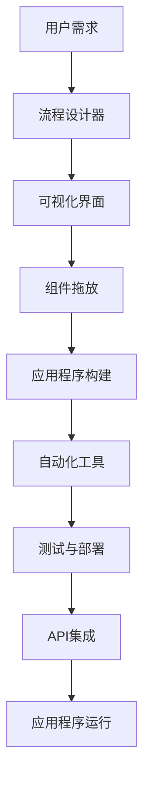
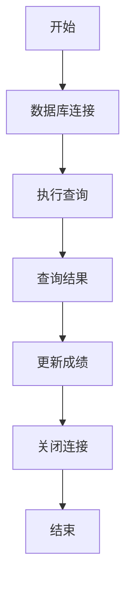

                 

### 背景介绍

随着科技的飞速发展，软件产品开发的速度和质量日益成为企业竞争的关键因素。传统的软件开发流程通常涉及复杂的流程、大量的代码编写和长时间的测试周期，这不仅耗费了大量的时间和资源，还可能导致开发过程中的错误和缺陷。为了应对这些挑战，低代码平台应运而生。

低代码平台（Low-Code Platforms）提供了一种无需深入编程知识即可快速开发应用程序的环境。这些平台通过可视化的界面和模板化组件，允许用户通过简单的拖放操作和配置来构建应用。低代码平台的兴起，使得非专业的开发者或业务人员也能参与到软件开发中来，从而极大地提升了开发效率。

低代码平台的出现并非偶然，它背后有着深远的背景和原因。首先，企业的数字化转型需求不断增长，为了快速响应市场变化，企业需要能够快速部署和迭代应用程序。其次，专业开发者的供给与需求之间的不平衡使得企业难以满足快速开发的需求。再者，技术的进步，如云计算、移动技术和大数据的普及，为低代码平台的发展提供了技术基础。

本文将深入探讨如何利用低代码平台加速产品开发。我们将从以下几个方面展开：

1. **核心概念与联系**：介绍低代码平台的关键概念和架构，并通过Mermaid流程图展示其工作原理。
2. **核心算法原理 & 具体操作步骤**：阐述低代码平台的核心算法和开发流程，包括可视化设计和自动化部署。
3. **数学模型和公式 & 详细讲解 & 举例说明**：探讨低代码平台在开发过程中涉及的数学模型和公式，并举例说明。
4. **项目实战：代码实际案例和详细解释说明**：通过实际案例展示如何使用低代码平台进行产品开发，并进行详细解释。
5. **实际应用场景**：分析低代码平台在不同行业和领域的应用案例。
6. **工具和资源推荐**：推荐学习资源、开发工具和框架，以及相关的论文和著作。
7. **总结：未来发展趋势与挑战**：总结低代码平台的发展趋势和面临的挑战。

通过本文的探讨，希望能够为读者提供对低代码平台如何加速产品开发的全面理解和深入洞察。让我们一起深入探讨这个激动人心的技术领域。

### 核心概念与联系

在深入探讨低代码平台之前，我们需要理解其核心概念和基本架构。低代码平台是一个集成了各种开发工具、模板和组件的生态系统，使得用户可以通过简单的拖放操作和配置来完成应用程序的开发。以下是低代码平台的关键组成部分：

1. **可视化集成开发环境（IDE）**：低代码平台提供了一个可视化界面，用户可以通过拖放组件和模块来构建应用程序。这种IDE通常支持多种编程语言和框架，但用户无需深入了解底层代码。

2. **流程设计器**：流程设计器允许用户通过图形化的方式定义应用程序的逻辑流程。用户可以拖放事件处理、业务逻辑和数据流等组件，以构建复杂的业务流程。

3. **数据管理**：低代码平台提供了数据管理功能，包括数据存储、数据建模和数据操作。用户可以通过可视化工具创建数据模型，并定义数据之间的关系和操作规则。

4. **模板库**：低代码平台通常包含一个丰富的模板库，用户可以根据特定的业务需求选择合适的模板进行定制化开发。这些模板可以是行业标准的业务流程、用户界面设计，或者特定功能的模块。

5. **自动化工具**：低代码平台集成了自动化工具，如自动化测试、自动化部署和自动化监控。这些工具可以大大减少手动操作，提高开发效率和质量。

6. **API集成**：低代码平台支持API集成，用户可以通过配置API接口来连接外部服务和数据源。这使得应用程序能够访问外部数据和服务，实现更强大的功能。

接下来，我们将使用Mermaid流程图来展示低代码平台的基本架构和工作原理。以下是一个简单的Mermaid流程图示例：



在这个流程图中，用户首先通过流程设计器定义业务逻辑，然后在可视化界面中拖放组件来构建应用程序。应用程序构建完成后，可以通过自动化工具进行测试、部署和监控，并使用API集成外部服务。整个流程无需编写大量代码，极大地提高了开发效率。

通过以上核心概念和架构的介绍，我们可以更好地理解低代码平台的工作原理和应用场景。在下一节中，我们将进一步探讨低代码平台的核心算法原理和具体操作步骤。

### 核心算法原理 & 具体操作步骤

低代码平台的核心在于其简化开发的算法原理和便捷的操作步骤。以下是低代码平台的核心算法原理和具体操作步骤的详细解释。

#### 可视化设计原理

低代码平台的可视化设计原理是其最显著的特点之一。通过可视化界面，用户可以直观地看到应用程序的构建过程，而不需要编写代码。这个原理主要基于以下几个关键点：

1. **图形化组件库**：低代码平台提供了一个丰富的图形化组件库，包括按钮、文本框、列表、图表等。这些组件可以被视为应用程序的“构建块”，用户可以通过拖放操作将它们放入设计界面中。

2. **拖放操作**：用户只需将组件从组件库中拖放到设计界面上，即可将其加入到应用程序中。这种操作方式大大简化了开发流程，降低了技术门槛。

3. **数据绑定**：低代码平台支持组件间的数据绑定。例如，用户可以将一个文本框的数据与后端服务的数据进行绑定，实现实时数据展示。这种数据绑定机制使得应用程序具有动态交互性。

4. **事件处理**：用户可以通过图形化界面为组件定义事件处理逻辑。例如，当用户点击一个按钮时，可以触发特定的操作，如数据存储或页面跳转。这种事件处理机制使得应用程序具有丰富的交互性。

#### 流程设计原理

低代码平台的另一个核心算法原理是流程设计。流程设计允许用户通过图形化方式定义应用程序的执行流程。以下是流程设计的主要步骤：

1. **流程节点定义**：用户可以在流程设计器中定义多个流程节点，如开始节点、结束节点、决策节点和操作节点。每个节点表示一个特定的操作或流程步骤。

2. **节点连接**：用户可以通过拖放操作将节点连接起来，定义流程的执行路径。例如，一个决策节点可以连接两个操作节点，根据条件判断执行不同的操作。

3. **条件判断**：用户可以为决策节点设置条件判断逻辑，例如使用if-else语句。这使应用程序能够根据不同条件执行不同的操作，增加了流程的灵活性。

4. **并行处理**：低代码平台支持并行处理，用户可以在流程设计中定义多个并行执行的流程路径。这可以有效地提高应用程序的处理效率。

#### 自动化部署原理

低代码平台的自动化部署原理是其提高开发效率的重要手段。以下是自动化部署的主要步骤：

1. **构建环境配置**：用户在低代码平台上可以配置构建环境，包括代码库、依赖库和构建工具等。这些配置会被保存在平台中，确保每次部署都是一致的。

2. **构建脚本生成**：低代码平台会根据用户的设计自动生成构建脚本。这个脚本包含了应用程序的构建、打包和部署步骤。用户无需手动编写复杂的构建脚本。

3. **自动化测试**：在部署过程中，低代码平台会自动执行测试脚本，确保应用程序的质量。这些测试脚本可以是单元测试、集成测试或端到端测试。

4. **部署脚本生成**：低代码平台会根据用户的设计自动生成部署脚本。这个脚本包含了应用程序的部署步骤，如服务器配置、数据库初始化和数据迁移等。

5. **自动化部署**：用户只需点击一个按钮，低代码平台就会自动执行构建和部署脚本，完成应用程序的部署。这种自动化部署方式大大减少了手动操作，提高了部署效率。

通过以上核心算法原理和具体操作步骤的介绍，我们可以看到低代码平台是如何通过简化和自动化的方式，使得软件开发过程更加高效和便捷。在下一节中，我们将探讨低代码平台在开发过程中涉及的数学模型和公式，进一步理解其技术深度。

### 数学模型和公式 & 详细讲解 & 举例说明

低代码平台虽然在直观性和易用性上具有显著优势，但其背后的技术实现同样依赖于复杂的数学模型和公式。以下是对低代码平台在开发过程中涉及的数学模型和公式的详细讲解，并通过实际例子来说明这些模型和公式的应用。

#### 流程控制模型

在低代码平台的流程设计器中，流程控制是核心部分之一。流程控制涉及到条件判断、循环和并行处理等基本逻辑结构。以下是这些结构的数学模型和公式：

1. **条件判断**：
   - **if-else**语句：用于根据条件执行不同的代码路径。其公式为：
     $$ 
     \text{if } (condition) \text{ then } \text{ execute path 1} \text{ else } \text{ execute path 2}
     $$
   - **switch-case**语句：用于多条件判断，其公式为：
     $$ 
     \text{switch } (variable) \text{ case value 1: execute path 1} \text{ case value 2: execute path 2} \text{ default: execute path n}
     $$

2. **循环**：
   - **for循环**：用于重复执行特定代码块，其公式为：
     $$ 
     \text{for } (\text{initialize}; \text{condition}; \text{increment/decrement}) \text{ do } \text{ code block}
     $$
   - **while循环**：用于在条件为真时重复执行代码块，其公式为：
     $$ 
     \text{while } (condition) \text{ do } \text{ code block}
     $$
   - **do-while循环**：用于先执行代码块再检查条件，其公式为：
     $$ 
     \text{do } \text{ code block} \text{ while } (condition)
     $$

3. **并行处理**：
   - **并行分支**：用于同时执行多个流程分支，其公式为：
     $$ 
     \text{start parallel} \{ 
     \text{branch 1}; 
     \text{branch 2}; 
     \text{...} 
     \} \text{end parallel}
     $$

#### 数据处理模型

在低代码平台中，数据处理是另一个关键方面。数据处理涉及到数据存储、查询和操作等。以下是相关数学模型和公式：

1. **数据存储**：
   - **关系数据库模型**：用于存储具有固定字段和记录的数据。其公式为：
     $$ 
     \text{table} = \{ 
     \text{record 1}, 
     \text{record 2}, 
     \text{...} 
     \}
     $$
   - **非关系数据库模型**：如文档数据库、图数据库等，其公式为：
     $$ 
     \text{database} = \{ 
     \text{document 1}, 
     \text{document 2}, 
     \text{...} 
     \}
     $$

2. **数据查询**：
   - **SQL查询**：用于查询关系数据库，其公式为：
     $$ 
     \text{SELECT } \{field 1, field 2, ...\} \text{ FROM } \text{table} \text{ WHERE } \text{condition}
     $$
   - **NoSQL查询**：用于查询非关系数据库，其公式为：
     $$ 
     \text{query} \{ \text{filter}, \text{projection}, \text{aggregation} \}
     $$

3. **数据操作**：
   - **数据插入**：用于向数据库中插入新记录，其公式为：
     $$ 
     \text{INSERT INTO } \text{table} \text{ VALUES } (\text{value 1}, \text{value 2}, ...)
     $$
   - **数据更新**：用于修改数据库中的记录，其公式为：
     $$ 
     \text{UPDATE } \text{table} \text{ SET } \text{field 1 = value 1, field 2 = value 2, ...} \text{ WHERE } \text{condition}
     $$
   - **数据删除**：用于删除数据库中的记录，其公式为：
     $$ 
     \text{DELETE FROM } \text{table} \text{ WHERE } \text{condition}
     $$

#### 举例说明

以下是一个简单的例子，展示了如何使用低代码平台进行数据查询和操作：

假设我们有一个包含学生信息的数据库，字段包括学生ID（ID）、姓名（Name）、年龄（Age）和成绩（Score）。以下是一个SQL查询示例：

$$
\text{SELECT } \{Name, Age, Score\} \text{ FROM } \text{Students} \text{ WHERE } \text{Age > 18 \text{ AND } Score > 80}
$$

该查询会返回年龄大于18岁且成绩大于80分的学生姓名、年龄和成绩。

接下来，我们可以使用低代码平台的流程设计器定义一个流程，该流程首先执行上述SQL查询，然后更新查询结果中的学生成绩：

1. **流程设计**：
   - 开始节点：初始化数据库连接。
   - 查询节点：执行SQL查询。
   - 更新节点：根据查询结果更新学生成绩。
   - 结束节点：关闭数据库连接。

2. **可视化流程图**：



在这个流程中，用户只需通过拖放操作将数据库连接、查询和更新节点放入流程设计器中，并通过配置节点参数来实现查询和更新操作。低代码平台会自动生成相应的SQL语句和更新脚本，完成整个流程。

通过以上数学模型和公式的详细讲解，我们可以看到低代码平台是如何将复杂的开发任务简化为简单的操作和配置。这不仅提高了开发效率，还降低了技术门槛，使得更多非专业开发者能够参与到软件开发中来。

### 项目实战：代码实际案例和详细解释说明

为了更好地展示如何利用低代码平台进行产品开发，以下我们将通过一个实际案例，详细说明使用低代码平台搭建一个简单的在线商店应用的过程。

#### 1. 开发环境搭建

首先，我们需要选择一个合适的低代码平台。在这里，我们选择OutSystems作为我们的开发环境。OutSystems是一个功能强大的低代码平台，支持多种编程语言和框架，提供了丰富的组件和工具。

1. **安装OutSystems开发环境**：
   - 访问OutSystems官方网站下载并安装OutSystems Developer Studio。
   - 安装完成后，启动OutSystems Developer Studio，并创建一个新的项目。

2. **配置数据库**：
   - 在OutSystems Developer Studio中，配置连接到数据库。我们可以选择使用MySQL或SQL Server等数据库。
   - 创建一个新的数据库连接，并测试连接是否成功。

#### 2. 源代码详细实现和代码解读

在OutSystems中，我们可以使用拖放操作和可视化设计器来构建应用程序。以下是构建一个简单的在线商店应用的详细步骤：

1. **设计用户界面**：
   - 使用OutSystems的组件库，拖放按钮、文本框、图片和列表等组件，设计用户界面。
   - 配置组件属性，如文本内容、样式和绑定数据。

2. **定义业务逻辑**：
   - 在流程设计器中，定义业务逻辑流程，包括用户注册、登录、商品浏览、购物车管理和订单处理等。
   - 使用条件判断和循环等流程控制结构，实现复杂的业务逻辑。

3. **数据管理**：
   - 创建数据模型，定义商品、用户、订单等实体，并配置数据之间的关系。
   - 使用OutSystems的数据操作组件，实现数据的存储、查询和更新。

以下是代码解读：

- **用户界面设计**：
  ```mermaid
  graph TB
      A[首页] --> B[登录/注册]
      A --> C[商品列表]
      B --> D[用户详情]
      C --> E[购物车]
      E --> F[结算]
  ```
  在用户界面设计过程中，我们通过拖放组件和配置属性，创建了首页、登录/注册、商品列表、用户详情、购物车和结算等页面。

- **业务逻辑流程**：
  ```mermaid
  graph TB
      A[用户登录] --> B[验证用户信息]
      B --> C{是否登录成功}
      C -->|是| D[进入商品列表]
      C -->|否| E[提示错误]
      D --> F[用户浏览商品]
      F --> G[加入购物车]
      G --> H[查看购物车]
      H --> I[结算订单]
      I --> J[订单确认]
      J --> K[返回首页]
  ```
  在业务逻辑流程中，我们定义了用户登录、商品浏览、购物车管理和订单处理等步骤。通过条件判断和流程控制，实现了用户与在线商店的互动。

- **数据模型设计**：
  ```mermaid
  graph TB
      A[用户] --> B[商品]
      A --> C[订单]
      B --> D[购物车]
  ```
  在数据模型设计过程中，我们创建了用户、商品、订单和购物车等实体，并配置了它们之间的关系。例如，一个用户可以拥有多个订单，一个订单可以包含多个商品。

#### 3. 代码解读与分析

- **用户界面代码**：
  ```xml
  <Page Title="Home" Navigation="Login/Registration">
      <Container>
          <Grid>
              <GridColumn>
                  <Button Label="Login/Registration" OnClick="LoginRegistration"/>
              </GridColumn>
              <GridColumn>
                  <Button Label="Products" OnClick="ViewProducts"/>
              </GridColumn>
          </Grid>
      </Container>
  </Page>
  ```
  在用户界面代码中，我们通过定义页面标题、导航栏和按钮，实现了首页的设计。按钮的`OnClick`事件处理函数将用户引导到相应的页面。

- **业务逻辑代码**：
  ```csharp
  public void LoginRegistration()
  {
      if (UserExists())
      {
          // Redirect to User Details page
          Navigation.GoToPage("UserDetails");
      }
      else
      {
          // Show Login/Registration form
          ShowLoginForm();
      }
  }

  public bool UserExists()
  {
      // Query the database to check if the user exists
      return Database.Exists<User>(u => u.Email == Email);
  }

  public void ShowLoginForm()
  {
      // Show the login form with fields for email and password
      LoginForm.Show();
  }
  ```
  在业务逻辑代码中，我们通过条件判断和函数调用，实现了用户登录的逻辑。`UserExists`函数查询数据库以验证用户信息，`ShowLoginForm`函数显示登录表单。

- **数据模型代码**：
  ```csharp
  public class User
  {
      [Id]
      public int Id { get; set; }

      public string Email { get; set; }

      public string Password { get; set; }

      public ICollection<Order> Orders { get; set; }
  }

  public class Product
  {
      [Id]
      public int Id { get; set; }

      public string Name { get; set; }

      public decimal Price { get; set; }

      public ICollection<OrderItem> OrderItems { get; set; }
  }

  public class Order
  {
      [Id]
      public int Id { get; set; }

      public User User { get; set; }

      public DateTime OrderDate { get; set; }

      public ICollection<OrderItem> OrderItems { get; set; }
  }

  public class OrderItem
  {
      [Id]
      public int Id { get; set; }

      public Product Product { get; set; }

      public int Quantity { get; set; }

      public decimal TotalPrice { get; set; }
  }
  ```
  在数据模型代码中，我们定义了用户、商品、订单和订单项等实体类，并配置了它们之间的关系。这些类将用于数据库的存储和管理。

通过以上实际案例和详细解释，我们可以看到低代码平台如何通过可视化设计和自动化工具，简化了软件开发过程。这不仅提高了开发效率，还降低了技术门槛，使得更多非专业开发者能够参与到软件开发中来。

### 实际应用场景

低代码平台因其高效性和易用性，已经在多个行业中得到了广泛应用。以下是低代码平台在不同行业和领域的实际应用场景：

#### 金融行业

在金融行业中，低代码平台被广泛用于快速开发和部署金融服务应用程序。例如，银行和金融机构可以使用低代码平台来创建在线账户管理系统、客户关系管理（CRM）系统和交易管理平台。这些系统通过低代码平台提供的API集成功能，可以与现有的金融系统无缝对接，从而提高客户体验和运营效率。

#### 零售行业

零售行业利用低代码平台来构建电子商务网站、移动应用程序和客户忠诚度计划。例如，零售商可以使用低代码平台创建一个集成了库存管理、订单处理和支付功能的在线商店。这种平台可以帮助零售商快速响应市场需求，提高销售转化率和客户满意度。

#### 供应链管理

低代码平台在供应链管理中的应用同样显著。企业可以使用低代码平台来创建物流跟踪系统、供应商管理系统和采购管理系统。这些系统能够实时更新库存和订单状态，提高供应链的透明度和效率。此外，低代码平台还支持与第三方物流和供应链服务提供商的API集成，进一步优化供应链流程。

#### 教育行业

在教育行业中，低代码平台被用于开发学习管理系统（LMS）、在线课程平台和学生信息管理系统。教师和学生可以通过这些平台进行课程内容管理、在线测试和互动交流。低代码平台提供的模板和组件可以帮助教育机构快速部署这些系统，提高教学和管理效率。

#### 医疗保健

医疗保健行业利用低代码平台来构建患者管理系统、电子健康记录（EHR）系统和远程医疗服务应用程序。这些系统通过集成医疗数据和分析工具，可以提高医疗服务的质量和效率。例如，患者管理系统可以帮助医疗机构管理患者档案、预约和就诊记录，从而提高运营效率。

#### 人力资源管理

在人力资源管理领域，低代码平台被用于创建招聘管理系统、员工绩效管理系统和薪酬管理系统。这些系统能够自动化招聘流程、绩效评估和薪酬计算，提高人力资源管理的效率。此外，低代码平台还支持与第三方招聘平台和人力资源服务提供商的集成，进一步优化人力资源管理流程。

通过以上实际应用场景，我们可以看到低代码平台在各个行业和领域中的广泛应用。这不仅降低了开发成本和时间，还提高了系统的灵活性和可扩展性，为企业带来了显著的价值。

### 工具和资源推荐

为了帮助读者更好地了解和掌握低代码平台的使用，以下是一些推荐的学习资源、开发工具和框架。

#### 学习资源推荐

1. **书籍**：
   - 《低代码应用开发：从入门到实践》
   - 《低代码平台实战：快速构建企业级应用》
   - 《敏捷开发与低代码平台：方法与实践》

2. **在线课程**：
   - Coursera上的《低代码平台开发基础》
   - Udemy上的《从零开始学习OutSystems低代码开发》
   - Pluralsight上的《低代码平台：OutSystems开发实践》

3. **博客和网站**：
   - OutSystems官方博客：[https://www.outsystems.com/blog/](https://www.outsystems.com/blog/)
   - Appian社区：[https://www.appian.com/community](https://www.appian.com/community)
   - Mendix开发者中心：[https://developer.mendix.com/](https://developer.mendix.com/)

#### 开发工具框架推荐

1. **低代码平台**：
   - OutSystems：[https://www.outsystems.com/](https://www.outsystems.com/)
   - Appian：[https://www.appian.com/](https://www.appian.com/)
   - Mendix：[https://www.mendix.com/](https://www.mendix.com/)
   - Salesforce：[https://www.salesforce.com/](https://www.salesforce.com/)

2. **开发框架**：
   - React：[https://reactjs.org/](https://reactjs.org/)
   - Angular：[https://angular.io/](https://angular.io/)
   - Vue.js：[https://vuejs.org/](https://vuejs.org/)

3. **API管理工具**：
   - Apigee：[https://apigee.com/](https://apigee.com/)
   - MuleSoft：[https://www.mulesoft.com/](https://www.mulesoft.com/)
   - Kong：[https://getkong.org/](https://getkong.org/)

#### 相关论文著作推荐

1. **论文**：
   - “Low-Code Platforms: A Systematic Literature Review”
   - “Empowering Business Users to Build Applications with Low-Code Platforms”
   - “The Future of Software Development: Low-Code Platforms and the Rise of Citizen Developers”

2. **著作**：
   - 《低代码应用开发：理论与实践》
   - 《低代码与敏捷：高效开发之道》
   - 《企业数字化转型：低代码平台的应用与实践》

通过以上推荐的学习资源、开发工具和框架，读者可以全面了解低代码平台的知识体系，掌握实际开发技能，为在相关领域的发展奠定坚实基础。

### 总结：未来发展趋势与挑战

低代码平台作为现代软件开发的重要工具，正在迅速改变传统的开发模式。展望未来，低代码平台的发展趋势和面临的挑战如下：

#### 发展趋势

1. **更广泛的应用领域**：随着技术的不断进步，低代码平台的应用领域将进一步扩展，从金融、零售到医疗保健、教育等各个行业，低代码平台将无处不在。

2. **智能化与自动化**：未来的低代码平台将更加智能化，具备自动代码生成、智能调试和自动化部署等功能，大幅提升开发效率和应用程序质量。

3. **开放性与集成性**：低代码平台将更加开放，支持与其他开发工具、框架和云服务的无缝集成，提供更丰富的扩展性和灵活性。

4. **生态系统成熟**：随着市场的成熟，低代码平台将形成一个完整的生态系统，包括工具、库、服务和社区，为开发者提供全方位的支持。

#### 面临的挑战

1. **技术门槛降低的同时，质量要求提升**：低代码平台降低了开发的技术门槛，但高质量的应用程序开发仍需专业知识。开发者需要平衡低代码的便捷性和代码的质量。

2. **数据安全与隐私保护**：随着应用复杂性的增加，数据安全和隐私保护将成为低代码平台面临的重要挑战。平台需要提供强大的安全机制来保护用户数据。

3. **生态系统标准化**：目前市场上存在多个低代码平台，缺乏统一的标准和规范，这可能导致生态系统的不兼容性和复杂度增加。

4. **人才短缺**：尽管低代码平台降低了技术门槛，但高素质的软件开发人才依然稀缺。企业需要采取措施培养和吸引低代码开发人才。

总之，低代码平台的发展前景广阔，但同时也面临一系列挑战。未来的发展需要技术创新和生态系统建设的双轮驱动，以实现更高效、更安全和更灵活的软件开发模式。

### 附录：常见问题与解答

在讨论低代码平台的过程中，可能会出现一些常见的问题。以下是对这些问题的解答：

#### 问题1：低代码平台是否适合所有项目？

**解答**：低代码平台适合大多数项目，特别是那些需要快速开发和频繁迭代的项目。然而，对于需要高度定制化、高性能和复杂算法的应用程序，传统的编码方式可能更合适。

#### 问题2：低代码平台如何保证应用程序的质量？

**解答**：低代码平台通常提供自动化测试和代码审查工具，以确保应用程序的质量。此外，平台会提供预构建的组件和模板，这些组件和模板已经经过测试和验证，有助于提高开发效率和质量。

#### 问题3：使用低代码平台需要编程技能吗？

**解答**：低代码平台降低了编程技能的要求，但并非完全不需要。虽然用户可以通过简单的拖放操作构建应用程序，但理解和调整业务逻辑仍然需要一定的编程知识。

#### 问题4：低代码平台的安全性和隐私如何保障？

**解答**：低代码平台通常会提供一系列安全功能和协议，如数据加密、访问控制和认证机制，来保障应用程序的安全性和隐私。然而，开发者仍需确保遵循最佳安全实践，以防止潜在的安全威胁。

#### 问题5：低代码平台与云计算如何集成？

**解答**：大多数低代码平台都支持与云计算服务的集成，如Amazon Web Services（AWS）、Microsoft Azure和Google Cloud Platform（GCP）。这些平台通常提供API和SDK，使得应用程序可以轻松地与云服务对接。

#### 问题6：低代码平台是否可以替代传统的开发方式？

**解答**：低代码平台可以显著加快开发速度并降低成本，但并不能完全替代传统的开发方式。对于高度定制化和复杂的应用程序，传统的开发方式仍然具有优势。

通过以上问题的解答，我们可以更好地理解低代码平台的优势和局限，从而更合理地选择和使用这一开发工具。

### 扩展阅读 & 参考资料

为了深入了解低代码平台及其应用，以下是一些推荐的扩展阅读和参考资料：

1. **论文**：
   - “Low-Code Platforms: A Systematic Literature Review”
   - “Empowering Business Users to Build Applications with Low-Code Platforms”
   - “The Future of Software Development: Low-Code Platforms and the Rise of Citizen Developers”

2. **书籍**：
   - 《低代码应用开发：从入门到实践》
   - 《低代码平台实战：快速构建企业级应用》
   - 《敏捷开发与低代码平台：方法与实践》

3. **在线课程**：
   - Coursera上的《低代码平台开发基础》
   - Udemy上的《从零开始学习OutSystems低代码开发》
   - Pluralsight上的《低代码平台：OutSystems开发实践》

4. **博客和网站**：
   - OutSystems官方博客：[https://www.outsystems.com/blog/](https://www.outsystems.com/blog/)
   - Appian社区：[https://www.appian.com/community](https://www.appian.com/community)
   - Mendix开发者中心：[https://developer.mendix.com/](https://developer.mendix.com/)

通过阅读这些资料，读者可以更全面地了解低代码平台的技术细节、最佳实践和未来发展趋势，为实际应用提供有力支持。

