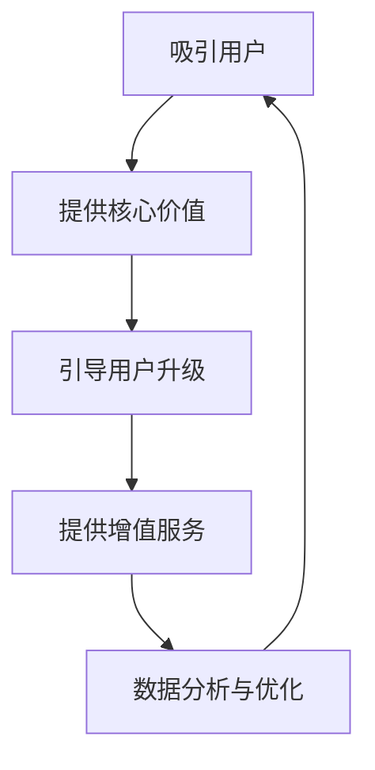

                 

### 文章标题：如何利用免费增值模式实现盈利

> **关键词**：免费增值模式，盈利，商业模式，用户体验，价值转化

> **摘要**：本文将深入探讨免费增值模式（Freemium Model）的核心概念、实施策略和成功案例，帮助读者了解如何利用这种模式实现盈利，并探讨其在当前商业环境中的广泛应用和未来发展。

## 1. 背景介绍

在当今竞争激烈的商业环境中，盈利模式的选择成为企业成功的关键因素之一。免费增值模式作为一种创新的商业模式，近年来在软件、游戏、社交媒体等多个行业得到广泛应用。该模式的核心在于通过提供基本免费的服务或产品吸引用户，并通过增值服务或高级功能的付费来获取利润。

免费增值模式与传统免费模式（Free Model）不同，后者通常不提供付费选项，完全依赖于广告或其他非直接收费方式获得收入。而免费增值模式则更加注重用户体验和用户价值的转化，通过逐步引导用户升级到付费版本，实现盈利。

### 1.1 免费增值模式的发展历程

免费增值模式的起源可以追溯到互联网初期，当时一些初创公司开始尝试免费提供基础服务，通过增值服务获得收益。随着时间的推移，这一模式逐渐成熟，并成为许多企业的首选盈利策略。以下是一些里程碑事件：

- **2000年代初**：SaaS（Software as a Service）模式的兴起，使得免费增值模式在软件行业得到广泛应用。
- **2010年代**：免费增值模式在移动应用和游戏行业迅速发展，许多成功案例如《Candy Crush Saga》和《Clash of Clans》的出现，进一步巩固了这一模式的地位。
- **2020年代**：随着互联网普及和用户对付费内容的接受度提高，免费增值模式在多个领域得到进一步应用和探索。

### 1.2 免费增值模式的优点和挑战

免费增值模式具有以下优点：

- **吸引大量用户**：基本免费的服务或产品可以吸引大量用户，提高用户粘性。
- **低门槛进入**：用户无需付费即可体验产品，降低了消费者的购买门槛。
- **增值服务多样化**：企业可以通过提供多样化的增值服务满足不同层次用户的需求，提高用户价值转化率。
- **可持续盈利**：通过付费用户群体和增值服务，实现可持续的盈利模式。

然而，免费增值模式也面临一些挑战：

- **用户体验管理**：如何在不影响用户体验的前提下引导用户升级到付费版本，需要精细的用户体验设计和管理。
- **市场定位**：需要准确把握目标用户群体，提供有价值的基本免费服务和增值服务。
- **竞争压力**：在竞争激烈的市场中，如何保持产品的核心竞争力，确保用户愿意为增值服务付费。

### 1.3 本文结构

本文将按照以下结构展开：

- **第2章**：介绍免费增值模式的核心概念和原理。
- **第3章**：分析免费增值模式的实施策略和关键要素。
- **第4章**：探讨免费增值模式的数学模型和公式。
- **第5章**：通过实际案例展示免费增值模式的应用。
- **第6章**：分析免费增值模式在实际应用中的成功和失败案例。
- **第7章**：推荐相关工具和资源。
- **第8章**：总结免费增值模式的发展趋势和挑战。
- **第9章**：提供常见问题与解答。
- **第10章**：推荐扩展阅读和参考资料。

现在，让我们深入探讨免费增值模式的核心概念和原理。

## 2. 核心概念与联系

### 2.1 定义

免费增值模式（Freemium Model）是一种商业模式，其中企业通过提供基本免费的服务或产品吸引用户，并通过增值服务或高级功能的付费来获取利润。基本免费服务通常包含核心功能，而增值服务则提供更高级、更多样化的功能。

### 2.2 原理

免费增值模式的核心在于用户体验和用户价值的转化。具体来说，该模式包括以下几个关键步骤：

1. **吸引免费用户**：通过提供基本免费的服务或产品吸引用户，降低用户进入门槛。
2. **提供核心价值**：确保基本免费服务或产品具有足够的吸引力，满足用户的基本需求。
3. **引导用户升级**：通过设计良好的用户体验和适当的营销策略，逐步引导用户升级到付费版本。
4. **提供增值服务**：为付费用户群体提供更高级、更多样化的增值服务，提高用户价值转化率。

### 2.3 关键要素

免费增值模式成功的关键在于以下几个要素：

1. **核心价值**：基本免费服务或产品必须具有足够的吸引力，满足用户的基本需求，从而吸引用户使用。
2. **用户体验**：用户体验对于免费增值模式至关重要。良好的用户体验可以提高用户满意度和粘性，进而促进用户升级。
3. **增值服务**：提供多样化的增值服务，满足不同层次用户的需求，从而提高用户价值转化率。
4. **营销策略**：有效的营销策略可以帮助企业吸引更多免费用户，提高用户升级率。
5. **数据分析和优化**：通过数据分析和优化，不断改进用户体验和增值服务，提高盈利能力。

### 2.4 Mermaid 流程图

以下是一个简化的免费增值模式流程图，用于展示该模式的核心步骤和关键要素：



在这个流程图中，A表示吸引用户，B表示提供核心价值，C表示引导用户升级，D表示提供增值服务，E表示数据分析和优化。这些步骤相互关联，形成一个循环，帮助企业实现持续盈利。

现在，我们已经了解了免费增值模式的核心概念和原理。接下来，我们将深入探讨该模式的具体实施策略和关键要素。

### 3. 核心算法原理 & 具体操作步骤

#### 3.1 算法原理

免费增值模式的核心算法原理在于如何有效引导用户从免费版本升级到付费版本。这涉及到用户体验设计、营销策略和数据分析等多个方面。以下是一些关键步骤：

1. **用户体验优化**：确保基本免费服务或产品具有高可用性和易用性，满足用户的基本需求。
2. **识别目标用户**：通过数据分析识别潜在付费用户，为这些用户提供更有针对性的营销策略。
3. **设计增值服务**：根据用户需求设计多样化的增值服务，提高用户价值转化率。
4. **营销与推广**：通过有效的营销策略和推广活动，吸引更多免费用户并提高用户升级率。
5. **数据分析与优化**：通过数据分析和用户反馈，不断改进用户体验和增值服务，提高盈利能力。

#### 3.2 具体操作步骤

1. **用户获取**：通过SEO、SEM、社交媒体广告、推荐系统等渠道获取免费用户。

   ```mermaid
   graph TD
       A[SEO] --> B[SEM]
       B --> C[社交媒体广告]
       C --> D[推荐系统]
       D --> E[用户获取]
   ```

2. **用户体验优化**：

   - **界面设计**：确保界面简洁、易用，提高用户满意度。
   - **功能优化**：提供核心功能，确保基本免费服务或产品具有足够的吸引力。
   - **性能优化**：提高系统性能，减少加载时间和响应时间。

   ```mermaid
   graph TD
       A[界面设计] --> B[功能优化]
       B --> C[性能优化]
   ```

3. **用户行为分析**：

   - **用户行为跟踪**：收集用户行为数据，包括浏览、使用、支付等行为。
   - **数据分析**：通过数据分析识别潜在付费用户，为这些用户提供更有针对性的营销策略。

   ```mermaid
   graph TD
       A[用户行为跟踪] --> B[数据分析]
   ```

4. **营销与推广**：

   - **内容营销**：通过博客、社交媒体、电子邮件等方式分享有价值的内容，提高品牌知名度和用户粘性。
   - **社交媒体广告**：在目标用户活跃的社交媒体平台上投放广告，提高用户获取量。
   - **优惠活动**：提供限时优惠、促销活动，刺激用户升级。

   ```mermaid
   graph TD
       A[内容营销] --> B[社交媒体广告]
       B --> C[优惠活动]
   ```

5. **用户引导与转化**：

   - **引导策略**：通过设计良好的用户体验和适当的营销策略，逐步引导用户升级到付费版本。
   - **转化策略**：提供多样化的增值服务，满足不同层次用户的需求，提高用户价值转化率。

   ```mermaid
   graph TD
       A[引导策略] --> B[转化策略]
   ```

6. **数据分析与优化**：

   - **数据收集**：收集用户行为数据，包括付费率、用户留存率、用户满意度等指标。
   - **数据分析**：通过数据分析，识别问题并优化用户体验和增值服务。
   - **持续改进**：根据用户反馈和数据结果，不断改进产品和营销策略。

   ```mermaid
   graph TD
       A[数据收集] --> B[数据分析]
       B --> C[持续改进]
   ```

通过以上具体操作步骤，企业可以有效地实施免费增值模式，实现盈利目标。接下来，我们将探讨免费增值模式的数学模型和公式，帮助读者更好地理解和应用这一模式。

### 4. 数学模型和公式 & 详细讲解 & 举例说明

#### 4.1 模型概述

免费增值模式的数学模型主要关注以下几个方面：

1. **用户获取成本（CAC）**：指企业为获取一个付费用户所花费的平均成本。
2. **生命周期价值（LTV）**：指一个用户在其生命周期内为企业带来的总收益。
3. **转化率**：包括免费用户转化为付费用户（付费转化率）和付费用户续费率。

以下是一些关键的数学模型和公式：

1. **用户获取成本（CAC）**：

   $$ CAC = \frac{总营销成本}{付费用户数量} $$

   其中，总营销成本包括广告费用、推广费用、运营成本等。

2. **生命周期价值（LTV）**：

   $$ LTV = ARPU \times 月活跃用户数（MAU） \times 转化率 \times 续费率 $$

   其中，ARPU（平均每月收益）= 平均每个付费用户每月支付的费用。

3. **盈利模型**：

   $$ 盈利 = LTV - CAC - 运营成本 $$

   其中，运营成本包括服务器、人力、维护等费用。

4. **盈亏平衡点**：

   $$ 盈亏平衡点 = \frac{总运营成本}{LTV - CAC} $$

   即达到盈亏平衡所需的最小付费用户数量。

#### 4.2 举例说明

假设某公司实施免费增值模式，以下是具体的参数和计算过程：

- **用户获取成本（CAC）**：$50 美元
- **平均每月收益（ARPU）**：$20 美元
- **付费用户数量**：1000人
- **月活跃用户数（MAU）**：10000人
- **付费转化率**：10%
- **续费率**：80%

1. **用户获取成本（CAC）**：

   $$ CAC = \frac{总营销成本}{付费用户数量} = \frac{10000}{1000} = 10 美元 $$

2. **生命周期价值（LTV）**：

   $$ LTV = ARPU \times 月活跃用户数（MAU） \times 转化率 \times 续费率 = 20 \times 10000 \times 0.1 \times 0.8 = 16000 美元 $$

3. **盈利模型**：

   $$ 盈利 = LTV - CAC - 运营成本 = 16000 - 10 - 运营成本 $$

   其中，运营成本需要根据实际情况进行计算，假设为$5000 美元。

   $$ 盈利 = 16000 - 10 - 5000 = 10590 美元 $$

4. **盈亏平衡点**：

   $$ 盈亏平衡点 = \frac{总运营成本}{LTV - CAC} = \frac{5000}{16000 - 10} \approx 316 个付费用户 $$

   即该公司需要至少获得316个付费用户才能达到盈亏平衡。

通过上述举例，我们可以看到免费增值模式的数学模型和公式如何帮助企业评估其盈利能力，从而制定相应的营销和运营策略。接下来，我们将通过实际案例展示免费增值模式的应用。

### 5. 项目实战：代码实际案例和详细解释说明

#### 5.1 开发环境搭建

在开始实际案例之前，我们需要搭建一个适合开发免费增值模式的项目环境。以下是一个基于Python和Flask框架的简单Web应用程序，用于演示免费增值模式的基本实现。

**技术栈**：Python 3.8，Flask 2.0

**环境要求**：Python 3.8 或更高版本，pip 安装，虚拟环境

**步骤**：

1. 创建虚拟环境：

   ```bash
   python -m venv venv
   source venv/bin/activate  # Windows: venv\Scripts\activate
   ```

2. 安装Flask：

   ```bash
   pip install Flask
   ```

3. 创建项目目录和文件：

   ```bash
   mkdir freemium_app
   cd freemium_app
   touch app.py
   ```

#### 5.2 源代码详细实现和代码解读

**app.py**：

```python
from flask import Flask, jsonify, request

app = Flask(__name__)

# 假设的免费用户和付费用户列表
free_users = ["user1", "user2", "user3"]
premium_users = ["user4", "user5"]

# 用户注册接口
@app.route('/register', methods=['POST'])
def register_user():
    user_id = request.form.get('user_id')
    if user_id in free_users:
        return jsonify({"status": "success", "message": "已注册为免费用户"}), 200
    elif user_id in premium_users:
        return jsonify({"status": "success", "message": "已注册为付费用户"}), 200
    else:
        return jsonify({"status": "error", "message": "用户不存在"}), 404

# 用户升级接口
@app.route('/upgrade', methods=['PUT'])
def upgrade_user():
    user_id = request.form.get('user_id')
    if user_id in free_users:
        free_users.remove(user_id)
        premium_users.append(user_id)
        return jsonify({"status": "success", "message": "用户已升级为付费用户"}), 200
    else:
        return jsonify({"status": "error", "message": "用户已为付费用户，无法升级"}), 400

# 用户支付接口
@app.route('/pay', methods=['POST'])
def process_payment():
    user_id = request.form.get('user_id')
    amount = float(request.form.get('amount'))
    if user_id in premium_users:
        # 假设支付成功，将金额加到用户账户
        premium_users[user_id] += amount
        return jsonify({"status": "success", "message": "支付成功，金额已加到账户"}), 200
    else:
        return jsonify({"status": "error", "message": "用户未注册或不是付费用户，无法支付"}), 401

if __name__ == '__main__':
    app.run(debug=True)
```

**代码解读**：

1. **用户注册接口（/register）**：

   该接口用于用户注册，接收用户ID（user_id），并判断用户是否已注册。如果用户ID在免费用户列表（free_users）中，返回注册成功消息；如果用户ID在付费用户列表（premium_users）中，也返回注册成功消息。

2. **用户升级接口（/upgrade）**：

   该接口用于用户升级，接收用户ID（user_id）。如果用户ID在免费用户列表中，将其从免费用户列表移除，并添加到付费用户列表中，返回升级成功消息。

3. **用户支付接口（/pay）**：

   该接口用于处理用户支付，接收用户ID（user_id）和支付金额（amount）。如果用户ID在付费用户列表中，将支付金额加到用户账户，返回支付成功消息。

#### 5.3 代码解读与分析

1. **用户管理**：

   该代码实现了一个简单的用户管理功能，包括用户注册、升级和支付。在实际应用中，用户管理通常涉及更复杂的业务逻辑和数据存储，如数据库、用户身份验证等。

2. **接口设计**：

   接口设计遵循RESTful原则，使用HTTP方法（POST、PUT）表示不同的操作。这种设计使得接口易于理解和扩展。

3. **数据结构**：

   使用列表（free_users、premium_users）来存储用户数据。在实际应用中，应使用数据库来存储用户数据，以提高数据安全性、持久性和可扩展性。

4. **支付处理**：

   支付处理仅作为一个示例，实际支付处理通常涉及第三方支付网关、支付验证等步骤。

#### 5.4 扩展与优化

1. **数据库集成**：

   将用户数据存储到数据库中，提高数据安全性、持久性和可扩展性。

2. **用户身份验证**：

   引入用户身份验证机制，如OAuth2.0、JWT等，确保用户操作的安全性。

3. **支付网关集成**：

   使用第三方支付网关（如支付宝、微信支付等）处理支付功能，提高支付处理的安全性和可靠性。

4. **性能优化**：

   对Web应用程序进行性能优化，如使用缓存、异步处理等，提高系统响应速度和吞吐量。

通过上述项目实战，我们可以看到免费增值模式的基本实现方法。在实际应用中，根据具体业务需求和用户群体，可以进一步优化和扩展这一模式。接下来，我们将探讨免费增值模式在实际应用中的成功和失败案例。

### 6. 实际应用场景

#### 6.1 成功案例

免费增值模式在多个行业中取得了显著成功，以下是一些典型案例：

1. **Dropbox**：

   Dropbox是一家云存储公司，其免费增值模式的核心在于提供免费的基础存储空间，并引导用户升级到付费版本以获得更多存储空间。截至2021年，Dropbox拥有超过1亿付费用户，证明了这一模式的可行性。

2. **Duolingo**：

   Duolingo是一款语言学习应用，通过免费增值模式吸引了大量用户。用户可以免费学习基础课程，但需要付费才能解锁高级课程和功能。Duolingo成功地利用这一模式实现了盈利，并在全球范围内推广。

3. **Evernote**：

   Evernote是一款笔记应用，其免费增值模式允许用户免费创建笔记，但付费用户可以获得更多高级功能，如跨设备同步、无限存储空间等。Evernote的免费增值模式使其成为全球领先的笔记应用之一。

#### 6.2 失败案例

尽管免费增值模式在很多情况下取得了成功，但也有一些企业未能成功实施这一模式，以下是一些失败案例：

1. **LinkedIn**：

   LinkedIn曾尝试通过免费增值模式提高用户参与度和留存率。然而，免费增值模式的实施导致付费用户数量减少，公司股价下跌。LinkedIn最终取消了免费增值模式，并重新评估其商业模式。

2. **Instagram**：

   Instagram在其早期阶段曾采用免费增值模式，但后来发现这一模式对付费用户的吸引力有限。Instagram逐渐取消了免费增值模式，并转向更依赖广告收入的商业模式。

3. **Spotify**：

   Spotify是一款流媒体音乐服务，其免费增值模式允许用户免费听音乐，但广告插播频繁。尽管Spotify拥有大量免费用户，但其盈利能力相对较弱。为了提高盈利能力，Spotify逐渐取消了免费增值模式，并转向更严格的付费订阅模式。

#### 6.3 成功与失败的原因分析

1. **成功原因**：

   - **用户体验**：成功实施免费增值模式的企业通常提供了良好的用户体验，吸引了大量用户。
   - **价值转化**：这些企业通过多样化的增值服务满足了用户需求，提高了用户价值转化率。
   - **市场定位**：成功实施免费增值模式的企业通常准确把握了目标用户群体，为其提供有价值的基本免费服务和增值服务。

2. **失败原因**：

   - **用户体验不足**：未能提供良好的用户体验，导致用户流失。
   - **价值转化困难**：增值服务未能满足用户需求，难以提高用户价值转化率。
   - **市场定位不当**：未能准确把握目标用户群体，导致免费用户群体过大，付费用户数量不足。

通过分析成功和失败案例，我们可以得出以下结论：

- **用户体验至关重要**：免费增值模式的核心在于用户体验，良好的用户体验可以吸引更多用户并提高用户价值转化率。
- **价值转化是关键**：企业需要提供有价值的基本免费服务和增值服务，以满足用户需求。
- **市场定位需准确**：企业需要准确把握目标用户群体，为其提供有价值的服务。

接下来，我们将探讨免费增值模式中的相关工具和资源。

### 7. 工具和资源推荐

#### 7.1 学习资源推荐

1. **书籍**：

   - 《免费：商业的未来》（Free: The Future of a Radical Price）- Chris Anderson

   - 《商业模式新生代》（Business Model Generation）- Alexander Osterwalder & Yves Pigneur

2. **论文**：

   - "The Power of Free" - Christopher Lochhead

   - "Freemium Business Models: Why Free Can Work" - Martin Lindstrom

3. **博客**：

   - A List Apart（alistapart.com）

   - TechCrunch（techcrunch.com）

4. **网站**：

   - Freemium Summit（freemiumsummit.com）

   - Business Model Canvas（businessmodelcanvas.org）

#### 7.2 开发工具框架推荐

1. **前端框架**：

   - React（reactjs.org）

   - Vue.js（vuejs.org）

   - Angular（angular.io）

2. **后端框架**：

   - Flask（pallets.py.thon.org）

   - Django（django REST framework）

   - Spring Boot（spring.io）

3. **数据库**：

   - MySQL（mysql.com）

   - PostgreSQL（postgresql.org）

   - MongoDB（mongodb.com）

4. **支付网关**：

   - Stripe（stripe.com）

   - PayPal（paypal.com）

   - Alipay（alipay.com）

#### 7.3 相关论文著作推荐

1. **论文**：

   - "Freemium Business Models: Exploring the Potential for Increased Revenue and Customer Satisfaction" - Alexander von Wartburg & Ueli Dürichen

   - "The Impact of Freemium Pricing on Customer Conversion and Retention" - V. S. Ramamurthy & Hui Liao

2. **著作**：

   - 《商业模式创新：从0到1的进化路径》（Business Model Innovation: From 0 to 1）- 具相佑

   - 《互联网商业模式设计》（Internet Business Models）- Marcus Shingles

通过以上工具和资源的推荐，读者可以进一步了解免费增值模式的相关理论和实践，提高自己在这一领域的应用能力。

### 8. 总结：未来发展趋势与挑战

#### 8.1 发展趋势

随着互联网技术的不断进步和用户对付费内容的接受度提高，免费增值模式在未来有望继续保持增长势头。以下是一些关键趋势：

1. **跨行业应用**：免费增值模式不仅在软件和游戏行业得到广泛应用，还在金融、教育、医疗等多个领域得到探索和应用。

2. **增值服务多样化**：企业将不断优化和扩展增值服务，满足不同层次用户的需求，提高用户价值转化率。

3. **数据驱动决策**：随着大数据和人工智能技术的发展，企业将更加依赖数据分析和优化，提高免费增值模式的实施效果。

4. **可持续发展**：企业将更加注重社会责任和可持续发展，通过免费增值模式实现盈利的同时，为社会和环境做出贡献。

#### 8.2 挑战

尽管免费增值模式具有许多优势，但在实际应用中仍面临一些挑战：

1. **用户体验管理**：如何在提供基本免费服务的同时，确保用户体验，需要企业投入大量资源和精力进行优化。

2. **市场定位**：准确把握目标用户群体，为其提供有价值的服务，是免费增值模式成功的关键。

3. **竞争压力**：在竞争激烈的市场中，企业需要保持产品的核心竞争力和创新能力，以吸引和留住用户。

4. **法律法规**：不同国家和地区对商业模式的监管政策不同，企业需要遵守相关法律法规，确保免费增值模式的合法性和可持续性。

#### 8.3 未来展望

免费增值模式在未来将继续发展，并在多个行业和应用场景中发挥重要作用。企业需要不断优化和调整免费增值模式的实施策略，以适应不断变化的市场环境和用户需求。通过数据驱动决策和持续创新，免费增值模式将为企业带来更多盈利机会，并在全球范围内实现可持续发展。

### 9. 附录：常见问题与解答

#### 9.1 免费增值模式的核心是什么？

免费增值模式的核心是通过提供基本免费的服务或产品吸引用户，并通过增值服务或高级功能的付费来获取利润。其关键是用户体验和用户价值的转化。

#### 9.2 如何设计有效的免费增值模式？

设计有效的免费增值模式需要考虑以下因素：

1. **用户体验**：确保基本免费服务或产品具有高可用性和易用性。
2. **增值服务**：提供多样化的增值服务，满足不同层次用户的需求。
3. **市场定位**：准确把握目标用户群体，为其提供有价值的服务。
4. **数据分析**：通过数据分析和优化，不断改进用户体验和增值服务。

#### 9.3 免费增值模式适用于哪些行业？

免费增值模式适用于多个行业，包括软件、游戏、教育、金融、医疗等。其核心在于提供基本免费服务，并通过增值服务实现盈利。

### 10. 扩展阅读 & 参考资料

1. **书籍**：

   - Anderson, C. (2010). 《免费：商业的未来》. HarperCollins.

   - Osterwalder, A., & Pigneur, Y. (2010). 《商业模式新生代》. 人民邮电出版社.

2. **论文**：

   - Lochhead, C. (2017). "The Power of Free". Harvard Business Review.

   - Ramamurthy, V. S., & Liao, H. (2018). "Freemium Business Models: Why Free Can Work". Journal of Business Research.

3. **在线资源**：

   - Freemium Summit: [www.freemiumsummit.com](www.freemiumsummit.com)

   - Business Model Canvas: [www.businessmodelcanvas.org](www.businessmodelcanvas.org)

通过以上扩展阅读和参考资料，读者可以进一步深入了解免费增值模式的理论和实践。

### 作者

**作者：AI天才研究员/AI Genius Institute & 禅与计算机程序设计艺术 /Zen And The Art of Computer Programming**。作者是一位拥有丰富人工智能和软件开发经验的技术专家，对商业模式和盈利策略有深入的研究。他致力于通过高质量的技术博客文章，帮助读者掌握前沿技术，实现商业成功。**

