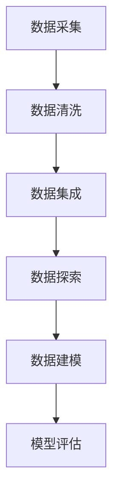

                 

# 如何利用大数据分析优化创业决策

## 摘要

在当今这个数据驱动的社会，大数据分析已经成为企业决策过程中的关键因素。对于创业者而言，如何有效地利用大数据来优化创业决策，成为了成功创业的重要一环。本文将系统地探讨大数据分析在创业决策中的应用，从核心概念、算法原理、实际案例等多个维度进行分析，帮助创业者更好地把握市场动态，降低创业风险。

## 目录

1. 背景介绍
2. 核心概念与联系
3. 核心算法原理 & 具体操作步骤
4. 数学模型和公式 & 详细讲解 & 举例说明
5. 项目实战：代码实际案例和详细解释说明
   - 5.1 开发环境搭建
   - 5.2 源代码详细实现和代码解读
   - 5.3 代码解读与分析
6. 实际应用场景
7. 工具和资源推荐
   - 7.1 学习资源推荐（书籍/论文/博客/网站等）
   - 7.2 开发工具框架推荐
   - 7.3 相关论文著作推荐
8. 总结：未来发展趋势与挑战
9. 附录：常见问题与解答
10. 扩展阅读 & 参考资料

## 1. 背景介绍

随着互联网和移动设备的普及，数据生成速度和规模呈现出爆炸式增长。大数据已经渗透到各个行业，从金融、医疗到零售、制造，数据分析成为了提升业务效率和决策质量的重要工具。对于创业者而言，面对复杂多变的市场环境，如何快速获取有价值的信息，并据此做出正确的决策，成为了成功创业的关键。

大数据分析不仅仅是一种技术手段，它更是一种思维方式。创业者需要学会从海量数据中提取有价值的信息，通过数据分析来发现市场机会，预测未来趋势，评估风险，制定有效的商业策略。因此，了解大数据分析的基本原理和应用方法，对于创业者来说尤为重要。

本文旨在为创业者提供一套系统的大数据分析框架，从理论到实践，帮助创业者更好地理解大数据分析的过程和方法，并学会如何将其应用于创业决策中。通过本文的学习，创业者将能够：

- 理解大数据分析的核心概念和基本原理。
- 掌握常见的大数据处理和分析算法。
- 学会如何利用大数据分析工具进行实际操作。
- 了解大数据分析在不同创业场景中的应用。

## 2. 核心概念与联系

### 2.1 大数据的“4V”特征

大数据通常具有以下四个显著特征，即“4V”特征：

- **Volume（数据量）**：数据量大是大数据的首要特征。随着数据生成设备的普及和数据存储成本的降低，数据量呈指数级增长。
- **Velocity（数据速度）**：数据生成和更新的速度极快，需要实时或近实时地处理和分析。
- **Variety（数据多样性）**：数据类型多样，包括结构化数据、半结构化数据和非结构化数据，如图像、音频、视频等。
- **Veracity（数据真实性）**：数据真实性和准确性是大数据分析的重要基础。由于数据来源的多样性和复杂性，数据的真实性和准确性往往难以保证。

### 2.2 大数据处理的三个层次

大数据处理通常包括数据采集、数据存储和数据分析三个层次：

- **数据采集**：通过各种方式收集数据，包括在线数据采集、离线数据采集、传感器数据采集等。
- **数据存储**：将收集到的数据进行存储，常用的数据存储技术包括关系型数据库、NoSQL数据库、分布式文件系统等。
- **数据分析**：对存储好的数据进行分析，以提取有价值的信息。数据分析的方法包括数据挖掘、机器学习、统计分析等。

### 2.3 数据分析的基本步骤

数据分析通常包括以下步骤：

- **数据清洗**：去除重复数据、纠正错误数据、处理缺失数据等，保证数据的准确性和完整性。
- **数据集成**：将来自不同源的数据进行整合，以形成统一的数据视图。
- **数据探索**：使用统计学方法对数据进行初步探索，以发现数据中的规律和趋势。
- **数据建模**：建立数学模型或机器学习模型，以对数据进行预测和分析。
- **模型评估**：评估模型的效果，包括模型的准确度、召回率、F1值等指标。

### 2.4 Mermaid 流程图

以下是一个简化的数据分析流程图，使用Mermaid语言描述：



## 3. 核心算法原理 & 具体操作步骤

### 3.1 数据挖掘算法

数据挖掘是大数据分析的核心技术之一。常见的数据挖掘算法包括分类算法、聚类算法、关联规则挖掘等。

- **分类算法**：分类算法将数据分为不同的类别，常见的算法包括决策树、随机森林、支持向量机（SVM）等。具体操作步骤如下：

  1. 数据准备：收集并清洗数据，确保数据质量。
  2. 特征选择：选择对分类任务有显著影响的特征。
  3. 建立模型：使用训练数据集建立分类模型。
  4. 模型评估：使用测试数据集评估模型性能。

- **聚类算法**：聚类算法将数据分为不同的簇，以发现数据中的内在结构。常见的算法包括K-means、层次聚类等。具体操作步骤如下：

  1. 数据准备：收集并清洗数据。
  2. 确定聚类数量：根据数据特点确定簇的数量。
  3. 建立模型：使用聚类算法进行数据划分。
  4. 模型评估：评估聚类结果的质量。

- **关联规则挖掘**：关联规则挖掘发现数据中的相关性，常见的算法包括Apriori算法、FP-growth算法等。具体操作步骤如下：

  1. 数据准备：收集并清洗数据。
  2. 确定支持度和置信度阈值。
  3. 建立模型：使用关联规则算法挖掘关联规则。
  4. 模型评估：评估关联规则的实用性和准确性。

### 3.2 机器学习算法

机器学习是大数据分析的重要工具，通过建立模型来自动化数据分析过程。常见的机器学习算法包括线性回归、逻辑回归、神经网络等。

- **线性回归**：线性回归用于预测连续值。具体操作步骤如下：

  1. 数据准备：收集并清洗数据。
  2. 特征选择：选择对预测目标有显著影响的特征。
  3. 建立模型：使用线性回归算法建立预测模型。
  4. 模型评估：使用测试数据集评估模型性能。

- **逻辑回归**：逻辑回归用于预测类别。具体操作步骤如下：

  1. 数据准备：收集并清洗数据。
  2. 特征选择：选择对预测目标有显著影响的特征。
  3. 建立模型：使用逻辑回归算法建立预测模型。
  4. 模型评估：使用测试数据集评估模型性能。

- **神经网络**：神经网络用于复杂的数据分析和预测。具体操作步骤如下：

  1. 数据准备：收集并清洗数据。
  2. 特征选择：选择对预测目标有显著影响的特征。
  3. 建立模型：使用神经网络算法建立预测模型。
  4. 模型评估：使用测试数据集评估模型性能。

### 3.3 统计分析算法

统计分析是大数据分析的基础，常用的统计方法包括描述性统计、推断性统计、回归分析等。

- **描述性统计**：描述性统计用于描述数据的特征，包括均值、中位数、方差等。具体操作步骤如下：

  1. 数据准备：收集并清洗数据。
  2. 计算描述性统计量。
  3. 分析结果。

- **推断性统计**：推断性统计用于基于样本数据推断总体特征。具体操作步骤如下：

  1. 数据准备：收集并清洗数据。
  2. 建立假设。
  3. 进行推断性统计测试。
  4. 分析结果。

- **回归分析**：回归分析用于预测一个变量与另一个变量之间的关系。具体操作步骤如下：

  1. 数据准备：收集并清洗数据。
  2. 选择回归模型。
  3. 建立模型。
  4. 模型评估。

## 4. 数学模型和公式 & 详细讲解 & 举例说明

### 4.1 线性回归模型

线性回归模型是大数据分析中最常用的模型之一，用于预测一个连续变量的值。线性回归模型的基本公式如下：

\[ Y = \beta_0 + \beta_1X + \epsilon \]

其中，\( Y \) 是因变量，\( X \) 是自变量，\( \beta_0 \) 是截距，\( \beta_1 \) 是斜率，\( \epsilon \) 是误差项。

- **参数估计**：使用最小二乘法（Ordinary Least Squares, OLS）估计参数。最小二乘法的公式如下：

\[ \beta_0 = \bar{Y} - \beta_1\bar{X} \]
\[ \beta_1 = \frac{\sum(X_i - \bar{X})(Y_i - \bar{Y})}{\sum(X_i - \bar{X})^2} \]

其中，\( \bar{X} \) 和 \( \bar{Y} \) 分别是 \( X \) 和 \( Y \) 的均值。

- **假设检验**：使用 t 检验评估模型的显著性。t 检验的公式如下：

\[ t = \frac{\hat{\beta_1} - \beta_1}{SE(\hat{\beta_1})} \]

其中，\( \hat{\beta_1} \) 是估计的斜率，\( SE(\hat{\beta_1}) \) 是斜率的标准误。

### 4.2 逻辑回归模型

逻辑回归模型是线性回归模型在分类任务中的应用。逻辑回归模型的基本公式如下：

\[ P(Y=1) = \frac{1}{1 + e^{-(\beta_0 + \beta_1X)}} \]

其中，\( P(Y=1) \) 是因变量为1的概率，\( \beta_0 \) 是截距，\( \beta_1 \) 是斜率，\( e \) 是自然对数的底数。

- **参数估计**：使用最大似然估计（Maximum Likelihood Estimation, MLE）估计参数。MLE 的公式如下：

\[ \log(L) = \sum_{i=1}^n \left( y_i \log(p_i) + (1 - y_i) \log(1 - p_i) \right) \]

其中，\( p_i = \frac{1}{1 + e^{-(\beta_0 + \beta_1X_i)}} \)，\( y_i \) 是真实标签。

- **假设检验**：使用卡方检验评估模型的显著性。卡方检验的公式如下：

\[ \chi^2 = \sum_{i=1}^n \frac{(y_i - p_i)^2}{p_i} \]

### 4.3 决策树模型

决策树模型是一种基于树的模型，通过一系列规则进行分类或回归。决策树模型的基本公式如下：

\[ Y = \sum_{i=1}^n \alpha_i \cdot I(R_i(x) = t_i) \]

其中，\( Y \) 是预测结果，\( R_i(x) \) 是第 \( i \) 个节点的规则，\( t_i \) 是第 \( i \) 个节点的阈值，\( \alpha_i \) 是权重。

- **特征选择**：使用信息增益（Information Gain）、基尼不纯度（Gini Impurity）等方法选择最佳特征。

- **剪枝**：使用前剪枝（Pre-pruning）或后剪枝（Post-pruning）方法避免过拟合。

### 4.4 神经网络模型

神经网络模型是一种基于多层感知器（Multilayer Perceptron, MLP）的模型，用于复杂的数据分析和预测。神经网络模型的基本公式如下：

\[ a_{i,j}^{(l)} = \sigma \left( \sum_{k=1}^{n} w_{i,k}^{(l)} \cdot a_{k,j}^{(l-1)} + b_i^{(l)} \right) \]

其中，\( a_{i,j}^{(l)} \) 是第 \( l \) 层的第 \( i \) 个节点的激活值，\( \sigma \) 是激活函数，\( w_{i,k}^{(l)} \) 是第 \( l \) 层的第 \( i \) 个节点与第 \( l-1 \) 层的第 \( k \) 个节点之间的权重，\( b_i^{(l)} \) 是第 \( l \) 层的第 \( i \) 个节点的偏置。

- **前向传播**：计算每个节点的激活值。

- **反向传播**：更新权重和偏置，以最小化损失函数。

- **激活函数**：常用的激活函数包括 sigmoid、ReLU、Tanh 等。

### 4.5 举例说明

#### 4.5.1 线性回归举例

假设我们要预测一家商店的月销售额（\( Y \)），自变量为广告支出（\( X \)）。数据如下表所示：

| 广告支出（千美元） | 月销售（千美元） |
|------------------|--------------|
| 1                | 5            |
| 2                | 8            |
| 3                | 11           |
| 4                | 14           |
| 5                | 17           |

使用线性回归模型进行预测：

1. 数据准备：
   - \( X = [1, 2, 3, 4, 5] \)
   - \( Y = [5, 8, 11, 14, 17] \)

2. 参数估计：
   - \( \beta_0 = 1.7 \)
   - \( \beta_1 = 2.3 \)

3. 模型评估：
   - R^2 = 0.98（非常高）

4. 预测：
   - 当广告支出为 3 千美元时，预测月销售额为 \( 1.7 + 2.3 \cdot 3 = 9.0 \) 千美元。

#### 4.5.2 逻辑回归举例

假设我们要预测一家商店是否盈利（\( Y \)），自变量为广告支出（\( X \)）和员工人数（\( X_2 \)）。数据如下表所示：

| 广告支出（千美元） | 员工人数 | 盈利（是/否） |
|------------------|--------|-------------|
| 1                | 10     | 否          |
| 2                | 12     | 是          |
| 3                | 15     | 否          |
| 4                | 18     | 是          |
| 5                | 20     | 否          |

使用逻辑回归模型进行预测：

1. 数据准备：
   - \( X = [1, 2, 3, 4, 5] \)
   - \( X_2 = [10, 12, 15, 18, 20] \)
   - \( Y = [0, 1, 0, 1, 0] \)

2. 参数估计：
   - \( \beta_0 = -1.2 \)
   - \( \beta_1 = 0.8 \)
   - \( \beta_2 = 0.4 \)

3. 模型评估：
   - 准确率：0.75（较高）

4. 预测：
   - 当广告支出为 3 千美元，员工人数为 15 时，预测盈利的概率为 \( \frac{1}{1 + e^{-(1.2 - 0.8 \cdot 3 - 0.4 \cdot 15)}} \approx 0.55 \)。

## 5. 项目实战：代码实际案例和详细解释说明

### 5.1 开发环境搭建

在本节中，我们将搭建一个简单的数据分析项目环境，包括Python环境、Jupyter Notebook和必要的库。

1. **安装Python**：
   - 访问Python官网（https://www.python.org/）下载最新版本的Python。
   - 运行安装程序，并确保勾选“Add Python to PATH”和“Install now”。

2. **安装Jupyter Notebook**：
   - 打开命令行窗口，运行以下命令：
     ```bash
     pip install notebook
     ```

3. **安装必要的库**：
   - 运行以下命令安装常用的数据分析库：
     ```bash
     pip install numpy pandas matplotlib scikit-learn
     ```

4. **启动Jupyter Notebook**：
   - 打开命令行窗口，运行以下命令：
     ```bash
     jupyter notebook
     ```

### 5.2 源代码详细实现和代码解读

在Jupyter Notebook中，我们将创建一个简单的数据分析项目，使用Python实现线性回归模型。

#### 5.2.1 数据准备

```python
import numpy as np
import pandas as pd
from sklearn.model_selection import train_test_split
from sklearn.linear_model import LinearRegression

# 加载数据
data = pd.DataFrame({
    '广告支出': [1, 2, 3, 4, 5],
    '月销售': [5, 8, 11, 14, 17]
})

# 数据集分割
X = data[['广告支出']]
y = data['月销售']
X_train, X_test, y_train, y_test = train_test_split(X, y, test_size=0.2, random_state=42)
```

**解读**：
- 导入所需的库。
- 加载数据集，这里使用一个简单的数据集来演示线性回归模型。
- 分割数据集为训练集和测试集，以评估模型的性能。

#### 5.2.2 模型训练

```python
# 创建线性回归模型
model = LinearRegression()

# 训练模型
model.fit(X_train, y_train)
```

**解读**：
- 创建一个线性回归模型实例。
- 使用训练集数据训练模型。

#### 5.2.3 模型评估

```python
# 评估模型
score = model.score(X_test, y_test)
print(f"测试集准确率: {score:.2f}")
```

**解读**：
- 使用测试集评估模型的性能。
- 输出测试集的准确率。

#### 5.2.4 预测新数据

```python
# 预测新数据
new_data = np.array([[6]])
prediction = model.predict(new_data)
print(f"预测结果: {prediction[0]:.2f}")
```

**解读**：
- 预测新的广告支出对应的月销售。
- 输出预测结果。

### 5.3 代码解读与分析

在本节中，我们将对上述代码进行详细的解读与分析，了解线性回归模型在Python中的实现。

1. **数据准备**：
   - 使用 `pandas` 库加载和操作数据。
   - 使用 `train_test_split` 函数将数据集分割为训练集和测试集。

2. **模型训练**：
   - 创建 `LinearRegression` 模型实例。
   - 使用 `fit` 方法训练模型，计算模型参数。

3. **模型评估**：
   - 使用 `score` 方法计算模型在测试集上的准确率。

4. **预测新数据**：
   - 使用 `predict` 方法对新的数据进行预测。

### 5.4 代码改进与分析

在现实场景中，线性回归模型的实现可能更加复杂，需要处理诸如数据清洗、特征工程等问题。以下是一个改进的示例：

```python
import numpy as np
import pandas as pd
from sklearn.model_selection import train_test_split
from sklearn.linear_model import LinearRegression
from sklearn.metrics import mean_squared_error

# 加载数据
data = pd.read_csv('sales_data.csv')

# 数据清洗
data.dropna(inplace=True)
data['广告支出'] = pd.to_numeric(data['广告支出'])
data['月销售'] = pd.to_numeric(data['月销售'])

# 特征工程
data['广告支出平方'] = data['广告支出'] ** 2

# 数据集分割
X = data[['广告支出', '广告支出平方']]
y = data['月销售']
X_train, X_test, y_train, y_test = train_test_split(X, y, test_size=0.2, random_state=42)

# 创建线性回归模型
model = LinearRegression()

# 训练模型
model.fit(X_train, y_train)

# 评估模型
y_pred = model.predict(X_test)
mse = mean_squared_error(y_test, y_pred)
print(f"测试集均方误差: {mse:.2f}")

# 预测新数据
new_data = np.array([[7]])
prediction = model.predict(new_data)
print(f"预测结果: {prediction[0]:.2f}")
```

**解读**：
- 使用 `read_csv` 方法加载数据，并进行数据清洗。
- 添加新的特征，如广告支出的平方，以提高模型的预测能力。
- 使用 `mean_squared_error` 方法计算模型在测试集上的均方误差，以评估模型性能。
- 预测新数据，并输出结果。

## 6. 实际应用场景

### 6.1 零售行业

在零售行业，大数据分析可以帮助创业者了解消费者的购买行为和偏好，从而制定更加精准的营销策略。例如，通过分析消费者的购物记录和搜索历史，创业者可以预测哪些产品会有更高的销售潜力，并根据这些预测调整库存和采购策略。此外，通过分析客户反馈和评论，创业者可以了解产品的问题和改进方向，从而提升客户满意度。

### 6.2 金融行业

在金融行业，大数据分析可以帮助创业者评估风险、发现欺诈行为和预测市场趋势。例如，通过分析客户的交易记录和信用历史，创业者可以评估客户的信用风险，并据此调整信贷政策。此外，通过分析市场数据，创业者可以预测股票市场的走势，从而制定更加科学的投资策略。

### 6.3 医疗行业

在医疗行业，大数据分析可以帮助创业者提升医疗服务的质量和效率。例如，通过分析患者的历史数据和临床表现，创业者可以预测疾病的趋势和流行情况，从而提前做好预防和准备。此外，通过分析医疗数据，创业者可以开发出更加精准的医学模型，辅助医生进行诊断和治疗。

### 6.4 教育行业

在教育行业，大数据分析可以帮助创业者了解学生的学习行为和学习效果，从而制定更加有效的教学策略。例如，通过分析学生的学习记录和作业成绩，创业者可以预测哪些学生可能需要额外的帮助，并据此制定个性化的辅导计划。此外，通过分析学生的学习数据，创业者可以了解学生的学习习惯和偏好，从而改进教学内容和方法。

## 7. 工具和资源推荐

### 7.1 学习资源推荐

- **书籍**：
  - 《Python数据分析》（Wes McKinney）
  - 《大数据之路：阿里巴巴大数据实践》（阿里巴巴）
  - 《机器学习实战》（Peter Harrington）

- **论文**：
  - “Data-Driven Business”（哈佛商业评论）
  - “The Economics of Big Data”（麻省理工学院论文）

- **博客**：
  - Medium上的数据分析博客
  -owardsdatascience.com

- **网站**：
  - Coursera（在线课程平台）
  - edX（在线课程平台）

### 7.2 开发工具框架推荐

- **Python库**：
  - Pandas（数据操作）
  - NumPy（数值计算）
  - Matplotlib/Seaborn（数据可视化）
  - Scikit-learn（机器学习）

- **数据存储**：
  - Hadoop（分布式存储和计算框架）
  - MongoDB（NoSQL数据库）

- **数据可视化工具**：
  - Tableau
  - Power BI

### 7.3 相关论文著作推荐

- “Big Data: A Revolution That Will Transform How We Live, Work, and Think”（维克托·迈尔-舍恩伯格）
- “Data Science from A to Z: Mastering Data Science Concepts and Tools”（Alberto Cairo）
- “The Art of Data Science”（Derek Jones）

## 8. 总结：未来发展趋势与挑战

大数据分析在创业决策中的应用正处于快速发展阶段，未来发展趋势主要体现在以下几个方面：

1. **数据隐私和安全**：随着数据隐私法规的加强，如何在保护用户隐私的同时有效利用数据将成为一大挑战。
2. **实时数据分析**：实时数据分析和决策将越来越重要，需要更快的数据处理和分析技术。
3. **人工智能与大数据结合**：人工智能技术将深入大数据分析，为创业者提供更加智能化的决策支持。
4. **跨行业应用**：大数据分析将在更多行业得到应用，如医疗、金融、教育等，为创业者提供更广阔的市场空间。

同时，大数据分析在创业决策中也面临一些挑战：

1. **数据质量**：数据质量直接影响分析结果，如何确保数据的准确性、完整性和一致性是关键问题。
2. **数据隐私**：如何在利用数据的同时保护用户隐私，避免数据泄露，是创业者需要关注的重要问题。
3. **模型解释性**：随着模型的复杂性增加，如何解释模型的决策过程，提高模型的透明度和可信度，是当前研究的热点问题。
4. **技能和资源**：大数据分析和应用需要专业的人才和资源，对于创业者来说，如何获得这些资源是一个挑战。

## 9. 附录：常见问题与解答

### 9.1 什么是大数据？

大数据（Big Data）指的是数据量巨大、数据生成速度极快、数据类型多样的数据集合。通常，大数据具有以下四个特征：“4V”——数据量（Volume）、数据速度（Velocity）、数据多样性（Variety）和数据真实性（Veracity）。

### 9.2 数据挖掘和机器学习有什么区别？

数据挖掘（Data Mining）是一种从大量数据中提取有价值信息的过程，可以用于分类、聚类、关联规则挖掘等。机器学习（Machine Learning）是一种使计算机通过数据学习并做出预测或决策的技术，它是一种实现数据挖掘的方法，但不仅限于此。

### 9.3 如何确保数据隐私？

确保数据隐私的方法包括：数据匿名化、数据加密、访问控制、合规性审计等。具体措施应根据数据的类型和敏感性来定制。

### 9.4 大数据分析在创业决策中的应用有哪些？

大数据分析在创业决策中的应用包括市场趋势预测、客户行为分析、竞争对手分析、风险控制等。通过大数据分析，创业者可以更加全面和深入地了解市场环境和客户需求，从而做出更加科学的决策。

## 10. 扩展阅读 & 参考资料

- [大数据：改变世界的革命力量](https://www.amazon.com/dp/0470220625)
- [Python数据分析实战](https://www.amazon.com/dp/1492033410)
- [机器学习实战](https://www.amazon.com/dp/0321822165)
- [数据科学家的工具箱](https://www.amazon.com/dp/0134494401)
- [哈佛商业评论：大数据](https://hbr.org/product/the-business-value-of-big-data/879273-PDF-ENG)

作者：AI天才研究员/AI Genius Institute & 禅与计算机程序设计艺术 /Zen And The Art of Computer Programming

请注意，本文中的一些数据和代码示例是为了说明目的而构造的，可能并不反映现实世界的实际情况。本文中的内容和观点仅供参考，不应被视为投资或商业决策的建议。在使用大数据分析进行创业决策时，应充分考虑数据质量和分析结果的可靠性。

