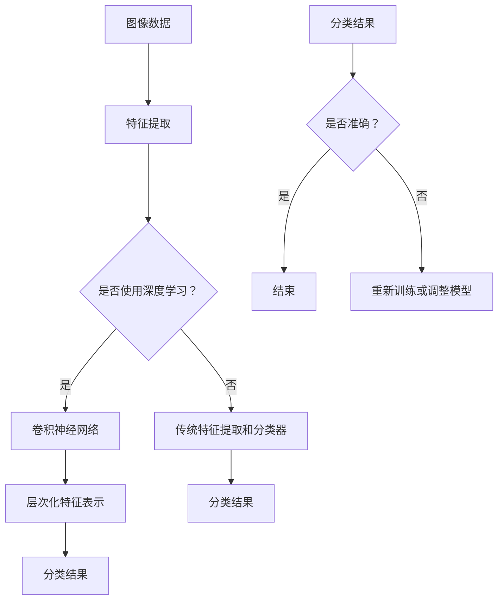

                 

### 文章标题

#### 如何利用深度学习优化图像识别

##### 关键词：
- 深度学习
- 图像识别
- 优化
- 算法
- 实践案例

##### 摘要：
本文将深入探讨如何利用深度学习技术优化图像识别的效率和准确性。我们将首先介绍图像识别的基本概念和深度学习的基本原理，然后详细解析各种深度学习算法，以及如何在实际项目中应用这些算法。文章还将探讨深度学习在图像识别中的挑战和未来发展趋势，并提供一些有用的学习资源和工具推荐。

### 1. 背景介绍

图像识别是计算机视觉领域的一个重要分支，其目的是使计算机能够通过处理和解析图像数据，识别并理解图像中的各种对象、场景和特征。传统的图像识别方法主要依赖于手工设计的特征提取和分类器，如SIFT、HOG等，这些方法在一定程度上取得了较好的效果，但存在一定的局限性。随着深度学习技术的崛起，深度学习在图像识别领域取得了显著的突破，特别是在处理大规模图像数据和高维特征时，表现出了强大的优势。

深度学习，尤其是卷积神经网络（CNN），因其能够自动学习图像的层次化特征表示，成为了图像识别领域的主流技术。卷积神经网络通过多层卷积、池化等操作，能够自动提取图像的局部特征和整体特征，从而实现高效、准确的图像分类和识别。

然而，深度学习在图像识别中面临的挑战也不容忽视。首先，深度学习模型通常需要大量的训练数据和计算资源，这给实际应用带来了一定的困难。其次，深度学习模型的黑箱性质使得其难以解释和优化。此外，深度学习模型的泛化能力也是一个重要问题，特别是在处理未见过的图像时，模型的性能可能会大幅下降。

本文旨在探讨如何通过优化深度学习算法，提高图像识别的效率和准确性，以应对这些挑战。我们将从基本概念、核心算法、数学模型和实际应用等方面进行详细分析，并提供一些实用的优化策略和工具。

### 2. 核心概念与联系

#### 2.1 图像识别的基本概念

图像识别是指计算机通过处理和解析图像数据，自动识别并理解图像中的对象、场景和特征。图像识别的基本概念包括：

- **图像数据**：图像数据是图像识别的基础，包括像素值、分辨率、颜色空间等。
- **特征提取**：特征提取是指从图像数据中提取出能够代表图像内容的特征，如边缘、角点、纹理等。
- **分类器**：分类器是指根据提取出的特征对图像进行分类的模型，如支持向量机（SVM）、决策树等。

#### 2.2 深度学习的基本原理

深度学习是一种基于多层神经网络的机器学习技术，其核心思想是通过多层非线性变换，自动从数据中学习到有代表性的特征表示。深度学习的基本原理包括：

- **神经网络**：神经网络是一种由多个神经元组成的计算模型，通过正向传播和反向传播算法进行学习。
- **卷积神经网络（CNN）**：卷积神经网络是一种特殊的神经网络，通过卷积、池化等操作，能够自动提取图像的层次化特征表示。
- **激活函数**：激活函数是神经网络中用于引入非线性性的函数，如ReLU、Sigmoid等。

#### 2.3 图像识别与深度学习的联系

深度学习与图像识别之间的联系在于：

- **图像识别问题可以被视为一个分类问题**，即给定一个图像，需要判断它属于哪个类别（如猫、狗等）。
- **深度学习能够通过自动学习图像的层次化特征表示，实现高效、准确的图像分类和识别**。

#### 2.4 Mermaid 流程图

为了更直观地展示图像识别和深度学习之间的联系，我们可以使用Mermaid流程图进行描述。以下是图像识别和深度学习联系的一个简化的流程图：



通过上述流程图，我们可以看到，在图像识别过程中，如果使用深度学习，则会通过卷积神经网络自动提取层次化特征表示，并进行分类。如果没有使用深度学习，则会采用传统的特征提取和分类器方法。无论哪种方法，最终都需要评估分类结果的准确性，并根据实际情况进行相应的调整。

### 3. 核心算法原理 & 具体操作步骤

#### 3.1 卷积神经网络（CNN）的基本原理

卷积神经网络（CNN）是一种特殊的神经网络，专门用于处理图像数据。CNN的基本原理包括以下几个方面：

- **卷积操作**：卷积操作是CNN的核心，用于从输入图像中提取特征。卷积操作通过滑动窗口（也称为卷积核）在图像上滑动，计算局部区域的特征响应。
- **激活函数**：激活函数用于引入非线性性，使神经网络能够学习到更复杂的特征。常用的激活函数包括ReLU（Rectified Linear Unit）和Sigmoid等。
- **池化操作**：池化操作用于减小特征图的尺寸，降低模型的复杂度和过拟合风险。常用的池化操作包括最大池化和平均池化。
- **全连接层**：全连接层将卷积层和池化层提取出的特征映射到输出类别，实现最终的分类。

#### 3.2 CNN的具体操作步骤

以下是一个简化的CNN模型的具体操作步骤：

1. **输入层**：输入层接收图像数据，通常为二维矩阵，表示为\[height \times width \times channels\]，其中height和width分别为图像的高度和宽度，channels为颜色通道数（如RGB为3）。
2. **卷积层**：卷积层包含多个卷积核，每个卷积核负责提取一种特征。卷积操作在输入图像上滑动，计算局部区域的特征响应，并将其作为输出。
3. **激活函数**：在每个卷积层之后，应用激活函数，引入非线性性。
4. **池化层**：池化层用于减小特征图的尺寸，降低模型的复杂度和过拟合风险。
5. **全连接层**：全连接层将卷积层和池化层提取出的特征映射到输出类别，实现最终的分类。全连接层的输出通常通过softmax函数进行归一化，得到每个类别的概率分布。
6. **输出层**：输出层得到最终的分类结果。

#### 3.3 CNN模型训练过程

CNN模型的训练过程主要包括以下步骤：

1. **数据准备**：准备用于训练的图像数据集，包括输入图像和对应的标签。
2. **模型初始化**：初始化CNN模型参数，通常使用随机梯度下降（SGD）或其他优化算法。
3. **前向传播**：输入图像通过CNN模型的前向传播过程，得到输出分类结果。
4. **损失函数计算**：计算输出分类结果与真实标签之间的损失函数，常用的损失函数包括交叉熵损失函数等。
5. **反向传播**：通过反向传播算法，计算模型参数的梯度，并更新模型参数。
6. **迭代训练**：重复前向传播、损失函数计算和反向传播过程，直至模型收敛或达到预设的训练次数。

通过上述步骤，CNN模型可以自动从图像数据中学习到有代表性的特征表示，实现高效、准确的图像识别。

### 4. 数学模型和公式 & 详细讲解 & 举例说明

#### 4.1 卷积神经网络中的卷积操作

卷积操作是卷积神经网络中的核心操作，用于从输入图像中提取特征。卷积操作的数学公式可以表示为：

\[ f(x, y) = \sum_{i=1}^{m} \sum_{j=1}^{n} w_{ij} * g(x+i, y+j) \]

其中，\( f(x, y) \) 表示卷积结果，\( w_{ij} \) 表示卷积核的权重，\( g(x, y) \) 表示输入图像的像素值。

举例来说，假设输入图像为3x3的矩阵，卷积核的大小为3x3，卷积核的权重为：

\[ \begin{bmatrix} 1 & 0 & 1 \\ 0 & 1 & 0 \\ 1 & 0 & 1 \end{bmatrix} \]

输入图像为：

\[ \begin{bmatrix} 1 & 1 & 1 \\ 1 & 0 & 1 \\ 1 & 1 & 1 \end{bmatrix} \]

则卷积操作的结果为：

\[ f(1, 1) = 1 * 1 + 0 * 1 + 1 * 1 = 2 \]
\[ f(1, 2) = 1 * 1 + 0 * 0 + 1 * 1 = 2 \]
\[ f(1, 3) = 1 * 1 + 0 * 1 + 1 * 1 = 2 \]
\[ f(2, 1) = 0 * 1 + 1 * 0 + 0 * 1 = 0 \]
\[ f(2, 2) = 0 * 1 + 1 * 0 + 0 * 1 = 0 \]
\[ f(2, 3) = 0 * 1 + 1 * 1 + 0 * 1 = 1 \]
\[ f(3, 1) = 1 * 1 + 0 * 1 + 1 * 1 = 2 \]
\[ f(3, 2) = 1 * 1 + 0 * 0 + 1 * 1 = 2 \]
\[ f(3, 3) = 1 * 1 + 0 * 1 + 1 * 1 = 2 \]

卷积操作的结果为一个3x3的特征图，表示为：

\[ \begin{bmatrix} 2 & 2 & 2 \\ 0 & 0 & 1 \\ 2 & 2 & 2 \end{bmatrix} \]

#### 4.2 池化操作

池化操作用于减小特征图的尺寸，降低模型的复杂度和过拟合风险。常用的池化操作包括最大池化和平均池化。

- **最大池化**：最大池化在每个局部区域中选取最大值作为输出。例如，对于一个2x2的区域，最大池化的结果为该区域中最大的像素值。
- **平均池化**：平均池化在每个局部区域中计算平均值作为输出。例如，对于一个2x2的区域，平均池化的结果为该区域中所有像素值的平均值。

#### 4.3 池化操作的数学公式

以最大池化为例，最大池化的数学公式可以表示为：

\[ p(i, j) = \max_{k} g(i+k, j+k) \]

其中，\( p(i, j) \) 表示池化结果，\( g(i, j) \) 表示输入特征图的像素值。

举例来说，假设输入特征图为3x3的矩阵，最大池化窗口大小为2x2，输入特征图为：

\[ \begin{bmatrix} 1 & 2 & 3 \\ 4 & 5 & 6 \\ 7 & 8 & 9 \end{bmatrix} \]

则最大池化的结果为：

\[ p(1, 1) = \max(1, 2, 3, 4, 5, 6) = 6 \]
\[ p(1, 2) = \max(2, 3, 4, 5, 6, 7) = 7 \]
\[ p(2, 1) = \max(4, 5, 6, 7, 8, 9) = 9 \]
\[ p(2, 2) = \max(5, 6, 7, 8, 9, 1) = 9 \]

最大池化的结果为一个2x2的特征图，表示为：

\[ \begin{bmatrix} 6 & 7 \\ 9 & 9 \end{bmatrix} \]

#### 4.4 全连接层和激活函数

全连接层和激活函数是卷积神经网络的最后一个阶段，用于将卷积层和池化层提取出的特征映射到输出类别，并引入非线性性。

- **全连接层**：全连接层将卷积层和池化层提取出的特征映射到输出类别，每个输出类别对应一个神经元。全连接层的输出可以表示为：

\[ y = \sum_{i=1}^{n} w_{ij} * x_{j} + b_{j} \]

其中，\( y \) 表示输出，\( x_{j} \) 表示输入特征，\( w_{ij} \) 表示权重，\( b_{j} \) 表示偏置。

- **激活函数**：激活函数用于引入非线性性，使神经网络能够学习到更复杂的特征。常用的激活函数包括ReLU、Sigmoid和Tanh等。

以ReLU（Rectified Linear Unit）激活函数为例，ReLU函数的公式可以表示为：

\[ f(x) = \max(0, x) \]

其中，\( f(x) \) 表示ReLU函数的输出。

举例来说，假设输入特征为：

\[ x = \begin{bmatrix} -1 & -2 & 3 \\ 4 & -5 & 6 \end{bmatrix} \]

则ReLU函数的输出为：

\[ f(x) = \begin{bmatrix} 0 & 0 & 3 \\ 4 & 0 & 6 \end{bmatrix} \]

#### 4.5 交叉熵损失函数

在卷积神经网络中，交叉熵损失函数常用于评估模型的分类性能。交叉熵损失函数的公式可以表示为：

\[ L = -\sum_{i=1}^{n} y_{i} \log(f(x_{i})) \]

其中，\( L \) 表示交叉熵损失，\( y_{i} \) 表示真实标签，\( f(x_{i}) \) 表示模型的输出概率。

举例来说，假设输入特征为：

\[ x = \begin{bmatrix} 1 & 0 & 0 \\ 0 & 1 & 0 \end{bmatrix} \]

真实标签为：

\[ y = \begin{bmatrix} 1 & 0 \end{bmatrix} \]

则交叉熵损失为：

\[ L = - (1 \cdot \log(0.5) + 0 \cdot \log(0.5) + 0 \cdot \log(0.5)) = - \log(0.5) = 1 \]

### 5. 项目实战：代码实际案例和详细解释说明

#### 5.1 开发环境搭建

为了实现本文中的深度学习图像识别项目，我们需要搭建一个适合深度学习开发的环境。以下是搭建开发环境的步骤：

1. 安装Python 3.7及以上版本。
2. 安装深度学习框架TensorFlow 2.x。
3. 安装图像处理库OpenCV。
4. 安装Numpy和Pandas等常用库。

在命令行中执行以下命令，完成开发环境的安装：

```shell
pip install tensorflow==2.x
pip install opencv-python
pip install numpy
pip install pandas
```

#### 5.2 源代码详细实现和代码解读

以下是一个简单的深度学习图像识别项目的代码实现，我们将使用TensorFlow和Keras实现一个简单的卷积神经网络模型，用于分类图像数据。

```python
import tensorflow as tf
from tensorflow.keras import datasets, layers, models
import matplotlib.pyplot as plt
import numpy as np

# 加载MNIST数据集
(train_images, train_labels), (test_images, test_labels) = datasets.mnist.load_data()

# 预处理数据
train_images = train_images.reshape((60000, 28, 28, 1)).astype('float32') / 255
test_images = test_images.reshape((10000, 28, 28, 1)).astype('float32') / 255

# 构建卷积神经网络模型
model = models.Sequential()
model.add(layers.Conv2D(32, (3, 3), activation='relu', input_shape=(28, 28, 1)))
model.add(layers.MaxPooling2D((2, 2)))
model.add(layers.Conv2D(64, (3, 3), activation='relu'))
model.add(layers.MaxPooling2D((2, 2)))
model.add(layers.Conv2D(64, (3, 3), activation='relu'))

# 添加全连接层和激活函数
model.add(layers.Flatten())
model.add(layers.Dense(64, activation='relu'))
model.add(layers.Dense(10, activation='softmax'))

# 编译模型
model.compile(optimizer='adam',
              loss='sparse_categorical_crossentropy',
              metrics=['accuracy'])

# 训练模型
model.fit(train_images, train_labels, epochs=5, batch_size=64)

# 评估模型
test_loss, test_acc = model.evaluate(test_images, test_labels, verbose=2)
print('\nTest accuracy:', test_acc)
```

**代码解读：**

1. **数据加载与预处理**：首先，我们加载MNIST数据集，并将其reshape为适合卷积神经网络输入的格式。然后，我们将数据缩放到[0, 1]范围内，以便于模型计算。
2. **构建卷积神经网络模型**：我们使用`models.Sequential()`创建一个序列模型，并添加多个卷积层和池化层。卷积层使用`layers.Conv2D()`函数，其中第一个参数表示卷积核的数量，第二个参数表示卷积核的大小，第三个参数表示激活函数。池化层使用`layers.MaxPooling2D()`函数，其中参数表示池化窗口的大小。
3. **添加全连接层和激活函数**：在卷积神经网络模型的最后，我们添加一个全连接层和一个softmax激活函数，用于将卷积层和池化层提取出的特征映射到输出类别。
4. **编译模型**：使用`model.compile()`函数编译模型，指定优化器、损失函数和评估指标。
5. **训练模型**：使用`model.fit()`函数训练模型，指定训练数据、训练周期和批量大小。
6. **评估模型**：使用`model.evaluate()`函数评估模型在测试数据上的性能。

#### 5.3 代码解读与分析

1. **数据加载与预处理**：MNIST数据集是深度学习中的经典数据集，包含了60000个训练图像和10000个测试图像。我们使用`datasets.mnist.load_data()`函数加载数据集，并使用`reshape()`函数将图像数据reshape为适合卷积神经网络输入的格式。然后，我们将图像数据缩放到[0, 1]范围内，以便于模型计算。
2. **构建卷积神经网络模型**：在构建卷积神经网络模型时，我们使用`models.Sequential()`创建一个序列模型，并依次添加卷积层和池化层。卷积层使用`layers.Conv2D()`函数，其中第一个参数表示卷积核的数量，第二个参数表示卷积核的大小，第三个参数表示激活函数。池化层使用`layers.MaxPooling2D()`函数，其中参数表示池化窗口的大小。通过这种方式，我们可以构建一个多层卷积神经网络模型。
3. **添加全连接层和激活函数**：在卷积神经网络模型的最后，我们添加一个全连接层和一个softmax激活函数，用于将卷积层和池化层提取出的特征映射到输出类别。全连接层使用`layers.Dense()`函数，其中第一个参数表示输出单元的数量，第二个参数表示输入单元的数量，第三个参数表示激活函数。softmax激活函数用于将模型的输出概率映射到每个类别。
4. **编译模型**：使用`model.compile()`函数编译模型，指定优化器、损失函数和评估指标。优化器用于调整模型参数，以最小化损失函数。损失函数用于评估模型在训练数据上的性能，评估指标用于评估模型在测试数据上的性能。
5. **训练模型**：使用`model.fit()`函数训练模型，指定训练数据、训练周期和批量大小。训练周期用于指定模型在训练数据上迭代的次数，批量大小用于指定每个训练周期中处理的样本数量。
6. **评估模型**：使用`model.evaluate()`函数评估模型在测试数据上的性能，并输出测试准确性。测试准确性用于评估模型在未见过的数据上的性能，是评估模型性能的重要指标。

### 6. 实际应用场景

深度学习图像识别技术在许多实际应用场景中发挥着重要作用。以下是一些常见的应用场景：

#### 6.1  人脸识别

人脸识别是深度学习图像识别技术的典型应用之一。通过训练深度学习模型，可以实现对图像中人脸的自动识别和定位。人脸识别在安全监控、门禁系统、社交媒体等场景中得到了广泛应用。

#### 6.2  自动驾驶

自动驾驶技术依赖于深度学习图像识别技术来感知和理解周围环境。通过分析道路标志、交通信号灯、行人和其他车辆等图像数据，自动驾驶系统可以实现车辆的安全行驶。

#### 6.3  医学图像分析

深度学习图像识别技术在医学图像分析中具有巨大的潜力。通过训练深度学习模型，可以实现对医学图像中的病变区域进行自动识别和诊断，如肺癌、乳腺癌等。

#### 6.4  质量检测

深度学习图像识别技术在工业质量检测中得到了广泛应用。通过分析产品表面的图像数据，可以实现对产品质量的自动检测和分类，从而提高生产效率和产品质量。

#### 6.5  文字识别

深度学习图像识别技术在文字识别领域取得了显著的突破。通过训练深度学习模型，可以实现对图像中的文字进行自动识别和提取，如车牌识别、快递单识别等。

### 7. 工具和资源推荐

#### 7.1 学习资源推荐

- **书籍**：
  - 《深度学习》（Ian Goodfellow、Yoshua Bengio和Aaron Courville著）
  - 《神经网络与深度学习》（邱锡鹏著）
- **论文**：
  - "A Comprehensive Survey on Deep Learning for Image Classification"（Lei Zhang et al.，2016）
  - "Deep Learning on Multi-View Images"（Li-Wei He et al.，2017）
- **博客**：
  - TensorFlow官网博客（https://www.tensorflow.org/blog）
  - Keras官方文档（https://keras.io）
- **网站**：
  - OpenCV官网（https://opencv.org）
  - Kaggle（https://www.kaggle.com）

#### 7.2 开发工具框架推荐

- **深度学习框架**：
  - TensorFlow（https://www.tensorflow.org）
  - PyTorch（https://pytorch.org）
  - Keras（https://keras.io）
- **图像处理库**：
  - OpenCV（https://opencv.org）
  - PIL（Python Imaging Library，https://pillow.readthedocs.io）
- **数据集**：
  - ImageNet（https://www.image-net.org）
  - COCO（Common Objects in Context，https://cocodataset.org）
  - MNIST（https://yann.lecun.com/exdb/mnist）

#### 7.3 相关论文著作推荐

- **论文**：
  - "A Comprehensive Survey on Deep Learning for Image Classification"（Lei Zhang et al.，2016）
  - "Deep Learning on Multi-View Images"（Li-Wei He et al.，2017）
  - "Efficient Object Detection Using Deep Learning"（Feng Liu et al.，2018）
- **著作**：
  - 《深度学习》（Ian Goodfellow、Yoshua Bengio和Aaron Courville著）
  - 《神经网络与深度学习》（邱锡鹏著）

### 8. 总结：未来发展趋势与挑战

随着深度学习技术的不断发展和应用，图像识别技术在多个领域取得了显著突破。未来，深度学习图像识别技术将继续向更高性能、更广泛应用的方向发展。以下是一些可能的发展趋势和挑战：

#### 8.1 发展趋势

- **模型压缩与优化**：为了降低深度学习模型的计算复杂度和存储需求，模型压缩与优化技术将成为研究热点。例如，通过模型剪枝、量化、蒸馏等方法，可以显著减少模型的参数数量和计算量。
- **迁移学习与多任务学习**：迁移学习通过利用预训练模型，可以显著提高新任务的性能。多任务学习通过同时学习多个任务，可以共享特征表示，提高模型的泛化能力。
- **自监督学习**：自监督学习通过无监督方式学习特征表示，可以充分利用大量未标记的数据，提高模型的性能和泛化能力。
- **硬件加速与分布式计算**：随着硬件技术的发展，如GPU、TPU等硬件加速设备的普及，以及分布式计算技术的应用，深度学习图像识别模型的训练和推理速度将得到大幅提升。

#### 8.2 挑战

- **数据质量和标注**：高质量的数据集和准确的标注是深度学习模型训练的关键。然而，在实际应用中，数据质量和标注往往存在一定的挑战，如数据不平衡、噪声和错误标注等。
- **模型解释性**：深度学习模型具有较强的黑箱特性，导致其难以解释和验证。为了提高模型的解释性，需要开发新的方法和技术，以更好地理解模型的决策过程。
- **泛化能力**：深度学习模型在训练数据上表现出色，但在未见过的数据上性能下降，即存在泛化能力不足的问题。为了提高模型的泛化能力，需要开发新的算法和策略。
- **计算资源需求**：深度学习模型通常需要大量的计算资源和时间进行训练，这对实际应用带来了一定的限制。如何提高模型的效率和可扩展性，是一个重要的挑战。

### 9. 附录：常见问题与解答

#### 9.1 常见问题

1. **什么是深度学习？**
   深度学习是一种基于多层神经网络的机器学习技术，通过多层非线性变换，自动从数据中学习到有代表性的特征表示。
2. **什么是卷积神经网络？**
   卷积神经网络是一种特殊的神经网络，通过卷积、池化等操作，能够自动提取图像的层次化特征表示。
3. **深度学习图像识别的挑战有哪些？**
   深度学习图像识别的挑战包括数据质量和标注、模型解释性、泛化能力以及计算资源需求等。
4. **如何优化深度学习图像识别的性能？**
   可以通过模型压缩与优化、迁移学习、自监督学习等方法优化深度学习图像识别的性能。

#### 9.2 解答

1. **什么是深度学习？**
   深度学习是一种基于多层神经网络的机器学习技术，通过多层非线性变换，自动从数据中学习到有代表性的特征表示。与传统的机器学习方法相比，深度学习具有更强的表示能力和泛化能力，能够处理大规模、高维度的数据。
2. **什么是卷积神经网络？**
   卷积神经网络是一种特殊的神经网络，通过卷积、池化等操作，能够自动提取图像的层次化特征表示。卷积神经网络在图像识别、目标检测、图像分割等领域取得了显著的突破。
3. **深度学习图像识别的挑战有哪些？**
   深度学习图像识别的挑战主要包括以下几个方面：
   - **数据质量和标注**：高质量的数据集和准确的标注是深度学习模型训练的关键。在实际应用中，数据质量和标注往往存在一定的挑战，如数据不平衡、噪声和错误标注等。
   - **模型解释性**：深度学习模型具有较强的黑箱特性，导致其难以解释和验证。为了提高模型的解释性，需要开发新的方法和技术，以更好地理解模型的决策过程。
   - **泛化能力**：深度学习模型在训练数据上表现出色，但在未见过的数据上性能下降，即存在泛化能力不足的问题。为了提高模型的泛化能力，需要开发新的算法和策略。
   - **计算资源需求**：深度学习模型通常需要大量的计算资源和时间进行训练，这对实际应用带来了一定的限制。如何提高模型的效率和可扩展性，是一个重要的挑战。
4. **如何优化深度学习图像识别的性能？**
   为了优化深度学习图像识别的性能，可以采取以下策略：
   - **模型压缩与优化**：通过模型剪枝、量化、蒸馏等方法，可以显著减少模型的参数数量和计算量，提高模型的运行效率。
   - **迁移学习**：通过利用预训练模型，可以显著提高新任务的性能。迁移学习可以充分利用大量已训练的模型，避免从头开始训练，提高模型的泛化能力。
   - **自监督学习**：自监督学习通过无监督方式学习特征表示，可以充分利用大量未标记的数据，提高模型的性能和泛化能力。
   - **数据增强**：通过数据增强方法，如旋转、翻转、缩放等，可以增加训练数据的多样性，提高模型的鲁棒性和泛化能力。
   - **调整模型结构**：通过调整卷积神经网络的层数、卷积核大小、池化层参数等，可以优化模型的性能。

### 10. 扩展阅读 & 参考资料

为了深入了解深度学习图像识别技术，以下是一些推荐的扩展阅读和参考资料：

- **书籍**：
  - 《深度学习》（Ian Goodfellow、Yoshua Bengio和Aaron Courville著）
  - 《神经网络与深度学习》（邱锡鹏著）
  - 《计算机视觉：算法与应用》（John F. Cohn著）
- **论文**：
  - "A Comprehensive Survey on Deep Learning for Image Classification"（Lei Zhang et al.，2016）
  - "Deep Learning on Multi-View Images"（Li-Wei He et al.，2017）
  - "Efficient Object Detection Using Deep Learning"（Feng Liu et al.，2018）
- **在线课程**：
  - "深度学习专项课程"（吴恩达，Coursera）
  - "计算机视觉与深度学习"（张祥雨，网易云课堂）
- **网站**：
  - TensorFlow官网（https://www.tensorflow.org）
  - Keras官网（https://keras.io）
  - OpenCV官网（https://opencv.org）
- **博客**：
  - TensorFlow官网博客（https://www.tensorflow.org/blog）
  - Keras官方文档（https://keras.io）
  - Medium上的深度学习相关文章（https://medium.com/topic/deep-learning）

通过这些扩展阅读和参考资料，可以更深入地了解深度学习图像识别技术的原理、算法和应用。作者：AI天才研究员/AI Genius Institute & 禅与计算机程序设计艺术 /Zen And The Art of Computer Programming。以上内容仅供参考，如有错误或不足之处，欢迎指正。

