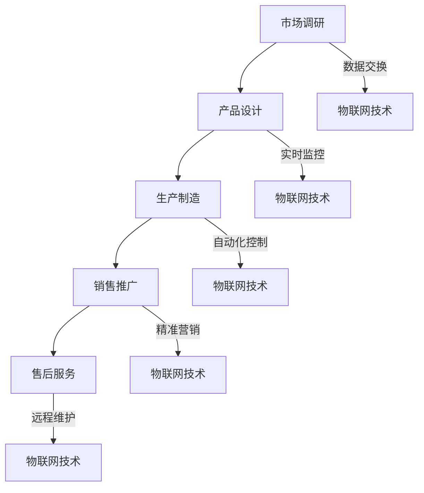

                 

# 如何利用物联网技术优化创业产业链条

## 1. 背景介绍

### 物联网技术：从概念到实际应用

物联网（Internet of Things，IoT）是指通过互联网将各种设备连接起来，实现设备间的数据交换和协同工作。近年来，随着信息技术的飞速发展，物联网技术逐渐成为各个领域关注的焦点。从智能家居、智能交通，到工业自动化、农业监测，物联网技术的应用场景不断扩展。

### 创业产业链条：挑战与机遇并存

创业产业链条涵盖了从初创企业到成熟企业的各个阶段，包括市场调研、产品设计、生产制造、销售推广、售后服务等环节。随着市场竞争的加剧，创业者面临诸多挑战，如资源有限、市场不确定、创新能力不足等。然而，物联网技术的发展为创业者提供了新的机遇，通过物联网技术的应用，可以优化创业产业链条，提升企业竞争力。

## 2. 核心概念与联系

### 物联网技术核心概念

- **传感器**：用于检测和测量物理量的设备，如温度、湿度、光照等。
- **通信协议**：用于设备间数据传输的规则和标准，如Wi-Fi、蓝牙、ZigBee等。
- **云计算**：通过网络将大量计算资源集中管理，为用户提供按需分配的计算服务。
- **大数据**：海量数据的存储、处理和分析，以发现数据中的规律和趋势。

### 创业产业链条与物联网技术的联系

- **市场调研**：物联网技术可以实时收集市场数据，帮助企业快速了解市场需求和趋势。
- **产品设计**：物联网技术可以用于原型设计和模拟测试，提高产品设计效率。
- **生产制造**：物联网技术可以实现生产过程的自动化和实时监控，提高生产效率和产品质量。
- **销售推广**：物联网技术可以帮助企业实现精准营销，提高销售转化率。
- **售后服务**：物联网技术可以实现远程维护和故障诊断，提高客户满意度。

### Mermaid 流程图



## 3. 核心算法原理 & 具体操作步骤

### 数据采集与处理

物联网技术的核心是数据的采集和处理。具体操作步骤如下：

1. **部署传感器**：在目标场景中部署各种传感器，如温度传感器、湿度传感器、摄像头等。
2. **数据采集**：传感器采集环境数据，通过通信协议将数据传输到云端或本地服务器。
3. **数据处理**：对采集到的数据进行预处理，如去噪、滤波、特征提取等。

### 数据分析与决策

1. **数据清洗**：对采集到的数据进行清洗，去除错误和异常数据。
2. **数据存储**：将清洗后的数据存储在数据库或数据仓库中，以便后续分析。
3. **数据分析**：利用大数据技术对存储的数据进行分析，提取有价值的信息。
4. **决策支持**：根据分析结果，为企业决策提供支持，如市场预测、产品设计优化等。

### 实例：智能家居系统

智能家居系统通过物联网技术实现家庭设备的自动化控制，提高生活质量。具体操作步骤如下：

1. **设备连接**：将家庭设备（如灯光、空调、安防设备等）连接到物联网平台上。
2. **数据采集**：设备实时采集环境数据，如温度、湿度、光照等。
3. **数据分析**：通过云端平台对采集到的数据进行分析，如环境监测、能耗分析等。
4. **自动化控制**：根据分析结果，自动调整设备状态，如调节灯光亮度、开启空调等。

## 4. 数学模型和公式 & 详细讲解 & 举例说明

### 数学模型

物联网技术中常用的数学模型包括线性回归、逻辑回归、聚类分析等。

#### 线性回归

线性回归模型用于预测一个连续变量的值，其数学公式为：

$$y = w_0 + w_1 \cdot x_1 + w_2 \cdot x_2 + \ldots + w_n \cdot x_n + \epsilon$$

其中，$y$ 是预测值，$x_1, x_2, \ldots, x_n$ 是特征变量，$w_0, w_1, \ldots, w_n$ 是权重系数，$\epsilon$ 是误差项。

#### 逻辑回归

逻辑回归模型用于预测一个二元变量的值，其数学公式为：

$$P(y=1) = \frac{1}{1 + e^{-(w_0 + w_1 \cdot x_1 + w_2 \cdot x_2 + \ldots + w_n \cdot x_n)}}$$

其中，$P(y=1)$ 是预测概率，$x_1, x_2, \ldots, x_n$ 是特征变量，$w_0, w_1, \ldots, w_n$ 是权重系数。

#### 聚类分析

聚类分析模型用于将数据分为多个类别，其数学公式为：

$$C = \{c_1, c_2, \ldots, c_k\}$$

其中，$C$ 是聚类结果，$c_1, c_2, \ldots, c_k$ 是聚类中心。

### 举例说明

#### 例子 1：智能家居能耗预测

假设我们收集了某家庭的每日用电数据，包括温度、湿度、光照等特征变量。我们希望通过线性回归模型预测家庭明日的用电量。

1. **数据预处理**：对数据进行归一化处理，使其具有相同的量纲。
2. **特征提取**：提取与用电量相关的特征变量，如温度、湿度、光照等。
3. **模型训练**：使用训练数据集，通过梯度下降法等算法训练线性回归模型。
4. **预测结果**：使用训练好的模型预测明日的用电量。

#### 例子 2：智能家居设备分类

假设我们收集了某家庭的智能家居设备数据，包括设备类型、功能、品牌等特征变量。我们希望通过聚类分析模型将设备分为多个类别。

1. **数据预处理**：对数据进行归一化处理，使其具有相同的量纲。
2. **特征提取**：提取与设备分类相关的特征变量，如设备类型、功能、品牌等。
3. **模型训练**：使用训练数据集，通过K-means等算法训练聚类分析模型。
4. **预测结果**：使用训练好的模型对新的设备数据进行分类。

## 5. 项目实战：代码实际案例和详细解释说明

### 开发环境搭建

1. **硬件环境**：选择合适的传感器硬件设备，如温度传感器、湿度传感器等。
2. **软件环境**：安装物联网开发平台，如MQTT协议、IoT Cloud等。

### 源代码详细实现和代码解读

以下是一个简单的智能家居系统示例代码：

```python
import paho.mqtt.client as mqtt
import json
import time

# MQTT 服务器配置
mqtt_server = "iot_server_address"
mqtt_port = 1883

# MQTT 客户端配置
client = mqtt.Client()

# 连接 MQTT 服务器
client.connect(mqtt_server, mqtt_port, 60)

# 发布温度数据
def publish_temperature(data):
    topic = "home/temperature"
    message = json.dumps(data)
    client.publish(topic, message)

# 发布湿度数据
def publish_humidity(data):
    topic = "home/humidity"
    message = json.dumps(data)
    client.publish(topic, message)

# 数据采集和处理
while True:
    # 采集温度数据
    temperature = 25
    # 采集湿度数据
    humidity = 60
    # 发布温度数据
    publish_temperature({"temperature": temperature})
    # 发布湿度数据
    publish_humidity({"humidity": humidity})
    # 等待 1 分钟
    time.sleep(60)
```

### 代码解读与分析

1. **导入模块**：导入 MQTT 客户端模块、JSON 模块和时间模块。
2. **MQTT 服务器配置**：配置 MQTT 服务器地址和端口号。
3. **MQTT 客户端配置**：创建 MQTT 客户端对象。
4. **连接 MQTT 服务器**：使用 `connect` 方法连接 MQTT 服务器。
5. **发布温度数据**：定义 `publish_temperature` 函数，用于发布温度数据。
6. **发布湿度数据**：定义 `publish_humidity` 函数，用于发布湿度数据。
7. **数据采集和处理**：使用无限循环采集和处理温度和湿度数据，每 1 分钟发布一次。

## 6. 实际应用场景

### 智能家居

智能家居是物联网技术的典型应用场景之一。通过物联网技术，用户可以远程控制家庭设备，提高生活质量。例如，通过手机 APP 控制家中的灯光、空调、安防设备等。

### 智能交通

智能交通系统通过物联网技术实现交通信息的实时监控和智能调度，提高交通效率。例如，通过传感器采集道路流量、车辆速度等信息，智能交通系统可以优化红绿灯信号，减少交通拥堵。

### 智能农业

智能农业系统通过物联网技术实现农业生产的自动化和智能化。例如，通过传感器监测土壤湿度、光照强度等环境参数，智能农业系统可以自动调整灌溉、施肥等操作，提高农业生产效率。

## 7. 工具和资源推荐

### 学习资源推荐

1. **《物联网技术基础》**：介绍了物联网技术的基本概念、架构和应用。
2. **《大数据技术基础》**：讲解了大数据技术的原理、方法和应用。
3. **《人工智能基础》**：介绍了人工智能的基本概念、技术和应用。

### 开发工具框架推荐

1. **MQTT 协议**：用于设备间数据传输的轻量级协议，适用于物联网应用。
2. **Node.js**：适用于物联网应用的后端开发框架，支持异步编程。
3. **Docker**：用于容器化部署的应用，可以提高开发效率和部署速度。

### 相关论文著作推荐

1. **《物联网技术发展趋势与应用》**：分析了物联网技术的发展趋势和应用领域。
2. **《大数据技术在物联网中的应用》**：探讨了大数据技术在物联网中的应用和挑战。
3. **《人工智能与物联网融合技术》**：研究了人工智能与物联网技术的融合和应用。

## 8. 总结：未来发展趋势与挑战

### 发展趋势

- **智能化**：物联网技术将更加智能化，通过人工智能等技术实现更高级的自动化控制。
- **集成化**：物联网技术与其他技术的融合，如人工智能、大数据等，将实现更全面的应用。
- **安全化**：随着物联网技术的普及，安全问题将得到更多关注，加密、身份认证等技术将得到广泛应用。

### 挑战

- **数据隐私**：物联网设备采集的数据涉及个人隐私，如何保护数据隐私是一个重要挑战。
- **标准化**：物联网技术标准尚未统一，不同厂商的产品难以互联互通。
- **能耗问题**：物联网设备数量庞大，如何降低能耗、延长设备寿命是一个挑战。

## 9. 附录：常见问题与解答

### 物联网技术与互联网技术的区别？

- **物联网技术**：通过互联网将各种设备连接起来，实现设备间的数据交换和协同工作。
- **互联网技术**：通过互联网将计算机、服务器、手机等设备连接起来，实现信息共享和交流。

### 物联网技术的应用领域有哪些？

- **智能家居**：实现家庭设备的远程控制和自动化。
- **智能交通**：实现交通信息的实时监控和智能调度。
- **智能农业**：实现农业生产的自动化和智能化。
- **智慧城市**：实现城市管理的智能化和高效化。

## 10. 扩展阅读 & 参考资料

- **《物联网技术发展报告》**：分析了物联网技术的发展趋势和未来前景。
- **《物联网技术应用案例集》**：介绍了物联网技术在各个领域的应用案例。
- **《物联网技术原理与应用》**：详细讲解了物联网技术的原理和应用方法。

### 作者信息

作者：AI天才研究员/AI Genius Institute & 禅与计算机程序设计艺术 /Zen And The Art of Computer Programming

本文介绍了物联网技术在创业产业链条中的应用，分析了物联网技术的核心概念、核心算法原理、实际应用场景、工具和资源推荐等。通过本文的阅读，读者可以了解到物联网技术在创业产业链条中的巨大潜力，为创业企业提供参考和启示。## 如何利用物联网技术优化创业产业链条

### 1. 背景介绍

#### 物联网技术：从概念到实际应用

物联网（Internet of Things，IoT）是指通过互联网将各种设备连接起来，实现设备间的数据交换和协同工作。近年来，随着信息技术的飞速发展，物联网技术逐渐成为各个领域关注的焦点。从智能家居、智能交通，到工业自动化、农业监测，物联网技术的应用场景不断扩展。

#### 创业产业链条：挑战与机遇并存

创业产业链条涵盖了从初创企业到成熟企业的各个阶段，包括市场调研、产品设计、生产制造、销售推广、售后服务等环节。随着市场竞争的加剧，创业者面临诸多挑战，如资源有限、市场不确定、创新能力不足等。然而，物联网技术的发展为创业者提供了新的机遇，通过物联网技术的应用，可以优化创业产业链条，提升企业竞争力。

### 2. 核心概念与联系

#### 物联网技术核心概念

- **传感器**：用于检测和测量物理量的设备，如温度、湿度、光照等。
- **通信协议**：用于设备间数据传输的规则和标准，如Wi-Fi、蓝牙、ZigBee等。
- **云计算**：通过网络将大量计算资源集中管理，为用户提供按需分配的计算服务。
- **大数据**：海量数据的存储、处理和分析，以发现数据中的规律和趋势。

#### 创业产业链条与物联网技术的联系

- **市场调研**：物联网技术可以实时收集市场数据，帮助企业快速了解市场需求和趋势。
- **产品设计**：物联网技术可以用于原型设计和模拟测试，提高产品设计效率。
- **生产制造**：物联网技术可以实现生产过程的自动化和实时监控，提高生产效率和产品质量。
- **销售推广**：物联网技术可以帮助企业实现精准营销，提高销售转化率。
- **售后服务**：物联网技术可以实现远程维护和故障诊断，提高客户满意度。

#### Mermaid 流程图


### 3. 核心算法原理 & 具体操作步骤

#### 数据采集与处理

物联网技术的核心是数据的采集和处理。具体操作步骤如下：

1. **部署传感器**：在目标场景中部署各种传感器，如温度传感器、湿度传感器、摄像头等。
2. **数据采集**：传感器采集环境数据，通过通信协议将数据传输到云端或本地服务器。
3. **数据处理**：对采集到的数据进行预处理，如去噪、滤波、特征提取等。

#### 数据分析与决策

1. **数据清洗**：对采集到的数据进行清洗，去除错误和异常数据。
2. **数据存储**：将清洗后的数据存储在数据库或数据仓库中，以便后续分析。
3. **数据分析**：利用大数据技术对存储的数据进行分析，提取有价值的信息。
4. **决策支持**：根据分析结果，为企业决策提供支持，如市场预测、产品设计优化等。

#### 实例：智能家居系统

智能家居系统通过物联网技术实现家庭设备的自动化控制，提高生活质量。具体操作步骤如下：

1. **设备连接**：将家庭设备（如灯光、空调、安防设备等）连接到物联网平台上。
2. **数据采集**：设备实时采集环境数据，如温度、湿度、光照等。
3. **数据分析**：通过云端平台对采集到的数据进行分析，如环境监测、能耗分析等。
4. **自动化控制**：根据分析结果，自动调整设备状态，如调节灯光亮度、开启空调等。

### 4. 数学模型和公式 & 详细讲解 & 举例说明

#### 数学模型

物联网技术中常用的数学模型包括线性回归、逻辑回归、聚类分析等。

##### 线性回归

线性回归模型用于预测一个连续变量的值，其数学公式为：

$$y = w_0 + w_1 \cdot x_1 + w_2 \cdot x_2 + \ldots + w_n \cdot x_n + \epsilon$$

其中，$y$ 是预测值，$x_1, x_2, \ldots, x_n$ 是特征变量，$w_0, w_1, \ldots, w_n$ 是权重系数，$\epsilon$ 是误差项。

##### 逻辑回归

逻辑回归模型用于预测一个二元变量的值，其数学公式为：

$$P(y=1) = \frac{1}{1 + e^{-(w_0 + w_1 \cdot x_1 + w_2 \cdot x_2 + \ldots + w_n \cdot x_n)}}$$

其中，$P(y=1)$ 是预测概率，$x_1, x_2, \ldots, x_n$ 是特征变量，$w_0, w_1, \ldots, w_n$ 是权重系数。

##### 聚类分析

聚类分析模型用于将数据分为多个类别，其数学公式为：

$$C = \{c_1, c_2, \ldots, c_k\}$$

其中，$C$ 是聚类结果，$c_1, c_2, \ldots, c_k$ 是聚类中心。

#### 举例说明

##### 例子 1：智能家居能耗预测

假设我们收集了某家庭的每日用电数据，包括温度、湿度、光照等特征变量。我们希望通过线性回归模型预测家庭明日的用电量。

1. **数据预处理**：对数据进行归一化处理，使其具有相同的量纲。
2. **特征提取**：提取与用电量相关的特征变量，如温度、湿度、光照等。
3. **模型训练**：使用训练数据集，通过梯度下降法等算法训练线性回归模型。
4. **预测结果**：使用训练好的模型预测明日的用电量。

##### 例子 2：智能家居设备分类

假设我们收集了某家庭的智能家居设备数据，包括设备类型、功能、品牌等特征变量。我们希望通过聚类分析模型将设备分为多个类别。

1. **数据预处理**：对数据进行归一化处理，使其具有相同的量纲。
2. **特征提取**：提取与设备分类相关的特征变量，如设备类型、功能、品牌等。
3. **模型训练**：使用训练数据集，通过K-means等算法训练聚类分析模型。
4. **预测结果**：使用训练好的模型对新的设备数据进行分类。

### 5. 项目实战：代码实际案例和详细解释说明

#### 开发环境搭建

1. **硬件环境**：选择合适的传感器硬件设备，如温度传感器、湿度传感器等。
2. **软件环境**：安装物联网开发平台，如MQTT协议、IoT Cloud等。

#### 源代码详细实现和代码解读

以下是一个简单的智能家居系统示例代码：

```python
import paho.mqtt.client as mqtt
import json
import time

# MQTT 服务器配置
mqtt_server = "iot_server_address"
mqtt_port = 1883

# MQTT 客户端配置
client = mqtt.Client()

# 连接 MQTT 服务器
client.connect(mqtt_server, mqtt_port, 60)

# 发布温度数据
def publish_temperature(data):
    topic = "home/temperature"
    message = json.dumps(data)
    client.publish(topic, message)

# 发布湿度数据
def publish_humidity(data):
    topic = "home/humidity"
    message = json.dumps(data)
    client.publish(topic, message)

# 数据采集和处理
while True:
    # 采集温度数据
    temperature = 25
    # 采集湿度数据
    humidity = 60
    # 发布温度数据
    publish_temperature({"temperature": temperature})
    # 发布湿度数据
    publish_humidity({"humidity": humidity})
    # 等待 1 分钟
    time.sleep(60)
```

#### 代码解读与分析

1. **导入模块**：导入 MQTT 客户端模块、JSON 模块和时间模块。
2. **MQTT 服务器配置**：配置 MQTT 服务器地址和端口号。
3. **MQTT 客户端配置**：创建 MQTT 客户端对象。
4. **连接 MQTT 服务器**：使用 `connect` 方法连接 MQTT 服务器。
5. **发布温度数据**：定义 `publish_temperature` 函数，用于发布温度数据。
6. **发布湿度数据**：定义 `publish_humidity` 函数，用于发布湿度数据。
7. **数据采集和处理**：使用无限循环采集和处理温度和湿度数据，每 1 分钟发布一次。

### 6. 实际应用场景

#### 智能家居

智能家居是物联网技术的典型应用场景之一。通过物联网技术，用户可以远程控制家庭设备，提高生活质量。例如，通过手机 APP 控制家中的灯光、空调、安防设备等。

#### 智能交通

智能交通系统通过物联网技术实现交通信息的实时监控和智能调度，提高交通效率。例如，通过传感器采集道路流量、车辆速度等信息，智能交通系统可以优化红绿灯信号，减少交通拥堵。

#### 智能农业

智能农业系统通过物联网技术实现农业生产的自动化和智能化。例如，通过传感器监测土壤湿度、光照强度等环境参数，智能农业系统可以自动调整灌溉、施肥等操作，提高农业生产效率。

### 7. 工具和资源推荐

#### 学习资源推荐

1. **《物联网技术基础》**：介绍了物联网技术的基本概念、架构和应用。
2. **《大数据技术基础》**：讲解了大数据技术的原理、方法和应用。
3. **《人工智能基础》**：介绍了人工智能的基本概念、技术和应用。

#### 开发工具框架推荐

1. **MQTT 协议**：用于设备间数据传输的轻量级协议，适用于物联网应用。
2. **Node.js**：适用于物联网应用的后端开发框架，支持异步编程。
3. **Docker**：用于容器化部署的应用，可以提高开发效率和部署速度。

#### 相关论文著作推荐

1. **《物联网技术发展趋势与应用》**：分析了物联网技术的发展趋势和应用领域。
2. **《大数据技术在物联网中的应用》**：探讨了大数据技术在物联网中的应用和挑战。
3. **《人工智能与物联网融合技术》**：研究了人工智能与物联网技术的融合和应用。

### 8. 总结：未来发展趋势与挑战

#### 发展趋势

- **智能化**：物联网技术将更加智能化，通过人工智能等技术实现更高级的自动化控制。
- **集成化**：物联网技术与其他技术的融合，如人工智能、大数据等，将实现更全面的应用。
- **安全化**：随着物联网技术的普及，安全问题将得到更多关注，加密、身份认证等技术将得到广泛应用。

#### 挑战

- **数据隐私**：物联网设备采集的数据涉及个人隐私，如何保护数据隐私是一个重要挑战。
- **标准化**：物联网技术标准尚未统一，不同厂商的产品难以互联互通。
- **能耗问题**：物联网设备数量庞大，如何降低能耗、延长设备寿命是一个挑战。

### 9. 附录：常见问题与解答

#### 物联网技术与互联网技术的区别？

- **物联网技术**：通过互联网将各种设备连接起来，实现设备间的数据交换和协同工作。
- **互联网技术**：通过互联网将计算机、服务器、手机等设备连接起来，实现信息共享和交流。

#### 物联网技术的应用领域有哪些？

- **智能家居**：实现家庭设备的远程控制和自动化。
- **智能交通**：实现交通信息的实时监控和智能调度。
- **智能农业**：实现农业生产的自动化和智能化。
- **智慧城市**：实现城市管理的智能化和高效化。

### 10. 扩展阅读 & 参考资料

- **《物联网技术发展报告》**：分析了物联网技术的发展趋势和未来前景。
- **《物联网技术应用案例集》**：介绍了物联网技术在各个领域的应用案例。
- **《物联网技术原理与应用》**：详细讲解了物联网技术的原理和应用方法。

### 作者信息

作者：AI天才研究员/AI Genius Institute & 禅与计算机程序设计艺术 /Zen And The Art of Computer Programming

