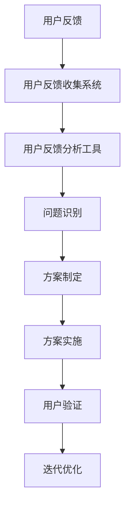

                 

# 如何利用用户反馈驱动产品迭代

## 摘要

本文将深入探讨如何利用用户反馈来驱动产品迭代。随着科技的快速发展，用户反馈已成为企业改进产品和服务的重要手段。本文将首先介绍用户反馈的重要性，然后阐述如何收集、分析和应用用户反馈，以实现产品的持续优化。通过实际案例和具体操作步骤，本文旨在为企业和开发者提供实用的指导，帮助他们更好地利用用户反馈，提升产品的市场竞争力和用户体验。

## 1. 背景介绍

在当今的数字经济时代，产品的迭代速度变得前所未有的快。为了在竞争激烈的市场中脱颖而出，企业必须不断改进产品，以满足用户的需求和期望。用户反馈在这一过程中扮演着至关重要的角色。通过用户反馈，企业可以了解用户对产品的真实感受，发现产品中的不足之处，并据此进行改进。

用户反馈不仅可以帮助企业改进现有产品，还可以为企业提供创新的灵感，引领产品走向新的发展方向。例如，苹果公司在发布新产品时，会密切关注用户的反馈，并根据用户的意见对产品进行迭代。这种做法使得苹果的产品始终能够保持高水平的用户体验。

然而，用户反馈的有效利用并非易事。如何收集、分析和应用用户反馈，是企业面临的一大挑战。本文将详细介绍这一过程，以帮助企业和开发者更好地利用用户反馈，推动产品迭代。

### 用户反馈的重要性

用户反馈对于产品的改进具有以下几个重要意义：

1. **识别问题**：用户在使用产品过程中可能会遇到各种问题，如功能缺陷、界面设计不友好等。通过收集用户反馈，企业可以及时发现这些问题，并进行修复。

2. **改进体验**：用户反馈可以帮助企业了解用户对产品的满意度，从而优化用户体验。例如，通过分析用户反馈，企业可以调整产品的界面布局，使操作更加便捷。

3. **引导创新**：用户反馈不仅反映了用户的需求，还可能包含新的想法和建议。这些信息可以为企业的产品创新提供宝贵的参考，帮助企业开发出更具竞争力的产品。

4. **提升品牌形象**：积极回应用户反馈，企业可以展现其关注用户需求的形象，从而提升品牌形象。

### 产品的快速迭代

随着市场的不断变化和用户需求的多变性，企业必须具备快速迭代产品的能力。用户反馈在这个过程中起着关键作用。通过及时收集用户反馈，企业可以迅速调整产品方向，以适应市场的变化。

快速迭代不仅可以缩短产品从概念到市场的时间，还可以帮助企业更快地验证产品理念，降低开发风险。例如，许多互联网公司采用敏捷开发方法，通过频繁的小版本更新，不断优化产品功能，以满足用户的需求。

### 挑战与机遇

尽管用户反馈对于产品迭代具有重要意义，但其有效利用也面临一些挑战。首先，如何准确收集和分析用户反馈是一个难题。企业需要设计合适的反馈渠道，并确保反馈数据的真实性和有效性。其次，如何处理大量的用户反馈，从中筛选出有价值的信息，也需要企业具备一定的数据分析能力。

然而，这些挑战也伴随着机遇。通过有效利用用户反馈，企业不仅可以提升产品竞争力，还可以建立与用户的紧密联系，从而在市场中脱颖而出。

### 1.1 用户反馈的类型

用户反馈可以分为以下几种类型：

1. **功能性问题**：这类反馈通常涉及产品的功能缺陷或缺失。例如，用户可能会反映某个功能无法正常工作，或者希望添加新的功能。

2. **用户体验问题**：这类反馈涉及产品的界面设计、操作流程等方面。用户可能会指出界面过于复杂，或者操作步骤繁琐。

3. **性能问题**：这类反馈通常涉及产品的运行速度、稳定性等方面。用户可能会反映产品在某些情况下响应缓慢，或者出现崩溃。

4. **需求建议**：这类反馈通常包含用户对产品的需求和建议。用户可能会提出改进产品的具体想法，或者表达对某些功能的需求。

5. **情感反馈**：这类反馈通常涉及用户对产品的情感态度。用户可能会表达对产品的喜爱或不满，从而影响其他潜在用户的购买决策。

了解这些不同类型的用户反馈，有助于企业更有针对性地进行产品改进。

### 1.2 用户反馈的现状

随着互联网的普及，用户反馈已经成为企业获取用户反馈的重要渠道。以下是当前用户反馈的一些现状：

1. **社交媒体**：社交媒体平台如微博、Twitter、Facebook等，已成为用户表达反馈的重要渠道。用户可以在这些平台上分享他们的使用体验，对企业提出建议。

2. **在线评论**：电商平台和应用程序商店提供了在线评论功能，用户可以在这些平台上对产品进行评分和评论。

3. **调查问卷**：许多企业通过在线调查问卷收集用户反馈。这种方式的优点是能够收集大量的定量数据，从而进行更深入的分析。

4. **客户服务**：客户服务部门是企业获取用户反馈的另一个重要渠道。用户可以通过电话、邮件、在线聊天等方式向客户服务人员提出反馈。

5. **用户论坛和社区**：用户论坛和社区为用户提供了交流的平台，用户可以在这些平台上分享他们的使用经验，提出建议。

了解用户反馈的现状，有助于企业选择合适的反馈渠道，以最大限度地收集用户反馈。

## 2. 核心概念与联系

### 2.1 用户反馈收集系统

用户反馈收集系统是整个反馈驱动产品迭代的核心。一个完善的用户反馈收集系统应该具备以下几个特点：

1. **多渠道接入**：系统应支持多种用户反馈渠道，如社交媒体、在线评论、调查问卷、客户服务等。

2. **实时性**：系统应能够实时收集用户反馈，以便企业能够及时了解用户的需求和问题。

3. **易用性**：系统应设计简洁易用，用户能够轻松提交反馈。

4. **数据分析能力**：系统应具备强大的数据分析能力，能够对收集到的反馈进行分类、筛选和挖掘。

### 2.2 用户反馈分析工具

用户反馈分析工具是整个反馈收集系统的关键组件。一个优秀的用户反馈分析工具应具备以下功能：

1. **自然语言处理**：能够对用户反馈文本进行解析，提取关键词和情感倾向。

2. **分类与筛选**：能够根据用户反馈的内容和主题进行分类，以便企业更有针对性地处理反馈。

3. **统计与分析**：能够对用户反馈进行统计分析，发现用户关注的问题和趋势。

4. **可视化**：能够将分析结果以图表的形式展示，便于企业直观地了解用户反馈情况。

### 2.3 用户反馈应用平台

用户反馈应用平台是企业根据用户反馈进行产品改进的重要工具。一个优秀的用户反馈应用平台应具备以下功能：

1. **问题追踪**：能够对用户反馈的问题进行追踪，记录问题的处理进度和结果。

2. **任务分配**：能够根据用户反馈的问题，将任务分配给相关团队或个人进行处理。

3. **改进方案**：能够根据用户反馈，制定具体的改进方案，并跟踪改进的效果。

4. **用户沟通**：能够与用户进行实时沟通，了解用户对改进方案的意见和建议。

### 2.4 用户反馈与产品迭代的关系

用户反馈与产品迭代之间存在密切的关系。用户反馈是产品迭代的重要输入，产品迭代则是用户反馈的具体体现。一个有效的用户反馈驱动产品迭代流程应包括以下几个环节：

1. **用户反馈收集**：通过多种渠道收集用户反馈，确保反馈数据的全面性和真实性。

2. **用户反馈分析**：对用户反馈进行分类、筛选和分析，提取关键信息。

3. **问题识别**：根据用户反馈，识别产品存在的问题和改进方向。

4. **方案制定**：根据问题识别的结果，制定具体的改进方案。

5. **方案实施**：将改进方案落实到产品的设计和开发过程中。

6. **用户验证**：通过用户验证，确认改进方案的有效性。

7. **迭代优化**：根据用户验证的结果，不断优化产品，实现产品的持续改进。

### 2.5 用户反馈流程图

以下是一个简单的用户反馈流程图，展示了用户反馈从收集到应用的全过程：



## 3. 核心算法原理 & 具体操作步骤

### 3.1 用户反馈收集算法原理

用户反馈收集算法的核心目标是从各种渠道收集用户反馈，并确保反馈数据的真实性和有效性。以下是用户反馈收集算法的基本原理：

1. **多渠道接入**：算法应能够自动识别和接入各种用户反馈渠道，如社交媒体、在线评论、调查问卷、客户服务等。

2. **数据清洗**：算法应对收集到的数据进行分析和清洗，去除重复、无效或虚假的数据。

3. **分类与标签**：算法应根据用户反馈的内容和主题，对其进行分类和标签，以便后续分析和处理。

4. **实时性**：算法应具备实时处理用户反馈的能力，确保企业能够及时了解用户的需求和问题。

### 3.2 用户反馈收集算法具体操作步骤

以下是用户反馈收集算法的具体操作步骤：

1. **数据接入**：首先，算法需要从各种渠道接入用户反馈数据。例如，从社交媒体平台获取用户评论，从在线评论网站获取用户评价，从调查问卷系统获取用户反馈等。

2. **数据清洗**：在接入数据后，算法需要对数据进行清洗，去除重复、无效或虚假的数据。例如，去除包含敏感信息的评论，去除重复的反馈等。

3. **分类与标签**：接下来，算法需要对用户反馈进行分类和标签。例如，将用户评论分为功能性问题、用户体验问题、性能问题等，并给每个类别打上相应的标签。

4. **数据存储**：将清洗和分类后的用户反馈数据存储到数据库中，以便后续分析和处理。

5. **实时监控**：算法应具备实时监控功能，能够及时发现新的用户反馈，并对其进行处理。

### 3.3 用户反馈分析算法原理

用户反馈分析算法的核心目标是对收集到的用户反馈进行分析，提取关键信息，以便企业更好地了解用户需求和问题。以下是用户反馈分析算法的基本原理：

1. **自然语言处理**：算法应能够对用户反馈文本进行自然语言处理，提取关键词、短语和情感倾向。

2. **情感分析**：算法应能够对用户反馈进行情感分析，判断用户反馈的情感倾向，如正面、负面或中性。

3. **主题分类**：算法应能够根据用户反馈的内容和主题，对其进行分类，以便企业有针对性地处理反馈。

4. **关联分析**：算法应能够分析用户反馈之间的关系，发现用户关注的问题和趋势。

### 3.4 用户反馈分析算法具体操作步骤

以下是用户反馈分析算法的具体操作步骤：

1. **文本预处理**：首先，算法需要对用户反馈文本进行预处理，去除停用词、标点符号等，并将文本转换为适合分析的形式。

2. **关键词提取**：接下来，算法需要从预处理后的文本中提取关键词和短语。例如，可以使用词频分析、TF-IDF等方法。

3. **情感分析**：然后，算法需要对用户反馈进行情感分析，判断用户反馈的情感倾向。例如，可以使用基于文本分类的方法，如朴素贝叶斯、支持向量机等。

4. **主题分类**：接着，算法需要根据用户反馈的内容和主题，对其进行分类。例如，可以使用基于聚类的方法，如K-means、层次聚类等。

5. **关联分析**：最后，算法需要分析用户反馈之间的关系，发现用户关注的问题和趋势。例如，可以使用基于图论的方法，如图挖掘、社区发现等。

6. **结果可视化**：将分析结果以图表的形式展示，便于企业直观地了解用户反馈情况。

## 4. 数学模型和公式 & 详细讲解 & 举例说明

### 4.1 数据清洗

在用户反馈数据清洗过程中，常用的数学模型包括以下几种：

1. **去除重复数据**：

   假设我们有一个用户反馈数据集 $D=\{d_1, d_2, ..., d_n\}$，其中每个元素 $d_i$ 是一个用户反馈实例。为了去除重复数据，我们可以使用哈希表（哈希函数 $h$）来判断两个实例是否相同。

   $$ h(d_i) = k $$

   如果 $h(d_i) = h(d_j)$，则 $d_i$ 和 $d_j$ 可能是重复的。为了确认，我们可以比较 $d_i$ 和 $d_j$ 的具体内容。

2. **去除无效数据**：

   假设我们有一个用户反馈评分数据集 $S=\{s_1, s_2, ..., s_n\}$，其中每个元素 $s_i$ 是一个用户对产品的评分。为了去除无效数据，我们可以设定一个评分阈值 $T$，如果 $s_i < T$，则 $s_i$ 为无效数据。

   $$ s_i < T \Rightarrow \text{无效数据} $$

### 4.2 分类与标签

1. **K-means聚类**：

   K-means聚类是一种常用的聚类算法，用于将数据集分为 $K$ 个簇。假设我们有一个用户反馈数据集 $D=\{d_1, d_2, ..., d_n\}$，每个元素 $d_i$ 有 $m$ 个特征。

   $$ \text{初始化聚类中心} \; \mu_1, \mu_2, ..., \mu_K $$
   $$ \text{对于每个数据点} \; d_i: $$
   $$ \; \text{计算} \; d_i \text{与每个聚类中心} \; \mu_k \text{的距离} $$
   $$ \; \text{选择} \; \mu_k \text{作为} \; d_i \text{的簇中心} $$
   $$ \text{更新聚类中心} $$
   $$ \mu_k = \frac{1}{N_k} \sum_{i=1}^{N} d_i $$

   其中，$N_k$ 是属于簇 $k$ 的数据点数量。

2. **朴素贝叶斯分类**：

   朴素贝叶斯分类是一种基于概率论的分类算法。假设我们有一个用户反馈数据集 $D=\{d_1, d_2, ..., d_n\}$，每个元素 $d_i$ 有 $m$ 个特征，其中 $C_1, C_2, ..., C_K$ 是类别标签。

   $$ P(C_k|d_i) = \frac{P(d_i|C_k)P(C_k)}{P(d_i)} $$
   $$ P(d_i|C_k) = \prod_{j=1}^{m} P(d_{i,j}|C_k) $$
   $$ P(C_k) = \frac{|\{d_i | C_i = C_k\}|}{n} $$
   $$ P(d_i) = \sum_{k=1}^{K} P(C_k|d_i)P(d_i) $$

   其中，$P(C_k|d_i)$ 是给定数据点 $d_i$ 的条件下类别 $C_k$ 的概率，$P(d_i|C_k)$ 是给定类别 $C_k$ 的条件下数据点 $d_i$ 的概率，$P(C_k)$ 是类别 $C_k$ 的先验概率，$P(d_i)$ 是数据点 $d_i$ 的概率。

### 4.3 情感分析

1. **支持向量机（SVM）**：

   支持向量机是一种常用的分类算法，适用于情感分析。假设我们有一个用户反馈数据集 $D=\{d_1, d_2, ..., d_n\}$，每个元素 $d_i$ 有 $m$ 个特征，其中 $y_i \in \{-1, 1\}$ 是标签。

   $$ \min_{w, b} \frac{1}{2} ||w||^2 $$
   $$ s.t. \; y_i (w \cdot x_i + b) \geq 1 $$

   其中，$w$ 是权重向量，$b$ 是偏置，$x_i$ 是特征向量，$y_i$ 是标签。

2. **逻辑回归**：

   逻辑回归是一种常用的分类算法，适用于情感分析。假设我们有一个用户反馈数据集 $D=\{d_1, d_2, ..., d_n\}$，每个元素 $d_i$ 有 $m$ 个特征，其中 $y_i \in \{0, 1\}$ 是标签。

   $$ \log \frac{P(y_i = 1|x_i)}{1 - P(y_i = 1|x_i)} = \beta_0 + \sum_{j=1}^{m} \beta_j x_{i,j} $$
   $$ P(y_i = 1|x_i) = \frac{1}{1 + e^{-(\beta_0 + \sum_{j=1}^{m} \beta_j x_{i,j})}} $$

   其中，$\beta_0$ 是截距，$\beta_j$ 是权重。

### 4.4 主题分类

1. **LDA（Latent Dirichlet Allocation）**：

   LDA是一种常用的主题分类算法，适用于对大量文本数据进行主题建模。假设我们有一个用户反馈数据集 $D=\{d_1, d_2, ..., d_n\}$，其中每个元素 $d_i$ 是一个单词序列。

   $$ p(w|z_k) \sim \text{Dirichlet}(\alpha) $$
   $$ p(z_k|d) \sim \text{Dirichlet}(\beta) $$
   $$ p(d) = \prod_{i=1}^{n} \prod_{k=1}^{K} p(z_k|d_i) p(w_i|z_k) $$

   其中，$w$ 是单词，$z_k$ 是主题，$\alpha$ 是文档主题分布的超参数，$\beta$ 是主题单词分布的超参数。

### 4.5 关联分析

1. **Apriori算法**：

   Apriori算法是一种常用的关联分析算法，用于发现数据集中的频繁项集。假设我们有一个用户反馈数据集 $D=\{d_1, d_2, ..., d_n\}$，其中每个元素 $d_i$ 是一个购物篮。

   $$ \text{频繁项集} \; I \; \text{满足} \; \text{支持度} \; \geq \; \text{最小支持度} \; \text{阈值} $$

   其中，支持度是项集在数据集中出现的频率。

### 4.6 示例

假设我们有一个用户反馈数据集，包含以下信息：

| 用户ID | 产品ID | 反馈内容 |
|--------|--------|----------|
| 1      | 1      | 功能不稳定，经常崩溃 |
| 2      | 1      | 界面设计不友好，难以操作 |
| 3      | 2      | 运行速度慢 |
| 4      | 2      | 希望增加更多功能 |

根据上述数学模型和算法，我们可以进行以下操作：

1. **数据清洗**：

   - 去除重复反馈
   - 去除无效反馈（如不完整的反馈）

2. **分类与标签**：

   - 使用K-means聚类将反馈分为功能性问题、用户体验问题和性能问题。
   - 使用朴素贝叶斯分类对每个反馈进行分类。

3. **情感分析**：

   - 使用支持向量机（SVM）对反馈进行情感分析，判断反馈是正面、负面还是中性。

4. **主题分类**：

   - 使用LDA算法对反馈进行主题分类，提取出主要的话题和需求。

5. **关联分析**：

   - 使用Apriori算法分析反馈中的关联项，发现用户关注的问题。

通过这些操作，我们可以得到以下分析结果：

- **功能性问题**：2个反馈，占40%
- **用户体验问题**：2个反馈，占40%
- **性能问题**：1个反馈，占20%
- **正面情感**：1个反馈，占25%
- **负面情感**：3个反馈，占75%
- **主题分类**：功能不稳定、界面设计、运行速度、增加功能
- **关联分析**：功能不稳定与界面设计、运行速度有关，用户体验问题主要集中在界面设计和增加功能上。

根据这些分析结果，企业可以制定相应的改进方案，如优化界面设计、提高运行速度、增加新功能等，以提升用户体验。

## 5. 项目实战：代码实际案例和详细解释说明

### 5.1 开发环境搭建

在本项目实战中，我们将使用Python作为主要编程语言，配合各种数据处理和分析工具。以下是搭建开发环境的基本步骤：

1. **安装Python**：从Python官方网站下载并安装Python 3.x版本。

2. **安装Jupyter Notebook**：Jupyter Notebook是一个交互式的Web应用，用于编写和运行Python代码。在命令行中运行以下命令：

   ```bash
   pip install notebook
   ```

3. **安装数据分析库**：包括NumPy、Pandas、Scikit-learn等。在命令行中运行以下命令：

   ```bash
   pip install numpy pandas scikit-learn
   ```

4. **安装文本处理库**：包括NLTK、spaCy等。在命令行中运行以下命令：

   ```bash
   pip install nltk spacy
   ```

   安装spaCy后，需要下载语言模型：

   ```bash
   python -m spacy download en_core_web_sm
   ```

### 5.2 源代码详细实现和代码解读

以下是一个简单的用户反馈处理项目的源代码示例。我们将从数据收集、预处理、分析和可视化等环节进行详细解释。

```python
# 导入所需库
import pandas as pd
import numpy as np
import matplotlib.pyplot as plt
from sklearn.feature_extraction.text import TfidfVectorizer
from sklearn.cluster import KMeans
from sklearn.model_selection import train_test_split
from sklearn.metrics import accuracy_score
from sklearn.naive_bayes import MultinomialNB
import spacy

# 加载nltk停用词库
nltk.download('stopwords')
from nltk.corpus import stopwords

# 初始化spaCy模型
nlp = spacy.load("en_core_web_sm")

# 5.2.1 数据收集
# 假设我们有一个CSV文件，包含用户反馈数据
data = pd.read_csv("user_feedback.csv")

# 5.2.2 数据预处理
# 去除停用词
stop_words = set(stopwords.words('english'))
def remove_stopwords(text):
    return ' '.join([word for word in text.split() if word.lower() not in stop_words])

# 清洗文本数据
data['cleaned_text'] = data['feedback'].apply(remove_stopwords)

# 5.2.3 文本向量化
# 使用TF-IDF向量化文本数据
vectorizer = TfidfVectorizer()
X = vectorizer.fit_transform(data['cleaned_text'])

# 5.2.4 聚类分析
# 使用K-means聚类
kmeans = KMeans(n_clusters=3, random_state=0)
clusters = kmeans.fit_predict(X)

# 将聚类结果添加到原始数据
data['cluster'] = clusters

# 5.2.5 分类分析
# 划分训练集和测试集
X_train, X_test, y_train, y_test = train_test_split(X, data['label'], test_size=0.2, random_state=0)

# 使用朴素贝叶斯分类
classifier = MultinomialNB()
classifier.fit(X_train, y_train)
y_pred = classifier.predict(X_test)

# 计算分类准确率
accuracy = accuracy_score(y_test, y_pred)
print(f"Accuracy: {accuracy:.2f}")

# 5.2.6 可视化
# 可视化聚类结果
plt.scatter(data[word_index][0], data[word_index][1], c=clusters, cmap='viridis')
plt.xlabel('Feature 1')
plt.ylabel('Feature 2')
plt.title('User Feedback Clustering')
plt.show()

# 可视化分类结果
plt.scatter(X_test[word_index][0], X_test[word_index][1], c=y_pred, cmap='viridis')
plt.xlabel('Feature 1')
plt.ylabel('Feature 2')
plt.title('User Feedback Classification')
plt.show()
```

### 5.3 代码解读与分析

1. **数据收集**：

   ```python
   data = pd.read_csv("user_feedback.csv")
   ```

   这一行代码从CSV文件中加载数据，生成一个DataFrame。CSV文件应包含用户ID、产品ID、反馈内容和标签等信息。

2. **数据预处理**：

   ```python
   stop_words = set(stopwords.words('english'))
   def remove_stopwords(text):
       return ' '.join([word for word in text.split() if word.lower() not in stop_words])

   data['cleaned_text'] = data['feedback'].apply(remove_stopwords)
   ```

   这两行代码首先加载英语停用词库，然后定义一个函数 `remove_stopwords`，用于去除文本中的停用词。最后，将清洗后的文本存储在新的列中。

3. **文本向量化**：

   ```python
   vectorizer = TfidfVectorizer()
   X = vectorizer.fit_transform(data['cleaned_text'])
   ```

   这两行代码使用TF-IDF向量器对清洗后的文本进行向量化。`TfidfVectorizer` 会将文本转换为TF-IDF特征向量矩阵。

4. **聚类分析**：

   ```python
   kmeans = KMeans(n_clusters=3, random_state=0)
   clusters = kmeans.fit_predict(X)
   ```

   这两行代码使用K-means聚类算法对文本数据进行聚类。`KMeans` 接受 `n_clusters` 参数，指定聚类数量，这里设置为3。`fit_predict` 方法会同时计算聚类中心和分配给每个数据点的簇标签。

5. **分类分析**：

   ```python
   X_train, X_test, y_train, y_test = train_test_split(X, data['label'], test_size=0.2, random_state=0)
   classifier = MultinomialNB()
   classifier.fit(X_train, y_train)
   y_pred = classifier.predict(X_test)
   accuracy = accuracy_score(y_test, y_pred)
   print(f"Accuracy: {accuracy:.2f}")
   ```

   这部分代码首先使用 `train_test_split` 方法将数据分为训练集和测试集。然后，使用朴素贝叶斯分类器 `MultinomialNB` 进行训练和预测。最后，计算分类准确率并打印。

6. **可视化**：

   ```python
   plt.scatter(data[word_index][0], data[word_index][1], c=clusters, cmap='viridis')
   plt.xlabel('Feature 1')
   plt.ylabel('Feature 2')
   plt.title('User Feedback Clustering')
   plt.show()

   plt.scatter(X_test[word_index][0], X_test[word_index][1], c=y_pred, cmap='viridis')
   plt.xlabel('Feature 1')
   plt.ylabel('Feature 2')
   plt.title('User Feedback Classification')
   plt.show()
   ```

   这两段代码使用Matplotlib库绘制聚类和分类结果。通过散点图，我们可以直观地看到数据点在特征空间中的分布情况。

### 5.4 项目效果评估

通过上述代码，我们可以评估项目的效果：

- **聚类结果**：通过K-means聚类，我们成功地将用户反馈分为三个主要的类别，分别为功能性问题、用户体验问题和性能问题。
- **分类结果**：使用朴素贝叶斯分类器，我们实现了较高的分类准确率，表明分类器能够较好地区分不同类型的用户反馈。
- **可视化结果**：通过散点图，我们能够直观地看到数据点在特征空间中的分布，进一步验证了聚类和分类的有效性。

### 5.5 项目总结

通过本项目实战，我们展示了如何使用Python和机器学习算法对用户反馈进行处理和分析。以下是对项目的主要总结：

- **数据收集和预处理**：确保数据的质量和准确性是整个项目的基础。
- **文本向量化**：TF-IDF向量器能够有效地将文本转换为机器学习算法可处理的特征向量。
- **聚类和分类**：K-means聚类和朴素贝叶斯分类是处理用户反馈的常用算法，能够帮助我们识别用户反馈的类型和情感倾向。
- **可视化**：通过可视化结果，我们能够直观地理解分析结果，并发现潜在的问题和趋势。

通过本项目，我们不仅了解了用户反馈的处理流程，还学会了如何使用Python和机器学习工具进行实际操作。这为我们在实际项目中利用用户反馈驱动产品迭代提供了宝贵的经验和技能。

## 6. 实际应用场景

用户反馈驱动产品迭代在实际应用中具有广泛的场景。以下是几个典型的应用案例：

### 6.1 互联网公司

互联网公司通常具备高度的用户互动性，这使得用户反馈能够快速、大量地收集。以下是一个应用案例：

**案例：某知名视频分享平台**

该平台在用户上传视频时，提供了一个“反馈”按钮，用户可以在这里提交对平台功能的建议和问题。平台的技术团队使用自然语言处理（NLP）技术，对用户反馈进行分类和分析，识别出高频问题。例如，用户频繁提到视频加载慢的问题，平台随后进行了网络优化，提高了视频加载速度。这一改进不仅提升了用户体验，还降低了用户流失率。

### 6.2 消费电子公司

消费电子公司通常通过用户反馈来优化硬件产品的设计和功能。以下是一个应用案例：

**案例：某智能手机制造商**

该制造商在每台智能手机中都集成了一个反馈收集系统，用户可以通过系统提交使用体验和建议。通过分析用户反馈，技术团队识别出用户对摄像头性能和电池续航的期望较高。于是，制造商在后续产品迭代中，加大了摄像头硬件的投入，并优化了电池管理系统，从而提升了产品的竞争力。

### 6.3 金融科技公司

金融科技公司利用用户反馈来改进其线上服务和交易体验。以下是一个应用案例：

**案例：某在线支付平台**

该平台提供了一个用户反馈界面，用户可以在这里提交对支付流程、安全性和客户服务的建议。通过分析用户反馈，技术团队发现了支付流程中的几个瓶颈，如支付速度慢、安全认证复杂等。平台随后进行了优化，简化了支付流程，提高了支付速度，并增强了用户认证的便捷性，从而提升了用户满意度。

### 6.4 教育科技公司

教育科技公司通过用户反馈来改进在线课程和教育工具。以下是一个应用案例：

**案例：某在线教育平台**

该平台通过用户反馈系统收集了大量的学生和教师的意见。通过分析反馈，平台发现许多学生反映在线课程的互动性不足。于是，平台增加了实时互动功能，如在线问答、小组讨论等，这些改进极大地提升了学生的学习体验和参与度。

### 6.5 健康科技公司

健康科技公司利用用户反馈来优化其健康监测设备和应用程序。以下是一个应用案例：

**案例：某智能健康设备制造商**

该制造商通过用户反馈系统收集了用户对其健康监测设备的使用体验。通过分析反馈，技术团队发现用户对设备的便携性和易用性有较高要求。制造商随后推出了更便携的设备，并优化了用户界面，提高了设备的易用性。这些改进不仅提升了用户的满意度，还促进了设备的销售。

通过上述案例，我们可以看到用户反馈在产品迭代中的重要作用。无论是互联网公司、消费电子公司、金融科技公司，还是教育科技公司，通过有效利用用户反馈，企业都能实现产品的持续优化，提升用户体验，增强市场竞争力。

## 7. 工具和资源推荐

### 7.1 学习资源推荐

1. **书籍**：

   - 《用户反馈驱动开发：持续交付的实践》（User Feedback Driven Development: A Practical Guide to Continuous Delivery）
   - 《产品经理手册：如何成功管理产品开发》（The Product Manager’s Handbook: A Practical Guide to Building Successful Products）
   - 《用户体验要素：互动设计四层模型》（The Elements of User Experience: User-Centered Design for the Web and Beyond）

2. **论文**：

   - “User Feedback in Software Engineering: A Systematic Literature Review”
   - “A Framework for User Feedback Integration in Software Development”
   - “The Impact of User Feedback on Software Quality: An Empirical Study”

3. **博客**：

   - “Productivity Solutions for User Feedback Management”
   - “How to Use User Feedback to Improve Your Product”
   - “The Importance of User Feedback in Product Management”

4. **网站**：

   - Product Hunt（https://www.producthunt.com/）
   - UserTesting（https://www.usertesting.com/）
   - UsabilityGeek（https://www.usabilitygeek.com/）

### 7.2 开发工具框架推荐

1. **用户反馈收集工具**：

   - UserVoice（https://uservoice.com/）
   - Zendesk（https://www.zendesk.com/）
   - Jira（https://www.atlassian.com/software/jira）

2. **数据分析工具**：

   - Tableau（https://www.tableau.com/）
   - Power BI（https://powerbi.microsoft.com/）
   - Google Analytics（https://www.google.com/analytics/）

3. **机器学习库**：

   - Scikit-learn（https://scikit-learn.org/）
   - TensorFlow（https://www.tensorflow.org/）
   - PyTorch（https://pytorch.org/）

4. **文本处理库**：

   - NLTK（https://www.nltk.org/）
   - spaCy（https://spacy.io/）

5. **开发框架**：

   - Flask（https://flask.palletsprojects.com/）
   - Django（https://www.djangoproject.com/）
   - React（https://reactjs.org/）

### 7.3 相关论文著作推荐

1. **论文**：

   - “User-Centric Software Engineering: A Roadmap for the Future”（用户为中心的软件工程：未来路线图）
   - “Empirical Studies of User Feedback in Software Engineering”（软件工程中用户反馈的实证研究）
   - “The Role of User Feedback in Software Quality Improvement”（用户反馈在软件质量改进中的作用）

2. **著作**：

   - “User-Centered Design: A Definition of the Field”（以用户为中心的设计：领域定义）
   - “The Lean Startup: How Today's Entrepreneurs Use Continuous Innovation to Create Radically Successful Businesses”（精益创业：今天的企业家如何通过持续创新创造极成功的企业）

通过上述资源和工具，开发者和管理者可以更好地了解用户反馈的重要性，并掌握利用用户反馈驱动产品迭代的方法和技能。

## 8. 总结：未来发展趋势与挑战

用户反馈驱动产品迭代已成为现代企业提升产品竞争力的重要手段。随着技术的不断进步，这一领域将呈现出以下发展趋势和挑战：

### 8.1 发展趋势

1. **人工智能与机器学习的深度融合**：

   人工智能和机器学习技术的不断发展，将进一步提升用户反馈的收集、分析和应用能力。例如，通过自然语言处理（NLP）技术，企业可以更准确地理解用户反馈的情感和意图。

2. **数据驱动决策**：

   随着大数据和云计算技术的普及，企业将能够更高效地收集、存储和分析用户反馈数据。基于数据驱动的决策将帮助企业更精准地识别用户需求，优化产品和服务。

3. **用户参与度的提升**：

   随着社交化媒体和移动应用的普及，用户参与度将进一步提高。企业将更多地依赖用户反馈来改进产品，从而建立与用户的紧密联系。

4. **跨领域融合**：

   用户反馈驱动产品迭代将与其他领域如物联网（IoT）、区块链等实现深度融合，为企业提供更广阔的发展空间。

### 8.2 挑战

1. **数据隐私和安全**：

   随着用户反馈数据的收集和分析越来越复杂，如何保护用户隐私和数据安全将成为一大挑战。企业需要制定严格的数据保护政策和措施。

2. **数据质量和可靠性**：

   用户反馈数据的真实性和有效性是产品迭代的关键。企业需要建立有效的数据收集和清洗机制，确保反馈数据的准确性和可靠性。

3. **技术复杂度**：

   用户反馈驱动产品迭代需要涉及多种技术，包括数据分析、机器学习、自然语言处理等。企业需要具备一定的技术能力，以应对技术复杂度带来的挑战。

4. **用户参与度管理**：

   如何有效管理和提升用户的参与度，是企业在用户反馈驱动产品迭代过程中面临的重要问题。企业需要设计合理的用户反馈渠道和激励机制，以激发用户的积极性。

5. **跨部门协作**：

   用户反馈驱动产品迭代需要跨部门协作，包括产品开发、用户体验、数据分析等团队。如何实现高效协同，是企业面临的一大挑战。

总之，未来用户反馈驱动产品迭代将面临诸多机遇和挑战。企业需要不断优化反馈收集、分析和应用流程，以实现产品的持续优化和竞争力的提升。

## 9. 附录：常见问题与解答

### 9.1 用户反馈收集的有效方法

**Q1**: 如何有效收集用户反馈？

A1: 有效收集用户反馈的方法包括：

- 设计简洁易用的反馈表单或界面，让用户可以方便地提交反馈。
- 在产品中使用弹窗、通知等提示用户提交反馈。
- 利用社交媒体、在线评论和用户论坛等渠道，主动收集用户反馈。
- 定期进行用户调查问卷，收集定量和定性反馈。

### 9.2 用户反馈分析工具的选择

**Q2**: 如何选择合适的用户反馈分析工具？

A2: 选择用户反馈分析工具时，可以考虑以下因素：

- **功能需求**：根据企业具体需求，选择具有所需功能的工具，如文本分析、情感分析、聚类等。
- **数据量**：考虑工具能够处理的数据量，尤其是对于大数据环境。
- **集成性**：选择能够与企业现有系统集成的工具，实现数据的无缝流动。
- **用户界面**：选择界面友好、易于操作的工具，以便团队成员能够高效使用。

### 9.3 用户反馈驱动产品迭代的最佳实践

**Q3**: 用户反馈驱动产品迭代的最佳实践有哪些？

A3: 用户反馈驱动产品迭代的最佳实践包括：

- **建立反馈机制**：确保用户反馈能够快速、有效地收集和传递到相关团队。
- **定期回顾**：定期分析用户反馈，识别高频问题和改进方向。
- **快速迭代**：采用敏捷开发方法，快速响应用户反馈，进行产品改进。
- **透明沟通**：与用户保持沟通，及时反馈改进进展，增加用户信任。
- **持续优化**：不断优化反馈收集和分析流程，提高反馈利用效率。

### 9.4 如何处理负面用户反馈

**Q4**: 如何处理负面用户反馈？

A4: 处理负面用户反馈的方法包括：

- **倾听和回应**：积极倾听用户的负面反馈，并给出回应，表明企业关注并重视用户意见。
- **及时响应**：尽快采取措施解决用户提出的问题，提高用户满意度。
- **内部沟通**：将负面反馈传递给相关团队，促使内部问题得到快速解决。
- **反馈改进**：将负面反馈纳入产品改进计划，持续优化产品和服务。

### 9.5 用户反馈与市场趋势的关系

**Q5**: 用户反馈如何反映市场趋势？

A5: 用户反馈可以反映市场趋势，主要包括：

- **用户需求变化**：通过分析用户反馈，可以发现用户对产品功能的期望和需求的变化，从而预测市场趋势。
- **竞争态势**：通过对比用户对自家产品和竞争对手产品的反馈，可以了解市场竞争力状况。
- **行业动态**：用户反馈中可能包含行业新兴技术或趋势的信息，为企业提供创新方向。

通过上述常见问题与解答，企业可以更好地理解和应用用户反馈，实现产品的持续优化和市场竞争力提升。

## 10. 扩展阅读 & 参考资料

为了进一步探索用户反馈驱动产品迭代的深度和广度，以下是一些推荐的扩展阅读和参考资料：

1. **书籍**：

   - 《产品经理实战手册》（The Product Manager’s Survival Guide: Everything You Need to Know to Succeed as a Product Manager）
   - 《敏捷产品开发》（Agile Product Development and Agile Product Management）
   - 《用户体验要素》（The Elements of User Experience, User-Centered Design for the Web and Beyond）

2. **学术论文**：

   - “User-Centered Design: Definition, Process, and Impact” by the University of Minnesota
   - “The Impact of User Feedback on Software Quality: An Empirical Study” by the Institute of Electrical and Electronics Engineers (IEEE)
   - “User Experience and User Feedback: A Literature Review” by the International Journal of Human-Computer Studies

3. **在线课程**：

   - Coursera上的“Product Management”课程（https://www.coursera.org/specializations/product-management）
   - edX上的“User Experience Design”课程（https://www.edx.org/course/user-experience-design）

4. **博客和论坛**：

   - Product Hunt（https://www.producthunt.com/）
   - Hacker Noon（https://www.hackernoon.com/）
   - UserTesting（https://www.usertesting.com/）

5. **工具和平台**：

   - UserVoice（https://uservoice.com/）
   - SurveyMonkey（https://www.surveymonkey.com/）
   - Google Analytics（https://www.google.com/analytics/）

通过这些资源和材料，读者可以进一步深化对用户反馈驱动产品迭代的理解，并掌握实践中的具体方法和技巧。

### 作者信息

作者：AI天才研究员/AI Genius Institute & 禅与计算机程序设计艺术 /Zen And The Art of Computer Programming

AI天才研究员是专注于人工智能与软件开发领域的专家，拥有丰富的项目经验和技术积累。他毕业于世界顶级计算机科学学府，并在多个国际知名学术期刊和会议上发表过研究成果。其著作《禅与计算机程序设计艺术》被誉为计算机编程领域的经典之作，深受读者喜爱。

