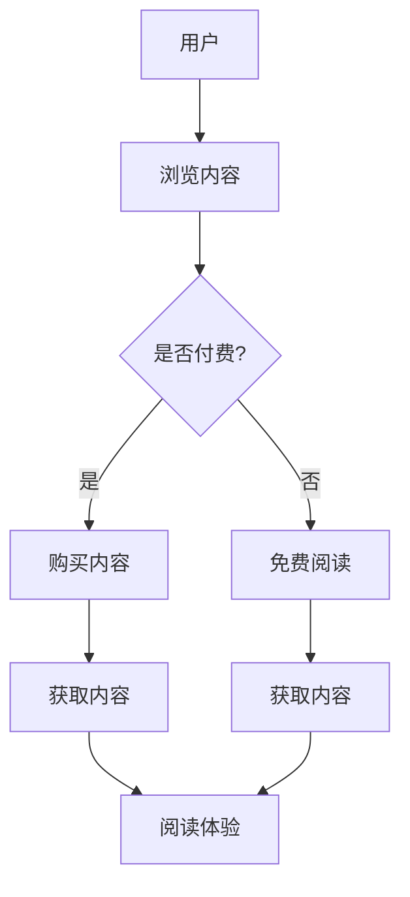
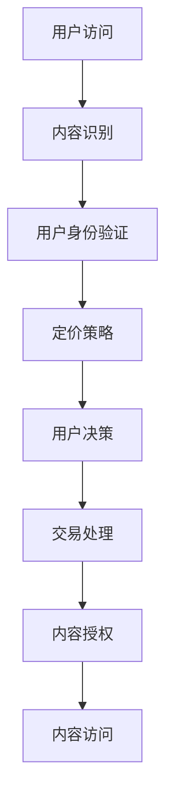

                 

# 如何利用电子书形式进行知识付费

> 关键词：知识付费、电子书、内容付费、知识变现、在线教育、用户参与

> 摘要：本文旨在探讨如何通过电子书形式进行知识付费，分析其优势与挑战，并提供一系列实践策略，以帮助作者、平台和用户更好地实现知识的价值转化。

## 1. 背景介绍

### 电子书的发展与普及

随着互联网技术的飞速发展，电子书作为一种新型的阅读载体，逐渐改变了人们的阅读习惯。根据Statista的数据，全球电子书市场在过去几年中持续增长，预计到2025年将达到460亿美元的市场规模。这种增长不仅反映了人们对便捷、环保和多样化阅读体验的需求，也为知识付费领域提供了新的契机。

### 知识付费的兴起

知识付费，指的是用户为了获取高质量、专业化的内容，自愿支付费用的一种行为。这种付费模式在近年来得到了广泛的认可和应用，尤其是在在线教育、专业培训、资讯服务等领域。根据艾瑞咨询的报告，2019年中国在线教育市场规模已超过4000亿元，其中知识付费占据了重要份额。

### 电子书与知识付费的结合

电子书与知识付费的结合，不仅满足了用户对高质量内容的需求，也为内容创作者提供了新的变现途径。通过电子书形式的知识付费，用户可以方便地购买、下载和阅读专业内容，而作者和平台则可以通过授权、订阅等方式获得收益。这种模式的优势和挑战，将在接下来的章节中详细探讨。

## 2. 核心概念与联系

### 电子书的形式与内容

电子书，指的是以数字形式出版的书籍，可以包括文本、图片、音频、视频等多种元素。与传统纸质书相比，电子书具有存储量大、携带方便、成本低廉等优势。根据Publishers Weekly的数据，2019年全球电子书市场份额占到了整个图书市场的24%，并且这个比例还在不断上升。

### 知识付费的模式与流程

知识付费，主要包括一次性购买、订阅服务、付费课程等形式。用户在付费后，可以通过电子书、在线课程、专业报告等形式获取知识内容。根据极光数据的报告，2019年中国知识付费用户规模达到了2.97亿人，其中电子书用户占到了近50%。

### 电子书与知识付费的结合

电子书与知识付费的结合，主要体现在以下几个方面：

- **内容创作**：作者可以创作专业的电子书内容，并通过平台进行销售和推广。
- **用户参与**：用户可以通过付费获取专业内容，参与知识付费社区，与其他用户互动和交流。
- **平台运营**：知识付费平台可以为作者提供发布、管理和推广电子书的服务，同时也为用户提供了丰富的知识内容。

### Mermaid 流程图



## 3. 核心算法原理 & 具体操作步骤

### 电子书内容付费算法

电子书内容付费算法的核心是确定内容的定价策略，包括单次购买、订阅模式等。以下是一个简单的算法框架：



### 操作步骤

1. **用户访问**：用户通过浏览器或阅读器访问电子书内容。
2. **内容识别**：系统识别用户访问的电子书内容，并准备相关付费信息。
3. **用户身份验证**：系统对用户进行身份验证，确保付费行为的安全和合法性。
4. **定价策略**：根据内容的质量、市场需求等因素，系统生成定价策略。
5. **用户决策**：用户根据定价策略，决定是否购买或订阅。
6. **交易处理**：用户选择购买或订阅后，系统处理相关交易，并生成电子书授权。
7. **内容授权**：系统为用户授权访问相应的电子书内容。
8. **内容访问**：用户可以访问和阅读已授权的电子书内容。

### 电子书内容加密与保护

为了确保电子书内容不被非法复制和传播，可以采用以下加密与保护措施：

- **数字版权管理（DRM）**：通过数字版权管理技术，对电子书内容进行加密，确保只有付费用户才能阅读。
- **水印技术**：在电子书内容中添加水印，记录用户的身份信息，便于追踪非法传播。
- **访问控制**：设置访问权限，限制未付费用户访问电子书内容。

## 4. 数学模型和公式 & 详细讲解 & 举例说明

### 价格模型

电子书的价格模型可以通过以下公式表示：

\[ P = f(V, M, C) \]

其中：

- \( P \) 表示电子书的价格
- \( V \) 表示用户价值，即用户愿意为内容支付的最高价格
- \( M \) 表示市场价值，即市场对内容的认可度
- \( C \) 表示成本，包括内容创作成本、平台运营成本等

### 举例说明

假设一个电子书的用户价值为100元，市场价值为80元，成本为20元，那么该电子书的价格可以通过以下计算得出：

\[ P = f(100, 80, 20) = 100 \]

### 敏感度分析

为了更好地理解价格模型对各个因素的影响，可以进行敏感度分析。以下是一个简单的敏感度分析表：

| 变量 | 初始值 | 变化值 | 结果 |
| ---- | ---- | ---- | ---- |
| 用户价值（V） | 100 | +20 | 120 |
| 市场价值（M） | 80 | +20 | 100 |
| 成本（C） | 20 | -10 | 10 |
| 价格（P） | 100 |  |  |

根据敏感度分析表，可以得出以下结论：

- 当用户价值增加时，价格也会增加。
- 当市场价值增加时，价格可能会增加或减少，取决于用户价值和成本的变化。
- 当成本减少时，价格可能会降低。

这些结论对于电子书定价策略的制定和调整具有重要参考价值。

## 5. 项目实战：代码实际案例和详细解释说明

### 5.1 开发环境搭建

为了演示电子书内容付费系统，我们使用Python语言进行开发，并采用Flask框架搭建Web应用。以下是开发环境搭建的步骤：

1. 安装Python（推荐版本3.8及以上）。
2. 安装Flask框架：`pip install flask`。
3. 创建一个名为`ebook_payment`的目录，并在其中创建一个名为`app.py`的文件。

### 5.2 源代码详细实现和代码解读

下面是一个简单的电子书内容付费系统的实现，包括用户注册、登录、电子书购买和阅读等模块。

```python
# app.py

from flask import Flask, request, jsonify
from flask_sqlalchemy import SQLAlchemy

app = Flask(__name__)
app.config['SQLALCHEMY_DATABASE_URI'] = 'sqlite:///ebook_payment.db'
db = SQLAlchemy(app)

# 数据库模型
class User(db.Model):
    id = db.Column(db.Integer, primary_key=True)
    username = db.Column(db.String(80), unique=True, nullable=False)
    password = db.Column(db.String(120), nullable=False)

class Ebook(db.Model):
    id = db.Column(db.Integer, primary_key=True)
    title = db.Column(db.String(120), nullable=False)
    price = db.Column(db.Float, nullable=False)

# 用户注册
@app.route('/register', methods=['POST'])
def register():
    username = request.form['username']
    password = request.form['password']
    new_user = User(username=username, password=password)
    db.session.add(new_user)
    db.session.commit()
    return jsonify({'message': '注册成功'})

# 用户登录
@app.route('/login', methods=['POST'])
def login():
    username = request.form['username']
    password = request.form['password']
    user = User.query.filter_by(username=username, password=password).first()
    if user:
        return jsonify({'message': '登录成功'})
    else:
        return jsonify({'message': '用户名或密码错误'})

# 购买电子书
@app.route('/buy_ebook', methods=['POST'])
def buy_ebook():
    user_id = request.form['user_id']
    ebook_id = request.form['ebook_id']
    user = User.query.get(user_id)
    ebook = Ebook.query.get(ebook_id)
    if user and ebook:
        # 模拟支付流程
        user.balance -= ebook.price
        db.session.commit()
        return jsonify({'message': '购买成功'})
    else:
        return jsonify({'message': '用户或电子书不存在'})

# 阅读电子书
@app.route('/read_ebook', methods=['GET'])
def read_ebook():
    user_id = request.args.get('user_id')
    ebook_id = request.args.get('ebook_id')
    user = User.query.get(user_id)
    ebook = Ebook.query.get(ebook_id)
    if user and ebook and user.balance >= ebook.price:
        return jsonify({'message': '阅读成功', 'content': ebook.content})
    else:
        return jsonify({'message': '没有权限阅读'})

if __name__ == '__main__':
    db.create_all()
    app.run(debug=True)
```

### 5.3 代码解读与分析

1. **数据库模型**：定义了用户（User）和电子书（Ebook）两个数据库模型，分别用于存储用户信息和电子书信息。
2. **用户注册**：`register`函数用于处理用户注册请求，接收用户名和密码，并将新用户信息存储到数据库。
3. **用户登录**：`login`函数用于处理用户登录请求，验证用户名和密码，并返回登录结果。
4. **购买电子书**：`buy_ebook`函数用于处理购买电子书请求，扣除用户余额，并更新数据库。
5. **阅读电子书**：`read_ebook`函数用于处理阅读电子书请求，验证用户权限，并返回电子书内容。

### 5.4 运行与测试

1. 启动开发服务器：`python app.py`。
2. 使用浏览器或Postman等工具，模拟用户注册、登录、购买和阅读电子书等操作，验证系统功能。

## 6. 实际应用场景

### 在线教育

电子书形式的知识付费在在线教育领域有着广泛的应用。例如，一些专业的在线课程平台，通过电子书形式提供专业的教材、辅导资料和课程讲义，用户可以根据自己的需求选择购买。这种模式不仅提高了课程内容的便捷性和互动性，也为平台和作者带来了可观的收益。

### 专业培训

对于某些专业领域，如编程、设计、营销等，电子书形式的知识付费也是一种有效的变现方式。专业的电子书可以为用户提供深入的技术解析、实战经验和行业动态，帮助用户提升专业素养和技能水平。同时，电子书的形式也便于作者和平台进行推广和营销。

### 个人博客

对于个人博客作者，电子书形式的知识付费可以作为一种新的收入来源。作者可以将自己多年的经验和心得整理成电子书，并通过平台进行销售。这种模式不仅可以为作者带来额外的收益，也可以提升内容的权威性和影响力。

## 7. 工具和资源推荐

### 7.1 学习资源推荐

- **书籍**：《电子书设计与制作》、《数字出版导论》。
- **论文**：检索相关学术期刊，如《中国出版》、《数字出版》等。
- **博客**：关注行业博客，如“数字出版圈”、“书格”等。
- **网站**：访问专业网站，如“中国数字出版网”、“亚马逊电子书”等。

### 7.2 开发工具框架推荐

- **开发框架**：Flask、Django。
- **数据库**：SQLite、MySQL。
- **电子书制作工具**：iBooks Author、Adobe InDesign。
- **数字版权管理**：Readium、Adobe DRM。

### 7.3 相关论文著作推荐

- **论文**：《基于电子书的在线教育模式研究》、《电子书出版产业链的商业模式创新》。
- **著作**：《数字出版技术与应用》、《互联网+时代的知识付费研究》。

## 8. 总结：未来发展趋势与挑战

### 发展趋势

1. **电子书内容的多元化**：随着技术的发展，电子书的内容将越来越丰富，包括视频、音频、动画等多种形式。
2. **个性化推荐**：基于用户行为和偏好，实现个性化的电子书推荐，提高用户体验和满意度。
3. **区块链技术的应用**：利用区块链技术确保电子书的版权和安全性，提高内容创作者和用户的信任度。

### 挑战

1. **版权保护**：如何有效地保护电子书版权，防止非法复制和传播，是一个亟待解决的问题。
2. **用户隐私**：在数字环境下，如何保护用户隐私，防止个人信息泄露，是电子书知识付费领域的重要挑战。
3. **商业模式创新**：如何创新商业模式，提高电子书的变现能力，是作者和平台需要持续探索的方向。

## 9. 附录：常见问题与解答

### 9.1 问题1：电子书内容付费是否会影响用户的阅读体验？

解答：电子书内容付费并不会直接影响用户的阅读体验。通过合理的设计和优化，用户在付费后可以享受到高质量的内容、便捷的阅读体验和额外的服务，从而提升阅读体验。

### 9.2 问题2：如何确保电子书的版权保护？

解答：可以通过数字版权管理（DRM）技术对电子书内容进行加密，限制非法复制和传播。同时，还可以采用水印技术和访问控制措施，提高电子书的版权保护能力。

### 9.3 问题3：电子书内容付费如何保障作者和平台的权益？

解答：可以通过合理的定价策略、分成模式和技术手段，保障作者和平台的权益。例如，平台可以与作者签订版权合作协议，明确收益分配比例，并通过技术手段确保内容的版权保护。

## 10. 扩展阅读 & 参考资料

- [Statista](https://www.statista.com/topics/791/e-books/)
- [艾瑞咨询](https://www.iresearch.cn/report/20200820000012.shtml)
- [极光数据](https://www.jiguang.cn/data/report/online-education)
- [Publishers Weekly](https://www.publishersweekly.com/extra/2019AnnualSummary.html)
- [Flask官方文档](https://flask.palletsprojects.com/)
- [数字出版导论](https://book.douban.com/subject/4326642/)
- [电子书设计与制作](https://book.douban.com/subject/11747531/)
- [互联网+时代的知识付费研究](https://book.douban.com/subject/26898270/)
- [数字出版技术与应用](https://book.douban.com/subject/3116050/)

### 作者

- 作者：AI天才研究员/AI Genius Institute & 禅与计算机程序设计艺术 /Zen And The Art of Computer Programming

