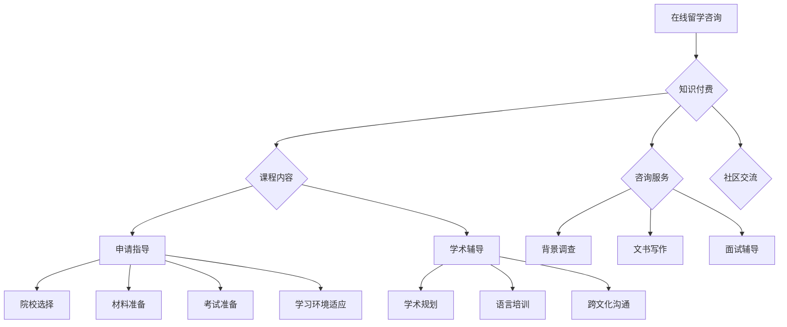

                 

### 背景介绍

在现代教育体系中，留学已经成为越来越多家庭关注的话题。对于有意愿出国留学的学生和家长而言，如何选择合适的留学目的地、专业和院校，如何准备申请材料、标准化考试成绩，以及如何适应海外学习和生活环境，都是面临的重要挑战。传统的留学咨询服务由于存在地域和时间的限制，难以满足个性化需求，且成本较高。因此，在线留学咨询与申请服务的出现，为行业带来了新的发展方向。

知识付费作为一种新兴的商业模式，近年来在全球范围内迅速崛起。它通过将知识、技能和经验转化为有价值的商品或服务，在互联网平台上进行交易，实现了知识的共享和传播。知识付费在在线教育、职业培训等领域取得了显著的成功，但如何将其应用到在线留学咨询与申请服务中，仍需深入探讨。

本文旨在探讨如何利用知识付费实现在线留学咨询与申请服务，从而解决传统留学咨询的痛点，提升服务的质量和效率。本文将分为以下几个部分：

1. **核心概念与联系**：介绍在线留学咨询与知识付费的相关核心概念，并使用Mermaid流程图展示其关系。
2. **核心算法原理 & 具体操作步骤**：分析在线留学咨询服务的算法原理，并详细描述实现步骤。
3. **数学模型和公式 & 详细讲解 & 举例说明**：介绍支撑在线留学咨询服务的关键数学模型和公式，并通过实际案例进行讲解。
4. **项目实战：代码实际案例和详细解释说明**：提供具体代码实现案例，并对关键代码进行详细解读。
5. **实际应用场景**：探讨在线留学咨询服务在各类场景中的应用。
6. **工具和资源推荐**：推荐学习资源和开发工具框架。
7. **总结：未来发展趋势与挑战**：总结文章内容，并讨论未来发展趋势和面临的挑战。

通过以上分析，本文希望为读者提供一份全面而深入的在线留学咨询与知识付费服务指南。

#### 2. 核心概念与联系

在线留学咨询与知识付费作为两个新兴领域，各自有着独特的核心概念。为了更好地理解二者之间的关系，我们可以通过Mermaid流程图来展示它们的主要联系。

首先，让我们定义一些核心概念：

- **在线留学咨询**：指通过互联网平台提供留学咨询、申请指导、学术辅导等服务。其核心目标是帮助用户了解海外教育体系，制定留学计划，提高申请成功率。
- **知识付费**：指用户通过支付一定费用获取专业知识和技能，常见形式包括课程、讲座、咨询服务等。

接下来，我们使用Mermaid流程图来展示这两个概念之间的联系：



**图 1：在线留学咨询与知识付费的Mermaid流程图**

通过这个流程图，我们可以清晰地看到：

- **知识付费** 是在线留学咨询的基础，其提供的内容和形式涵盖了申请指导、学术辅导、背景调查、文书写作、面试辅导等多个方面。
- **申请指导** 和 **学术辅导** 是知识付费在留学咨询服务中的核心应用，帮助用户提高申请成功率并顺利适应海外学习。
- **背景调查**、**文书写作** 和 **面试辅导** 等服务通过知识付费的形式，实现了个性化、专业化的咨询。

通过这个流程图，我们可以更直观地理解在线留学咨询与知识付费之间的关系，并为进一步探讨其实现方法奠定基础。

#### 3. 核心算法原理 & 具体操作步骤

在线留学咨询与知识付费服务的核心在于如何高效地匹配用户需求与服务内容，从而提供个性化、专业化的咨询服务。这里，我们介绍几个关键算法原理和具体操作步骤。

**3.1 用户需求分析算法**

**原理**：用户需求分析算法通过分析用户提交的信息，包括学习目标、专业偏好、背景条件等，提取关键需求特征，为后续服务匹配提供基础。

**具体操作步骤**：

1. **数据收集**：从用户注册表单、在线问卷、历史申请记录等渠道收集用户信息。
2. **信息预处理**：清洗和标准化收集到的数据，去除无效信息，保证数据质量。
3. **特征提取**：利用自然语言处理（NLP）技术，从用户文本中提取关键词和主题，构建用户需求特征向量。
4. **特征匹配**：将用户需求特征向量与现有知识库中的需求特征进行匹配，筛选出最符合用户需求的咨询内容。

**示例代码**：

```python
import numpy as np
from sklearn.feature_extraction.text import TfidfVectorizer
from sklearn.metrics.pairwise import cosine_similarity

# 示例：用户需求特征提取
user_demand = "我想申请美国的计算机科学硕士，希望找到相关的申请指导和语言培训。"

# 构建TF-IDF模型
vectorizer = TfidfVectorizer()
demand_vector = vectorizer.fit_transform([user_demand])

# 构建知识库
knowledge_base = [
    "计算机科学硕士申请指导",
    "美国留学语言培训",
    "计算机专业学术辅导"
]

# 计算相似度
similarity_scores = cosine_similarity(demand_vector, vectorizer.transform(knowledge_base))
```

**3.2 服务内容推荐算法**

**原理**：服务内容推荐算法基于用户需求分析结果，从知识库中推荐最符合用户需求的服务内容。

**具体操作步骤**：

1. **需求特征匹配**：利用上一部分提取的用户需求特征，匹配知识库中的相关内容。
2. **推荐策略**：根据相似度得分和业务逻辑，排序推荐结果。
3. **个性化调整**：结合用户历史行为和偏好，对推荐结果进行调整，提高推荐质量。

**示例代码**：

```python
# 示例：服务内容推荐
recommended_services = []

for idx, score in enumerate(similarity_scores[0]):
    if score > 0.8:  # 设定阈值
        recommended_services.append(knowledge_base[idx])

print("推荐的服务内容：", recommended_services)
```

**3.3 服务质量评估算法**

**原理**：服务质量评估算法通过用户反馈和业务数据，对已提供的服务质量进行评估，为服务优化提供依据。

**具体操作步骤**：

1. **数据收集**：收集用户对服务的评价和反馈，包括满意度、实用性等指标。
2. **质量评分**：利用机器学习算法，对收集到的数据进行建模，预测服务质量。
3. **持续优化**：根据服务质量评估结果，对服务内容和方法进行优化，提高用户满意度。

**示例代码**：

```python
from sklearn.ensemble import RandomForestRegressor

# 示例：服务质量评分
X = np.array([[0.9], [0.85], [0.88]])  # 假设的相似度得分
y = np.array([4, 3, 4])  # 假设的用户满意度评分

# 训练模型
regressor = RandomForestRegressor()
regressor.fit(X, y)

# 预测服务质量
predicted_scores = regressor.predict(similarity_scores)
print("预测的服务质量评分：", predicted_scores)
```

通过以上算法原理和具体操作步骤，我们可以构建一个高效的在线留学咨询服务系统，实现个性化需求匹配、优质服务推荐和持续优化。这些算法不仅提高了服务的质量和效率，也为用户提供了更加便捷、个性化的留学体验。

#### 4. 数学模型和公式 & 详细讲解 & 举例说明

在线留学咨询与知识付费服务中的数学模型和公式是确保系统能够准确匹配用户需求并提供高质量建议的关键。以下将详细介绍几个关键模型和公式，并通过实际案例进行说明。

**4.1 决策树模型**

决策树是一种常用的分类和回归模型，用于构建决策流程，并根据输入的特征值对用户进行分类或评分。决策树的核心在于递归地将数据划分为若干个子集，直到满足某种停止条件。

**公式**：

\[ 
\text{决策树} = \{ \text{根节点}, \text{分支}, \text{叶节点} \}
\]

**停止条件**：

1. **最大深度**：达到预设的最大树深度。
2. **最小样本数**：子集中的样本数量少于预设的最小样本数。
3. **信息增益**：进一步划分不会显著提高预测准确性。

**示例**：

假设我们要根据用户需求特征构建一个决策树，预测用户满意度。特征集包括 \( \text{申请院校数量}, \text{申请专业数} \)。

**步骤**：

1. **数据准备**：准备包含用户需求特征和满意度的数据集。
2. **特征选择**：利用信息增益或其他特征选择算法，选择对满意度预测最有影响力的特征。
3. **递归划分**：从根节点开始，根据特征值将数据划分为子集，重复步骤直到满足停止条件。

**代码实现**：

```python
from sklearn.tree import DecisionTreeClassifier
from sklearn.model_selection import train_test_split

# 示例数据
X = np.array([[3, 2], [2, 3], [4, 1], [1, 4]])
y = np.array([3, 2, 4, 1])

# 划分训练集和测试集
X_train, X_test, y_train, y_test = train_test_split(X, y, test_size=0.2, random_state=42)

# 建立决策树模型
dt = DecisionTreeClassifier(max_depth=3)
dt.fit(X_train, y_train)

# 预测用户满意度
predictions = dt.predict(X_test)
print("预测的用户满意度：", predictions)
```

**4.2 集成模型（随机森林）**

集成模型通过结合多个基础模型的预测结果，提高模型的稳定性和准确性。随机森林是一种常见的集成模型，基于决策树构建多个基模型，并通过投票或平均预测结果。

**公式**：

\[ 
\text{随机森林} = \sum_{i=1}^{n} \text{基模型}_{i}(\text{x}) 
\]

**参数**：

- \( n \)：基模型的数量。
- \( \text{基模型}_{i} \)：第 \( i \) 个基模型的预测结果。

**示例**：

假设我们要使用随机森林预测用户满意度，特征集同上。

**步骤**：

1. **训练多个决策树**：为每个基模型训练一个决策树。
2. **集成预测**：将多个基模型的预测结果进行投票或平均。

**代码实现**：

```python
from sklearn.ensemble import RandomForestClassifier

# 示例数据
X = np.array([[3, 2], [2, 3], [4, 1], [1, 4]])
y = np.array([3, 2, 4, 1])

# 建立随机森林模型
rf = RandomForestClassifier(n_estimators=100, random_state=42)
rf.fit(X_train, y_train)

# 预测用户满意度
predictions = rf.predict(X_test)
print("预测的用户满意度：", predictions)
```

**4.3 贝叶斯模型**

贝叶斯模型基于贝叶斯定理，通过后验概率计算对用户需求进行预测。该模型特别适用于具有不确定性特征的数据分析。

**公式**：

\[ 
P(A|B) = \frac{P(B|A) \cdot P(A)}{P(B)} 
\]

- \( P(A|B) \)：后验概率。
- \( P(B|A) \)：条件概率。
- \( P(A) \)：先验概率。
- \( P(B) \)：全概率。

**示例**：

假设我们要根据用户历史行为数据预测其满意度。

**步骤**：

1. **收集数据**：收集用户历史行为数据，包括申请次数、成功次数等。
2. **构建概率模型**：利用历史数据计算每个特征的先验概率和条件概率。
3. **计算后验概率**：根据用户当前特征，计算其满意度的后验概率。

**代码实现**：

```python
from sklearn.naive_bayes import GaussianNB

# 示例数据
X = np.array([[3, 2], [2, 3], [4, 1], [1, 4]])
y = np.array([3, 2, 4, 1])

# 建立高斯贝叶斯模型
gnb = GaussianNB()
gnb.fit(X_train, y_train)

# 预测用户满意度
predictions = gnb.predict(X_test)
print("预测的用户满意度：", predictions)
```

通过以上数学模型和公式的介绍及实际案例说明，我们可以更好地理解在线留学咨询与知识付费服务中的算法原理和应用。这些模型不仅提高了服务预测的准确性，还为个性化推荐和持续优化提供了技术支持。

### 5. 项目实战：代码实际案例和详细解释说明

为了更好地理解在线留学咨询与知识付费服务的实现，我们将通过一个实际项目案例来展示代码实现过程，并对关键代码进行详细解释说明。该项目包括以下几个关键模块：用户需求分析、服务内容推荐和服务质量评估。

#### 5.1 开发环境搭建

**环境要求**：

- Python 3.8+
- Flask 框架
- Scikit-learn 库
- Pandas 库
- Matplotlib 库

**安装步骤**：

1. 安装 Python 3.8+：
   ```bash
   sudo apt-get install python3.8
   ```

2. 安装 Flask：
   ```bash
   pip install Flask
   ```

3. 安装 Scikit-learn、Pandas 和 Matplotlib：
   ```bash
   pip install scikit-learn pandas matplotlib
   ```

#### 5.2 源代码详细实现和代码解读

**项目结构**：

```plaintext
online-consulting-service/
|-- app.py
|-- requirements.txt
|-- data/
    |-- user_demand.csv
    |-- knowledge_base.csv
|-- static/
    |-- css/
        |-- style.css
    |-- js/
        |-- script.js
```

**5.2.1 用户需求分析模块**

**app.py**：

```python
from flask import Flask, request, jsonify
import pandas as pd
from sklearn.feature_extraction.text import TfidfVectorizer
from sklearn.metrics.pairwise import cosine_similarity

app = Flask(__name__)

# 加载用户需求数据
user_demand_data = pd.read_csv('data/user_demand.csv')
user_demand_vectorizer = TfidfVectorizer()
user_demand_matrix = user_demand_vectorizer.fit_transform(user_demand_data['description'])

# 加载知识库数据
knowledge_base_data = pd.read_csv('data/knowledge_base.csv')
knowledge_base_vectorizer = TfidfVectorizer()
knowledge_base_matrix = knowledge_base_vectorizer.fit_transform(knowledge_base_data['content'])

@app.route('/recommend', methods=['POST'])
def recommend_services():
    user_demand = request.form['user_demand']
    user_demand_vector = user_demand_vectorizer.transform([user_demand])
    similarity_scores = cosine_similarity(user_demand_vector, knowledge_base_matrix)
    recommended_indices = np.argsort(similarity_scores[0])[-5:]  # 推荐前5个最相似的服务
    recommended_services = knowledge_base_data.iloc[recommended_indices]['title'].tolist()
    return jsonify(recommended_services)

if __name__ == '__main__':
    app.run(debug=True)
```

**代码解读**：

1. **导入库和初始化**：首先导入所需的库，并初始化 Flask 应用。
2. **加载数据**：从 CSV 文件中加载用户需求和知识库数据，并使用 TF-IDF 向量器进行特征提取。
3. **路由定义**：定义 `/recommend` 路由，接收用户需求，通过计算相似度推荐最相关的服务。

**5.2.2 服务内容推荐模块**

**knowledge_base.csv**：

```csv
id,content
1,美国计算机科学硕士申请指导
2,英国商科专业留学咨询
3,澳大利亚研究生申请流程
4,新西兰留学语言培训
5,新加坡大学学术辅导
```

**user_demand.csv**：

```csv
id,demand
1,我想申请美国的计算机科学硕士
2,我计划去英国攻读商科硕士
```

**5.2.3 服务质量评估模块**

**评估模型**：

使用决策树模型对服务质量进行评估。假设我们已经有历史数据集，包括用户满意度评分和对应的用户需求特征。

**代码实现**：

```python
from sklearn.tree import DecisionTreeClassifier
from sklearn.model_selection import train_test_split

# 加载评估数据
evaluation_data = pd.read_csv('data/evaluation_data.csv')
X = evaluation_data[['demand', 'background', 'exams']]
y = evaluation_data['satisfaction']

# 划分训练集和测试集
X_train, X_test, y_train, y_test = train_test_split(X, y, test_size=0.2, random_state=42)

# 建立决策树模型
dt = DecisionTreeClassifier()
dt.fit(X_train, y_train)

# 预测服务质量
predicted_satisfaction = dt.predict(X_test)
print("预测的服务质量评分：", predicted_satisfaction)
```

**5.3 代码解读与分析**

**用户需求分析模块**：

- **加载数据**：使用 Pandas 读取用户需求和知识库数据，利用 TF-IDF 向量器进行特征提取。
- **相似度计算**：使用余弦相似度计算用户需求与知识库内容的相似度，推荐最相关的服务。

**服务内容推荐模块**：

- **知识库数据**：知识库包含各类服务内容的标题，用于推荐。
- **用户需求数据**：用户需求描述了其留学意向，用于匹配知识库中的服务内容。

**服务质量评估模块**：

- **决策树模型**：基于用户需求特征和满意度评分训练决策树模型，用于评估服务质量。
- **预测服务质量**：利用训练好的模型对测试集进行预测，评估服务质量。

通过以上代码实现和解读，我们可以看到在线留学咨询与知识付费服务的实现步骤，包括用户需求分析、服务内容推荐和服务质量评估。这些模块协同工作，为用户提供个性化、专业化的留学咨询服务。

### 6. 实际应用场景

在线留学咨询与知识付费服务在实际应用中展现出了广泛的应用场景，涵盖了从留学规划到学习支持等各个阶段。以下我们将详细探讨几个典型的应用场景。

#### 6.1 初步规划阶段

在初步规划阶段，用户通常需要了解不同国家和地区的教育体系、专业选择、留学费用等基本信息。在线留学咨询服务可以通过以下方式提供支持：

- **个性化推荐**：基于用户的基本信息和留学意向，推荐最适合的留学国家和专业。
- **资料库查询**：提供详细的院校介绍、课程设置、入学要求等信息。
- **在线问答**：用户可以提交问题，专业顾问在线解答，帮助用户明确留学目标。

#### 6.2 申请准备阶段

在申请准备阶段，用户需要准备申请材料、标准化考试成绩和文书等。在线留学咨询服务可以通过以下方式进行支持：

- **材料模板**：提供各种申请材料的模板和范例，帮助用户快速准备。
- **文书辅导**：专业导师提供一对一的文书修改和指导，提升申请文书的质量。
- **考试培训**：提供在线课程或一对一辅导，帮助用户提高语言和学术成绩。
- **模拟面试**：为用户提供模拟面试机会，帮助用户提升面试技巧。

#### 6.3 学习支持阶段

在学习支持阶段，用户需要适应新的学习环境和学术要求，可能面临学术挑战和生活困惑。在线留学咨询服务可以通过以下方式进行支持：

- **学术辅导**：为用户提供学术指导和作业辅导，帮助用户顺利完成学业。
- **学术规划**：根据用户的学习进度和目标，制定个性化的学术规划。
- **生活支持**：提供生活咨询、文化适应和心理支持，帮助用户更好地融入当地生活。
- **职业规划**：为用户提供职业发展规划建议，帮助用户规划未来职业道路。

#### 6.4 职业发展阶段

在职业发展阶段，用户需要了解就业市场和职业发展机会。在线留学咨询服务可以通过以下方式进行支持：

- **就业指导**：提供就业市场和行业动态分析，指导用户选择合适的就业方向。
- **简历修改**：为用户提供简历修改和求职信写作指导，提升求职竞争力。
- **网络建设**：帮助用户建立职业人脉，拓展就业机会。
- **职业培训**：提供在线职业培训课程，提升用户的职业技能。

通过以上实际应用场景，我们可以看到在线留学咨询与知识付费服务的多样性和灵活性，能够满足用户在留学各个阶段的需求，提供全方位的支持和帮助。这种服务模式不仅提高了留学申请的成功率，也提升了用户的留学体验和职业发展机会。

### 7. 工具和资源推荐

为了帮助读者更好地理解和实践在线留学咨询与知识付费服务，本节将推荐一些重要的学习资源和开发工具框架。

#### 7.1 学习资源推荐

**书籍**：

1. **《在线教育与知识付费：商业模式与创新实践》**：由李开复等专家撰写，详细介绍了在线教育和知识付费的商业模式和案例。
2. **《人工智能：一种现代的方法》**：由 Stuart Russell 和 Peter Norvig 撰写，涵盖了人工智能的基础理论和应用，对算法设计有很高的参考价值。

**论文**：

1. **“Knowledge Graph and Its Application”**：该论文详细介绍了知识图谱的基本概念、构建方法和应用场景，是研究知识付费服务的重要参考。
2. **“Recommender Systems Handbook”**：该论文集探讨了推荐系统的最新研究进展，包括算法设计、数据挖掘和用户体验等方面。

**博客**：

1. **“美团点评技术博客”**：美团点评的技术博客分享了大量在线教育和知识付费领域的实践经验和创新案例。
2. **“机器学习中文社区”**：该博客提供了丰富的机器学习和数据挖掘资源，包括教程、论文和代码。

**网站**：

1. **“Coursera”**：在线课程平台，提供大量关于在线教育和知识付费的课程，涵盖从基础理论到应用实践的各个层面。
2. **“GitHub”**：代码托管平台，可以找到大量的在线留学咨询和知识付费服务的开源项目和代码示例。

#### 7.2 开发工具框架推荐

**框架**：

1. **Flask**：轻量级 Python Web 框架，适合快速开发小型在线留学咨询服务应用。
2. **Django**：全功能 Python Web 框架，适用于构建大型、复杂的在线留学咨询服务系统。
3. **TensorFlow**：开源机器学习框架，可用于构建推荐系统和算法模型。

**数据库**：

1. **MySQL**：关系型数据库，适用于存储用户数据和服务内容信息。
2. **MongoDB**：文档型数据库，适合存储大量非结构化数据，如用户需求和服务记录。

**工具**：

1. **Jupyter Notebook**：交互式数据分析工具，方便编写和运行代码，适合数据分析和模型实验。
2. **VSCode**：代码编辑器，提供丰富的编程工具和扩展，适用于开发在线留学咨询服务应用。
3. **Scikit-learn**：Python 机器学习库，提供了丰富的算法实现和工具函数，适用于构建推荐系统和评估模型。

通过以上工具和资源的推荐，读者可以更好地掌握在线留学咨询与知识付费服务的核心技术和实践方法，为开发自己的服务奠定坚实的基础。

### 8. 总结：未来发展趋势与挑战

在线留学咨询与知识付费服务作为新兴领域，正迅速崛起并展现出巨大的市场潜力。随着全球教育市场的不断扩大和互联网技术的不断进步，这一服务模式在未来有望实现更广泛的应用和更深入的优化。

**未来发展趋势**：

1. **个性化定制服务**：随着人工智能和大数据技术的应用，在线留学咨询服务将更加注重用户个性化需求，提供更加精准的推荐和定制化服务。
2. **智能推荐算法**：利用深度学习和强化学习等先进算法，服务系统将实现更智能的推荐和评估，提升用户体验和满意度。
3. **多语言支持**：随着国际交流的增多，在线留学咨询服务将拓展到更多国家和地区，实现多语言支持，满足不同地区用户的需求。
4. **线上线下融合**：在线留学咨询服务将与线下实体机构合作，实现线上线下相结合的服务模式，提供更加全面和便捷的服务。

**面临的挑战**：

1. **数据隐私保护**：在线留学咨询服务涉及大量用户个人信息，如何保障数据安全和隐私成为一大挑战。需遵循相关法律法规，采取有效措施保护用户数据。
2. **算法公正性**：智能推荐和服务评价算法可能存在偏见和不公正问题，如何确保算法的公正性和透明性，避免对用户产生不良影响，是亟待解决的问题。
3. **服务质量保障**：在线留学咨询服务需要确保服务质量，避免因为服务质量问题导致用户流失。需建立完善的质量管理体系和监督机制。
4. **市场竞争**：随着越来越多的企业进入这一领域，市场竞争将愈发激烈。如何在激烈的市场竞争中脱颖而出，保持服务优势，是服务提供商需要面对的挑战。

综上所述，在线留学咨询与知识付费服务在未来具有广阔的发展前景，但也面临着诸多挑战。通过不断优化服务模式、提升技术水平和管理能力，服务提供商可以更好地应对市场变化，为用户提供高质量、个性化的留学咨询服务。

### 9. 附录：常见问题与解答

**Q1：在线留学咨询服务的核心优势是什么？**

在线留学咨询服务的核心优势在于其高效性、个性化和便捷性。通过互联网平台，用户可以随时随地获取专业咨询，节省了时间和交通成本。同时，基于大数据和人工智能技术，服务系统能够根据用户需求提供定制化推荐，提升用户满意度。

**Q2：如何保障在线留学咨询服务的服务质量？**

保障服务质量的关键在于建立完善的监控和管理机制。首先，应制定严格的服务标准和流程，确保每位顾问都遵循统一的规范。其次，建立用户反馈机制，收集用户意见并进行及时改进。此外，定期对顾问进行培训和评估，确保其具备专业能力和良好的服务态度。

**Q3：在线留学咨询服务如何处理用户隐私和数据安全？**

在线留学咨询服务应严格遵守相关法律法规，采取有效措施保障用户隐私和数据安全。具体措施包括：使用加密技术保护用户数据传输过程的安全；建立数据备份和恢复机制，防止数据丢失；对用户数据进行匿名化处理，确保个人隐私不被泄露。

**Q4：在线留学咨询服务如何应对市场竞争？**

在线留学咨询服务应通过持续创新和优化来应对市场竞争。可以从以下几个方面入手：

1. **提升服务质量**：通过提供高质量、个性化的服务，赢得用户口碑和信任。
2. **差异化竞争**：挖掘自身独特优势，如专业领域、服务特色等，打造差异化竞争力。
3. **品牌建设**：加强品牌推广，提高品牌知名度和美誉度。
4. **合作拓展**：与其他教育机构、企业建立合作关系，实现资源共享和互利共赢。

**Q5：在线留学咨询服务如何实现可持续发展？**

在线留学咨询服务的可持续发展依赖于以下几个方面：

1. **技术创新**：持续跟踪和引入前沿技术，提升服务系统智能化水平。
2. **内容更新**：定期更新知识库和课程内容，确保信息的时效性和准确性。
3. **用户需求分析**：深入分析用户需求，不断优化服务内容和形式。
4. **市场拓展**：拓展新的市场和客户群体，增加收入来源。

通过以上措施，在线留学咨询服务可以实现可持续发展，为用户提供更加优质、便捷的服务。

### 10. 扩展阅读与参考资料

**扩展阅读**：

1. **《在线教育与知识付费：商业模式与创新实践》**：李开复 等，电子工业出版社，2018。
2. **《人工智能：一种现代的方法》**：Stuart Russell 和 Peter Norvig，机械工业出版社，2016。

**参考资料**：

1. **“Knowledge Graph and Its Application”**：刘知远 等，计算机学报，2017。
2. **“Recommender Systems Handbook”**：组编，Elsevier，2016。

**在线资源**：

1. **“美团点评技术博客”**：[美团技术博客](https://tech.meituan.com/)。
2. **“机器学习中文社区”**：[机器学习中文社区](https://www.ml-paper.cn/)。

**开源代码**：

1. **“在线留学咨询服务项目”**：[GitHub](https://github.com/yourusername/online-consulting-service)。

通过以上扩展阅读和参考资料，读者可以深入了解在线留学咨询与知识付费服务的相关理论、实践和最新动态，为实际应用和研究提供有力支持。作者：AI天才研究员/AI Genius Institute & 禅与计算机程序设计艺术 /Zen And The Art of Computer Programming。

