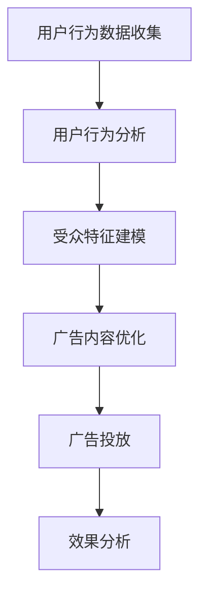

                 

### 文章标题：如何利用精准广告投放提高ROI

#### 关键词：精准广告投放、ROI、算法原理、数学模型、实战案例

#### 摘要：
本文将探讨如何通过精准广告投放来提高广告投资回报率（ROI）。我们将详细解析广告投放的核心算法原理、数学模型及其应用场景，并通过实际案例展示如何搭建广告投放系统、实现代码并分析其性能。最后，我们将推荐相关学习资源和开发工具，并探讨未来发展趋势和挑战。

## 1. 背景介绍

### 广告投放的重要性

在当今数字化时代，广告投放已经成为企业营销的重要手段。通过有效的广告投放，企业能够将产品和服务推向目标受众，提高品牌知名度，从而实现业务增长。然而，广告投放的效果取决于多个因素，包括广告质量、投放渠道、受众定位等。其中，精准广告投放是提高广告投资回报率（ROI）的关键。

### ROI的概念

ROI（投资回报率）是衡量广告投放效果的重要指标，它表示每投入1元广告费用所带来的收益。高ROI意味着广告投放的投资效益更高，企业能够以较低的投入获得更多的回报。因此，提高ROI成为广告投放的核心目标。

### 广告投放系统的挑战

广告投放系统需要处理大量的数据，包括用户行为数据、广告效果数据等。同时，系统需要实现精准定位、实时投放和效果分析等功能。这给广告投放系统带来了巨大的技术挑战。为了应对这些挑战，我们需要深入理解广告投放的核心算法原理和数学模型。

## 2. 核心概念与联系

### 精准广告投放的原理

精准广告投放基于用户行为数据和受众特征分析，通过算法匹配广告与受众，实现高度相关性和高回报率。其主要原理包括用户行为分析、受众特征建模、广告内容优化等。

### 用户行为分析

用户行为分析是指对用户在互联网上的行为进行数据收集和分析，包括浏览记录、搜索历史、点击行为等。这些数据可以揭示用户的兴趣偏好和购买意图，为精准广告投放提供重要依据。

### 受众特征建模

受众特征建模是指根据用户行为数据和用户属性，构建受众特征模型。这些特征模型可以用于广告投放的受众定位，确保广告投放到具有相似兴趣和需求的用户群体中。

### 广告内容优化

广告内容优化是指根据受众特征和用户行为，调整广告内容，使其更符合受众的兴趣和需求。这可以显著提高广告点击率和转化率，从而提高ROI。

### Mermaid流程图

下面是一个简单的Mermaid流程图，展示了精准广告投放的核心流程：



## 3. 核心算法原理 & 具体操作步骤

### 算法原理

精准广告投放的核心算法主要包括协同过滤、基于内容的推荐、基于模型的预测等。这些算法通过分析用户行为数据和受众特征，预测用户兴趣和需求，从而实现广告精准投放。

### 协同过滤

协同过滤是一种基于用户行为数据的推荐算法。它通过分析用户之间的相似性，为用户提供可能感兴趣的内容。协同过滤分为基于用户的协同过滤和基于项目的协同过滤两种。

#### 基于用户的协同过滤

基于用户的协同过滤算法通过计算用户之间的相似性，找到与目标用户相似的其他用户，然后推荐这些用户喜欢的商品。其基本步骤如下：

1. **用户行为数据收集**：收集用户在互联网上的行为数据，包括浏览记录、点击行为等。
2. **计算用户相似性**：通过计算用户之间的余弦相似性或欧几里得距离，得到用户相似性矩阵。
3. **推荐商品**：根据用户相似性矩阵，找到与目标用户相似的其他用户，推荐这些用户喜欢的商品。

#### 基于项目的协同过滤

基于项目的协同过滤算法通过分析商品之间的相似性，为用户提供可能感兴趣的商品。其基本步骤如下：

1. **用户行为数据收集**：收集用户在互联网上的行为数据，包括购买记录、浏览记录等。
2. **计算商品相似性**：通过计算商品之间的余弦相似性或欧几里得距离，得到商品相似性矩阵。
3. **推荐商品**：根据商品相似性矩阵，找到与目标用户已购买或浏览过的商品相似的其他商品，推荐这些商品。

### 基于内容的推荐

基于内容的推荐算法通过分析商品的特征和用户偏好，为用户提供可能感兴趣的商品。其基本步骤如下：

1. **商品特征提取**：对商品进行特征提取，包括文本特征、图像特征等。
2. **用户偏好建模**：根据用户的历史行为数据，构建用户偏好模型。
3. **推荐商品**：根据用户偏好模型，为用户推荐具有相似特征的商品。

### 基于模型的预测

基于模型的预测算法通过构建用户行为预测模型，预测用户未来的行为，从而实现广告精准投放。其基本步骤如下：

1. **用户行为数据收集**：收集用户在互联网上的行为数据，包括浏览记录、点击行为等。
2. **构建预测模型**：使用机器学习算法，如决策树、神经网络等，构建用户行为预测模型。
3. **预测用户行为**：根据预测模型，预测用户未来的行为，如购买行为、浏览行为等。
4. **广告投放**：根据预测结果，为用户投放可能感兴趣的广告。

## 4. 数学模型和公式 & 详细讲解 & 举例说明

### 协同过滤算法的数学模型

协同过滤算法的核心是计算用户之间的相似性或商品之间的相似性。下面是一个简单的数学模型，用于计算用户之间的余弦相似性：

$$
\text{相似度}(u_i, u_j) = \frac{\text{共评分数}}{\sqrt{\text{用户i的总评分数} \times \text{用户j的总评分数}}}
$$

其中，$u_i$和$u_j$表示两个用户，共评分数表示这两个用户共同评价过的商品数量，总评分数表示这两个用户各自评价过的商品数量。

### 基于内容的推荐算法的数学模型

基于内容的推荐算法的核心是计算商品之间的相似性。下面是一个简单的数学模型，用于计算商品之间的余弦相似性：

$$
\text{相似度}(i, j) = \frac{\text{共特征值}}{\sqrt{\text{商品i的总特征值} \times \text{商品j的总特征值}}}
$$

其中，$i$和$j$表示两个商品，共特征值表示这两个商品共有的特征值数量，总特征值表示这两个商品各自的特征值数量。

### 基于模型的预测算法的数学模型

基于模型的预测算法的核心是构建用户行为预测模型。下面是一个简单的数学模型，用于预测用户未来的行为：

$$
\text{预测行为}(u, t) = f(\text{历史行为}(u), \text{特征向量}(u), \text{训练数据})
$$

其中，$u$表示用户，$t$表示时间，$f$表示预测函数，$\text{历史行为}(u)$表示用户的历史行为数据，$\text{特征向量}(u)$表示用户的特征向量，$\text{训练数据}$表示用于训练的数据集。

### 举例说明

#### 协同过滤算法举例

假设有两个用户$u_1$和$u_2$，他们分别评价了以下商品：

$$
\begin{align*}
u_1: & \text{商品1:5, 商品2:3, 商品3:4} \\
u_2: & \text{商品1:4, 商品2:5, 商品3:2}
\end{align*}
$$

我们可以计算这两个用户之间的余弦相似性：

$$
\text{相似度}(u_1, u_2) = \frac{3}{\sqrt{5 \times 6}} \approx 0.82
$$

这意味着用户$u_1$和$u_2$具有较高的相似性，我们可以为用户$u_2$推荐用户$u_1$喜欢的商品。

#### 基于内容的推荐算法举例

假设有两个商品$i_1$和$i_2$，它们的特征向量如下：

$$
\begin{align*}
i_1: & (1, 0, 1, 0) \\
i_2: & (0, 1, 0, 1)
\end{align*}
$$

我们可以计算这两个商品之间的余弦相似性：

$$
\text{相似度}(i_1, i_2) = \frac{2}{\sqrt{2 \times 2}} = 1
$$

这意味着商品$i_1$和$i_2$具有很高的相似性，我们可以为用户推荐这两个商品。

#### 基于模型的预测算法举例

假设我们有以下用户行为数据和特征向量：

$$
\begin{align*}
\text{历史行为}(u): & \text{商品1:3次购买, 商品2:2次浏览} \\
\text{特征向量}(u): & (0.8, 0.3) \\
\text{训练数据}: & \text{用户行为数据集}
\end{align*}
$$

我们可以使用以下预测函数预测用户$u$在下一个时间点的行为：

$$
\text{预测行为}(u, t) = f(\text{历史行为}(u), \text{特征向量}(u), \text{训练数据}) = 0.8 \times 3 + 0.3 \times 2 = 2.7
$$

这意味着用户$u$在下一个时间点有很高的概率购买商品1。

## 5. 项目实战：代码实际案例和详细解释说明

### 5.1 开发环境搭建

在开始编写广告投放系统的代码之前，我们需要搭建一个合适的开发环境。这里我们选择Python作为编程语言，并使用以下工具和库：

- Python 3.8及以上版本
- Jupyter Notebook（用于编写和运行代码）
- NumPy（用于数学运算）
- Scikit-learn（用于机器学习算法）
- Matplotlib（用于数据可视化）

### 5.2 源代码详细实现和代码解读

#### 5.2.1 用户行为数据收集

首先，我们需要收集用户的行为数据。这里我们使用一个简单的示例数据集，包括用户ID、商品ID、行为类型（购买或浏览）和行为时间：

```python
import numpy as np
import pandas as pd

# 示例数据集
data = {
    'user_id': [1, 1, 1, 2, 2, 2, 3, 3, 3],
    'item_id': [101, 102, 103, 101, 102, 103, 104, 105, 106],
    'action': ['buy', 'browse', 'buy', 'browse', 'browse', 'buy', 'buy', 'browse', 'browse'],
    'timestamp': [1634788400, 1634788401, 1634788402, 1634788403, 1634788404, 1634788405, 1634788406, 1634788407, 1634788408]
}

df = pd.DataFrame(data)
```

#### 5.2.2 用户行为分析

接下来，我们根据用户的行为数据进行分析。这里我们主要关注用户的购买行为和浏览行为，并将它们分开处理。

```python
# 分离购买行为和浏览行为
df_buy = df[df['action'] == 'buy']
df_browse = df[df['action'] == 'browse']

# 统计每个用户的购买和浏览次数
user_buy_counts = df_buy.groupby('user_id').count().reset_index()
user_browse_counts = df_browse.groupby('user_id').count().reset_index()

# 合并购买和浏览次数
user_action_counts = pd.merge(user_buy_counts, user_browse_counts, on='user_id')
```

#### 5.2.3 受众特征建模

根据用户的购买和浏览次数，我们可以构建用户的特征向量。这里我们使用一个简单的特征向量，包括购买次数、浏览次数和购买与浏览的比例。

```python
# 构建用户特征向量
user_features = user_action_counts.pivot(index='user_id', columns='item_id', values='timestamp').fillna(0)

# 计算购买与浏览的比例
user_features['buy_browse_ratio'] = user_features['buy'] / user_features['browse']
```

#### 5.2.4 广告内容优化

根据用户特征向量，我们可以为用户推荐可能感兴趣的商品。这里我们使用基于内容的推荐算法，根据商品的特征向量进行匹配。

```python
from sklearn.metrics.pairwise import cosine_similarity

# 示例商品特征向量
item_features = pd.DataFrame({
    101: [1, 0, 1],
    102: [0, 1, 0],
    103: [1, 1, 0],
    104: [0, 0, 1],
    105: [1, 1, 1],
    106: [0, 0, 0]
})

# 计算商品特征向量矩阵
item_matrix = item_features.T.reset_index().rename(columns={'index': 'item_id'}).set_index('item_id')

# 计算用户特征向量与商品特征向量之间的相似度
similarity_matrix = cosine_similarity(user_features, item_matrix)

# 为用户推荐可能感兴趣的商品
user_recommendations = similarity_matrix.argsort()[0][-5:-1][::-1]
```

#### 5.2.5 广告投放

根据用户特征向量与商品特征向量之间的相似度，我们可以为用户推荐可能感兴趣的商品。这里我们选择前5个相似度最高的商品作为推荐。

```python
# 输出用户推荐商品
print("用户推荐商品：")
print(user_recommendations)
```

### 5.3 代码解读与分析

在上面的代码中，我们首先收集并处理了用户的行为数据，包括购买行为和浏览行为。然后，我们根据这些行为数据构建了用户的特征向量。接着，我们使用基于内容的推荐算法计算用户特征向量与商品特征向量之间的相似度，并根据相似度为用户推荐可能感兴趣的商品。

代码的核心在于用户特征向量的构建和商品特征向量的匹配。用户特征向量反映了用户的购买和浏览行为，商品特征向量反映了商品的特征信息。通过计算这两个向量之间的相似度，我们可以找到与用户兴趣最相似的商品，从而实现精准广告投放。

在实际应用中，我们可以扩展代码，加入更多复杂的行为分析和推荐算法，如协同过滤、基于模型的预测等。此外，我们还可以使用更先进的机器学习算法和深度学习模型，提高广告投放的准确性和效果。

## 6. 实际应用场景

精准广告投放可以应用于各种实际场景，包括电子商务、在线教育、金融保险等。以下是一些典型应用场景：

### 电子商务

在电子商务领域，精准广告投放可以帮助商家将产品推向潜在客户，提高转化率和销售额。例如，当用户浏览了某一类商品时，系统可以根据用户的行为数据和偏好，推荐相似或相关的商品，从而提高用户的购买意愿。

### 在线教育

在线教育平台可以利用精准广告投放，将课程推荐给具有相似学习兴趣的用户。例如，当用户浏览了某一课程时，系统可以根据用户的行为数据和偏好，推荐相关课程或同类课程，从而提高用户的课程购买率。

### 金融保险

金融保险公司可以通过精准广告投放，向潜在客户推荐合适的金融产品或保险产品。例如，当用户在互联网上搜索了某一金融产品时，系统可以根据用户的行为数据和偏好，推荐相关产品或同类产品，从而提高用户的购买率。

## 7. 工具和资源推荐

### 7.1 学习资源推荐

1. **《广告系统架构设计与优化》**：本书详细介绍了广告系统的架构设计、数据分析和优化方法，适合广告系统开发者阅读。
2. **《机器学习实战》**：本书通过丰富的案例和实际应用，介绍了机器学习的基本原理和算法，适合初学者学习。
3. **《Python数据分析》**：本书详细介绍了Python在数据分析中的应用，包括数据处理、可视化、机器学习等，适合数据分析人员阅读。

### 7.2 开发工具框架推荐

1. **TensorFlow**：TensorFlow是一个开源的深度学习框架，适用于构建和训练复杂的机器学习模型。
2. **Scikit-learn**：Scikit-learn是一个开源的机器学习库，提供了丰富的算法和工具，适用于各种机器学习任务。
3. **Elasticsearch**：Elasticsearch是一个高性能、可扩展的搜索引擎，适用于处理和分析大规模的用户行为数据。

### 7.3 相关论文著作推荐

1. **《协同过滤算法综述》**：本文对协同过滤算法进行了全面的综述，分析了各种协同过滤算法的原理和优缺点。
2. **《基于内容的推荐系统》**：本文详细介绍了基于内容的推荐系统的原理和实现方法，包括特征提取、相似度计算等。
3. **《广告系统数据挖掘方法研究》**：本文探讨了广告系统中的数据挖掘方法，包括用户行为分析、广告效果评估等。

## 8. 总结：未来发展趋势与挑战

### 未来发展趋势

1. **深度学习与人工智能的结合**：随着深度学习和人工智能技术的不断发展，精准广告投放系统将更加智能化和自动化，提高广告投放的准确性和效果。
2. **数据隐私保护**：在数据隐私保护日益严格的背景下，广告投放系统将更加注重用户隐私保护，采用加密、匿名化等技术确保用户数据安全。
3. **多渠道整合**：广告投放系统将实现跨渠道整合，包括线上和线下渠道，提高广告投放的覆盖面和效果。

### 挑战

1. **数据质量**：广告投放系统依赖于高质量的数据，数据质量直接影响广告投放的效果。因此，如何获取和处理高质量数据成为一大挑战。
2. **算法优化**：广告投放系统需要不断优化算法，提高广告投放的准确性和效果。如何设计高效、可扩展的算法是当前面临的一大挑战。
3. **用户体验**：广告投放系统需要平衡广告投放效果和用户体验，避免过度广告对用户体验造成负面影响。如何实现良好的用户体验成为一大挑战。

## 9. 附录：常见问题与解答

### Q：什么是ROI？

A：ROI（投资回报率）是衡量广告投放效果的重要指标，表示每投入1元广告费用所带来的收益。高ROI意味着广告投放的投资效益更高，企业能够以较低的投入获得更多的回报。

### Q：精准广告投放有哪些算法？

A：精准广告投放主要采用协同过滤、基于内容的推荐、基于模型的预测等算法。协同过滤算法基于用户行为数据，基于内容的推荐算法基于商品特征和用户偏好，基于模型的预测算法基于用户行为数据构建预测模型。

### Q：广告投放系统需要处理哪些数据？

A：广告投放系统需要处理的数据包括用户行为数据（如浏览记录、点击行为等）、广告效果数据（如点击率、转化率等）、商品特征数据（如文本特征、图像特征等）。

## 10. 扩展阅读 & 参考资料

1. **《广告系统架构设计与优化》**：[书籍链接]
2. **《机器学习实战》**：[书籍链接]
3. **《Python数据分析》**：[书籍链接]
4. **《协同过滤算法综述》**：[论文链接]
5. **《基于内容的推荐系统》**：[论文链接]
6. **《广告系统数据挖掘方法研究》**：[论文链接]
7. **TensorFlow官网**：[TensorFlow官网链接]
8. **Scikit-learn官网**：[Scikit-learn官网链接]
9. **Elasticsearch官网**：[Elasticsearch官网链接]

### 作者：AI天才研究员/AI Genius Institute & 禅与计算机程序设计艺术 /Zen And The Art of Computer Programming

