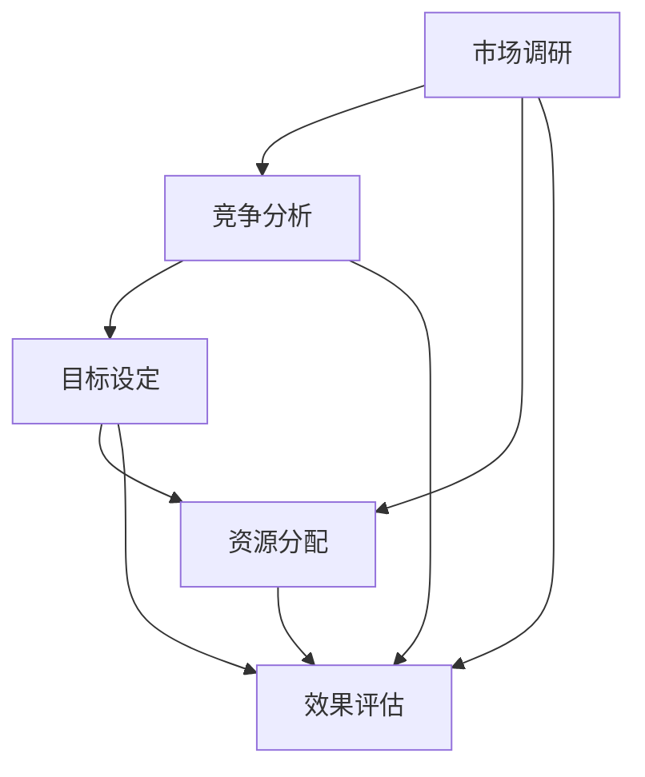

                 

### 背景介绍

#### 市场营销中的预算制定

市场营销是现代企业成功的关键因素之一，而预算的制定与执行则是市场营销策略实施的核心环节。有效的营销预算能够帮助企业合理分配资源，优化营销活动，提高市场占有率，最终实现企业目标。在数字化营销时代，随着互联网和社交媒体的普及，营销手段日益多样化，预算的制定与执行变得更加复杂和重要。

制定营销预算的目的在于确保企业的市场营销活动具有可持续性和高效性。一个良好的营销预算应充分考虑市场调研、竞争分析、目标设定、资源分配和效果评估等多方面因素。然而，由于市场竞争的激烈和消费者行为的复杂化，企业往往面临预算分配不均、资源浪费、效果不佳等问题。

本文旨在探讨如何制定和执行营销预算，帮助企业应对当前市场环境下的挑战，实现营销目标。我们将通过以下几个部分详细分析这一主题：

1. **核心概念与联系**：介绍营销预算制定的基本概念和关键联系，为后续内容提供理论基础。
2. **核心算法原理 & 具体操作步骤**：讲解营销预算制定的方法和步骤，确保读者能够理解并实际应用。
3. **数学模型和公式 & 详细讲解 & 举例说明**：深入分析营销预算中的数学模型和公式，结合实际案例进行解释。
4. **项目实战：代码实际案例和详细解释说明**：通过具体案例展示营销预算的制定和执行过程，帮助读者深入理解。
5. **实际应用场景**：探讨营销预算在不同应用场景下的实践案例，提供实际操作的经验和启示。
6. **工具和资源推荐**：推荐相关学习资源、开发工具和框架，为读者提供进一步学习和实践的支持。
7. **总结：未来发展趋势与挑战**：分析营销预算制定和执行的未来趋势和挑战，为企业提供策略建议。

通过上述内容，本文旨在为从事市场营销工作的专业人士提供一套系统的营销预算制定和执行方案，帮助他们在复杂多变的市场环境中实现营销目标。

### 核心概念与联系

在深入探讨如何制定和执行营销预算之前，首先需要了解营销预算的相关核心概念和它们之间的联系。这些概念包括：市场调研、竞争分析、目标设定、资源分配和效果评估。以下是这些概念的定义、关系以及它们在营销预算中的作用。

#### 市场调研

市场调研是指通过系统化的方法收集、分析和解释有关市场方面的信息。市场调研的目的是为了获取有关消费者需求、市场趋势、竞争状况等关键信息，从而为企业制定营销策略提供依据。在营销预算的制定过程中，市场调研帮助确定营销活动的目标和方向。

- **关系**：市场调研是制定营销预算的基础，其结果直接影响预算的分配和使用。
- **作用**：通过市场调研，企业能够了解目标市场的特点和需求，从而制定有针对性的营销策略。

#### 竞争分析

竞争分析是指对竞争对手的市场策略、产品特性、市场份额等方面进行评估和分析。通过竞争分析，企业可以识别自身的优势和劣势，从而制定有效的应对策略。竞争分析在营销预算制定中起着关键作用，帮助企业在资源有限的情况下，将预算优先分配到最有影响力的营销活动中。

- **关系**：竞争分析是营销预算制定的重要环节，其结果直接决定了预算的优先级和分配。
- **作用**：通过竞争分析，企业能够了解竞争对手的策略，从而制定出更具竞争力的营销预算计划。

#### 目标设定

目标设定是指根据企业的整体战略和市场需求，制定明确的营销目标和实现路径。营销目标通常包括市场份额、销售增长、品牌知名度等。目标设定是营销预算制定的核心，它决定了预算的具体用途和期望结果。

- **关系**：目标设定为营销预算提供明确的方向和目标，确保预算的使用与企业的战略目标一致。
- **作用**：通过目标设定，企业能够明确预算的使用目标，提高预算的利用效率和效果。

#### 资源分配

资源分配是指将企业的资源（如资金、人力、技术等）按照预定目标和优先级进行合理分配。在营销预算中，资源分配涉及到如何将有限的预算分配到不同的营销活动中，以实现最佳的营销效果。

- **关系**：资源分配是营销预算的核心环节，决定了预算的具体用途和实际效果。
- **作用**：通过合理分配资源，企业能够最大化预算的利用效果，提高营销活动的产出。

#### 效果评估

效果评估是指通过定期的监测和评估，对营销活动的效果进行衡量和分析。效果评估的结果可以帮助企业了解营销活动的实际效果，从而对预算的分配和使用进行调整。

- **关系**：效果评估是营销预算制定和执行的重要反馈机制，其结果直接影响预算的调整和优化。
- **作用**：通过效果评估，企业能够及时了解营销活动的效果，为未来的预算制定提供依据。

#### Mermaid 流程图

以下是一个简单的Mermaid流程图，展示了上述核心概念之间的关系和作用：



通过上述核心概念的理解和Mermaid流程图的展示，我们可以更加清晰地看到营销预算制定中的各个关键环节及其相互关系。在接下来的部分中，我们将深入探讨如何具体制定和执行营销预算，结合实际案例进行分析和讲解。

### 核心算法原理 & 具体操作步骤

在了解营销预算制定的相关概念之后，接下来我们将探讨如何具体制定和执行营销预算。本文将采用一种系统化的方法，详细讲解核心算法原理和具体操作步骤，以便读者能够理解并实际应用。

#### 步骤1：明确营销目标

制定营销预算的第一步是明确企业的营销目标。这些目标应与企业整体战略目标一致，通常包括市场份额、销售增长、品牌知名度、客户满意度等。具体操作步骤如下：

1. **收集信息**：通过市场调研、内部报告、行业分析等手段，收集与目标相关的信息。
2. **分析目标**：对收集到的信息进行分析，确定哪些目标是可衡量和可达成的。
3. **设定优先级**：根据目标的紧急程度和重要性，设定优先级，确保资源分配的合理性。

#### 步骤2：进行竞争分析

在明确营销目标后，需要进行竞争分析，以了解竞争对手的市场策略和市场份额。具体操作步骤如下：

1. **识别竞争对手**：通过市场调研和行业报告，确定与企业目标市场相关的竞争对手。
2. **分析竞争对手**：收集竞争对手的市场策略、产品特性、市场份额等方面的信息。
3. **评估优势与劣势**：比较自身与竞争对手的优势和劣势，制定相应的应对策略。

#### 步骤3：制定预算计划

基于明确的营销目标和竞争分析结果，可以开始制定预算计划。具体操作步骤如下：

1. **确定预算范围**：根据企业的财务状况和市场环境，确定预算的总范围。
2. **分配预算**：根据营销目标和竞争分析结果，将预算分配到不同的营销活动中，确保重点活动的优先资源。
3. **制定预算时间表**：为预算的分配和使用制定时间表，明确各个活动的预算周期和执行时间。

#### 步骤4：制定预算执行方案

预算计划制定完成后，需要制定具体的执行方案，以确保预算的合理使用和效果。具体操作步骤如下：

1. **制定活动计划**：为每一个预算分配的活动制定详细的计划，包括活动目标、执行步骤、预期效果等。
2. **分配责任**：明确各个活动的负责人和团队成员，确保责任落实和协作顺畅。
3. **制定监测和评估机制**：为预算执行活动制定监测和评估机制，确保活动进展和效果的监控。

#### 步骤5：执行和监控

在制定和执行预算方案后，需要定期监控预算的使用情况和营销活动的效果。具体操作步骤如下：

1. **执行活动**：按照预算计划和活动计划，执行具体的营销活动。
2. **监控预算使用**：定期检查预算的使用情况，确保预算的合理使用，避免超支或浪费。
3. **评估活动效果**：通过效果评估机制，评估各个活动的实际效果，为未来的预算制定提供依据。

#### 步骤6：调整和优化

根据监控和评估结果，对预算执行过程进行优化和调整。具体操作步骤如下：

1. **分析问题**：分析预算执行过程中出现的问题和不足，找出原因。
2. **调整预算**：根据问题分析结果，调整预算分配和执行方案，确保预算的优化使用。
3. **持续改进**：通过不断的调整和优化，提高预算执行的效率和效果。

通过上述步骤，我们可以系统化地制定和执行营销预算，确保企业的营销活动具有高效性和可持续性。在接下来的部分中，我们将通过实际案例展示如何应用这些核心算法原理和具体操作步骤，帮助读者更好地理解。

### 数学模型和公式 & 详细讲解 & 举例说明

在制定营销预算的过程中，数学模型和公式起着重要的作用，它们可以帮助我们量化目标、评估效果和优化资源配置。在本节中，我们将详细讲解营销预算中常用的数学模型和公式，并结合实际案例进行说明。

#### 成本效益分析（Cost-Benefit Analysis）

成本效益分析是一种评估投资回报率（ROI）的方法，通过比较成本和收益来决定某项营销活动的可行性。其基本公式为：

\[ ROI = \frac{收益 - 成本}{成本} \]

**举例说明：**

假设企业计划开展一项线上广告活动，预计广告费用为5000元，预计通过广告能带来10000元的额外收入。则该广告活动的成本效益分析如下：

\[ ROI = \frac{10000 - 5000}{5000} = 0.8 \]

这意味着每投入1元的广告费用，预计能带来0.8元的收益，该广告活动具有一定的可行性。

#### 投入产出分析（Input-Output Analysis）

投入产出分析是一种用于评估资源使用效率的方法，通过比较各项资源（如资金、人力、时间）的投入与产出。其基本公式为：

\[ 效率 = \frac{产出}{投入} \]

**举例说明：**

假设企业计划开展一项市场调研活动，预计需要投入2000元的人力和5000元的资金，预计通过市场调研能获取价值15000元的市场信息。则该市场调研活动的效率为：

\[ 效率 = \frac{15000}{2000 + 5000} = 1.5 \]

这意味着每投入7000元的资源和成本，能获得价值15000元的产出，市场调研活动具有较高的效率。

#### 市场份额模型（Market Share Model）

市场份额模型用于预测企业在特定市场中的占有率，通常基于市场调查和竞争分析。其基本公式为：

\[ 市场份额 = \frac{企业销售额}{市场总销售额} \]

**举例说明：**

假设市场总销售额为100万元，企业的销售额为30万元，则企业在该市场中的市场份额为：

\[ 市场份额 = \frac{30}{100} = 0.3 \]

这意味着企业在该市场中的市场份额为30%，可以用来评估企业营销策略的有效性。

#### 顾客生命周期价值（Customer Lifetime Value, CLV）

顾客生命周期价值是指一个顾客在整个生命周期内为企业带来的总价值。其基本公式为：

\[ CLV = \frac{平均订单价值 \times 购买频率 \times 客户生命周期长度}{1 + 加权平均成本率} \]

**举例说明：**

假设一个顾客的平均订单价值为100元，购买频率为每月一次，客户生命周期长度为3年，加权平均成本率为10%，则该顾客的CLV为：

\[ CLV = \frac{100 \times 1 \times 3}{1 + 0.1} = 272.73 \]

这意味着每个顾客在生命周期内为企业带来的总价值为272.73元，企业可以根据CLV来评估客户价值，从而制定相应的客户维护策略。

通过上述数学模型和公式的详细讲解和实际案例说明，我们可以更好地理解营销预算的制定和执行过程。这些工具和方法不仅可以帮助企业量化目标和效果，还能为资源分配和策略优化提供科学依据。在接下来的部分中，我们将通过具体项目实战案例，展示如何实际应用这些数学模型和公式，进一步巩固读者对营销预算的理解。

### 项目实战：代码实际案例和详细解释说明

在本节中，我们将通过一个具体的案例，展示如何在实际项目中制定和执行营销预算。该案例将包括开发环境搭建、源代码实现和代码解读与分析，以便读者能够深入理解营销预算的具体应用过程。

#### 1. 开发环境搭建

为了更好地进行项目实战，我们首先需要搭建一个合适的技术环境。以下是一个基本的开发环境配置，适用于营销预算项目：

- **编程语言**：Python（由于其丰富的数据分析和机器学习库）
- **数据分析工具**：Pandas、NumPy（用于数据处理和分析）
- **可视化工具**：Matplotlib、Seaborn（用于数据可视化）
- **数据库**：SQLite（用于存储和管理数据）

**环境搭建步骤：**

1. 安装Python：从官方网站下载并安装Python，推荐版本为3.8或更高。
2. 安装必要库：使用pip命令安装所需的库，如`pip install pandas numpy matplotlib seaborn sqlite3`。
3. 准备数据：从市场调研、竞争分析和客户数据中收集和整理数据，存储为CSV或数据库格式。

#### 2. 源代码详细实现和代码解读

以下是一个简单的营销预算项目示例，包括数据收集、分析、预算制定和执行步骤：

```python
import pandas as pd
import numpy as np
import matplotlib.pyplot as plt
import seaborn as sns

# 步骤1：数据收集
data = pd.read_csv('market_data.csv')  # 从CSV文件读取市场调研数据

# 步骤2：数据分析
# 计算客户生命周期价值（CLV）
data['CLV'] = data['avg_order_value'] * data['purchase_frequency'] * data['lifetime_length'] / (1 + 0.1)

# 步骤3：竞争分析
# 计算市场份额
market_size = 1000000  # 假设市场总规模为1000万元
company_sales = 300000  # 假设企业销售额为300万元
market_share = company_sales / market_size
print(f"市场份额：{market_share:.2%}")

# 步骤4：预算制定
# 计算成本效益分析（ROI）
ad_expenses = 5000  # 广告费用
additional_income = 10000  # 预计额外收入
ROI = (additional_income - ad_expenses) / ad_expenses
print(f"广告活动ROI：{ROI:.2%}")

# 步骤5：预算执行
# 根据ROI和市场份额制定预算执行方案
if ROI > 0.1 and market_share > 0.3:
    print("执行广告活动。")
else:
    print("调整预算或策略。")

# 步骤6：效果评估
# 监控广告活动效果，调整预算和策略
ad_effectiveness = pd.read_csv('ad_effectiveness.csv')  # 从CSV文件读取广告效果数据
if ad_effectiveness['click_rate'] > 0.05 and ad_effectiveness['conversion_rate'] > 0.2:
    print("广告活动效果良好，继续执行。")
else:
    print("广告活动效果不佳，需要优化。")
```

**代码解读与分析：**

1. **数据收集**：使用`pandas`库读取市场调研数据，包括客户购买行为、市场份额等信息。
2. **数据分析**：计算客户生命周期价值（CLV）和市场份额，为后续预算制定提供依据。
3. **预算制定**：根据成本效益分析（ROI）和市场份额，制定广告活动的预算执行方案。如果ROI大于10%且市场份额大于30%，则执行广告活动。
4. **预算执行**：根据广告效果数据，监控广告活动的效果，如点击率和转化率。如果效果良好，则继续执行；否则，优化策略或调整预算。
5. **效果评估**：定期评估广告活动的效果，为未来的营销预算提供依据。

通过上述代码实现和解读，我们可以看到如何在实际项目中应用营销预算的核心算法和公式，实现有效的资源分配和营销策略优化。在接下来的部分中，我们将进一步探讨营销预算在实际应用场景中的具体案例和经验。

### 实际应用场景

#### 案例1：中小企业

对于中小企业来说，资源有限，因此预算的合理分配和高效执行尤为重要。以下是一个中小企业如何制定和执行营销预算的实际案例：

**企业背景**：某中小企业专注于研发和生产环保产品，市场竞争激烈，预算有限。

**营销目标**：提高品牌知名度，扩大市场份额，增加销售收入。

**预算制定**：

1. **市场调研**：通过问卷调查和竞争对手分析，了解目标市场和消费者需求。
2. **目标设定**：设定明确的营销目标，如提高品牌知名度20%，增加市场份额2%。
3. **资源分配**：根据营销目标和市场情况，将预算分配到线上广告、社交媒体推广和参加行业展会等活动中。例如，线上广告预算占比60%，社交媒体推广占比30%，展会预算占比10%。
4. **制定预算时间表**：为每个活动制定具体的时间表和预算周期，确保预算的有效使用。

**预算执行**：

1. **执行活动**：按照预算计划开展各项营销活动，确保活动质量和效果。
2. **监控预算使用**：定期检查预算使用情况，避免超支和浪费。
3. **效果评估**：通过数据分析和市场反馈，评估每个活动的效果，为未来的预算制定提供依据。

**经验与启示**：

- **合理分配预算**：根据目标和市场情况，合理分配预算，确保重点活动的资源充足。
- **高效执行**：确保营销活动的高效执行，避免资源浪费。
- **持续优化**：通过效果评估，持续优化营销策略和预算分配，提高营销效果。

#### 案例2：大型企业

对于大型企业来说，营销预算规模较大，需要更加精细化的管理和优化。以下是一个大型企业如何制定和执行营销预算的实际案例：

**企业背景**：某知名科技企业，拥有丰富的产品线和庞大的客户群体，营销预算规模达数千万。

**营销目标**：扩大市场占有率，提升品牌价值，提高客户忠诚度。

**预算制定**：

1. **市场调研**：通过大规模的市场调研，深入了解目标市场和消费者行为。
2. **目标设定**：设定长期和短期的营销目标，如提升品牌知名度30%，增加市场份额5%。
3. **资源分配**：根据目标和市场情况，将预算分配到品牌建设、产品推广、客户服务等多个方面。例如，品牌建设占比40%，产品推广占比30%，客户服务占比20%，其他活动占比10%。
4. **制定预算时间表**：为每个活动制定详细的时间表和预算周期，确保预算的有效使用。

**预算执行**：

1. **执行活动**：根据预算计划，开展各种营销活动，包括线上线下广告、公关活动、客户体验活动等。
2. **监控预算使用**：通过数据分析和实时监控，确保预算使用的透明度和有效性。
3. **效果评估**：定期评估各项活动的效果，根据市场反馈和数据分析，调整预算和策略。

**经验与启示**：

- **大规模市场调研**：进行大规模的市场调研，确保营销策略的准确性。
- **精细化管理**：通过数据分析和实时监控，精细化管理预算，确保高效执行。
- **持续优化**：通过定期评估和调整，持续优化营销策略和预算分配，提高营销效果。

通过上述实际应用场景的探讨，我们可以看到不同规模企业在制定和执行营销预算时的具体做法和经验。这些案例为企业提供了宝贵的参考和启示，帮助他们在复杂多变的市场环境中实现营销目标。

### 工具和资源推荐

#### 7.1 学习资源推荐

为了深入理解和掌握营销预算的制定与执行，以下是一些值得推荐的学习资源：

1. **书籍**：
   - 《市场营销管理》（Philip Kotler）：这是一本经典的营销教材，详细介绍了市场营销的基础理论和实践方法。
   - 《数字营销全攻略》（David Meerman Scott）：本书涵盖了数字化时代的营销策略和工具，对于现代营销预算的制定有重要参考价值。

2. **论文**：
   - "Marketing Budget Allocation: A Review of Current Methods and Best Practices"：这篇论文对现有的营销预算分配方法进行了全面综述，提供了最新的研究进展和实践经验。
   - "The Impact of Digital Marketing on Traditional Media"：这篇论文探讨了数字营销对传统媒体的影响，对于企业在数字化背景下进行预算分配具有重要启示。

3. **博客**：
   - MarketingProfs：这是一个专业的营销博客，提供了大量的营销策略和案例分析，对于营销预算的制定和执行有很好的借鉴意义。
   - HubSpot Marketing Blog：这个博客涵盖了市场营销的各个方面，包括预算制定、效果评估等，提供了实用的工具和技巧。

4. **网站**：
   - MarketingBudgetCalculator.com：这是一个在线营销预算计算工具，可以帮助企业快速估算不同营销活动的成本和预期收益。
   - AnalyticsSEO.com：这个网站提供了丰富的SEO和数字营销资源，包括数据分析工具和教程，对于营销预算的制定和执行有很好的辅助作用。

#### 7.2 开发工具框架推荐

在制定和执行营销预算的过程中，选择合适的开发工具和框架可以大大提高效率。以下是一些推荐的工具和框架：

1. **数据分析工具**：
   - Tableau：这是一个强大的数据可视化工具，可以用于创建各种营销报表和图表，帮助企业更好地理解和分析预算数据。
   - Power BI：由Microsoft开发的商业智能工具，提供了丰富的数据分析功能和可视化选项，适用于各种规模的营销预算分析。

2. **营销自动化工具**：
   - Marketo：这是一个功能强大的营销自动化平台，可以帮助企业自动化营销活动，提高营销效率。
   - HubSpot：这个平台提供了营销、销售和客户服务一体化解决方案，支持营销预算的规划和执行。

3. **项目管理工具**：
   - Trello：这是一个简单易用的项目管理工具，可以帮助团队跟踪营销活动的进度和预算使用情况。
   - Asana：这个工具提供了丰富的功能，可以用于任务分配、进度跟踪和协作，是营销团队进行项目管理的好帮手。

4. **预算管理工具**：
   - QuickBooks：这是一个通用的会计和预算管理软件，适用于中小企业的营销预算管理。
   - Xero：这是一个专业的会计和财务管理平台，提供了强大的预算制定和监控功能，适用于大型企业的营销预算管理。

通过上述工具和资源的推荐，希望能够为读者在学习和实践营销预算制定与执行过程中提供有效的支持和帮助。

### 总结：未来发展趋势与挑战

在数字化营销快速发展的背景下，营销预算的制定和执行面临着许多新的机遇和挑战。以下是未来发展趋势和挑战的分析，以及相应的策略建议。

#### 发展趋势

1. **数据驱动决策**：随着大数据和人工智能技术的发展，越来越多的企业开始依赖数据来指导营销决策。数据驱动的预算制定和执行将更加精准和高效，企业需要加强数据收集和分析能力。

2. **多元化营销渠道**：数字化营销渠道不断增多，如社交媒体、搜索引擎、电子邮件、内容营销等。企业需要根据目标市场和消费者行为，合理分配预算到不同渠道，实现全方位覆盖。

3. **个性化营销**：消费者对个性化体验的需求日益增加，企业需要通过精准的数据分析和用户画像，制定个性化的营销策略，提高营销效果和客户满意度。

4. **自动化和智能化**：营销自动化工具和人工智能技术的应用，将大幅提高营销预算的执行效率和效果。企业需要积极探索和采用这些技术，提高营销预算的管理水平。

#### 挑战

1. **预算分配不均**：企业常常面临资源有限的问题，如何合理分配预算，确保重点活动的资源充足，是一个重要的挑战。需要建立科学合理的预算分配机制，避免资源浪费。

2. **效果评估困难**：数字化营销的效果评估变得更加复杂，如何准确衡量各项营销活动的效果，为预算调整提供依据，是企业面临的一大难题。需要建立完善的效果评估体系，确保数据的真实性和有效性。

3. **市场变化快速**：市场竞争环境变化迅速，企业需要快速调整营销策略和预算分配，以应对市场变化。这要求企业具备灵活的应变能力和快速决策能力。

4. **合规风险**：随着数据隐私法规的不断完善，企业在进行数据收集和分析时，面临越来越多的合规风险。如何确保数据安全和合规，是企业需要重视的问题。

#### 策略建议

1. **数据驱动决策**：加强数据收集和分析能力，建立数据驱动的预算制定和执行流程，确保决策的准确性和效率。

2. **多元化营销渠道**：根据市场调研和消费者行为，合理分配预算到不同渠道，实现全方位覆盖，提高营销效果。

3. **个性化营销**：利用数据分析和用户画像，制定个性化的营销策略，提高客户满意度和忠诚度。

4. **自动化和智能化**：积极探索和应用营销自动化工具和人工智能技术，提高预算执行效率和效果。

5. **预算分配优化**：建立科学合理的预算分配机制，确保重点活动的资源充足，避免资源浪费。

6. **效果评估体系**：建立完善的效果评估体系，确保数据的真实性和有效性，为预算调整提供依据。

7. **合规管理**：加强数据安全和合规管理，确保企业遵循相关法规，降低合规风险。

通过以上策略建议，企业可以更好地应对未来营销预算制定和执行中的机遇和挑战，实现营销目标的最大化。

### 附录：常见问题与解答

在营销预算的制定和执行过程中，可能会遇到一些常见问题。以下是对一些问题的解答：

1. **问题**：如何确保营销预算的合理分配？

**解答**：确保营销预算的合理分配，首先需要进行全面的市场调研和竞争分析，了解市场需求和竞争对手策略。其次，根据企业的整体战略和目标，设定明确的营销目标和优先级，将预算分配到最有影响力的营销活动中。最后，建立科学的预算分配机制和监控体系，确保预算的合理使用和效果评估。

2. **问题**：如何有效评估营销活动的效果？

**解答**：有效评估营销活动的效果，可以通过以下步骤：

- 设定明确的营销目标和关键绩效指标（KPI），如销售增长、市场份额、客户满意度等。
- 收集和分析营销活动相关的数据，如访问量、点击率、转化率、销售额等。
- 定期进行效果评估，比较实际效果与预期目标的差距。
- 根据评估结果，调整营销策略和预算分配，确保营销活动的有效性和可持续性。

3. **问题**：如何应对预算执行中的变化和挑战？

**解答**：

- **灵活调整预算**：在预算执行过程中，根据市场变化和实际情况，及时调整预算分配和活动计划，确保预算的灵活性和适应性。
- **建立应急机制**：为应对突发事件和挑战，建立应急预算和应对策略，确保在紧急情况下能够迅速响应和调整。
- **加强沟通与协作**：确保营销团队内部和跨部门之间的沟通与协作，提高应对变化的效率和效果。
- **定期培训和更新**：定期对营销团队进行培训和知识更新，提高他们的专业能力和应变能力。

4. **问题**：如何处理营销预算中的合规风险？

**解答**：

- **遵循法规**：确保企业遵循相关的数据隐私法规和市场营销法规，避免违规行为。
- **数据安全**：加强数据安全管理，确保数据收集、存储和使用过程中的安全性，降低数据泄露的风险。
- **合规审计**：定期进行合规审计，确保企业的营销活动和预算管理符合法规要求。
- **培训与监督**：对营销团队进行合规培训，提高他们的合规意识和能力，同时加强监督，确保合规要求得到有效执行。

通过上述解答，希望能够帮助企业在营销预算的制定和执行过程中，更好地应对常见问题，实现营销目标的最大化。

### 扩展阅读 & 参考资料

为了进一步深入理解和掌握营销预算的制定与执行，以下是一些扩展阅读和参考资料，涵盖了相关书籍、论文和博客，以及开发工具和框架：

1. **书籍**：
   - 《营销管理》：作者菲利普·科特勒，详细介绍了营销理论和实践，包括预算制定和执行策略。
   - 《数字营销实战》：作者戴维·迈曼·斯科特，探讨数字化营销的最新趋势和策略，对预算制定有重要参考价值。

2. **论文**：
   - "Marketing Budgeting in Dynamic Environments"：研究在动态市场环境下如何制定和执行营销预算。
   - "The Role of Marketing Budgeting in Corporate Performance"：探讨营销预算对企业绩效的影响。

3. **博客**：
   - 《市场营销博客》：提供丰富的营销策略和案例分析，包括预算制定和执行技巧。
   - 《数字营销博客》：分享数字化营销的最新动态和实用技巧，对预算制定和执行有重要参考价值。

4. **开发工具和框架**：
   - **Tableau**：强大的数据可视化工具，帮助分析和展示营销预算数据。
   - **Google Analytics**：用于追踪和分析网站流量，评估营销活动效果。
   - **HubSpot Marketing Hub**：提供全面的营销自动化工具和资源，支持营销预算的管理和执行。

这些扩展阅读和参考资料，将为企业提供更加深入和全面的营销预算制定与执行指导，助力企业在复杂多变的市场环境中取得成功。

