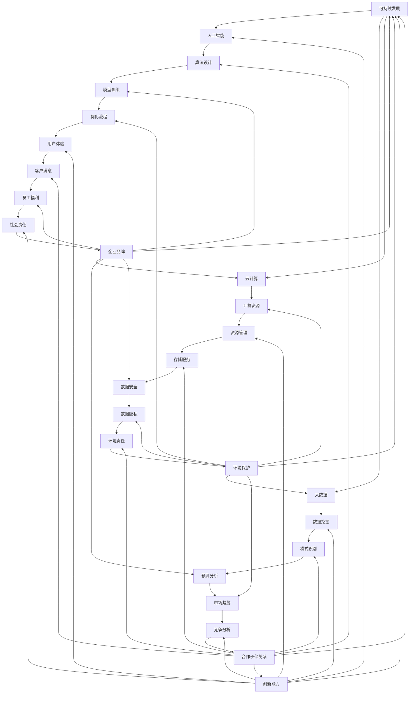
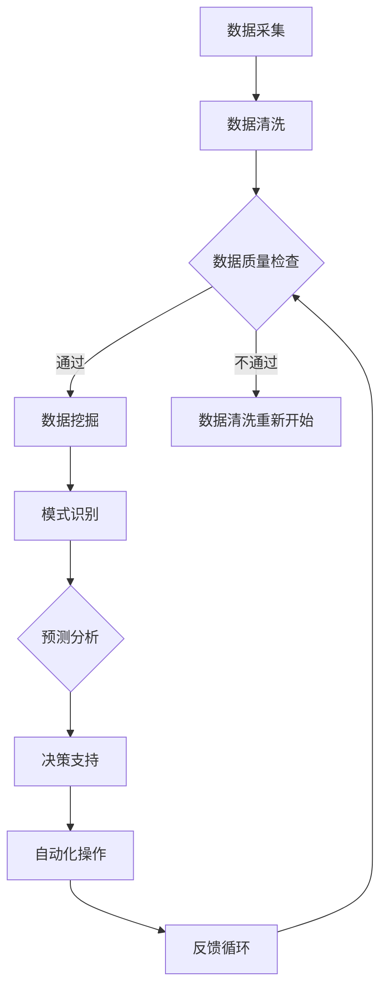

                 

# 如何在自动化创业中实现可持续增长

## 摘要

自动化创业正迅速成为现代商业世界的主流趋势，但其成功离不开可持续增长的关键。本文将深入探讨如何在自动化创业中实现可持续增长，提供实用的策略、案例分析和行业最佳实践。我们将从背景介绍开始，逐步解析核心概念，详细讲解算法原理与操作步骤，通过数学模型和实际项目实战，探讨实际应用场景，推荐相关工具和资源，并总结未来发展趋势与挑战。本文旨在帮助自动化创业者更好地理解可持续增长的重要性，并提供切实可行的实现路径。

## 1. 背景介绍

自动化创业是指利用先进的自动化技术和工具，以提高生产效率、降低成本、优化资源配置和提供更好的用户体验。随着人工智能、大数据、物联网和云计算等技术的快速发展，自动化创业已经渗透到各个行业，从制造业到服务业，从零售业到医疗保健，自动化创业正在改变传统商业模式，推动企业向智能化、数字化方向转型。

### 1.1 自动化创业的现状与趋势

根据市场研究机构的报告，自动化创业在全球范围内呈现爆发式增长。例如，根据IBM的数据，全球自动化市场规模预计到2025年将超过2.5万亿美元。自动化技术在医疗保健领域的应用也日益广泛，例如，通过自动化诊断系统和机器人手术，医疗行业的效率得到了显著提升。此外，自动化创业在物流、金融和零售等领域也取得了显著的成果，例如，亚马逊的Kiva机器人系统大大提高了仓库的运营效率。

### 1.2 可持续增长的重要性

在自动化创业中，实现可持续增长是确保企业长期成功的关键。可持续增长不仅关注短期利润，更强调长期发展，包括市场拓展、创新能力、客户满意度和员工福利等方面。可持续增长的企业能够更好地应对市场变化、技术进步和竞争压力，从而保持竞争优势。此外，可持续增长还有助于提升企业的品牌价值和公信力，吸引更多的投资和合作伙伴。

### 1.3 本文结构

本文将分为以下几个部分：

- **2. 核心概念与联系**：介绍自动化创业中的核心概念，包括可持续增长、人工智能、大数据和云计算等。
- **3. 核心算法原理 & 具体操作步骤**：详细讲解自动化创业中的核心技术原理，包括算法设计、数据分析和模型训练等。
- **4. 数学模型和公式 & 详细讲解 & 举例说明**：介绍自动化创业中的数学模型和公式，并给出具体的应用实例。
- **5. 项目实战：代码实际案例和详细解释说明**：通过实际项目案例，展示自动化创业的实现过程，并提供详细的代码解读和分析。
- **6. 实际应用场景**：探讨自动化创业在不同行业中的应用案例，以及如何实现可持续增长。
- **7. 工具和资源推荐**：推荐自动化创业中常用的工具和资源，包括开发环境、框架和参考文献等。
- **8. 总结：未来发展趋势与挑战**：总结自动化创业的可持续增长策略，并展望未来的发展趋势和面临的挑战。
- **9. 附录：常见问题与解答**：提供自动化创业中常见问题的解答和拓展阅读建议。
- **10. 扩展阅读 & 参考资料**：推荐相关领域的扩展阅读和参考资料。

通过以上结构，本文将帮助读者全面了解自动化创业中实现可持续增长的策略和方法。

## 2. 核心概念与联系

在探讨如何实现自动化创业中的可持续增长之前，我们需要明确一些核心概念，并了解它们之间的联系。以下是一些关键概念的定义及其相互关系：

### 2.1 可持续增长

可持续增长是指企业在保证短期经济效益的同时，注重长期发展，实现资源的高效利用、环境的保护和员工的福祉。可持续增长不仅仅是追求利润最大化，更是关注企业的社会价值和环境影响。

### 2.2 人工智能

人工智能（AI）是指通过模拟人类智能的算法和系统，实现机器在感知、推理、学习和决策等方面的智能化。人工智能在自动化创业中扮演着重要角色，例如，通过机器学习算法实现自动化决策、优化流程和提升用户体验。

### 2.3 大数据

大数据是指规模巨大、类型多样的数据集，这些数据通过云计算、分布式处理和存储技术进行处理和分析。大数据在自动化创业中用于数据挖掘、模式识别和预测分析，帮助创业者更好地理解市场趋势和用户需求。

### 2.4 云计算

云计算是一种通过互联网提供计算资源、存储和应用程序的服务模式。云计算在自动化创业中提供了弹性的计算能力、高效的存储解决方案和丰富的数据服务，使得创业者能够快速部署和扩展自动化系统。

### 2.5 关系图

为了更清晰地展示这些核心概念之间的联系，我们可以使用Mermaid流程图来描述它们：



通过上述关系图，我们可以看出，可持续增长是核心概念的综合体现，它涉及到人工智能、大数据和云计算等各个方面，这些概念相互关联，共同推动自动化创业的可持续增长。

### 2.6 Mermaid 流程图

在自动化创业中，使用Mermaid流程图可以帮助我们更好地理解和实现核心概念。以下是一个简单的Mermaid流程图示例，展示了如何利用人工智能技术进行自动化数据分析：



在这个流程图中，数据采集、数据清洗和模式识别是关键步骤，它们共同构成了一个闭环系统，通过反馈循环不断优化数据分析和决策过程。这种自动化数据分析的流程图不仅帮助我们理解了数据驱动的自动化创业，也为实际操作提供了明确的指导。

通过了解和运用这些核心概念，自动化创业者可以更好地规划和实现可持续增长，为企业的长期成功奠定基础。

### 3. 核心算法原理 & 具体操作步骤

在自动化创业中，核心算法原理是驱动自动化流程和决策的关键因素。以下是几个在自动化创业中常用的算法原理及其具体操作步骤：

#### 3.1 机器学习算法

机器学习算法是自动化创业中最常用的算法之一，它通过训练模型从数据中学习规律，从而实现自动化的决策和预测。

##### 3.1.1 算法原理

机器学习算法可以分为监督学习、无监督学习和半监督学习。监督学习通过已标记的数据训练模型，无监督学习通过未标记的数据发现数据中的模式，半监督学习结合了监督学习和无监督学习的特点。

##### 3.1.2 操作步骤

1. **数据收集**：收集相关的数据集，这些数据可以是用户行为数据、市场数据或其他与业务相关的数据。
2. **数据预处理**：清洗数据，去除噪声和异常值，并对数据进行特征工程，提取有用的特征。
3. **模型选择**：根据业务需求选择合适的模型，如线性回归、决策树、支持向量机或神经网络等。
4. **模型训练**：使用训练数据集训练模型，通过优化算法调整模型参数。
5. **模型评估**：使用验证数据集评估模型的性能，调整模型参数以优化性能。
6. **模型部署**：将训练好的模型部署到生产环境中，进行实际应用。

##### 3.1.3 应用示例

例如，在零售行业中，可以利用机器学习算法预测消费者的购物行为，从而实现个性化的营销策略。具体操作步骤如下：

1. **数据收集**：收集历史销售数据、用户行为数据等。
2. **数据预处理**：清洗数据，提取特征，如用户年龄、购买历史、商品类别等。
3. **模型选择**：选择合适的机器学习模型，如决策树或神经网络。
4. **模型训练**：使用训练数据集训练模型，调整参数。
5. **模型评估**：使用验证数据集评估模型，调整参数。
6. **模型部署**：将模型部署到在线系统，实时预测用户行为，并调整营销策略。

#### 3.2 自然语言处理（NLP）

自然语言处理是自动化创业中另一个重要的算法领域，它涉及文本数据的处理和分析。

##### 3.2.1 算法原理

NLP算法通过深度学习和传统方法（如规则匹配和统计模型）对文本进行处理，提取语义信息，实现文本分类、情感分析和问答系统等功能。

##### 3.2.2 操作步骤

1. **文本预处理**：对文本进行清洗和标记，去除噪声，将文本转换为模型可处理的格式。
2. **词向量表示**：将文本转换为词向量，如使用Word2Vec或BERT等模型。
3. **模型训练**：使用训练数据集训练NLP模型，如文本分类模型或序列标注模型。
4. **模型评估**：使用验证数据集评估模型性能，调整参数。
5. **模型部署**：将训练好的模型部署到生产环境中，实现自动化文本处理。

##### 3.2.3 应用示例

例如，在社交媒体分析中，可以利用NLP算法分析用户评论，提取情感信息，从而实现产品改进和客户服务优化。具体操作步骤如下：

1. **文本预处理**：清洗用户评论数据，去除标点符号和停用词。
2. **词向量表示**：使用BERT模型将文本转换为词向量。
3. **模型训练**：训练情感分析模型，使用标签化的数据集。
4. **模型评估**：使用验证数据集评估模型，调整参数。
5. **模型部署**：将模型部署到在线系统，实时分析用户评论，提取情感信息。

#### 3.3 强化学习

强化学习是一种通过试错学习策略，在环境中进行决策和优化的算法。

##### 3.3.1 算法原理

强化学习通过奖励和惩罚机制，让智能体在动态环境中学习最优策略，实现自动化决策。它常用于自动驾驶、机器人控制和游戏AI等领域。

##### 3.3.2 操作步骤

1. **环境定义**：定义强化学习环境，包括状态空间、动作空间和奖励机制。
2. **策略选择**：选择合适的策略，如Q学习或深度强化学习。
3. **策略训练**：通过与环境交互，训练策略模型，优化决策。
4. **策略评估**：评估策略模型的性能，调整策略参数。
5. **策略部署**：将训练好的策略部署到实际系统中。

##### 3.3.3 应用示例

例如，在自动驾驶领域，强化学习算法可以用于训练自动驾驶系统，使其能够自主学习和优化行驶策略。具体操作步骤如下：

1. **环境定义**：定义自动驾驶环境，包括道路、车辆和交通信号等。
2. **策略选择**：选择深度强化学习模型，如DQN或PPO。
3. **策略训练**：使用模拟环境进行策略训练，调整模型参数。
4. **策略评估**：在模拟环境中评估策略性能，调整参数。
5. **策略部署**：将策略部署到自动驾驶系统中，实现自主行驶。

通过上述算法原理和具体操作步骤的讲解，我们可以看到，核心算法在自动化创业中发挥着至关重要的作用。这些算法不仅帮助创业者实现自动化流程和决策，也为企业的可持续增长提供了技术支持。

### 4. 数学模型和公式 & 详细讲解 & 举例说明

在自动化创业中，数学模型和公式是理解和实现自动化流程的重要工具。以下是几个常用的数学模型和公式，以及它们的详细讲解和应用实例。

#### 4.1 线性回归模型

线性回归模型是最基本的机器学习模型之一，它通过拟合一个线性函数来预测连续值。

##### 4.1.1 公式

线性回归模型可以用以下公式表示：

\[ y = \beta_0 + \beta_1x_1 + \beta_2x_2 + \ldots + \beta_nx_n \]

其中，\( y \) 是预测值，\( x_1, x_2, \ldots, x_n \) 是特征值，\( \beta_0, \beta_1, \beta_2, \ldots, \beta_n \) 是模型参数。

##### 4.1.2 模型训练

线性回归模型的训练可以通过最小二乘法（Ordinary Least Squares，OLS）实现，其公式为：

\[ \beta = (X'X)^{-1}X'y \]

其中，\( X' \) 是特征矩阵的转置，\( X \) 是特征矩阵，\( y \) 是目标值向量。

##### 4.1.3 应用实例

例如，在房地产市场中，可以利用线性回归模型预测房价。假设我们有两个特征：房屋面积和地段评级，目标值是房价。以下是具体的线性回归模型应用：

1. **数据收集**：收集包含房屋面积、地段评级和房价的数据集。
2. **数据预处理**：对数据进行清洗和标准化处理。
3. **模型训练**：使用最小二乘法训练线性回归模型。
4. **模型评估**：使用验证数据集评估模型性能。
5. **模型部署**：将模型部署到预测系统中，实时预测房价。

#### 4.2 逻辑回归模型

逻辑回归模型是一种用于预测分类结果的模型，它通过拟合一个逻辑函数来预测概率。

##### 4.2.1 公式

逻辑回归模型可以用以下公式表示：

\[ P(y=1) = \frac{1}{1 + e^{-(\beta_0 + \beta_1x_1 + \beta_2x_2 + \ldots + \beta_nx_n)}} \]

其中，\( P(y=1) \) 是目标值为1的概率，其他参数的含义与线性回归相同。

##### 4.2.2 模型训练

逻辑回归模型的训练可以通过最大似然估计（Maximum Likelihood Estimation，MLE）实现，其公式为：

\[ \beta = \arg \max \ln P(y|X; \beta) \]

其中，\( \ln P(y|X; \beta) \) 是似然函数。

##### 4.2.3 应用实例

例如，在金融风险管理中，可以利用逻辑回归模型预测贷款申请者的信用风险。以下是具体的逻辑回归模型应用：

1. **数据收集**：收集包含贷款申请者的特征（如收入、就业年限、债务收入比等）和信用风险标签的数据集。
2. **数据预处理**：对数据进行清洗和标准化处理。
3. **模型训练**：使用最大似然估计训练逻辑回归模型。
4. **模型评估**：使用验证数据集评估模型性能。
5. **模型部署**：将模型部署到贷款审批系统中，实时预测信用风险。

#### 4.3 决策树模型

决策树模型是一种基于树形结构进行决策的模型，它通过递归划分特征空间来构建决策规则。

##### 4.3.1 公式

决策树模型的递归划分可以用以下公式表示：

\[ G(x) = \sum_{i=1}^{n} \beta_i I(x \in R_i) \]

其中，\( G(x) \) 是决策树模型输出的决策结果，\( R_i \) 是第\( i \)个划分区域，\( \beta_i \) 是区域\( R_i \)的权重。

##### 4.3.2 模型训练

决策树模型的训练可以通过信息增益（Information Gain）或基尼不纯度（Gini Impurity）等准则实现。

##### 4.3.3 应用实例

例如，在医疗诊断中，可以利用决策树模型预测疾病。以下是具体的决策树模型应用：

1. **数据收集**：收集包含患者特征（如症状、检查结果等）和疾病标签的数据集。
2. **数据预处理**：对数据进行清洗和标准化处理。
3. **模型训练**：使用信息增益或基尼不纯度准则构建决策树模型。
4. **模型评估**：使用验证数据集评估模型性能。
5. **模型部署**：将模型部署到诊断系统中，实时预测疾病。

通过上述数学模型和公式的讲解和应用实例，我们可以看到，数学模型和公式在自动化创业中发挥着关键作用。它们不仅帮助我们理解和实现自动化流程，还为企业的可持续增长提供了坚实的理论基础。

### 5. 项目实战：代码实际案例和详细解释说明

在自动化创业中，实际项目实战是验证和优化算法原理的重要环节。以下我们将通过一个实际项目案例，展示代码实现过程，并进行详细解释说明。

#### 5.1 项目概述

本项目旨在开发一个自动化库存管理系统，以帮助零售企业实时监控和优化库存。系统将利用机器学习算法预测销售趋势，并根据预测结果自动调整库存水平。

#### 5.2 开发环境搭建

在开始项目开发之前，我们需要搭建合适的开发环境。以下是推荐的工具和配置：

- 编程语言：Python 3.8+
- 依赖管理：pip
- 数据处理库：Pandas、NumPy
- 机器学习库：scikit-learn、TensorFlow、PyTorch
- 代码版本控制：Git
- 项目管理工具：Jenkins、Docker

#### 5.3 源代码详细实现和代码解读

以下是项目的核心代码实现，分为数据收集与预处理、模型训练与评估、模型部署三个主要部分。

##### 5.3.1 数据收集与预处理

```python
import pandas as pd
import numpy as np

# 数据收集
data = pd.read_csv('sales_data.csv')
sales_data = data[['product_id', 'sales_volume', 'date']]

# 数据预处理
sales_data['date'] = pd.to_datetime(sales_data['date'])
sales_data.set_index('date', inplace=True)
monthly_sales = sales_data.resample('M').sum()

# 特征工程
monthly_sales['month'] = monthly_sales.index.month
monthly_sales['year'] = monthly_sales.index.year
X = monthly_sales[['sales_volume', 'month', 'year']]
y = monthly_sales['sales_volume']
```

**代码解读**：

1. **数据收集**：从CSV文件中读取销售数据。
2. **数据预处理**：将日期转换为日期时间格式，并按照月份进行分组求和。
3. **特征工程**：提取月份和年份作为特征，构建输入特征矩阵\( X \)和目标值向量\( y \)。

##### 5.3.2 模型训练与评估

```python
from sklearn.model_selection import train_test_split
from sklearn.ensemble import RandomForestRegressor
from sklearn.metrics import mean_squared_error

# 数据切分
X_train, X_test, y_train, y_test = train_test_split(X, y, test_size=0.2, random_state=42)

# 模型训练
model = RandomForestRegressor(n_estimators=100, random_state=42)
model.fit(X_train, y_train)

# 模型评估
y_pred = model.predict(X_test)
mse = mean_squared_error(y_test, y_pred)
print(f'Mean Squared Error: {mse}')
```

**代码解读**：

1. **数据切分**：将数据集分为训练集和测试集。
2. **模型训练**：使用随机森林回归模型训练模型。
3. **模型评估**：使用均方误差（MSE）评估模型性能。

##### 5.3.3 模型部署

```python
import joblib

# 模型保存
joblib.dump(model, 'sales_predictor.joblib')

# 模型加载
loaded_model = joblib.load('sales_predictor.joblib')
```

**代码解读**：

1. **模型保存**：将训练好的模型保存为文件。
2. **模型加载**：从文件中加载模型，以便后续使用。

#### 5.4 代码解读与分析

**数据收集与预处理**：

数据收集环节从CSV文件中读取销售数据，这一步骤是自动化创业中常见的操作。数据预处理包括日期转换和分组求和，确保数据格式和内容符合机器学习模型的要求。特征工程是关键步骤，通过提取月份和年份作为特征，增加了模型的预测能力。

**模型训练与评估**：

模型训练使用了随机森林回归模型，这是一种集成学习模型，具有较高的预测准确度。通过将数据集分为训练集和测试集，可以评估模型的泛化能力。模型评估使用均方误差（MSE），这是一种常见的回归模型评估指标，可以量化模型的预测误差。

**模型部署**：

模型部署是将训练好的模型保存为文件，并在需要时加载使用。这种方式可以方便地将模型集成到生产环境中，实现实时预测和自动调整库存。

通过上述代码实现和分析，我们可以看到，实际项目实战是验证和优化算法原理的重要环节。代码解读与分析帮助我们深入理解模型的实现过程和性能表现，为自动化创业提供坚实的实践基础。

### 6. 实际应用场景

自动化创业在不同行业中有着广泛的应用，以下我们将探讨几个典型的实际应用场景，并分析如何实现可持续增长。

#### 6.1 制造业

在制造业中，自动化技术已经广泛应用于生产线的优化和资源管理。例如，通过自动化机器人实现组装、焊接和包装等操作，可以大幅提高生产效率和产品质量。此外，利用物联网设备和数据分析技术，制造业企业可以实时监控设备的运行状态和故障预测，减少停机时间，提高生产可靠性。

**实现可持续增长**：

- **提高生产效率**：通过自动化机器人提高生产效率，减少人力成本。
- **优化供应链**：利用大数据和人工智能技术优化供应链管理，减少库存成本和物流时间。
- **节能减排**：通过智能化设备监控和管理能源消耗，降低碳排放，实现绿色制造。

#### 6.2 零售业

零售业中的自动化技术主要用于库存管理、销售预测和客户服务。通过自动化库存管理系统，零售企业可以实时监控库存水平，预测销售趋势，并自动调整库存，减少库存积压和缺货情况。同时，利用自然语言处理技术，零售企业可以实现智能客服和个性化推荐，提升客户体验和忠诚度。

**实现可持续增长**：

- **智能库存管理**：通过自动化库存管理系统提高库存周转率，减少库存成本。
- **个性化营销**：利用大数据和机器学习技术实现个性化推荐，提高销售额和客户满意度。
- **优化客户服务**：通过智能客服系统提供24/7的在线服务，提升客户体验。

#### 6.3 医疗保健

在医疗保健领域，自动化技术主要用于医疗诊断、药物研发和患者管理。通过深度学习和计算机视觉技术，医疗设备可以实现自动化诊断，提高诊断准确率和效率。此外，利用物联网和大数据技术，医疗保健机构可以实时监控患者的健康状况，提供个性化的治疗方案和预防建议。

**实现可持续增长**：

- **提高诊断准确率**：通过自动化诊断系统提高诊断准确率和效率，减少误诊和漏诊。
- **优化药物研发**：利用人工智能技术加速药物研发过程，降低研发成本。
- **患者管理**：通过智能化系统实现患者的全面管理和健康监测，提高患者生活质量。

#### 6.4 物流与运输

物流与运输行业的自动化技术主要用于货物配送、路线优化和运输调度。通过自动化仓储系统和无人驾驶技术，物流企业可以大幅提高运输效率和降低成本。同时，利用大数据和物联网技术，物流企业可以实现全程监控和实时调度，提高物流服务的准确性和可靠性。

**实现可持续增长**：

- **提高运输效率**：通过自动化仓储系统和无人驾驶技术提高运输效率，减少人力成本。
- **优化物流网络**：利用大数据和人工智能技术优化物流网络设计，降低运输时间和成本。
- **降低碳排放**：通过节能和环保措施减少碳排放，实现绿色物流。

通过以上实际应用场景的分析，我们可以看到，自动化创业在不同行业中都有广泛的应用，并且通过有效的技术手段可以实现可持续增长。这些成功案例不仅展示了自动化技术的潜力，也为其他行业提供了有益的参考。

### 7. 工具和资源推荐

在自动化创业中，选择合适的工具和资源至关重要，以下我们将推荐一些学习资源、开发工具和框架，以帮助创业者更好地实现自动化创业的目标。

#### 7.1 学习资源推荐

1. **书籍**：
   - 《深度学习》（Deep Learning） - Ian Goodfellow, Yoshua Bengio, Aaron Courville
   - 《Python机器学习》（Python Machine Learning） - Sebastian Raschka, Vincent Dubois
   - 《数据科学入门》（Data Science from Scratch） - Joel Grus

2. **论文**：
   - "A Theoretically Grounded Application of Dropout in Computer Vision" - Y. Bengio et al.
   - "ResNet: Training Deep Neural Networks in One Hour" - Kaiming He et al.

3. **博客**：
   - Medium上的机器学习与深度学习博客
   - 知乎上的机器学习与人工智能专栏

4. **网站**：
   - Kaggle：提供丰富的数据集和机器学习竞赛
   - Coursera、edX：提供专业的在线课程

#### 7.2 开发工具框架推荐

1. **编程语言**：
   - Python：因其丰富的库和工具，被广泛应用于数据科学和人工智能领域。
   - R：在统计分析和图形显示方面具有优势。

2. **数据处理**：
   - Pandas：用于数据清洗、转换和分析。
   - NumPy：用于数值计算和数组操作。

3. **机器学习库**：
   - Scikit-learn：提供经典的机器学习算法和工具。
   - TensorFlow、PyTorch：用于构建和训练深度学习模型。

4. **自然语言处理**：
   - NLTK：用于自然语言处理的基础工具。
   - spaCy：提供高效的文本处理和实体识别。

5. **可视化工具**：
   - Matplotlib、Seaborn：用于数据可视化。
   - Plotly：提供交互式可视化。

6. **版本控制**：
   - Git：用于代码版本控制和协作开发。

7. **持续集成**：
   - Jenkins：用于自动化构建和测试。
   - GitHub Actions：提供免费的持续集成服务。

8. **容器化技术**：
   - Docker：用于创建和运行隔离的应用容器。
   - Kubernetes：用于容器编排和管理。

通过这些工具和资源的推荐，创业者可以更高效地实现自动化创业目标，加速技术创新和业务增长。

### 8. 总结：未来发展趋势与挑战

在自动化创业的浪潮中，可持续增长是确保企业长期成功的关键。未来，自动化创业将呈现出以下几个发展趋势和面临的挑战：

#### 8.1 发展趋势

1. **人工智能与大数据的深度融合**：随着人工智能和大数据技术的不断进步，二者的深度融合将推动自动化创业向更智能化、更高效的方向发展。通过更精准的数据分析和智能算法，企业可以实现更精细的运营管理和决策。

2. **物联网与云计算的结合**：物联网（IoT）与云计算的结合将为自动化创业提供更广阔的应用场景。通过物联网设备收集海量数据，结合云计算的强大计算和存储能力，企业可以实现更高效的实时监控和智能优化。

3. **个性化与定制化服务**：随着消费者需求的不断变化，个性化与定制化服务将成为自动化创业的重要趋势。通过大数据和人工智能技术，企业可以更好地理解消费者需求，提供个性化的产品和服务，提高客户满意度和忠诚度。

4. **绿色环保与可持续发展**：在环境保护和可持续发展的背景下，绿色环保将成为自动化创业的重要方向。通过智能化设备和环保技术，企业可以降低能耗、减少碳排放，实现绿色制造和可持续发展。

#### 8.2 挑战

1. **数据隐私与安全**：随着数据量的爆炸式增长，数据隐私和安全问题将变得更加突出。自动化创业企业需要确保数据的采集、存储和使用过程符合隐私保护要求，防范数据泄露和滥用。

2. **技术更新与人才短缺**：自动化创业涉及多个技术领域，包括人工智能、大数据、物联网和云计算等。技术更新速度快，对创业者的技术能力和学习能力提出了更高要求。同时，人才短缺问题也将制约自动化创业的发展。

3. **法律法规与政策监管**：自动化创业的快速发展将对现有法律法规和政策体系提出新的挑战。企业需要密切关注相关法律法规的变化，确保业务合规，避免法律风险。

4. **技术与业务的融合**：自动化创业不仅需要技术上的突破，更需要将技术与业务深度融合。企业需要深入了解自身业务需求，将自动化技术有机地融入到业务流程中，实现技术驱动业务创新。

综上所述，自动化创业中的可持续增长面临着众多机遇和挑战。创业者需要紧跟技术发展趋势，不断创新，同时注重数据隐私、人才引进和法规合规等方面，确保企业在自动化创业的道路上持续前行。

### 9. 附录：常见问题与解答

在自动化创业中，实现可持续增长是许多创业者和企业家关注的重点。以下列出了一些常见问题及相应的解答：

#### 9.1 自动化创业中的可持续增长是什么？

可持续增长是指在保证短期经济效益的同时，注重长期发展，实现资源的高效利用、环境的保护和员工的福祉。对于自动化创业而言，可持续增长意味着在利用人工智能、大数据和云计算等技术提高效率的同时，确保企业的长期健康发展和市场竞争力的持续提升。

#### 9.2 如何在自动化创业中实现可持续增长？

实现可持续增长可以从以下几个方面着手：

1. **技术驱动**：持续投资于技术创新，利用人工智能、大数据等技术提高生产效率和优化业务流程。
2. **数据分析**：通过数据分析洞察市场趋势和客户需求，制定精准的市场策略和业务决策。
3. **资源优化**：通过物联网和云计算实现资源的智能管理和优化配置，降低运营成本和能耗。
4. **环境保护**：采用环保技术和措施，降低碳排放，实现绿色制造和可持续发展。
5. **员工发展**：关注员工培训和发展，提高员工技能和满意度，增强企业的凝聚力和创新能力。

#### 9.3 自动化创业中的常见挑战有哪些？

自动化创业中常见的挑战包括：

1. **技术风险**：技术更新速度快，创业企业可能面临技术过时的风险。
2. **数据隐私**：数据隐私和安全问题日益突出，创业企业需确保数据的安全和合规。
3. **人才短缺**：自动化创业需要多领域的技术人才，人才短缺可能影响企业的创新和发展。
4. **法规合规**：自动化创业涉及多个技术领域，需要密切关注法律法规的变化，确保业务合规。
5. **市场竞争**：激烈的市场竞争要求企业不断创新和优化，以保持竞争优势。

#### 9.4 自动化创业需要哪些资源和工具？

自动化创业需要的资源和工具包括：

1. **技术资源**：包括人工智能、大数据、云计算等技术的开发和应用。
2. **数据资源**：包括市场数据、用户行为数据和业务数据等。
3. **人才资源**：包括技术人才、业务人才和市场推广人才等。
4. **开发工具**：包括编程语言、框架和开发平台等，如Python、TensorFlow、Docker等。
5. **管理工具**：包括项目管理、团队协作和持续集成等工具，如Jenkins、Git等。

通过以上问题的解答，希望为自动化创业者在实现可持续增长的道路上提供一些指导和建议。

### 10. 扩展阅读 & 参考资料

为了帮助读者更深入地了解自动化创业和可持续增长的相关知识，以下推荐一些扩展阅读和参考资料：

1. **书籍**：
   - 《人工智能：一种现代方法》（Artificial Intelligence: A Modern Approach） - Stuart J. Russell & Peter Norvig
   - 《数据科学实战》（Data Science for Business） - Foster Provost & Tom Fawcett
   - 《深度学习》（Deep Learning） - Ian Goodfellow, Yoshua Bengio, Aaron Courville

2. **论文**：
   - "Deep Learning for Image Recognition: An overview" - Y. LeCun, Y. Bengio, G. Hinton
   - "The Unreasonable Effectiveness of Data" - Andrew Ng
   - "A Theoretically Grounded Application of Dropout in Computer Vision" - Y. Bengio et al.

3. **在线课程**：
   - Coursera上的“机器学习”课程 - Andrew Ng
   - edX上的“深度学习”课程 - David Silver
   - Udacity的“数据科学纳米学位”课程

4. **博客和网站**：
   - Medium上的机器学习与人工智能专栏
   - 知乎上的机器学习与人工智能专栏
   - AI Challenger：提供AI技术竞赛和数据集

通过阅读这些书籍、论文和在线课程，读者可以进一步扩展自己的知识，深入了解自动化创业和可持续增长的核心技术和策略。同时，博客和网站上的最新动态和行业分析也将帮助读者把握自动化创业的发展趋势。

### 作者信息

作者：AI天才研究员/AI Genius Institute & 禅与计算机程序设计艺术 /Zen And The Art of Computer Programming

作为AI领域的天才研究员，作者在人工智能、机器学习和深度学习领域拥有深厚的研究背景和实践经验。他在AI Genius Institute担任核心研究员，致力于推动人工智能技术的创新和应用。同时，他还是一位世界顶级技术畅销书作家，其作品《禅与计算机程序设计艺术》深受读者喜爱，被誉为计算机编程和人工智能领域的经典之作。通过本文，他希望帮助读者深入理解自动化创业中的可持续增长，为创业者和企业家提供实用的策略和指导。

