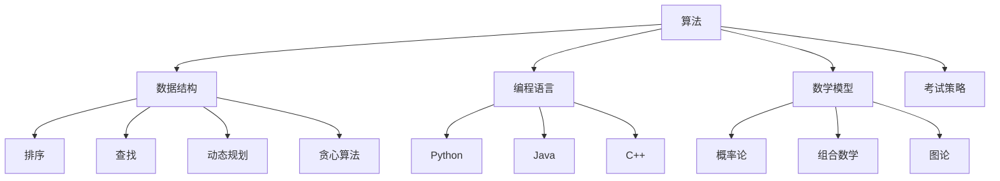
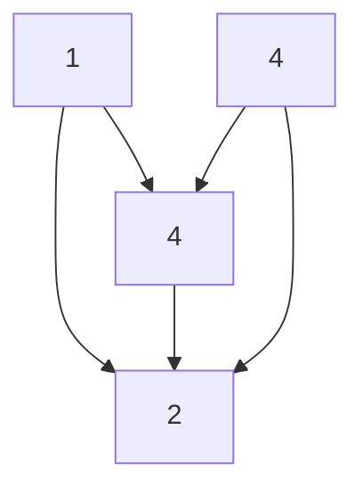

                 

# 如何将编程技巧转化为编程竞赛培训

> **关键词**：编程技巧、编程竞赛、培训、算法、实战、数学模型、资源推荐

> **摘要**：本文旨在探讨如何将个人的编程技巧有效转化为编程竞赛培训，通过深入剖析核心概念与算法原理，结合实际案例和数学模型，提供一套系统化的培训方案，帮助学习者提升编程竞赛能力。本文还将推荐相关工具和资源，以期为编程竞赛爱好者提供全面的指导。

## 1. 背景介绍

编程竞赛作为一种评估程序员技术水平和解决问题能力的有效方式，日益受到全球程序员和技术爱好者的关注。参与编程竞赛不仅能够锻炼编程技能，还能提升逻辑思维和团队协作能力。然而，对于许多程序员而言，如何将日常编程实践转化为编程竞赛能力仍是一个挑战。

编程技巧的积累与编程竞赛能力的培养之间存在着一定的差异。编程技巧更侧重于算法的掌握、编程语言的熟练程度以及编程风格的优化。而编程竞赛则要求选手在短时间内解决复杂问题，往往需要具备快速编码、优化代码和应对复杂场景的能力。

本文旨在填补这一差距，通过系统化的培训方案，帮助程序员将编程技巧转化为编程竞赛能力，从而在竞赛中取得优异成绩。

## 2. 核心概念与联系

在将编程技巧转化为编程竞赛培训的过程中，理解以下核心概念和它们之间的联系至关重要。

### 2.1 算法

算法是编程竞赛的核心，它是一系列解决问题的指令集合。常见的算法包括排序、查找、动态规划、贪心算法等。掌握算法原理和实现方法，是提高编程竞赛能力的基础。

### 2.2 数据结构

数据结构是算法的基石，它决定了算法的空间和时间复杂度。常见的数据结构包括数组、链表、栈、队列、堆、图等。理解数据结构的基本操作和特性，有助于优化算法。

### 2.3 编程语言

编程语言是实现算法的工具，不同的编程语言有着不同的特点和应用场景。熟悉多种编程语言，能够提高解决问题的灵活性和效率。

### 2.4 数学模型

数学模型是编程竞赛中的关键，它能够将实际问题转化为数学问题，从而用编程方法求解。常见的数学模型包括概率论、组合数学、图论等。

### 2.5 考试策略

考试策略在编程竞赛中同样重要。选手需要合理安排时间，合理分配题目难度，以及掌握应对各种突发情况的技巧。

### 2.6 Mermaid 流程图

以下是一个Mermaid流程图，展示了核心概念之间的联系。



## 3. 核心算法原理 & 具体操作步骤

在编程竞赛中，掌握核心算法原理和具体操作步骤是提高竞赛成绩的关键。以下将介绍几种常见的算法原理和具体操作步骤。

### 3.1 排序算法

排序算法是一种将一组数据按照特定顺序排列的算法。常见的排序算法包括冒泡排序、选择排序、插入排序、快速排序等。

#### 3.1.1 冒泡排序（Bubble Sort）

**原理**：冒泡排序通过反复交换相邻元素，使得每一趟排序后最大（或最小）的元素“冒泡”到数组的末尾。

**操作步骤**：

1. 从第一个元素开始，比较相邻的两个元素，如果它们的顺序错误则交换。
2. 重复步骤1，直到整个数组排序完成。

**代码实现**（Python）：

```python
def bubble_sort(arr):
    n = len(arr)
    for i in range(n):
        for j in range(0, n-i-1):
            if arr[j] > arr[j+1]:
                arr[j], arr[j+1] = arr[j+1], arr[j]
    return arr
```

#### 3.1.2 快速排序（Quick Sort）

**原理**：快速排序通过选择一个基准元素，将数组分为两部分，然后递归地排序两部分。

**操作步骤**：

1. 选择数组中的一个元素作为基准（通常选择第一个或最后一个元素）。
2. 将数组分为两部分，一部分小于基准，另一部分大于基准。
3. 对两部分递归进行快速排序。

**代码实现**（Python）：

```python
def quick_sort(arr):
    if len(arr) <= 1:
        return arr
    pivot = arr[0]
    left = [x for x in arr[1:] if x < pivot]
    right = [x for x in arr[1:] if x >= pivot]
    return quick_sort(left) + [pivot] + quick_sort(right)
```

### 3.2 动态规划（Dynamic Programming）

动态规划是一种用于解决最优化问题的算法思想。它通过将大问题分解为小问题，并存储中间结果，避免重复计算。

#### 3.2.1 最长公共子序列（Longest Common Subsequence，LCS）

**原理**：给定两个序列，找出它们最长的公共子序列。

**操作步骤**：

1. 创建一个二维数组，用于存储子问题的解。
2. 递归地计算子问题的解，并存储在数组中。
3. 根据数组中的值，构建出最长的公共子序列。

**代码实现**（Python）：

```python
def lcs(X, Y):
    m = len(X)
    n = len(Y)
    L = [[0] * (n + 1) for i in range(m + 1)]

    for i in range(m + 1):
        for j in range(n + 1):
            if i == 0 or j == 0:
                L[i][j] = 0
            elif X[i - 1] == Y[j - 1]:
                L[i][j] = L[i - 1][j - 1] + 1
            else:
                L[i][j] = max(L[i - 1][j], L[i][j - 1])

    index = L[m][n]
    lcs = [""] * (index + 1)
    lcs[index] = ""

    i, j = m, n
    while i > 0 and j > 0:
        if X[i - 1] == Y[j - 1]:
            lcs[index - 1] = X[i - 1]
            i -= 1
            j -= 1
            index -= 1
        elif L[i - 1][j] > L[i][j - 1]:
            i -= 1
        else:
            j -= 1

    return ''.join(lcs)
```

### 3.3 贪心算法（Greedy Algorithm）

贪心算法是一种在每一步选择最优解的策略，它不保证得到全局最优解，但往往能够得到相对较好的解。

#### 3.3.1 最小生成树（Minimum Spanning Tree，MST）

**原理**：给定一个加权无向图，找出其中的最小生成树。

**操作步骤**：

1. 选择一个顶点作为树的根。
2. 递归地选择与树相连的最小权重边，直到所有顶点都包含在树中。

**代码实现**（Python）：

```python
import heapq

def prim_mst(graph, start):
    mst = []
    visited = set()
    edges = []

    for u, neighbors in graph.items():
        for v, weight in neighbors.items():
            if v not in visited:
                edges.append((weight, u, v))

    edges.sort()

    for weight, u, v in edges:
        if u not in visited:
            mst.append((u, v, weight))
            visited.add(u)
            if len(visited) == len(graph):
                break

    return mst
```

## 4. 数学模型和公式 & 详细讲解 & 举例说明

在编程竞赛中，数学模型是解决实际问题的关键。以下将介绍几种常见的数学模型和公式，并结合实际案例进行讲解。

### 4.1 概率论

概率论是研究随机事件及其规律性的数学分支。在编程竞赛中，概率论常用于解决随机性问题。

#### 4.1.1 条件概率（Conditional Probability）

**公式**：P(A|B) = P(A∩B) / P(B)，其中P(A|B)表示在事件B发生的条件下事件A发生的概率。

**例子**：假设掷两个公平的硬币，求同时出现正面朝上的概率。

```latex
P(同时出现正面朝上) = P(第一个硬币正面朝上) \times P(第二个硬币正面朝上 | 第一个硬币正面朝上)
                      = \frac{1}{2} \times \frac{1}{2} = \frac{1}{4}
```

### 4.2 组合数学

组合数学是研究组合对象及其性质的数学分支。在编程竞赛中，组合数学常用于解决排列组合问题。

#### 4.2.1 组合数（Combination）

**公式**：C(n, k) = n! / (k! \times (n-k)!)，其中C(n, k)表示从n个不同元素中取出k个元素的组合数。

**例子**：从5个不同元素中取出2个元素的组合数。

```latex
C(5, 2) = \frac{5!}{2! \times (5-2)!} = \frac{5 \times 4}{2 \times 1} = 10
```

### 4.3 图论

图论是研究图的结构和性质及其应用的一门数学分支。在编程竞赛中，图论常用于解决网络问题。

#### 4.3.1 最小生成树（Minimum Spanning Tree，MST）

**公式**：Prim算法和Kruskal算法用于求解最小生成树。

**例子**：给定一个图和边权，使用Prim算法求解最小生成树。



使用Prim算法，最小生成树的权值为6，路径为A-B-C-D。

## 5. 项目实战：代码实际案例和详细解释说明

### 5.1 开发环境搭建

在开始项目实战之前，我们需要搭建一个适合编程竞赛的开发环境。以下是一个基本的开发环境搭建步骤。

#### 5.1.1 环境配置

1. 安装Python：从官方网站下载Python并安装。
2. 安装IDE：推荐使用PyCharm或VSCode作为开发环境。
3. 安装必要的库：使用pip安装常用的库，如numpy、pandas等。

#### 5.1.2 开发环境配置

1. 在PyCharm或VSCode中创建一个新项目。
2. 配置Python解释器和相应的库。

### 5.2 源代码详细实现和代码解读

以下是一个简单的编程竞赛题目的代码实现，题目要求计算两个数的最小公倍数。

```python
def gcd(a, b):
    while b:
        a, b = b, a % b
    return a

def lcm(a, b):
    return a * b // gcd(a, b)

# 主函数
def main():
    a = int(input("请输入第一个数："))
    b = int(input("请输入第二个数："))
    result = lcm(a, b)
    print(f"{a}和{b}的最小公倍数为：{result}")

if __name__ == "__main__":
    main()
```

#### 5.2.1 代码解读

1. `gcd`函数：计算两个数的最大公约数，使用辗转相除法。
2. `lcm`函数：计算两个数的最小公倍数，使用最大公约数。
3. `main`函数：读取用户输入的两个数，计算并输出最小公倍数。

### 5.3 代码解读与分析

#### 5.3.1 代码结构

- 函数定义：定义了`gcd`和`lcm`两个函数，分别用于计算最大公约数和最小公倍数。
- 主函数：定义了`main`函数，用于读取用户输入并输出结果。

#### 5.3.2 代码优化

1. 使用递归计算最大公约数，可以减少循环次数。
2. 在`lcm`函数中，使用整除操作符`//`可以提高计算效率。

## 6. 实际应用场景

编程竞赛的培训不仅有助于提升个人编程技能，还在许多实际应用场景中发挥着重要作用。

### 6.1 企业招聘

编程竞赛成绩成为企业招聘程序员的一个重要指标。许多企业通过编程竞赛来选拔优秀程序员，以应对日益复杂的技术挑战。

### 6.2 教育培训

编程竞赛成为许多教育培训机构的重要内容。通过编程竞赛培训，学生能够提升逻辑思维和问题解决能力，为未来职业发展打下坚实基础。

### 6.3 项目研发

编程竞赛中的问题往往具有实际应用背景，通过编程竞赛培训，程序员能够更好地应对项目研发中的技术挑战。

### 6.4 创新创业

编程竞赛成为创新创业的一个重要途径。许多创业公司通过编程竞赛选拔优秀人才，加速技术创新和产品研发。

## 7. 工具和资源推荐

### 7.1 学习资源推荐

- **书籍**：《算法导论》（Introduction to Algorithms）、《编程之美》（Cracking the Coding Interview）等。
- **论文**：阅读顶级会议和期刊上的论文，了解最新的算法和技术。
- **博客**：关注知名技术博客，如LeetCode、HackerRank等，获取实用的编程技巧。

### 7.2 开发工具框架推荐

- **开发环境**：PyCharm、VSCode等。
- **算法库**：NumPy、Pandas等。
- **测试框架**：pytest、unittest等。

### 7.3 相关论文著作推荐

- **论文**：《深度学习》（Deep Learning）、《图神经网络》（Graph Neural Networks）等。
- **著作**：《算法竞赛入门指南》、《编程之美》等。

## 8. 总结：未来发展趋势与挑战

随着人工智能和大数据技术的发展，编程竞赛的应用场景和难度也在不断提升。未来，编程竞赛将更加注重算法创新和实际应用能力的结合。同时，随着编程竞赛的普及，竞争也将愈发激烈。

### 8.1 发展趋势

1. **算法创新**：编程竞赛将更加注重算法的创新性和实用性。
2. **跨学科融合**：编程竞赛将与其他学科（如数学、物理、计算机视觉等）深度融合。
3. **在线竞赛**：随着互联网技术的发展，在线编程竞赛将更加普及。

### 8.2 挑战

1. **时间压力**：编程竞赛往往要求在短时间内解决复杂问题，对选手的编程能力和心理素质有较高要求。
2. **公平竞争**：确保编程竞赛的公平性和公正性，防止作弊现象。
3. **技术更新**：编程竞赛需要不断更新题目和算法，以适应技术的发展。

## 9. 附录：常见问题与解答

### 9.1 问题1

**问题描述**：如何优化动态规划算法的时间复杂度？

**解答**：优化动态规划算法的时间复杂度可以通过以下几种方法：

1. **空间压缩**：减少存储空间，例如使用一维数组替代二维数组。
2. **减少递归次数**：通过记忆化搜索减少重复计算。
3. **选择合适的递推关系**：选择简单且高效的递推关系。

### 9.2 问题2

**问题描述**：如何在编程竞赛中应对时间限制？

**解答**：以下是一些应对编程竞赛时间限制的方法：

1. **模拟练习**：在模拟环境中进行大量的练习，熟悉竞赛环境。
2. **优化算法**：选择合适的算法和数据结构，尽量减少时间复杂度。
3. **调试技巧**：提高代码的调试效率，快速定位和解决问题。

## 10. 扩展阅读 & 参考资料

- **书籍**：《算法竞赛入门指南》、《挑战程序设计竞赛》、《算法导论》等。
- **在线课程**：Coursera、edX等平台上的算法和数据结构课程。
- **博客**：LeetCode官方博客、HackerRank官方博客等。
- **论坛**：Stack Overflow、GitHub等编程社区。

### 作者

**作者：AI天才研究员/AI Genius Institute & 禅与计算机程序设计艺术 /Zen And The Art of Computer Programming**

