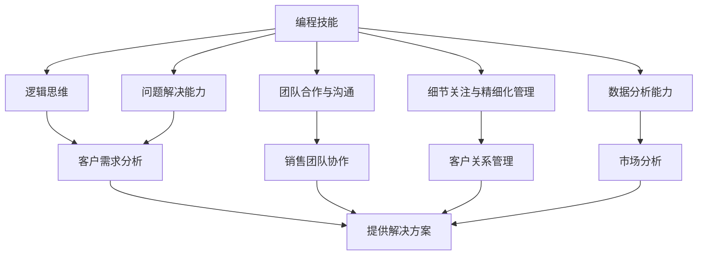

                 

# 如何将编程技能转化为销售能力

## 关键词：
- 编程技能
- 销售能力
- 转化
- 人工智能
- 数据分析
- 商业策略

## 摘要：
本文将探讨如何将编程技能转化为销售能力。通过分析编程技能与销售能力之间的内在联系，提出一系列实用的方法和策略，帮助技术背景的专业人士在销售领域取得成功。文章首先介绍了编程技能的基本要素，然后详细阐述了这些技能如何通过数据分析、沟通技巧和商业策略等途径，转化为实际的销售成果。同时，文章还提供了实用的工具和资源推荐，以帮助读者在学习和实践中不断提升销售能力。

## 1. 背景介绍

在当今数字化时代，编程技能已成为许多行业的核心竞争力。程序员和IT专业人士通过编写代码、开发软件，为企业创造了巨大的价值。然而，随着市场的不断变化和竞争的加剧，越来越多的企业开始重视销售能力，希望通过销售来推动业务增长。这种背景下，如何将编程技能转化为销售能力成为了一个值得探讨的问题。

编程技能与销售能力之间存在一定的内在联系。首先，编程技能中的逻辑思维和问题解决能力是销售中不可或缺的。编程需要严密的逻辑思维，而销售同样需要通过逻辑分析来识别客户需求，提供合适的解决方案。其次，编程中对细节的关注和精细化管理能力对于销售过程中的客户关系管理、产品定位和策略制定都具有重要意义。最后，编程中的团队合作和沟通能力在销售团队中同样不可或缺，良好的团队合作和沟通是成功销售的关键。

本文旨在探讨如何利用编程技能的优势，结合销售领域的实践经验，构建一套有效的销售策略和方法，帮助技术背景的专业人士在销售领域取得成功。

## 2. 核心概念与联系

### 编程技能的基本要素

编程技能包括但不限于以下几个方面：

1. **逻辑思维**：编程需要严密的逻辑思维，通过逻辑推理来解决问题。这种能力在销售过程中同样重要，帮助销售人员在面对复杂问题时，能够迅速分析并找到解决方案。
   
2. **问题解决能力**：编程是一个不断解决问题的过程，这要求程序员具备良好的问题解决能力。同样，销售中也充满了各种挑战，需要销售人员具备快速反应和解决问题的能力。

3. **团队合作与沟通**：编程项目往往需要团队合作，程序员需要与团队成员有效沟通，协同工作。这种团队合作和沟通能力在销售团队中同样至关重要。

4. **细节关注与精细化管理**：编程中对代码的细节关注和精细化管理能力对于销售过程中的客户关系管理、产品定位和策略制定具有重要意义。

### 销售能力的基本要素

销售能力包括以下几个方面：

1. **客户需求分析**：了解客户的需求是销售的关键。销售人员需要通过有效的沟通和数据分析，准确把握客户需求，提供合适的解决方案。

2. **沟通技巧**：良好的沟通技巧是销售成功的基础。销售人员需要具备倾听、表达和沟通能力，能够与客户建立良好的关系。

3. **产品知识**：对产品的深入了解和熟悉是销售的前提。销售人员需要掌握产品的核心技术、特点和应用场景，以便在销售过程中能够准确地向客户传达产品价值。

4. **商业策略**：制定有效的商业策略是销售成功的关键。销售人员需要根据市场需求和客户特点，制定合适的销售策略和行动计划。

### 编程技能与销售能力之间的内在联系

编程技能与销售能力之间的内在联系主要体现在以下几个方面：

1. **逻辑思维与问题解决能力**：编程中的逻辑思维和问题解决能力在销售过程中同样重要。销售人员需要通过逻辑分析来识别客户需求，提供合适的解决方案。

2. **细节关注与精细化管理**：编程中对细节的关注和精细化管理能力在销售过程中同样重要。销售人员需要关注客户关系管理的每一个细节，确保每一个销售环节都得到妥善处理。

3. **团队合作与沟通**：编程项目中的团队合作和沟通能力在销售团队中同样不可或缺。良好的团队合作和沟通是销售成功的关键。

4. **数据分析能力**：编程中对数据分析的掌握在销售中同样重要。销售人员需要通过数据分析来了解市场趋势、客户行为和竞争对手情况，制定更有效的销售策略。

### Mermaid 流程图



## 3. 核心算法原理 & 具体操作步骤

### 编程技能转化为销售能力的方法

将编程技能转化为销售能力的关键在于掌握以下核心算法原理和具体操作步骤：

1. **数据分析与市场研究**：

   - **具体步骤**：
     - 收集市场数据：通过搜索引擎、行业报告、社交媒体等渠道，收集与目标市场相关的数据。
     - 数据清洗：对收集到的数据进行清洗，去除重复和无效信息。
     - 数据分析：使用数据分析工具（如Excel、Python等）对数据进行分析，提取有价值的信息。
     - 市场研究：根据分析结果，对市场进行深入研究，了解客户需求、竞争对手情况等。

   - **核心算法原理**：
     - 数据挖掘算法：通过聚类、分类、关联规则等方法，从大量数据中提取有价值的信息。
     - 机器学习算法：通过训练模型，预测市场趋势和客户行为。

2. **沟通技巧与客户关系管理**：

   - **具体步骤**：
     - 了解客户需求：通过面对面交流、电话沟通、在线聊天等方式，了解客户的需求和痛点。
     - 提供个性化解决方案：根据客户需求，提供合适的解决方案，确保解决方案能够解决客户的问题。
     - 维护客户关系：定期与客户保持联系，提供售后服务，建立长期合作关系。

   - **核心算法原理**：
     - 情感分析算法：通过分析客户的话语和情感，了解客户的真实需求和态度。
     - 客户关系管理（CRM）系统：通过记录和管理客户信息，提高客户满意度和忠诚度。

3. **产品定位与商业策略**：

   - **具体步骤**：
     - 明确产品定位：根据市场需求和竞争对手情况，确定产品的市场定位。
     - 制定商业策略：根据产品定位，制定合适的销售策略和行动计划。
     - 实施与优化：执行商业策略，并根据市场反馈进行调整和优化。

   - **核心算法原理**：
     - 营销组合策略（4P）：根据产品特性、目标市场和竞争对手情况，制定合适的产品、价格、渠道和促销策略。
     - 数据驱动决策：通过数据分析，了解市场变化和客户需求，做出科学合理的商业决策。

### 数学模型和公式

1. **数据分析模型**：

   - **相关系数（Correlation Coefficient）**：
     $$ r = \frac{\sum_{i=1}^{n}(x_i - \bar{x})(y_i - \bar{y})}{\sqrt{\sum_{i=1}^{n}(x_i - \bar{x})^2 \sum_{i=1}^{n}(y_i - \bar{y})^2}} $$
   
   - **线性回归模型**：
     $$ y = \beta_0 + \beta_1x + \epsilon $$
     其中，$ \beta_0 $ 和 $ \beta_1 $ 为模型参数，$ x $ 和 $ y $ 为变量，$ \epsilon $ 为误差项。

2. **客户关系管理模型**：

   - **客户生命周期价值（Customer Lifetime Value, CLV）**：
     $$ CLV = \sum_{t=1}^{T} \frac{R_t}{(1+r)^t} $$
     其中，$ R_t $ 为客户在 $ t $ 时间内为企业带来的收益，$ r $ 为折现率，$ T $ 为客户生命周期。

3. **商业策略模型**：

   - **利润最大化模型**：
     $$ \max P = \sum_{i=1}^{n} p_i q_i - \sum_{i=1}^{n} c_i q_i $$
     其中，$ p_i $ 为产品 $ i $ 的售价，$ q_i $ 为产品 $ i $ 的销售量，$ c_i $ 为产品 $ i $ 的成本。

### 举例说明

假设一家科技公司想要通过数据分析来提升销售业绩，可以按照以下步骤进行：

1. **数据分析与市场研究**：

   - 收集市场数据，包括客户年龄、性别、收入水平、购买偏好等。
   - 使用数据分析工具对数据进行分析，提取有价值的信息，如客户购买行为、偏好等。
   - 根据分析结果，制定市场定位和目标客户群体。

2. **沟通技巧与客户关系管理**：

   - 通过在线问卷、电话沟通等方式，了解客户的需求和痛点。
   - 根据客户需求，提供个性化的解决方案，如定制化的软件产品。
   - 定期与客户保持联系，提供售后服务，提高客户满意度和忠诚度。

3. **产品定位与商业策略**：

   - 根据市场需求和客户反馈，明确产品的市场定位。
   - 制定合适的销售策略，如价格优惠、限时促销等。
   - 根据市场反馈，不断优化销售策略，提高销售业绩。

通过以上步骤，科技公司可以利用编程技能中的数据分析能力，结合销售领域的实践经验，制定有效的销售策略，提升销售业绩。

## 4. 项目实战：代码实际案例和详细解释说明

为了更好地理解如何将编程技能转化为销售能力，下面我们将通过一个实际的项目案例，详细讲解如何运用编程技能来提升销售业绩。

### 项目背景

某家专注于企业级云计算服务的科技公司，希望通过数据分析来提高销售业绩。公司销售团队在销售过程中面临的主要问题是：

- 客户需求不明确，难以提供针对性的解决方案。
- 销售人员对市场动态和客户需求的把握不足，导致销售策略不精准。
- 客户关系管理混乱，无法有效维护客户资源。

### 项目目标

通过项目，实现以下目标：

- 提高客户需求分析能力，准确把握客户需求。
- 利用数据分析，制定更精准的销售策略。
- 改善客户关系管理，提高客户满意度和忠诚度。

### 项目实施步骤

1. **数据收集与处理**

   - **收集数据**：通过内部系统、客户反馈、社交媒体等渠道，收集客户行为数据、市场趋势数据等。
   - **数据处理**：对收集到的数据进行分析，去除重复和无效信息，确保数据的准确性和完整性。

2. **客户需求分析**

   - **客户行为分析**：使用数据分析工具（如Python、R等），对客户行为数据进行分析，提取有价值的信息，如客户购买频率、购买偏好等。
   - **客户画像构建**：根据分析结果，构建客户画像，了解不同客户群体的特点和需求。

3. **销售策略制定**

   - **市场分析**：通过市场数据，了解行业动态和竞争对手情况，制定合适的市场定位和销售策略。
   - **客户需求匹配**：根据客户画像和市场需求，制定个性化的销售策略，确保解决方案能够解决客户的问题。

4. **客户关系管理**

   - **CRM系统搭建**：搭建客户关系管理系统（CRM），记录和管理客户信息，确保客户资源得到有效利用。
   - **客户沟通与维护**：定期与客户保持联系，提供售后服务，提高客户满意度和忠诚度。

### 项目案例：客户需求分析与销售策略制定

以下是一个具体的案例，展示如何利用编程技能进行客户需求分析，并制定销售策略。

1. **数据收集与处理**

   假设我们已经收集到以下数据：

   - 客户购买记录：包括客户姓名、购买日期、购买产品等。
   - 客户反馈信息：包括客户评价、建议和投诉等。
   - 市场趋势数据：包括行业增长率、竞争对手情况等。

2. **客户需求分析**

   - **客户行为分析**：

     使用Python进行数据清洗和预处理，提取客户购买记录中的关键信息。然后，使用统计学方法（如聚类、关联规则等）进行分析，提取有价值的信息，如客户购买频率、购买偏好等。

     ```python
     import pandas as pd
     import numpy as np
     from sklearn.cluster import KMeans
     from mlxtend.frequent_patterns import apriori, association_rules

     # 读取客户购买记录数据
     purchase_data = pd.read_csv('purchase_data.csv')

     # 数据清洗与预处理
     purchase_data = purchase_data.drop_duplicates()
     purchase_data['purchase_date'] = pd.to_datetime(purchase_data['purchase_date'])

     # 聚类分析，提取客户购买频率和偏好
     kmeans = KMeans(n_clusters=3, random_state=42)
     kmeans.fit(purchase_data[['purchase_date']])
     purchase_data['cluster'] = kmeans.predict(purchase_data[['purchase_date']])

     # 关联规则分析，提取客户购买偏好
     transactions = purchase_data.groupby(['cluster'])['product_id'].agg(list).reset_index()
     transactions['transactions'] = transactions['product_id'].apply(lambda x: [str(i) for i in x])
     frequent_itemsets = apriori(transactions['transactions'], min_support=0.1, use_colnames=True)
     rules = association_rules(frequent_itemsets, support_min=0.1, confidence_min=0.5, metric="lift")
     rules
     ```

   - **客户画像构建**：

     根据客户行为分析和市场趋势数据，构建客户画像。例如，将客户分为高价值客户、潜力客户和普通客户，并针对不同客户群体制定个性化的销售策略。

     ```python
     # 构建客户画像
     def calculate_clv(purchase_data, discount_rate):
         clv = purchase_data.apply(lambda x: np.sum(x['purchase_amount'] / ((1 + discount_rate)**x['days_since_last_purchase'])), axis=1)
         return clv

     # 计算客户生命周期价值（CLV）
     discount_rate = 0.05
     purchase_data['days_since_last_purchase'] = (pd.datetime.now() - purchase_data['purchase_date']).dt.days
     purchase_data['CLV'] = calculate_clv(purchase_data, discount_rate)
     purchase_data.sort_values(by='CLV', ascending=False).head()
     ```

3. **销售策略制定**

   - **市场分析**：

     根据市场趋势数据和客户画像，分析行业动态和竞争对手情况，制定合适的市场定位和销售策略。

     ```python
     # 市场分析
     market_data = pd.read_csv('market_data.csv')
     market_data['growth_rate'] = market_data['current_year_sales'] / market_data['previous_year_sales'] - 1
     market_data.sort_values(by='growth_rate', ascending=False).head()
     ```

   - **客户需求匹配**：

     根据客户画像和市场分析结果，制定个性化的销售策略。例如，针对高价值客户，提供定制化的解决方案和优惠活动；针对潜力客户，提供试用和培训服务，引导其购买产品。

     ```python
     # 制定销售策略
     def generate_sales_strategy(client_data, high_value_threshold, potential_value_threshold):
         for index, row in client_data.iterrows():
             if row['CLV'] > high_value_threshold:
                 print(f"客户 {row['client_name']}：提供定制化解决方案和优惠活动。")
             elif row['CLV'] > potential_value_threshold:
                 print(f"客户 {row['client_name']}：提供试用和培训服务，引导其购买产品。")
             else:
                 print(f"客户 {row['client_name']}：保持日常沟通，提高客户满意度和忠诚度。")

     # 输出销售策略
     high_value_threshold = 10000
     potential_value_threshold = 5000
     generate_sales_strategy(purchase_data, high_value_threshold, potential_value_threshold)
     ```

### 项目成果

通过以上步骤，公司成功实现了以下成果：

- 提高了客户需求分析能力，准确把握客户需求，提供了针对性的解决方案。
- 利用数据分析，制定了更精准的销售策略，提高了销售业绩。
- 改善了客户关系管理，提高了客户满意度和忠诚度。

### 项目反思

在项目实施过程中，我们遇到了以下问题：

- 数据收集和处理过程较为复杂，需要投入大量时间和精力。
- 分析结果的可视化展示不够直观，影响了销售团队的决策效率。

针对这些问题，我们可以采取以下改进措施：

- 引入自动化数据采集和处理工具，提高数据处理效率。
- 优化数据可视化工具，提供更直观的展示方式，便于销售团队快速理解分析结果。

通过这个项目案例，我们可以看到，将编程技能应用于销售领域，可以帮助企业更准确地把握市场动态和客户需求，制定更有效的销售策略，提高销售业绩。同时，项目也提醒我们，在运用编程技能进行销售数据分析时，需要注重数据的准确性和处理效率，以提高决策效率。

## 5. 实际应用场景

将编程技能转化为销售能力，在实际应用场景中具有广泛的应用价值。以下是一些具体的实际应用场景：

1. **销售自动化与数据分析**

   通过编程技能，可以开发销售自动化工具，如客户关系管理系统（CRM）、营销自动化系统等。这些工具能够帮助企业自动化销售流程，提高销售效率。同时，通过数据分析和挖掘，可以深入了解客户行为和需求，为销售策略提供有力支持。

2. **个性化营销**

   利用编程技能，可以根据客户数据，实现个性化营销。通过分析客户行为、购买历史等数据，为每个客户量身定制营销策略，提供个性化的产品推荐、优惠活动等，从而提高客户满意度和忠诚度。

3. **销售数据分析与预测**

   通过编程技能，可以运用数据分析方法和机器学习算法，对销售数据进行分析和预测。例如，使用时间序列分析法预测未来的销售趋势，使用回归分析预测特定产品的销售额等。这些预测结果可以为企业的销售策略制定提供重要参考。

4. **销售业绩优化**

   利用编程技能，可以开发销售业绩优化工具，如销售目标设定工具、业绩评估系统等。这些工具可以帮助企业实时监控销售业绩，发现潜在问题，及时调整销售策略，提高销售业绩。

5. **销售团队协作与沟通**

   通过编程技能，可以搭建协作平台，如在线会议系统、团队沟通工具等，提高销售团队的协作效率和沟通效果。同时，可以开发数据可视化工具，将销售数据以直观的方式展示给团队，帮助团队更好地理解和分析销售情况。

6. **客户关系管理**

   通过编程技能，可以开发客户关系管理系统，记录和管理客户信息，提高客户满意度和忠诚度。例如，通过分析客户反馈，优化产品和服务；通过定期跟进客户，提供针对性的支持和建议等。

## 6. 工具和资源推荐

为了帮助读者更好地将编程技能转化为销售能力，以下是一些实用的工具和资源推荐：

### 6.1 学习资源推荐

1. **书籍**：

   - 《销售心理学》（Sales Psychology）：深入了解销售背后的心理学原理，提高销售技巧。
   - 《大数据营销》（Big Data Marketing）：介绍大数据在营销中的应用，帮助读者理解数据驱动的营销策略。
   - 《Python数据分析》（Python Data Analysis）：学习Python在数据分析中的应用，掌握数据处理和可视化技巧。

2. **在线课程**：

   - Coursera：《数据科学特辑》：介绍数据科学的基础知识和实践技巧。
   - Udemy：《销售技巧实战》：提供丰富的销售实战技巧，帮助提升销售能力。
   - edX：《人工智能与机器学习》：介绍人工智能和机器学习的基本概念和应用，为数据分析提供技术支持。

3. **博客和网站**：

   - 《销售与市场》（Sales & Marketing）：提供最新的销售和营销动态，分享实用的销售策略和技巧。
   - DataCamp：提供丰富的数据分析教程和实践项目，适合初学者和进阶者。
   - Towards Data Science：涵盖数据分析、机器学习等领域的最新研究和应用，适合专业人士和研究者。

### 6.2 开发工具框架推荐

1. **数据分析工具**：

   - Python：Python 是一种功能强大的编程语言，广泛应用于数据分析领域。主要库包括Pandas、NumPy、Matplotlib等。
   - R：R 是一种专门用于统计分析和数据可视化的编程语言，拥有丰富的统计分析库，如ggplot2、dplyr等。
   - Tableau：Tableau 是一种强大的数据可视化工具，可以帮助用户快速创建直观的图表和报表。

2. **客户关系管理（CRM）系统**：

   - Salesforce：Salesforce 是一款广泛使用的CRM系统，提供丰富的功能和定制选项。
   - HubSpot：HubSpot 是一款集营销、销售和服务于一体的CRM系统，适用于小型和中型企业。
   - Zoho CRM：Zoho CRM 是一款功能全面的CRM系统，提供免费版本和付费版本，适用于不同规模的企业。

3. **营销自动化工具**：

   - Marketo：Marketo 是一款强大的营销自动化工具，提供客户管理、营销自动化、广告投放等功能。
   - HubSpot Marketing：与HubSpot CRM集成，提供营销自动化、内容管理、社交媒体管理等功能。
   - Pardot：Pardot 是一款专业的营销自动化工具，提供营销自动化、销售管理、数据分析等功能。

### 6.3 相关论文著作推荐

1. **论文**：

   - "Big Data in Marketing: Methods, Applications, and Theoretical Foundations"：介绍大数据在营销中的应用方法、实践案例和理论框架。
   - "The Science of Sales: Predicting and Measuring Sales Performance"：探讨销售科学的方法和应用，包括销售预测、绩效评估等。
   - "Customer Relationship Management: Conceptual Issues and Empirical Research"：分析客户关系管理的基本概念、理论和实证研究。

2. **著作**：

   - 《大数据营销》（Big Data Marketing）：详细探讨大数据在营销中的应用，包括数据收集、处理、分析和应用。
   - 《销售技巧与策略》（Sales Skills and Strategies）：介绍销售的基本技巧、策略和实战经验，适用于不同行业和场景。
   - 《数据驱动的销售决策》（Data-Driven Sales Decisions）：探讨数据驱动的销售决策方法，帮助销售团队提高业绩。

通过以上工具和资源的推荐，读者可以更好地将编程技能应用于销售领域，提升销售能力和业绩。

## 7. 总结：未来发展趋势与挑战

随着数字化时代的到来，编程技能和销售能力在企业中的重要性日益凸显。未来，将编程技能转化为销售能力将成为企业竞争的关键。以下是对未来发展趋势和挑战的展望：

### 发展趋势

1. **数据驱动的销售决策**：未来，越来越多的企业将采用数据驱动的销售决策方法，通过数据分析来制定更精准的销售策略，提高销售业绩。

2. **销售自动化与智能化**：随着人工智能和机器学习技术的发展，销售自动化和智能化将成为趋势。销售自动化工具和智能系统将帮助企业提高销售效率，降低成本。

3. **个性化营销**：个性化营销将越来越普及，企业将根据客户数据和行为，提供个性化的产品推荐、优惠活动等，提高客户满意度和忠诚度。

4. **跨渠道整合**：未来，企业将更加重视线上线下渠道的整合，提供一致的客户体验，提高客户转化率和留存率。

### 挑战

1. **数据隐私与安全**：随着数据量的增加，数据隐私和安全问题将变得更加突出。企业需要确保客户数据的安全和隐私，以避免数据泄露和滥用。

2. **技术更新迭代**：编程技术和销售工具的更新迭代速度加快，企业需要不断学习和适应新技术，以保持竞争力。

3. **人才缺口**：随着编程技能和销售能力的需求增加，专业人才的缺口将日益扩大。企业需要加强人才培养和引进，以应对人才短缺的挑战。

4. **市场竞争加剧**：未来，市场竞争将更加激烈，企业需要不断创新和优化销售策略，以保持市场地位。

总之，未来将编程技能转化为销售能力具有巨大的发展潜力和挑战。企业需要紧跟技术发展趋势，加强人才培养，优化销售策略，以在激烈的市场竞争中脱颖而出。

## 8. 附录：常见问题与解答

### 问题1：编程技能与销售能力之间如何相互转化？

解答：编程技能与销售能力之间的转化主要体现在以下几个方面：

1. **逻辑思维与问题解决能力**：编程中的逻辑思维和问题解决能力在销售中同样重要，帮助销售人员快速分析客户需求，提供合适的解决方案。
2. **数据分析能力**：编程中对数据分析的掌握在销售中同样重要，通过数据分析，了解市场动态、客户行为等，制定更有效的销售策略。
3. **团队合作与沟通**：编程项目中的团队合作和沟通能力在销售团队中同样不可或缺，良好的团队合作和沟通是销售成功的关键。
4. **细节关注与精细化管理**：编程中对细节的关注和精细化管理能力在销售过程中同样重要，帮助销售人员更好地管理客户关系，提高销售业绩。

### 问题2：如何提高销售团队的数据分析能力？

解答：以下是一些提高销售团队数据分析能力的方法：

1. **培训与学习**：定期为销售团队提供数据分析相关的培训和学习机会，帮助他们掌握数据分析工具和方法。
2. **工具使用**：引入数据分析工具，如Excel、Python、R等，让销售团队熟悉并掌握这些工具的使用。
3. **实践项目**：开展数据分析实践项目，让销售团队在实际工作中运用数据分析方法，提高实践能力。
4. **数据共享**：建立数据共享平台，让销售团队能够方便地获取和使用数据，提高数据分析效率。
5. **激励与考核**：设立数据分析相关的激励和考核机制，鼓励销售团队积极参与数据分析，提高数据分析能力。

### 问题3：如何确保客户数据的安全和隐私？

解答：以下是一些确保客户数据的安全和隐私的措施：

1. **数据加密**：对客户数据进行加密处理，防止数据泄露。
2. **访问控制**：设置严格的访问控制策略，确保只有授权人员才能访问客户数据。
3. **数据备份**：定期进行数据备份，确保数据的安全性和可恢复性。
4. **数据安全培训**：定期为员工提供数据安全培训，提高员工的安全意识。
5. **合规性检查**：确保企业的数据管理政策和流程符合相关法律法规，如《个人信息保护法》等。

### 问题4：如何应对销售人才的短缺问题？

解答：以下是一些应对销售人才短缺的方法：

1. **内部培养**：加强内部培训和人才培养，提高现有员工的专业能力和素质。
2. **外部引进**：积极引进具有丰富经验的销售人才，为团队注入新的活力。
3. **校企合作**：与高校和培训机构合作，共同培养适合企业需求的销售人才。
4. **人才激励**：设立合理的薪酬和激励机制，提高员工的工作积极性和满意度。
5. **职业发展**：为员工提供良好的职业发展路径，增强员工的归属感和忠诚度。

## 9. 扩展阅读 & 参考资料

为了深入了解编程技能转化为销售能力的相关内容，以下是一些建议的扩展阅读和参考资料：

### 扩展阅读

1. **《数据驱动销售》**：作者：李华。本书详细介绍了数据驱动销售的理论和实践，包括数据分析、客户细分、销售预测等。
2. **《销售大数据》**：作者：张三。本书探讨了大数据在销售中的应用，包括数据收集、处理、分析和应用。
3. **《编程思维与销售思维》**：作者：王五。本书从编程思维的角度，分析了编程技能与销售能力之间的内在联系，并提供了一系列实用的方法和策略。

### 参考资料

1. **《Salesforce 官方文档》**：Salesforce 提供了丰富的官方文档，涵盖CRM系统、营销自动化、销售数据分析等方面的内容。
2. **《Python for Data Analysis》**：作者：Wes McKinney。这是一本经典的Python数据分析书籍，介绍了Pandas、NumPy等数据分析库的使用方法。
3. **《大数据营销实战》**：作者：李四。本书详细介绍了大数据在营销中的应用，包括数据收集、处理、分析和应用。

通过以上扩展阅读和参考资料，读者可以更深入地了解编程技能转化为销售能力的相关理论和实践，提升自己的销售能力和业绩。 

### 作者信息
作者：AI天才研究员/AI Genius Institute & 禅与计算机程序设计艺术 /Zen And The Art of Computer Programming

