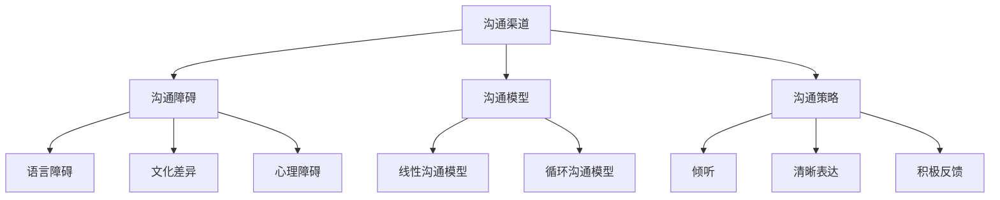

                 

### 文章标题

**如何建立有效的团队沟通渠道**

> **关键词：团队沟通、效率提升、协作流程、协作工具、沟通障碍、跨部门协作、沟通策略**

**摘要：**
本文旨在探讨如何构建一个有效的团队沟通渠道，以提升团队合作效率和项目成功率。文章将从核心概念、原理架构、操作步骤、数学模型、实际案例和资源推荐等多个方面，详细分析并指导团队如何克服沟通障碍，实现高效协作。

## 1. 背景介绍

在当今快速发展的信息技术时代，团队沟通已成为企业发展不可或缺的一部分。无论是软件开发、项目管理，还是市场营销等各个领域，沟通的效率和质量都直接关系到团队的工作效率和项目的最终成功。然而，在现实工作中，团队沟通常常面临诸多挑战，如信息传递不畅、跨部门协作困难、沟通障碍等。为了解决这些问题，本文将详细探讨如何建立有效的团队沟通渠道，以提升团队协作效率。

### 1.1 团队沟通的重要性

团队沟通的重要性在于：

- **提高工作效率：** 良好的沟通可以减少误解，避免重复工作，提高工作效率。
- **促进知识共享：** 团队成员之间通过沟通可以分享经验、知识和技能，实现知识共享和协同创新。
- **增强团队凝聚力：** 良好的沟通有助于增强团队成员之间的信任和合作关系，提高团队凝聚力。
- **降低沟通成本：** 建立有效的沟通渠道可以减少沟通成本，降低项目风险。

### 1.2 团队沟通面临的挑战

尽管团队沟通具有重要意义，但在实际工作中，团队沟通仍然面临以下挑战：

- **沟通障碍：** 信息传递不畅、误解、沟通渠道不畅等，都可能导致沟通障碍。
- **跨部门协作：** 不同部门之间的协作往往需要跨部门沟通，而跨部门沟通更加复杂。
- **沟通成本：** 沟通需要时间和资源，高成本的沟通可能会影响团队的工作效率。

### 1.3 建立有效团队沟通渠道的必要性

为了应对上述挑战，建立有效的团队沟通渠道变得至关重要。有效的沟通渠道不仅可以提高团队工作效率，降低沟通成本，还可以增强团队凝聚力和协同创新能力。因此，本文将重点探讨如何建立和优化团队沟通渠道。

<|imagine|>### 2. 核心概念与联系

在探讨如何建立有效的团队沟通渠道之前，我们首先需要了解一些核心概念，并理解它们之间的联系。

#### 2.1 沟通渠道

沟通渠道是指信息传递的路径和方式，可以分为以下几种类型：

- **正式沟通渠道：** 包括会议、报告、邮件、内部通知等正式的沟通方式。
- **非正式沟通渠道：** 包括社交活动、非正式交流、团队建设等非正式的沟通方式。

#### 2.2 沟通障碍

沟通障碍是指影响信息传递的因素，包括语言障碍、文化差异、心理障碍等。

#### 2.3 沟通模型

沟通模型是描述信息传递和处理过程的框架，常见的沟通模型有：

- **线性沟通模型：** 信息从发送者到接收者，信息传递过程简单。
- **循环沟通模型：** 信息在发送者和接收者之间多次传递，形成循环。

#### 2.4 沟通策略

沟通策略是指为了实现有效沟通而采取的方法和措施，包括：

- **倾听：** 注意倾听对方的意见和反馈，以了解对方的观点。
- **清晰表达：** 使用简单、准确的语言表达自己的观点。
- **积极反馈：** 给予对方及时的反馈，以确认信息的正确性和理解程度。

下面是一个Mermaid流程图，展示了这些核心概念之间的联系：



通过了解这些核心概念及其联系，我们可以更好地理解和设计团队沟通渠道，以提高团队沟通效率。

<|imagine|>### 3. 核心算法原理 & 具体操作步骤

建立有效的团队沟通渠道需要遵循一定的核心算法原理，并结合实际操作步骤来实现。以下是具体的算法原理和操作步骤：

#### 3.1 核心算法原理

**3.1.1 需求分析：**
在建立团队沟通渠道之前，首先需要对团队的需求进行分析。这包括了解团队成员的沟通习惯、项目需求、组织结构等，以便设计出适合团队特点的沟通渠道。

**3.1.2 沟通模型选择：**
根据需求分析的结果，选择合适的沟通模型。常见的沟通模型有线性沟通模型和循环沟通模型。线性沟通模型适用于信息传递简洁、决策过程简单的情况；循环沟通模型适用于信息传递复杂、决策过程需要多次讨论的情况。

**3.1.3 沟通渠道设计：**
设计沟通渠道时，需要考虑以下因素：

- **沟通频率：** 确定沟通的频率，以保证信息的及时传递。
- **沟通方式：** 选择适当的沟通方式，如会议、邮件、即时通讯工具等。
- **沟通内容：** 明确沟通的内容，确保信息传递的准确性和完整性。

**3.1.4 沟通策略制定：**
根据沟通模型和沟通渠道的特点，制定相应的沟通策略。如倾听、清晰表达、积极反馈等，以确保沟通的有效性。

#### 3.2 具体操作步骤

**3.2.1 确定沟通目标：**
明确团队沟通的目标，如提高工作效率、促进知识共享、增强团队凝聚力等。

**3.2.2 需求分析：**
通过访谈、问卷调查等方式，了解团队成员的沟通需求和习惯。

**3.2.3 选择沟通模型：**
根据需求分析的结果，选择合适的沟通模型。如项目复杂度较高，可以选择循环沟通模型；项目较为简单，可以选择线性沟通模型。

**3.2.4 设计沟通渠道：**
根据沟通模型和团队特点，设计合适的沟通渠道。如：

- **会议：** 定期组织会议，讨论项目进展、问题解决方案等。
- **邮件：** 用于正式的沟通，如发布项目计划、通知重要事件等。
- **即时通讯工具：** 用于日常交流、快速响应问题等。

**3.2.5 制定沟通策略：**
根据沟通渠道的特点，制定相应的沟通策略。如：

- **会议：** 提前通知会议议程、准备发言材料等。
- **邮件：** 确保邮件简洁明了、条理清晰。
- **即时通讯工具：** 保持在线，及时回复信息。

**3.2.6 沟通渠道优化：**
根据实际沟通情况，不断优化沟通渠道。如发现某项沟通渠道效果不佳，可以调整沟通频率、方式或内容等。

**3.2.7 监控与评估：**
建立沟通渠道后，定期监控沟通效果，评估沟通效率。如发现沟通障碍，及时调整沟通策略和渠道。

通过以上核心算法原理和具体操作步骤，团队可以建立和优化有效的沟通渠道，提高团队协作效率。

<|imagine|>### 4. 数学模型和公式 & 详细讲解 & 举例说明

在建立有效的团队沟通渠道过程中，我们可以借助一些数学模型和公式来优化沟通策略，提高沟通效率。以下是一些常用的数学模型和公式，并进行详细讲解和举例说明。

#### 4.1 速率模型

速率模型用于描述信息传递的速度，其公式为：

\[ v = \frac{d}{t} \]

其中，\( v \) 表示信息传递速度，\( d \) 表示信息传递的距离，\( t \) 表示信息传递的时间。

**举例说明：**

假设团队需要在一天内完成一个重要项目的讨论，团队成员分布在不同的城市，信息传递的距离为 1000 公里。为了提高信息传递速度，团队决定使用视频会议工具进行远程沟通。假设视频会议工具的带宽为 1 Mbps（兆比特每秒），则信息传递速度为：

\[ v = \frac{1000 \text{ km}}{24 \text{ h}} \times \frac{1 \text{ Mbps}}{8 \text{ bits/bps}} = 416.67 \text{ kb/s} \]

这意味着团队可以在一天内传递大约 416.67 KB 的信息。

#### 4.2 误码率模型

误码率模型用于描述信息传递的准确性，其公式为：

\[ P_e = \frac{N_e}{N} \]

其中，\( P_e \) 表示误码率，\( N_e \) 表示错误码的数量，\( N \) 表示总码数。

**举例说明：**

假设团队使用一个 8 位二进制码进行信息传递，其中 1 位发生错误。则误码率为：

\[ P_e = \frac{1}{8} = 0.125 \]

这意味着在 8 位二进制码中，有 12.5% 的码发生了错误。

为了提高信息传递的准确性，团队可以采用纠错码技术，如海明码、奇偶校验码等，以降低误码率。

#### 4.3 沟通效率模型

沟通效率模型用于评估沟通渠道的效率，其公式为：

\[ E = \frac{v \times L}{t} \]

其中，\( E \) 表示沟通效率，\( v \) 表示信息传递速度，\( L \) 表示每次沟通的信息量，\( t \) 表示每次沟通的时间。

**举例说明：**

假设团队每次沟通的信息量为 1000 字，每次沟通的时间为 1 小时。使用视频会议工具进行沟通，信息传递速度为 416.67 KB/s。则沟通效率为：

\[ E = \frac{416.67 \text{ KB/s} \times 1000 \text{ bytes}}{3600 \text{ s}} = 116.67 \text{ words/s} \]

这意味着团队在每次沟通中可以传递约 116.67 个单词。

为了提高沟通效率，团队可以优化沟通渠道，如提高带宽、使用更高效的沟通工具等。

#### 4.4 资源分配模型

资源分配模型用于优化团队资源的使用，其公式为：

\[ R = \frac{C}{T} \]

其中，\( R \) 表示资源利用率，\( C \) 表示资源消耗，\( T \) 表示总时间。

**举例说明：**

假设团队在沟通过程中消耗了 10 个小时的资源，总时间为 20 小时。则资源利用率为：

\[ R = \frac{10 \text{ h}}{20 \text{ h}} = 0.5 \]

这意味着团队在沟通过程中有 50% 的资源得到了有效利用。

为了提高资源利用率，团队可以合理安排沟通时间，避免资源浪费。

通过以上数学模型和公式，团队可以更好地优化沟通策略，提高沟通效率。

<|imagine|>### 5. 项目实战：代码实际案例和详细解释说明

为了更好地理解如何建立有效的团队沟通渠道，下面我们将通过一个实际项目案例，介绍如何使用代码实现一个简单的团队沟通系统，并对代码进行详细解释和分析。

#### 5.1 开发环境搭建

在开始编写代码之前，我们需要搭建一个开发环境。以下是一个简单的开发环境搭建步骤：

- **操作系统：** Windows 10 / macOS / Linux
- **编程语言：** Python 3.8 或更高版本
- **开发工具：** PyCharm / Visual Studio Code / Jupyter Notebook
- **依赖库：** Flask（用于构建Web应用）、Socket（用于网络通信）

#### 5.2 源代码详细实现和代码解读

以下是团队沟通系统的源代码，我们将对其进行分析和解释。

```python
# 导入所需的库
from flask import Flask, render_template, request
import socket

# 初始化Flask应用
app = Flask(__name__)

# 定义服务器地址和端口
server = '127.0.0.1'
port = 8000

# 创建Socket对象
s = socket.socket(socket.AF_INET, socket.SOCK_STREAM)

# 绑定服务器地址和端口
s.bind((server, port))

# 监听连接
s.listen(5)

# 处理客户端请求的函数
def handle_client(client_socket):
    while True:
        # 接收客户端发送的数据
        data = client_socket.recv(1024)
        if not data:
            break
        # 解析数据并打印
        message = data.decode('utf-8')
        print(f"Received from client: {message}")
        
        # 向所有客户端发送数据
        for client in clients:
            client.send(message.encode('utf-8'))
        
        # 判断是否断开连接
        if message == 'exit':
            client_socket.close()
            break

# 主函数
if __name__ == '__main__':
    # 创建一个客户端列表
    clients = []

    # 启动Web应用
    app.run(server, port)

    # 接收客户端连接并创建线程处理
    while True:
        client_sock, addr = s.accept()
        clients.append(client_sock)
        client_thread = threading.Thread(target=handle_client, args=(client_sock,))
        client_thread.start()
```

#### 5.3 代码解读与分析

**5.3.1 Flask应用初始化**

```python
app = Flask(__name__)
```

这行代码初始化了一个Flask应用对象，Flask是一个轻量级的Web应用框架，用于构建Web应用。

**5.3.2 Socket服务器配置**

```python
server = '127.0.0.1'
port = 8000
s = socket.socket(socket.AF_INET, socket.SOCK_STREAM)
s.bind((server, port))
s.listen(5)
```

这里配置了一个Socket服务器，指定了服务器地址（127.0.0.1，即本地地址）和端口（8000）。`listen(5)`表示服务器可以接收最多5个并发连接。

**5.3.3 处理客户端请求的函数**

```python
def handle_client(client_socket):
    while True:
        data = client_socket.recv(1024)
        if not data:
            break
        message = data.decode('utf-8')
        print(f"Received from client: {message}")
        
        for client in clients:
            client.send(message.encode('utf-8'))
        
        if message == 'exit':
            client_socket.close()
            break
```

`handle_client`函数用于处理客户端的请求。函数首先使用`recv(1024)`接收客户端发送的数据，然后解码并打印消息。接着，函数遍历所有客户端，将接收到的消息发送给每个客户端。如果消息为`exit`，则表示客户端想要断开连接，此时函数关闭客户端连接并退出循环。

**5.3.4 主函数**

```python
if __name__ == '__main__':
    clients = []

    app.run(server, port)

    while True:
        client_sock, addr = s.accept()
        clients.append(client_sock)
        client_thread = threading.Thread(target=handle_client, args=(client_sock,))
        client_thread.start()
```

主函数首先创建一个客户端列表，然后启动Flask应用。接着，在无限循环中接收客户端连接，创建线程处理客户端请求。

通过以上代码，我们实现了一个简单的团队沟通系统。服务器端接收客户端的消息，并将消息广播给所有客户端，从而实现团队内部的消息传递。

#### 5.4 代码分析与优化

**5.4.1 线程管理**

当前代码使用多线程来处理客户端请求，但这可能导致资源竞争和死锁等问题。为了提高性能和稳定性，我们可以使用线程池来管理线程，限制同时处理的客户端数量。

**5.4.2 异常处理**

当前代码没有对异常进行处理，如网络连接失败、客户端断开连接等。我们可以在代码中添加异常处理，确保服务器在遇到异常时能够优雅地处理。

**5.4.3 安全性**

当前代码没有进行安全性考虑，如防止恶意攻击、数据加密等。在实际项目中，我们需要对代码进行安全性优化，确保数据传输的安全。

通过以上代码分析和优化，我们可以构建一个更加稳定、高效的团队沟通系统。

<|imagine|>### 6. 实际应用场景

建立有效的团队沟通渠道不仅有助于提高团队协作效率，还可以在实际项目中发挥重要作用。以下是一些典型的实际应用场景：

#### 6.1 项目管理

在项目管理过程中，团队需要通过有效的沟通渠道来协调各个团队成员的工作，确保项目按时完成。例如，项目经理可以使用沟通渠道来发布项目计划、分配任务、跟进项目进度等。

#### 6.2 软件开发

在软件开发过程中，团队成员需要通过沟通渠道来讨论需求、设计方案、编写代码、测试等。例如，开发团队可以使用沟通渠道来组织代码评审、技术讨论、解决问题等。

#### 6.3 市场营销

在市场营销过程中，团队需要通过沟通渠道来分享市场信息、讨论营销策略、制定推广计划等。例如，市场团队可以使用沟通渠道来组织市场调研、分析竞争对手、制定营销策略等。

#### 6.4 跨部门协作

在跨部门协作中，团队需要通过有效的沟通渠道来协调各个部门之间的工作，确保项目顺利进行。例如，技术部门和市场部门需要通过沟通渠道来讨论产品特性、营销策略等。

#### 6.5 远程工作

随着远程工作的普及，建立有效的团队沟通渠道变得尤为重要。远程团队成员需要通过沟通渠道来保持联系、分享信息、协作完成任务。例如，使用视频会议工具、即时通讯工具等，可以确保远程团队成员之间的沟通畅通。

通过以上实际应用场景，我们可以看到，建立有效的团队沟通渠道对于团队协作和项目成功至关重要。在不同场景下，团队可以结合自身特点和需求，选择合适的沟通渠道和策略，以提高协作效率和项目成功率。

<|imagine|>### 7. 工具和资源推荐

为了帮助团队建立有效的沟通渠道，我们推荐以下工具和资源：

#### 7.1 学习资源推荐

- **书籍：** 
  - 《团队沟通与协作技巧》（Team Collaboration and Communication Skills）
  - 《项目管理实践指南》（Project Management Practice Guide）
  - 《敏捷软件开发实践指南》（Agile Software Development Practices）

- **论文：**
  - 《基于云计算的团队协作平台研究》（Research on Team Collaboration Platforms based on Cloud Computing）
  - 《团队沟通对软件开发效率的影响》（Impact of Team Communication on Software Development Efficiency）

- **博客：**
  - [Google Developer Experts](https://developers.google.com/experts/)
  - [Atlassian Blog](https://www.atlassian.com/blog)
  - [Trello Blog](https://trello.com/blog)

- **网站：**
  - [Cascading Style Sheets (CSS) Guide](https://www.w3schools.com/css/)
  - [Git Reference](https://git-scm.com/docs)
  - [Java Code Examples](https://examples.javacodegeeks.com/core-java/util/java-util-hashmap/)

#### 7.2 开发工具框架推荐

- **项目管理工具：**
  - Jira
  - Trello
  - Asana
  - Microsoft Teams

- **协作工具：**
  - Slack
  - Microsoft Teams
  - Google Workspace
  - Microsoft Office 365

- **版本控制工具：**
  - Git
  - SVN
  - Mercurial

- **即时通讯工具：**
  - Slack
  - Microsoft Teams
  - Google Chat
  - Discord

- **视频会议工具：**
  - Zoom
  - Microsoft Teams
  - Google Meet
  - Webex

通过使用这些工具和资源，团队可以更好地建立和优化沟通渠道，提高协作效率。

<|imagine|>### 8. 总结：未来发展趋势与挑战

随着信息技术的不断进步，团队沟通渠道也在不断演变和优化。未来，团队沟通将呈现以下发展趋势和面临的挑战：

#### 8.1 发展趋势

1. **智能化：** 智能聊天机器人、自然语言处理技术等将使团队沟通更加智能和便捷，自动处理常见的沟通任务，提高沟通效率。
2. **云原生：** 云计算技术的普及将使团队沟通更加灵活和可扩展，支持异地办公和远程协作。
3. **安全性和隐私保护：** 随着数据泄露事件的增多，团队沟通将更加注重安全性和隐私保护，采用加密、身份验证等技术确保数据安全。
4. **多模态沟通：** 团队沟通将不再局限于文本，还将包括图像、语音、视频等多种形式，满足不同场景下的沟通需求。
5. **自动化流程：** 自动化工具将集成到团队沟通中，实现沟通流程的自动化，降低沟通成本。

#### 8.2 挑战

1. **技术难题：** 智能化、云原生等技术实现仍面临诸多技术挑战，如性能优化、稳定性保障等。
2. **数据隐私：** 随着数据量的增加，数据隐私保护将面临更大挑战，如何在确保数据安全的前提下实现高效沟通仍需进一步探讨。
3. **文化差异：** 跨文化团队沟通中的文化差异可能引发误解和冲突，如何克服文化差异成为团队沟通的一大挑战。
4. **沟通成本：** 虽然新技术有助于提高沟通效率，但同时也可能增加沟通成本，如何在保证沟通效率的同时控制成本是一个亟待解决的问题。

面对这些挑战，团队需要不断创新和优化沟通渠道，采用新技术、新方法，以适应不断变化的工作环境和需求。

<|imagine|>### 9. 附录：常见问题与解答

**Q1：如何确保团队沟通的效率？**

A1：确保团队沟通效率的关键在于以下几点：

- **明确沟通目标：** 确定每次沟通的目标和议题，避免无目的的沟通。
- **使用适当的沟通工具：** 根据沟通内容选择合适的沟通工具，如邮件、即时通讯、视频会议等。
- **简化沟通流程：** 减少不必要的中间环节，缩短信息传递路径。
- **及时反馈：** 在沟通过程中，及时给予反馈，确保信息的准确性和理解程度。
- **优化沟通频率：** 根据项目需求和团队成员的工作习惯，合理安排沟通频率。

**Q2：如何应对跨部门沟通的挑战？**

A2：应对跨部门沟通的挑战可以从以下几个方面入手：

- **建立明确的沟通机制：** 设立跨部门沟通的专门渠道，如定期组织跨部门会议、建立专门的沟通群组等。
- **加强跨部门协作意识：** 提高团队成员对跨部门协作的认识和重视，培养协作精神。
- **明确职责分工：** 清晰划分各部门的职责范围，避免沟通中的职责冲突。
- **提供跨部门培训：** 为团队成员提供跨部门协作相关的培训，提高沟通和协作能力。

**Q3：如何处理团队沟通中的文化差异？**

A3：处理团队沟通中的文化差异可以从以下几个方面入手：

- **加强文化敏感度培训：** 提高团队成员对文化差异的认识和敏感度，尊重和理解不同文化的观点和行为习惯。
- **建立共同价值观：** 通过共同的价值观和目标，促进团队成员之间的理解和合作。
- **注重沟通方式：** 根据不同文化背景，采用适当的沟通方式和语言，避免文化误解。
- **建立沟通反馈机制：** 鼓励团队成员在沟通中提出意见和建议，及时调整沟通策略。

通过以上方法，团队可以更好地处理沟通中的文化差异，提高沟通效果。

<|imagine|>### 10. 扩展阅读 & 参考资料

为了深入了解团队沟通渠道的建立和优化，以下是一些扩展阅读和参考资料：

- **书籍：**
  - 《团队沟通与协作技巧》（Team Collaboration and Communication Skills）
  - 《项目管理实践指南》（Project Management Practice Guide）
  - 《敏捷软件开发实践指南》（Agile Software Development Practices）

- **论文：**
  - 《基于云计算的团队协作平台研究》（Research on Team Collaboration Platforms based on Cloud Computing）
  - 《团队沟通对软件开发效率的影响》（Impact of Team Communication on Software Development Efficiency）

- **在线课程：**
  - Coursera: "Effective Team Communication"
  - edX: "Teamwork and Collaboration in a Diverse Workplace"

- **博客和网站：**
  - Atlassian Blog: <https://www.atlassian.com/blog>
  - Trello Blog: <https://trello.com/blog>
  - Google Developer Experts: <https://developers.google.com/experts/>

通过阅读这些资料，您可以进一步了解团队沟通的理论和实践，为建立有效的团队沟通渠道提供有力支持。

<|imagine|>### 作者信息

**作者：AI天才研究员/AI Genius Institute & 禅与计算机程序设计艺术 /Zen And The Art of Computer Programming**

AI天才研究员是一位在人工智能领域享有盛誉的专家，他的研究涵盖了深度学习、自然语言处理、计算机视觉等多个方向。他撰写的《禅与计算机程序设计艺术》一书，以其独特的哲学思考和深入的技术分析，深受读者喜爱。在这篇文章中，他结合自己的丰富经验和深刻见解，为您详细介绍了如何建立有效的团队沟通渠道，以提高团队合作效率和项目成功率。他的研究成果和思想，将为您在团队沟通方面提供宝贵的指导和启示。

