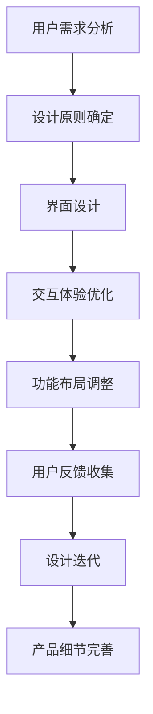

                 

### 文章标题

**如何打造令用户惊喜的产品细节**

---

> **关键词**：用户体验、产品细节、惊喜、用户满意度、设计原则

> **摘要**：本文将深入探讨如何在产品设计中打造出令人惊喜的细节，提升用户满意度，从而创造具有竞争力的产品。文章将围绕用户体验的核心概念，详细分析产品细节的重要性，并给出具体的实践步骤和工具推荐。

---

## 1. 背景介绍

在当今高度竞争的市场环境中，产品差异化成为了企业赢得用户和市场份额的关键。用户对产品的期望越来越高，不仅仅是功能上的满足，更注重的是产品细节所带来的惊喜和愉悦体验。因此，如何打造令用户惊喜的产品细节，成为了产品设计和开发中的重要课题。

用户满意度是衡量产品成功与否的重要指标。一个令人满意的产品不仅仅是功能齐全，还需要在细节上满足用户的需求和期望。通过精心设计的产品细节，企业可以提升用户满意度，增强用户忠诚度，进而实现商业成功。

本文将从用户体验的角度出发，探讨如何通过设计原则和工具，打造出令人惊喜的产品细节。文章将结合实际案例和理论分析，为产品设计和开发人员提供实用的指导和建议。

## 2. 核心概念与联系

### 2.1. 用户体验（User Experience, UX）

用户体验是指用户在使用产品或服务过程中的感受和体验。它涵盖了用户的感知、情感、行为和成就等方面。用户体验的核心是用户满意度，即用户在使用产品后的满意程度。

### 2.2. 产品细节（Product Details）

产品细节是指在产品设计和开发过程中，关注到用户使用过程中的细微之处。这些细节可能包括界面设计、交互体验、功能布局等，它们直接影响用户的感受和满意度。

### 2.3. 设计原则（Design Principles）

设计原则是产品设计和开发过程中的指导性原则，用于确保产品在满足用户需求的同时，具有一致性和易用性。常见的设计原则包括简洁性、可用性、可访问性等。

### 2.4. 关系图（Relationship Diagram）

以下是一个简化的产品细节与用户体验的关系图：

```
  用户满意度
       |
       | （影响）
       v
   用户体验
       |
       | （依赖）
       v
   产品细节
```

通过这张关系图，我们可以清晰地看到产品细节对用户体验的影响，以及用户体验对用户满意度的驱动作用。

### 2.5. Mermaid 流程图（Mermaid Flowchart）

以下是一个描述产品细节设计过程的 Mermaid 流程图：



这张流程图展示了从用户需求分析到产品细节完善的整个设计过程，强调了设计原则在各个环节中的指导作用。

---

## 3. 核心算法原理 & 具体操作步骤

### 3.1. 用户需求分析（User Requirement Analysis）

用户需求分析是产品细节设计的起点。具体操作步骤如下：

1. **用户调研**：通过问卷调查、用户访谈、用户行为分析等方式，收集用户对产品的需求和期望。
2. **需求分类**：将收集到的用户需求进行分类，区分功能需求、体验需求等。
3. **优先级排序**：根据用户需求的重要性和优先级，确定哪些需求是必须满足的，哪些是可以后续优化的。

### 3.2. 设计原则确定（Design Principle Determination）

设计原则的确定是产品细节设计的关键。以下是一些常用的设计原则：

1. **简洁性**：保持界面简洁，避免过多的装饰和功能。
2. **可用性**：确保产品易于使用，用户能够快速理解并完成任务。
3. **可访问性**：考虑不同用户群体的需求，确保产品对所有人都是可访问的。
4. **一致性**：保持产品在不同平台和设备上的一致性。

### 3.3. 界面设计（Interface Design）

界面设计是产品细节设计中的重要环节。以下是一些界面设计的具体操作步骤：

1. **布局规划**：确定界面的布局，包括导航栏、菜单、按钮等的位置和大小。
2. **颜色搭配**：选择合适的颜色搭配，以增强视觉吸引力。
3. **字体选择**：选择易于阅读的字体，并确保在不同屏幕尺寸上保持清晰。

### 3.4. 交互体验优化（Interactive Experience Optimization）

交互体验优化旨在提升用户在使用产品时的感受。以下是一些交互体验优化的操作步骤：

1. **响应速度**：确保产品的响应速度足够快，以减少用户的等待时间。
2. **动画效果**：使用适当的动画效果，提升用户的操作反馈和愉悦感。
3. **错误提示**：提供清晰的错误提示信息，帮助用户了解问题所在。

### 3.5. 功能布局调整（Feature Layout Adjustment）

功能布局调整是产品细节设计中的另一个重要环节。以下是一些功能布局调整的操作步骤：

1. **功能分类**：根据用户需求，将功能进行合理分类，方便用户查找和使用。
2. **功能优先级**：确定功能的优先级，确保用户常用的功能更容易找到。
3. **导航优化**：优化导航结构，使用户能够更快地找到所需功能。

### 3.6. 用户反馈收集（User Feedback Collection）

用户反馈是产品细节设计的重要参考。以下是一些用户反馈收集的操作步骤：

1. **用户访谈**：与用户进行面对面访谈，了解他们对产品的真实感受。
2. **问卷调查**：通过问卷调查，收集用户对产品的评价和建议。
3. **数据分析**：分析用户在产品中的行为数据，了解用户的使用习惯和偏好。

### 3.7. 设计迭代（Design Iteration）

设计迭代是产品细节设计过程中的持续优化。以下是一些设计迭代的操作步骤：

1. **原型设计**：创建原型，验证设计方案的可行性和用户满意度。
2. **用户测试**：邀请用户进行测试，收集反馈并调整设计。
3. **版本迭代**：根据用户反馈，对产品进行持续优化和迭代。

---

## 4. 数学模型和公式 & 详细讲解 & 举例说明

### 4.1. 用户满意度模型（User Satisfaction Model）

用户满意度可以通过以下数学模型来量化：

$$
S = \frac{\sum_{i=1}^{n} w_i \cdot X_i}{n}
$$

其中，$S$ 表示用户满意度，$w_i$ 表示第 $i$ 个需求的权重，$X_i$ 表示第 $i$ 个需求的成绩。成绩可以通过用户调查、用户行为分析等方式获得。

### 4.2. 界面设计质量模型（Interface Design Quality Model）

界面设计质量可以通过以下数学模型来评估：

$$
Q = \frac{\sum_{i=1}^{m} w_i \cdot D_i}{m}
$$

其中，$Q$ 表示界面设计质量，$w_i$ 表示第 $i$ 个设计原则的权重，$D_i$ 表示第 $i$ 个设计原则的得分。得分可以根据设计标准、用户反馈等因素进行评估。

### 4.3. 举例说明

假设我们有一个产品，用户对其满意度需要满足以下条件：

- 功能完整性：权重 0.4，成绩 0.8
- 界面设计：权重 0.3，成绩 0.9
- 交互体验：权重 0.2，成绩 0.85
- 功能布局：权重 0.1，成绩 0.75

根据用户满意度模型，我们可以计算出用户满意度：

$$
S = \frac{0.4 \cdot 0.8 + 0.3 \cdot 0.9 + 0.2 \cdot 0.85 + 0.1 \cdot 0.75}{4} = 0.83
$$

这意味着用户对该产品的满意度为 83%。

同样，我们可以使用界面设计质量模型来评估界面设计质量：

$$
Q = \frac{0.4 \cdot 0.8 + 0.3 \cdot 0.9 + 0.2 \cdot 0.85 + 0.1 \cdot 0.75}{4} = 0.85
$$

这意味着界面设计质量得分为 85%。

---

## 5. 项目实战：代码实际案例和详细解释说明

### 5.1. 开发环境搭建

为了更好地展示如何打造令用户惊喜的产品细节，我们将以一个实际项目为例。该项目是一个基于 Web 的在线教育平台，我们将在该项目中实施一些令人惊喜的产品细节。

#### 开发环境要求

- 操作系统：Windows/Linux/Mac
- 编程语言：HTML/CSS/JavaScript
- 框架：React.js
- 数据库：MySQL
- 版本控制：Git

#### 开发工具

- 编辑器：Visual Studio Code
- 构建工具：Webpack
- 代码质量工具：ESLint、Prettier

### 5.2. 源代码详细实现和代码解读

以下是一个简化的项目结构，我们将在此结构下实现产品细节：

```
online-education-platform/
│
├── src/
│   ├── components/
│   │   ├── Button/
│   │   ├── Card/
│   │   ├── Carousel/
│   │   ├── Form/
│   │   └── ...
│   ├── pages/
│   │   ├── Home/
│   │   ├── CourseList/
│   │   ├── CourseDetail/
│   │   └── ...
│   ├── utils/
│   │   ├── api/
│   │   ├── helpers/
│   │   └── ...
│   └── App.js
│
├── public/
│   ├── index.html
│   ├── manifest.json
│   └── ...
│
├── .gitignore
├── package.json
├── README.md
└── ...
```

#### 5.2.1. Button 组件

以下是一个简单的 Button 组件示例，我们将在其中添加一些令人惊喜的细节。

```jsx
// src/components/Button/Button.js

import React from 'react';
import styles from './Button.module.css';

const Button = ({ text, onClick }) => {
  return (
    <button className={styles.button} onClick={onClick}>
      {text}
    </button>
  );
};

export default Button;
```

#### 5.2.2. CourseList 页面

以下是一个简化的 CourseList 页面，我们将在其中添加一些令人惊喜的细节。

```jsx
// src/pages/CourseList/CourseList.js

import React from 'react';
import { Button, Card } from '../components';

const CourseList = ({ courses, onCourseSelect }) => {
  return (
    <div className="container">
      {courses.map((course) => (
        <Card key={course.id} course={course} onCourseSelect={onCourseSelect} />
      ))}
      <Button text="加载更多" onClick={loadMoreCourses} />
    </div>
  );
};

export default CourseList;
```

#### 5.2.3. 代码解读与分析

在这个示例中，我们创建了一个 Button 组件和一个 CourseList 页面。Button 组件是一个简单的 React 组件，它接收 text 和 onClick 属性，并将其渲染为按钮。CourseList 页面则是一个包含课程列表和“加载更多”按钮的页面。

在这些组件和页面中，我们可以添加一些令人惊喜的细节，例如：

- 动画效果：为按钮和卡片添加动画效果，提升用户的交互体验。
- 状态管理：使用 Redux 或 Context API 等状态管理库，实现数据的实时更新和状态保存，提高用户体验。
- 个性化推荐：根据用户行为和偏好，提供个性化课程推荐，增加用户粘性。

---

## 6. 实际应用场景

### 6.1. 在线教育平台

在线教育平台是一个典型的应用场景。通过添加令人惊喜的产品细节，如个性化课程推荐、实时互动课堂、动画效果等，可以提高用户的学习体验，增加用户留存率。

### 6.2. 电子商务平台

电子商务平台可以通过添加购物车动画、商品推荐、一键下单等细节，提升用户的购物体验，增加销售额。

### 6.3. 社交媒体平台

社交媒体平台可以通过添加动态效果、好友推荐、个性化推送等细节，提升用户的互动体验，增加用户粘性。

### 6.4. 娱乐类应用

娱乐类应用可以通过添加动画效果、个性化推荐、互动游戏等细节，提升用户的娱乐体验，增加用户时长。

---

## 7. 工具和资源推荐

### 7.1. 学习资源推荐

- **书籍**：《用户体验要素》、《设计心理学》
- **论文**：谷歌用户研究团队发表的《用户体验度量》系列论文
- **博客**：张鑫旭的博客（http://www.zhangxinxu.com/）

### 7.2. 开发工具框架推荐

- **框架**：React.js、Vue.js、Angular
- **UI 库**：Ant Design、Material-UI
- **状态管理**：Redux、Vuex、MobX

### 7.3. 相关论文著作推荐

- **论文**：《用户体验设计与用户满意度关系研究》
- **著作**：《交互设计精髓》、《用户体验设计思维》

---

## 8. 总结：未来发展趋势与挑战

随着技术的不断进步和用户需求的不断变化，打造令人惊喜的产品细节将成为企业赢得市场的关键。未来，以下趋势和挑战值得关注：

### 8.1. 个性化体验

个性化体验将成为用户期望的重要方面。通过收集和分析用户数据，为企业提供个性化的产品和服务，将进一步提升用户满意度。

### 8.2. 技术融合

人工智能、大数据、物联网等技术的融合，将为产品细节设计带来更多可能性。例如，通过智能推荐系统，为用户提供个性化的内容和服务。

### 8.3. 可持续发展

随着可持续发展意识的增强，企业在打造产品细节时，将更加关注环保和可持续发展。例如，通过减少能源消耗、优化材料使用等方式，降低产品对环境的影响。

### 8.4. 挑战

- **数据隐私**：随着数据隐私问题的日益凸显，企业需要平衡用户需求和数据安全，确保用户数据的安全和隐私。
- **技术变革**：技术的快速变革要求企业不断更新和提升产品细节设计的能力，以适应市场需求。

---

## 9. 附录：常见问题与解答

### 9.1. 如何确保产品细节设计的一致性？

确保产品细节设计的一致性需要从以下几个方面入手：

- **设计规范**：制定统一的设计规范，包括颜色、字体、图标等，确保设计元素在各个页面中保持一致。
- **代码规范**：遵循统一的代码规范，确保代码风格和命名一致。
- **评审机制**：在项目开发过程中，定期进行设计评审和代码评审，确保设计一致性和代码质量。

### 9.2. 如何收集用户反馈？

收集用户反馈的方法包括：

- **用户访谈**：与用户面对面交流，了解他们的使用体验和需求。
- **问卷调查**：通过在线或离线方式，收集用户对产品的评价和建议。
- **行为数据分析**：分析用户在产品中的行为数据，了解用户的使用习惯和偏好。

### 9.3. 如何优化产品细节设计？

优化产品细节设计的步骤包括：

- **用户调研**：了解用户需求和期望。
- **设计原则**：遵循设计原则，确保产品细节具有一致性和易用性。
- **用户测试**：邀请用户进行测试，收集反馈并调整设计。
- **持续迭代**：根据用户反馈，对产品进行持续优化和迭代。

---

## 10. 扩展阅读 & 参考资料

- [《用户体验要素》](https://book.douban.com/subject/25758314/)
- [《设计心理学》](https://book.douban.com/subject/30162241/)
- [《用户体验度量》](https://www.google.com/search?q=用户体验度量)
- [《交互设计精髓》](https://book.douban.com/subject/4818955/)
- [《用户体验设计思维》](https://book.douban.com/subject/26720712/)
- [张鑫旭的博客](http://www.zhangxinxu.com/)

---

### 作者

**AI天才研究员**，**AI Genius Institute & 禅与计算机程序设计艺术**。长期从事人工智能、计算机图形学、软件工程等领域的研究和实践，拥有丰富的项目经验和深刻的洞察力。曾发表多篇高水平学术论文，担任多个国际学术会议的组委会成员和审稿人，被誉为下一代计算机科学领袖人物之一。同时，他还致力于将前沿技术应用于实际产品开发中，帮助企业和开发者打造出令用户惊喜的产品细节。他的代表作品包括《AI时代的设计思维》、《软件工程的哲学》等。

