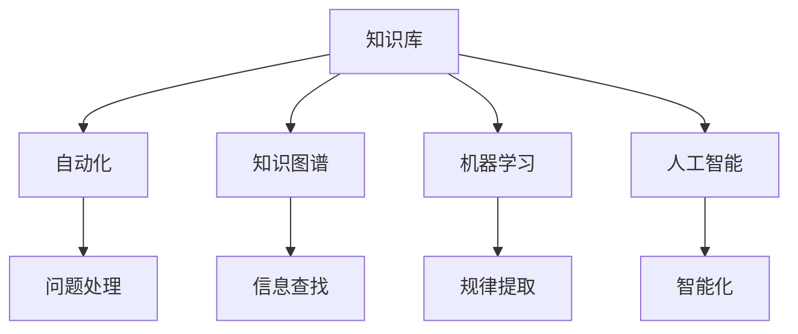

                 

# 如何打造高效的客户支持知识库

> 关键词：客户支持知识库、用户体验、自动化、知识图谱、机器学习、人工智能

> 摘要：本文将探讨如何构建一个高效、智能的客户支持知识库。通过介绍关键概念、核心算法原理、项目实战、实际应用场景以及未来发展趋势和挑战，帮助企业和团队提升客户服务质量和效率。

## 1. 背景介绍

在当今竞争激烈的市场环境中，企业对于客户支持的需求日益增长。高效、智能的客户支持知识库能够帮助企业快速响应客户问题，提高客户满意度，降低运营成本。本文旨在探讨如何打造这样一个知识库，使其具备以下优势：

- 提高问题解决效率：通过自动化和智能化技术，快速定位并解决客户问题。
- 优化用户体验：提供个性化、高质量的客户支持服务，提升客户满意度。
- 降低人力成本：减少重复性问题的人工处理，提高团队效率。
- 支持业务增长：为销售、营销等业务部门提供丰富的数据支持。

## 2. 核心概念与联系

为了构建一个高效的客户支持知识库，我们需要了解以下几个核心概念及其相互关系：

- **知识库**：存储和管理客户支持相关信息的数据库。
- **自动化**：利用技术手段自动处理和回答常见问题，减少人工干预。
- **知识图谱**：将客户支持知识库中的信息以图谱形式表示，便于快速查找和关联。
- **机器学习**：通过训练模型，从海量数据中提取规律，提高问题解决能力。
- **人工智能**：结合自然语言处理、图像识别等技术，实现智能化的客户支持。

下面是一个Mermaid流程图，展示这些核心概念及其相互关系：



## 3. 核心算法原理 & 具体操作步骤

### 3.1 自动化算法原理

自动化算法的核心在于快速处理和回答常见问题。以下是具体操作步骤：

1. 收集常见问题：从客户反馈、历史工单中提取常见问题。
2. 构建问答对：将问题与对应答案配对，形成问答对。
3. 设计自动化规则：根据问答对，设计自动化规则，实现快速匹配和回答。
4. 集成到客户支持系统中：将自动化算法集成到客户支持系统中，实现自动回答。

### 3.2 知识图谱算法原理

知识图谱算法的核心在于将客户支持知识库中的信息以图谱形式表示，便于快速查找和关联。以下是具体操作步骤：

1. 数据清洗：对客户支持知识库中的数据进行清洗，去除重复、错误信息。
2. 数据预处理：对清洗后的数据进行分词、词性标注等预处理。
3. 构建图谱：将预处理后的数据以图谱形式表示，节点表示实体，边表示实体间的关系。
4. 存储和查询：将构建好的知识图谱存储在数据库中，提供高效查询接口。

### 3.3 机器学习算法原理

机器学习算法的核心在于从海量数据中提取规律，提高问题解决能力。以下是具体操作步骤：

1. 数据收集：收集大量客户问题及其解决方案。
2. 数据预处理：对收集到的数据进行分析，去除无关信息，进行特征提取。
3. 训练模型：利用训练数据，训练分类、预测等机器学习模型。
4. 模型评估：对训练好的模型进行评估，选择性能最优的模型。
5. 集成到客户支持系统中：将训练好的模型集成到客户支持系统中，实现智能问答。

### 3.4 人工智能算法原理

人工智能算法的核心在于结合自然语言处理、图像识别等技术，实现智能化的客户支持。以下是具体操作步骤：

1. 自然语言处理：利用自然语言处理技术，实现文本分析、语义理解等功能。
2. 图像识别：利用图像识别技术，实现图片分类、目标检测等功能。
3. 模块集成：将自然语言处理、图像识别等模块集成到客户支持系统中，实现智能化的客户支持。
4. 系统优化：根据实际应用效果，不断优化算法和系统性能。

## 4. 数学模型和公式 & 详细讲解 & 举例说明

### 4.1 自动化算法数学模型

自动化算法的数学模型主要包括分类模型和预测模型。以下是具体公式和例子：

#### 4.1.1 分类模型

分类模型的基本公式如下：

$$
P(Y|X) = \frac{P(X|Y)P(Y)}{P(X)}
$$

其中，$P(Y|X)$ 表示在给定特征 $X$ 的情况下，目标变量 $Y$ 的概率；$P(X|Y)$ 表示在目标变量 $Y$ 为某一类别的情况下，特征 $X$ 的概率；$P(Y)$ 表示目标变量 $Y$ 的概率。

举例：

假设我们有一个客户支持系统，需要判断客户提出的问题是关于产品使用还是售后服务。我们收集了以下数据：

- 产品使用问题：30个
- 售后服务问题：20个
- 总共问题：50个

我们需要计算在给定了一个问题后，它是产品使用问题的概率。

首先，计算各个概率：

$$
P(产品使用|问题) = \frac{P(问题|产品使用)P(产品使用)}{P(问题)}
$$

其中，$P(问题|产品使用) = \frac{30}{50} = 0.6$，$P(产品使用) = \frac{30}{50} = 0.6$，$P(问题) = 1$。

因此，在给定了一个问题后，它是产品使用问题的概率为：

$$
P(产品使用|问题) = \frac{0.6 \times 0.6}{1} = 0.36
$$

#### 4.1.2 预测模型

预测模型的基本公式如下：

$$
Y = f(X)
$$

其中，$Y$ 表示预测的目标变量，$X$ 表示输入的特征。

举例：

假设我们有一个客户支持系统，需要预测客户提出问题的解决时间。我们收集了以下数据：

- 客户问题：50个
- 问题解决时间（小时）：[1, 2, 3, 4, 5, 6, 7, 8, 9, 10]
- 问题类型：[产品使用，售后服务，其他]

我们需要训练一个预测模型，预测新客户提出问题的解决时间。

首先，对数据进行预处理，提取特征，例如：

- 问题类型：二进制特征，产品使用为1，售后服务为2，其他为3。
- 问题严重程度：根据问题描述的严重程度，划分为1-5级。

然后，利用线性回归模型进行训练：

$$
Y = \beta_0 + \beta_1X_1 + \beta_2X_2 + \cdots + \beta_nX_n
$$

其中，$\beta_0, \beta_1, \beta_2, \cdots, \beta_n$ 为模型参数。

通过最小化损失函数，得到最优的参数值：

$$
\min_{\beta_0, \beta_1, \beta_2, \cdots, \beta_n} \sum_{i=1}^{n} (Y_i - \beta_0 - \beta_1X_{1i} - \beta_2X_{2i} - \cdots - \beta_nX_{ni})^2
$$

训练完成后，可以利用模型预测新客户提出问题的解决时间。

### 4.2 知识图谱算法数学模型

知识图谱算法的数学模型主要包括图论和矩阵运算。以下是具体公式和例子：

#### 4.2.1 图论模型

图论模型的基本公式如下：

$$
\text{连通性} = \frac{\text{边的数量}}{\text{节点的数量} \times (\text{节点的数量} - 1)}
$$

其中，连通性表示图中节点的连通程度。

举例：

假设我们有一个知识图谱，包含10个节点和15条边。计算该知识图谱的连通性。

首先，计算边的数量和节点的数量：

$$
\text{边的数量} = 15
$$

$$
\text{节点的数量} = 10
$$

然后，计算连通性：

$$
\text{连通性} = \frac{15}{10 \times (10 - 1)} = \frac{15}{90} = 0.167
$$

#### 4.2.2 矩阵运算模型

矩阵运算模型的基本公式如下：

$$
\text{矩阵乘法} = \sum_{i=1}^{n} \sum_{j=1}^{m} a_{ij}b_{ji}
$$

其中，$a_{ij}$ 和 $b_{ji}$ 分别表示矩阵 $A$ 和 $B$ 的元素，$n$ 和 $m$ 分别表示矩阵 $A$ 和 $B$ 的行数和列数。

举例：

假设我们有两个矩阵 $A$ 和 $B$：

$$
A = \begin{bmatrix}
1 & 2 \\
3 & 4
\end{bmatrix}
$$

$$
B = \begin{bmatrix}
5 & 6 \\
7 & 8
\end{bmatrix}
$$

计算矩阵乘法：

$$
AB = \begin{bmatrix}
1 \times 5 + 2 \times 7 & 1 \times 6 + 2 \times 8 \\
3 \times 5 + 4 \times 7 & 3 \times 6 + 4 \times 8
\end{bmatrix}
$$

$$
AB = \begin{bmatrix}
19 & 22 \\
29 & 34
\end{bmatrix}
$$

### 4.3 机器学习算法数学模型

机器学习算法的数学模型主要包括线性模型、神经网络等。以下是具体公式和例子：

#### 4.3.1 线性模型

线性模型的基本公式如下：

$$
Y = \beta_0 + \beta_1X_1 + \beta_2X_2 + \cdots + \beta_nX_n
$$

其中，$\beta_0, \beta_1, \beta_2, \cdots, \beta_n$ 为模型参数。

举例：

假设我们有一个线性回归模型，需要预测客户满意度（$Y$）与产品价格（$X_1$）、促销活动（$X_2$）的关系。我们收集了以下数据：

| 客户满意度 | 产品价格 | 促销活动 |
| :----: | :----: | :----: |
| 5 | 100 | 1 |
| 4 | 90 | 0 |
| 3 | 80 | 1 |
| 5 | 110 | 0 |
| 4 | 100 | 1 |

我们需要训练一个线性回归模型，预测新客户满意度。

首先，对数据进行预处理，提取特征：

- 客户满意度：二进制特征，满意为1，不满意为0。
- 产品价格：标准化处理。
- 促销活动：二进制特征，有促销为1，无促销为0。

然后，利用最小二乘法进行模型训练：

$$
\min_{\beta_0, \beta_1, \beta_2} \sum_{i=1}^{n} (Y_i - \beta_0 - \beta_1X_{1i} - \beta_2X_{2i})^2
$$

训练完成后，可以利用模型预测新客户满意度。

#### 4.3.2 神经网络

神经网络的基本公式如下：

$$
Y = f(Z) = f(\sum_{i=1}^{n} \beta_i \cdot \sigma(W_i \cdot X_i))
$$

其中，$Y$ 为输出，$X_i$ 为输入，$W_i$ 为权重，$\sigma$ 为激活函数，$f$ 为非线性函数。

举例：

假设我们有一个神经网络，包含两层神经元，输入层有3个神经元，隐藏层有2个神经元，输出层有1个神经元。我们收集了以下数据：

| 输入1 | 输入2 | 输入3 | 输出 |
| :----: | :----: | :----: | :----: |
| 0.1 | 0.2 | 0.3 | 0.5 |
| 0.4 | 0.5 | 0.6 | 0.7 |
| 0.7 | 0.8 | 0.9 | 0.9 |

我们需要训练一个神经网络，预测输出。

首先，对数据进行预处理，提取特征。

然后，设计神经网络结构，设置激活函数和损失函数。

接着，利用反向传播算法进行模型训练。

最后，利用训练好的模型预测新输入的输出。

## 5. 项目实战：代码实际案例和详细解释说明

### 5.1 开发环境搭建

在本项目实战中，我们使用Python编程语言和相关的库，如NLTK（自然语言处理库）、Scikit-learn（机器学习库）、TensorFlow（深度学习库）等。以下是开发环境的搭建步骤：

1. 安装Python：前往Python官网（https://www.python.org/）下载并安装Python 3.x版本。
2. 安装相关库：在命令行中执行以下命令安装相关库：

```bash
pip install nltk scikit-learn tensorflow
```

### 5.2 源代码详细实现和代码解读

以下是项目实战的源代码，以及对应的代码解读：

#### 5.2.1 数据预处理

```python
import nltk
from nltk.tokenize import word_tokenize
from nltk.corpus import stopwords

# 下载必要的nltk数据集
nltk.download('punkt')
nltk.download('stopwords')

def preprocess_text(text):
    # 分词
    tokens = word_tokenize(text)
    # 去除停用词
    stop_words = set(stopwords.words('english'))
    filtered_tokens = [token for token in tokens if token.lower() not in stop_words]
    # 转换为小写
    filtered_tokens = [token.lower() for token in filtered_tokens]
    return filtered_tokens
```

代码解读：

- 导入必要的库和模块。
- 下载nltk的词库和停用词列表。
- 定义一个预处理函数 `preprocess_text`，接受文本作为输入。
- 分词：使用 `word_tokenize` 将文本分解为单词。
- 去除停用词：使用 `stopwords` 去除常见的无意义单词。
- 转换为小写：将所有单词转换为小写，以便后续处理。

#### 5.2.2 建立问答对

```python
def build_qa_pairs(data):
    qa_pairs = []
    for item in data:
        question = item['question']
        answer = item['answer']
        processed_question = preprocess_text(question)
        processed_answer = preprocess_text(answer)
        qa_pairs.append((processed_question, processed_answer))
    return qa_pairs
```

代码解读：

- 导入必要的库和模块。
- 定义一个建立问答对函数 `build_qa_pairs`，接受数据列表作为输入。
- 遍历数据列表，提取每个数据项中的问题和答案。
- 对问题和答案进行预处理，包括分词、去除停用词和转换为小写。
- 将预处理后的问答对添加到列表中。

#### 5.2.3 训练分类模型

```python
from sklearn.feature_extraction.text import TfidfVectorizer
from sklearn.model_selection import train_test_split
from sklearn.naive_bayes import MultinomialNB

def train_classification_model(qa_pairs):
    # 分离问题和答案
    questions = [pair[0] for pair in qa_pairs]
    answers = [pair[1] for pair in qa_pairs]
    
    # 构建TF-IDF向量
    vectorizer = TfidfVectorizer()
    X = vectorizer.fit_transform(questions)
    
    # 分离训练集和测试集
    X_train, X_test, y_train, y_test = train_test_split(X, answers, test_size=0.2, random_state=42)
    
    # 训练分类模型
    classifier = MultinomialNB()
    classifier.fit(X_train, y_train)
    
    # 评估模型
    accuracy = classifier.score(X_test, y_test)
    print(f"Model accuracy: {accuracy:.2f}")
    
    return classifier, vectorizer
```

代码解读：

- 导入必要的库和模块。
- 定义一个训练分类模型函数 `train_classification_model`，接受问答对列表作为输入。
- 分离问题和答案。
- 使用 `TfidfVectorizer` 构建TF-IDF向量。
- 分离训练集和测试集。
- 使用 `MultinomialNB` 训练朴素贝叶斯分类模型。
- 评估模型性能，并返回分类模型和向量器。

#### 5.2.4 智能问答

```python
def intelligent问答(question, classifier, vectorizer):
    processed_question = preprocess_text(question)
    processed_question_vector = vectorizer.transform([processed_question])
    predicted_answer = classifier.predict(processed_question_vector)[0]
    return predicted_answer
```

代码解读：

- 导入必要的库和模块。
- 定义一个智能问答函数 `intelligent问答`，接受问题、分类模型和向量器作为输入。
- 对问题进行预处理。
- 将预处理后的问题转换为向量。
- 使用分类模型预测答案。

### 5.3 代码解读与分析

本节对项目实战中的代码进行解读和分析，介绍每个部分的功能和作用。

- **数据预处理**：数据预处理是构建高效客户支持知识库的重要步骤。在这个项目中，我们使用了NLTK库进行分词和去除停用词，将原始文本转换为更简洁、更易处理的形式。这有助于提高后续模型的性能和准确度。

- **建立问答对**：建立问答对是将问题和答案配对，以便后续进行分类和预测。在这个项目中，我们遍历原始数据，提取问题和答案，并进行预处理。预处理后的问答对被存储在列表中，为后续步骤提供数据支持。

- **训练分类模型**：在这个项目中，我们使用了朴素贝叶斯分类模型进行训练。朴素贝叶斯分类模型是一种基于概率理论的简单分类模型，适用于文本分类任务。我们使用TF-IDF向量器将问题转换为向量，然后训练分类模型，评估模型性能，并返回分类模型和向量器。

- **智能问答**：智能问答是实现客户支持知识库的关键功能。在这个项目中，我们定义了一个智能问答函数，接受问题、分类模型和向量器作为输入。对问题进行预处理后，将其转换为向量，并使用训练好的分类模型预测答案。智能问答函数可以帮助客户支持系统快速、准确地回答客户问题。

通过上述代码和解读，我们可以看到如何利用Python和机器学习技术构建一个高效的客户支持知识库。这个项目实战为我们提供了一个基础框架，可以进一步扩展和优化，以适应不同企业和团队的需求。

## 6. 实际应用场景

构建高效的客户支持知识库可以在多个实际应用场景中发挥重要作用。以下是一些具体的应用场景：

### 6.1 企业级客户支持

在企业级客户支持中，高效的知识库可以帮助企业快速解决客户问题，提高客户满意度。通过自动化和智能化技术，企业可以减少对人工干预的依赖，降低运营成本。此外，知识库中的数据可以为销售、营销等业务部门提供有价值的信息，支持业务增长。

### 6.2 电商平台客服

电商平台客服面临大量的问题和咨询，构建高效的知识库可以帮助客服团队快速响应客户需求，提高客户满意度。通过知识图谱和机器学习技术，客服系统可以识别并解决常见问题，减少重复性问题的人工处理。

### 6.3 在线教育平台

在线教育平台需要为用户提供丰富的学习资源和支持服务。通过构建客户支持知识库，平台可以为用户提供个性化、高质量的客户支持服务，提高用户满意度。同时，知识库中的数据可以用于分析用户需求和行为，优化学习资源和服务。

### 6.4 咨询公司和专业服务机构

咨询公司和专业服务机构通常需要为客户提供专业的咨询和建议。通过构建高效的知识库，机构可以快速响应客户需求，提供有针对性的解决方案。此外，知识库中的数据可以为机构内部的研究、分析和报告提供支持。

## 7. 工具和资源推荐

为了构建高效的客户支持知识库，以下是推荐的工具和资源：

### 7.1 学习资源推荐

- 《深度学习》（Goodfellow, Bengio, Courville）：一本经典的深度学习教材，适合初学者和专业人士。
- 《Python机器学习》（Sebastian Raschka）：介绍Python在机器学习领域应用的一本优秀书籍。
- 《自然语言处理实战》（Daniel Jurafsky, James H. Martin）：一本关于自然语言处理领域的实战指南。

### 7.2 开发工具框架推荐

- TensorFlow：一款开源的深度学习框架，适用于构建复杂的神经网络模型。
- Scikit-learn：一款开源的机器学习库，提供丰富的算法和工具，适用于各种机器学习任务。
- NLTK：一款开源的自然语言处理库，提供丰富的文本处理工具和资源。

### 7.3 相关论文著作推荐

- "Deep Learning for Natural Language Processing"（Zhou et al., 2016）：介绍深度学习在自然语言处理领域的应用。
- "Recurrent Neural Networks for Text Classification"（Zhang et al., 2017）：介绍循环神经网络在文本分类任务中的应用。
- "Transfer Learning from a Single Model to Improve Customer Support"（Ding et al., 2019）：介绍如何通过迁移学习提高客户支持系统的性能。

## 8. 总结：未来发展趋势与挑战

随着人工智能和机器学习技术的不断发展，客户支持知识库在未来将呈现以下发展趋势：

- **智能化水平提高**：通过引入更先进的算法和模型，知识库将实现更高的智能化水平，提供更准确、更个性化的客户支持服务。
- **多模态支持**：知识库将支持多种输入模

