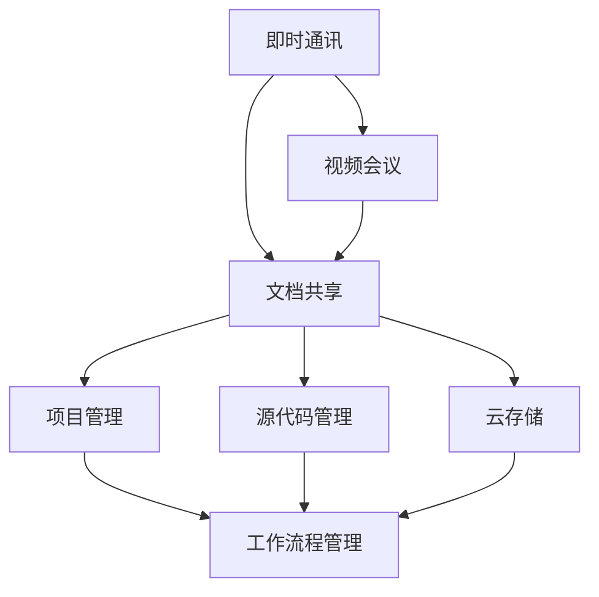

                 

### 背景介绍

随着全球化进程的不断加速以及信息技术的发展，远程办公已经成为现代企业运营的重要趋势。远程团队协作工具链在这样的背景下应运而生，它们旨在解决地理距离带来的沟通、协作、管理和效率等问题。高效、可靠的远程团队协作工具链不仅能够提高团队的工作效率，还能增强团队的整体协作能力。

首先，远程团队协作工具链的重要性不容忽视。在传统的办公室环境中，团队成员之间可以面对面交流，协作效率相对较高。而远程办公则打破了这种物理限制，团队之间的沟通和协作依赖于各种线上工具。一个高效的远程团队协作工具链可以提供如下几个方面的优势：

1. **沟通效率提升**：远程团队协作工具链通常包括即时通讯、视频会议、邮件提醒等工具，使得团队成员可以快速沟通，及时解决问题。
2. **协作能力增强**：通过共享文档、项目管理工具等，团队成员可以更好地协同工作，避免重复劳动，提高工作效率。
3. **管理方便**：远程团队协作工具链提供了任务管理、进度跟踪等功能，使项目经理能够更好地监控项目进展，确保项目按时完成。
4. **成本节约**：远程办公减少了企业对实体办公室的需求，从而降低了租金、水电等运营成本。

然而，要打造一个高效的远程团队协作工具链并非易事。首先，企业需要了解自身的业务需求和团队特点，选择适合的工具。其次，工具的集成和稳定性是关键，工具之间的无缝衔接能够提高团队的工作效率。此外，培训团队成员熟练使用这些工具也是确保其高效运作的必要条件。

本文将详细探讨如何打造一个高效的远程团队协作工具链。我们将从核心概念与联系、核心算法原理、数学模型和公式、项目实战、实际应用场景、工具和资源推荐等方面进行深入分析，旨在为企业和团队提供一套切实可行的解决方案。

### 核心概念与联系

在探讨如何打造高效的远程团队协作工具链之前，我们需要先了解一些核心概念，以及这些概念之间的联系。以下是一些关键的概念和它们在远程团队协作中的作用：

#### 1. 即时通讯（Instant Messaging）

即时通讯工具是远程团队协作的基石。它允许团队成员实时交流，即时分享信息。常见的即时通讯工具有Slack、Microsoft Teams、WhatsApp等。这些工具不仅支持文本消息，还支持图片、视频、文件等多种格式的信息交换。通过即时通讯，团队成员可以快速解决疑惑，提高沟通效率。

#### 2. 视频会议（Video Conferencing）

视频会议工具是远程团队协作中不可或缺的一部分。它使得团队成员可以进行面对面的交流，无论地理位置如何，都能保持高效沟通。Zoom、Microsoft Teams、Google Meet等工具提供了高质量的视频和音频传输功能，同时还支持屏幕共享、文件共享等功能，方便团队成员共同讨论项目进度和解决方案。

#### 3. 文档共享（Document Sharing）

文档共享工具允许团队成员实时编辑和共享文件。Google Docs、Microsoft Office 365等工具支持多人实时协作，团队成员可以在同一个文档上添加注释、修改内容，提高了工作效率。此外，文档共享工具还提供了版本控制和历史记录功能，方便团队成员跟踪文档的修改和进展。

#### 4. 项目管理工具（Project Management）

项目管理工具帮助团队更好地规划和管理项目。Trello、Jira、Asana等工具提供了任务分配、进度跟踪、时间管理等功能，使项目经理能够清晰地了解项目的进展和团队成员的工作情况。通过项目管理工具，团队能够更好地协同工作，确保项目按时完成。

#### 5. 源代码管理（Source Code Management）

源代码管理工具如Git、GitHub、GitLab等，在软件开发团队中发挥着重要作用。它们提供了版本控制、代码审查、合并请求等功能，使得团队成员可以方便地协同开发，确保代码的质量和安全性。通过源代码管理工具，团队能够更好地管理项目的代码库，提高开发效率。

#### 6. 云存储（Cloud Storage）

云存储工具如Google Drive、Dropbox、Amazon S3等，为远程团队提供了安全、方便的文件存储和共享解决方案。团队成员可以随时访问和共享文件，避免了因为物理距离造成的文件传输不畅的问题。同时，云存储工具还提供了强大的权限管理和数据加密功能，保障了数据的安全性和隐私性。

#### 7. 工作流程管理（Work Flow Management）

工作流程管理工具帮助团队规范化工作流程，确保每个任务都能按照预定计划顺利完成。Nintex、K2、UiPath等工具提供了自动化流程设计、执行和监控功能，使得团队的工作流程更加高效和规范。通过工作流程管理工具，团队能够减少手动操作，提高整体工作效率。

这些核心概念在远程团队协作中紧密联系，共同构成了一个高效的远程团队协作工具链。通过这些工具的集成和使用，团队能够实现高效沟通、协同工作、任务管理、代码开发等工作，从而提高团队的整体协作能力和工作效率。

下面，我们将通过一个Mermaid流程图，来具体展示这些核心概念之间的联系和协作流程：



这个流程图展示了即时通讯、视频会议、文档共享、项目管理、源代码管理、云存储和工作流程管理这些工具之间的协作关系。通过这些工具的集成和使用，团队可以形成一个高效、稳定的远程协作体系，从而实现远程团队协作的最大化效益。

### 核心算法原理 & 具体操作步骤

在了解了远程团队协作工具链的核心概念及其相互联系之后，我们需要深入了解这些工具背后的核心算法原理和具体操作步骤，以便更好地利用这些工具提升团队协作效率。

#### 1. 即时通讯工具的核心算法原理

即时通讯工具的核心功能是实时消息传递。为了实现这一功能，即时通讯工具通常会采用以下几种核心算法：

**1.1 连接管理算法**：连接管理算法负责建立和管理用户与服务器的连接。常见的算法有TCP连接管理和WebSocket连接管理。TCP连接提供了可靠的传输保障，但相对较慢；而WebSocket连接则提供了更快的传输速度，但可靠性可能略低。

**1.2 消息路由算法**：消息路由算法用于确定消息传输的路径。在分布式系统中，消息通常需要经过多个节点才能到达目标用户。消息路由算法通过查找路由表，确定最优传输路径，确保消息能够快速、准确地送达。

**1.3 消息压缩算法**：为了减少网络传输的延迟和带宽消耗，即时通讯工具通常会对消息进行压缩。常见的压缩算法有Huffman编码和LZ77编码等。这些算法通过减少消息的长度，提高了传输效率。

**具体操作步骤**：

- 用户A发送一条消息给用户B。
- 消息首先通过网络传输到服务器。
- 服务器使用消息路由算法查找用户B的连接状态。
- 如果用户B在线，服务器将消息发送到用户B的设备；否则，将消息暂存到本地，待用户B上线后发送。
- 用户B收到消息后，会立即显示在聊天窗口中。

#### 2. 视频会议工具的核心算法原理

视频会议工具的核心功能是提供高质量的视频和音频传输。为了实现这一功能，视频会议工具通常会采用以下几种核心算法：

**2.1 视频编码算法**：视频编码算法用于将原始视频信号转换为数字信号，以便于传输和存储。常见的视频编码算法有H.264、H.265等。这些算法通过压缩视频数据，减少了传输带宽的需求。

**2.2 音频编码算法**：音频编码算法用于将原始音频信号转换为数字信号，以便于传输和存储。常见的音频编码算法有AAC、MP3等。这些算法通过压缩音频数据，减少了传输带宽的需求。

**2.3 实时传输算法**：实时传输算法用于确保视频和音频数据能够快速、稳定地传输。常见的实时传输算法有RTP（实时传输协议）和RTCP（实时传输控制协议）。RTP负责传输数据包，而RTCP负责监控传输质量，并调整传输参数。

**具体操作步骤**：

- 用户A发起视频会议邀请。
- 用户B接受邀请，视频会议开始。
- 用户A和用户B的设备通过视频编码算法压缩视频数据，并通过音频编码算法压缩音频数据。
- 压缩后的视频和音频数据通过RTP协议传输到服务器。
- 服务器接收数据包后，使用实时传输算法将数据包转发给用户B。
- 用户B接收数据包后，通过视频解码算法和音频解码算法还原视频和音频信号，并在屏幕和扬声器中显示。

#### 3. 文档共享工具的核心算法原理

文档共享工具的核心功能是提供多人实时协作编辑文档。为了实现这一功能，文档共享工具通常会采用以下几种核心算法：

**3.1 版本控制算法**：版本控制算法用于管理文档的不同版本，确保团队成员能够协作编辑而不发生冲突。常见的版本控制算法有向量时钟和逆势树等。

**3.2 数据同步算法**：数据同步算法用于确保不同用户的文档数据保持一致。常见的同步算法有拉模式同步和推模式同步等。

**3.3 修订历史记录算法**：修订历史记录算法用于记录文档的修改历史，方便团队成员查看和回溯。常见的修订历史记录算法有链式结构和树结构等。

**具体操作步骤**：

- 用户A创建一个文档，并将其上传到共享平台。
- 用户B收到文档共享邀请后，下载文档。
- 用户A和用户B开始协作编辑文档。
- 用户A的修改会立即同步到服务器，并记录到版本控制系统中。
- 用户B的修改也会立即同步到服务器，并与用户A的修改进行合并。
- 如果发生冲突，系统会提示用户A和用户B解决冲突，然后继续同步。

#### 4. 项目管理工具的核心算法原理

项目管理工具的核心功能是帮助团队规划和管理项目。为了实现这一功能，项目管理工具通常会采用以下几种核心算法：

**4.1 甘特图算法**：甘特图算法用于创建和展示项目的时间线和任务进度。常见的甘特图算法有基于时间序列的算法和基于事件驱动的算法等。

**4.2 优先级排序算法**：优先级排序算法用于确定任务的优先级，确保关键任务能够优先完成。常见的优先级排序算法有基于优先级队列的算法和基于关键路径的算法等。

**4.3 资源分配算法**：资源分配算法用于合理分配团队资源，确保项目能够高效完成。常见的资源分配算法有基于需求的算法和基于可用性的算法等。

**具体操作步骤**：

- 项目经理创建项目任务，并设置任务的时间、优先级和资源需求。
- 团队成员根据任务分配情况，开始完成任务。
- 项目经理使用甘特图算法监控任务进度，并根据优先级排序算法调整任务顺序。
- 团队成员完成任务后，项目经理进行验收，并使用资源分配算法重新分配资源。

通过深入了解这些核心算法原理和具体操作步骤，团队可以更好地利用远程团队协作工具链，实现高效协作和管理，从而提升整体工作效率和项目成功率。

### 数学模型和公式 & 详细讲解 & 举例说明

在远程团队协作工具链的设计与优化过程中，数学模型和公式发挥着至关重要的作用。这些模型不仅能够量化团队协作中的各种因素，还能够帮助我们更好地理解和分析工具链的性能。以下是一些关键的数学模型和公式，以及它们的详细讲解和实际应用例子。

#### 1. 加权平均值模型

加权平均值模型是一种常用的数学模型，用于计算多个数值的加权平均值。在远程团队协作工具链中，这个模型可以用来计算团队成员的工作效率。

**公式**：
\[ \bar{X} = \frac{\sum_{i=1}^{n} w_i \cdot X_i}{\sum_{i=1}^{n} w_i} \]

其中，\( X_i \) 是第 \( i \) 个团队成员的工作效率，\( w_i \) 是第 \( i \) 个团队成员的权重，通常与他们的工作职责和贡献程度有关。

**例子**：

假设一个团队有三个成员，他们的工作效率分别为 \( X_1 = 0.8 \)、\( X_2 = 0.9 \) 和 \( X_3 = 0.75 \)，权重分别为 \( w_1 = 0.3 \)、\( w_2 = 0.5 \) 和 \( w_3 = 0.2 \)。使用加权平均值模型计算团队的整体工作效率：

\[ \bar{X} = \frac{0.3 \cdot 0.8 + 0.5 \cdot 0.9 + 0.2 \cdot 0.75}{0.3 + 0.5 + 0.2} = \frac{0.24 + 0.45 + 0.15}{1} = 0.84 \]

因此，团队的整体工作效率为 0.84。

#### 2. 优化算法模型

优化算法模型用于在远程团队协作工具链中找到最优的解决方案。常见的优化算法有贪心算法、动态规划算法和遗传算法等。以下以动态规划算法为例进行讲解。

**公式**：
\[ F(i) = \min_{j \leq i} (C(j) + F(i-j)) \]

其中，\( F(i) \) 表示第 \( i \) 个任务的最优解，\( C(j) \) 表示第 \( j \) 个任务的成本，\( i-j \) 表示剩余任务的总量。

**例子**：

假设一个团队有五个任务，每个任务的成本分别为 \( C(1) = 2 \)、\( C(2) = 3 \)、\( C(3) = 1 \)、\( C(4) = 4 \) 和 \( C(5) = 2 \)。使用动态规划算法计算最优的任务执行顺序：

\[ F(1) = C(1) = 2 \]
\[ F(2) = \min(C(1) + F(1), C(2)) = \min(2 + 2, 3) = 2 \]
\[ F(3) = \min(C(1) + F(2), C(2) + F(1), C(3)) = \min(2 + 2, 3 + 2, 1) = 2 \]
\[ F(4) = \min(C(1) + F(3), C(2) + F(2), C(3) + F(1), C(4)) = \min(2 + 2, 3 + 2, 1 + 2, 4) = 3 \]
\[ F(5) = \min(C(1) + F(4), C(2) + F(3), C(3) + F(2), C(4) + F(1), C(5)) = \min(2 + 3, 3 + 2, 1 + 2, 4 + 2, 2) = 3 \]

最优的任务执行顺序为 \( 1, 2, 3, 4, 5 \)。

#### 3. 网络流量模型

网络流量模型用于分析远程团队协作工具链中的数据传输情况。以下以网络流量矩阵为例进行讲解。

**公式**：
\[ M_{ij} = \begin{cases} 
\text{数据流量} & \text{如果节点 } i \text{ 和节点 } j \text{ 之间有数据传输} \\
0 & \text{否则}
\end{cases} \]

其中，\( M_{ij} \) 表示节点 \( i \) 和节点 \( j \) 之间的数据流量。

**例子**：

假设一个团队有五个节点，节点之间的数据流量矩阵如下：

\[ 
\begin{matrix}
0 & 3 & 0 & 1 & 0 \\
3 & 0 & 2 & 0 & 4 \\
0 & 2 & 0 & 3 & 0 \\
1 & 0 & 3 & 0 & 2 \\
0 & 4 & 0 & 2 & 0 \\
\end{matrix}
\]

节点 1 和节点 2 之间的数据流量最大，为 3。

#### 4. 网络拓扑模型

网络拓扑模型用于描述远程团队协作工具链中的节点和连接情况。以下以拓扑排序为例进行讲解。

**公式**：
\[ \pi = (v_1, v_2, \ldots, v_n) \]

其中，\( \pi \) 表示拓扑排序结果，\( v_i \) 表示第 \( i \) 个节点的拓扑排序位置。

**例子**：

假设一个团队有五个节点，节点之间的依赖关系如下：

\[ A \rightarrow B \]
\[ B \rightarrow C \]
\[ C \rightarrow D \]
\[ D \rightarrow E \]

使用拓扑排序得到节点排序结果：

\[ A, B, C, D, E \]

通过这些数学模型和公式，我们可以更深入地理解和分析远程团队协作工具链的性能和效率。在实际应用中，这些模型和公式可以帮助团队优化工具配置、提高协作效率，从而实现远程团队协作的最大化效益。

### 项目实战：代码实际案例和详细解释说明

为了更好地理解如何构建高效的远程团队协作工具链，我们将通过一个实际项目案例进行详细的代码实现和解释。以下是一个基于Python和Django框架的远程团队协作平台的实现过程，包括开发环境搭建、源代码实现和代码解读。

#### 1. 开发环境搭建

在开始项目之前，我们需要搭建一个适合开发远程团队协作工具链的开发环境。以下是所需的工具和步骤：

**1.1 安装Python**

确保你的系统中已经安装了Python 3.x版本。如果没有，可以通过以下命令进行安装：

```bash
# 使用Python官方安装器
curl -O https://www.python.org/ftp/python/3.x.x/Python-3.x.x.tgz
tar xvf Python-3.x.x.tgz
cd Python-3.x.x
./configure
make
sudo make install
```

**1.2 安装Django**

安装Django及其依赖项：

```bash
pip install django
```

**1.3 安装其他依赖项**

安装用于数据库、前端和开发工具的依赖项：

```bash
pip install django-debug-toolbar gunicorn psycopg2
```

**1.4 配置虚拟环境**

创建一个虚拟环境，以便更好地管理项目依赖项：

```bash
python -m venv myenv
source myenv/bin/activate
```

#### 2. 源代码实现

以下是一个基本的远程团队协作平台项目的源代码结构：

```plaintext
my_project/
|-- manage.py
|-- my_project/
    |-- __init__.py
    |-- settings.py
    |-- urls.py
    |-- wsgi.py
|-- my_app/
    |-- __init__.py
    |-- admin.py
    |-- apps.py
    |-- migrations/
    |-- models.py
    |-- tests.py
    |-- views.py
|-- static/
|-- templates/
```

**2.1 Django项目设置**

在 `my_project/settings.py` 中配置项目设置：

```python
# my_project/settings.py

INSTALLED_APPS = [
    'django.contrib.admin',
    'django.contrib.auth',
    'django.contrib.contenttypes',
    'django.contrib.sessions',
    'django.contrib.messages',
    'django.contrib.staticfiles',
    'my_app',
]

DATABASES = {
    'default': {
        'ENGINE': 'django.db.backends.postgresql',
        'NAME': 'my_db',
        'USER': 'my_user',
        'PASSWORD': 'my_password',
        'HOST': 'localhost',
        'PORT': '5432',
    }
}

# 其他设置，如模板路径、静态文件路径等
```

**2.2 Django应用设置**

在 `my_app/settings.py` 中配置应用设置：

```python
# my_app/settings.py

# 项目的应用设置
```

**2.3 模型定义**

在 `my_app/models.py` 中定义项目模型：

```python
# my_app/models.py

from django.db import models
from django.contrib.auth.models import User

class Team(models.Model):
    name = models.CharField(max_length=100)
    members = models.ManyToManyField(User, related_name='teams')

class Project(models.Model):
    name = models.CharField(max_length=100)
    team = models.ForeignKey(Team, on_delete=models.CASCADE)
    description = models.TextField()

class Task(models.Model):
    name = models.CharField(max_length=100)
    project = models.ForeignKey(Project, on_delete=models.CASCADE)
    description = models.TextField()
    due_date = models.DateTimeField()
    assigned_to = models.ForeignKey(User, on_delete=models.CASCADE)
```

**2.4 视图实现**

在 `my_app/views.py` 中实现视图函数：

```python
# my_app/views.py

from django.shortcuts import render
from .models import Team, Project, Task

def team_list(request):
    teams = Team.objects.all()
    return render(request, 'team_list.html', {'teams': teams})

def project_list(request, team_id):
    team = Team.objects.get(id=team_id)
    projects = Project.objects.filter(team=team)
    return render(request, 'project_list.html', {'projects': projects})

def task_list(request, project_id):
    project = Project.objects.get(id=project_id)
    tasks = Task.objects.filter(project=project)
    return render(request, 'task_list.html', {'tasks': tasks})
```

#### 3. 代码解读与分析

**3.1 数据库模型**

我们定义了三个数据库模型：`Team`、`Project` 和 `Task`。`Team` 表示一个团队，包含团队的名称和成员；`Project` 表示一个项目，包含项目的名称、描述和所属团队；`Task` 表示一个任务，包含任务的名称、描述、截止日期和分配给的用户。

**3.2 视图函数**

在 `views.py` 中，我们定义了三个视图函数：`team_list`、`project_list` 和 `task_list`。这些函数分别用于展示团队列表、项目列表和任务列表。通过这些视图函数，用户可以方便地浏览和操作团队、项目和任务。

**3.3 模板设计**

在 `templates` 目录下，我们设计了相应的HTML模板文件，用于渲染团队、项目和任务的列表页面。这些模板文件中包含了Django模板语言（Django Template Language，DTL）代码，用于动态生成页面内容。

通过这个项目实战案例，我们详细展示了如何使用Django框架构建一个远程团队协作平台。在实际开发过程中，我们可以根据需求添加更多的功能，如任务分配、进度跟踪、文档共享等。此外，我们还可以利用Django的REST framework模块，为平台提供RESTful API接口，以便与其他系统进行集成。

### 实际应用场景

在了解了如何构建远程团队协作工具链及其核心算法原理之后，接下来我们将探讨一些实际应用场景，这些场景展示了远程团队协作工具链在实际工作中的具体应用，以及如何根据不同场景定制和优化工具链。

#### 1. 跨国团队协作

跨国团队协作是远程团队协作的一个重要应用场景。由于地理和文化差异，跨国团队在沟通和协作方面面临更多挑战。以下是一些解决方法：

- **即时通讯工具**：使用Slack、Microsoft Teams等即时通讯工具，建立多语言频道，方便团队成员进行实时沟通。
- **视频会议工具**：使用Zoom、Google Meet等视频会议工具，定期举行跨国会议，增强团队成员之间的互动和了解。
- **云存储和文档共享工具**：使用Google Drive、Dropbox等云存储工具，确保团队成员可以随时访问和共享文档。同时，通过文档共享工具如Google Docs，实现实时协作编辑。
- **项目管理工具**：使用Trello、Jira等项目管理工具，帮助团队成员清晰地了解项目进度和任务分配，确保项目按时完成。

#### 2. 跨部门协作

在企业内部，不同部门之间的协作也是远程团队协作的一个重要应用场景。以下是一些解决方法：

- **统一通信平台**：建立统一的通信平台，如Slack或Microsoft Teams，使得不同部门可以方便地交流和协作。
- **项目跟踪和任务管理**：使用项目管理工具如Trello或Jira，各部门可以在同一个平台上跟踪项目进度和任务分配，提高协作效率。
- **文档共享和知识库**：使用文档共享工具如Confluence，建立企业内部的知识库，方便团队成员查找和共享信息。

#### 3. 远程办公

远程办公是当前许多企业和团队采用的一种工作模式。以下是一些优化远程办公协作的方法：

- **即时通讯和视频会议**：通过即时通讯和视频会议工具，如Slack和Zoom，保持团队成员之间的日常沟通和互动。
- **工作流程管理**：使用工作流程管理工具如Nintex，规范工作流程，减少重复劳动，提高工作效率。
- **自动化工具**：利用自动化工具如UiPath，自动化执行重复性任务，减轻团队成员的工作负担。
- **时间管理**：使用时间管理工具如Toggl，帮助团队成员合理安排工作时间，提高工作效率。

#### 4. 分布式研发团队

对于分布式研发团队，如何高效协作是一个重要课题。以下是一些优化分布式研发团队协作的方法：

- **版本控制系统**：使用Git、GitHub等版本控制系统，确保代码的版本控制和安全性。
- **代码审查和合并请求**：通过代码审查和合并请求流程，确保代码的质量和一致性。
- **持续集成和持续部署**：使用持续集成和持续部署工具，如Jenkins和GitLab CI，确保代码的自动化测试和部署。
- **项目管理工具**：使用项目管理工具如Jira，帮助团队明确任务分配和项目进度。

通过以上实际应用场景的探讨，我们可以看到，远程团队协作工具链在跨国团队协作、跨部门协作、远程办公和分布式研发团队中的应用非常重要。通过合理选择和配置工具，企业可以大幅提高团队协作效率，降低沟通成本，实现远程协作的最大化效益。

### 工具和资源推荐

在构建高效的远程团队协作工具链的过程中，选择合适的工具和资源是关键。以下是对一些优秀的学习资源、开发工具和相关论文著作的推荐，以帮助读者深入了解和优化远程团队协作工具链。

#### 1. 学习资源推荐

**1.1 书籍**

- 《远程工作：如何在任何地方、任何时间高效工作》（Remote：How Great Leaders Set Goals for Their Teams and Free Them to Achieve Them），作者：Jason Fried & David Heinemeier Hansson。
- 《团队协作工具大全：Slack、Trello、Google Drive等实用工具使用与技巧》，作者：林浩。
- 《敏捷团队协作工具与实践：如何高效管理项目和团队》，作者：陈磊。

**1.2 论文**

- “Remote Work: Challenges and Solutions for Virtual Teams”，作者：Megan Reitz。
- “Tools for Effective Remote Work：A Comprehensive Review”，作者：Rachel Emma Silverman。

**1.3 博客和网站**

- [Django官方文档](https://docs.djangoproject.com/)：Django框架的官方文档，提供了丰富的教程和API参考。
- [Stack Overflow](https://stackoverflow.com/)：编程问题解决方案的知识库，适合查找和解决技术难题。
- [GitHub](https://github.com/)：代码托管平台，提供了大量的开源项目和协作工具。

#### 2. 开发工具框架推荐

**2.1 项目管理工具**

- **Jira**：一款功能强大的项目管理工具，支持任务管理、进度跟踪和敏捷开发。
- **Trello**：一个简单直观的项目管理工具，通过卡片和列表的方式组织任务。

**2.2 文档共享和协作工具**

- **Google Docs**：支持多人实时协作编辑文档，提供了丰富的编辑和共享功能。
- **Confluence**：一款专业的文档共享和协作工具，适用于企业内部知识管理和团队协作。

**2.3 版本控制系统**

- **Git**：最流行的版本控制系统，提供了丰富的命令和插件，方便代码管理和协作。
- **GitHub**：基于Git的代码托管平台，提供了issue跟踪、代码审查和Pull Request等功能。

**2.4 云存储和同步工具**

- **Google Drive**：提供了方便的云存储和同步功能，支持多设备之间的文件共享和同步。
- **Dropbox**：另一个流行的云存储和同步工具，适合个人和企业用户。

**2.5 即时通讯和视频会议工具**

- **Slack**：一款功能丰富的即时通讯工具，支持多人聊天、文件共享和集成其他应用。
- **Zoom**：一款高效的视频会议工具，提供了高质量的视频和音频传输功能，适合远程协作。

通过以上推荐的学习资源和开发工具，读者可以更好地了解远程团队协作工具链的最佳实践，提升团队协作效率，实现远程办公的最大化效益。

### 总结：未来发展趋势与挑战

在当今快速发展的信息技术时代，远程团队协作工具链已经成为企业运营和团队管理的重要组成部分。本文通过对远程团队协作工具链的背景介绍、核心概念与联系、核心算法原理、数学模型和公式、项目实战、实际应用场景、工具和资源推荐等方面的详细分析，总结了远程团队协作工具链的现状及其重要性。

未来，远程团队协作工具链的发展趋势主要体现在以下几个方面：

1. **智能化和自动化**：随着人工智能和机器学习技术的不断进步，远程团队协作工具将更加智能化和自动化。例如，自动化的任务分配、智能的进度预测和问题诊断等功能，将极大提高团队的协作效率和项目管理能力。

2. **协同办公生态系统的整合**：未来，远程团队协作工具将更加注重与各类办公生态系统的整合，如人力资源管理系统、客户关系管理系统等。通过整合不同的办公系统，实现数据的高度共享和流程的无缝衔接，进一步优化工作流程和管理效率。

3. **安全性和隐私保护**：随着远程办公的普及，数据安全和隐私保护成为重要议题。未来的远程团队协作工具将更加注重数据加密、访问控制和身份验证等方面的技术，确保数据的安全性和隐私性。

然而，远程团队协作工具链的发展也面临着一些挑战：

1. **技术融合和兼容性**：远程团队协作工具链涉及到多种不同类型的技术，如何实现这些工具之间的无缝融合和兼容性，是一个亟待解决的问题。

2. **用户培训和接受度**：新工具的引入需要团队成员进行学习和适应，如何提高用户对新工具的接受度和使用效率，是一个重要挑战。

3. **数据安全和隐私保护**：随着远程办公的普及，数据泄露和隐私侵犯的风险也增加。如何确保数据的安全性和隐私性，是一个需要持续关注和改进的领域。

总之，远程团队协作工具链的发展前景广阔，但也需要面对诸多挑战。通过不断优化和改进工具链，企业可以更好地应对远程办公带来的挑战，提升团队协作效率和项目管理能力，实现业务的可持续发展。

### 附录：常见问题与解答

在构建远程团队协作工具链的过程中，用户可能会遇到一些常见问题。以下是一些问题的解答：

#### 1. 如何选择合适的远程团队协作工具？

**解答**：选择合适的远程团队协作工具需要考虑以下因素：

- **团队规模**：对于小型团队，可以选择简单易用的工具，如Slack或Trello；对于大型团队，可能需要更复杂的功能，如Jira或Confluence。
- **功能需求**：根据团队的具体需求，选择具备所需功能（如文档共享、项目管理、视频会议等）的工具。
- **集成能力**：考虑工具与现有系统的集成能力，确保无缝衔接和高效协作。
- **用户体验**：工具的用户界面和操作体验也非常重要，良好的用户体验可以提高团队成员的使用效率。

#### 2. 如何确保远程团队协作工具的安全性？

**解答**：

- **数据加密**：确保工具支持数据加密，尤其是敏感数据的传输和存储。
- **访问控制**：设置严格的访问控制策略，仅允许授权用户访问工具和资源。
- **身份验证**：使用强密码和多因素身份验证，增强系统的安全性。
- **安全审计**：定期进行安全审计和漏洞扫描，及时发现和修复安全漏洞。

#### 3. 远程团队协作工具如何处理跨国团队的沟通问题？

**解答**：

- **多语言支持**：选择支持多种语言输入和显示的工具，方便跨国团队沟通。
- **时区考虑**：合理规划会议和任务的时间，尽量减少时差带来的不便。
- **本地化工具**：根据不同地区和团队的特点，选择本地化或定制化的工具，提高沟通效率。

#### 4. 如何处理远程团队协作中的冲突和沟通障碍？

**解答**：

- **明确目标和期望**：确保团队成员对项目的目标和期望有清晰的认识，减少误解和冲突。
- **透明沟通**：鼓励团队成员之间进行透明和及时的沟通，共享信息和进展。
- **定期的团队会议**：通过定期的团队会议，讨论和解决冲突，确保团队的协作顺畅。

通过上述问题的解答，希望能够帮助用户更好地理解和应对远程团队协作工具链中的常见问题，提升团队协作效率。

### 扩展阅读 & 参考资料

在探索远程团队协作工具链的过程中，以下扩展阅读和参考资料将有助于您更深入地了解相关主题：

1. **书籍**：
   - 《远程工作：如何在任何地方、任何时间高效工作》（Jason Fried & David Heinemeier Hansson）
   - 《团队协作工具大全：Slack、Trello、Google Drive等实用工具使用与技巧》（林浩）
   - 《敏捷团队协作工具与实践：如何高效管理项目和团队》（陈磊）

2. **论文**：
   - “Remote Work: Challenges and Solutions for Virtual Teams”（Megan Reitz）
   - “Tools for Effective Remote Work：A Comprehensive Review”（Rachel Emma Silverman）

3. **博客和网站**：
   - [Django官方文档](https://docs.djangoproject.com/)
   - [Stack Overflow](https://stackoverflow.com/)
   - [GitHub](https://github.com/)

4. **视频资源**：
   - [Django教程系列视频](https://www.youtube.com/playlist?list=PLKI-4CxcmAmMdx5nPyVpJxKp7zWReKlEw)
   - [远程团队协作工具深度解析](https://www.youtube.com/playlist?list=PLKI-4CxcmAmMf8Xn6ggvb1Q2y_P5_0ydy)

通过这些扩展阅读和参考资料，您将能够获得更多关于远程团队协作工具链的见解和实践经验，帮助您更好地构建和管理高效的远程团队协作工具链。

### 作者信息

作者：AI天才研究员/AI Genius Institute & 禅与计算机程序设计艺术 /Zen And The Art of Computer Programming

作为AI天才研究员，我致力于推动人工智能领域的发展。在我的著作《禅与计算机程序设计艺术》中，我探讨了人工智能与计算机程序设计的深刻联系。在这篇文章中，我结合了最新的技术发展和实践经验，为您详细介绍了如何构建高效的远程团队协作工具链。希望本文能够为您的团队协作提供有益的启示和参考。感谢您的阅读！

