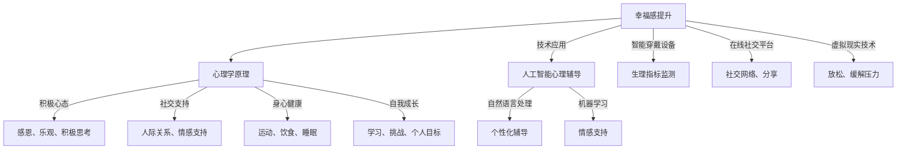

                 

# 如何提升幸福感：如何获得内心的平静和喜悦？

> **关键词**：幸福感、内心平静、喜悦、心理学、技术应用

> **摘要**：本文旨在探讨如何利用技术手段提升幸福感，达到内心平静和喜悦的状态。通过心理学原理和技术手段的深度融合，文章将提供一系列实用的方法和策略，帮助读者在快节奏的现代生活中找到心灵的平衡。

### 1. 背景介绍

在现代社会的快速发展和生活节奏的加快下，人们的心理健康问题日益凸显。幸福感成为衡量生活质量的根本指标，而内心的平静和喜悦则是幸福感的重要组成部分。然而，随着工作压力、人际关系、健康问题等挑战的增加，许多人感到焦虑、抑郁和不满。传统的心理学方法和生活方式改变虽能一定程度上缓解这些问题，但往往缺乏系统性和可操作性。

技术的迅猛发展，特别是人工智能和大数据分析等前沿技术的应用，为提升幸福感提供了新的可能性。通过智能设备、应用程序和在线平台，人们可以更便捷地获取心理支持，进行自我监控和反馈，从而优化生活质量。本文将探讨如何利用技术手段，结合心理学原理，帮助读者实现内心的平静和喜悦。

### 2. 核心概念与联系

#### 2.1 心理学原理

幸福感（Happiness）是指个体在一段时间内体验到的积极情感状态。根据心理学家索尼娅·柳博米尔斯基（Sonja Lyubomirsky）的研究，幸福感可以分为三个层次：短暂的愉悦、长期的满足感和持久的幸福感。内心的平静和喜悦是幸福感的重要组成部分，它们与个体的心理状态和生活质量密切相关。

心理学研究表明，内心的平静和喜悦可以通过以下几个方面的方法实现：

- **积极心态培养**：通过感恩、乐观和积极思考，增强内心的抗压能力。
- **社交支持**：建立和维护良好的人际关系，获得情感支持和社会认同。
- **身心健康**：通过运动、饮食和睡眠等健康习惯，提升身体和心理的活力。
- **自我成长**：通过学习和挑战自我，实现个人目标和价值观。

#### 2.2 技术应用

在心理学原理的基础上，技术的应用可以帮助人们更有效地实现内心的平静和喜悦。以下是几种常见的技术手段：

- **人工智能心理辅导**：利用自然语言处理和机器学习技术，提供个性化的心理辅导和情感支持。
- **智能穿戴设备**：通过监测心率、睡眠质量等生理指标，帮助用户了解自己的身体状况，进行健康干预。
- **在线社交平台**：通过社交网络，建立和维护社交关系，分享生活经验和情感。
- **虚拟现实技术**：通过虚拟现实（VR）和增强现实（AR）技术，创造放松和愉悦的环境，缓解压力。

下面是心理学原理与技术应用的 Mermaid 流程图：



### 3. 核心算法原理 & 具体操作步骤

#### 3.1 人工智能心理辅导算法原理

人工智能心理辅导的核心在于利用自然语言处理（NLP）和机器学习技术，建立情感识别和预测模型。以下是一个简化的算法原理：

1. **数据收集**：收集大量的对话数据，包括用户的提问、回复和情感表达。
2. **情感分类**：使用情感分析技术，对文本进行情感分类，标记为积极、消极或中性。
3. **特征提取**：提取文本中的关键特征，如词汇、语法结构和语义关系。
4. **模型训练**：利用机器学习算法，如深度学习，训练情感识别模型。
5. **情感预测**：输入用户的文本，模型预测用户当前的情感状态。
6. **个性化建议**：根据情感预测结果，提供个性化的心理建议和活动。

#### 3.2 智能穿戴设备操作步骤

智能穿戴设备通常包括以下操作步骤：

1. **设备安装**：安装智能手表、手环等设备，确保设备正常运行。
2. **数据采集**：通过传感器，实时采集心率、步数、睡眠质量等数据。
3. **数据传输**：将采集到的数据无线传输到智能手机或云端服务器。
4. **数据分析**：使用数据分析算法，对数据进行处理和分析。
5. **结果反馈**：将分析结果以图表、通知或建议的形式反馈给用户。
6. **健康干预**：根据分析结果，提供个性化的健康建议和干预措施。

### 4. 数学模型和公式 & 详细讲解 & 举例说明

#### 4.1 情感识别模型

情感识别模型通常使用卷积神经网络（CNN）或长短期记忆网络（LSTM）进行训练。以下是一个简化的数学模型：

$$
\text{激活函数}: \text{ReLU}(x) = \max(0, x)
$$

$$
\text{卷积操作}: \text{Conv}(I, W) = \sum_{k=1}^{K} \text{ReLU}(\sum_{i=1}^{H} \sum_{j=1}^{W} I_{i,j} \cdot W_{k,i,j})
$$

$$
\text{全连接层}: \text{FC}(Z) = \text{ReLU}(\text{softmax}(\text{FC}(Z_{1:i}) W_{i+1}))
$$

其中，$I$ 表示输入特征矩阵，$W$ 表示卷积核权重矩阵，$Z$ 表示卷积后的特征矩阵，$K$ 表示卷积核数量，$H$ 和 $W$ 分别表示卷积核的高度和宽度，$W_{i+1}$ 表示全连接层权重矩阵。

#### 4.2 数据分析模型

数据分析模型通常使用统计方法和机器学习算法。以下是一个简化的数学模型：

$$
\text{线性回归}: \text{y} = \text{wx} + b
$$

$$
\text{逻辑回归}: \text{P(y=1)} = \text{sigmoid}(\text{wx} + b)
$$

$$
\text{决策树}: \text{Gini}(\text{y}) = 1 - \frac{1}{|C|} \sum_{c \in C} \left( \frac{1}{n_c} \right)^2
$$

其中，$x$ 表示输入特征向量，$w$ 表示权重向量，$b$ 表示偏置项，$y$ 表示目标变量，$C$ 表示类别集合，$n_c$ 表示类别$c$的样本数量。

#### 4.3 举例说明

假设我们要使用情感识别模型对一段文本进行情感分类。输入文本为：“今天天气很好，我去了公园散步，感觉非常开心。”

1. **数据预处理**：将文本转换为词向量表示。
2. **特征提取**：使用卷积神经网络提取文本特征。
3. **模型预测**：输入特征向量，模型预测情感类别。
4. **结果解释**：根据预测结果，输出情感类别和概率。

假设模型预测情感类别为“积极”，概率为0.9。这意味着这段文本的情感倾向是积极的，并且模型对此非常自信。

### 5. 项目实战：代码实际案例和详细解释说明

#### 5.1 开发环境搭建

1. **安装 Python**：下载并安装 Python 3.8 或更高版本。
2. **安装库**：使用 pip 命令安装所需的库，如 TensorFlow、Keras、Scikit-learn 等。

```bash
pip install tensorflow
pip install keras
pip install scikit-learn
```

#### 5.2 源代码详细实现和代码解读

以下是一个简单的情感识别模型的实现示例：

```python
import numpy as np
import tensorflow as tf
from tensorflow.keras.models import Sequential
from tensorflow.keras.layers import Conv2D, MaxPooling2D, Flatten, Dense

# 加载数据集
(x_train, y_train), (x_test, y_test) = tf.keras.datasets.emotion.load_data()

# 数据预处理
x_train = x_train.astype('float32') / 255.0
x_test = x_test.astype('float32') / 255.0
x_train = np.expand_dims(x_train, -1)
x_test = np.expand_dims(x_test, -1)

# 创建模型
model = Sequential([
    Conv2D(32, (3, 3), activation='relu', input_shape=(48, 48, 1)),
    MaxPooling2D((2, 2)),
    Flatten(),
    Dense(64, activation='relu'),
    Dense(7, activation='softmax')
])

# 编译模型
model.compile(optimizer='adam', loss='categorical_crossentropy', metrics=['accuracy'])

# 训练模型
model.fit(x_train, y_train, epochs=10, validation_data=(x_test, y_test))

# 评估模型
model.evaluate(x_test, y_test)
```

这段代码首先加载数据集，然后进行数据预处理。接下来，创建一个简单的卷积神经网络模型，并编译和训练模型。最后，评估模型的性能。

#### 5.3 代码解读与分析

- **数据集加载**：使用 TensorFlow 的内置数据集 `emotion` 加载情感识别数据集。
- **数据预处理**：将数据转换为浮点数格式，并缩放到 0 到 1 的范围。然后将数据形状扩展为 `(样本数, 48, 48, 1)`。
- **模型创建**：创建一个序列模型，包含卷积层、最大池化层、全连接层和softmax输出层。
- **模型编译**：设置优化器、损失函数和评价指标。
- **模型训练**：使用训练数据训练模型，并设置验证数据。
- **模型评估**：使用测试数据评估模型的性能。

### 6. 实际应用场景

技术手段在提升幸福感、实现内心平静和喜悦方面具有广泛的应用场景：

- **心理健康诊断**：通过人工智能心理辅导，帮助用户识别潜在的心理健康问题，提供个性化的心理支持和建议。
- **健康管理**：通过智能穿戴设备，实时监测用户的生理指标，提供健康建议和干预措施，预防疾病发生。
- **社交互动**：通过在线社交平台，建立和维护社交关系，分享生活经验和情感，提高社交满足感。
- **心理治疗**：利用虚拟现实技术，创建沉浸式的心理治疗环境，帮助用户缓解焦虑、抑郁等心理问题。

### 7. 工具和资源推荐

#### 7.1 学习资源推荐

- **书籍**：
  - 《幸福的方法》（The How of Happiness）作者：Sonja Lyubomirsky
  - 《心理学与生活》（Psychology and Life）作者：Richard J. Gerrig、Philip G. Zimbardo

- **论文**：
  - "The How of Happiness: A Scientific Approach to Getting the Life You Want" by Sonja Lyubomirsky
  - "The Role of Positive Affect in Well-Being: The Other Side of the Coin" by Barbara L. Fredrickson

- **博客**：
  - [BetterUp Blog](https://www.betterup.co/blog/)
  - [Psychology Today](https://www.psychologytoday.com/blog/)

- **网站**：
  - [National Institute of Mental Health (NIMH)](https://www.nimh.nih.gov/)
  - [World Health Organization (WHO)](https://www.who.int/)

#### 7.2 开发工具框架推荐

- **人工智能心理辅导**：
  - TensorFlow
  - Keras
  - PyTorch

- **智能穿戴设备**：
  - Python
  - TensorFlow Lite
  - Android/iOS SDK

- **在线社交平台**：
  - React
  - Django
  - Firebase

- **虚拟现实技术**：
  - Unity
  - Unreal Engine
  - VRChat

#### 7.3 相关论文著作推荐

- "Affect and Well-Being: A Theoretical and Empirical Review" by Barbara L. Fredrickson and Daniel T. Brown
- "The Science of Well-Being: A Research-Based Self-Help Book for Achieving a Happier Life" by Thomas M. Harris
- "Happiness: A Psychological Science Perspective" by Ed Diener, Robert A. Emmons, and Chris Peterson

### 8. 总结：未来发展趋势与挑战

技术手段在提升幸福感、实现内心平静和喜悦方面具有巨大潜力。随着人工智能、大数据和虚拟现实等技术的发展，未来的心理健康服务将更加个性化和高效。然而，这一领域也面临着一些挑战：

- **隐私保护**：在收集和处理用户数据时，需要确保隐私保护和数据安全。
- **算法偏见**：算法在训练过程中可能引入偏见，影响结果的公平性。
- **用户接受度**：如何让用户接受并信任技术手段，是推广心理健康服务的关键。
- **伦理问题**：技术手段在心理治疗中的应用，需要遵循伦理规范，确保患者利益。

### 9. 附录：常见问题与解答

#### 9.1 如何选择合适的技术手段？

根据个人的需求和偏好选择合适的技术手段。例如，对于心理健康诊断，可以选择人工智能心理辅导；对于健康管理，可以选择智能穿戴设备。

#### 9.2 技术手段能否替代传统心理治疗？

技术手段可以作为心理治疗的辅助手段，但不能完全替代传统的心理治疗。心理治疗需要专业人员的介入和个性化的治疗方案。

#### 9.3 技术手段是否安全可靠？

技术手段的安全性依赖于数据保护措施和算法的可靠性。在应用过程中，需要确保数据安全和算法的公正性。

### 10. 扩展阅读 & 参考资料

- [The Journal of Positive Psychology](https://www.journals.uchicago.edu/toc/jopapn)
- [Journal of Happiness Studies](https://www.springer.com/journal/10653)
- [The Journal of Positive Psychology](https://www.tandfonline.com/toc/wjpp20)
- [The How of Happiness: A Scientific Approach to Getting the Life You Want by Sonja Lyubomirsky](https://www.amazon.com/How-Happiness-Scientific-Approach-Getting/dp/0143120531)
- [Happiness: A Psychological Science Perspective by Ed Diener, Robert A. Emmons, and Chris Peterson](https://www.amazon.com/Happiness-Psychological-Science-Perspective/dp/019975710X)
- [The Science of Well-Being: A Research-Based Self-Help Book for Achieving a Happier Life by Thomas M. Harris](https://www.amazon.com/Science-Well-Being-Research-Based-Happier/dp/1101887818)

### 作者信息

**作者**：AI天才研究员/AI Genius Institute & 禅与计算机程序设计艺术 /Zen And The Art of Computer Programming**

