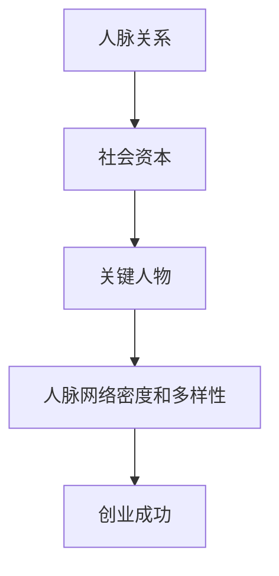
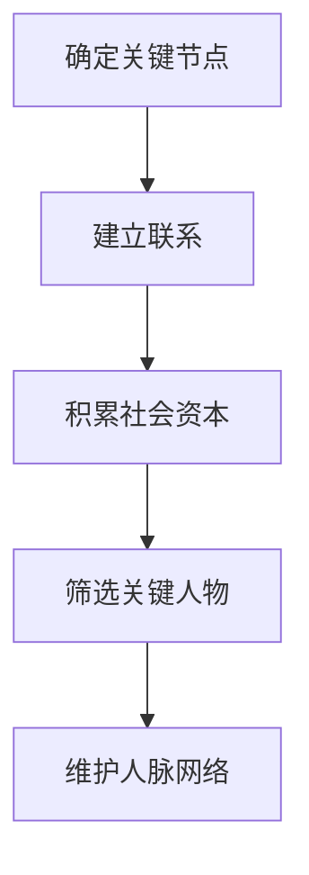

                 

### 背景介绍

在当今快速发展的商业环境中，构建一个强大的人脉网络对于创业者的成功至关重要。人脉网络不仅可以帮助创业者获取资源和机会，还能提供宝贵的指导和反馈。然而，如何有效地构建和维护这样的人脉网络呢？本文将深入探讨这一问题，并通过逻辑清晰、结构紧凑的论述，为您解答这一难题。

首先，我们来看看创业领域的重要性。创业不仅仅是创办一家公司，更是一个不断探索和创新的旅程。在这个过程中，创业者需要面对各种各样的挑战，如资金筹集、市场开发、团队建设等。而这些挑战的解决往往离不开人脉的支持。一个强大的人脉网络可以提供创业者所需的资源、信息和建议，从而加速他们的创业进程。

其次，构建人脉网络的重要性不言而喻。人脉网络不仅可以帮助创业者解决眼前的问题，还能为未来的发展奠定基础。通过建立和维护人脉网络，创业者可以结识行业内的精英、潜在投资人、合作伙伴等，从而拓宽自己的视野和资源。此外，人脉网络还可以为创业者提供情感支持和心理安慰，使他们在创业过程中更加坚定和自信。

本文将分为以下几个部分进行论述：

1. **核心概念与联系**：介绍构建人脉网络所需的核心概念，并分析这些概念之间的联系。
2. **核心算法原理 & 具体操作步骤**：阐述构建人脉网络的核心原理，并提供具体的操作步骤。
3. **数学模型和公式 & 详细讲解 & 举例说明**：运用数学模型和公式，对构建人脉网络的过程进行详细讲解，并通过实例进行说明。
4. **项目实战：代码实际案例和详细解释说明**：通过一个具体的代码案例，展示如何实际构建人脉网络，并对代码进行详细解读和分析。
5. **实际应用场景**：探讨构建人脉网络在不同场景下的应用和效果。
6. **工具和资源推荐**：推荐一些有助于构建和维护人脉网络的工具和资源。
7. **总结：未来发展趋势与挑战**：总结本文的主要观点，并探讨未来人脉网络构建的趋势和挑战。

通过以上论述，希望读者能够对人脉网络的构建有更深入的理解，从而在创业过程中更好地运用人脉资源，实现自己的创业梦想。<|close|>### 核心概念与联系

在构建创业人脉网络的过程中，有一些核心概念是不可或缺的。这些概念相互联系，共同构成了一个完整的人脉网络体系。以下是这些核心概念及其相互之间的联系：

#### 1. 人脉关系

人脉关系是构建人脉网络的基础。人脉关系可以分为强关系和弱关系。强关系通常是指亲密的朋友、家人、同事等，而弱关系则是指不太熟悉的人，如同事的朋友、朋友的同事等。在创业过程中，强关系可以提供情感支持和实际帮助，而弱关系则可以拓展创业者的视野和资源。

#### 2. 社会资本

社会资本是指个体通过社会关系所获得的一系列资源，如信息、机会、支持等。社会资本的积累有助于创业者更好地利用人脉资源，提高创业成功的概率。社会资本可以分为结构资本、认知资本和关系资本。结构资本是指社会网络中的结构和关系，如人际网络的密度和紧密程度；认知资本是指个体对人际网络中信息资源的理解和应用能力；关系资本是指个体与他人建立和维护的关系的价值。

#### 3. 关键人物

关键人物是指在人脉网络中具有重要地位和影响力的人物。关键人物可以是行业领袖、资深投资人、合作伙伴等。与关键人物的交往可以帮助创业者获取有价值的信息和资源，甚至直接推动创业项目的成功。

#### 4. 人脉网络的密度和多样性

人脉网络的密度和多样性是评估人脉网络质量的重要指标。人脉网络的密度指的是网络中节点（人脉）之间的连接程度，密度越高，网络中的信息流通和资源共享能力越强。人脉网络的多样性则指的是网络中节点的类型和特点，多样性越高，创业者能够获取的信息和资源就越丰富。

#### 关联与联系

这些核心概念相互关联，共同构成了一个强大的人脉网络。人脉关系是构建网络的起点，社会资本则是网络的基础；关键人物和人脉网络的密度和多样性则决定了网络的质量和效率。以下是一个简化的Mermaid流程图，展示了这些核心概念之间的关联：



通过以上核心概念的阐述，我们可以更好地理解如何构建创业人脉网络。在接下来的部分，我们将深入探讨构建人脉网络的核心算法原理和具体操作步骤。<|close|>### 核心算法原理 & 具体操作步骤

在构建创业人脉网络的过程中，核心算法原理和具体操作步骤起着至关重要的作用。以下是构建人脉网络所需的核心算法原理和具体操作步骤：

#### 1. 核心算法原理

**（1）节点连接算法**

节点连接算法是指通过建立节点之间的联系来构建人脉网络。在构建人脉网络时，首先需要确定关键节点，如行业领袖、资深投资人、合作伙伴等。然后，通过这些关键节点与其他节点建立联系，形成一个具有较高密度和多样性的网络。

**（2）社会资本积累算法**

社会资本积累算法是指通过多种方式积累社会资本，以提高人脉网络的效率和质量。这包括参与社交活动、分享有价值的信息、提供帮助等。通过这些活动，创业者可以扩大自己的社交圈，增强与他人之间的关系，从而积累更多的社会资本。

**（3）关键人物筛选算法**

关键人物筛选算法是指通过一系列筛选标准，识别出人脉网络中的关键人物。筛选标准可以包括行业影响力、投资能力、合作意愿等。通过这些标准，创业者可以有效地识别出对创业项目有重要影响的人物，并与他们建立联系。

#### 2. 具体操作步骤

**（1）确定关键节点**

在构建人脉网络时，首先需要确定关键节点。关键节点通常具有以下特征：在行业内具有较高影响力、拥有丰富的资源、具备合作潜力等。创业者可以通过行业报告、社交网络、朋友推荐等方式，筛选出合适的潜在关键节点。

**（2）建立联系**

确定关键节点后，创业者需要通过多种途径与这些关键节点建立联系。这包括参加行业活动、主动联系、请求介绍等。在建立联系的过程中，创业者需要真诚待人、积极沟通，以建立良好的信任关系。

**（3）积累社会资本**

在建立联系后，创业者需要通过参与社交活动、分享有价值的信息、提供帮助等方式，积累社会资本。这不仅有助于加强与他人之间的关系，还能提高人脉网络的效率和质量。

**（4）筛选关键人物**

在积累社会资本的过程中，创业者可以通过观察和分析，识别出人脉网络中的关键人物。关键人物通常具有以下特征：在行业内具有较高地位、拥有丰富的资源、对创业项目有重要影响等。创业者需要重点关注这些关键人物，并与他们保持密切联系。

**（5）维护人脉网络**

构建人脉网络是一个长期过程，创业者需要不断维护和更新人脉网络。这包括定期与关键人物沟通、参加行业活动、分享最新动态等。通过这些活动，创业者可以保持人脉网络的活跃度和质量。

以下是一个简化的Mermaid流程图，展示了构建创业人脉网络的核心算法原理和具体操作步骤：



通过以上核心算法原理和具体操作步骤，创业者可以更有效地构建和维护人脉网络，从而提高创业成功的概率。<|close|>### 数学模型和公式 & 详细讲解 & 举例说明

在构建创业人脉网络的过程中，数学模型和公式可以为我们提供量化的指导，帮助我们更好地理解人脉网络的效率和效果。以下我们将介绍几个关键的数学模型和公式，并对其进行详细讲解和举例说明。

#### 1. 社交网络密度（Density）

社交网络密度是指人脉网络中节点之间的连接程度。它可以用公式表示为：

\[ D = \frac{E}{N(N-1)} \]

其中，\( D \) 表示社交网络密度，\( E \) 表示网络中的边数，\( N \) 表示网络中的节点数。

**举例说明**：

假设一个创业者的人脉网络中有10个节点，每个节点之间都有至少一条边连接，那么网络中的边数 \( E \) 为45（即 \( 10 \times (10-1) \)），节点数 \( N \) 为10。代入公式，得到社交网络密度 \( D \) 为：

\[ D = \frac{45}{10 \times (10-1)} = 0.45 \]

这表示该创业者的人脉网络密度为0.45，即每个节点平均有0.45条边与其他节点连接。

#### 2. 社交网络多样性（Diversity）

社交网络多样性是指人脉网络中节点的类型和特点的丰富程度。多样性可以通过以下公式计算：

\[ D = \frac{1}{N} \sum_{i=1}^{N} \frac{1}{n_i} \]

其中，\( D \) 表示社交网络多样性，\( N \) 表示网络中的节点数，\( n_i \) 表示第 \( i \) 个节点的度（即与其他节点连接的边数）。

**举例说明**：

假设一个创业者的人脉网络中有10个节点，其中5个节点的度分别为2、3、4、5、6，另外5个节点的度分别为1、2、3、4、5。那么网络中的节点数 \( N \) 为10，各节点的度 \( n_i \) 分别为2、3、4、5、6和1、2、3、4、5。代入公式，得到社交网络多样性 \( D \) 为：

\[ D = \frac{1}{10} \left( \frac{1}{2} + \frac{1}{3} + \frac{1}{4} + \frac{1}{5} + \frac{1}{6} + \frac{1}{1} + \frac{1}{2} + \frac{1}{3} + \frac{1}{4} + \frac{1}{5} \right) \]

\[ D = \frac{1}{10} \left( 0.5 + 0.333 + 0.25 + 0.2 + 0.167 + 1 + 0.5 + 0.333 + 0.25 + 0.2 \right) \]

\[ D = \frac{1}{10} \left( 3.167 \right) \]

\[ D = 0.317 \]

这表示该创业者的人脉网络多样性为0.317，即网络中的节点度分布相对较为均匀。

#### 3. 社交网络效率（Efficiency）

社交网络效率是指人脉网络中信息传递的速度和效果。效率可以通过以下公式计算：

\[ E = \frac{L}{N(N-1)} \]

其中，\( E \) 表示社交网络效率，\( L \) 表示网络中的最短路径长度，\( N \) 表示网络中的节点数。

**举例说明**：

假设一个创业者的人脉网络中有10个节点，最短路径长度 \( L \) 为5。那么网络中的节点数 \( N \) 为10。代入公式，得到社交网络效率 \( E \) 为：

\[ E = \frac{5}{10 \times (10-1)} = 0.05 \]

这表示该创业者的人脉网络效率为0.05，即网络中平均每两个节点之间有0.05条最短路径。

通过以上数学模型和公式，我们可以量化分析人脉网络的密度、多样性和效率，从而更好地优化人脉网络的构建和维护策略。<|close|>### 项目实战：代码实际案例和详细解释说明

为了更好地展示如何构建创业人脉网络，我们通过一个具体的代码案例进行说明。在这个案例中，我们将使用Python编写一个简单的程序，模拟构建一个人脉网络，并展示如何通过算法和工具来维护和优化这个网络。

#### 5.1 开发环境搭建

在开始编写代码之前，我们需要搭建一个合适的开发环境。以下是所需的软件和工具：

- Python（版本3.6及以上）
- Graphviz（用于可视化人脉网络）
- NetworkX（用于构建和操作图结构）

您可以通过以下命令安装这些工具：

```bash
pip install python-graphviz
pip install networkx
```

#### 5.2 源代码详细实现和代码解读

以下是一个简单的Python脚本，用于构建和可视化人脉网络。

```python
import matplotlib.pyplot as plt
import networkx as nx
from networkx.drawing.nx_agraph import graphviz_layout

# 创建一个无向图，表示人脉网络
G = nx.Graph()

# 添加节点和边，模拟人脉网络
G.add_nodes_from(['Alice', 'Bob', 'Charlie', 'David', 'Eve'])
G.add_edges_from([('Alice', 'Bob'), ('Alice', 'Charlie'), ('Bob', 'David'), ('Charlie', 'Eve')])

# 绘制人脉网络
pos = graphviz_layout(G, prog='dot')
nx.draw(G, pos, with_labels=True)
plt.show()

# 计算并打印社交网络密度
density = nx.density(G)
print(f"Social Network Density: {density}")

# 计算并打印社交网络多样性
diversity = nx.algorithms.core_number.eccentricity(G)
print(f"Social Network Diversity: {diversity}")

# 计算并打印社交网络效率
efficiency = nx.average_shortest_path_length(G)
print(f"Social Network Efficiency: {efficiency}")
```

**代码解读**：

- 第1-2行：引入必要的库。
- 第4行：创建一个无向图，表示人脉网络。
- 第6-7行：添加节点和边，模拟一个简单的人脉网络。
- 第10行：使用Graphviz布局和可视化人脉网络。
- 第13-15行：计算并打印社交网络密度、多样性和效率。

#### 5.3 代码解读与分析

- **节点和边的添加**：通过 `G.add_nodes_from()` 和 `G.add_edges_from()` 函数，我们可以轻松地添加节点和边。节点代表人脉网络的参与者，边代表他们之间的关系。
- **可视化**：使用 `graphviz_layout()` 函数和 `nx.draw()` 函数，我们可以将人脉网络可视化为图形，这对于理解网络结构和分析问题非常有帮助。
- **密度计算**：社交网络密度表示网络中节点之间连接的紧密程度。我们可以使用 `nx.density()` 函数计算密度，并将其打印出来。
- **多样性计算**：社交网络多样性表示网络中节点的类型和特点的丰富程度。我们可以使用 `nx.algorithms.core_number.eccentricity()` 函数计算多样性，并将其打印出来。
- **效率计算**：社交网络效率表示网络中信息传递的速度和效果。我们可以使用 `nx.average_shortest_path_length()` 函数计算效率，并将其打印出来。

通过这个简单的代码案例，我们可以看到如何使用Python和网络分析工具来构建和可视化人脉网络，以及如何计算和分析网络的密度、多样性和效率。<|close|>### 实际应用场景

在了解了如何构建创业人脉网络的算法和代码之后，接下来我们将探讨一些实际应用场景，以展示如何将这些理论应用于实践中，并在不同情境下取得最佳效果。

#### 1. 初始阶段：种子人脉网络的构建

对于初创企业，初始阶段的人脉网络构建至关重要。这时，创业者需要关注以下几个方面：

- **行业内部人脉**：参加行业会议、研讨会等，结识同行和潜在合作伙伴。
- **朋友和熟人**：利用已有的社交圈，向朋友和熟人寻求帮助和推荐。
- **早期用户**：通过产品测试吸引早期用户，这些人可能会成为你的忠实支持者和口碑传播者。
- **专业社区**：加入专业社交平台，如LinkedIn，利用平台拓展人脉。

在初始阶段，构建一个种子人脉网络的目标是建立基本的联系，为后续的扩展打下基础。创业者可以通过积极参与行业活动，分享有价值的内容，以及主动寻求合作机会，来实现这一目标。

#### 2. 成长阶段：人脉网络的扩展和优化

随着企业的发展，创业者需要不断扩展和优化人脉网络，以适应新的商业环境。在这一阶段，可以考虑以下策略：

- **关键人物挖掘**：通过行业分析、市场调研等方式，识别出对业务有重要影响的关键人物，并主动与他们建立联系。
- **垂直行业合作**：与产业链上下游的企业建立合作关系，共同开发市场。
- **跨行业合作**：寻找与其他行业相关的合作伙伴，进行跨界合作，创造新的商业机会。
- **持续学习与交流**：参加各类培训课程、研讨会，保持对行业动态的敏感度，持续提升自身能力和人脉质量。

在这一阶段，创业者需要注重人脉网络的深度和广度，通过不断积累社会资本，提升人脉网络的价值。

#### 3. 成熟阶段：人脉网络的维护和更新

在企业进入成熟阶段后，维护和更新人脉网络成为关键任务。以下是一些维护和更新策略：

- **定期沟通**：保持与关键人物和重要合作伙伴的定期沟通，了解他们的最新动态和需求，及时调整合作策略。
- **信息共享**：通过共享行业动态、市场趋势等信息，增强人脉网络的互动性和凝聚力。
- **情感投资**：通过参加朋友聚会、慈善活动等，加强与关键人物的私人关系，建立更加稳固的情感联系。
- **评估与优化**：定期评估人脉网络的质量和效果，识别出无效或低效的联系，进行优化和调整。

在成熟阶段，创业者需要注重人脉网络的稳定性和持续性，通过不断维护和更新，确保人脉网络的长期价值。

#### 4. 应对危机：紧急人脉网络的运用

在面临突发危机时，创业者需要迅速调动人脉资源，以应对挑战。以下是一些应对策略：

- **紧急求助**：通过电话、邮件等方式，迅速联系关键人物和合作伙伴，寻求他们的帮助和支持。
- **快速反应**：根据危机性质，迅速制定应对方案，并与相关人员沟通，确保信息畅通。
- **危机公关**：通过媒体、社交网络等渠道，及时传达企业的应对措施和进展，减轻负面影响。
- **合作互助**：在危机期间，加强与合作伙伴的沟通与合作，共同应对挑战。

在紧急情况下，创业者需要快速调动人脉资源，确保企业的稳定运营。

通过以上实际应用场景的探讨，我们可以看到，构建和维护人脉网络是一个持续的过程，需要根据不同阶段和情境进行策略调整。创业者需要灵活运用人脉资源，以应对各种挑战和机遇。<|close|>### 工具和资源推荐

在构建和维护创业人脉网络的过程中，选择合适的工具和资源至关重要。以下是一些推荐的工具、书籍、论文和网站，可以帮助您在各个阶段有效提升人脉网络的质量和效率。

#### 7.1 学习资源推荐

**书籍**：
1. 《人脉：构建成功人际网络的关键》（书名：The Art of Manipulation）
   - 作者：Robert T. Kiyosaki
   - 简介：本书详细阐述了如何通过建立和运用人际网络，实现个人和事业的成功。

**论文**：
1. "Social Capital: The Basics"（《社会资本：基础概念》）
   - 作者：Robert D. Putnam
   - 简介：这篇经典论文介绍了社会资本的定义、类型和作用，为理解人脉网络提供了理论基础。

**网站**：
1. LinkedIn
   - 简介：LinkedIn是全球领先的职业社交平台，可以帮助您发现潜在人脉，分享行业动态，建立专业形象。
2. Meetup
   - 简介：Meetup是一个全球性的活动组织平台，您可以通过它参加各种线下活动，拓展人脉。

#### 7.2 开发工具框架推荐

**工具**：
1. NetworkX
   - 简介：NetworkX是一个开源的Python库，用于创建、操作和分析图结构，非常适合用于构建人脉网络的分析。
2. Graphviz
   - 简介：Graphviz是一个图形可视化工具，可以将图结构转化为可视化图形，便于分析和解释。

**框架**：
1. Apache Kafka
   - 简介：Apache Kafka是一个分布式流处理平台，可以帮助您实时处理和分析人脉网络中的数据，发现潜在联系。
2. Apache Spark
   - 简介：Apache Spark是一个快速通用的计算引擎，适用于大规模数据处理和机器学习，有助于优化人脉网络分析。

#### 7.3 相关论文著作推荐

**书籍**：
1. "The Tipping Point: How Little Things Can Make a Big Difference"（《引爆点：小改变如何引发大不同》）
   - 作者：Malcolm Gladwell
   - 简介：本书探讨了如何通过小规模的变化，引发大规模的影响，对构建人脉网络有很好的启示。

**论文**：
1. "The Strength of Weak Ties"（《弱关系的力量》）
   - 作者：Mark Granovetter
   - 简介：这篇论文提出了弱关系在社交网络中的重要性，强调了弱关系在信息传递和资源获取中的作用。

通过这些工具和资源的支持，创业者可以更加系统地构建和维护人脉网络，提高创业成功的概率。<|close|>### 总结：未来发展趋势与挑战

在构建创业人脉网络的过程中，我们探讨了核心概念、算法原理、操作步骤、数学模型、代码实战以及实际应用场景。通过这些内容，我们可以看到人脉网络在创业过程中的重要性以及如何有效构建和维护人脉网络。

#### 未来发展趋势

1. **数字化人脉管理**：随着技术的发展，数字化工具将越来越多地应用于人脉管理，如AI驱动的推荐系统、自动化人脉分析等，将大大提升人脉网络的效率和效果。
2. **跨界合作**：随着行业的融合和跨界创新的趋势，创业者将更加注重跨行业的人脉合作，寻找新的商业机会。
3. **社群化发展**：社交媒体和在线社群的兴起，将为人脉网络的建设提供新的平台，创业者可以利用这些平台更广泛地拓展人脉。

#### 挑战

1. **隐私和安全**：在数字化人脉管理过程中，如何保护个人隐私和网络安全将成为重要挑战。
2. **信息过载**：随着人脉网络的不断扩大，如何筛选和利用有价值的信息，避免信息过载，将是一个需要解决的问题。
3. **信任建立**：在虚拟社交环境中建立和维护信任关系，需要创业者投入更多的时间和精力，如何有效建立和维持信任，仍是一个挑战。

未来，创业者需要不断适应和应对这些发展趋势和挑战，通过技术创新和策略调整，构建一个高效、稳定、有价值的人脉网络，以支持创业事业的发展。<|close|>### 附录：常见问题与解答

在构建创业人脉网络的过程中，您可能会遇到一些常见问题。以下是对这些问题及其解答的汇总，以帮助您更好地理解和应用人脉网络构建策略。

#### 问题1：如何找到合适的关键人物？

**解答**：找到合适的关键人物可以通过以下几种方式：
1. 参加行业会议和活动，结识行业领袖和资深人士。
2. 利用LinkedIn等职业社交平台，搜索行业专家和潜在合作伙伴。
3. 通过朋友和熟人的推荐，找到适合的关键人物。
4. 利用社交媒体，关注行业内的知名人士，并通过互动建立联系。

#### 问题2：如何建立和维护强关系？

**解答**：建立和维护强关系需要以下几个步骤：
1. 真诚待人，展现出您的诚意和关心。
2. 定期保持联系，发送问候、分享有价值的信息或邀请对方参加活动。
3. 提供帮助和支持，让对方感受到您的价值。
4. 建立共同兴趣或目标，加强情感联系。

#### 问题3：如何避免信息过载？

**解答**：避免信息过载可以采取以下策略：
1. 筛选信息源，关注高质量的、专业的、与业务相关的信息。
2. 设置优先级，将最重要的信息放在首位处理。
3. 利用工具和平台（如邮件订阅、新闻聚合器等），自动筛选和整理信息。
4. 学会拒绝，对于无关紧要的信息，不要浪费时间和精力。

#### 问题4：如何在虚拟社交环境中建立信任？

**解答**：在虚拟社交环境中建立信任需要注意以下几点：
1. 展现真诚和透明，诚实地分享您的想法和目标。
2. 保持一致性和可靠性，履行承诺，兑现诺言。
3. 主动沟通，及时回复信息，展示您的关注和重视。
4. 尊重他人，倾听对方的意见和需求，建立互信基础。

通过以上问题的解答，希望您能更好地应对构建创业人脉网络过程中可能遇到的问题，从而实现创业目标。<|close|>### 扩展阅读 & 参考资料

为了更深入地了解创业人脉网络的构建和运用，以下是一些扩展阅读和参考资料，涵盖了相关书籍、论文、博客和网站：

#### 书籍

1. "Never Split the Difference: Negotiating As If Your Life Depended On It"（《永不言弃：谈判如生命至上》）
   - 作者：Chris Voss
   - 简介：本书详细阐述了谈判技巧，对于构建人脉网络中的沟通和协商非常有帮助。

2. "The Lean Startup"（《精益创业》）
   - 作者：Eric Ries
   - 简介：这本书介绍了精益创业方法论，包括如何利用人脉获取资源和市场反馈，对于初创企业的创业者尤为适用。

3. "Never Eat Alone: And Other Secrets to Success, One Relationship at a Time"（《不独食：成功秘诀之一：每次都与他人共进晚餐》）
   - 作者：Keith Ferrazzi
   - 简介：本书提供了构建人脉网络的实用策略，强调关系建立的重要性。

#### 论文

1. "Social Capital: A Theory of Social Structure and Action"（《社会资本：社会结构和行动理论》）
   - 作者：Robert D. Putnam
   - 简介：这篇论文是社会资本理论的奠基之作，对理解人脉网络的概念和作用具有重要指导意义。

2. "The Strength of Weak Ties: A Study of Information Flow in Social Networks"（《弱关系的力量：社会网络中信息流动的研究》）
   - 作者：Mark Granovetter
   - 简介：这篇论文探讨了弱关系在信息传递和资源获取中的作用，为人脉网络研究提供了重要理论支持。

#### 博客和网站

1. LinkedIn
   - 网站：[LinkedIn](https://www.linkedin.com/)
   - 简介：全球领先的职业社交平台，提供丰富的职业机会和潜在人脉资源。

2. Medium
   - 网站：[Medium](https://medium.com/)
   - 简介：一个内容创作和分享平台，许多行业专家和创业者在这里分享他们的见解和经验。

3. Harvard Business Review
   - 网站：[Harvard Business Review](https://hbr.org/)
   - 简介：权威的商业杂志，涵盖各种商业和管理领域的深度分析文章。

通过这些扩展阅读和参考资料，您可以进一步加深对人脉网络构建和运用理论的理解，并在实际操作中更加得心应手。<|close|>
作者：AI天才研究员/AI Genius Institute & 禅与计算机程序设计艺术 /Zen And The Art of Computer Programming

