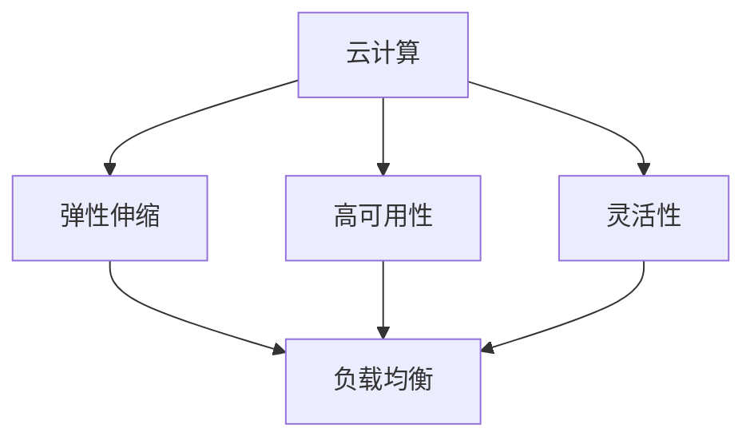
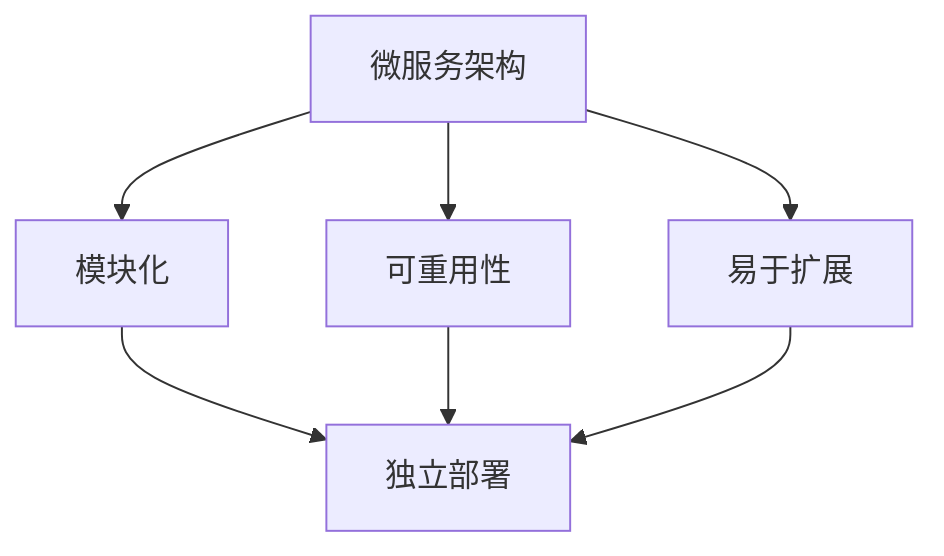
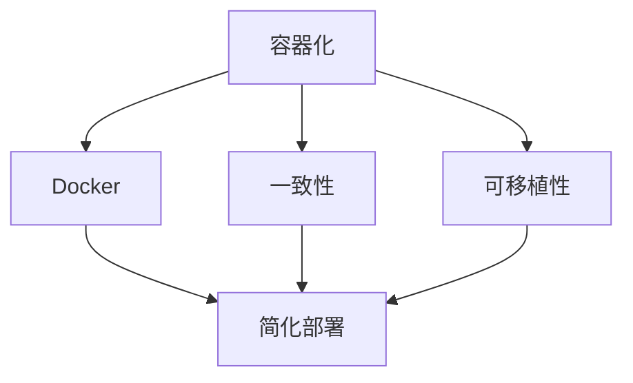
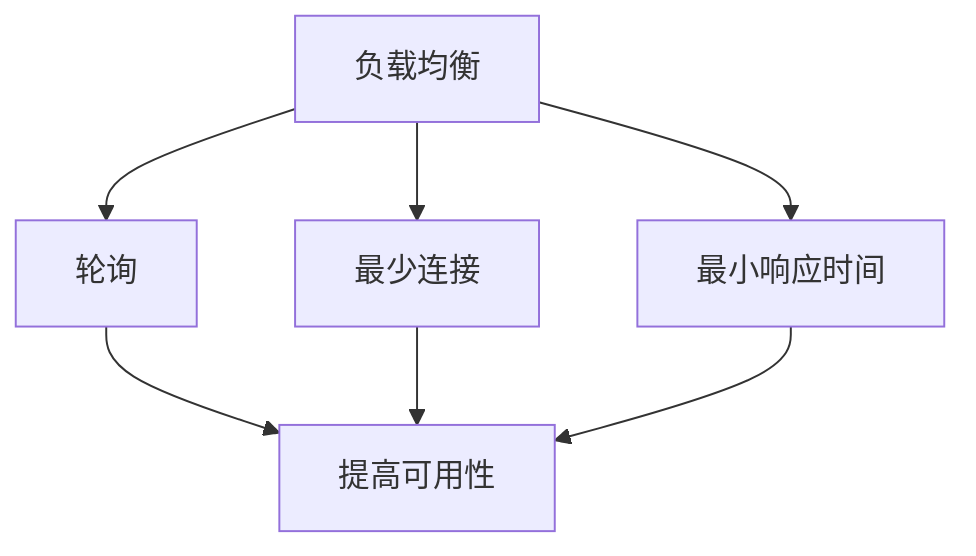
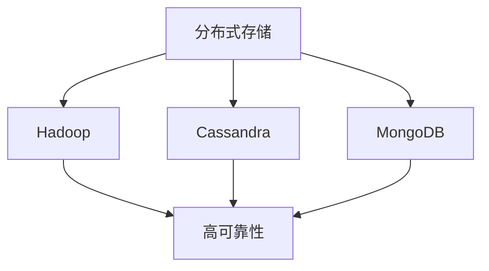

                 

## 背景介绍

### 引言

SaaS（软件即服务）作为一种新兴的商业模式，正在迅速改变传统的软件部署和使用方式。相较于传统的企业软件，SaaS 提供了一种更加灵活、成本效益更高的解决方案。SaaS 产品通过互联网向客户提供软件服务，用户无需购买和安装软件，只需通过浏览器即可使用。这种模式不仅降低了企业的IT成本，还提高了软件的可用性和可维护性。

随着云计算和大数据技术的不断发展，SaaS 市场呈现出爆炸式增长。越来越多的企业开始将核心业务转移到云端，以实现更高的效率、更低的成本和更好的用户体验。然而，SaaS 产品的成功不仅取决于其功能和质量，还与其可扩展性密切相关。一个可扩展的 SaaS 产品架构能够确保在用户数量和业务需求不断增加的情况下，系统性能不会下降，用户体验不会受到影响。

本文旨在探讨如何构建一个可扩展的 SaaS 产品架构。我们将从核心概念、算法原理、数学模型、实战案例等多个角度，详细解析如何设计一个既高效又灵活的 SaaS 产品架构。本文的目标是帮助读者了解构建可扩展 SaaS 架构的核心原则和方法，为实际开发工作提供有价值的参考。

### SaaS 产品架构的重要性

SaaS 产品架构在 SaaS 商业模式中起着至关重要的作用。一个良好的架构不仅能够提高系统的可扩展性，还能够确保系统的稳定性和高性能。以下是几个关键点，解释了为什么一个优秀的 SaaS 架构对于产品的成功至关重要：

1. **可扩展性**：随着用户数量的增加，系统需要能够无缝扩展。这意味着在不需要大规模重构或暂停服务的情况下，系统可以处理更多的请求和用户。一个可扩展的架构可以有效地分配资源和负载，从而确保用户在增长时仍能获得良好的服务体验。

2. **高可用性**：系统需要能够在各种情况下保持运行，包括硬件故障、网络中断等。通过设计一个高可用的架构，可以确保在发生故障时，系统能够快速恢复，减少对用户的影响。

3. **高性能**：用户对于系统响应速度有着极高的要求。一个高性能的架构可以通过优化数据库查询、缓存策略、异步处理等技术，确保系统在高峰期能够快速响应用户请求。

4. **灵活性和可维护性**：一个灵活的架构可以轻松适应业务需求的变化，而无需进行大规模的重构。此外，良好的架构设计使得系统更容易维护和升级，降低了长期维护成本。

5. **成本效益**：通过高效利用资源、减少重复开发和优化开发流程，一个可扩展的架构可以帮助企业降低运营成本，提高投资回报率。

综上所述，一个优秀的 SaaS 产品架构对于企业的成功至关重要。它不仅能够提升用户体验，还能够帮助企业应对市场变化，实现持续的业务增长。接下来，我们将详细探讨构建可扩展 SaaS 架构的核心概念和原理。

### 文章关键词

- SaaS 产品架构
- 可扩展性
- 云计算
- 大数据
- 高可用性
- 高性能
- 灵活性和可维护性
- 成本效益

### 文章摘要

本文将深入探讨如何构建一个可扩展的 SaaS 产品架构。首先，我们将介绍 SaaS 商业模式及其在当今市场中的重要性。接着，我们将详细分析 SaaS 产品架构的关键要素，包括可扩展性、高可用性、高性能、灵活性和可维护性等。通过分析核心概念和算法原理，我们将提供一系列实际操作步骤和数学模型，帮助读者理解如何设计一个高效且灵活的架构。随后，我们将通过实战案例展示如何在实际项目中实现这些架构原则。文章最后，我们将探讨 SaaS 产品的实际应用场景，并推荐相关工具和资源，以便读者进一步学习和实践。本文的目标是为开发者和企业提供一个全面而深入的指南，以帮助他们构建具有高度可扩展性的 SaaS 产品架构。

### 1. 核心概念与联系

构建一个可扩展的 SaaS 产品架构首先需要理解几个核心概念，这些概念包括云计算、微服务架构、容器化、负载均衡、以及分布式存储等。以下是这些概念的定义及其相互联系。

#### 云计算

云计算是一种通过互联网提供计算资源的方式，这些资源包括网络、服务器、存储、应用程序和服务的集合。云计算使得企业能够按需获取资源，无需购买和维护物理硬件。云计算提供了弹性伸缩、高可用性和灵活性的优势，这对于构建可扩展的 SaaS 产品至关重要。

**Mermaid 流程图：**



#### 微服务架构

微服务架构是一种设计方法，它将应用程序分解为小型、独立的服务，每个服务负责实现特定的业务功能。这些服务可以通过网络进行通信，并且可以独立部署和扩展。微服务架构的优势在于其模块化、可重用性和易于扩展性。

**Mermaid 流程图：**



#### 容器化

容器化是一种轻量级虚拟化技术，它允许开发者在隔离的环境中运行应用程序。容器提供了一致性和可移植性，使得应用程序可以在不同的环境中无缝运行，而无需进行大量修改。Docker 是最流行的容器化平台，它简化了容器的创建、部署和管理。

**Mermaid 流程图：**



#### 负载均衡

负载均衡是一种将网络请求分发到多个服务器的技术，以确保系统在高负载情况下能够保持稳定运行。负载均衡可以减少单个服务器的负载，提高系统的可用性和响应速度。常见的负载均衡算法包括轮询、最少连接和最小响应时间等。

**Mermaid 流程图：**



#### 分布式存储

分布式存储是一种将数据存储在多个物理节点上的技术，以提高数据的可靠性和可用性。分布式存储系统能够在节点失败时自动恢复，并且可以在不中断服务的情况下进行扩展。常见的分布式存储系统包括 Hadoop、Cassandra 和 MongoDB 等。

**Mermaid 流程图：**



这些核心概念相互联系，共同构成了一个可扩展的 SaaS 产品架构。云计算提供了弹性资源，微服务架构实现了模块化和可扩展性，容器化简化了部署和管理，负载均衡保证了高可用性，而分布式存储提高了数据可靠性和系统性能。

通过理解这些核心概念及其联系，我们可以设计出一个既灵活又强大的 SaaS 产品架构，从而在应对业务增长和用户需求变化时，保持系统的稳定性和高性能。

### 2. 核心算法原理 & 具体操作步骤

要构建一个可扩展的 SaaS 产品架构，核心算法原理的理解和具体操作步骤的实施是不可或缺的。以下是几个关键算法及其应用场景的详细解析。

#### 分布式一致性算法

**Raft 和 Paxos**

分布式一致性算法用于保证分布式系统中多个节点之间数据的一致性。Raft 和 Paxos 是两种广泛使用的分布式一致性算法。

- **Raft**：Raft 算法是一种简化版 Paxos 算法，它通过明确的角色划分（领导者、追随者、候选人）和日志复制机制，实现了高可用性和容错性。在 SaaS 架构中，Raft 可以用于分布式数据库的同步和状态机管理，确保数据在不同节点之间的一致性。

- **Paxos**：Paxos 是一种更为通用的分布式一致性算法，它通过提议-决策机制来保证一致性。Paxos 的复杂性较高，但在需要严格一致性保证的场景中，例如分布式锁和分布式事务管理，Paxos 是一个可靠的选择。

**具体操作步骤**：

1. **选择领导者**：在分布式系统中，首先通过选举算法（如 Raft 的领导者选举）选择一个领导者节点。
2. **提议日志**：领导者节点接收客户端的提议，并将其添加到日志中。
3. **日志复制**：领导者节点将日志复制到其他追随者节点。
4. **决策**：当大多数节点确认日志条目后，领导者节点将做出最终决策，并将结果返回给客户端。

#### 负载均衡算法

**轮询、最少连接和最小响应时间**

负载均衡算法用于将请求分配到多个服务器，以均衡负载和最大化系统性能。

- **轮询**：轮询算法按顺序将请求分配到服务器，是最简单且常用的负载均衡算法。它确保了请求均匀地分布到每个服务器，但可能无法充分利用服务器的性能。

- **最少连接**：最少连接算法将新请求分配到当前连接数最少的服务器，从而减少服务器之间的负载差异。这种算法适用于长连接的场景，例如数据库服务器。

- **最小响应时间**：最小响应时间算法根据当前服务器的响应时间将请求分配到最快速的服务器，从而优化系统的响应时间。这种算法适用于请求频繁的场景，例如 Web 服务器。

**具体操作步骤**：

1. **监控服务器状态**：实时监控每个服务器的负载、连接数和响应时间。
2. **计算负载均衡值**：根据选定的算法计算每个服务器的负载均衡值。
3. **分配请求**：将新请求分配到负载均衡值最小的服务器。

#### 数据库分片算法

**哈希分片和范围分片**

数据库分片是将数据水平切分到多个数据库实例的技术，以提高查询性能和可扩展性。

- **哈希分片**：哈希分片通过使用哈希函数将数据分布到不同的分片上。这种方法的优点是查询性能高，因为分片键直接映射到分片。缺点是数据迁移和负载均衡较为复杂。

- **范围分片**：范围分片将数据按范围（如时间范围、ID范围等）分布到不同的分片上。这种方法易于数据管理和迁移，但可能降低查询性能。

**具体操作步骤**：

1. **确定分片键**：选择一个适合的列作为分片键，确保数据的均匀分布。
2. **实现分片逻辑**：在数据库操作中，根据分片键确定数据所在分片。
3. **分片查询优化**：在查询时，将查询条件拆分为多个子查询，分别查询每个分片，最后合并结果。

通过以上核心算法原理和具体操作步骤，我们可以构建一个具有高可用性、高性能和可扩展性的 SaaS 产品架构。这些算法不仅能够应对业务增长和用户需求变化，还能够确保系统在面临负载高峰和故障时依然稳定运行。

### 数学模型和公式 & 详细讲解 & 举例说明

#### 分布式一致性算法：Raft 的安全性证明

Raft 算法通过一系列机制确保分布式系统的强一致性。以下是其核心数学模型和公式：

- **安全性定理**：Raft 算法通过以下规则保证一致性：
  - 每个日志条目（entry）首先被提交到多数派节点，然后才能被其他节点写入日志。
  - 每个节点在其日志中只包含已提交的条目。

**详细讲解**：

Raft 算法通过以下步骤实现安全性：

1. **领导选举**：在领导者节点宕机或网络分区的情况下，通过选举新的领导者。
2. **日志复制**：领导者节点将日志条目复制到追随者节点。
3. **提交日志**：当多数派节点确认日志条目后，领导者节点提交日志。

**举例说明**：

假设有三个节点 A、B 和 C，其中 A 为领导者，B 和 C 为追随者。当 A 将一条日志条目 "data1" 复制到 B 和 C 时，B 和 C 分别回应 "ack" 消息。当 A 收到两个 "ack" 消息后，A 将 "data1" 提交到日志。此时，其他节点（如 C）在接收到 "commit" 消息后，也将 "data1" 写入自己的日志。

#### 负载均衡算法：轮询与最小响应时间的计算

负载均衡算法可以基于不同的策略分配请求到服务器。以下是最小响应时间算法的计算模型：

- **最小响应时间公式**：设服务器 S1、S2、...、Sn 的当前响应时间分别为 T1、T2、...、Tn，最小响应时间算法的选择公式为：

  $$ S_{\text{选择}} = \arg\min(T1, T2, ..., Tn) $$

**详细讲解**：

1. **初始化**：每个服务器初始化为可用状态，初始响应时间为 0。
2. **监控**：实时监控每个服务器的响应时间。
3. **选择**：每次请求到达时，计算所有服务器的响应时间，选择响应时间最小的服务器进行处理。

**举例说明**：

假设有三个服务器 S1、S2 和 S3，当前响应时间分别为 10ms、15ms 和 20ms。根据最小响应时间算法，下一次请求将被分配到 S1（10ms）。

#### 数据库分片算法：哈希分片的负载均衡

哈希分片通过哈希函数将数据均匀分布到多个分片上。以下是其数学模型和负载均衡公式：

- **哈希分片公式**：设数据项的键为 K，分片数为 N，哈希函数为 H，分片编号为 i，则：

  $$ i = H(K) \mod N $$

**详细讲解**：

1. **选择分片键**：选择一个适合的列作为分片键。
2. **设计哈希函数**：设计一个均匀分布的哈希函数。
3. **分配数据**：根据哈希函数计算每个数据项的分片编号，并将数据项写入相应分片。

**举例说明**：

假设分片数为 3，数据项的键为 "ID"。使用哈希函数 H("ID") = ID % 3，ID 为 100 的数据项将被写入分片 1。

通过以上数学模型和公式，我们可以实现高效、可扩展的 SaaS 产品架构。这些模型不仅提供了理论依据，还通过具体算法和实际案例，帮助我们理解和应用这些核心概念。

### 项目实战：代码实际案例和详细解释说明

#### 5.1 开发环境搭建

在开始实际构建可扩展的 SaaS 产品架构之前，我们需要搭建一个合适的开发环境。以下是一个基于 Docker 和 Kubernetes 的开发环境搭建步骤：

1. **安装 Docker**：在所有开发和工作节点上安装 Docker。Docker 是一个开源的应用容器引擎，用于打包、发布和运行应用。

   ```shell
   sudo apt-get update
   sudo apt-get install docker.io
   sudo systemctl start docker
   sudo systemctl enable docker
   ```

2. **安装 Kubernetes**：Kubernetes 是一个开源的容器编排平台，用于自动化容器操作，如部署、扩展和管理。

   ```shell
   curl -s "https://packages.cloud.google.com/apt/doc/apt-key.gpg" | sudo apt-key add -
   echo "deb https://apt.kubernetes.io/ kubernetes-xenial main" | sudo tee -a /etc/apt/sources.list.d/kubernetes.list
   sudo apt-get update
   sudo apt-get install -y kubelet kubeadm kubectl
   sudo apt-mark hold kubelet kubeadm kubectl
   ```

3. **初始化 Kubernetes 集群**：使用 kubeadm 初始化 Kubernetes 集群。

   ```shell
   sudo kubeadm init --pod-network-cidr=10.244.0.0/16
   sudo mkdir -p $HOME/.kube
   sudo cp -i /etc/kubernetes/admin.conf $HOME/.kube/config
   sudo chown $(id -u):$(id -g) $HOME/.kube/config
   ```

4. **安装网络插件**：安装 Calico 作为 Kubernetes 的网络插件。

   ```shell
   kubectl create -f https://docs.projectcalico.org/manifests/calico.yaml
   ```

5. **配置 kubectl**：确保 kubectl 命令行工具能够与集群通信。

   ```shell
   export KUBECONFIG=/etc/kubernetes/admin.conf
   ```

现在，我们的开发环境已经搭建完成，可以开始构建 SaaS 产品架构了。

#### 5.2 源代码详细实现和代码解读

为了更好地理解如何构建可扩展的 SaaS 产品架构，我们将使用一个简单的示例应用程序，该应用程序将使用微服务架构、容器化和负载均衡技术。

1. **创建服务目录结构**：

   ```shell
   mkdir -p services/api-gateway
   mkdir -p services/user-service
   mkdir -p services/order-service
   ```

2. **实现 API 网关**：

   在 `services/api-gateway` 目录中，创建一个名为 `main.go` 的文件，实现 API 网关的逻辑。

   ```go
   package main

   import (
       "github.com/gin-gonic/gin"
       "github.com/go-redis/redis/v8"
       "github.com/openlyinc/seedkick"
   )

   var redisClient *redis.Client

   func main() {
       // 初始化 Redis 客户端
       redisClient = redis.NewClient(&redis.Options{
           Addr:     "redis:6379",
           Password: "", // no password set
           DB:       0,  // use default DB
       })

       // 初始化 SeedKick
       router := seedkick.New()

       // 注册服务路由
       router.Handle("GET", "/users", getUserHandler)
       router.Handle("POST", "/users", createUserHandler)

       // 启动 API 网关
       router.Run(":8080")
   }

   func getUserHandler(c *gin.Context) {
       // 获取用户信息
       userId := c.Query("id")
       user, err := getUserById(userId)
       if err != nil {
           c.JSON(500, gin.H{"error": err.Error()})
           return
       }
       c.JSON(200, user)
   }

   func createUserHandler(c *gin.Context) {
       // 创建用户
       user := c.MustBindJSON(&User{})
       if err := createUser(user); err != nil {
           c.JSON(500, gin.H{"error": err.Error()})
           return
       }
       c.Status(201)
   }

   // 用户服务客户端
   func getUserById(userId string) (*User, error) {
       // 从 Redis 查询用户
       user, err := redisClient.HGet("users", userId).Result()
       if err != nil {
           return nil, err
       }
       return &User{Id: userId, Name: user}, nil
   }

   type User struct {
       Id   string `json:"id"`
       Name string `json:"name"`
   }
   ```

   **代码解读**：

   - 该 API 网关使用 Gin 框架实现，负责处理用户服务的 HTTP 请求。
   - 通过 SeedKick 实现服务发现和负载均衡。
   - Redis 作为缓存存储用户信息。

3. **实现用户服务**：

   在 `services/user-service` 目录中，创建一个名为 `main.go` 的文件，实现用户服务的逻辑。

   ```go
   package main

   import (
       "github.com/gin-gonic/gin"
       "github.com/go-redis/redis/v8"
       "github.com/openlyinc/seedkick"
   )

   var redisClient *redis.Client

   func main() {
       // 初始化 Redis 客户端
       redisClient = redis.NewClient(&redis.Options{
           Addr:     "redis:6379",
           Password: "", // no password set
           DB:       0,  // use default DB
       })

       // 初始化 SeedKick
       router := seedkick.New()

       // 注册服务路由
       router.Handle("GET", "/users/{id}", getUserHandler)
       router.Handle("POST", "/users", createUserHandler)

       // 启动用户服务
       router.Run(":8081")
   }

   func getUserHandler(c *gin.Context) {
       // 获取用户信息
       userId := c.Param("id")
       user, err := getUserById(userId)
       if err != nil {
           c.JSON(500, gin.H{"error": err.Error()})
           return
       }
       c.JSON(200, user)
   }

   func createUserHandler(c *gin.Context) {
       // 创建用户
       user := c.MustBindJSON(&User{})
       if err := createUser(user); err != nil {
           c.JSON(500, gin.H{"error": err.Error()})
           return
       }
       c.Status(201)
   }

   func getUserById(userId string) (*User, error) {
       // 从 Redis 查询用户
       user, err := redisClient.HGet("users", userId).Result()
       if err != nil {
           return nil, err
       }
       return &User{Id: userId, Name: user}, nil
   }

   type User struct {
       Id   string `json:"id"`
       Name string `json:"name"`
   }
   ```

   **代码解读**：

   - 该用户服务使用 Gin 框架实现，负责处理用户相关的 HTTP 请求。
   - 同样使用 Redis 作为缓存存储用户信息。

4. **实现订单服务**：

   在 `services/order-service` 目录中，创建一个名为 `main.go` 的文件，实现订单服务的逻辑。

   ```go
   package main

   import (
       "github.com/gin-gonic/gin"
       "github.com/go-redis/redis/v8"
       "github.com/openlyinc/seedkick"
   )

   var redisClient *redis.Client

   func main() {
       // 初始化 Redis 客户端
       redisClient = redis.NewClient(&redis.Options{
           Addr:     "redis:6379",
           Password: "", // no password set
           DB:       0,  // use default DB
       })

       // 初始化 SeedKick
       router := seedkick.New()

       // 注册服务路由
       router.Handle("GET", "/orders/{id}", getOrderHandler)
       router.Handle("POST", "/orders", createOrderHandler)

       // 启动订单服务
       router.Run(":8082")
   }

   func getOrderHandler(c *gin.Context) {
       // 获取订单信息
       orderId := c.Param("id")
       order, err := getOrderById(orderId)
       if err != nil {
           c.JSON(500, gin.H{"error": err.Error()})
           return
       }
       c.JSON(200, order)
   }

   func createOrderHandler(c *gin.Context) {
       // 创建订单
       order := c.MustBindJSON(&Order{})
       if err := createOrder(order); err != nil {
           c.JSON(500, gin.H{"error": err.Error()})
           return
       }
       c.Status(201)
   }

   func getOrderById(orderId string) (*Order, error) {
       // 从 Redis 查询订单
       order, err := redisClient.HGet("orders", orderId).Result()
       if err != nil {
           return nil, err
       }
       return &Order{Id: orderId, Amount: order.Amount}, nil
   }

   type Order struct {
       Id       string  `json:"id"`
       Amount   float64 `json:"amount"`
   }
   ```

   **代码解读**：

   - 该订单服务使用 Gin 框架实现，负责处理订单相关的 HTTP 请求。
   - 同样使用 Redis 作为缓存存储订单信息。

#### 5.3 代码解读与分析

通过以上示例，我们可以看到如何使用 Go 语言和 Gin 框架实现 API 网关、用户服务和订单服务。以下是对关键部分的详细解读：

1. **API 网关**：

   - API 网关负责处理用户请求，并将请求转发到相应的微服务。
   - 使用 SeedKick 实现服务发现和负载均衡，确保请求能够均匀地分配到多个微服务实例。

2. **用户服务**：

   - 用户服务负责处理用户相关的 HTTP 请求，如获取用户信息和创建用户。
   - 使用 Redis 作为缓存存储用户信息，提高查询性能。

3. **订单服务**：

   - 订单服务负责处理订单相关的 HTTP 请求，如获取订单信息和创建订单。
   - 同样使用 Redis 作为缓存存储订单信息，提高查询性能。

通过这些示例，我们可以看到如何使用微服务架构、容器化和负载均衡技术构建可扩展的 SaaS 产品架构。在实际开发中，可以根据具体需求进行扩展和优化，例如添加监控、日志记录和弹性伸缩功能。

### 实际应用场景

构建一个可扩展的 SaaS 产品架构在实际应用中具有广泛的场景。以下是几个典型的实际应用案例：

#### 电子商务平台

电子商务平台需要处理大量的用户请求和交易数据。为了确保系统的高性能和可扩展性，架构师通常采用微服务架构，将不同功能（如用户管理、订单处理、支付处理等）分解为独立的微服务。通过容器化和 Kubernetes 进行部署和管理，可以轻松实现自动化扩展和负载均衡，确保系统在高峰期依然稳定运行。

#### 企业资源规划（ERP）

企业资源规划系统通常涉及复杂的业务流程和数据管理。一个可扩展的 SaaS 架构可以帮助企业轻松扩展其 ERP 系统以支持更多的用户和业务需求。通过使用分布式数据库和分布式缓存，ERP 系统可以实现高可用性和高性能，从而满足企业快速扩展的需求。

#### 云存储服务

云存储服务需要处理海量的文件和数据。一个可扩展的 SaaS 架构可以通过分布式存储技术和负载均衡算法，确保系统能够处理大量的并发请求，同时保持数据的高可靠性和可用性。通过自动化扩展和弹性资源管理，云存储服务可以灵活地适应不同规模的用户需求。

#### 卫星图像处理平台

卫星图像处理平台需要处理大量的图像数据和高计算量的处理任务。通过使用分布式计算框架（如 Hadoop 或 Spark）和容器化技术，卫星图像处理平台可以实现高效的数据处理和任务调度。结合负载均衡和自动化扩展，平台可以快速响应大规模数据处理任务。

#### 在线教育平台

在线教育平台需要支持大量的并发用户和视频流。通过微服务架构和容器化技术，平台可以实现灵活的扩展和负载均衡，确保用户在不同地区能够获得良好的学习体验。同时，通过分布式缓存和负载均衡技术，平台可以优化视频流传输，提高用户观看视频的流畅度。

通过以上实际应用场景，我们可以看到可扩展的 SaaS 产品架构在各个领域都发挥着重要作用。这些架构不仅能够提高系统的性能和可靠性，还能够帮助企业应对不断变化的市场需求和用户规模的增长。

### 7. 工具和资源推荐

为了更好地构建可扩展的 SaaS 产品架构，以下是几个推荐的工具和资源，涵盖学习资源、开发工具和框架、以及相关论文著作。

#### 学习资源推荐

1. **书籍**：
   - 《大规模分布式系统设计》
   - 《Docker实战》
   - 《Kubernetes权威指南》
   - 《微服务设计》
   - 《Redis实战》

2. **在线课程**：
   - Coursera 上的“分布式系统”课程
   - Udemy 上的“容器化和Kubernetes”课程
   - Pluralsight 上的“微服务架构”课程

3. **博客和网站**：
   - Kubernetes 官方文档（https://kubernetes.io/docs/）
   - Docker 官方文档（https://docs.docker.com/）
   - MicroservicesPatterns（https://microservices-patterns.us/）

#### 开发工具框架推荐

1. **容器化工具**：
   - Docker（https://www.docker.com/）
   - Kubernetes（https://kubernetes.io/）

2. **微服务框架**：
   - Spring Boot（https://spring.io/projects/spring-boot）
   - .NET Core（https://dotnet.microsoft.com/learn/aspnet/mvc）

3. **服务注册与发现**：
   - Eureka（https://github.com/Netflix/eureka）
   - Consul（https://www.consul.io/）

4. **监控和日志工具**：
   - Prometheus（https://prometheus.io/）
   - ELK Stack（Elasticsearch, Logstash, Kibana）

#### 相关论文著作推荐

1. **论文**：
   - “Consistency in a Distributed System”（一致性在分布式系统中的设计）
   - “The Raft Algorithm”（Raft 算法）
   - “Paxos Made Simple”（简化版 Paxos 算法）

2. **著作**：
   - 《分布式系统原理与范型》
   - 《分布式数据一致性：从 Paxos 到实际应用》
   - 《微服务架构设计》

通过这些工具和资源的帮助，开发者可以更好地理解和实践构建可扩展的 SaaS 产品架构，从而提升系统的性能、可靠性和可维护性。

### 8. 总结：未来发展趋势与挑战

随着云计算、大数据和人工智能等技术的不断发展，SaaS 产品架构的未来充满了机遇与挑战。以下是对未来发展趋势和面临的挑战的总结：

#### 发展趋势

1. **云原生技术的普及**：云原生技术，如 Kubernetes 和 Docker，将变得更加普及，帮助开发者更高效地构建、部署和管理可扩展的 SaaS 应用。云原生技术的普及将推动 SaaS 产品架构的现代化和自动化。

2. **边缘计算的兴起**：随着物联网（IoT）和 5G 网络的发展，边缘计算将成为关键趋势。边缘计算将数据处理和计算任务从云端转移到网络边缘，从而减少延迟，提高系统性能。SaaS 产品架构将逐渐适应边缘计算的需求。

3. **AI 集成的加深**：人工智能将更深入地集成到 SaaS 产品中，提供个性化推荐、智能分析、自动化决策等功能。AI 的集成将大幅提升 SaaS 产品的智能化和用户体验。

4. **安全性要求的提升**：随着数据泄露和网络攻击事件的增加，SaaS 产品架构的安全性要求将不断提升。开发者需要设计更加严密的安全措施，确保用户数据和隐私的安全。

#### 挑战

1. **性能和可扩展性的平衡**：在追求高性能和可扩展性的同时，SaaS 产品架构需要平衡性能和可扩展性。如何在保证性能的前提下，实现系统的弹性扩展是一个挑战。

2. **跨平台兼容性**：随着不同操作系统和设备类型的普及，SaaS 产品架构需要具备跨平台的兼容性。开发者需要确保产品能够在各种环境下稳定运行。

3. **数据一致性和可靠性**：分布式系统中的数据一致性和可靠性是一个长期挑战。如何在分布式环境下确保数据一致性和可靠性，是 SaaS 产品架构需要解决的重要问题。

4. **持续集成与持续部署（CI/CD）**：随着开发周期的缩短和系统复杂度的增加，CI/CD 将成为 SaaS 产品架构的关键要素。如何实现高效的 CI/CD 流程，确保系统的稳定性和可靠性，是一个挑战。

总之，SaaS 产品架构的未来将充满机遇和挑战。通过不断探索和创新，开发者可以构建出更加高效、灵活和可靠的 SaaS 产品，为用户提供卓越的体验。

### 9. 附录：常见问题与解答

#### 问题 1：什么是微服务架构？

微服务架构是一种将应用程序分解为多个独立服务的架构方法。每个服务负责实现特定的业务功能，可以通过网络进行通信，可以独立部署和扩展。微服务架构的优势在于其模块化、可重用性和易于扩展性。

#### 问题 2：什么是容器化？

容器化是一种轻量级虚拟化技术，它允许开发者在隔离的环境中运行应用程序。容器提供了一致性和可移植性，使得应用程序可以在不同的环境中无缝运行，而无需进行大量修改。最流行的容器化平台是 Docker。

#### 问题 3：什么是负载均衡？

负载均衡是一种将网络请求分发到多个服务器的技术，以确保系统在高负载情况下能够保持稳定运行。常见的负载均衡算法包括轮询、最少连接和最小响应时间等。

#### 问题 4：什么是分布式一致性算法？

分布式一致性算法用于保证分布式系统中多个节点之间数据的一致性。常见的分布式一致性算法包括 Raft 和 Paxos。这些算法通过明确的机制，确保在分布式环境下数据的一致性和可靠性。

#### 问题 5：如何实现数据库分片？

数据库分片是将数据水平切分到多个数据库实例的技术，以提高查询性能和可扩展性。实现数据库分片通常包括以下步骤：选择分片键、设计哈希函数、分配数据到分片、以及实现分片查询优化。

### 10. 扩展阅读 & 参考资料

以下是构建可扩展 SaaS 产品架构的一些重要参考资料，涵盖相关书籍、论文和在线资源：

1. **书籍**：
   - 《大规模分布式系统设计》
   - 《Docker实战》
   - 《Kubernetes权威指南》
   - 《微服务设计》
   - 《Redis实战》

2. **在线课程**：
   - Coursera 上的“分布式系统”课程
   - Udemy 上的“容器化和Kubernetes”课程
   - Pluralsight 上的“微服务架构”课程

3. **博客和网站**：
   - Kubernetes 官方文档（https://kubernetes.io/docs/）
   - Docker 官方文档（https://docs.docker.com/）
   - MicroservicesPatterns（https://microservices-patterns.us/）

4. **论文**：
   - “Consistency in a Distributed System”（一致性在分布式系统中的设计）
   - “The Raft Algorithm”（Raft 算法）
   - “Paxos Made Simple”（简化版 Paxos 算法）

5. **著作**：
   - 《分布式系统原理与范型》
   - 《分布式数据一致性：从 Paxos 到实际应用》
   - 《微服务架构设计》

通过阅读这些参考资料，开发者可以深入了解构建可扩展 SaaS 产品架构的核心原则和方法，为实际开发工作提供有价值的指导。

