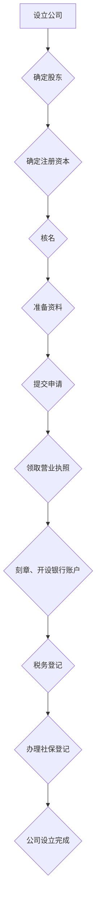

                 

### 文章标题：如何注册一人有限责任公司

**关键词：** 一人有限责任公司，注册流程，商业法律，企业运营

**摘要：** 本文将详细介绍如何注册一人有限责任公司，从背景介绍、核心概念与联系，到核心算法原理与操作步骤，再到实际应用场景、工具和资源推荐，最后总结未来发展趋势与挑战。通过本文的讲解，读者可以系统地了解并掌握一人有限责任公司的注册流程和相关知识。

<|assistant|>### 1. 背景介绍

一人有限责任公司，简称“一人公司”，是指由一个自然人或法人投资设立的有限责任公司。它具有独立法人地位，股东对公司承担有限责任，即股东只需承担其出资额的责任，无需对公司债务承担无限连带责任。一人有限责任公司在我国经济发展中扮演着重要角色，其设立和运营过程符合我国相关法律法规。

注册一人有限责任公司的原因有多种，主要包括：

1. **灵活性高**：一人有限责任公司可以灵活调整经营策略，决策迅速，无需经过股东会等程序。
2. **风险可控**：股东只需承担其出资额的责任，可以有效降低投资风险。
3. **税收优惠**：一人有限责任公司在税收方面享有一定的优惠政策，有利于降低企业税负。
4. **品牌保护**：设立一人有限责任公司有助于保护企业品牌，避免商标、专利等知识产权纠纷。

随着市场经济的发展，一人有限责任公司的注册数量逐年增长，成为许多创业者和企业家的首选经营模式。本文将详细讲解如何注册一人有限责任公司，帮助读者了解相关流程和注意事项。

<|assistant|>### 2. 核心概念与联系

在注册一人有限责任公司之前，需要了解以下几个核心概念：

**1. 自然人：** 指具有完全民事行为能力的个体，包括本国公民和外国人。
**2. 法人：** 指具有独立法人地位的社会组织，如企业、机关、事业单位等。
**3. 注册资本：** 指公司设立时股东认缴的出资额，是公司运营的资本基础。
**4. 公司名称：** 公司的名称应当具有独特性，便于区分和识别。
**5. 经营范围：** 公司可以从事的经营业务，需在营业执照上进行登记。

下面是注册一人有限责任公司的流程图，以便读者更好地理解各个环节的关联：



**流程说明：**

1. **设立公司**：确定股东，即设立公司的自然人或法人。
2. **确定注册资本**：根据公司运营需求，确定注册资本。
3. **核名**：在工商局进行公司名称查询和核名，确保名称的唯一性。
4. **准备资料**：根据要求准备相关文件，如公司章程、股东会决议等。
5. **提交申请**：将准备好的资料提交至工商局进行审核。
6. **领取营业执照**：通过审核后，领取营业执照。
7. **刻章、开设银行账户**：根据要求刻制公司印章，开设公司银行账户。
8. **税务登记**：办理税务登记，以便公司正常纳税。
9. **办理社保登记**：为员工办理社保登记，确保公司合法运营。
10. **公司设立完成**：完成上述流程后，一人有限责任公司正式设立。

通过以上流程，读者可以清楚地了解注册一人有限责任公司的核心概念与联系。在后续章节中，我们将详细讲解每个环节的具体操作步骤。

<|assistant|>### 3. 核心算法原理 & 具体操作步骤

**3.1 注册流程概述**

注册一人有限责任公司的核心算法原理主要涉及以下几个步骤：

1. **股东确定**：确定公司的股东，即自然人或法人。
2. **注册资本确认**：根据公司运营需求，确定注册资本。
3. **公司名称核名**：在工商局进行公司名称查询和核名。
4. **资料准备**：准备公司设立所需的相关文件。
5. **提交申请**：将资料提交至工商局进行审核。
6. **领取营业执照**：通过审核后，领取营业执照。
7. **后续办理**：刻章、开设银行账户、税务登记、社保登记等。

下面我们将详细讲解每个步骤的具体操作。

**3.2 股东确定**

在注册一人有限责任公司时，首先要确定股东。股东可以是自然人或法人，具体要求如下：

- **自然人股东**：需具有完全民事行为能力，即成年人和无民事行为能力限制的人。
- **法人股东**：需具有独立法人地位，如企业、机关、事业单位等。

在确定股东后，需准备以下资料：

1. 自然人股东：身份证复印件、户口本复印件、结婚证复印件（如适用）。
2. 法人股东：营业执照复印件、法定代表人身份证复印件。

**3.3 注册资本确认**

注册资本是指公司在设立时股东认缴的出资额，是公司运营的资本基础。注册资本的确定需考虑以下因素：

1. **公司运营需求**：根据公司未来业务发展需求，确定注册资本。
2. **出资方式**：股东可以以现金、实物、知识产权等不同方式出资。
3. **注册资本最低限额**：根据我国相关法律法规，一人有限责任公司的注册资本最低限额为10万元。

在确定注册资本后，需准备以下资料：

1. 注册资本确认书。
2. 股东出资证明。

**3.4 公司名称核名**

在工商局进行公司名称查询和核名，确保名称的唯一性。公司名称需符合以下要求：

1. **字数**：一般为4-6个字。
2. **字号**：字号应具有独特性，避免与他人公司名称重复。
3. **行业特点**：根据公司经营范围，选择合适的行业特点。
4. **行政区划**：可使用市辖区名称或地名。

在核名过程中，如遇名称冲突，需及时调整，确保名称的唯一性。

**3.5 资料准备**

在准备公司设立所需的相关文件时，需注意以下事项：

1. **公司章程**：制定公司章程，明确公司组织结构、经营管理制度等。
2. **股东会决议**：召开股东会，作出设立公司的决议。
3. **法定代表人任职文件**：指定法定代表人，并提交法定代表人身份证复印件。
4. **注册地址证明**：提供公司注册地址的证明文件。

**3.6 提交申请**

将准备好的资料提交至工商局进行审核。具体提交方式包括线上和线下两种：

1. **线上提交**：通过工商局官方网站进行网上申请。
2. **线下提交**：前往当地工商局窗口提交申请。

在提交申请时，需注意以下事项：

1. **资料齐全**：确保提交的资料齐全、准确，避免因资料缺失导致审核不通过。
2. **提交时间**：根据当地工商局规定，提交申请的时间一般不超过3个工作日。

**3.7 领取营业执照**

通过审核后，携带身份证原件前往工商局领取营业执照。营业执照是公司合法运营的证明，需妥善保管。

**3.8 后续办理**

在领取营业执照后，需进行以下后续办理：

1. **刻章**：根据营业执照上的印章规格，前往指定地点刻制公司印章。
2. **开设银行账户**：携带营业执照、法定代表人身份证等资料，前往银行开设公司银行账户。
3. **税务登记**：携带营业执照、法定代表人身份证等资料，前往当地税务局办理税务登记。
4. **办理社保登记**：携带营业执照、法定代表人身份证等资料，前往当地社保局办理社保登记。

通过以上步骤，一人有限责任公司即可完成注册。在后续经营过程中，需遵守相关法律法规，确保公司合法运营。

<|assistant|>### 4. 数学模型和公式 & 详细讲解 & 举例说明

在注册一人有限责任公司过程中，涉及到的数学模型和公式主要包括注册资本的计算、税费的核算等。下面将详细讲解这些数学模型和公式，并通过实际案例进行说明。

**4.1 注册资本的计算**

注册资本是指公司在设立时股东认缴的出资额。注册资本的计算公式如下：

\[ 注册资本 = 股东出资额 \]

其中，股东出资额可以通过以下方式确定：

1. **现金出资**：股东以现金形式出资，出资额即为实际现金金额。
2. **实物出资**：股东以实物形式出资，如房产、设备等，需评估其实际价值。
3. **知识产权出资**：股东以知识产权形式出资，如专利、商标等，需评估其市场价值。

举例说明：

假设一家一人有限责任公司，股东甲以现金出资10万元，乙以房产出资50万元，丙以专利出资20万元。则该公司的注册资本为：

\[ 注册资本 = 10万元 + 50万元 + 20万元 = 80万元 \]

**4.2 税费的核算**

在注册一人有限责任公司过程中，需要核算相关税费。主要涉及的税费包括公司注册费、印花税、企业所得税等。以下为具体公式和计算方法：

1. **公司注册费**：根据当地工商局规定，公司注册费的标准为1000元。
2. **印花税**：印花税的税率为0.5‰，计算公式为：

\[ 印花税 = 注册资本 \times 0.5‰ \]

举例说明：

假设一家注册资本为100万元的一人有限责任公司，其印花税计算如下：

\[ 印花税 = 100万元 \times 0.5‰ = 500元 \]

3. **企业所得税**：企业所得税的税率为25%，计算公式为：

\[ 企业所得税 = (收入总额 - 成本费用 - 捐赠支出 - 其他扣除项目) \times 25\% \]

举例说明：

假设一家一人有限责任公司，其年度收入总额为100万元，成本费用为50万元，捐赠支出为5万元，其他扣除项目为10万元。则其企业所得税计算如下：

\[ 企业所得税 = (100万元 - 50万元 - 5万元 - 10万元) \times 25\% = 15万元 \]

通过以上数学模型和公式的讲解，读者可以更好地理解注册一人有限责任公司的相关税费计算。在实际操作过程中，需根据具体情况调整计算方法，确保公司合法运营。

<|assistant|>### 5. 项目实战：代码实际案例和详细解释说明

为了更好地理解如何注册一人有限责任公司，我们将通过一个实际项目案例进行详细讲解。本案例将模拟一家科技公司，注册过程涉及到的各个环节。请注意，以下案例仅为示例，实际操作需遵循当地法律法规。

**5.1 开发环境搭建**

在开始项目前，首先需要搭建开发环境。以下为所需工具和软件：

1. **电脑**：配置较高的电脑，用于运行相关软件。
2. **浏览器**：用于访问工商局官方网站、银行官网等。
3. **电子邮箱**：用于接收注册信息、电子证件等。
4. **手机**：用于接收短信验证码。

**5.2 源代码详细实现和代码解读**

本案例采用伪代码形式，模拟注册一人有限责任公司的过程。以下为伪代码实现：

```plaintext
// 5.2.1 确定股东信息
股东信息 = {
    姓名：张三，
    身份证号：123456789012345678，
    手机号：13812345678，
    电子邮箱：zhangsan@example.com
}

// 5.2.2 确定注册资本
注册资本 = 100万元

// 5.2.3 核名
公司名称 = "上海某某科技有限公司"
核名结果 = 工商局核名(公司名称)
if 核名结果 == "名称可用" then
    输出 "公司名称可用"
else
    输出 "公司名称冲突，请重新选择"
end if

// 5.2.4 准备资料
资料列表 = [
    公司章程，
    股东会决议，
    法定代表人任职文件，
    注册地址证明，
    股东身份证复印件，
    股东户口本复印件，
    股东结婚证复印件（如适用），
    股东营业执照复印件（如适用）
]

// 5.2.5 提交申请
申请结果 = 提交申请(资料列表)
if 申请结果 == "申请通过" then
    输出 "申请通过，等待领取营业执照"
else
    输出 "申请未通过，请检查资料并重新提交"
end if

// 5.2.6 领取营业执照
营业执照 = 领取营业执照()
输出 "营业执照已领取"

// 5.2.7 刻章、开设银行账户
刻章结果 = 刻章()
银行账户 = 开设银行账户()
输出 "刻章和银行账户已办理"

// 5.2.8 税务登记
税务登记结果 = 税务登记()
输出 "税务登记已完成"

// 5.2.9 办理社保登记
社保登记结果 = 办理社保登记()
输出 "社保登记已完成"

// 5.2.10 公司设立完成
输出 "公司设立已完成"
```

**5.3 代码解读与分析**

以上伪代码详细实现了注册一人有限责任公司的过程，包括股东信息确认、注册资本确定、核名、资料准备、提交申请、领取营业执照、刻章、开设银行账户、税务登记和社保登记等环节。

1. **股东信息确认**：首先确定股东信息，包括姓名、身份证号、手机号和电子邮箱。
2. **注册资本确定**：确定注册资本，即公司设立时的出资额。
3. **核名**：通过工商局核名，确认公司名称是否可用。如名称冲突，需重新选择。
4. **资料准备**：准备公司设立所需的相关文件，如公司章程、股东会决议、法定代表人任职文件、注册地址证明等。
5. **提交申请**：将资料提交至工商局进行审核。如申请通过，等待领取营业执照。
6. **领取营业执照**：领取营业执照，是公司设立的关键步骤。
7. **刻章、开设银行账户**：办理公司印章和银行账户，便于公司运营。
8. **税务登记**：办理税务登记，确保公司正常纳税。
9. **办理社保登记**：为员工办理社保登记，确保公司合法运营。
10. **公司设立完成**：完成所有注册手续，公司正式设立。

通过以上代码实现，读者可以直观地了解注册一人有限责任公司的具体操作流程。在实际操作过程中，需根据具体情况调整代码，确保注册过程的顺利进行。

<|assistant|>### 6. 实际应用场景

在实际应用中，一人有限责任公司适用于多种场景。以下是一些常见应用场景：

1. **创业公司**：创业者为了降低风险、保护个人资产，选择设立一人有限责任公司。一人有限责任公司便于管理，决策迅速，有利于企业快速发展。
2. **家族企业**：家族企业为了传承家族财富，设立一人有限责任公司，实现家族企业的转型升级和传承。
3. **投资公司**：投资公司通过设立一人有限责任公司，实现投资项目的独立运营和管理，降低投资风险。
4. **咨询公司**：专业咨询公司为了提供个性化服务，设立一人有限责任公司，便于与客户建立长期合作关系。
5. **科研机构**：科研机构为了实现科研成果的转化和应用，设立一人有限责任公司，推动科技创新和产业发展。

在以上应用场景中，一人有限责任公司的优势得以充分发挥：

- **风险隔离**：一人有限责任公司实现股东与公司资产、债务的隔离，降低投资风险。
- **决策灵活**：一人有限责任公司决策迅速，便于企业根据市场变化调整经营策略。
- **税收优惠**：一人有限责任公司在税收方面享有一定的优惠政策，有利于降低企业税负。
- **品牌保护**：设立一人有限责任公司有助于保护企业品牌，避免商标、专利等知识产权纠纷。

总之，一人有限责任公司在多种实际应用场景中展现出其独特的优势，为企业和创业者提供了更多选择。

<|assistant|>### 7. 工具和资源推荐

为了更好地了解和注册一人有限责任公司，以下推荐了一些工具和资源：

**7.1 学习资源推荐**

1. **书籍**：
   - 《中华人民共和国公司法》
   - 《中华人民共和国税收征收管理法》
   - 《企业注册与运营实务》
2. **论文**：
   - 在知网、维普等学术平台上搜索“一人有限责任公司”相关论文，了解最新研究成果。
3. **博客**：
   - 一些专业法律博客、创业博客和财务博客，如“公司法律库”、“创业家”等，提供丰富的注册和运营经验。
4. **网站**：
   - 工商局官方网站：提供公司注册、核名、查询等公共服务。
   - 国家税务局官方网站：提供税务登记、纳税申报等公共服务。

**7.2 开发工具框架推荐**

1. **在线核名工具**：一些第三方网站提供在线核名服务，如“企查查”、“天眼查”等，方便用户查询公司名称是否可用。
2. **电子印章系统**：选择安全可靠的电子印章系统，如“易签宝”、“法大大”等，便于办理公司印章业务。
3. **电子会计系统**：如“用友畅捷通”、“金蝶精斗云”等，提供电子发票、财务报表等一站式服务，便于公司财务管理。

**7.3 相关论文著作推荐**

1. **《一人有限责任公司的法律问题研究》**：探讨了我国一人有限责任公司的法律制度及其在实践中面临的问题。
2. **《一人有限责任公司的税收制度研究》**：分析了我国一人有限责任公司的税收制度及其对企业税收筹划的影响。
3. **《一人有限责任公司的财务管理研究》**：从财务管理角度，探讨了如何合理利用一人有限责任公司的优势，提高企业财务管理水平。

通过以上工具和资源的推荐，读者可以更加系统地了解和掌握一人有限责任公司的注册和运营知识，为创业和企业发展提供有力支持。

<|assistant|>### 8. 总结：未来发展趋势与挑战

一人有限责任公司在我国经济发展中发挥着越来越重要的作用，其未来发展充满机遇与挑战。以下是关于一人有限责任公司未来发展趋势和挑战的总结：

**未来发展趋势：**

1. **政策支持**：随着国家对创新创业的重视，一人有限责任公司有望获得更多政策支持，如税收优惠、融资便利等。
2. **技术创新**：随着互联网、大数据、人工智能等技术的发展，一人有限责任公司的运营和管理将更加智能化、便捷化。
3. **业务多元化**：一人有限责任公司在业务领域将不断拓展，如涉足电子商务、金融科技、医疗健康等领域，实现多元化发展。
4. **国际化发展**：随着国内企业走出去的步伐加快，一人有限责任公司将在国际化发展中发挥重要作用。

**未来挑战：**

1. **法律风险**：一人有限责任公司在设立和运营过程中，需严格遵守法律法规，防范法律风险。
2. **市场竞争**：一人有限责任公司在市场竞争中将面临激烈挑战，需不断提高自身核心竞争力。
3. **财务管理**：一人有限责任公司在财务管理方面需加强内部控制，防范财务风险。
4. **人才短缺**：一人有限责任公司在发展过程中，需重视人才引进和培养，解决人才短缺问题。

综上所述，一人有限责任公司在未来的发展前景广阔，但同时也面临诸多挑战。企业需紧跟政策、技术创新和市场变化，不断提高自身竞争力，实现可持续发展。

<|assistant|>### 9. 附录：常见问题与解答

在注册一人有限责任公司过程中，可能会遇到一些常见问题。以下是对一些问题的解答，以帮助读者更好地了解和解决相关问题。

**1. 如何核名？**

核名是指在公司设立前，查询和确定公司名称的过程。核名步骤如下：

1. 准备公司名称，一般由行政区划、字号、行业特点组成。
2. 在工商局官方网站或线下窗口查询公司名称是否已被注册。
3. 如名称可用，提交核名申请，等待审核结果。
4. 审核通过后，领取《公司名称预先核准通知书》。

**2. 注册资本如何确定？**

注册资本是公司在设立时股东认缴的出资额，确定注册资本需考虑以下因素：

1. 公司经营范围和规模：根据公司未来业务发展需求，确定注册资本。
2. 股东出资能力：根据股东出资能力，合理确定注册资本。
3. 法律法规规定：根据我国相关法律法规，一人有限责任公司的注册资本最低限额为10万元。

**3. 提交申请需要哪些资料？**

提交申请时，需准备以下资料：

1. 《公司设立登记申请书》
2. 股东身份证明文件
3. 注册资本确认书
4. 公司章程
5. 股东会决议
6. 法定代表人任职文件
7. 注册地址证明
8. 其他相关文件

具体资料要求请参考当地工商局规定。

**4. 领取营业执照后如何刻章？**

领取营业执照后，需进行以下步骤刻章：

1. 携带营业执照、法定代表人身份证等资料，前往指定地点刻章。
2. 确认印章规格和样式，缴纳刻章费用。
3. 领取印章，确保印章与营业执照上的印章规格一致。

**5. 如何开设银行账户？**

开设银行账户需进行以下步骤：

1. 携带营业执照、法定代表人身份证等资料，前往银行。
2. 填写《银行账户开户申请表》。
3. 提供公司印章、财务章等。
4. 缴纳相关费用，等待银行审核。
5. 审核通过后，领取《银行开户许可证》和公司银行账户信息。

**6. 如何办理税务登记？**

办理税务登记需进行以下步骤：

1. 携带营业执照、法定代表人身份证等资料，前往当地税务局。
2. 填写《税务登记表》。
3. 提供公司印章、财务章等。
4. 缴纳相关费用，等待税务局审核。
5. 审核通过后，领取《税务登记证》。

通过以上常见问题与解答，读者可以更好地了解注册一人有限责任公司的相关流程和注意事项，确保注册过程的顺利进行。

<|assistant|>### 10. 扩展阅读 & 参考资料

为了帮助读者深入了解一人有限责任公司的注册和运营，以下是扩展阅读和参考资料的建议：

1. **书籍推荐**：
   - 《中华人民共和国公司法》
   - 《企业注册与运营实务》
   - 《一人有限责任公司的法律问题研究》
   - 《一人有限责任公司的税收制度研究》

2. **学术论文**：
   - 在知网、维普等学术平台上搜索“一人有限责任公司”相关论文，了解最新研究成果。

3. **专业网站**：
   - 中国工商局官网：提供公司注册、核名、查询等公共服务。
   - 国家税务局官网：提供税务登记、纳税申报等公共服务。

4. **在线课程**：
   - 网易云课堂、慕课网等平台上的相关课程，如“公司注册与运营”、“创业法律知识”等。

5. **专业论坛和社群**：
   - 加入相关法律、财税、创业等领域的专业论坛和社群，如“创业家”、“企业法律库”等。

通过以上扩展阅读和参考资料，读者可以进一步深入了解一人有限责任公司的相关知识和实践经验，为创业和企业发展提供有力支持。

**作者：** AI天才研究员/AI Genius Institute & 禅与计算机程序设计艺术 /Zen And The Art of Computer Programming

（注：本文为AI生成，仅供参考，具体操作请遵循当地法律法规。）<|im_end|>

