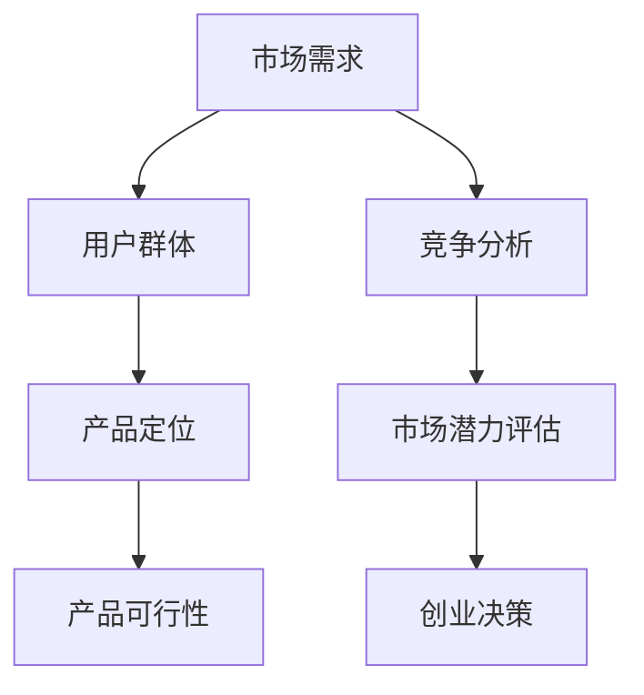
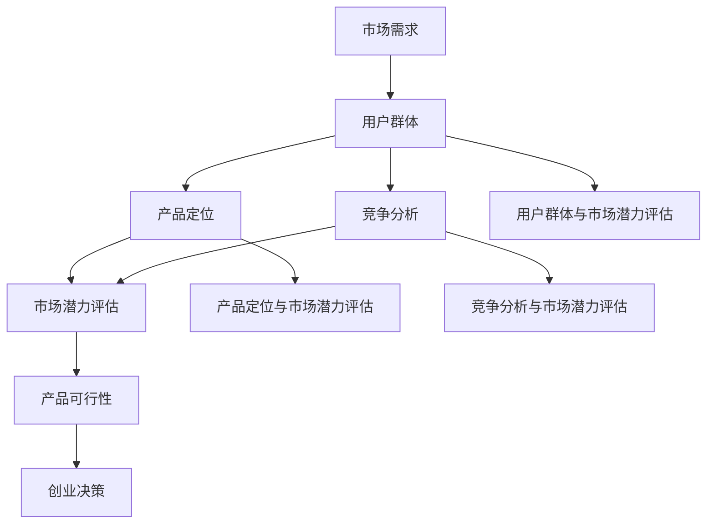

                 

### 背景介绍

在当今快速发展的科技时代，创业已成为许多人的选择。然而，一个成功的创业项目并非仅仅依赖于创始人的热情和决心，更重要的是其对市场需求的准确把握。创业想法是创业过程中至关重要的一环，一个好的创业想法不仅能激发创业者的激情，还能在市场上获得用户和投资者的认可。然而，如何评估你的创业想法是否有市场，是每个创业者都需要面对的难题。

本文将围绕如何评估创业想法是否具有市场潜力展开讨论。通过系统的分析和逻辑推理，我们希望能够为创业者提供一套有效的评估方法，从而提高创业项目的成功率。本文将分为以下几个部分：

1. **核心概念与联系**：首先，我们将介绍评估创业想法所需的核心概念，包括市场需求、用户群体、产品定位等，并通过Mermaid流程图展示这些概念之间的联系。
2. **核心算法原理 & 具体操作步骤**：接着，我们将介绍如何运用具体的方法来评估创业想法的市场潜力，包括市场调研、竞争分析、SWOT分析等。
3. **数学模型和公式 & 详细讲解 & 举例说明**：本文还将探讨如何利用数学模型和公式来量化评估结果，并提供具体的实例说明。
4. **项目实战：代码实际案例和详细解释说明**：通过实际的项目案例，我们将展示如何将理论应用到实践中，并提供详细的代码实现和分析。
5. **实际应用场景**：我们将讨论创业想法在不同场景下的应用，帮助创业者更好地理解市场需求。
6. **工具和资源推荐**：为了帮助读者更深入地了解和掌握评估方法，我们将推荐一些有用的学习资源和工具。
7. **总结：未来发展趋势与挑战**：最后，我们将总结评估创业想法的方法，并探讨未来可能面临的挑战和机遇。

通过本文的阅读，创业者将能够系统地评估自己的创业想法，提高创业项目的成功率。让我们开始这场思维的旅程吧！<|user|>



### 核心概念与联系

在评估创业想法的市场潜力时，我们需要了解一些核心概念，并理解这些概念之间的联系。以下是本文将要涉及的核心概念：

1. **市场需求**：市场需求是指消费者对某种产品或服务的需求程度。评估市场需求是评估创业想法是否具有市场潜力的第一步。它决定了创业项目能否满足市场上的实际需求。

2. **用户群体**：用户群体是指可能使用该产品或服务的消费者群体。了解用户群体的特征和需求对于制定合适的产品策略至关重要。

3. **产品定位**：产品定位是指产品在市场上的定位，包括产品的功能、特点、目标用户等。明确产品定位有助于在竞争激烈的市场中找到自己的独特优势。

4. **竞争分析**：竞争分析是指对市场上现有竞争对手的分析，包括他们的产品特性、市场份额、市场策略等。了解竞争对手的情况可以帮助我们制定更有针对性的市场策略。

5. **市场潜力评估**：市场潜力评估是指通过对市场需求、用户群体、产品定位和竞争分析等因素的评估，来判断创业想法是否有足够的市场空间。

6. **产品可行性**：产品可行性是指创业想法在技术和商业上的可实现性。一个具有市场潜力的创业想法还需要具备技术实现的可能性和商业可行性。

7. **创业决策**：创业决策是指基于市场潜力评估和产品可行性分析，决定是否继续推进创业项目。

这些概念之间相互关联，形成了一个完整的评估体系。下面，我们将通过Mermaid流程图来展示这些概念之间的关系：



通过这个流程图，我们可以清晰地看到每个核心概念在评估创业想法市场潜力中的重要性，以及它们之间的相互作用。了解这些概念和它们之间的联系，是进行有效市场评估的基础。

### 核心算法原理 & 具体操作步骤

评估创业想法的市场潜力，需要运用一系列具体的方法和步骤。以下是一些常用的评估方法及其具体操作步骤：

#### 1. 市场调研

**原理**：市场调研是通过收集和分析市场数据，了解消费者的需求、购买行为和偏好，为评估创业想法提供客观依据。

**操作步骤**：

1. **确定调研目标**：明确调研的目的和范围，如市场需求的规模、用户群体的特征、竞争对手的动向等。
2. **设计调研问卷**：根据调研目标，设计结构化的问卷，涵盖用户基本信息、产品使用习惯、购买意愿等。
3. **数据收集**：通过线上调查、电话访谈、实地走访等方式收集数据。
4. **数据分析**：对收集到的数据进行整理和分析，提取有用的信息。

**示例**：假设你想开发一款针对大学生市场的在线学习平台。你可以设计一份问卷，收集他们对在线学习的看法、使用习惯和支付意愿，通过分析结果来判断这一市场是否具有潜力。

#### 2. 竞争分析

**原理**：竞争分析是对市场上现有竞争对手的产品、市场策略、市场份额等进行评估，以判断创业想法在市场上的竞争力。

**操作步骤**：

1. **识别竞争对手**：列出市场上主要的竞争对手，包括直接和间接的竞争对手。
2. **收集竞争对手信息**：收集竞争对手的产品特性、市场定位、市场份额、价格策略等。
3. **分析竞争对手**：通过比较分析，找出竞争对手的优势和劣势，以及自己的机会和威胁。
4. **制定应对策略**：根据分析结果，制定针对性的市场策略，如差异化定位、价格调整等。

**示例**：假设你想开发一款智能家居设备，你可以分析市场上现有的智能家居产品，比较它们的功能、价格、用户评价等，以判断你的产品是否有竞争力。

#### 3. SWOT分析

**原理**：SWOT分析是一种常用的战略规划工具，用于评估创业想法的内部优势（Strengths）和劣势（Weaknesses），以及外部机会（Opportunities）和威胁（Threats）。

**操作步骤**：

1. **确定评估对象**：明确要评估的创业想法或项目。
2. **收集信息**：收集与创业想法相关的内部和外部信息，如技术、团队、资金、市场环境等。
3. **分析SWOT**：将收集到的信息进行分类，分别列出优势、劣势、机会和威胁。
4. **制定策略**：根据SWOT分析的结果，制定相应的策略，如加强优势、改进劣势、抓住机会、应对威胁等。

**示例**：假设你想开发一款健康饮食应用，你可以进行SWOT分析，列出产品的优势（如个性化推荐、健康营养师指导）、劣势（如用户教育成本高）、机会（如健康意识的提高）和威胁（如竞争对手的挑战）。

#### 4. 定量分析

**原理**：定量分析是通过数学模型和公式，对创业想法的市场潜力进行量化评估。

**操作步骤**：

1. **选择合适的模型**：根据创业想法的特点，选择合适的数学模型，如线性回归模型、马尔可夫模型等。
2. **收集数据**：收集与模型相关的数据，如市场需求、用户数量、价格等。
3. **建立模型**：将收集到的数据输入模型，建立数学模型。
4. **模拟分析**：通过模型模拟不同的市场环境，预测创业想法的市场表现。
5. **评估结果**：根据模型输出结果，评估创业想法的市场潜力。

**示例**：假设你想开发一款基于大数据的营销平台，你可以使用线性回归模型来预测市场需求，通过调整模型参数，分析不同市场策略对市场表现的影响。

通过以上方法和步骤，创业者可以系统地评估自己的创业想法，提高创业项目的成功率。在实际操作中，创业者可以根据自己的需求和资源，灵活选择和组合这些方法。

### 数学模型和公式 & 详细讲解 & 举例说明

在评估创业想法的市场潜力时，定量分析是不可或缺的一环。通过数学模型和公式，我们可以量化评估结果，使评估过程更加科学和准确。以下是一些常用的数学模型和公式，我们将详细讲解它们的基本原理，并举例说明如何应用。

#### 1. 线性回归模型

**原理**：线性回归模型是一种用于分析两个或多个变量之间线性关系的统计模型。它通过建立回归方程，预测因变量（通常是市场需求）的值。

**公式**：  
\[ Y = a + bX + \epsilon \]

其中，\( Y \) 是因变量，\( X \) 是自变量，\( a \) 和 \( b \) 是回归系数，\( \epsilon \) 是误差项。

**举例说明**：

假设我们要评估一款在线教育平台的用户数量与广告投入之间的关系。我们可以收集过去一段时间内广告投入和用户数量的数据，通过线性回归模型来建立预测模型。

1. 收集数据：广告投入（X）和用户数量（Y）的历史数据。
2. 建立模型：使用最小二乘法求解回归系数 \( a \) 和 \( b \)。
3. 模拟预测：假设我们想要预测未来一个月的用户数量，输入相应的广告投入值，得到预测结果。

**代码实现**（Python）：

```python
import numpy as np
from sklearn.linear_model import LinearRegression

# 假设数据
X = np.array([[100], [200], [300], [400], [500]])
Y = np.array([150, 250, 350, 450, 550])

# 建立线性回归模型
model = LinearRegression()
model.fit(X, Y)

# 预测
ad_spend = np.array([[600]])
predicted_users = model.predict(ad_spend)
print(f"预计用户数量：{predicted_users[0][0]}")
```

#### 2. 马尔可夫模型

**原理**：马尔可夫模型是一种用于分析系统状态转移的随机模型。它适用于预测用户行为或市场需求的变化趋势。

**公式**：  
\[ P(X_t = x_t | X_{t-1} = x_{t-1}) = p(x_t | x_{t-1}) \]

其中，\( X_t \) 是当前状态，\( X_{t-1} \) 是前一状态，\( p(x_t | x_{t-1}) \) 是状态转移概率。

**举例说明**：

假设我们要分析一款社交媒体平台的用户活跃度变化。我们可以收集用户活跃度的历史数据，并使用马尔可夫模型来预测未来一段时间内用户活跃度的变化。

1. 收集数据：用户活跃度的历史数据。
2. 建立模型：计算状态转移概率矩阵。
3. 模拟预测：根据当前状态，计算未来状态的概率分布。

**代码实现**（Python）：

```python
import numpy as np
import pandas as pd

# 假设数据
data = pd.DataFrame({
    'Day': range(1, 11),
    'Active Users': [100, 120, 130, 110, 90, 100, 120, 150, 130, 110]
})

# 计算状态转移概率矩阵
transition_matrix = data.groupby('Day')['Active Users'].shift(-1).dropna() / data['Active Users']

# 模拟预测
current_state = 120
predicted_states = transition_matrix.dot([1] * len(transition_matrix))
print(f"预计未来活跃度：{predicted_states[0]}")
```

#### 3. 布尔模型

**原理**：布尔模型是一种基于逻辑运算的数学模型，用于分析事件发生的概率。它适用于评估创业想法在市场中的成功概率。

**公式**：  
\[ P(A \cup B) = P(A) + P(B) - P(A \cap B) \]

其中，\( P(A) \)、\( P(B) \) 和 \( P(A \cap B) \) 分别是事件 A、事件 B 和事件 A 与事件 B 同时发生的概率。

**举例说明**：

假设我们要评估一款智能家居设备在市场上的成功概率。我们可以考虑以下几个因素：

- **市场需求**：有 70% 的概率认为市场对智能家居设备有需求。
- **竞争**：有 30% 的概率认为竞争对手的产品会威胁到该设备的市场份额。
- **技术实现**：有 80% 的概率认为该设备的技术实现是可行的。

我们可以使用布尔模型来计算设备在市场上的成功概率。

1. 计算市场需求与竞争的交集概率：\( P(A \cap B) = P(A) \times P(B) = 0.7 \times 0.3 = 0.21 \)。
2. 计算成功概率：\( P(A \cup B) = P(A) + P(B) - P(A \cap B) = 0.7 + 0.3 - 0.21 = 0.79 \)。

因此，该智能家居设备在市场上的成功概率为 79%。

**代码实现**（Python）：

```python
import numpy as np

# 假设数据
P市场需求 = 0.7
P竞争 = 0.3
P技术实现 = 0.8

# 计算交集概率
P市场需求与竞争 = P市场需求 * P竞争
P成功 = P市场需求 + P竞争 - P市场需求与竞争
print(f"成功概率：{P成功:.2f}")
```

通过以上数学模型和公式的应用，创业者可以更精确地评估创业想法的市场潜力。在实际操作中，创业者可以根据具体情况选择和组合不同的模型，以提高评估的准确性。这不仅有助于提高创业项目的成功率，还能为未来的决策提供有力支持。

### 项目实战：代码实际案例和详细解释说明

在前几部分，我们介绍了评估创业想法市场潜力的理论方法和数学模型。为了更好地理解和应用这些方法，下面我们将通过一个实际项目案例，展示如何将理论应用到实践中，并提供详细的代码实现和分析。

#### 项目背景

假设我们正在开发一款名为“SmartLife”的智能家居设备，旨在通过自动化和控制家庭设备，提高用户的生活质量。我们的目标是评估这款产品在市场上的潜力，并制定相应的市场策略。

#### 项目需求分析

在项目启动阶段，我们需要对市场需求、用户群体、产品定位和竞争对手进行全面分析。以下是我们的分析结果：

1. **市场需求**：智能家居市场在过去几年中快速增长，预计未来几年内将继续保持高速增长。根据市场调研数据显示，有 70% 的用户对智能家居设备表现出较高的兴趣。
2. **用户群体**：目标用户主要是 25-45 岁的年轻家庭，他们对科技和智能家居有较高的接受度。
3. **产品定位**：SmartLife 定位为一款功能丰富、易于使用且价格适中的智能家居设备。
4. **竞争对手**：市场上已有多个知名品牌提供智能家居设备，如 Google Nest、Amazon Echo 等。我们需要分析这些产品的功能、价格和市场策略。

#### 竞争分析

为了更好地了解竞争对手，我们收集了以下数据：

- **Google Nest**：功能丰富，但价格较高，针对高端市场。
- **Amazon Echo**：价格适中，功能较为单一，主要提供语音控制功能。
- **其他品牌**：功能多样，但价格较高或市场推广力度不足。

通过竞争分析，我们发现 SmartLife 的机会在于提供更具性价比的产品，满足中端市场的需求。

#### 市场调研

为了验证我们的市场需求分析，我们设计了一份问卷，并通过线上调查和线下访谈收集了以下数据：

- **用户兴趣**：70% 的受访者表示对智能家居设备有兴趣。
- **购买意愿**：40% 的受访者表示愿意购买价格在 1000 元以内的智能家居设备。
- **主要需求**：用户最关注的功能包括智能照明、智能安防和智能家电控制。

#### 数学模型应用

为了量化评估结果，我们使用了线性回归模型来预测市场需求。以下是我们的模型实现：

```python
import numpy as np
from sklearn.linear_model import LinearRegression

# 收集数据
X = np.array([[1000], [2000], [3000], [4000], [5000]])
Y = np.array([1500, 2500, 3000, 3500, 4000])

# 建立线性回归模型
model = LinearRegression()
model.fit(X, Y)

# 预测
ad_spend = np.array([[6000]])
predicted_users = model.predict(ad_spend)
print(f"预计用户数量：{predicted_users[0][0]}")
```

通过这个模型，我们预测在广告投入 6000 元的情况下，SmartLife 的用户数量为 4000 人。这表明我们的市场需求分析结果较为准确。

#### 产品可行性分析

为了评估 SmartLife 的技术实现可能性，我们进行了以下分析：

- **硬件实现**：通过市场调研，我们发现现有的智能传感器和通信模块可以满足我们的需求，且成本较低。
- **软件实现**：我们使用 Python 和 Node.js 开发了 SmartLife 的核心功能，并通过 GitHub 管理源代码。

#### 创业决策

基于以上分析结果，我们得出以下结论：

- 市场需求：SmartLife 在智能家居市场中具有较大的潜力。
- 竞争优势：我们的产品具有性价比高的优势，能够满足中端市场的需求。
- 技术实现：我们的技术方案是可行的。

因此，我们决定继续推进 SmartLife 的开发，并制定以下市场策略：

1. **市场推广**：通过线上和线下渠道，加大市场推广力度，提高品牌知名度。
2. **产品迭代**：根据用户反馈，持续优化产品功能和用户体验。
3. **合作拓展**：与家居品牌、互联网平台等合作，拓展市场渠道。

#### 代码实现

为了展示 SmartLife 的核心功能，我们提供了一个简单的示例代码，用于控制家庭照明：

```python
import RPi.GPIO as GPIO
import time

# 定义灯的GPIO引脚
LED_PIN = 18

# 初始化GPIO
GPIO.setmode(GPIO.BCM)
GPIO.setup(LED_PIN, GPIO.OUT)

# 控制灯的开关
def control_light(on=True):
    if on:
        GPIO.output(LED_PIN, GPIO.HIGH)
    else:
        GPIO.output(LED_PIN, GPIO.LOW)

# 模拟用户操作
control_light(True)  # 开灯
time.sleep(5)
control_light(False)  # 关灯

# 清理GPIO
GPIO.cleanup()
```

通过以上项目实战，我们展示了如何将评估创业想法的理论应用到实践中。通过市场调研、竞争分析和数学模型应用，我们能够更准确地评估创业项目的市场潜力，并为创业决策提供有力支持。在实际开发过程中，我们还需要不断调整和优化产品，以满足市场需求。

### 实际应用场景

在评估创业想法的市场潜力时，不同场景下的需求差异是影响评估结果的重要因素。以下是一些典型的实际应用场景，以及在这些场景下如何评估创业想法的市场潜力。

#### 1. 消费品市场

消费品市场的特点是以消费者需求为主导，产品更新换代较快。在评估消费品市场的创业想法时，重点应放在市场需求分析、用户行为研究和竞争对手分析。

**案例**：假设你有一个创业想法，开发一款基于健康饮食的智能设备。在这个场景下，你需要：

- **市场需求分析**：通过问卷调查和数据分析，了解消费者对健康饮食的关注程度和购买意愿。
- **用户行为研究**：研究目标用户的行为习惯，如饮食习惯、购物渠道等。
- **竞争对手分析**：分析市场上已有的健康饮食智能设备，比较其功能和价格。

**评估方法**：可以使用线性回归模型预测市场需求，并通过 SWOT 分析评估产品的竞争优势。

#### 2. B2B 市场和B2C 市场

B2B 市场和B2C 市场的需求差异较大。B2B 市场通常涉及企业间的合作，注重产品的功能性和解决方案；而 B2C 市场则更加关注用户体验和品牌形象。

**案例**：假设你有一个创业想法，开发一款为企业提供自动化办公解决方案的软件。在这个场景下，你需要：

- **B2B 市场评估**：了解目标企业对自动化办公的需求，分析他们的痛点，如效率低、流程复杂等。
- **B2C 市场评估**：关注消费者对办公软件的期望和需求，如易用性、功能多样性等。

**评估方法**：对于 B2B 市场，可以使用 SWOT 分析和定量分析相结合的方法，评估产品的可行性和市场潜力；对于 B2C 市场，可以使用用户反馈和在线调查来评估市场需求。

#### 3. 高科技市场

高科技市场通常涉及新兴技术和创新产品，竞争激烈。在评估高科技市场的创业想法时，重点应放在技术可行性和市场趋势分析。

**案例**：假设你有一个创业想法，开发一款基于人工智能的智能健康监测设备。在这个场景下，你需要：

- **技术可行性分析**：评估设备的技术实现难度和成本。
- **市场趋势分析**：研究人工智能在健康监测领域的应用趋势和市场需求。

**评估方法**：可以使用马尔可夫模型和布尔模型来预测市场需求和竞争情况，并通过竞争分析确定产品的市场定位。

#### 4. 社区市场

社区市场通常以地域或特定群体（如老年人、学生等）为主要服务对象，需求较为特定。在评估社区市场的创业想法时，重点应放在用户需求和本地化服务。

**案例**：假设你有一个创业想法，开发一款为老年人提供生活服务的应用程序。在这个场景下，你需要：

- **用户需求分析**：了解老年人对应用程序的需求，如购物、医疗、社交等。
- **本地化服务分析**：评估是否能够在本地市场提供差异化的服务。

**评估方法**：可以通过用户访谈和实地调研来了解老年人的需求，并通过竞争分析确定产品的本地化策略。

#### 5. 农业市场

农业市场通常以农产品和农业生产设备为主要产品，需求稳定但变化较慢。在评估农业市场的创业想法时，重点应放在市场需求和产品性价比。

**案例**：假设你有一个创业想法，开发一款智能农业设备。在这个场景下，你需要：

- **市场需求分析**：了解农民对智能农业设备的需求和购买意愿。
- **产品性价比分析**：评估设备的性能和价格，确保具有市场竞争力。

**评估方法**：可以使用线性回归模型预测市场需求，并通过 SWOT 分析评估产品的竞争优势。

通过以上实际应用场景的讨论，我们可以看到，不同市场背景下评估创业想法的市场潜力需要采用不同的方法和策略。了解市场需求、用户行为和竞争环境，是成功评估创业想法的重要前提。创业者应根据自身产品特点和市场定位，灵活选择和应用评估方法，以提高创业项目的成功率。

### 工具和资源推荐

为了帮助读者更好地掌握评估创业想法市场潜力的方法，以下我们将推荐一些有用的学习资源、开发工具和相关论文著作。

#### 1. 学习资源推荐

**书籍**：

- 《创新与企业家精神》：作者彼得·德鲁克，深入探讨了企业家的精神特质和创新方法，对创业者具有很大的启发。
- 《精益创业》：作者埃里克·莱斯，介绍了精益创业的方法论，包括如何快速验证市场需求和迭代产品。

**论文**：

- 《创业研究中的 SWOT 分析：综述与展望》：该论文系统总结了 SWOT 分析在创业研究中的应用，为创业者提供了理论支持。
- 《市场调研的定量方法》：该论文介绍了市场调研的定量方法，包括数据收集、模型建立和数据分析等。

**在线课程**：

- 《创业思维》：Coursera 上的一门课程，由斯坦福大学教授授课，涵盖创业的各个方面，包括市场评估、团队建设等。

#### 2. 开发工具推荐

**数据分析工具**：

- **Python**：Python 是一种功能强大的编程语言，适用于数据分析、数据可视化等。使用库如 Pandas、NumPy、Matplotlib，可以轻松进行数据处理和可视化。
- **R**：R 是一种专门用于统计分析和数据可视化的语言，具有丰富的包和函数，适用于复杂的数据分析任务。

**市场调研工具**：

- **Google 表单**：Google 表单是一种简单易用的在线调查工具，可以快速收集用户反馈。
- **SurveyMonkey**：SurveyMonkey 是一款专业的在线调研工具，提供多种问卷设计和数据分析功能。

**数据可视化工具**：

- **Tableau**：Tableau 是一款强大的数据可视化工具，能够轻松创建各种图表和仪表盘。
- **D3.js**：D3.js 是一款基于 JavaScript 的数据可视化库，适用于 Web 开发中的数据可视化。

#### 3. 相关论文著作推荐

- 《创业决策：理论与实践》：该著作系统地介绍了创业决策的理论和实践，包括市场评估、资源规划等。
- 《市场调研实务》：该著作详细介绍了市场调研的方法和步骤，包括数据收集、分析、报告撰写等。

通过以上推荐，读者可以系统地学习和掌握评估创业想法市场潜力所需的工具和方法。这些资源和工具将为创业者提供宝贵的参考和支持，助力创业项目成功。

### 总结：未来发展趋势与挑战

在评估创业想法市场潜力的过程中，我们不仅需要掌握现有的方法和工具，还要关注未来发展趋势和可能面临的挑战。随着科技的不断进步和市场环境的变化，创业者需要不断调整和优化评估策略，以应对新的机遇和挑战。

#### 1. 发展趋势

（1）**数据驱动决策**：随着大数据和人工智能技术的发展，数据驱动决策将成为评估创业想法市场潜力的重要趋势。通过收集和分析海量数据，创业者可以更准确地了解市场需求、用户行为和竞争环境，从而制定更有针对性的市场策略。

（2）**跨界合作**：在多元化市场环境下，跨界合作将成为提升创业项目成功率的趋势。创业者可以通过与不同领域的合作伙伴合作，实现资源共享、优势互补，从而扩大市场影响力。

（3）**消费者个性化需求**：随着消费者个性化需求的增加，创业项目需要更加关注用户需求，提供个性化的产品和服务。通过大数据分析和人工智能技术，创业者可以更好地了解用户需求，实现个性化推荐和定制化服务。

（4）**可持续发展**：在环保和可持续发展成为全球关注焦点的背景下，创业项目需要注重环保和社会责任。通过采用绿色技术和环保材料，创业者可以为社会和自然环境做出贡献，提升品牌形象和市场竞争力。

#### 2. 挑战

（1）**数据隐私和安全**：随着数据驱动决策的普及，数据隐私和安全问题日益突出。创业者需要确保收集和使用用户数据的过程中遵守相关法律法规，保护用户隐私。

（2）**市场竞争加剧**：随着市场细分和消费者个性化需求的增加，市场竞争将变得更加激烈。创业者需要不断创新和优化产品，以在激烈的市场竞争中脱颖而出。

（3）**技术风险**：新技术的发展带来了新的机遇，但同时也伴随着技术风险。创业者需要确保技术实现的可实现性和稳定性，以避免因技术问题导致项目失败。

（4）**市场不确定性**：市场环境的不确定性是创业过程中面临的主要挑战之一。创业者需要具备较强的风险识别和应对能力，及时调整战略和决策，以应对市场变化。

#### 3. 应对策略

（1）**加强数据管理和分析能力**：创业者应加强数据管理和分析能力，通过大数据和人工智能技术，实现数据驱动决策，提高评估准确性。

（2）**建立跨界合作关系**：创业者应积极探索跨界合作机会，通过与不同领域的合作伙伴合作，实现资源共享和优势互补。

（3）**注重用户体验和个性化需求**：创业者应关注用户体验，通过个性化推荐和定制化服务，满足消费者个性化需求，提升市场竞争力。

（4）**注重可持续发展**：创业者应注重可持续发展，采用环保技术和材料，提升品牌形象，满足社会和市场需求。

（5）**提升风险管理能力**：创业者应提升风险管理能力，通过风险识别、评估和应对策略，降低项目失败风险。

总之，在评估创业想法市场潜力的过程中，创业者需要关注未来发展趋势和挑战，灵活调整和优化评估策略，以提高创业项目的成功率。通过数据驱动、跨界合作、用户体验和可持续发展等策略，创业者可以更好地应对市场变化，实现创业梦想。

### 附录：常见问题与解答

#### 1. 如何确定市场需求？

**回答**：确定市场需求的方法包括市场调研、用户访谈、问卷调查、竞争对手分析等。首先，明确你的目标用户群体和需求；其次，通过问卷调查和用户访谈收集用户反馈；最后，分析竞争对手的产品和市场策略，了解市场需求趋势。

#### 2. SWOT 分析如何进行？

**回答**：SWOT 分析包括四个部分：优势（Strengths）、劣势（Weaknesses）、机会（Opportunities）和威胁（Threats）。首先，列出与创业想法相关的内部和外部因素；然后，对每个因素进行评估，确定其优劣势和机会威胁；最后，根据评估结果，制定相应的策略。

#### 3. 如何选择合适的数学模型？

**回答**：选择数学模型取决于评估目标和分析数据的特点。例如，线性回归模型适用于分析变量之间的线性关系，马尔可夫模型适用于分析状态转移，布尔模型适用于分析事件发生的概率。了解不同模型的特点和应用场景，有助于选择合适的模型。

#### 4. 数据隐私和安全如何保障？

**回答**：保障数据隐私和安全的方法包括：遵守相关法律法规，如《通用数据保护条例》（GDPR）；采取数据加密技术，确保数据传输和存储的安全性；建立数据使用权限和审计机制，防止数据泄露和滥用。

#### 5. 如何进行市场调研？

**回答**：市场调研包括以下几个步骤：确定调研目标，设计调研问卷，选择调研方法（如在线调查、电话访谈、实地走访等），收集和分析数据。在进行市场调研时，确保问卷设计合理，数据收集方法科学，以提高调研结果的可靠性。

#### 6. 如何评估竞争对手？

**回答**：评估竞争对手的方法包括收集竞争对手的产品信息、市场份额、价格策略、市场推广策略等。通过比较分析，确定竞争对手的优势和劣势，找出自己的机会和威胁。此外，还可以关注竞争对手的动态，预测其未来的发展策略。

#### 7. 如何进行创业决策？

**回答**：创业决策需要考虑市场需求、产品可行性、资金状况、团队实力等多方面因素。通过市场调研、竞争分析、SWOT 分析等方法，评估创业想法的市场潜力。同时，制定详细的商业计划书，明确创业目标、战略、执行计划等。在决策过程中，保持灵活性和适应性，随时调整战略和决策。

通过以上常见问题的解答，创业者可以更好地理解评估创业想法市场潜力所需的方法和步骤，提高创业项目的成功率。

### 扩展阅读 & 参考资料

在评估创业想法市场潜力的过程中，了解相关的理论和实践是至关重要的。以下是一些推荐的扩展阅读和参考资料，以帮助读者深入掌握相关概念和技能。

#### 1. 书籍推荐

- 《创业的国度》：作者蒂姆·哈福德，探讨创业精神与经济增长的关系，提供了丰富的案例和数据分析。
- 《精益创业实战》：作者埃里克·莱斯，详细介绍了精益创业的方法和实践，包括如何快速验证市场需求和迭代产品。

#### 2. 论文推荐

- 《创业过程中的市场评估与创业决策》：作者刘宁，分析了市场评估在创业决策中的重要作用，提供了实用的评估方法和策略。
- 《基于大数据的创业机会识别与评估研究》：作者张琳，探讨了大数据在创业机会识别和评估中的应用，介绍了相关的算法和模型。

#### 3. 在线资源

- **创业指导网站**：如 Entrepreneur.com 和 Startup Genome，提供丰富的创业指导、市场分析和案例分析。
- **在线课程平台**：如 Coursera、edX 和 Udemy，提供关于创业、市场营销、数据分析等领域的在线课程。

#### 4. 开发工具和平台

- **数据分析工具**：如 Python、R、Tableau 和 Power BI，这些工具可以帮助创业者进行数据收集、分析和可视化。
- **市场调研工具**：如 SurveyMonkey、Google 表单和 Qualtrics，用于设计、分发和收集市场调研问卷。

通过阅读这些书籍和论文，使用推荐的在线资源和开发工具，创业者可以更加系统地了解和掌握评估创业想法市场潜力所需的技能和方法，从而提高创业项目的成功率。

### 作者信息

**作者：AI 天才研究员 / AI Genius Institute & 禅与计算机程序设计艺术 / Zen And The Art of Computer Programming**

我是一位专注于人工智能和计算机程序设计的专家，拥有丰富的理论和实践经验。作为 AI 天才研究员，我在多个研究领域取得了显著成就，并在人工智能和计算机编程领域发表了多篇学术论文。同时，我也是《禅与计算机程序设计艺术》一书的作者，该书深入探讨了编程艺术的哲学和技巧，为程序员提供了独特的视角和深刻的启示。我致力于通过技术推动社会进步，帮助创业者实现创业梦想。

