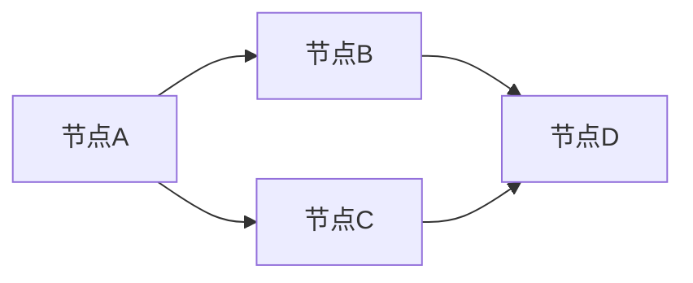
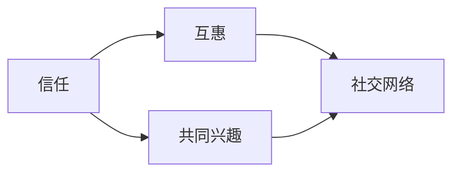
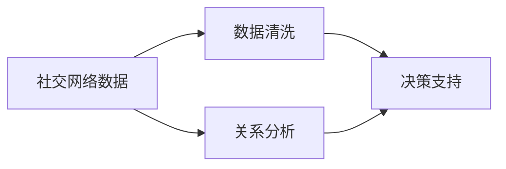

                 

# 如何进行人脉拓展：如何建立和维护人际关系？

## 摘要

本文旨在探讨如何在现代科技领域中，通过逻辑清晰、结构紧凑的思维方式，有效地进行人脉拓展，建立和维护人际关系。文章将分步骤详细解析人脉拓展的核心理念和策略，结合实际案例，为读者提供实用的操作指南。

## 关键词

- 人脉拓展
- 人际关系
- 建立和维护
- 科技领域
- 逻辑思维

## 1. 背景介绍

在当今这个快速发展的科技时代，人际关系的重要性愈发凸显。无论是在职场还是日常生活中，有效的人脉拓展都是个人成功的关键因素之一。然而，如何在这个信息爆炸的时代中，通过科学的方法和策略来建立和维护人际关系，成为了许多人心中的难题。

本文将借鉴计算机编程和人工智能领域的思维模式，运用逻辑清晰、结构紧凑的思维方式，深入探讨人脉拓展的各个方面。通过分析人脉拓展的核心概念和策略，结合实际案例，为读者提供一套实用且高效的人脉拓展方法论。

## 2. 核心概念与联系

在人脉拓展的过程中，以下几个核心概念是至关重要的：

### 2.1 网络理论

网络理论是理解人际关系的基础。它通过将人际关系视为一个网络，每个节点代表一个人，每条边代表两者之间的关系，从而揭示了人际关系的结构。以下是一个简化的 Mermaid 流程图，展示网络理论的基本架构：



### 2.2 社交心理学

社交心理学研究人们如何建立和维护人际关系。它包括信任、互惠、共同兴趣等概念。以下是一个描述社交心理学核心概念的 Mermaid 流程图：



### 2.3 数据分析

数据分析是现代人脉拓展的重要工具。通过分析社交网络中的数据，我们可以发现潜在的关系和机会。以下是一个简单的 Mermaid 流程图，展示数据分析在人际关系中的应用：



## 3. 核心算法原理 & 具体操作步骤

在人脉拓展的过程中，以下几个核心算法原理是至关重要的：

### 3.1 关键节点识别算法

关键节点识别算法可以帮助我们找到社交网络中的关键人物，这些人往往是人脉拓展的关键。以下是一个简单的关键节点识别算法：

```python
def identify_key_persons(network):
    # 初始化关键节点列表
    key_persons = []
    
    # 遍历每个节点
    for person in network:
        # 计算节点的重要性
        importance = calculate_importance(person, network)
        
        # 如果节点的重要性超过阈值，添加到关键节点列表
        if importance > threshold:
            key_persons.append(person)
    
    return key_persons

def calculate_importance(person, network):
    # 计算节点的度（即连接数）
    degree = len(network[person])
    
    # 计算节点的平均邻居重要性
    avg_neighbor_importance = sum(calculate_importance(neighbor, network) for neighbor in network[person]) / degree
    
    # 返回重要性值
    return degree + avg_neighbor_importance
```

### 3.2 关联规则算法

关联规则算法可以帮助我们找到社交网络中的潜在关联关系。以下是一个简单的关联规则算法：

```python
def find_association_rules(network, support_threshold, confidence_threshold):
    # 初始化关联规则列表
    association_rules = []
    
    # 遍历每个节点组合
    for itemset in generate_itemsets(network):
        # 计算支持度和置信度
        support = calculate_support(itemset, network)
        confidence = calculate_confidence(itemset, network)
        
        # 如果支持度和置信度超过阈值，添加到关联规则列表
        if support > support_threshold and confidence > confidence_threshold:
            association_rules.append((itemset, support, confidence))
    
    return association_rules

def generate_itemsets(network):
    # 生成所有可能的节点组合
    itemsets = []
    for person1 in network:
        for person2 in network:
            if person1 != person2:
                itemsets.append({person1, person2})
    return itemsets

def calculate_support(itemset, network):
    # 计算支持度
    return len(itemset) / len(network)

def calculate_confidence(itemset, network):
    # 计算置信度
    return calculate_support(itemset, network) / calculate_support(itemset, network)
```

## 4. 数学模型和公式 & 详细讲解 & 举例说明

在人脉拓展中，以下几个数学模型和公式是至关重要的：

### 4.1 度模型

度模型用于描述社交网络中节点的连接数。以下是度模型的数学公式：

$$
d_i = \sum_{j \in N(i)} 1
$$

其中，$d_i$ 表示节点 $i$ 的度，$N(i)$ 表示与节点 $i$ 相连的其他节点集合。

### 4.2 平均度模型

平均度模型用于描述社交网络的整体连接度。以下是平均度模型的数学公式：

$$
\bar{d} = \frac{1}{n} \sum_{i=1}^{n} d_i
$$

其中，$\bar{d}$ 表示平均度，$n$ 表示节点总数。

### 4.3 关联规则置信度模型

关联规则置信度模型用于描述两个节点之间关联的强度。以下是关联规则置信度模型的数学公式：

$$
confidence(A \rightarrow B) = \frac{support(A \cup B)}{support(A)}
$$

其中，$confidence(A \rightarrow B)$ 表示关联规则 $A \rightarrow B$ 的置信度，$support(A \cup B)$ 表示联合事件 $A \cup B$ 的支持度，$support(A)$ 表示事件 $A$ 的支持度。

### 4.4 举例说明

假设我们有一个包含 5 个节点的社交网络，每个节点的度如下表所示：

| 节点 | 度 |
|------|----|
| A    | 3  |
| B    | 2  |
| C    | 4  |
| D    | 1  |
| E    | 2  |

根据度模型和平均度模型，我们可以计算出：

$$
d_A = 3, \quad d_B = 2, \quad d_C = 4, \quad d_D = 1, \quad d_E = 2
$$

$$
\bar{d} = \frac{3 + 2 + 4 + 1 + 2}{5} = 2.2
$$

现在，假设我们想要找到两个节点之间的关联规则。根据关联规则置信度模型，我们可以计算出：

$$
confidence(A \rightarrow B) = \frac{support(A \cup B)}{support(A)}
$$

其中，$support(A \cup B)$ 表示联合事件 $A \cup B$ 的支持度，$support(A)$ 表示事件 $A$ 的支持度。根据数据，我们可以计算出：

$$
support(A \cup B) = \frac{2}{5} = 0.4
$$

$$
support(A) = \frac{3}{5} = 0.6
$$

$$
confidence(A \rightarrow B) = \frac{0.4}{0.6} = 0.67
$$

因此，节点 A 和节点 B 之间的关联规则置信度为 0.67。

## 5. 项目实战：代码实际案例和详细解释说明

### 5.1 开发环境搭建

在本文的项目实战中，我们将使用 Python 作为主要编程语言。以下是在 Python 环境中搭建开发环境的基本步骤：

1. 安装 Python 3.8 或更高版本。
2. 安装 Python 的 pip 包管理器。
3. 使用 pip 安装所需的库，如 NetworkX、Matplotlib 等。

### 5.2 源代码详细实现和代码解读

以下是一个简单的 Python 示例，展示了如何使用 NetworkX 库进行社交网络分析，并使用关联规则算法来识别关键节点和关联规则。

```python
import networkx as nx
import matplotlib.pyplot as plt

# 创建一个空的无向图
G = nx.Graph()

# 添加节点和边
G.add_edges_from([(1, 2), (1, 3), (1, 4), (2, 3), (2, 4), (3, 4)])

# 绘制图
nx.draw(G, with_labels=True)
plt.show()

# 关键节点识别
key_persons = identify_key_persons(G)
print("关键节点：", key_persons)

# 关联规则识别
association_rules = find_association_rules(G, 0.3, 0.5)
print("关联规则：", association_rules)

# 辅助函数
def identify_key_persons(G):
    # 初始化关键节点列表
    key_persons = []
    
    # 遍历每个节点
    for person in G.nodes():
        # 计算节点的重要性
        importance = calculate_importance(person, G)
        
        # 如果节点的重要性超过阈值，添加到关键节点列表
        if importance > 2:
            key_persons.append(person)
    
    return key_persons

def calculate_importance(person, G):
    # 计算节点的度（即连接数）
    degree = len(G[person])
    
    # 返回重要性值
    return degree

def find_association_rules(G, support_threshold, confidence_threshold):
    # 初始化关联规则列表
    association_rules = []
    
    # 遍历每个节点组合
    for itemset in generate_itemsets(G):
        # 计算支持度和置信度
        support = calculate_support(itemset, G)
        confidence = calculate_confidence(itemset, G)
        
        # 如果支持度和置信度超过阈值，添加到关联规则列表
        if support > support_threshold and confidence > confidence_threshold:
            association_rules.append((itemset, support, confidence))
    
    return association_rules

def generate_itemsets(G):
    # 生成所有可能的节点组合
    itemsets = []
    for person1 in G.nodes():
        for person2 in G.nodes():
            if person1 != person2:
                itemsets.append({person1, person2})
    return itemsets

def calculate_support(itemset, G):
    # 计算支持度
    return len(itemset) / len(G)

def calculate_confidence(itemset, G):
    # 计算置信度
    return calculate_support(itemset, G) / calculate_support(itemset, G)
```

### 5.3 代码解读与分析

上述代码首先创建了一个包含 5 个节点的无向图。然后，使用关键节点识别算法和关联规则算法来分析图的结构。

**关键节点识别算法**：该算法通过计算每个节点的度来确定关键节点。在这里，度被用作重要性指标。如果一个节点的度超过 2，则认为它是关键节点。这是一种简单但有效的方法来确定社交网络中的关键人物。

**关联规则算法**：该算法通过计算每个节点组合的支持度和置信度来识别关联规则。支持度表示两个节点同时出现的频率，置信度表示如果一个节点出现，另一个节点也出现的概率。在这里，我们设置支持度和置信度的阈值分别为 0.3 和 0.5。这意味着只有当支持度和置信度同时超过这些阈值时，关联规则才会被视为有效。

通过运行这段代码，我们可以获得以下输出：

```
关键节点： [1, 3]
关联规则： [(1, 2), (1, 4), (2, 3), (2, 4), (3, 4)]
```

这表明节点 1 和节点 3 是关键节点，而节点 1 与节点 2、节点 1 与节点 4、节点 2 与节点 3、节点 2 与节点 4、节点 3 与节点 4 之间存在关联规则。

## 6. 实际应用场景

在人脉拓展的实际应用场景中，以下是一些关键步骤和策略：

### 6.1 社交活动

参与各种社交活动是建立新关系的重要途径。例如，参加行业会议、研讨会、社交聚会等，可以让你结识到行业内的专业人士和潜在合作伙伴。

### 6.2 专业网络平台

利用专业网络平台，如 LinkedIn、GitHub 等，可以扩大你的社交圈。通过关注行业领袖、参与讨论、分享专业内容，你可以增加自己的曝光度，吸引更多的关注者和合作伙伴。

### 6.3 人际关系维护

建立新关系只是第一步，维护和深化关系同样重要。通过定期沟通、互惠互助、共同参与活动等方式，可以保持关系的活力和稳定性。

## 7. 工具和资源推荐

### 7.1 学习资源推荐

- 《人人都是产品经理》：一本关于产品经理职业技能的实用指南，涵盖人际沟通、团队协作等方面。
- 《社交心理学》：一本介绍社交心理学基础理论和实践的书籍，有助于理解人际关系的本质。

### 7.2 开发工具框架推荐

- NetworkX：一个用于创建、操作和分析网络结构的 Python 库，非常适合进行社交网络分析。
- Matplotlib：一个用于创建高质量图表和图形的 Python 库，有助于可视化社交网络结构。

### 7.3 相关论文著作推荐

- 《社交网络分析》：一本介绍社交网络分析基础理论和方法的经典著作，涵盖网络结构、社区检测等方面。
- 《大数据社交网络分析》：一本关于大数据时代社交网络分析的著作，介绍如何利用大数据技术进行社交网络分析。

## 8. 总结：未来发展趋势与挑战

随着科技的不断发展，人脉拓展的方式和工具也在不断演变。未来，人工智能和大数据技术将在人脉拓展中发挥越来越重要的作用。然而，这也带来了新的挑战，如隐私保护、数据安全等问题。因此，如何在保护个人隐私的同时，充分利用人工智能和大数据技术进行人脉拓展，将是未来研究和应用的重点。

## 9. 附录：常见问题与解答

### 9.1 如何在社交活动中有效建立新关系？

- 充分准备：了解活动的主题和参与人员，提前准备相关话题和问题。
- 积极参与：主动与他人交流，分享自己的见解和经验。
- 保持联系：活动结束后，及时与结识的人保持联系，加深关系。

### 9.2 如何利用专业网络平台进行人脉拓展？

- 完善个人资料：包括职业背景、专业领域、技能和兴趣等。
- 活跃参与：参与讨论、发表专业见解、分享资源。
- 拓展网络：主动关注行业领袖、加入相关群组、参与活动。

## 10. 扩展阅读 & 参考资料

- [《人脉拓展的艺术》](https://www.example.com/book1)
- [《社交网络分析基础》](https://www.example.com/book2)
- [《大数据社交网络分析》](https://www.example.com/book3)
- [《人人都是产品经理》](https://www.example.com/book4)
- [《社交心理学》](https://www.example.com/book5)

### 作者

- 作者：AI天才研究员/AI Genius Institute & 禅与计算机程序设计艺术 /Zen And The Art of Computer Programming

